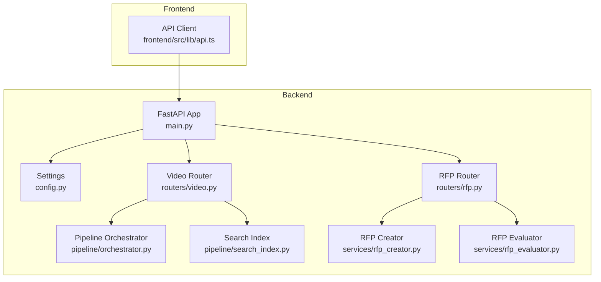
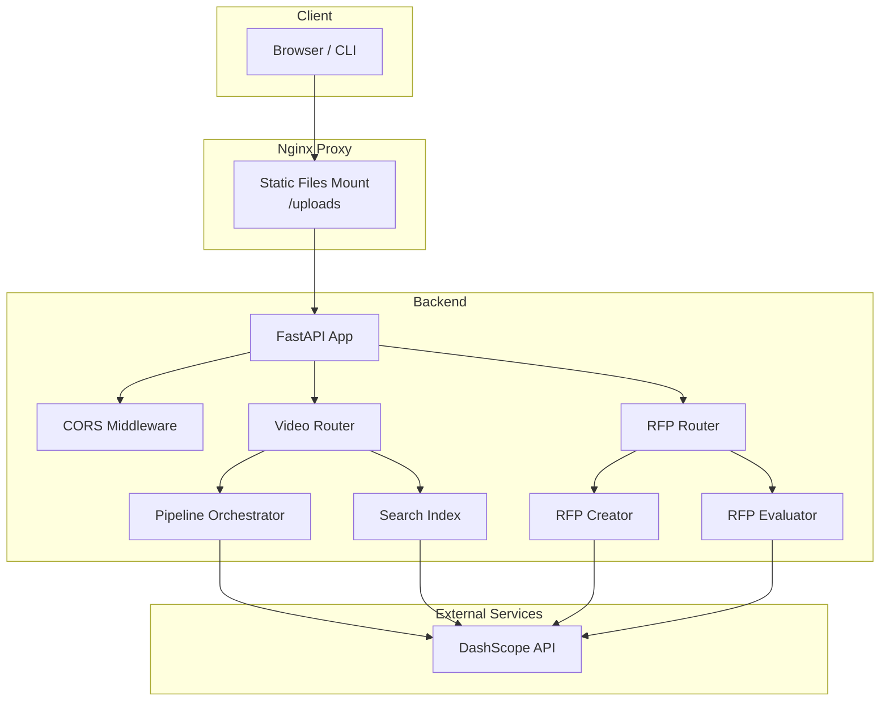
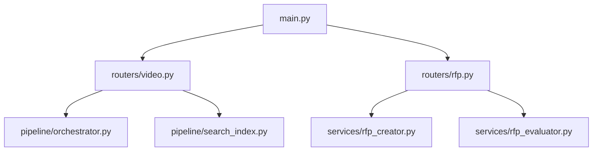

# Backend API Reference

<cite>
**Referenced Files in This Document**
- [main.py](file://backend/main.py)
- [config.py](file://backend/config.py)
- [video.py](file://backend/routers/video.py)
- [rfp.py](file://backend/routers/rfp.py)
- [orchestrator.py](file://backend/pipeline/orchestrator.py)
- [search_index.py](file://backend/pipeline/search_index.py)
- [rfp_creator.py](file://backend/services/rfp_creator.py)
- [rfp_evaluator.py](file://backend/services/rfp_evaluator.py)
- [api.ts](file://frontend/src/lib/api.ts)
- [requirements.txt](file://backend/requirements.txt)
- [docker-compose.yml](file://docker-compose.yml)
- [README.md](file://README.md)
</cite>

## Table of Contents
1. [Introduction](#introduction)
2. [Project Structure](#project-structure)
3. [Core Components](#core-components)
4. [Architecture Overview](#architecture-overview)
5. [Detailed Component Analysis](#detailed-component-analysis)
6. [Dependency Analysis](#dependency-analysis)
7. [Performance Considerations](#performance-considerations)
8. [Troubleshooting Guide](#troubleshooting-guide)
9. [Conclusion](#conclusion)
10. [Appendices](#appendices)

## Introduction
This document provides comprehensive API documentation for the Dubai Media backend REST and WebSocket APIs. It covers all HTTP endpoints including POST /api/video/upload, GET /api/video/{id}/status, GET /api/video/{id}/metadata, POST /api/search, and all RFP-related endpoints. It also documents the WebSocket endpoint /ws/pipeline/{id} for real-time progress tracking, along with request/response schemas, parameter specifications, authentication methods, error handling patterns, health checks, API versioning, rate limiting considerations, CORS configuration, and client integration patterns. Practical examples using curl and JavaScript fetch are included, alongside troubleshooting guidance and performance optimization tips.

## Project Structure
The backend is implemented with FastAPI and organized into routers, services, and pipeline modules. The frontend provides a typed API client and WebSocket helpers for seamless integration.



**Diagram sources**
- [main.py:1-44](file://backend/main.py#L1-L44)
- [video.py:1-267](file://backend/routers/video.py#L1-L267)
- [rfp.py:1-385](file://backend/routers/rfp.py#L1-L385)
- [orchestrator.py:1-329](file://backend/pipeline/orchestrator.py#L1-L329)
- [search_index.py:1-245](file://backend/pipeline/search_index.py#L1-L245)
- [rfp_creator.py:1-639](file://backend/services/rfp_creator.py#L1-L639)
- [rfp_evaluator.py:1-622](file://backend/services/rfp_evaluator.py#L1-L622)
- [api.ts:1-245](file://frontend/src/lib/api.ts#L1-L245)

**Section sources**
- [main.py:1-44](file://backend/main.py#L1-L44)
- [README.md:148-168](file://README.md#L148-L168)

## Core Components
- FastAPI Application: Initializes CORS, mounts static uploads, includes routers, and exposes a health check endpoint.
- Video Router: Implements upload, status, metadata, transcript, search, and WebSocket progress endpoints.
- RFP Router: Implements RFP creation, regeneration, exports, vendor evaluation, and evaluation status/results endpoints.
- Pipeline Orchestrator: Coordinates six-stage video processing pipeline with progress callbacks and status persistence.
- Search Index: FAISS-backed vector search using DashScope embeddings.
- RFP Creator/Evaluator Services: AI-driven RFP generation and vendor evaluation powered by DashScope.

**Section sources**
- [main.py:20-44](file://backend/main.py#L20-L44)
- [video.py:23-267](file://backend/routers/video.py#L23-L267)
- [rfp.py:15-385](file://backend/routers/rfp.py#L15-L385)
- [orchestrator.py:34-207](file://backend/pipeline/orchestrator.py#L34-L207)
- [search_index.py:22-196](file://backend/pipeline/search_index.py#L22-L196)
- [rfp_creator.py:67-151](file://backend/services/rfp_creator.py#L67-L151)
- [rfp_evaluator.py:39-104](file://backend/services/rfp_evaluator.py#L39-L104)

## Architecture Overview
The backend exposes REST endpoints and WebSocket streams. The frontend integrates via a typed API client and WebSocket helpers. Nginx proxies static uploads and forwards requests to the backend.



**Diagram sources**
- [main.py:27-38](file://backend/main.py#L27-L38)
- [video.py:23-267](file://backend/routers/video.py#L23-L267)
- [rfp.py:15-385](file://backend/routers/rfp.py#L15-L385)
- [orchestrator.py:34-42](file://backend/pipeline/orchestrator.py#L34-L42)
- [search_index.py:22-36](file://backend/pipeline/search_index.py#L22-L36)
- [rfp_creator.py:70-74](file://backend/services/rfp_creator.py#L70-L74)
- [rfp_evaluator.py:42-46](file://backend/services/rfp_evaluator.py#L42-L46)

## Detailed Component Analysis

### REST Endpoints

#### POST /api/video/upload
- Description: Upload a video file and start the processing pipeline in the background.
- Authentication: None (MVP).
- Request
  - Content-Type: multipart/form-data
  - Body Fields:
    - file: binary file (MP4/MOV recommended)
- Response
  - 200 OK: JSON object containing video_id, filename, status, and message
  - 500 Internal Server Error: Failed to save uploaded file
- Implementation Details
  - Saves file to uploads directory with UUID-based filename
  - Creates initial status.json with queued state and pending stages
  - Starts background pipeline via orchestrator
- Example
  - curl: 
    ```bash
    curl -X POST http://localhost:8000/api/video/upload -F file=@video.mp4
    ```
  - JavaScript fetch:
    ```javascript
    const formData = new FormData();
    formData.append("file", fileInput.files[0]);
    const res = await fetch("http://localhost:8000/api/video/upload", {
      method: "POST",
      body: formData,
    });
    const data = await res.json();
    ```

**Section sources**
- [video.py:39-92](file://backend/routers/video.py#L39-L92)
- [api.ts:167-167](file://frontend/src/lib/api.ts#L167-L167)

#### GET /api/video/{video_id}/status
- Description: Read the current pipeline status for a video.
- Authentication: None.
- Path Parameters
  - video_id: string (UUID)
- Response
  - 200 OK: JSON status object with fields: video_id, status, progress, stages, filename, timestamps
  - 404 Not Found: Video not found
  - 500 Internal Server Error: Failed to read status
- Example
  - curl:
    ```bash
    curl http://localhost:8000/api/video/<video_id>/status
    ```
  - JavaScript fetch:
    ```javascript
    const status = await api.video.getStatus("<video_id>");
    ```

**Section sources**
- [video.py:124-138](file://backend/routers/video.py#L124-L138)
- [api.ts:169-169](file://frontend/src/lib/api.ts#L169-L169)

#### GET /api/video/{video_id}/metadata
- Description: Retrieve structured metadata for a processed video.
- Authentication: None.
- Path Parameters
  - video_id: string (UUID)
- Response
  - 200 OK: JSON object containing ingestion, visual_analysis, metadata, faces, and video_id
  - 404 Not Found: No metadata available yet
- Example
  - curl:
    ```bash
    curl http://localhost:8000/api/video/<video_id>/metadata
    ```
  - JavaScript fetch:
    ```javascript
    const metadata = await api.video.getMetadata("<video_id>");
    ```

**Section sources**
- [video.py:143-174](file://backend/routers/video.py#L143-L174)
- [api.ts:170-170](file://frontend/src/lib/api.ts#L170-L170)

#### GET /api/video/{video_id}/transcript
- Description: Retrieve the transcript for a processed video.
- Authentication: None.
- Path Parameters
  - video_id: string (UUID)
- Response
  - 200 OK: JSON transcript object with video_id
  - 404 Not Found: Transcript not found
  - 500 Internal Server Error: Failed to read transcript
- Example
  - curl:
    ```bash
    curl http://localhost:8000/api/video/<video_id>/transcript
    ```
  - JavaScript fetch:
    ```javascript
    const transcript = await api.video.getTranscript("<video_id>");
    ```

**Section sources**
- [video.py:179-195](file://backend/routers/video.py#L179-L195)
- [api.ts:172-172](file://frontend/src/lib/api.ts#L172-L172)

#### POST /api/search
- Description: Search across all indexed videos using natural language.
- Authentication: None.
- Request Body
  - query: string (required)
  - top_k: integer (optional, default 5)
- Response
  - 200 OK: JSON object with query, results, and total count
  - 500 Internal Server Error: Search failed
- Example
  - curl:
    ```bash
    curl -X POST http://localhost:8000/api/search -H "Content-Type: application/json" -d '{"query":"aerial shot of Dubai skyline","top_k":5}'
    ```
  - JavaScript fetch:
    ```javascript
    const results = await api.video.search("aerial shot of Dubai skyline", 5);
    ```

**Section sources**
- [video.py:200-215](file://backend/routers/video.py#L200-L215)
- [api.ts:174-178](file://frontend/src/lib/api.ts#L174-L178)

#### GET /api/health
- Description: Health check endpoint.
- Authentication: None.
- Response
  - 200 OK: JSON object with status and service fields
- Example
  - curl:
    ```bash
    curl http://localhost:8000/api/health
    ```
  - JavaScript fetch:
    ```javascript
    const health = await api.health();
    ```

**Section sources**
- [main.py:41-43](file://backend/main.py#L41-L43)
- [api.ts:243-243](file://frontend/src/lib/api.ts#L243-L243)

#### RFP Endpoints

##### POST /api/rfp/create
- Description: Generate an RFP document from structured input.
- Authentication: None.
- Request Body (JSON)
  - project_title: string
  - project_overview: string
  - scope_of_work: string (optional)
  - technical_requirements: array of strings (optional)
  - evaluation_criteria: array of objects with name, weight, description (optional)
  - timeline: object with start_date, end_date, milestones (optional)
  - budget_range: object with min, max, currency (optional)
  - compliance_requirements: array of strings (optional)
  - industry: string (default "Broadcasting")
  - language: string (default "en")
  - tone: string (default "formal")
- Response
  - 200 OK: JSON object with rfp_id, title, status, sections, language
  - 400 Bad Request: Validation error
  - 502 Bad Gateway: AI generation failure
- Example
  - curl:
    ```bash
    curl -X POST http://localhost:8000/api/rfp/create -H "Content-Type: application/json" -d '{"project_title":"Demo Project","project_overview":"Overview","evaluation_criteria":[{"name":"Technical","weight":50,"description":""},{"name":"Commercial","weight":50,"description":""}]}'
    ```
  - JavaScript fetch:
    ```javascript
    const rfp = await api.rfp.create({
      project_title: "Demo Project",
      project_overview: "Overview",
      evaluation_criteria: [{ name: "Technical", weight: 50 }, { name: "Commercial", weight: 50 }]
    });
    ```

**Section sources**
- [rfp.py:97-130](file://backend/routers/rfp.py#L97-L130)
- [api.ts:187-191](file://frontend/src/lib/api.ts#L187-L191)

##### POST /api/rfp/regenerate-section
- Description: Regenerate a single section of an existing RFP.
- Authentication: None.
- Request Body (JSON)
  - rfp_id: string
  - section_name: string
  - instructions: string (optional)
- Response
  - 200 OK: JSON object with rfp_id, section_name, content, status
  - 400 Bad Request: Validation error
  - 502 Bad Gateway: AI regeneration failure
- Example
  - curl:
    ```bash
    curl -X POST http://localhost:8000/api/rfp/regenerate-section -H "Content-Type: application/json" -d '{"rfp_id":"<rfp_id>","section_name":"Scope of Work","instructions":"Expand on deliverables"}'
    ```

**Section sources**
- [rfp.py:133-167](file://backend/routers/rfp.py#L133-L167)

##### GET /api/rfp/{id}/export/docx
- Description: Download RFP as DOCX.
- Authentication: None.
- Path Parameters
  - rfp_id: string
- Response
  - 200 OK: application/vnd.openxmlformats-officedocument.wordprocessingml.document
  - 500 Internal Server Error: DOCX generation failed

**Section sources**
- [rfp.py:170-183](file://backend/routers/rfp.py#L170-L183)
- [api.ts:201-208](file://frontend/src/lib/api.ts#L201-L208)

##### GET /api/rfp/{id}/export/pdf
- Description: Download RFP as PDF.
- Authentication: None.
- Path Parameters
  - rfp_id: string
- Response
  - 200 OK: application/pdf
  - 500 Internal Server Error: PDF generation failed

**Section sources**
- [rfp.py:186-199](file://backend/routers/rfp.py#L186-L199)
- [api.ts:205-208](file://frontend/src/lib/api.ts#L205-L208)

##### POST /api/rfp/evaluate
- Description: Start vendor evaluation with background processing.
- Authentication: None.
- Request
  - Content-Type: multipart/form-data
  - Body Fields:
    - rfp_file: uploaded RFP file (PDF/DOCX)
    - vendor_files: array of uploaded vendor proposal files (PDF/DOCX)
    - vendor_names: JSON array of vendor names
    - criteria: JSON array of evaluation criteria
- Response
  - 200 OK: JSON object with eval_id, status, proposals_count, message
  - 400 Bad Request: Validation errors (JSON parsing, counts, requirements)
  - 500 Internal Server Error: Evaluation startup failure
- Example
  - curl:
    ```bash
    curl -X POST http://localhost:8000/api/rfp/evaluate -F rfp_file=@rfp.pdf -F vendor_files=@vendor1.pdf -F vendor_files=@vendor2.pdf -F vendor_names='["Vendor A","Vendor B"]' -F criteria='["Technical","Commercial","Past Experience"]'
    ```

**Section sources**
- [rfp.py:243-311](file://backend/routers/rfp.py#L243-L311)
- [api.ts:209-219](file://frontend/src/lib/api.ts#L209-L219)

##### GET /api/rfp/evaluation/{eval_id}/status
- Description: Get evaluation progress and status.
- Authentication: None.
- Path Parameters
  - eval_id: string
- Response
  - 200 OK: JSON object with eval_id, status, progress, proposals_evaluated, error, message
- Example
  - curl:
    ```bash
    curl http://localhost:8000/api/rfp/evaluation/<eval_id>/status
    ```

**Section sources**
- [rfp.py:314-329](file://backend/routers/rfp.py#L314-L329)
- [api.ts:221-229](file://frontend/src/lib/api.ts#L221-L229)

##### GET /api/rfp/evaluation/{eval_id}/results
- Description: Get evaluation results when completed.
- Authentication: None.
- Path Parameters
  - eval_id: string
- Response
  - 200 OK: JSON object with eval_id, status, results
  - 400 Bad Request: Evaluation not yet completed
- Example
  - curl:
    ```bash
    curl http://localhost:0/api/rfp/evaluation/<eval_id>/results
    ```

**Section sources**
- [rfp.py:332-346](file://backend/routers/rfp.py#L332-L346)
- [api.ts:230-233](file://frontend/src/lib/api.ts#L230-L233)

##### GET /api/rfp/evaluation/{eval_id}/export/xlsx
- Description: Export evaluation results as XLSX.
- Authentication: None.
- Path Parameters
  - eval_id: string
- Response
  - 200 OK: application/vnd.openxmlformats-officedocument.spreadsheetml.sheet
  - 400 Bad Request: Evaluation not completed yet
  - 500 Internal Server Error: XLSX generation failed

**Section sources**
- [rfp.py:349-365](file://backend/routers/rfp.py#L349-L365)
- [api.ts:234-239](file://frontend/src/lib/api.ts#L234-L239)

##### GET /api/rfp/evaluation/{eval_id}/export/pdf
- Description: Export evaluation results as PDF.
- Authentication: None.
- Path Parameters
  - eval_id: string
- Response
  - 200 OK: application/pdf
  - 400 Bad Request: Evaluation not completed yet
  - 500 Internal Server Error: PDF generation failed

**Section sources**
- [rfp.py:368-384](file://backend/routers/rfp.py#L368-L384)
- [api.ts:237-239](file://frontend/src/lib/api.ts#L237-L239)

### WebSocket Endpoints

#### /ws/pipeline/{video_id}
- Description: Real-time progress tracking for video pipeline.
- Authentication: None.
- Path Parameters
  - video_id: string (UUID)
- Messages
  - Client receives periodic progress updates with fields: video_id, stage, message, progress, status
  - Client can send "ping" to keep connection alive
- Behavior
  - On connect, sends current status snapshot
  - Emits progress updates during pipeline execution
  - Disconnects automatically when pipeline completes
- Example
  - JavaScript:
    ```javascript
    const ws = api.video.connectPipeline("<video_id>", (data) => {
      console.log(`Stage: ${data.stage}, Progress: ${data.progress}%`);
    });
    ```

**Section sources**
- [video.py:220-266](file://backend/routers/video.py#L220-L266)
- [api.ts:179-182](file://frontend/src/lib/api.ts#L179-L182)

### Request/Response Schemas

#### Video Upload Response
- Fields: video_id, filename, status, message

#### Video Status Response
- Fields: video_id, status, progress, stages (ingestion, visual_analysis, audio_analysis, face_recognition, metadata_structuring, search_index), filename, created_at, updated_at, errors (optional)

#### Video Metadata Response
- Fields: ingestion, visual_analysis, metadata, faces, video_id

#### Search Response
- Fields: query, results (array), total (number)

#### RFP Create Response
- Fields: rfp_id, title, status, sections (array), language

#### RFP Regenerate Section Response
- Fields: rfp_id, section_name, content, status

#### Evaluation Start Response
- Fields: eval_id, status, proposals_count, message

#### Evaluation Status Response
- Fields: eval_id, status, progress, proposals_evaluated, error, message

#### Evaluation Results Response
- Fields: eval_id, status, results (object with vendors, recommendation, follow_up_questions)

**Section sources**
- [video.py:87-92](file://backend/routers/video.py#L87-L92)
- [video.py:124-138](file://backend/routers/video.py#L124-L138)
- [video.py:143-174](file://backend/routers/video.py#L143-L174)
- [video.py:200-215](file://backend/routers/video.py#L200-L215)
- [rfp.py:124-130](file://backend/routers/rfp.py#L124-L130)
- [rfp.py:162-167](file://backend/routers/rfp.py#L162-L167)
- [rfp.py:306-311](file://backend/routers/rfp.py#L306-L311)
- [rfp.py:314-329](file://backend/routers/rfp.py#L314-L329)
- [rfp.py:332-346](file://backend/routers/rfp.py#L332-L346)

### Authentication and Authorization
- Authentication: None (MVP). The application does not implement user authentication or API key protection.
- Security Implications: Exposed endpoints are publicly accessible. For production, add API key middleware, rate limiting, and input validation.

**Section sources**
- [README.md:188](file://README.md#L188)

### Error Handling Patterns
- HTTP Exceptions: Routers raise HTTPException with appropriate status codes and detail messages.
- Pipeline Failures: Orchestrator writes error details to status.json and emits failed status via WebSocket.
- Search/Index Failures: SearchIndex logs warnings and returns empty results when FAISS is unavailable.
- AI Service Failures: Services wrap DashScope calls with retries and raise ValueError/RuntimeError on failures.

**Section sources**
- [video.py:57-59](file://backend/routers/video.py#L57-L59)
- [video.py:136-138](file://backend/routers/video.py#L136-L138)
- [video.py:166-168](file://backend/routers/video.py#L166-L168)
- [video.py:194-195](file://backend/routers/video.py#L194-L195)
- [video.py:213-215](file://backend/routers/video.py#L213-L215)
- [video.py:118-120](file://backend/routers/video.py#L118-L120)
- [search_index.py:61-64](file://backend/pipeline/search_index.py#L61-L64)
- [rfp_creator.py:78-81](file://backend/services/rfp_creator.py#L78-L81)
- [rfp_evaluator.py:49-53](file://backend/services/rfp_evaluator.py#L49-L53)

### API Versioning Approach
- Version: 0.1.0 (set in FastAPI app initialization).
- Strategy: Semantic versioning via app.version. No path-based versioning is used.

**Section sources**
- [main.py:23](file://backend/main.py#L23)

### CORS Configuration
- Allowed Origins: "*" (all origins)
- Allowed Methods: "*" (GET, POST, PUT, DELETE, OPTIONS, etc.)
- Allowed Headers: "*" (including credentials)
- Purpose: Enables cross-origin requests from the frontend.

**Section sources**
- [main.py:27-33](file://backend/main.py#L27-L33)

### Rate Limiting Considerations
- DashScope API: RFP Evaluator handles 429 responses with exponential backoff.
- Frontend: No client-side rate limiting is implemented.
- Recommendations:
  - Add server-side rate limiting middleware.
  - Implement client-side retry with jitter.
  - Consider queueing mechanisms for high-throughput scenarios.

**Section sources**
- [rfp_evaluator.py:74-80](file://backend/services/rfp_evaluator.py#L74-L80)

### API Client Integration Patterns
- Typed API Client: Provides convenience methods for all endpoints and WebSocket connections.
- Fetch Wrapper: Handles JSON serialization, error extraction, and URL construction.
- WebSocket Helper: Manages connection lifecycle and message parsing.

**Section sources**
- [api.ts:11-39](file://frontend/src/lib/api.ts#L11-L39)
- [api.ts:67-99](file://frontend/src/lib/api.ts#L67-L99)
- [api.ts:164-244](file://frontend/src/lib/api.ts#L164-L244)

## Dependency Analysis



**Diagram sources**
- [main.py:37-38](file://backend/main.py#L37-L38)
- [video.py:17-19](file://backend/routers/video.py#L17-L19)
- [rfp.py:11-13](file://backend/routers/rfp.py#L11-L13)
- [orchestrator.py:14-20](file://backend/pipeline/orchestrator.py#L14-L20)
- [search_index.py:13-14](file://backend/pipeline/search_index.py#L13-L14)
- [rfp_creator.py:30](file://backend/services/rfp_creator.py#L30)
- [rfp_evaluator.py:29](file://backend/services/rfp_evaluator.py#L29)

**Section sources**
- [requirements.txt:1-16](file://backend/requirements.txt#L1-L16)

## Performance Considerations
- Large Videos: Long videos may exceed token/time limits for visual analysis; consider pre-processing or chunking.
- ASR Latency: Transcription is asynchronous; monitor progress via status endpoint.
- FAISS Index: Embeddings are computed in batches; ensure adequate memory for large datasets.
- Static Files: Nginx serves uploads; ensure sufficient disk space and bandwidth.
- AI Calls: Implement retries and timeouts; consider caching frequently accessed prompts.

[No sources needed since this section provides general guidance]

## Troubleshooting Guide
- 404 Not Found
  - Video or metadata not found: Verify video_id and that processing completed.
  - Evaluation not found: Ensure eval_id is correct and evaluation started.
- 500 Internal Server Error
  - Upload/save failures: Check disk permissions and available space.
  - Status/read failures: Inspect status.json and logs.
  - Transcript/read failures: Confirm transcription file exists.
  - Search failures: Verify FAISS installation and API key.
- AI Generation Failures
  - DASHSCOPE_API_KEY missing: Set API key in .env.
  - DashScope API errors: Check rate limits and retry later.
- WebSocket Issues
  - Connection drops: Client should reconnect; server cleans disconnected clients.
  - No progress updates: Ensure pipeline is running and status.json exists.

**Section sources**
- [video.py:129-131](file://backend/routers/video.py#L129-L131)
- [video.py:170-171](file://backend/routers/video.py#L170-L171)
- [video.py:136-138](file://backend/routers/video.py#L136-L138)
- [video.py:194-195](file://backend/routers/video.py#L194-L195)
- [video.py:213-215](file://backend/routers/video.py#L213-L215)
- [rfp.py:116-119](file://backend/routers/rfp.py#L116-L119)
- [rfp_evaluator.py:74-80](file://backend/services/rfp_evaluator.py#L74-L80)

## Conclusion
The Dubai Media backend provides a robust REST and WebSocket API for video processing and RFP workflows. While the MVP lacks authentication and rate limiting, the architecture supports scalable enhancements. The typed frontend client simplifies integration, and the documented endpoints enable efficient automation and real-time monitoring.

[No sources needed since this section summarizes without analyzing specific files]

## Appendices

### API Endpoints Summary
- Video
  - POST /api/video/upload
  - GET /api/video/{id}/status
  - GET /api/video/{id}/metadata
  - GET /api/video/{id}/transcript
  - POST /api/search
  - WS /ws/pipeline/{id}
- RFP
  - POST /api/rfp/create
  - POST /api/rfp/regenerate-section
  - GET /api/rfp/{id}/export/docx
  - GET /api/rfp/{id}/export/pdf
  - POST /api/rfp/evaluate
  - GET /api/rfp/evaluation/{id}/status
  - GET /api/rfp/evaluation/{id}/results
  - GET /api/rfp/evaluation/{id}/export/xlsx
  - GET /api/rfp/evaluation/{id}/export/pdf
- System
  - GET /api/health

**Section sources**
- [README.md:148-168](file://README.md#L148-L168)

### Environment Variables
- DASHSCOPE_API_KEY: Required for AI services
- DASHSCOPE_BASE_URL: DashScope API base URL
- MODEL_VIDEO: Vision-language model
- MODEL_ASR: Speech-to-text model
- MODEL_TEXT: Text generation model
- MODEL_EMBEDDING: Text embedding model
- BASE_URL: Backend base URL for static file URLs

**Section sources**
- [config.py:4-12](file://backend/config.py#L4-L12)
- [README.md:112-125](file://README.md#L112-L125)

### Deployment Notes
- Docker Compose sets up backend, frontend, and Nginx with volume mounts for uploads.
- Nginx serves static uploads and proxies API requests.

**Section sources**
- [docker-compose.yml:1-43](file://docker-compose.yml#L1-L43)