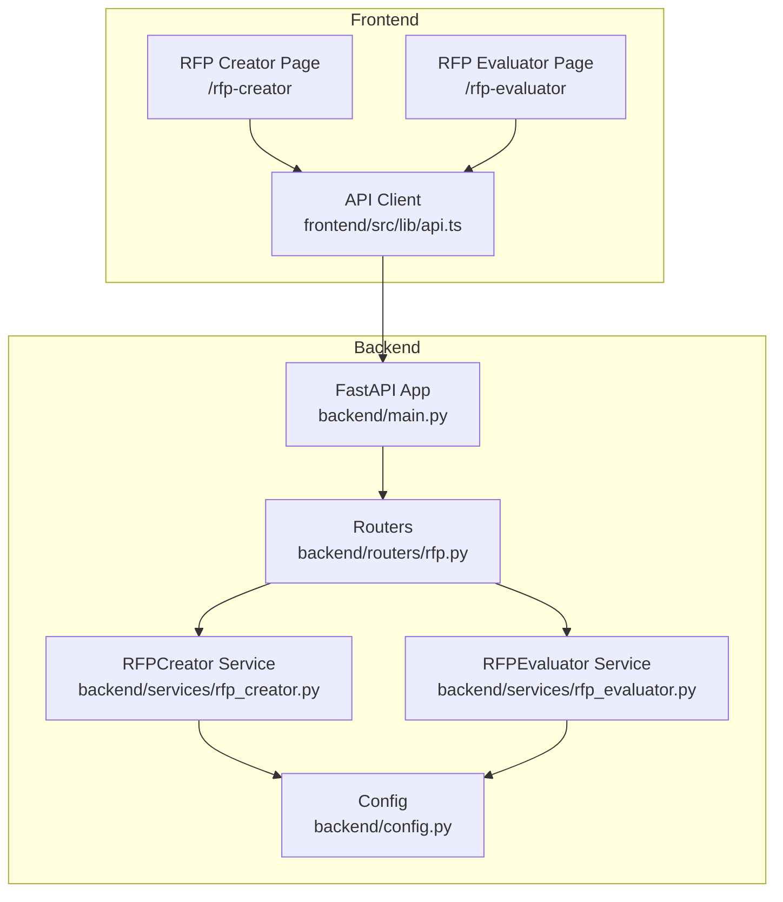
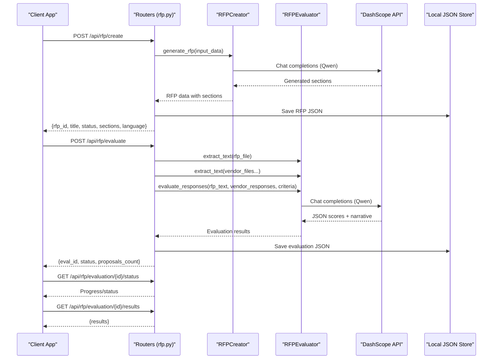
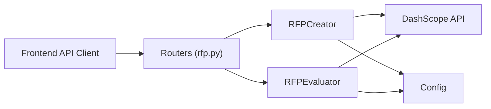

# RFP API Endpoints

<cite>
**Referenced Files in This Document**
- [backend/routers/rfp.py](file://backend/routers/rfp.py)
- [backend/services/rfp_creator.py](file://backend/services/rfp_creator.py)
- [backend/services/rfp_evaluator.py](file://backend/services/rfp_evaluator.py)
- [backend/config.py](file://backend/config.py)
- [backend/main.py](file://backend/main.py)
- [frontend/src/lib/api.ts](file://frontend/src/lib/api.ts)
- [frontend/src/app/rfp-creator/page.tsx](file://frontend/src/app/rfp-creator/page.tsx)
- [frontend/src/app/rfp-evaluator/page.tsx](file://frontend/src/app/rfp-evaluator/page.tsx)
- [README.md](file://README.md)
- [DEMO_SCRIPT.md](file://DEMO_SCRIPT.md)
</cite>

## Table of Contents
1. [Introduction](#introduction)
2. [Project Structure](#project-structure)
3. [Core Components](#core-components)
4. [Architecture Overview](#architecture-overview)
5. [Detailed Component Analysis](#detailed-component-analysis)
6. [Dependency Analysis](#dependency-analysis)
7. [Performance Considerations](#performance-considerations)
8. [Troubleshooting Guide](#troubleshooting-guide)
9. [Conclusion](#conclusion)
10. [Appendices](#appendices)

## Introduction
This document provides comprehensive API documentation for the RFP (Request for Proposal) endpoints, focusing on:
- POST /api/rfp/create: Generate procurement documents with bilingual support
- POST /api/rfp/evaluate: Evaluate vendor proposals with scoring and compliance checks
- Export endpoints for DOCX, PDF, XLSX
- Request/response schemas, document generation options, evaluation criteria setup
- Practical examples and integration patterns for RFP workflows
- Troubleshooting guidance for document generation and evaluation accuracy

The system integrates FastAPI backend services with AI models via DashScope, delivering professional RFP documents and explainable vendor evaluations.

## Project Structure
The RFP functionality spans backend routers and services, with frontend integration for user workflows.

**Diagram sources**
- [backend/main.py:15-44](file://backend/main.py#L15-L44)
- [backend/routers/rfp.py:15-385](file://backend/routers/rfp.py#L15-L385)
- [backend/services/rfp_creator.py:67-639](file://backend/services/rfp_creator.py#L67-L639)
- [backend/services/rfp_evaluator.py:39-622](file://backend/services/rfp_evaluator.py#L39-L622)
- [backend/config.py:4-21](file://backend/config.py#L4-L21)
- [frontend/src/lib/api.ts:164-244](file://frontend/src/lib/api.ts#L164-L244)

**Section sources**
- [README.md:148-168](file://README.md#L148-L168)
- [backend/main.py:35-38](file://backend/main.py#L35-L38)

## Core Components
- Routers define REST endpoints and request/response models for RFP creation and evaluation.
- Services encapsulate AI-driven logic for document generation and vendor evaluation.
- Config centralizes model and API settings.
- Frontend pages orchestrate user interactions and integrate with the API client.

Key responsibilities:
- Routers: Validate inputs, orchestrate service calls, persist intermediate states, and expose export endpoints.
- Services: Call DashScope APIs, build prompts, extract text from documents, generate exports, and compute weighted scores.
- Frontend: Provide forms, previews, and export actions; poll evaluation status until completion.

**Section sources**
- [backend/routers/rfp.py:15-385](file://backend/routers/rfp.py#L15-L385)
- [backend/services/rfp_creator.py:67-639](file://backend/services/rfp_creator.py#L67-L639)
- [backend/services/rfp_evaluator.py:39-622](file://backend/services/rfp_evaluator.py#L39-L622)
- [backend/config.py:4-21](file://backend/config.py#L4-L21)
- [frontend/src/lib/api.ts:164-244](file://frontend/src/lib/api.ts#L164-L244)

## Architecture Overview
High-level flow for RFP creation and evaluation:

**Diagram sources**
- [backend/routers/rfp.py:97-385](file://backend/routers/rfp.py#L97-L385)
- [backend/services/rfp_creator.py:124-151](file://backend/services/rfp_creator.py#L124-L151)
- [backend/services/rfp_evaluator.py:230-295](file://backend/services/rfp_evaluator.py#L230-L295)

## Detailed Component Analysis

### POST /api/rfp/create
Purpose: Generate a professional RFP document with bilingual support and customizable evaluation criteria.

Request Schema (RFPCreateRequest):
- project_title: string
- project_overview: string
- scope_of_work: string (optional)
- technical_requirements: string[] (optional)
- evaluation_criteria: array of EvaluationCriterion (optional)
  - name: string
  - weight: integer
  - description: string (optional)
- timeline: TimelineData (optional)
  - start_date: string
  - end_date: string
  - milestones: array of TimelineMilestone (optional)
    - name: string
    - date: string
- budget_range: BudgetRange (optional)
  - min: number
  - max: number
  - currency: string (default: "AED")
- compliance_requirements: string[] (optional)
- industry: string (default: "Broadcasting")
- language: string (allowed: "en", "ar", "both")
- tone: string (default: "formal")

Response Schema:
- rfp_id: string
- title: string
- status: string ("completed")
- sections: array of section objects
  - name: string
  - content_en: string (present for "en"/"both")
  - content_ar: string (present for "ar"/"both")
- language: string ("en", "ar", or "both")

Behavior:
- Generates 10 standard sections using Qwen via DashScope.
- Supports English, Arabic, or bilingual output.
- Saves RFP data to local JSON storage keyed by rfp_id.

Supported export formats:
- GET /api/rfp/{rfp_id}/export/docx
- GET /api/rfp/{rfp_id}/export/pdf

Practical example:
- Use the frontend RFP Creator page to submit project details and criteria.
- After successful generation, download DOCX or PDF.

Integration patterns:
- Frontend calls POST /api/rfp/create with typed payload.
- Frontend polls for export availability and downloads files.

**Section sources**
- [backend/routers/rfp.py:51-130](file://backend/routers/rfp.py#L51-L130)
- [backend/services/rfp_creator.py:124-151](file://backend/services/rfp_creator.py#L124-L151)
- [backend/routers/rfp.py:170-200](file://backend/routers/rfp.py#L170-L200)
- [frontend/src/lib/api.ts:186-208](file://frontend/src/lib/api.ts#L186-L208)
- [frontend/src/app/rfp-creator/page.tsx:17-32](file://frontend/src/app/rfp-creator/page.tsx#L17-L32)

### POST /api/rfp/regenerate-section
Purpose: Regenerate a single section of an existing RFP with optional instructions.

Request Schema (RegenerateSectionRequest):
- rfp_id: string
- section_name: string
- instructions: string (optional)

Response Schema:
- rfp_id: string
- section_name: string
- content: string (updated content)
- status: string ("completed")

Behavior:
- Loads stored RFP JSON, regenerates the specified section, and updates stored content.
- Handles bilingual content updates accordingly.

**Section sources**
- [backend/routers/rfp.py:65-167](file://backend/routers/rfp.py#L65-L167)
- [backend/services/rfp_creator.py:257-295](file://backend/services/rfp_creator.py#L257-L295)

### POST /api/rfp/evaluate
Purpose: Evaluate vendor proposals against an RFP using AI scoring and compliance checks.

Request (multipart/form-data):
- rfp_file: UploadFile (PDF/DOCX)
- vendor_files: array of UploadFile (PDF/DOCX)
- vendor_names: string (JSON array of vendor names)
- criteria: string (JSON array of evaluation criteria)

Each criterion object:
- name: string
- weight: integer
- description: string (optional)
- mandatory: boolean (optional)

Response Schema:
- eval_id: string
- status: string ("queued")
- proposals_count: number
- message: string (progress hint)

Evaluation lifecycle:
- Status endpoint: GET /api/rfp/evaluation/{id}/status
  - Returns status, progress, proposals_evaluated, error, and message.
- Results endpoint: GET /api/rfp/evaluation/{id}/results
  - Returns results when status is "completed".
- Export endpoints:
  - GET /api/rfp/evaluation/{id}/export/xlsx
  - GET /api/rfp/evaluation/{id}/export/pdf

Evaluation results schema:
- vendors: array of VendorResult
  - vendor_name: string
  - scores: array of ScoreItem
    - criterion: string
    - score: integer (1-10)
    - justification: string
    - evidence: string
  - weighted_total: number (normalized 0-100)
  - strengths: string[]
  - gaps: string[]
  - risks: string[]
  - mandatory_compliance: array of MandatoryCompliance
    - requirement: string
    - status: string ("pass")
    - note: string
- recommendation: string (narrative)
- follow_up_questions: Record<string, string[]> (vendor-specific questions)

Scoring mechanism:
- For each vendor, AI scores each criterion (1-10).
- Weights are normalized to compute a weighted_total out of 100.
- Compliance checks flag mandatory requirements.
- Explanations include evidence quotes from vendor responses.

**Section sources**
- [backend/routers/rfp.py:243-346](file://backend/routers/rfp.py#L243-L346)
- [backend/services/rfp_evaluator.py:230-295](file://backend/services/rfp_evaluator.py#L230-L295)
- [backend/services/rfp_evaluator.py:133-210](file://backend/services/rfp_evaluator.py#L133-L210)
- [frontend/src/app/rfp-evaluator/page.tsx:33-98](file://frontend/src/app/rfp-evaluator/page.tsx#L33-L98)

### Export Endpoints
RFP document exports:
- GET /api/rfp/{rfp_id}/export/docx
  - Returns DOCX binary with professional formatting.
- GET /api/rfp/{rfp_id}/export/pdf
  - Returns PDF binary with branded layout.

Evaluation report exports:
- GET /api/rfp/evaluation/{id}/export/xlsx
  - Returns XLSX with sheets: Comparison Matrix, Detailed Scores, Recommendation.
- GET /api/rfp/evaluation/{id}/export/pdf
  - Returns PDF with executive summary, comparison table, and vendor scorecards.

**Section sources**
- [backend/routers/rfp.py:170-200](file://backend/routers/rfp.py#L170-L200)
- [backend/routers/rfp.py:349-385](file://backend/routers/rfp.py#L349-L385)
- [backend/services/rfp_creator.py:297-555](file://backend/services/rfp_creator.py#L297-L555)
- [backend/services/rfp_evaluator.py:351-472](file://backend/services/rfp_evaluator.py#L351-L472)

## Dependency Analysis
- Router dependencies:
  - Depends on RFPCreator and RFPEvaluator services.
  - Uses settings for upload directories and DashScope configuration.
- Service dependencies:
  - RFPCreator: Calls DashScope chat completions, builds DOCX/PDF exports.
  - RFPEvaluator: Calls DashScope chat completions, extracts text from PDF/DOCX, exports XLSX/PDF.
- Frontend integration:
  - API client wraps fetch and WebSocket helpers.
  - Pages orchestrate workflow and export actions.

**Diagram sources**
- [backend/routers/rfp.py:15-385](file://backend/routers/rfp.py#L15-L385)
- [backend/services/rfp_creator.py:67-123](file://backend/services/rfp_creator.py#L67-L123)
- [backend/services/rfp_evaluator.py:39-104](file://backend/services/rfp_evaluator.py#L39-L104)
- [backend/config.py:4-21](file://backend/config.py#L4-L21)
- [frontend/src/lib/api.ts:164-244](file://frontend/src/lib/api.ts#L164-L244)

**Section sources**
- [backend/routers/rfp.py:15-17](file://backend/routers/rfp.py#L15-L17)
- [backend/services/rfp_creator.py:67-74](file://backend/services/rfp_creator.py#L67-L74)
- [backend/services/rfp_evaluator.py:39-46](file://backend/services/rfp_evaluator.py#L39-L46)

## Performance Considerations
- Async processing:
  - RFP generation calls DashScope asynchronously with retries and exponential backoff.
  - Vendor evaluation runs in background tasks; clients poll status endpoints.
- Token limits:
  - Responses are truncated to fit model context windows; ensure inputs are concise.
- Export generation:
  - DOCX/PDF/XLSX generation occurs server-side; large documents may increase latency.
- Rate limiting:
  - DashScope may return rate limit errors; services implement retry logic.

[No sources needed since this section provides general guidance]

## Troubleshooting Guide

Common issues and resolutions:
- Missing API key:
  - Symptom: DashScope API failures during generation/evaluation.
  - Resolution: Set DASHSCOPE_API_KEY in environment.
- Invalid multipart data:
  - Symptom: Validation errors when submitting evaluation.
  - Resolution: Ensure vendor_names and criteria are valid JSON arrays and match the number of vendor_files.
- Text extraction failures:
  - Symptom: Empty or partial RFP/vendor text.
  - Resolution: Verify file formats (PDF/DOCX) and content readability.
- Evaluation not completed:
  - Symptom: Results endpoint returns error because status is not "completed".
  - Resolution: Poll status endpoint until completion; check error field for details.
- Export generation failures:
  - Symptom: 500 errors when exporting DOCX/PDF/XLSX.
  - Resolution: Confirm evaluation/completion status and reattempt export.

Operational tips:
- Use the health endpoint to verify backend availability.
- For large documents, expect longer processing times; monitor progress via status endpoint.
- When testing bilingual content, confirm language selection and separator handling.

**Section sources**
- [backend/services/rfp_creator.py:76-122](file://backend/services/rfp_creator.py#L76-L122)
- [backend/services/rfp_evaluator.py:48-104](file://backend/services/rfp_evaluator.py#L48-L104)
- [backend/routers/rfp.py:253-278](file://backend/routers/rfp.py#L253-L278)
- [backend/routers/rfp.py:332-346](file://backend/routers/rfp.py#L332-L346)

## Conclusion
The RFP API suite delivers a complete workflow for generating professional, bilingual procurement documents and evaluating vendor proposals with AI-powered scoring and compliance checks. With robust export capabilities and clear integration patterns, it supports efficient RFP workflows in multilingual environments.

[No sources needed since this section summarizes without analyzing specific files]

## Appendices

### Request/Response Schemas Summary

RFP Creation:
- Request: RFPCreateRequest
- Response: RFPCreateResponse

Section Regeneration:
- Request: RegenerateSectionRequest
- Response: { rfp_id, section_name, content, status }

Evaluation:
- Request: multipart/form-data (rfp_file, vendor_files[], vendor_names JSON, criteria JSON)
- Response: { eval_id, status, proposals_count, message }
- Status: { eval_id, status, progress, proposals_evaluated, error, message }
- Results: EvaluationResults

Exports:
- RFP: DOCX/PDF
- Evaluation: XLSX/PDF

**Section sources**
- [backend/routers/rfp.py:51-130](file://backend/routers/rfp.py#L51-L130)
- [backend/routers/rfp.py:65-167](file://backend/routers/rfp.py#L65-L167)
- [backend/routers/rfp.py:243-346](file://backend/routers/rfp.py#L243-L346)
- [backend/services/rfp_evaluator.py:133-210](file://backend/services/rfp_evaluator.py#L133-L210)

### Practical Examples

RFP Creation Example:
- Use the RFP Creator page to submit project details and criteria.
- On success, download DOCX or PDF using export endpoints.

Vendor Evaluation Example:
- Upload RFP and vendor proposals.
- Define criteria with weights.
- Start evaluation, poll status, then view results and export reports.

**Section sources**
- [frontend/src/app/rfp-creator/page.tsx:17-32](file://frontend/src/app/rfp-creator/page.tsx#L17-L32)
- [frontend/src/app/rfp-evaluator/page.tsx:33-98](file://frontend/src/app/rfp-evaluator/page.tsx#L33-L98)
- [DEMO_SCRIPT.md:59-87](file://DEMO_SCRIPT.md#L59-L87)
- [DEMO_SCRIPT.md:90-119](file://DEMO_SCRIPT.md#L90-L119)