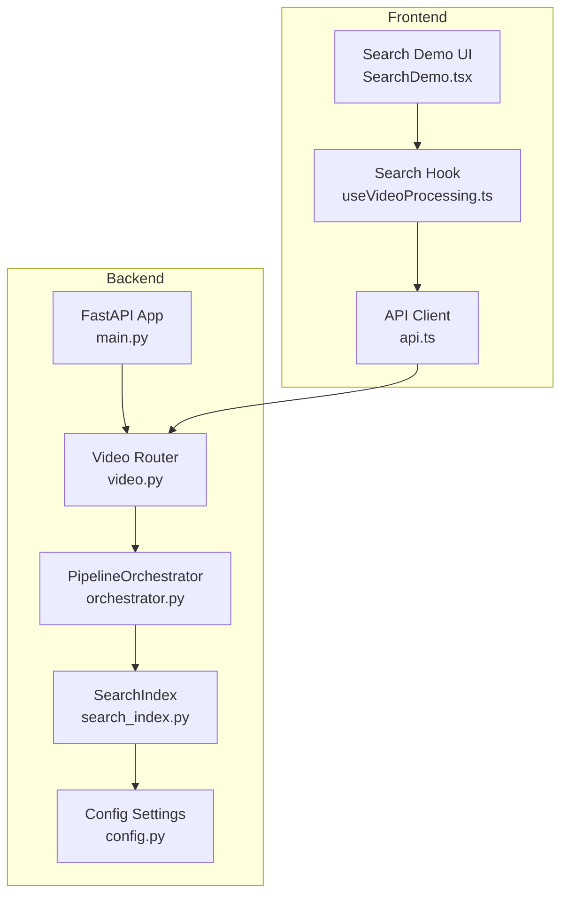
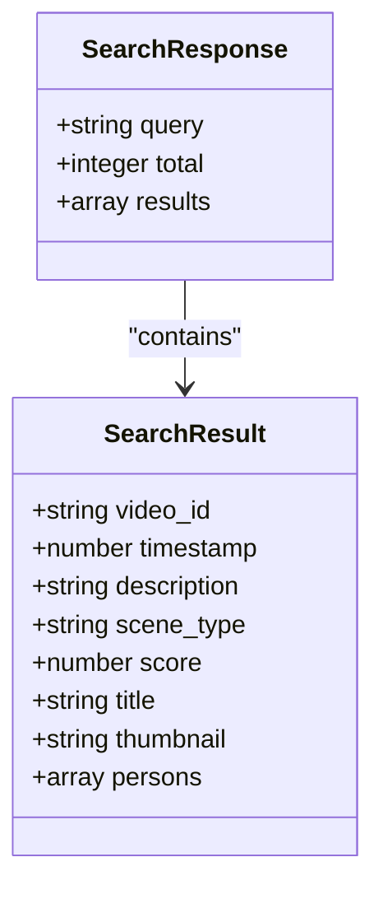
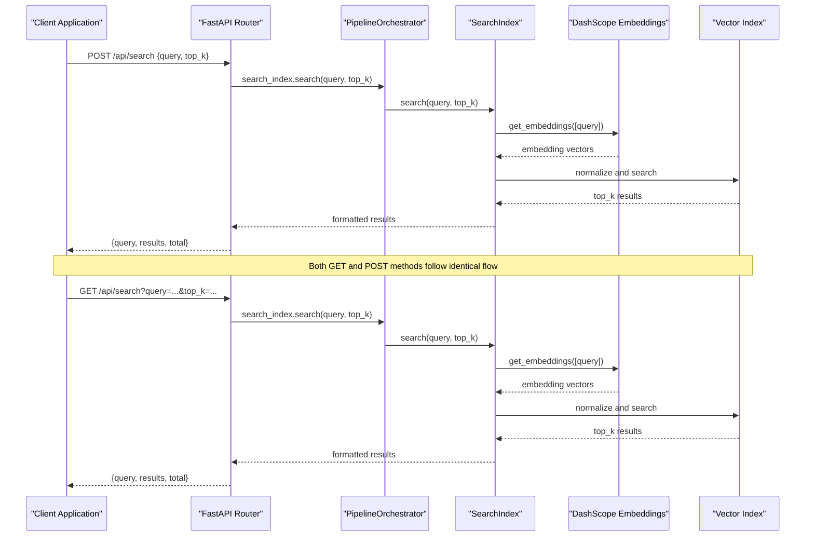
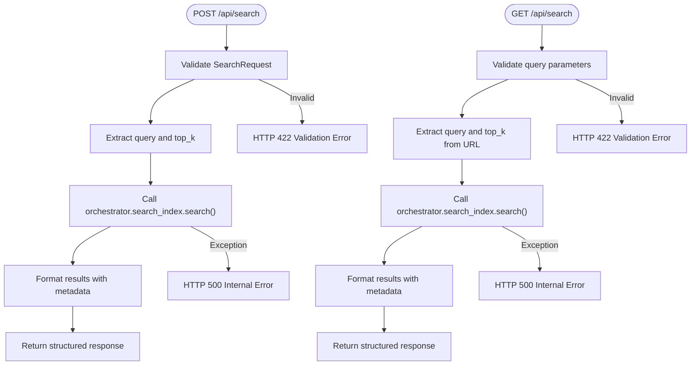
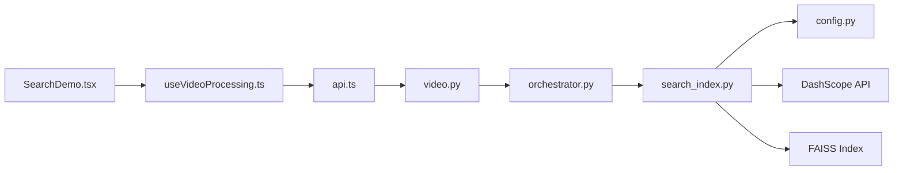

# Search Endpoint

<cite>
**Referenced Files in This Document**
- [main.py](file://backend/main.py)
- [video.py](file://backend/routers/video.py)
- [search_index.py](file://backend/pipeline/search_index.py)
- [orchestrator.py](file://backend/pipeline/orchestrator.py)
- [config.py](file://backend/config.py)
- [api.ts](file://frontend/src/lib/api.ts)
- [useVideoProcessing.ts](file://frontend/src/lib/useVideoProcessing.ts)
- [SearchDemo.tsx](file://frontend/src/components/archive/SearchDemo.tsx)
</cite>

## Update Summary
**Changes Made**
- Added dual HTTP method support documentation for semantic search (GET and POST)
- Updated search endpoint section to cover both GET and POST implementations
- Enhanced response format documentation with improved error handling
- Updated frontend integration examples to show both HTTP method patterns
- Added comprehensive examples for both GET and POST search requests

## Table of Contents
1. [Introduction](#introduction)
2. [Project Structure](#project-structure)
3. [Core Components](#core-components)
4. [Architecture Overview](#architecture-overview)
5. [Detailed Component Analysis](#detailed-component-analysis)
6. [Dual HTTP Method Support](#dual-http-method-support)
7. [Dependency Analysis](#dependency-analysis)
8. [Performance Considerations](#performance-considerations)
9. [Troubleshooting Guide](#troubleshooting-guide)
10. [Conclusion](#conclusion)

## Introduction
This document provides comprehensive API documentation for the semantic search endpoint. It covers both POST /api/search and GET /api/search endpoints, including request/response schemas, query processing details, result formatting, performance considerations, and integration examples for frontend applications.

## Project Structure
The search functionality spans both backend and frontend components with dual HTTP method support:



**Diagram sources**
- [main.py:1-44](file://backend/main.py#L1-L44)
- [video.py:198-234](file://backend/routers/video.py#L198-L234)
- [search_index.py:22-245](file://backend/pipeline/search_index.py#L22-L245)
- [orchestrator.py:34-329](file://backend/pipeline/orchestrator.py#L34-L329)
- [config.py:4-21](file://backend/config.py#L4-L21)

**Section sources**
- [main.py:1-44](file://backend/main.py#L1-L44)
- [video.py:198-234](file://backend/routers/video.py#L198-L234)

## Core Components
The search endpoint consists of several key components working together with dual HTTP method support:

### SearchRequest Model
The request model defines the structure for search queries:

| Field | Type | Required | Default | Description |
|-------|------|----------|---------|-------------|
| query | string | Yes | - | Natural language search query string |
| top_k | integer | No | 5 | Number of results to return (1-100) |

### Response Schema
The search endpoint returns a structured response:



**Diagram sources**
- [video.py:200-234](file://backend/routers/video.py#L200-L234)
- [search_index.py:241-257](file://backend/pipeline/search_index.py#L241-L257)

**Section sources**
- [video.py:33-36](file://backend/routers/video.py#L33-L36)
- [video.py:200-234](file://backend/routers/video.py#L200-L234)
- [search_index.py:241-257](file://backend/pipeline/search_index.py#L241-L257)

## Architecture Overview
The search architecture follows a pipeline-based approach with vector embeddings and supports both HTTP methods:



**Diagram sources**
- [video.py:200-234](file://backend/routers/video.py#L200-L234)
- [orchestrator.py:38-42](file://backend/pipeline/orchestrator.py#L38-L42)
- [search_index.py:214-257](file://backend/pipeline/search_index.py#L214-L257)

## Detailed Component Analysis

### Backend Implementation
The search endpoint is implemented in the video router with dual HTTP method support:



**Diagram sources**
- [video.py:200-234](file://backend/routers/video.py#L200-L234)
- [search_index.py:214-257](file://backend/pipeline/search_index.py#L214-L257)

**Section sources**
- [video.py:200-234](file://backend/routers/video.py#L200-L234)
- [search_index.py:214-257](file://backend/pipeline/search_index.py#L214-L257)

### Search Processing Details
The search pipeline processes queries through several stages:

1. **Query Validation**: Uses Pydantic model validation for request parameters
2. **Embedding Generation**: Converts natural language queries to vectors using DashScope
3. **Vector Normalization**: Normalizes vectors for cosine similarity calculation
4. **Index Search**: Performs FAISS vector similarity search
5. **Result Formatting**: Maps results to standardized response format with enhanced metadata

**Section sources**
- [search_index.py:214-257](file://backend/pipeline/search_index.py#L214-L257)
- [search_index.py:259-305](file://backend/pipeline/search_index.py#L259-L305)

### Frontend Integration
The frontend provides multiple integration patterns with dual HTTP method support:

#### Direct API Calls (POST Method)
```typescript
// Using the typed API client with POST method
const results = await api.video.search("sunset over Dubai Marina", 5);
```

#### Direct API Calls (GET Method)
```typescript
// Using fetch with GET parameters
const response = await fetch('/api/search?query=sunset%20over%20Dubai%20Marina&top_k=5');
const results = await response.json();
```

#### React Hook Integration
```typescript
const { search, searchResults, isSearching } = useVideoProcessing();
search("beach volleyball tournament");
```

#### UI Component Pattern
```tsx
<SearchDemo 
  searchResults={searchResults}
  isSearching={isSearching}
  searchQuery={searchQuery}
  onSearch={search}
/>
```

**Section sources**
- [api.ts:206-210](file://frontend/src/lib/api.ts#L206-L210)
- [useVideoProcessing.ts:447-463](file://frontend/src/lib/useVideoProcessing.ts#L447-L463)
- [SearchDemo.tsx:63-79](file://frontend/src/components/archive/SearchDemo.tsx#L63-L79)

## Dual HTTP Method Support

### POST Method Implementation
The POST endpoint accepts JSON payloads with the SearchRequest model:

**Endpoint**: `POST /api/search`
**Content-Type**: `application/json`

**Request Body**:
```json
{
  "query": "sunset over Dubai Marina with no people",
  "top_k": 5
}
```

**Response**:
```json
{
  "query": "sunset over Dubai Marina with no people",
  "results": [
    {
      "video_id": "abc123def456",
      "title": "Dubai Marina Sunset",
      "timestamp": 125.5,
      "description": "Golden sunset over Dubai Marina skyline",
      "scene_type": "landscape",
      "score": 0.87,
      "thumbnail": "/uploads/abc123def456/thumbnail.jpg",
      "persons": []
    }
  ],
  "total": 1
}
```

### GET Method Implementation
The GET endpoint accepts query parameters:

**Endpoint**: `GET /api/search?query=...&top_k=5`

**Query Parameters**:
- `query` (required): Natural language search query string
- `top_k` (optional): Number of results to return (default: 5)

**Response**: Identical to POST method response format

### HTTP Method Comparison

| Aspect | POST Method | GET Method |
|--------|-------------|------------|
| Request Format | JSON body | Query parameters |
| Payload Size | No practical limit | URL length limitations |
| Security | Better for sensitive queries | Visible in URLs/logs |
| Caching | Not cacheable | Browser/CDN cacheable |
| REST Compliance | More RESTful | Traditional web pattern |
| Error Handling | HTTP status codes | HTTP status codes |

**Section sources**
- [video.py:201-234](file://backend/routers/video.py#L201-L234)

## Dependency Analysis
The search functionality has the following dependencies:



**Diagram sources**
- [video.py:19-20](file://backend/routers/video.py#L19-L20)
- [orchestrator.py:20-42](file://backend/pipeline/orchestrator.py#L20-L42)
- [search_index.py:25-36](file://backend/pipeline/search_index.py#L25-L36)
- [config.py:4-12](file://backend/config.py#L4-L12)

**Section sources**
- [video.py:19-20](file://backend/routers/video.py#L19-L20)
- [orchestrator.py:20-42](file://backend/pipeline/orchestrator.py#L20-L42)
- [search_index.py:25-36](file://backend/pipeline/search_index.py#L25-L36)

## Performance Considerations

### Query Optimization Tips
1. **Specificity**: Include specific details like locations, activities, and objects
2. **Context**: Add temporal context (time of day, season) when relevant
3. **Quality**: Use clear, grammatically correct sentences
4. **Length**: Keep queries between 10-12 words for optimal performance

### Performance Characteristics
- **Index Size**: Search performance scales with indexed segment count
- **Embedding Cost**: Each query incurs DashScope API costs
- **Latency**: Typical response time 1-3 seconds depending on index size
- **Memory**: FAISS index loaded entirely into memory for fast searches

### Best Practices
- Ensure adequate video processing completion before search
- Use reasonable top_k values (1-20) for optimal results
- Cache frequently searched queries at the application level
- Monitor API key limits and rate limits
- Choose GET method for simple, cacheable queries
- Choose POST method for complex queries or when security is a concern

## Troubleshooting Guide

### Common Issues and Solutions

#### Empty Search Results
**Symptoms**: Empty results array returned
**Causes**: 
- No videos processed yet
- Insufficient content in processed videos
- API key not configured

**Solutions**:
1. Verify video processing pipeline completion
2. Check that videos have sufficient visual/audio content
3. Confirm DASHSCOPE_API_KEY is set in environment

#### API Key Errors
**Symptoms**: HTTP 500 errors with embedding failures
**Causes**: Invalid or missing API key
**Solutions**:
1. Set DASHSCOPE_API_KEY environment variable
2. Verify API key permissions
3. Check network connectivity to DashScope

#### Index Loading Failures
**Symptoms**: "faiss-cpu not installed" warnings
**Causes**: Missing FAISS dependency
**Solutions**:
1. Install faiss-cpu package
2. Verify Python environment compatibility
3. Check file system permissions for index directory

#### Performance Issues
**Symptoms**: Slow search responses
**Causes**:
- Large index size
- Network latency to embedding service
- High concurrent search requests

**Solutions**:
1. Optimize index size through selective processing
2. Implement local caching layer
3. Use connection pooling for embedding requests

#### HTTP Method Specific Issues
**GET Method Problems**:
- **URL Length Limits**: Very long queries may exceed URL limits
- **Caching Interference**: Cached responses may not reflect recent changes
- **Security Concerns**: Sensitive queries visible in logs

**POST Method Problems**:
- **Payload Size**: Large JSON payloads may cause timeouts
- **CORS Configuration**: May require additional CORS setup

**Section sources**
- [search_index.py:80-120](file://backend/pipeline/search_index.py#L80-L120)
- [search_index.py:214-257](file://backend/pipeline/search_index.py#L214-L257)
- [config.py:4-6](file://backend/config.py#L4-L6)

## Conclusion
The semantic search endpoint provides powerful natural language search capabilities over processed video content with dual HTTP method support. By combining vector embeddings with a FAISS-based similarity search, it enables intuitive discovery of relevant video segments. The implementation follows modern API design principles with proper validation, error handling, and comprehensive frontend integration patterns.

Key benefits include:
- Natural language query support via both GET and POST methods
- Real-time processing pipeline integration
- Scalable vector search architecture
- Comprehensive frontend integration examples
- Robust error handling and monitoring
- Flexible HTTP method selection based on use case requirements

The endpoint is production-ready with proper configuration management and performance considerations for enterprise-scale deployments. The dual HTTP method support provides flexibility for different integration scenarios while maintaining identical functionality and response formats.