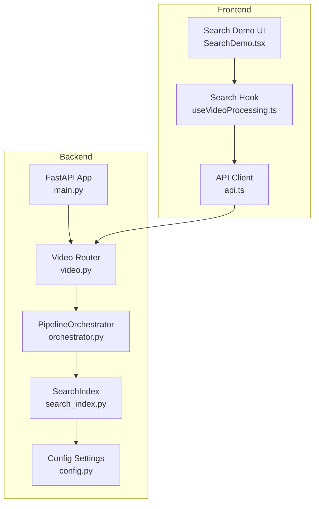
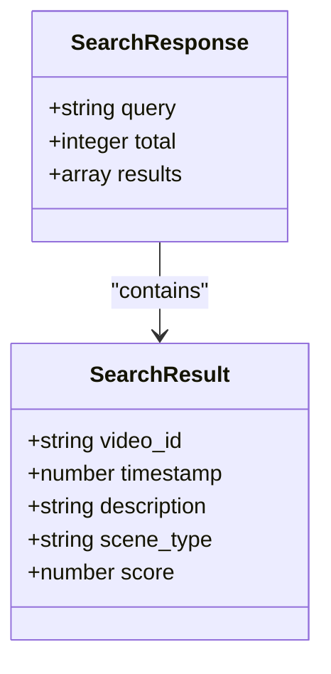
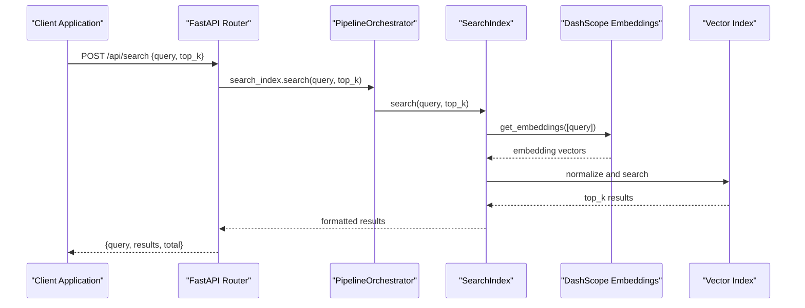
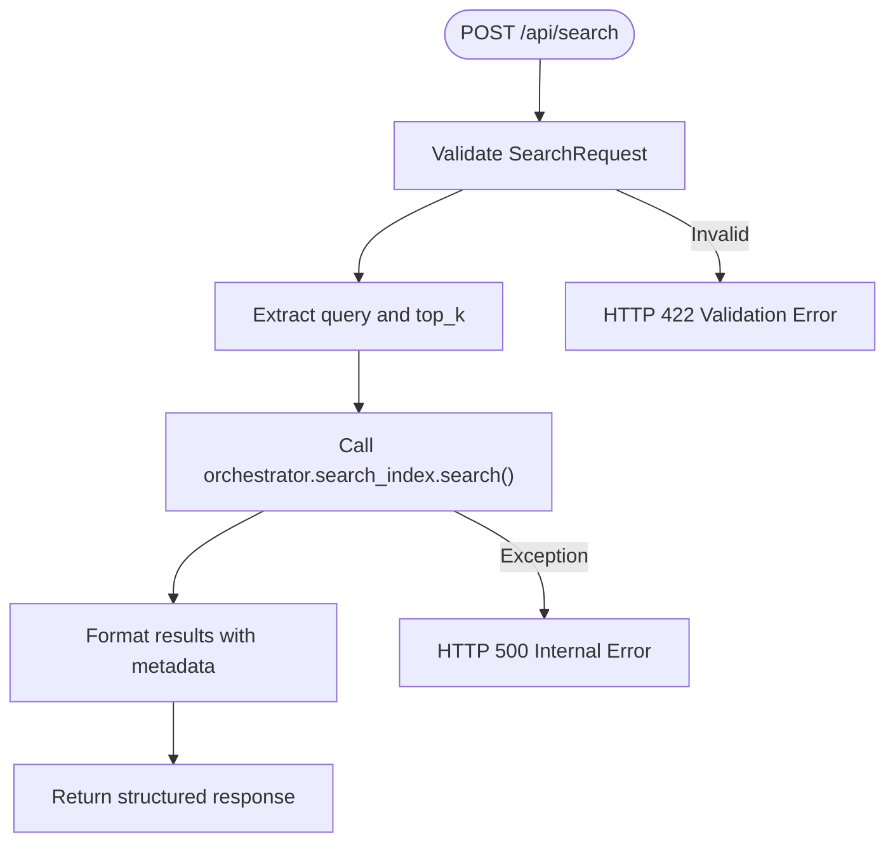
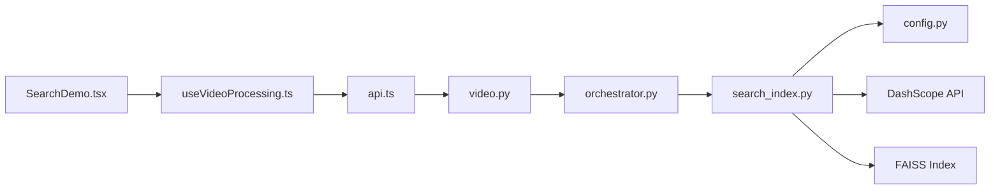

# Search Endpoint

<cite>
**Referenced Files in This Document**
- [main.py](file://backend/main.py)
- [video.py](file://backend/routers/video.py)
- [search_index.py](file://backend/pipeline/search_index.py)
- [orchestrator.py](file://backend/pipeline/orchestrator.py)
- [config.py](file://backend/config.py)
- [api.ts](file://frontend/src/lib/api.ts)
- [useVideoProcessing.ts](file://frontend/src/lib/useVideoProcessing.ts)
- [SearchDemo.tsx](file://frontend/src/components/archive/SearchDemo.tsx)
</cite>

## Table of Contents
1. [Introduction](#introduction)
2. [Project Structure](#project-structure)
3. [Core Components](#core-components)
4. [Architecture Overview](#architecture-overview)
5. [Detailed Component Analysis](#detailed-component-analysis)
6. [Dependency Analysis](#dependency-analysis)
7. [Performance Considerations](#performance-considerations)
8. [Troubleshooting Guide](#troubleshooting-guide)
9. [Conclusion](#conclusion)

## Introduction
This document provides comprehensive API documentation for the semantic search endpoint. It covers the POST /api/search endpoint, including request/response schemas, query processing details, result formatting, performance considerations, and integration examples for frontend applications.

## Project Structure
The search functionality spans both backend and frontend components:



**Diagram sources**
- [main.py:1-44](file://backend/main.py#L1-L44)
- [video.py:198-216](file://backend/routers/video.py#L198-L216)
- [search_index.py:22-245](file://backend/pipeline/search_index.py#L22-L245)
- [orchestrator.py:34-329](file://backend/pipeline/orchestrator.py#L34-L329)
- [config.py:4-21](file://backend/config.py#L4-L21)

**Section sources**
- [main.py:1-44](file://backend/main.py#L1-L44)
- [video.py:198-216](file://backend/routers/video.py#L198-L216)

## Core Components
The search endpoint consists of several key components working together:

### SearchRequest Model
The request model defines the structure for search queries:

| Field | Type | Required | Default | Description |
|-------|------|----------|---------|-------------|
| query | string | Yes | - | Natural language search query string |
| top_k | integer | No | 5 | Number of results to return (1-100) |

### Response Schema
The search endpoint returns a structured response:



**Diagram sources**
- [video.py:200-216](file://backend/routers/video.py#L200-L216)
- [search_index.py:156-196](file://backend/pipeline/search_index.py#L156-L196)

**Section sources**
- [video.py:32-35](file://backend/routers/video.py#L32-L35)
- [video.py:200-216](file://backend/routers/video.py#L200-L216)
- [search_index.py:156-196](file://backend/pipeline/search_index.py#L156-L196)

## Architecture Overview
The search architecture follows a pipeline-based approach with vector embeddings:



**Diagram sources**
- [video.py:200-216](file://backend/routers/video.py#L200-L216)
- [orchestrator.py:38-42](file://backend/pipeline/orchestrator.py#L38-L42)
- [search_index.py:156-196](file://backend/pipeline/search_index.py#L156-L196)
- [search_index.py:198-244](file://backend/pipeline/search_index.py#L198-L244)

## Detailed Component Analysis

### Backend Implementation
The search endpoint is implemented in the video router with the following flow:



**Diagram sources**
- [video.py:200-216](file://backend/routers/video.py#L200-L216)
- [search_index.py:156-196](file://backend/pipeline/search_index.py#L156-L196)

**Section sources**
- [video.py:200-216](file://backend/routers/video.py#L200-L216)
- [search_index.py:156-196](file://backend/pipeline/search_index.py#L156-L196)

### Search Processing Details
The search pipeline processes queries through several stages:

1. **Query Validation**: Uses Pydantic model validation for request parameters
2. **Embedding Generation**: Converts natural language queries to vectors using DashScope
3. **Vector Normalization**: Normalizes vectors for cosine similarity calculation
4. **Index Search**: Performs FAISS vector similarity search
5. **Result Formatting**: Maps results to standardized response format

**Section sources**
- [search_index.py:156-196](file://backend/pipeline/search_index.py#L156-L196)
- [search_index.py:198-244](file://backend/pipeline/search_index.py#L198-L244)

### Frontend Integration
The frontend provides multiple integration patterns:

#### Direct API Calls
```typescript
// Using the typed API client
const results = await api.video.search("sunset over Dubai Marina", 5);
```

#### React Hook Integration
```typescript
const { search, searchResults, isSearching } = useVideoProcessing();
search("beach volleyball tournament");
```

#### UI Component Pattern
```tsx
<SearchDemo 
  searchResults={searchResults}
  isSearching={isSearching}
  searchQuery={searchQuery}
  onSearch={search}
/>
```

**Section sources**
- [api.ts:174-178](file://frontend/src/lib/api.ts#L174-L178)
- [useVideoProcessing.ts:352-368](file://frontend/src/lib/useVideoProcessing.ts#L352-L368)
- [SearchDemo.tsx:30-44](file://frontend/src/components/archive/SearchDemo.tsx#L30-L44)

## Dependency Analysis
The search functionality has the following dependencies:



**Diagram sources**
- [video.py:19-20](file://backend/routers/video.py#L19-L20)
- [orchestrator.py:20-42](file://backend/pipeline/orchestrator.py#L20-L42)
- [search_index.py:25-36](file://backend/pipeline/search_index.py#L25-L36)
- [config.py:4-12](file://backend/config.py#L4-L12)

**Section sources**
- [video.py:19-20](file://backend/routers/video.py#L19-L20)
- [orchestrator.py:20-42](file://backend/pipeline/orchestrator.py#L20-L42)
- [search_index.py:25-36](file://backend/pipeline/search_index.py#L25-L36)

## Performance Considerations

### Query Optimization Tips
1. **Specificity**: Include specific details like locations, activities, and objects
2. **Context**: Add temporal context (time of day, season) when relevant
3. **Quality**: Use clear, grammatically correct sentences
4. **Length**: Keep queries between 10-12 words for optimal performance

### Performance Characteristics
- **Index Size**: Search performance scales with indexed segment count
- **Embedding Cost**: Each query incurs DashScope API costs
- **Latency**: Typical response time 1-3 seconds depending on index size
- **Memory**: FAISS index loaded entirely into memory for fast searches

### Best Practices
- Ensure adequate video processing completion before search
- Use reasonable top_k values (1-20) for optimal results
- Cache frequently searched queries at the application level
- Monitor API key limits and rate limits

## Troubleshooting Guide

### Common Issues and Solutions

#### Empty Search Results
**Symptoms**: Empty results array returned
**Causes**: 
- No videos processed yet
- Insufficient content in processed videos
- API key not configured

**Solutions**:
1. Verify video processing pipeline completion
2. Check that videos have sufficient visual/audio content
3. Confirm DASHSCOPE_API_KEY is set in environment

#### API Key Errors
**Symptoms**: HTTP 500 errors with embedding failures
**Causes**: Invalid or missing API key
**Solutions**:
1. Set DASHSCOPE_API_KEY environment variable
2. Verify API key permissions
3. Check network connectivity to DashScope

#### Index Loading Failures
**Symptoms**: "faiss-cpu not installed" warnings
**Causes**: Missing FAISS dependency
**Solutions**:
1. Install faiss-cpu package
2. Verify Python environment compatibility
3. Check file system permissions for index directory

#### Performance Issues
**Symptoms**: Slow search responses
**Causes**:
- Large index size
- Network latency to embedding service
- High concurrent search requests

**Solutions**:
1. Optimize index size through selective processing
2. Implement local caching layer
3. Use connection pooling for embedding requests

**Section sources**
- [search_index.py:61-70](file://backend/pipeline/search_index.py#L61-L70)
- [search_index.py:198-244](file://backend/pipeline/search_index.py#L198-L244)
- [config.py:4-6](file://backend/config.py#L4-L6)

## Conclusion
The semantic search endpoint provides powerful natural language search capabilities over processed video content. By combining vector embeddings with a FAISS-based similarity search, it enables intuitive discovery of relevant video segments. The implementation follows modern API design principles with proper validation, error handling, and comprehensive frontend integration patterns.

Key benefits include:
- Natural language query support
- Real-time processing pipeline integration
- Scalable vector search architecture
- Comprehensive frontend integration examples
- Robust error handling and monitoring

The endpoint is production-ready with proper configuration management and performance considerations for enterprise-scale deployments.