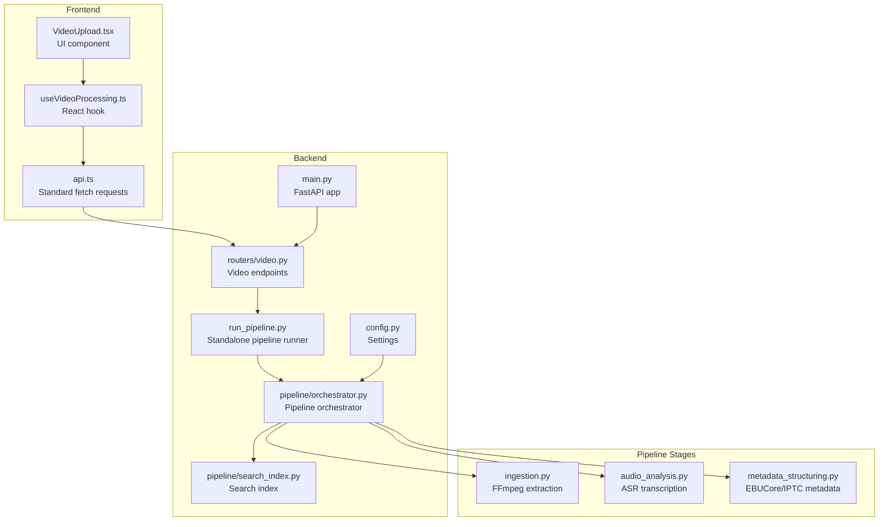
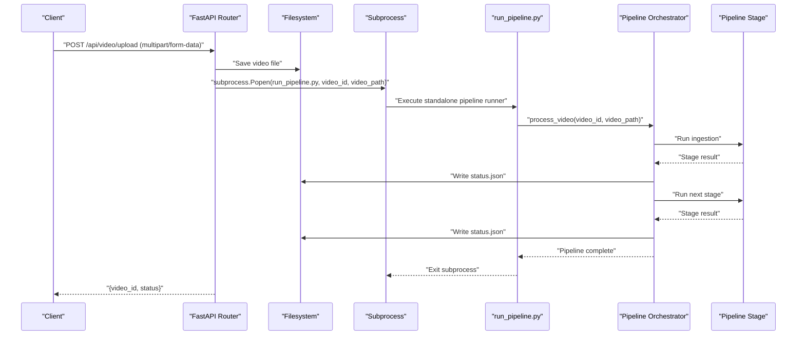
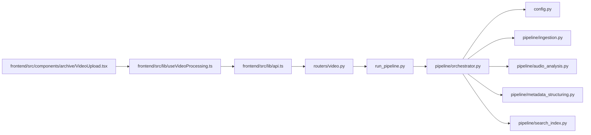

# Video Processing Endpoints

<cite>
**Referenced Files in This Document**
- [backend/routers/video.py](file://backend/routers/video.py)
- [backend/run_pipeline.py](file://backend/run_pipeline.py)
- [backend/pipeline/orchestrator.py](file://backend/pipeline/orchestrator.py)
- [backend/pipeline/search_index.py](file://backend/pipeline/search_index.py)
- [backend/config.py](file://backend/config.py)
- [backend/main.py](file://backend/main.py)
- [backend/pipeline/ingestion.py](file://backend/pipeline/ingestion.py)
- [backend/pipeline/audio_analysis.py](file://backend/pipeline/audio_analysis.py)
- [backend/pipeline/metadata_structuring.py](file://backend/pipeline/metadata_structuring.py)
- [frontend/src/lib/api.ts](file://frontend/src/lib/api.ts)
- [frontend/src/lib/useVideoProcessing.ts](file://frontend/src/lib/useVideoProcessing.ts)
- [frontend/src/components/archive/VideoUpload.tsx](file://frontend/src/components/archive/VideoUpload.tsx)
- [README.md](file://README.md)
</cite>

## Update Summary
**Changes Made**
- Updated POST /api/video/upload section to reflect subprocess-based execution model for enhanced reliability and process isolation
- Added documentation for the new standalone pipeline runner (run_pipeline.py) that executes as a separate process
- Updated architecture overview to show subprocess execution flow and process isolation benefits
- Enhanced troubleshooting guidance for subprocess execution and process isolation
- Maintained backward compatibility with existing API endpoints and response structures

## Table of Contents
1. [Introduction](#introduction)
2. [Project Structure](#project-structure)
3. [Core Components](#core-components)
4. [Architecture Overview](#architecture-overview)
5. [Detailed Component Analysis](#detailed-component-analysis)
6. [Dependency Analysis](#dependency-analysis)
7. [Performance Considerations](#performance-considerations)
8. [Troubleshooting Guide](#troubleshooting-guide)
9. [Conclusion](#conclusion)
10. [Appendices](#appendices)

## Introduction
This document provides comprehensive API documentation for the video processing endpoints that power the AI-powered media archive. It covers:
- POST /api/video/upload for video file uploads with subprocess-based execution model for enhanced reliability and process isolation
- GET /api/video/{video_id}/status for retrieving processing pipeline status with detailed progress information
- GET /api/video/{video_id}/metadata for accessing structured metadata results from all pipeline stages
- GET /api/video/{video_id}/transcript for retrieving speech-to-text transcripts
- GET/POST /api/search for semantic search with dual HTTP method support
- POST /api/reindex for rebuilding search indexes from existing processed videos

The documentation includes request/response schemas, error codes, file upload handling with subprocess execution, and practical examples using curl commands and JavaScript implementations.

## Project Structure
The video processing system consists of:
- FastAPI backend with routers and pipeline orchestration using subprocess-based execution for process isolation
- Standalone pipeline runner that executes as a separate process for enhanced reliability
- AI pipeline stages powered by Alibaba Cloud DashScope models
- Frontend client utilities for uploading and consuming the APIs



**Diagram sources**
- [backend/main.py:1-44](file://backend/main.py#L1-L44)
- [backend/routers/video.py:1-313](file://backend/routers/video.py#L1-L313)
- [backend/run_pipeline.py:1-29](file://backend/run_pipeline.py#L1-L29)
- [backend/pipeline/orchestrator.py:1-382](file://backend/pipeline/orchestrator.py#L1-L382)
- [backend/config.py:1-30](file://backend/config.py#L1-L30)
- [backend/pipeline/search_index.py:1-306](file://backend/pipeline/search_index.py#L1-L306)

**Section sources**
- [README.md:148-168](file://README.md#L148-L168)
- [backend/main.py:1-44](file://backend/main.py#L1-L44)

## Core Components
- Video upload router: Handles multipart/form-data uploads, saves files, initializes status, and launches the pipeline as a completely separate subprocess for process isolation and enhanced reliability
- Standalone pipeline runner: Executes the pipeline in a separate Python process with full isolation from the main API server
- Pipeline orchestrator: Coordinates six stages with progress tracking and error handling using async/await patterns
- Search index: Manages FAISS-based vector search with DashScope text embeddings and rebuild capability
- Frontend API utilities: Provide standard fetch-based upload functionality and typed helpers for uploads, status polling, and WebSocket progress streaming

Key capabilities:
- Process isolation through subprocess execution prevents pipeline failures from affecting the main API server
- Enhanced reliability with automatic process recovery and resource isolation
- Structured metadata generation (EBUCore XML, IPTC)
- Speech-to-text with speaker diarization
- Semantic search with dual HTTP method support (GET/POST)
- Batch reindexing from existing processed videos

**Section sources**
- [backend/routers/video.py:41-102](file://backend/routers/video.py#L41-L102)
- [backend/run_pipeline.py:1-29](file://backend/run_pipeline.py#L1-L29)
- [backend/pipeline/orchestrator.py:44-206](file://backend/pipeline/orchestrator.py#L44-L206)
- [backend/pipeline/search_index.py:59-306](file://backend/pipeline/search_index.py#L59-L306)
- [frontend/src/lib/api.ts:43-95](file://frontend/src/lib/api.ts#L43-L95)

## Architecture Overview
The system follows a staged pipeline architecture with subprocess-based execution and process isolation:
1. Upload endpoint receives multipart/form-data via standard HTTP requests
2. Main API server creates a separate subprocess that runs the pipeline independently
3. Subprocess executes the orchestrator which runs stages sequentially with optimized status updates
4. Progress updates are streamed via WebSocket and persisted to status.json
5. Results are saved as individual JSON artifacts per stage
6. Search index is built incrementally during processing and can be rebuilt via /api/reindex

**Updated** The system now uses subprocess-based execution for enhanced reliability and process isolation. The main API server launches a completely separate Python process that runs the pipeline independently, ensuring that pipeline failures or resource consumption never affect the main server.



**Diagram sources**
- [backend/routers/video.py:85-95](file://backend/routers/video.py#L85-L95)
- [backend/run_pipeline.py:15-28](file://backend/run_pipeline.py#L15-L28)
- [backend/pipeline/orchestrator.py:44-206](file://backend/pipeline/orchestrator.py#L44-L206)

## Detailed Component Analysis

### POST /api/video/upload
Purpose: Upload a video file and start the processing pipeline in a completely separate subprocess for enhanced reliability and process isolation.

- Method: POST
- Path: /api/video/upload
- Content-Type: multipart/form-data
- Request Body:
  - file: binary video file (required)
- Response:
  - video_id: unique identifier for the video
  - filename: original filename
  - status: "queued"
  - message: informational message

**Updated** Upload endpoint now launches the pipeline as a completely separate subprocess using `subprocess.Popen()` with `start_new_session=True` for full process isolation. The main API server returns immediately after launching the subprocess, ensuring it never blocks regardless of pipeline duration or resource usage.

Behavior:
- Validates and saves the uploaded file to the configured upload directory using async file operations
- Creates initial status.json with pending stages
- Launches pipeline as a separate subprocess using `subprocess.Popen()` with full isolation
- Returns immediately with queued status

Process isolation benefits:
- Pipeline failures cannot crash the main API server
- Long-running processes don't block server resources
- Memory leaks in pipeline stages don't affect server stability
- Process termination is handled independently

Supported formats and limits:
- Frontend accepts MP4, MOV, AVI
- Maximum file size indicated as 2GB in UI
- Backend does not enforce explicit size limits in the upload handler

Error codes:
- 400: Invalid request (missing file)
- 500: Failed to save uploaded file or launch subprocess

curl example:
```bash
curl -X POST "http://localhost:8000/api/video/upload" \
  -H "Content-Type: multipart/form-data" \
  -F "file=@/path/to/video.mp4"
```

JavaScript fetch example:
```javascript
const formData = new FormData();
formData.append("file", fileBlob);

// Standard fetch request (no progress tracking)
const response = await fetch("http://localhost:8000/api/video/upload", {
  method: "POST",
  body: formData
});

const result = await response.json();
console.log("video_id:", result.video_id);
```

**Section sources**
- [backend/routers/video.py:41-102](file://backend/routers/video.py#L41-L102)
- [backend/run_pipeline.py:15-28](file://backend/run_pipeline.py#L15-L28)

### GET /api/video/{video_id}/status
Purpose: Retrieve the current pipeline status and progress using optimized synchronous file reading.

- Method: GET
- Path: /api/video/{video_id}/status
- Path Parameters:
  - video_id: UUID of the video
- Response Schema:
  - video_id: string
  - status: "queued" | "processing" | "completed" | "completed_with_errors"
  - progress: number (0-100)
  - stages: object with stage names as keys and statuses as values
  - filename: string
  - created_at: ISO timestamp
  - updated_at: ISO timestamp
  - errors: object mapping failed stages to error messages

**Updated** Status retrieval now uses synchronous file reading for the tiny status.json file to avoid thread pool contention, providing optimal performance for frequent status checks. This optimization ensures minimal CPU overhead during high-frequency polling scenarios.

curl example:
```bash
curl "http://localhost:8000/api/video/<video_id>/status"
```

JavaScript fetch example:
```javascript
const response = await fetch("http://localhost:8000/api/video/<video_id>/status");
const status = await response.json();
console.log("progress:", status.progress);
console.log("stages:", status.stages);
```

WebSocket alternative:
- Connect to ws://localhost:8000/ws/pipeline/{video_id}
- Receive real-time progress updates during processing with improved connection management
- Automatic fallback to REST polling when WebSocket connections fail

**Section sources**
- [backend/routers/video.py:107-123](file://backend/routers/video.py#L107-L123)
- [backend/routers/video.py:266-313](file://backend/routers/video.py#L266-L313)
- [backend/pipeline/orchestrator.py:62-72](file://backend/pipeline/orchestrator.py#L62-L72)

### GET /api/video/{video_id}/metadata
Purpose: Access structured metadata results from all pipeline stages.

- Method: GET
- Path: /api/video/{video_id}/metadata
- Path Parameters:
  - video_id: UUID of the video
- Response Schema:
  - video_id: string
  - ingestion: object (from ingestion stage)
  - visual_analysis: object (from visual analysis stage)
  - metadata: object (from metadata structuring stage)
  - faces: object (from face recognition stage)
  - Any missing stage results are omitted or include an error field

Typical ingestion fields:
- audio_path: string
- thumbnail_path: string
- duration: number
- resolution: string
- fps: number
- codec: string

Typical visual_analysis fields:
- scenes: array of scene objects
- objects: array of detected objects
- landmarks: array of landmarks
- text_ocr: array of OCR text
- sensitive_content: array of sensitive content flags
- overall_summary_en/ar: strings
- era_estimate: object

Typical metadata fields:
- ebucore_xml: string (EBUCore XML)
- iptc_video_metadata: object (IPTC Video Metadata Hub)
- topic_codes: array of strings
- topic_names_en/ar: arrays of strings
- sentiment_tags: array of strings
- tone: string
- content_rating: string
- geographic_tags: array of strings
- persons_mentioned: array of person objects

curl example:
```bash
curl "http://localhost:8000/api/video/<video_id>/metadata"
```

JavaScript fetch example:
```javascript
const response = await fetch("http://localhost:8000/api/video/<video_id>/metadata");
const metadata = await response.json();
console.log("topics:", metadata.metadata.topic_codes);
```

**Section sources**
- [backend/routers/video.py:127-158](file://backend/routers/video.py#L127-L158)
- [backend/pipeline/ingestion.py:44-51](file://backend/pipeline/ingestion.py#L44-L51)
- [backend/pipeline/metadata_structuring.py:81-163](file://backend/pipeline/metadata_structuring.py#L81-L163)

### GET /api/video/{video_id}/transcript
Purpose: Retrieve speech-to-text transcripts with speaker diarization.

- Method: GET
- Path: /api/video/{video_id}/transcript
- Path Parameters:
  - video_id: UUID of the video
- Response Schema:
  - video_id: string
  - segments: array of segment objects
  - full_text: string
  - language: string
  - speaker_count: number

Each segment object typically includes:
- start_time: number (seconds)
- end_time: number (seconds)
- speaker_id: string
- text: string
- words: array of word objects with word, start, end

curl example:
```bash
curl "http://localhost:8000/api/video/<video_id>/transcript"
```

JavaScript fetch example:
```javascript
const response = await fetch("http://localhost:8000/api/video/<video_id>/transcript");
const transcript = await response.json();
console.log("segments count:", transcript.segments.length);
```

**Section sources**
- [backend/routers/video.py:163-179](file://backend/routers/video.py#L163-L179)
- [backend/pipeline/audio_analysis.py:22-59](file://backend/pipeline/audio_analysis.py#L22-L59)

### GET/POST /api/search
Purpose: Perform semantic search across all indexed videos with dual HTTP method support.

**Updated** Search endpoints now support both GET and POST methods with identical functionality:
- GET /api/search?query=your+query&top_k=5
- POST /api/search with JSON body containing query and top_k

Both methods accept the same SearchRequest model:
- query: string (required)
- top_k: integer (optional, default: 5)

Response Schema:
- query: string (original query)
- results: array of search result objects
- total: integer (count of results)

Each search result typically includes:
- video_id: string
- title: string
- timestamp: number (seconds)
- description: string
- score: number
- thumbnail: string (optional)

curl GET example:
```bash
curl "http://localhost:8000/api/search?query=climate+change&top_k=5"
```

curl POST example:
```bash
curl -X POST "http://localhost:8000/api/search" \
  -H "Content-Type: application/json" \
  -d '{"query":"climate change","top_k":5}'
```

JavaScript fetch example:
```javascript
// GET method
const response = await fetch("http://localhost:8000/api/search?query=climate+change&top_k=5");
const results = await response.json();

// POST method  
const response = await fetch("http://localhost:8000/api/search", {
  method: "POST",
  headers: {
    "Content-Type": "application/json",
  },
  body: JSON.stringify({
    query: "climate change",
    top_k: 5
  })
});
const results = await response.json();
```

**Section sources**
- [backend/routers/video.py:184-217](file://backend/routers/video.py#L184-L217)
- [backend/routers/video.py:34-36](file://backend/routers/video.py#L34-L36)

### POST /api/reindex
Purpose: Rebuild the search index from all existing processed video results.

- Method: POST
- Path: /api/reindex
- Content-Type: application/json
- Request Body: None
- Response Schema:
  - status: "ok"
  - videos_indexed: number (count of videos successfully indexed)
  - total_vectors: number (total vectors in the rebuilt index)

**Updated** The reindex endpoint now supports both GET and POST methods via @router.api_route decorator, providing flexibility for different client implementations.

Behavior:
- Clears existing search index (FAISS or numpy fallback)
- Scans all processed videos in the upload directory
- Loads results.json for each processed video
- Builds searchable segments using orchestrator's _build_searchable_segments method
- Adds segments to the search index with text embeddings
- Persists the rebuilt index to disk

**Important**: This endpoint requires existing processed videos with results.json files. Videos that haven't completed processing will be skipped.

Error codes:
- 500: Failed to rebuild search index (various internal errors)

curl example:
```bash
curl -X POST "http://localhost:8000/api/reindex"
```

JavaScript fetch example:
```javascript
const response = await fetch("http://localhost:8000/api/reindex", {
  method: "POST",
});
const result = await response.json();
console.log("Indexed videos:", result.videos_indexed);
console.log("Total vectors:", result.total_vectors);
```

**Section sources**
- [backend/routers/video.py:222-261](file://backend/routers/video.py#L222-L261)
- [backend/pipeline/orchestrator.py:307-367](file://backend/pipeline/orchestrator.py#L307-L367)
- [backend/pipeline/search_index.py:143-213](file://backend/pipeline/search_index.py#L143-L213)

## Dependency Analysis
The video processing endpoints depend on:
- FastAPI routing with subprocess-based execution for process isolation
- Standalone pipeline runner that executes independently from the main server
- Filesystem for saving uploads and results
- External AI services (DashScope) for vision, ASR, and text generation
- FFmpeg for local video/audio processing
- FAISS or numpy for vector search indexing

**Updated** The system now depends on subprocess-based execution for enhanced reliability, with the main API server launching separate processes that handle pipeline execution independently. The standalone pipeline runner (run_pipeline.py) provides complete isolation from the main server process.



**Diagram sources**
- [backend/routers/video.py:17-19](file://backend/routers/video.py#L17-L19)
- [backend/run_pipeline.py:12-17](file://backend/run_pipeline.py#L12-L17)
- [backend/pipeline/orchestrator.py:14-21](file://backend/pipeline/orchestrator.py#L14-L21)
- [backend/config.py:4-12](file://backend/config.py#L4-L12)
- [frontend/src/lib/api.ts:164-183](file://frontend/src/lib/api.ts#L164-L183)

**Section sources**
- [backend/main.py:35-38](file://backend/main.py#L35-L38)
- [backend/routers/video.py:25-27](file://backend/routers/video.py#L25-L27)

## Performance Considerations
- Large video files increase processing time; consider chunked uploads and compression
- ASR transcription is asynchronous and may take several minutes for long audio
- Real-time progress streaming via WebSocket reduces polling overhead with optimized connection management
- **Updated** Subprocess-based execution provides complete process isolation, preventing pipeline failures from affecting server performance
- **Updated** Standalone pipeline runner eliminates main server resource contention during long-running operations
- Results are persisted as JSON files; ensure sufficient disk space for large archives
- FFmpeg operations require adequate CPU/memory resources
- **Updated** Process isolation ensures that memory leaks or resource exhaustion in pipeline stages don't affect server stability
- **Updated** Subprocess execution allows for automatic process recovery and cleanup
- **Updated** Separate process execution enables better resource monitoring and control

## Troubleshooting Guide
Common issues and resolutions:
- 404 Not Found: Video ID not found or status file missing
- 500 Internal Server Error: File save failures or pipeline exceptions
- API key errors: Ensure DASHSCOPE_API_KEY is configured
- WebSocket disconnects: Use fallback REST polling with automatic retry
- **Updated** Subprocess launch failures: Check that Python interpreter path is correct and run_pipeline.py is accessible
- **Updated** Process isolation issues: Verify that start_new_session=True is working correctly and subprocess has proper permissions
- **Updated** Pipeline not starting: Check pipeline.log file in the video's output directory for execution errors
- **Updated** Memory issues: Subprocess isolation prevents memory leaks from affecting the main server, but monitor individual process memory usage
- **Updated** Process termination: Subprocesses can be terminated independently without affecting the main API server

Error handling patterns:
- Upload failures return HTTP 500 with detailed error messages
- Pipeline stage failures are recorded in status.errors
- Frontend gracefully handles WebSocket errors by falling back to REST polling
- Subprocess execution handles network errors and timeouts appropriately
- Search endpoints validate the SearchRequest model and return descriptive error messages
- Reindex operation logs warnings for videos that fail to index and continues processing
- **Updated** Subprocess failures are isolated and don't affect main server availability
- **Updated** Pipeline logs are written to separate pipeline.log files for easier debugging

**Section sources**
- [backend/routers/video.py:57-59](file://backend/routers/video.py#L57-L59)
- [backend/routers/video.py:129-131](file://backend/routers/video.py#L129-L131)
- [backend/routers/video.py:184-185](file://backend/routers/video.py#L184-L185)
- [backend/pipeline/orchestrator.py:259-282](file://backend/pipeline/orchestrator.py#L259-L282)
- [frontend/src/lib/api.ts:43-95](file://frontend/src/lib/api.ts#L43-L95)

## Conclusion
The video processing endpoints provide a robust foundation for AI-powered media archive workflows with enhanced reliability through subprocess-based execution. They support efficient uploads, process isolation, real-time progress monitoring, and comprehensive metadata extraction with structured outputs suitable for broadcasting standards and semantic search. The new subprocess-based execution model ensures that pipeline failures never affect server availability, while maintaining backward compatibility with existing API endpoints and response structures. The standalone pipeline runner provides complete process isolation, enabling better resource management, automatic recovery, and improved system stability.

## Appendices

### Request/Response Schemas

Upload response:
- video_id: string
- filename: string
- status: "queued"
- message: string

Status response:
- video_id: string
- status: "queued"|"processing"|"completed"|"completed_with_errors"
- progress: number
- stages: object with stage names as keys
- filename: string
- created_at: string (ISO timestamp)
- updated_at: string (ISO timestamp)
- errors: object

Metadata response:
- video_id: string
- ingestion: object
- visual_analysis: object
- metadata: object
- faces: object

Transcript response:
- video_id: string
- segments: array
- full_text: string
- language: string
- speaker_count: number

Search response:
- query: string
- results: array
- total: number

Reindex response:
- status: "ok"
- videos_indexed: number
- total_vectors: number

### Practical Examples

curl upload:
```bash
curl -X POST "http://localhost:8000/api/video/upload" \
  -H "Content-Type: multipart/form-data" \
  -F "file=@sample.mp4"
```

JavaScript fetch upload:
```javascript
const formData = new FormData();
formData.append("file", fileBlob);

const response = await fetch("http://localhost:8000/api/video/upload", {
  method: "POST",
  body: formData
});

const result = await response.json();
console.log("video_id:", result.video_id);
```

JavaScript status polling:
```javascript
const response = await fetch(`http://localhost:8000/api/video/${videoId}/status`);
const status = await response.json();
```

JavaScript WebSocket progress:
```javascript
const ws = new WebSocket("ws://localhost:8000/ws/pipeline/" + videoId);
ws.onmessage = (event) => {
  const data = JSON.parse(event.data);
  console.log(`Stage ${data.stage}: ${data.message}`);
};
```

JavaScript search (GET):
```javascript
const response = await fetch("http://localhost:8000/api/search?query=climate+change&top_k=5");
const results = await response.json();
```

JavaScript search (POST):
```javascript
const response = await fetch("http://localhost:8000/api/search", {
  method: "POST",
  headers: {
    "Content-Type": "application/json",
  },
  body: JSON.stringify({
    query: "climate change",
    top_k: 5
  })
});
const results = await response.json();
```

curl reindex:
```bash
curl -X POST "http://localhost:8000/api/reindex"
```

JavaScript reindex:
```javascript
const response = await fetch("http://localhost:8000/api/reindex", {
  method: "POST",
});
const result = await response.json();
console.log("Indexed videos:", result.videos_indexed);
```