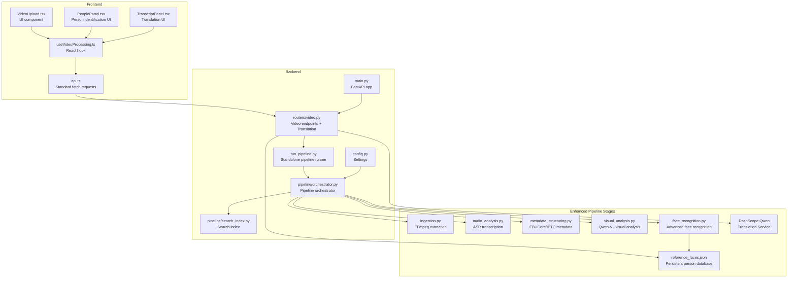
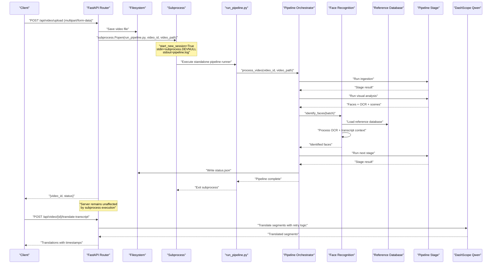
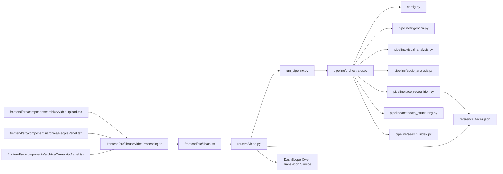

# Video Processing Endpoints

<cite>
**Referenced Files in This Document**
- [backend/routers/video.py](file://backend/routers/video.py)
- [backend/run_pipeline.py](file://backend/run_pipeline.py)
- [backend/pipeline/orchestrator.py](file://backend/pipeline/orchestrator.py)
- [backend/pipeline/search_index.py](file://backend/pipeline/search_index.py)
- [backend/config.py](file://backend/config.py)
- [backend/main.py](file://backend/main.py)
- [backend/pipeline/ingestion.py](file://backend/pipeline/ingestion.py)
- [backend/pipeline/audio_analysis.py](file://backend/pipeline/audio_analysis.py)
- [backend/pipeline/metadata_structuring.py](file://backend/pipeline/metadata_structuring.py)
- [backend/pipeline/visual_analysis.py](file://backend/pipeline/visual_analysis.py)
- [backend/pipeline/face_recognition.py](file://backend/pipeline/face_recognition.py)
- [frontend/src/lib/api.ts](file://frontend/src/lib/api.ts)
- [frontend/src/lib/useVideoProcessing.ts](file://frontend/src/lib/useVideoProcessing.ts)
- [frontend/src/components/archive/VideoUpload.tsx](file://frontend/src/components/archive/VideoUpload.tsx)
- [frontend/src/components/archive/PeoplePanel.tsx](file://frontend/src/components/archive/PeoplePanel.tsx)
- [frontend/src/components/archive/TranscriptPanel.tsx](file://frontend/src/components/archive/TranscriptPanel.tsx)
- [README.md](file://README.md)
</cite>

## Update Summary
**Changes Made**
- Added comprehensive documentation for the new POST /api/video/{video_id}/translate-transcript endpoint for real-time transcript translation into Arabic, French, and Russian languages
- Updated transcript section to include translation capabilities with DashScope Qwen integration
- Added detailed examples for transcript translation workflows with exponential backoff retry logic
- Enhanced frontend integration examples to demonstrate the new translation functionality in TranscriptPanel component
- Updated API schemas to include translation request/response structures

## Table of Contents
1. [Introduction](#introduction)
2. [Project Structure](#project-structure)
3. [Core Components](#core-components)
4. [Architecture Overview](#architecture-overview)
5. [Detailed Component Analysis](#detailed-component-analysis)
6. [Enhanced Face Recognition System](#enhanced-face-recognition-system)
7. [Transcript Translation System](#transcript-translation-system)
8. [Dependency Analysis](#dependency-analysis)
9. [Performance Considerations](#performance-considerations)
10. [Troubleshooting Guide](#troubleshooting-guide)
11. [Conclusion](#conclusion)
12. [Appendices](#appendices)

## Introduction
This document provides comprehensive API documentation for the video processing endpoints that power the AI-powered media archive. It covers:
- POST /api/video/upload for video file uploads with subprocess-based execution model for enhanced reliability and process isolation
- GET /api/video/{video_id}/status for retrieving processing pipeline status with detailed progress information
- GET /api/video/{video_id}/metadata for accessing structured metadata results from all pipeline stages with enhanced face recognition data
- GET /api/video/{video_id}/transcript for retrieving speech-to-text transcripts
- **NEW** POST /api/video/{video_id}/translate-transcript for real-time transcript translation into Arabic, French, and Russian languages with DashScope Qwen integration
- POST /api/video/{video_id}/faces/name for assigning names to detected persons with optional reference database integration
- GET/POST /api/search for semantic search with dual HTTP method support and person-specific filtering
- POST /api/reindex for rebuilding search indexes from existing processed videos

The documentation includes request/response schemas, error codes, file upload handling with subprocess execution, and practical examples using curl commands and JavaScript implementations.

**Updated** The system now implements enhanced transcript translation capabilities powered by DashScope Qwen models, providing real-time translation of speech-to-text content into multiple languages with robust retry logic and segment-based processing.

## Project Structure
The video processing system consists of:
- FastAPI backend with routers and pipeline orchestration using subprocess-based execution for process isolation
- Standalone pipeline runner that executes as a separate process for enhanced reliability
- **Enhanced** AI pipeline stages powered by Alibaba Cloud DashScope models with advanced face recognition and transcript translation
- Frontend client utilities for uploading, consuming APIs, managing person identification, and transcript translation
- **New** Reference database system for persistent person recognition across videos



**Diagram sources**
- [backend/main.py:1-44](file://backend/main.py#L1-L44)
- [backend/routers/video.py:1-637](file://backend/routers/video.py#L1-L637)
- [backend/run_pipeline.py:1-29](file://backend/run_pipeline.py#L1-L29)
- [backend/pipeline/orchestrator.py:1-392](file://backend/pipeline/orchestrator.py#L1-L392)
- [backend/config.py:1-30](file://backend/config.py#L1-L30)
- [backend/pipeline/search_index.py:1-333](file://backend/pipeline/search_index.py#L1-L333)
- [backend/pipeline/face_recognition.py:1-660](file://backend/pipeline/face_recognition.py#L1-L660)
- [frontend/src/components/archive/TranscriptPanel.tsx:1-305](file://frontend/src/components/archive/TranscriptPanel.tsx#L1-L305)

**Section sources**
- [README.md:148-168](file://README.md#L148-L168)
- [backend/main.py:1-44](file://backend/main.py#L1-L44)

## Core Components
- Video upload router: Handles multipart/form-data uploads, saves files, initializes status, and launches the pipeline as a completely separate subprocess for process isolation and enhanced reliability
- **Enhanced** Transcript translation router: Provides real-time translation of transcript segments into Arabic, French, and Russian using DashScope Qwen models with exponential backoff retry logic
- **Enhanced** Face naming router: Manages person identification with manual naming, reference database integration, and immediate search indexing
- Standalone pipeline runner: Executes the pipeline in a separate Python process with full isolation from the main API server
- **Enhanced** Pipeline orchestrator: Coordinates six stages with progress tracking, error handling, and integrated face recognition with OCR/transcript context
- **Enhanced** Search index: Manages FAISS-based vector search with DashScope text embeddings, person-specific search, and rebuild capability
- **Enhanced** Face recognition system: Advanced person identification using batch processing, OCR text analysis, transcript context, and reference database matching
- Frontend API utilities: Provide standard fetch-based upload functionality, typed helpers for uploads, status polling, WebSocket progress streaming, person management, and transcript translation

Key capabilities:
- Process isolation through subprocess execution prevents pipeline failures from affecting the main API server
- Enhanced reliability with automatic process recovery and resource isolation
- **New** Real-time transcript translation with multi-language support (Arabic, French, Russian)
- **New** Exponential backoff retry logic for translation API calls ensuring reliability
- **New** Segment-based translation preserving timing information and speaker attribution
- **Enhanced** Advanced face recognition with OCR text fallback, transcript context, and reference database matching
- **Enhanced** Structured metadata generation (EBUCore XML, IPTC) with person mentions
- Speech-to-text with speaker diarization
- Semantic search with dual HTTP method support and person-specific filtering
- Batch reindexing from existing processed videos

**Updated** The system now implements comprehensive transcript translation capabilities with real-time processing, multi-language support, and robust error handling. The translation service integrates seamlessly with the existing transcript workflow, providing users with instant access to translated content while maintaining temporal accuracy.

**Section sources**
- [backend/routers/video.py:231-316](file://backend/routers/video.py#L231-L316)
- [backend/routers/video.py:41-365](file://backend/routers/video.py#L41-L365)
- [backend/run_pipeline.py:1-29](file://backend/run_pipeline.py#L1-L29)
- [backend/pipeline/orchestrator.py:44-206](file://backend/pipeline/orchestrator.py#L44-L206)
- [backend/pipeline/search_index.py:59-333](file://backend/pipeline/search_index.py#L59-L333)
- [backend/pipeline/face_recognition.py:185-262](file://backend/pipeline/face_recognition.py#L185-L262)
- [frontend/src/lib/api.ts:222-233](file://frontend/src/lib/api.ts#L222-L233)

## Architecture Overview
The system follows a staged pipeline architecture with subprocess-based execution and process isolation:
1. Upload endpoint receives multipart/form-data via standard HTTP requests
2. Main API server creates a separate subprocess that runs the pipeline independently
3. Subprocess executes the orchestrator which runs stages sequentially with optimized status updates
4. **Enhanced** Face recognition stage uses batch processing with OCR text and transcript context for improved person identification
5. **New** Translation endpoint processes transcript segments through DashScope Qwen models with exponential backoff retry logic
6. Progress updates are streamed via WebSocket and persisted to status.json
7. Results are saved as individual JSON artifacts per stage
8. **Enhanced** Search index is built incrementally during processing with person-specific entries and can be rebuilt via /api/reindex

**Updated** The system now features enhanced transcript translation capabilities with real-time processing. The translation endpoint accepts transcript segments and translates them into target languages using DashScope Qwen models, implementing exponential backoff retry logic for reliability. The translation preserves segment timing information and maintains speaker attribution throughout the translation process.



**Diagram sources**
- [backend/routers/video.py:85-95](file://backend/routers/video.py#L85-L95)
- [backend/routers/video.py:231-316](file://backend/routers/video.py#L231-L316)
- [backend/run_pipeline.py:15-28](file://backend/run_pipeline.py#L15-L28)
- [backend/pipeline/orchestrator.py:130-156](file://backend/pipeline/orchestrator.py#L130-L156)
- [backend/pipeline/face_recognition.py:227-262](file://backend/pipeline/face_recognition.py#L227-L262)

## Detailed Component Analysis

### POST /api/video/upload
Purpose: Upload a video file and start the processing pipeline in a completely separate subprocess for enhanced reliability and process isolation.

- Method: POST
- Path: /api/video/upload
- Content-Type: multipart/form-data
- Request Body:
  - file: binary video file (required)
- Response:
  - video_id: unique identifier for the video
  - filename: original filename
  - status: "queued"
  - message: informational message

**Updated** Upload endpoint now launches the pipeline as a completely separate subprocess using `subprocess.Popen()` with `start_new_session=True` for full process isolation. The main API server returns immediately after launching the subprocess, ensuring it never blocks regardless of pipeline duration or resource usage.

Behavior:
- Validates and saves the uploaded file to the configured upload directory using async file operations
- Creates initial status.json with pending stages
- Launches pipeline as a separate subprocess using `subprocess.Popen()` with full isolation
- Returns immediately with queued status

Process isolation benefits:
- Pipeline failures cannot crash the main API server
- Long-running processes don't block server resources
- Memory leaks in pipeline stages don't affect server stability
- Process termination is handled independently
- Automatic recovery from pipeline crashes
- Resource monitoring and cleanup through separate process lifecycle

Supported formats and limits:
- Frontend accepts MP4, MOV, AVI
- Maximum file size indicated as 2GB in UI
- Backend does not enforce explicit size limits in the upload handler

Error codes:
- 400: Invalid request (missing file)
- 500: Failed to save uploaded file or launch subprocess

curl example:
```bash
curl -X POST "http://localhost:8000/api/video/upload" \
  -H "Content-Type: multipart/form-data" \
  -F "file=@/path/to/video.mp4"
```

JavaScript fetch example:
```javascript
const formData = new FormData();
formData.append("file", fileBlob);

// Standard fetch request (no progress tracking)
const response = await fetch("http://localhost:8000/api/video/upload", {
  method: "POST",
  body: formData
});

const result = await response.json();
console.log("video_id:", result.video_id);
```

**Section sources**
- [backend/routers/video.py:51-113](file://backend/routers/video.py#L51-L113)
- [backend/run_pipeline.py:15-28](file://backend/run_pipeline.py#L15-L28)

### GET /api/video/{video_id}/status
Purpose: Retrieve the current pipeline status and progress using optimized synchronous file reading.

- Method: GET
- Path: /api/video/{video_id}/status
- Path Parameters:
  - video_id: UUID of the video
- Response Schema:
  - video_id: string
  - status: "queued" | "processing" | "completed" | "completed_with_errors"
  - progress: number (0-100)
  - stages: object with stage names as keys and statuses as values
  - filename: string
  - created_at: ISO timestamp
  - updated_at: ISO timestamp
  - errors: object mapping failed stages to error messages

**Updated** Status retrieval now uses synchronous file reading for the tiny status.json file to avoid thread pool contention, providing optimal performance for frequent status checks. This optimization ensures minimal CPU overhead during high-frequency polling scenarios.

curl example:
```bash
curl "http://localhost:8000/api/video/<video_id>/status"
```

JavaScript fetch example:
```javascript
const response = await fetch("http://localhost:8000/api/video/<video_id>/status");
const status = await response.json();
console.log("progress:", status.progress);
console.log("stages:", status.stages);
```

WebSocket alternative:
- Connect to ws://localhost:8000/ws/pipeline/{video_id}
- Receive real-time progress updates during processing with improved connection management
- Automatic fallback to REST polling when WebSocket connections fail

**Section sources**
- [backend/routers/video.py:118-133](file://backend/routers/video.py#L118-L133)
- [backend/routers/video.py:461-508](file://backend/routers/video.py#L461-L508)
- [backend/pipeline/orchestrator.py:62-72](file://backend/pipeline/orchestrator.py#L62-L72)

### GET /api/video/{video_id}/metadata
Purpose: Access structured metadata results from all pipeline stages with enhanced face recognition data.

- Method: GET
- Path: /api/video/{video_id}/metadata
- Path Parameters:
  - video_id: UUID of the video
- Response Schema:
  - video_id: string
  - ingestion: object (from ingestion stage)
  - visual_analysis: object (from visual analysis stage)
  - metadata: object (from metadata structuring stage)
  - faces: array of enhanced face objects (from face recognition stage)
  - Any missing stage results are omitted or include an error field

**Enhanced** Face recognition results now include:
- identified: boolean indicating if person was successfully identified
- name_en: English name (if identified)
- name_ar: Arabic name (if available)
- role: Person's role or title
- confidence: Confidence score for identification (0-1)
- source: Identification source ("reference_db", "ocr", "transcript", "ai_suggestion", "manual")
- appearances: Array of appearance time ranges with start/end timestamps
- description: Physical description of the person
- reasoning: Explanation of how identification was made

Typical ingestion fields:
- audio_path: string
- thumbnail_path: string
- duration: number
- resolution: string
- fps: number
- codec: string

Typical visual_analysis fields:
- scenes: array of scene objects
- objects: array of detected objects
- landmarks: array of landmarks
- text_ocr: array of OCR text
- sensitive_content: array of sensitive content flags
- overall_summary_en/ar: strings
- era_estimate: object

Typical metadata fields:
- ebucore_xml: string (EBUCore XML)
- iptc_video_metadata: object (IPTC Video Metadata Hub)
- topic_codes: array of strings
- topic_names_en/ar: arrays of strings
- sentiment_tags: array of strings
- tone: string
- content_rating: string
- geographic_tags: array of strings
- persons_mentioned: array of person objects

curl example:
```bash
curl "http://localhost:8000/api/video/<video_id>/metadata"
```

JavaScript fetch example:
```javascript
const response = await fetch("http://localhost:8000/api/video/<video_id>/metadata");
const metadata = await response.json();
console.log("topics:", metadata.metadata.topic_codes);
console.log("identified persons:", metadata.faces.filter(f => f.identified).length);
```

**Section sources**
- [backend/routers/video.py:138-172](file://backend/routers/video.py#L138-L172)
- [backend/pipeline/ingestion.py:44-51](file://backend/pipeline/ingestion.py#L44-L51)
- [backend/pipeline/metadata_structuring.py:81-163](file://backend/pipeline/metadata_structuring.py#L81-L163)
- [backend/pipeline/face_recognition.py:185-262](file://backend/pipeline/face_recognition.py#L185-L262)

### GET /api/video/{video_id}/transcript
Purpose: Retrieve speech-to-text transcripts with speaker diarization.

- Method: GET
- Path: /api/video/{video_id}/transcript
- Path Parameters:
  - video_id: UUID of the video
- Response Schema:
  - video_id: string
  - segments: array of segment objects
  - full_text: string
  - language: string
  - speaker_count: number

Each segment object typically includes:
- start_time: number (seconds)
- end_time: number (seconds)
- speaker_id: string
- text: string
- words: array of word objects with word, start, end

curl example:
```bash
curl "http://localhost:8000/api/video/<video_id>/transcript"
```

JavaScript fetch example:
```javascript
const response = await fetch("http://localhost:8000/api/video/<video_id>/transcript");
const transcript = await response.json();
console.log("segments count:", transcript.segments.length);
```

**Section sources**
- [backend/routers/video.py:190-206](file://backend/routers/video.py#L190-L206)
- [backend/pipeline/audio_analysis.py:22-59](file://backend/pipeline/audio_analysis.py#L22-L59)

### **NEW** POST /api/video/{video_id}/translate-transcript
Purpose: Translate transcript segments into target languages (Arabic, French, Russian) using DashScope Qwen models with exponential backoff retry logic.

- Method: POST
- Path: /api/video/{video_id}/translate-transcript
- Path Parameters:
  - video_id: UUID of the video (for logging/context)
- Request Body:
  - language: string (target language code: "ar", "fr", or "ru")
  - segments: array of segment objects to translate
    - text: string (original text content)
    - start_time: number (segment start time in seconds)
    - end_time: number (segment end time in seconds)
- Response Schema:
  - translations: array of translated segment objects
    - start_time: number (preserved from original)
    - end_time: number (preserved from original)
    - text: string (translated content)
  - language: string (target language code)

**Enhanced** Features:
- **Multi-language Support**: Translates into Arabic (ar), French (fr), and Russian (ru)
- **Segment-Based Processing**: Preserves timing information and speaker attribution
- **Exponential Backoff Retry Logic**: Implements 3 attempts with increasing delays (1s, 2s, 4s) for reliability
- **Batch Translation**: Processes all segments in a single API call using numbered markers for efficiency
- **Context Preservation**: Maintains segment order and numbering through translation process
- **Error Handling**: Comprehensive error handling with detailed logging and user-friendly responses

Behavior:
- Validates target language against supported languages list
- Checks for DashScope API key configuration
- Joins all segment texts with numbered markers ([SEG1], [SEG2], etc.) for single API call
- Sends translation request to DashScope Qwen model with professional translator prompt
- Implements exponential backoff retry logic for network failures and rate limiting
- Parses translated content back into individual segments using marker positions
- Returns translations with preserved timing information

Error codes:
- 400: Unsupported language or invalid request format
- 404: Video ID not found (for context/logging purposes)
- 500: DashScope API key not configured
- 502: Translation service unavailable or API failure after retries

curl example:
```bash
curl -X POST "http://localhost:8000/api/video/<video_id>/translate-transcript" \
  -H "Content-Type: application/json" \
  -d '{
    "language": "ar",
    "segments": [
      {"text": "Welcome to the conference", "start_time": 0, "end_time": 3},
      {"text": "Today we discuss innovation", "start_time": 3, "end_time": 6}
    ]
  }'
```

JavaScript fetch example:
```javascript
const response = await fetch(`http://localhost:8000/api/video/${videoId}/translate-transcript`, {
  method: "POST",
  headers: {
    "Content-Type": "application/json",
  },
  body: JSON.stringify({
    language: "fr",
    segments: [
      { text: "Hello everyone", start_time: 0, end_time: 2 },
      { text: "Thank you for attending", start_time: 2, end_time: 4 }
    ]
  })
});

const result = await response.json();
console.log("Translations:", result.translations);
console.log("Target language:", result.language);
```

**Section sources**
- [backend/routers/video.py:231-316](file://backend/routers/video.py#L231-L316)
- [backend/config.py:6-12](file://backend/config.py#L6-L12)

### **NEW** Transcript Translation System

#### Real-Time Translation Architecture
The transcript translation system provides seamless integration between speech-to-text content and multi-language translation services:

**Translation Pipeline:**
1. **Segment Collection**: Gathers transcript segments with timing information
2. **Batch Processing**: Combines segments with numbered markers for efficient API calls
3. **Model Integration**: Uses DashScope Qwen models for high-quality translation
4. **Retry Logic**: Implements exponential backoff for reliability
5. **Result Parsing**: Splits translated content back into individual segments
6. **Timing Preservation**: Maintains original timestamps and speaker attribution

**Language Support:**
- **Arabic (ar)**: Full RTL support with proper text direction handling
- **French (fr)**: European French with cultural context preservation
- **Russian (ru)**: Cyrillic script support with proper encoding

**Quality Assurance:**
- Professional translator prompts ensure contextual accuracy
- Temperature control (0.3) balances creativity with fidelity
- Token limits prevent excessive response sizes
- Error handling ensures graceful degradation

#### Frontend Integration
The TranscriptPanel component provides intuitive translation controls:
- Language selection dropdown with native language labels
- Real-time translation status indicators
- Bilingual display showing original and translated text
- Proper text direction handling for RTL languages
- Error state management and user feedback

**Section sources**
- [backend/routers/video.py:231-316](file://backend/routers/video.py#L231-L316)
- [frontend/src/components/archive/TranscriptPanel.tsx:82-121](file://frontend/src/components/archive/TranscriptPanel.tsx#L82-L121)
- [frontend/src/lib/api.ts:222-233](file://frontend/src/lib/api.ts#L222-L233)

### POST /api/video/{video_id}/faces/name
Purpose: Assign or correct the name of a detected person, optionally saving them to the reference database for future recognition.

- Method: POST
- Path: /api/video/{video_id}/faces/name
- Path Parameters:
  - video_id: UUID of the video
- Request Body:
  - face_index: integer (index of the face in the faces array)
  - name_en: string (English name for the person)
  - name_ar: string (optional Arabic name)
  - role: string (optional role or title)
  - add_to_reference: boolean (optional, default false)
- Response Schema:
  - status: "ok"
  - face: updated face object with identification details
  - added_to_reference: boolean indicating if person was added to reference database

**Enhanced** Features:
- Updates face identification in both faces.json and results.json for consistency
- Optionally adds person to reference database for automatic recognition in future videos
- Immediately indexes the named person in the search system for instant discoverability
- Maintains appearance timeline and confidence scoring
- Supports bilingual naming (English and Arabic)

Behavior:
- Validates face index exists within the video's face detection results
- Updates face object with identification details and confidence score
- Persists changes to faces.json and synchronizes with results.json
- Optionally adds person to reference_faces.json database
- Creates searchable entry for immediate semantic search availability

Error codes:
- 404: No faces found for video or video not found
- 400: Invalid face index or empty name provided

curl example:
```bash
curl -X POST "http://localhost:8000/api/video/<video_id>/faces/name" \
  -H "Content-Type: application/json" \
  -d '{
    "face_index": 0,
    "name_en": "Sheikh Mohammed bin Rashid Al Maktoum",
    "role": "Ruler of Dubai",
    "add_to_reference": true
  }'
```

JavaScript fetch example:
```javascript
const response = await fetch(`http://localhost:8000/api/video/${videoId}/faces/name`, {
  method: "POST",
  headers: {
    "Content-Type": "application/json",
  },
  body: JSON.stringify({
    face_index: 0,
    name_en: "John Smith",
    role: "CEO",
    add_to_reference: true
  })
});

const result = await response.json();
console.log("Face identified:", result.face.name_en);
console.log("Added to reference:", result.added_to_reference);
```

**Section sources**
- [backend/routers/video.py:408-494](file://backend/routers/video.py#L408-L494)

### GET/POST /api/search
Purpose: Perform semantic search across all indexed videos with dual HTTP method support and enhanced person filtering.

**Updated** Search endpoints now support both GET and POST methods with identical functionality and enhanced person-specific search:
- GET /api/search?query=your+query&top_k=5&type_filter=person
- POST /api/search with JSON body containing query, top_k, type_filter, and video_id

Both methods accept the same SearchRequest model:
- query: string (required)
- top_k: integer (optional, default: 5)
- type_filter: string (optional) - "scene" | "transcript" | "person"
- video_id: string (optional) - filter results to specific video

Response Schema:
- query: string (original query)
- results: array of search result objects
- total: integer (count of results)

Each search result typically includes:
- video_id: string
- title: string
- timestamp: number (seconds)
- description: string
- score: number
- thumbnail: string (optional)
- type: string ("scene", "transcript", or "person")
- persons: array of person names (for person-type results)

curl GET example:
```bash
curl "http://localhost:8000/api/search?query=climate+change&top_k=5&type_filter=person"
```

curl POST example:
```bash
curl -X POST "http://localhost:8000/api/search" \
  -H "Content-Type: application/json" \
  -d '{"query":"Sheikh Mohammed","top_k":5,"type_filter":"person"}'
```

JavaScript fetch example:
```javascript
// GET method with person filter
const response = await fetch("http://localhost:8000/api/search?query=climate+change&top_k=5&type_filter=person");
const results = await response.json();

// POST method with person search  
const response = await fetch("http://localhost:8000/api/search", {
  method: "POST",
  headers: {
    "Content-Type": "application/json",
  },
  body: JSON.stringify({
    query: "Sheikh Mohammed",
    top_k: 5,
    type_filter: "person"
  })
});
const results = await response.json();
console.log("Person appearances:", results.results.filter(r => r.type === "person"));
```

**Section sources**
- [backend/routers/video.py:499-541](file://backend/routers/video.py#L499-L541)

### POST /api/reindex
Purpose: Rebuild the search index from all existing processed video results with enhanced person indexing.

- Method: POST
- Path: /api/reindex
- Content-Type: application/json
- Request Body: None
- Response Schema:
  - status: "ok"
  - videos_indexed: number (count of videos successfully indexed)
  - total_vectors: number (total vectors in the rebuilt index)

**Updated** The reindex endpoint now supports both GET and POST methods via @router.api_route decorator, providing flexibility for different client implementations. Enhanced indexing includes person-specific entries from face recognition results.

Behavior:
- Clears existing search index (FAISS or numpy fallback)
- Scans all processed videos in the upload directory
- Loads results.json for each processed video
- Builds searchable segments using orchestrator's _build_searchable_segments method
- Adds segments to the search index with text embeddings
- **Enhanced** Includes person-specific searchable entries from face recognition
- Persists the rebuilt index to disk

**Important**: This endpoint requires existing processed videos with results.json files. Videos that haven't completed processing will be skipped.

Error codes:
- 500: Failed to rebuild search index (various internal errors)

curl example:
```bash
curl -X POST "http://localhost:8000/api/reindex"
```

JavaScript fetch example:
```javascript
const response = await fetch("http://localhost:8000/api/reindex", {
  method: "POST",
});
const result = await response.json();
console.log("Indexed videos:", result.videos_indexed);
console.log("Total vectors:", result.total_vectors);
```

**Section sources**
- [backend/routers/video.py:546-585](file://backend/routers/video.py#L546-L585)
- [backend/pipeline/orchestrator.py:307-367](file://backend/pipeline/orchestrator.py#L307-L367)
- [backend/pipeline/search_index.py:143-213](file://backend/pipeline/search_index.py#L143-L213)

## Enhanced Face Recognition System

### Advanced Person Identification
The face recognition system has been significantly enhanced with multi-source person identification capabilities:

**Multi-Source Matching:**
- **Reference Database Matching**: Compares detected faces against known persons in the reference database
- **OCR Text Analysis**: Extracts names from on-screen text (lower-thirds, captions, labels)
- **Transcript Context**: Identifies persons mentioned in spoken introductions
- **AI Inference**: Uses contextual knowledge for educated guesses when evidence is limited

**Batch Processing:**
- Processes all detected faces in a single LLM call for efficiency
- Handles duplicate face detection and merging
- Provides confidence scores and reasoning for each identification

**Appearance Tracking:**
- Computes precise appearance windows based on scene boundaries
- Merges overlapping appearances into continuous segments
- Provides accurate timing information for video navigation

**Reference Database Integration:**
- Persistent storage of identified persons across videos
- Automatic addition of newly named persons for future recognition
- Deduplication and conflict resolution for existing entries

### Face Recognition Data Structure
Enhanced face objects include:
```json
{
  "description": "Middle-aged man wearing traditional white kandura...",
  "age_estimate": "50-60",
  "gender": "male",
  "timestamp": "01:23",
  "bbox": {"x": 100, "y": 50, "width": 80, "height": 120},
  "identified": true,
  "name_en": "Sheikh Mohammed bin Rashid Al Maktoum",
  "name_ar": "محمد بن راشد آل مكتوم",
  "role": "Ruler of Dubai",
  "confidence": 0.95,
  "source": "reference_db",
  "reasoning": "Matches reference description and appears in official capacity",
  "appearances": [
    {"start": 83.0, "end": 95.5},
    {"start": 150.2, "end": 165.8}
  ]
}
```

**Section sources**
- [backend/pipeline/face_recognition.py:185-262](file://backend/pipeline/face_recognition.py#L185-L262)
- [backend/pipeline/face_recognition.py:404-499](file://backend/pipeline/face_recognition.py#L404-L499)
- [backend/pipeline/face_recognition.py:121-182](file://backend/pipeline/face_recognition.py#L121-182)

## Dependency Analysis
The video processing endpoints depend on:
- FastAPI routing with subprocess-based execution for process isolation
- Standalone pipeline runner that executes independently from the main server
- Filesystem for saving uploads and results
- External AI services (DashScope) for vision, ASR, text generation, and translation
- FFmpeg for local video/audio processing
- FAISS or numpy for vector search indexing
- **Enhanced** Reference database system for persistent person recognition
- **New** DashScope Qwen models for transcript translation services

**Updated** The system now depends on enhanced transcript translation capabilities with multi-language support, exponential backoff retry logic, and robust error handling. The translation service integrates seamlessly with the existing DashScope infrastructure.



**Diagram sources**
- [backend/routers/video.py:17-19](file://backend/routers/video.py#L17-L19)
- [backend/routers/video.py:231-316](file://backend/routers/video.py#L231-L316)
- [backend/run_pipeline.py:12-17](file://backend/run_pipeline.py#L12-17)
- [backend/pipeline/orchestrator.py:14-21](file://backend/pipeline/orchestrator.py#L14-21)
- [backend/config.py:4-12](file://backend/config.py#L4-L12)
- [backend/pipeline/face_recognition.py:17-18](file://backend/pipeline/face_recognition.py#L17-L18)
- [frontend/src/lib/api.ts:164-183](file://frontend/src/lib/api.ts#L164-L183)
- [frontend/src/components/archive/TranscriptPanel.tsx:1-305](file://frontend/src/components/archive/TranscriptPanel.tsx#L1-L305)

**Section sources**
- [backend/main.py:35-38](file://backend/main.py#L35-L38)
- [backend/routers/video.py:25-27](file://backend/routers/video.py#L25-L27)

## Performance Considerations
- Large video files increase processing time; consider chunked uploads and compression
- ASR transcription is asynchronous and may take several minutes for long audio
- Real-time progress streaming via WebSocket reduces polling overhead with optimized connection management
- **Updated** Subprocess-based execution provides complete process isolation, preventing pipeline failures from affecting server performance
- **Updated** Standalone pipeline runner eliminates main server resource contention during long-running operations
- **Enhanced** Face recognition batch processing improves efficiency by processing multiple faces in single API calls
- **Enhanced** OCR and transcript context analysis provide additional identification sources without significant performance impact
- **New** Transcript translation uses batch processing to minimize API calls and reduce latency
- **New** Exponential backoff retry logic prevents overwhelming translation services during high load
- Results are persisted as JSON files; ensure sufficient disk space for large archives
- FFmpeg operations require adequate CPU/memory resources
- **Updated** Process isolation ensures that memory leaks or resource exhaustion in pipeline stages don't affect server stability
- **Updated** Subprocess execution allows for automatic process recovery and cleanup
- **Updated** Separate process execution enables better resource monitoring and control
- **Updated** Improved memory management through process isolation prevents accumulation of memory leaks
- **Enhanced** Reference database lookups are cached and optimized for fast person matching
- **New** Translation service timeout handling prevents hanging requests during network issues
- **New** Segment batching reduces API overhead by processing multiple segments in single calls

## Troubleshooting Guide
Common issues and resolutions:
- 404 Not Found: Video ID not found or status file missing
- 500 Internal Server Error: File save failures or pipeline exceptions
- API key errors: Ensure DASHSCOPE_API_KEY is configured
- WebSocket disconnects: Use fallback REST polling with automatic retry
- **Updated** Subprocess launch failures: Check that Python interpreter path is correct and run_pipeline.py is accessible
- **Updated** Process isolation issues: Verify that start_new_session=True is working correctly and subprocess has proper permissions
- **Updated** Pipeline not starting: Check pipeline.log file in the video's output directory for execution errors
- **Updated** Memory issues: Subprocess isolation prevents memory leaks from affecting the main server, but monitor individual process memory usage
- **Updated** Process termination: Subprocesses can be terminated independently without affecting the main API server
- **Updated** Resource leaks: Process isolation ensures automatic cleanup when subprocess terminates unexpectedly
- **Enhanced** Face recognition failures: Check reference_faces.json format and DashScope API connectivity
- **Enhanced** Person naming errors: Verify face indices exist and names are properly formatted
- **Enhanced** Search indexing issues: Ensure results.json files contain valid face recognition data
- **New** Translation failures: Check DASHSCOPE_API_KEY configuration and network connectivity
- **New** Translation timeouts: Verify DashScope service availability and adjust timeout settings if needed
- **New** Language support errors: Ensure target language is one of the supported codes (ar, fr, ru)
- **New** Segment parsing errors: Verify transcript segments have valid timing information

Error handling patterns:
- Upload failures return HTTP 500 with detailed error messages
- Pipeline stage failures are recorded in status.errors
- Frontend gracefully handles WebSocket errors by falling back to REST polling
- Subprocess execution handles network errors and timeouts appropriately
- Search endpoints validate the SearchRequest model and return descriptive error messages
- Reindex operation logs warnings for videos that fail to index and continues processing
- **Updated** Subprocess failures are isolated and don't affect main server availability
- **Updated** Pipeline logs are written to separate pipeline.log files for easier debugging
- **Updated** Process monitoring helps identify and recover from resource exhaustion scenarios
- **Enhanced** Face recognition errors include detailed reasoning and confidence scores for debugging
- **Enhanced** Reference database conflicts are logged and resolved automatically
- **New** Translation errors implement exponential backoff retry logic with detailed logging
- **New** Network failures trigger automatic retries with increasing delay intervals
- **New** API rate limiting is handled gracefully with appropriate wait times

**Section sources**
- [backend/routers/video.py:57-59](file://backend/routers/video.py#L57-L59)
- [backend/routers/video.py:129-131](file://backend/routers/video.py#L129-L131)
- [backend/routers/video.py:184-185](file://backend/routers/video.py#L184-L185)
- [backend/routers/video.py:238-253](file://backend/routers/video.py#L238-L253)
- [backend/pipeline/orchestrator.py:259-282](file://backend/pipeline/orchestrator.py#L259-L282)
- [frontend/src/lib/api.ts:43-95](file://frontend/src/lib/api.ts#L43-L95)

## Conclusion
The video processing endpoints provide a robust foundation for AI-powered media archive workflows with enhanced reliability through subprocess-based execution and advanced face recognition capabilities. They support efficient uploads, process isolation, real-time progress monitoring, and comprehensive metadata extraction with structured outputs suitable for broadcasting standards and semantic search. 

**Enhanced** The new transcript translation system provides sophisticated multi-language support with real-time processing, exponential backoff retry logic, and seamless integration with the existing transcript workflow. The translation service leverages DashScope Qwen models to deliver high-quality translations while maintaining temporal accuracy and speaker attribution.

**Enhanced** The enhanced face recognition system provides sophisticated person identification through multi-source analysis including OCR text, transcript context, and reference database matching. The face naming endpoint enables seamless integration between manual and automatic identification, while the reference database grows over time to improve future recognition accuracy.

The subprocess-based execution model ensures that pipeline failures never affect server availability, while maintaining backward compatibility with existing API endpoints and response structures. The standalone pipeline runner provides complete process isolation, enabling better resource management, automatic recovery, and improved system stability. This architecture prevents memory leaks and ensures better system stability through complete process isolation and automatic cleanup mechanisms.

## Appendices

### Request/Response Schemas

Upload response:
- video_id: string
- filename: string
- status: "queued"
- message: string

Status response:
- video_id: string
- status: "queued"|"processing"|"completed"|"completed_with_errors"
- progress: number
- stages: object with stage names as keys
- filename: string
- created_at: string (ISO timestamp)
- updated_at: string (ISO timestamp)
- errors: object

Metadata response:
- video_id: string
- ingestion: object
- visual_analysis: object
- metadata: object
- faces: array of enhanced face objects with identification details

Transcript response:
- video_id: string
- segments: array
- full_text: string
- language: string
- speaker_count: number

**New** Transcript translation request:
- language: string ("ar", "fr", or "ru")
- segments: array of segment objects
  - text: string (content to translate)
  - start_time: number (segment start time)
  - end_time: number (segment end time)

**New** Transcript translation response:
- translations: array of translated segment objects
  - start_time: number (preserved from original)
  - end_time: number (preserved from original)
  - text: string (translated content)
- language: string (target language code)

Face naming request:
- face_index: integer
- name_en: string
- name_ar: string (optional)
- role: string (optional)
- add_to_reference: boolean (optional)

Face naming response:
- status: "ok"
- face: updated face object
- added_to_reference: boolean

Search response:
- query: string
- results: array
- total: number

Reindex response:
- status: "ok"
- videos_indexed: number
- total_vectors: number

### Practical Examples

curl upload:
```bash
curl -X POST "http://localhost:8000/api/video/upload" \
  -H "Content-Type: multipart/form-data" \
  -F "file=@sample.mp4"
```

JavaScript fetch upload:
```javascript
const formData = new FormData();
formData.append("file", fileBlob);

const response = await fetch("http://localhost:8000/api/video/upload", {
  method: "POST",
  body: formData
});

const result = await response.json();
console.log("video_id:", result.video_id);
```

JavaScript status polling:
```javascript
const response = await fetch(`http://localhost:8000/api/video/${videoId}/status`);
const status = await response.json();
```

JavaScript WebSocket progress:
```javascript
const ws = new WebSocket("ws://localhost:8000/ws/pipeline/" + videoId);
ws.onmessage = (event) => {
  const data = JSON.parse(event.data);
  console.log(`Stage ${data.stage}: ${data.message}`);
};
```

**New** JavaScript transcript translation:
```javascript
const response = await fetch(`http://localhost:8000/api/video/${videoId}/translate-transcript`, {
  method: "POST",
  headers: {
    "Content-Type": "application/json",
  },
  body: JSON.stringify({
    language: "ar",
    segments: [
      { text: "Welcome to the conference", start_time: 0, end_time: 3 },
      { text: "Today we discuss innovation", start_time: 3, end_time: 6 }
    ]
  })
});

const result = await response.json();
console.log("Translations:", result.translations);
console.log("Target language:", result.language);
```

JavaScript face naming:
```javascript
const response = await fetch(`http://localhost:8000/api/video/${videoId}/faces/name`, {
  method: "POST",
  headers: {
    "Content-Type": "application/json",
  },
  body: JSON.stringify({
    face_index: 0,
    name_en: "John Smith",
    role: "CEO",
    add_to_reference: true
  })
});

const result = await response.json();
console.log("Person identified:", result.face.name_en);
console.log("Added to reference:", result.added_to_reference);
```

JavaScript search (GET):
```javascript
const response = await fetch("http://localhost:8000/api/search?query=climate+change&top_k=5&type_filter=person");
const results = await response.json();
```

JavaScript search (POST):
```javascript
const response = await fetch("http://localhost:8000/api/search", {
  method: "POST",
  headers: {
    "Content-Type": "application/json",
  },
  body: JSON.stringify({
    query: "Sheikh Mohammed",
    top_k: 5,
    type_filter: "person"
  })
});
const results = await response.json();
```

curl reindex:
```bash
curl -X POST "http://localhost:8000/api/reindex"
```

JavaScript reindex:
```javascript
const response = await fetch("http://localhost:8000/api/reindex", {
  method: "POST",
});
const result = await response.json();
console.log("Indexed videos:", result.videos_indexed);
```

### Enhanced Face Recognition Workflow

The enhanced face recognition system follows this workflow:

1. **Detection**: Visual analysis detects faces in video frames
2. **Context Collection**: Gathers OCR text, transcript segments, and scene boundaries
3. **Batch Processing**: Sends all faces to LLM with reference database and context
4. **Identification**: Matches faces using multiple sources with confidence scoring
5. **Deduplication**: Groups same-person appearances and merges timelines
6. **Persistence**: Saves results and optionally adds to reference database
7. **Search Indexing**: Creates searchable entries for named persons

This workflow provides significantly improved person identification accuracy while maintaining performance through batch processing and intelligent context utilization.

### Transcript Translation Workflow

The transcript translation system follows this workflow:

1. **Segment Collection**: Gathers transcript segments with timing information
2. **Batch Preparation**: Joins segments with numbered markers for single API call
3. **Model Request**: Sends translation request to DashScope Qwen with professional prompt
4. **Retry Logic**: Implements exponential backoff for reliability (1s, 2s, 4s delays)
5. **Response Parsing**: Splits translated content back into individual segments
6. **Timing Preservation**: Maintains original timestamps and speaker attribution
7. **Error Handling**: Graceful degradation with detailed logging and user feedback

This workflow provides reliable multi-language translation while preserving temporal accuracy and maintaining the integrity of the original transcript structure.