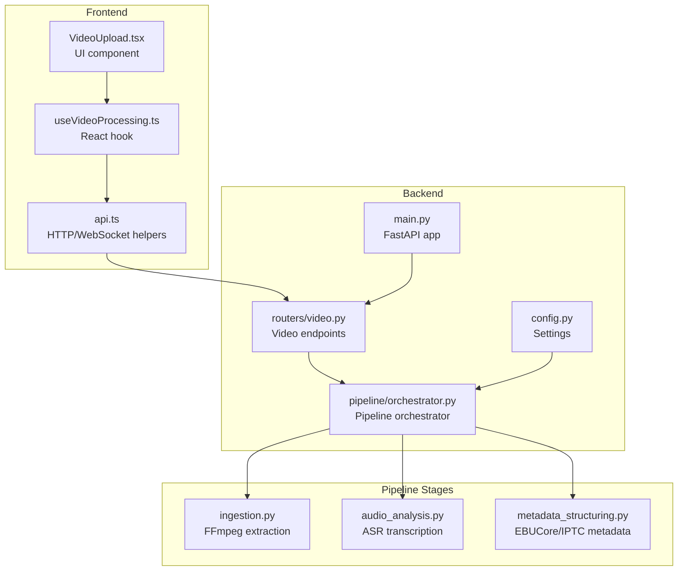
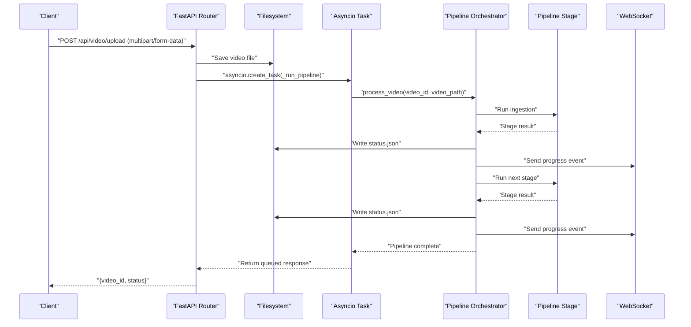
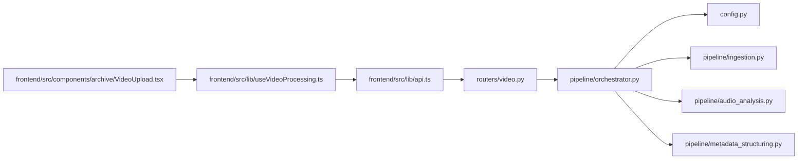

# Video Processing Endpoints

<cite>
**Referenced Files in This Document**
- [backend/routers/video.py](file://backend/routers/video.py)
- [backend/pipeline/orchestrator.py](file://backend/pipeline/orchestrator.py)
- [backend/config.py](file://backend/config.py)
- [backend/main.py](file://backend/main.py)
- [backend/pipeline/ingestion.py](file://backend/pipeline/ingestion.py)
- [backend/pipeline/audio_analysis.py](file://backend/pipeline/audio_analysis.py)
- [backend/pipeline/metadata_structuring.py](file://backend/pipeline/metadata_structuring.py)
- [frontend/src/lib/api.ts](file://frontend/src/lib/api.ts)
- [frontend/src/lib/useVideoProcessing.ts](file://frontend/src/lib/useVideoProcessing.ts)
- [frontend/src/components/archive/VideoUpload.tsx](file://frontend/src/components/archive/VideoUpload.tsx)
- [README.md](file://README.md)
</cite>

## Update Summary
**Changes Made**
- Updated architecture overview to reflect asyncio task execution model replacing BackgroundTasks
- Enhanced status retrieval optimization details with synchronous file reading
- Updated WebSocket progress streaming mechanisms with improved connection management
- Revised performance considerations for async implementation with non-blocking execution
- Added detailed asyncio task lifecycle management and resource optimization

## Table of Contents
1. [Introduction](#introduction)
2. [Project Structure](#project-structure)
3. [Core Components](#core-components)
4. [Architecture Overview](#architecture-overview)
5. [Detailed Component Analysis](#detailed-component-analysis)
6. [Dependency Analysis](#dependency-analysis)
7. [Performance Considerations](#performance-considerations)
8. [Troubleshooting Guide](#troubleshooting-guide)
9. [Conclusion](#conclusion)
10. [Appendices](#appendices)

## Introduction
This document provides comprehensive API documentation for the video processing endpoints that power the AI-powered media archive. It covers:
- POST /api/video/upload for video file uploads with multipart/form-data handling
- GET /api/video/{video_id}/status for retrieving processing pipeline status with detailed progress information
- GET /api/video/{video_id}/metadata for accessing structured metadata results from all pipeline stages
- GET /api/video/{video_id}/transcript for retrieving speech-to-text transcripts

The documentation includes request/response schemas, error codes, file upload handling, and practical examples using curl commands and JavaScript fetch implementations.

## Project Structure
The video processing system consists of:
- FastAPI backend with routers and pipeline orchestration using asyncio task execution
- AI pipeline stages powered by Alibaba Cloud DashScope models
- Frontend client utilities for uploading and consuming the APIs



**Diagram sources**
- [backend/main.py:1-44](file://backend/main.py#L1-L44)
- [backend/routers/video.py:1-268](file://backend/routers/video.py#L1-L268)
- [backend/pipeline/orchestrator.py:1-330](file://backend/pipeline/orchestrator.py#L1-L330)
- [backend/config.py:1-21](file://backend/config.py#L1-L21)

**Section sources**
- [README.md:148-168](file://README.md#L148-L168)
- [backend/main.py:1-44](file://backend/main.py#L1-L44)

## Core Components
- Video upload router: Handles multipart/form-data uploads, saves files, initializes status, and starts the background pipeline using asyncio tasks for non-blocking execution
- Pipeline orchestrator: Coordinates six stages with progress tracking and error handling using async/await patterns
- Frontend API utilities: Provide typed helpers for uploads, status polling, and WebSocket progress streaming

Key capabilities:
- Real-time progress via WebSocket with optimized connection management
- Structured metadata generation (EBUCore XML, IPTC)
- Speech-to-text with speaker diarization
- Semantic search indexing

**Section sources**
- [backend/routers/video.py:39-92](file://backend/routers/video.py#L39-L92)
- [backend/pipeline/orchestrator.py:44-206](file://backend/pipeline/orchestrator.py#L44-L206)
- [frontend/src/lib/api.ts:164-183](file://frontend/src/lib/api.ts#L164-L183)

## Architecture Overview
The system follows a staged pipeline architecture with asyncio task execution:
1. Upload endpoint receives multipart/form-data and persists the video
2. Asyncio task runs the orchestrator which executes stages sequentially with optimized status updates
3. Progress updates are streamed via WebSocket and persisted to status.json
4. Results are saved as individual JSON artifacts per stage

**Updated** The system now uses asyncio.create_task() for non-blocking background execution instead of BackgroundTasks dependency, providing better resource management and reduced memory overhead. The asyncio task model enables concurrent video processing with improved system responsiveness.



**Diagram sources**
- [backend/routers/video.py:39-92](file://backend/routers/video.py#L39-L92)
- [backend/routers/video.py:95-120](file://backend/routers/video.py#L95-L120)
- [backend/pipeline/orchestrator.py:44-206](file://backend/pipeline/orchestrator.py#L44-L206)

## Detailed Component Analysis

### POST /api/video/upload
Purpose: Upload a video file and start the processing pipeline using asyncio task execution.

- Method: POST
- Path: /api/video/upload
- Content-Type: multipart/form-data
- Request Body:
  - file: binary video file (required)
- Response:
  - video_id: unique identifier for the video
  - filename: original filename
  - status: "queued"
  - message: informational message

Behavior:
- Validates and saves the uploaded file to the configured upload directory using async file operations
- Creates initial status.json with pending stages
- Launches pipeline as asyncio task using asyncio.create_task() for non-blocking execution
- Returns immediately with queued status

Supported formats and limits:
- Frontend accepts MP4, MOV, AVI
- Maximum file size indicated as 2GB in UI
- Backend does not enforce explicit size limits in the upload handler

Error codes:
- 400: Invalid request (missing file)
- 500: Failed to save uploaded file

curl example:
```bash
curl -X POST "http://localhost:8000/api/video/upload" \
  -H "Content-Type: multipart/form-data" \
  -F "file=@/path/to/video.mp4"
```

JavaScript fetch example:
```javascript
const formData = new FormData();
formData.append("file", fileBlob);

const response = await fetch("http://localhost:8000/api/video/upload", {
  method: "POST",
  body: formData,
});
const result = await response.json();
console.log("video_id:", result.video_id);
```

**Section sources**
- [backend/routers/video.py:39-92](file://backend/routers/video.py#L39-L92)
- [frontend/src/components/archive/VideoUpload.tsx:23-24](file://frontend/src/components/archive/VideoUpload.tsx#L23-L24)

### GET /api/video/{video_id}/status
Purpose: Retrieve the current pipeline status and progress using optimized synchronous file reading.

- Method: GET
- Path: /api/video/{video_id}/status
- Path Parameters:
  - video_id: UUID of the video
- Response Schema:
  - video_id: string
  - status: "queued" | "processing" | "completed" | "completed_with_errors"
  - progress: number (0-100)
  - stages: object with stage names as keys and statuses as values
  - filename: string
  - created_at: ISO timestamp
  - updated_at: ISO timestamp
  - errors: object mapping failed stages to error messages

**Updated** Status retrieval now uses synchronous file reading for the tiny status.json file to avoid thread pool contention, providing optimal performance for frequent status checks. This optimization ensures minimal CPU overhead during high-frequency polling scenarios.

curl example:
```bash
curl "http://localhost:8000/api/video/<video_id>/status"
```

JavaScript fetch example:
```javascript
const response = await fetch("http://localhost:8000/api/video/<video_id>/status");
const status = await response.json();
console.log("progress:", status.progress);
console.log("stages:", status.stages);
```

WebSocket alternative:
- Connect to ws://localhost:8000/ws/pipeline/{video_id}
- Receive real-time progress updates during processing with improved connection management
- Automatic fallback to REST polling when WebSocket connections fail

**Section sources**
- [backend/routers/video.py:124-139](file://backend/routers/video.py#L124-L139)
- [backend/routers/video.py:220-268](file://backend/routers/video.py#L220-L268)
- [backend/pipeline/orchestrator.py:62-72](file://backend/pipeline/orchestrator.py#L62-L72)

### GET /api/video/{video_id}/metadata
Purpose: Access structured metadata results from all pipeline stages.

- Method: GET
- Path: /api/video/{video_id}/metadata
- Path Parameters:
  - video_id: UUID of the video
- Response Schema:
  - video_id: string
  - ingestion: object (from ingestion stage)
  - visual_analysis: object (from visual analysis stage)
  - metadata: object (from metadata structuring stage)
  - faces: object (from face recognition stage)
  - Any missing stage results are omitted or include an error field

Typical ingestion fields:
- audio_path: string
- thumbnail_path: string
- duration: number
- resolution: string
- fps: number
- codec: string

Typical visual_analysis fields:
- scenes: array of scene objects
- objects: array of detected objects
- landmarks: array of landmarks
- text_ocr: array of OCR text
- sensitive_content: array of sensitive content flags
- overall_summary_en/ar: strings
- era_estimate: object

Typical metadata fields:
- ebucore_xml: string (EBUCore XML)
- iptc_video_metadata: object (IPTC Video Metadata Hub)
- topic_codes: array of strings
- topic_names_en/ar: arrays of strings
- sentiment_tags: array of strings
- tone: string
- content_rating: string
- geographic_tags: array of strings
- persons_mentioned: array of person objects

curl example:
```bash
curl "http://localhost:8000/api/video/<video_id>/metadata"
```

JavaScript fetch example:
```javascript
const response = await fetch("http://localhost:8000/api/video/<video_id>/metadata");
const metadata = await response.json();
console.log("topics:", metadata.metadata.topic_codes);
```

**Section sources**
- [backend/routers/video.py:143-174](file://backend/routers/video.py#L143-L174)
- [backend/pipeline/ingestion.py:44-51](file://backend/pipeline/ingestion.py#L44-L51)
- [backend/pipeline/metadata_structuring.py:81-163](file://backend/pipeline/metadata_structuring.py#L81-L163)

### GET /api/video/{video_id}/transcript
Purpose: Retrieve speech-to-text transcripts with speaker diarization.

- Method: GET
- Path: /api/video/{video_id}/transcript
- Path Parameters:
  - video_id: UUID of the video
- Response Schema:
  - video_id: string
  - segments: array of segment objects
  - full_text: string
  - language: string
  - speaker_count: number

Each segment object typically includes:
- start_time: number (seconds)
- end_time: number (seconds)
- speaker_id: string
- text: string
- words: array of word objects with word, start, end

curl example:
```bash
curl "http://localhost:8000/api/video/<video_id>/transcript"
```

JavaScript fetch example:
```javascript
const response = await fetch("http://localhost:8000/api/video/<video_id>/transcript");
const transcript = await response.json();
console.log("segments count:", transcript.segments.length);
```

**Section sources**
- [backend/routers/video.py:179-195](file://backend/routers/video.py#L179-L195)
- [backend/pipeline/audio_analysis.py:22-59](file://backend/pipeline/audio_analysis.py#L22-L59)

## Dependency Analysis
The video processing endpoints depend on:
- FastAPI routing with asyncio task execution
- Filesystem for saving uploads and results
- External AI services (DashScope) for vision, ASR, and text generation
- FFmpeg for local video/audio processing

**Updated** The system no longer depends on BackgroundTasks, using asyncio.create_task() for background execution instead. This provides better resource management and enables concurrent video processing without blocking the main event loop.



**Diagram sources**
- [backend/routers/video.py:17-19](file://backend/routers/video.py#L17-L19)
- [backend/pipeline/orchestrator.py:14-21](file://backend/pipeline/orchestrator.py#L14-L21)
- [backend/config.py:4-12](file://backend/config.py#L4-L12)
- [frontend/src/lib/api.ts:164-183](file://frontend/src/lib/api.ts#L164-L183)

**Section sources**
- [backend/main.py:35-38](file://backend/main.py#L35-L38)
- [backend/routers/video.py:25-27](file://backend/routers/video.py#L25-L27)

## Performance Considerations
- Large video files increase processing time; consider chunked uploads and compression
- ASR transcription is asynchronous and may take several minutes for long audio
- Real-time progress streaming via WebSocket reduces polling overhead with optimized connection management
- Results are persisted as JSON files; ensure sufficient disk space for large archives
- FFmpeg operations require adequate CPU/memory resources
- **Updated** Optimized status retrieval uses synchronous file reading for tiny status.json files to avoid thread pool contention
- **Updated** Asyncio task execution model provides better resource management compared to BackgroundTasks, enabling concurrent video processing
- **Updated** Non-blocking execution model prevents event loop starvation and improves system responsiveness under load
- **Updated** WebSocket connection pooling optimizes memory usage and reduces connection overhead

## Troubleshooting Guide
Common issues and resolutions:
- 404 Not Found: Video ID not found or status file missing
- 500 Internal Server Error: File save failures or pipeline exceptions
- API key errors: Ensure DASHSCOPE_API_KEY is configured
- WebSocket disconnects: Use fallback REST status polling with automatic retry
- **Updated** Asyncio task failures: Check _run_pipeline function for error handling and logging
- **Updated** Memory leaks: Monitor asyncio task lifecycle and ensure proper cleanup

Error handling patterns:
- Upload failures return HTTP 500 with detailed error messages
- Pipeline stage failures are recorded in status.errors
- Frontend gracefully handles WebSocket errors by falling back to REST polling
- **Updated** Asyncio task execution errors are logged and handled in _run_pipeline function
- **Updated** WebSocket connection cleanup removes disconnected clients from _active_ws registry

**Section sources**
- [backend/routers/video.py:57-59](file://backend/routers/video.py#L57-L59)
- [backend/routers/video.py:129-131](file://backend/routers/video.py#L129-L131)
- [backend/routers/video.py:184-185](file://backend/routers/video.py#L184-L185)
- [backend/pipeline/orchestrator.py:259-282](file://backend/pipeline/orchestrator.py#L259-L282)

## Conclusion
The video processing endpoints provide a robust foundation for AI-powered media archive workflows. They support efficient uploads, real-time progress monitoring, and comprehensive metadata extraction with structured outputs suitable for broadcasting standards and semantic search. The updated asyncio task execution model provides better performance and resource management compared to the previous BackgroundTasks implementation, enabling concurrent video processing and improved system responsiveness.

## Appendices

### Request/Response Schemas

Upload response:
- video_id: string
- filename: string
- status: "queued"
- message: string

Status response:
- video_id: string
- status: "queued"|"processing"|"completed"|"completed_with_errors"
- progress: number
- stages: object with stage names as keys
- filename: string
- created_at: string (ISO timestamp)
- updated_at: string (ISO timestamp)
- errors: object

Metadata response:
- video_id: string
- ingestion: object
- visual_analysis: object
- metadata: object
- faces: object

Transcript response:
- video_id: string
- segments: array
- full_text: string
- language: string
- speaker_count: number

### Practical Examples

curl upload:
```bash
curl -X POST "http://localhost:8000/api/video/upload" \
  -H "Content-Type: multipart/form-data" \
  -F "file=@sample.mp4"
```

JavaScript upload:
```javascript
const formData = new FormData();
formData.append("file", fileBlob);

const response = await fetch("http://localhost:8000/api/video/upload", {
  method: "POST",
  body: formData,
});
const result = await response.json();
```

JavaScript status polling:
```javascript
const response = await fetch(`http://localhost:8000/api/video/${videoId}/status`);
const status = await response.json();
```

JavaScript WebSocket progress:
```javascript
const ws = new WebSocket("ws://localhost:8000/ws/pipeline/" + videoId);
ws.onmessage = (event) => {
  const data = JSON.parse(event.data);
  console.log(`Stage ${data.stage}: ${data.message}`);
};
```

**Updated** WebSocket fallback mechanism automatically switches to REST polling when WebSocket connections fail, ensuring reliable progress monitoring. The asyncio task model ensures that multiple video processing jobs can run concurrently without blocking the main event loop.