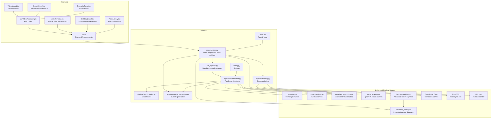
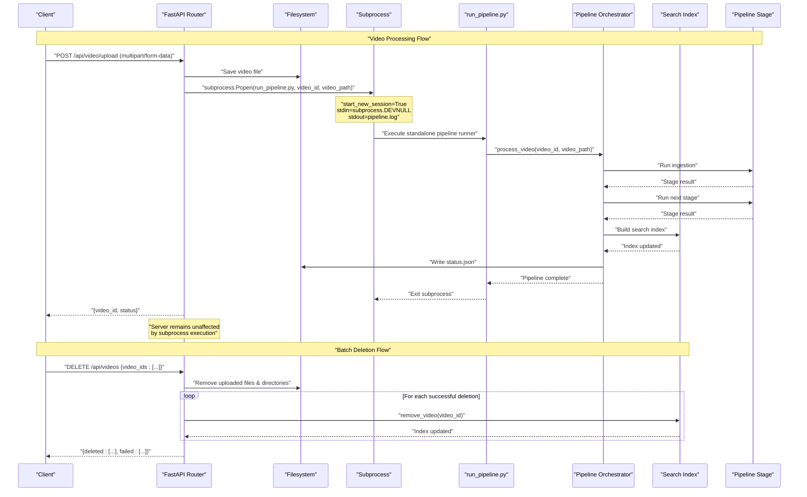
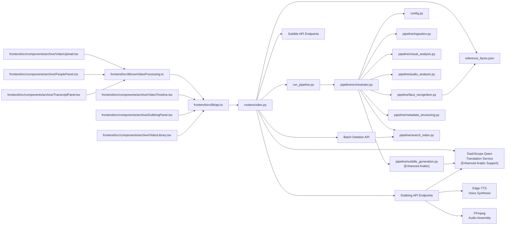

# Video Processing Endpoints

<cite>
**Referenced Files in This Document**
- [backend/routers/video.py](file://backend/routers/video.py)
- [backend/run_pipeline.py](file://backend/run_pipeline.py)
- [backend/pipeline/orchestrator.py](file://backend/pipeline/orchestrator.py)
- [backend/pipeline/search_index.py](file://backend/pipeline/search_index.py)
- [backend/config.py](file://backend/config.py)
- [backend/main.py](file://backend/main.py)
- [backend/pipeline/ingestion.py](file://backend/pipeline/ingestion.py)
- [backend/pipeline/audio_analysis.py](file://backend/pipeline/audio_analysis.py)
- [backend/pipeline/metadata_structuring.py](file://backend/pipeline/metadata_structuring.py)
- [backend/pipeline/visual_analysis.py](file://backend/pipeline/visual_analysis.py)
- [backend/pipeline/face_recognition.py](file://backend/pipeline/face_recognition.py)
- [backend/pipeline/subtitle_generation.py](file://backend/pipeline/subtitle_generation.py)
- [backend/pipeline/dubbing.py](file://backend/pipeline/dubbing.py)
- [frontend/src/lib/api.ts](file://frontend/src/lib/api.ts)
- [frontend/src/lib/useVideoProcessing.ts](file://frontend/src/lib/useVideoProcessing.ts)
- [frontend/src/components/archive/VideoUpload.tsx](file://frontend/src/components/archive/VideoUpload.tsx)
- [frontend/src/components/archive/PeoplePanel.tsx](file://frontend/src/components/archive/PeoplePanel.tsx)
- [frontend/src/components/archive/TranscriptPanel.tsx](file://frontend/src/components/archive/TranscriptPanel.tsx)
- [frontend/src/components/archive/VideoTimeline.tsx](file://frontend/src/components/archive/VideoTimeline.tsx)
- [frontend/src/components/archive/DubbingPanel.tsx](file://frontend/src/components/archive/DubbingPanel.tsx)
- [frontend/src/components/archive/VideoLibrary.tsx](file://frontend/src/components/archive/VideoLibrary.tsx)
- [README.md](file://README.md)
</cite>

## Update Summary
**Changes Made**
- Added comprehensive documentation for the new DELETE /api/videos batch video deletion endpoint
- Updated API reference section with detailed request/response schemas for the deletion endpoint
- Enhanced troubleshooting guide with deletion-specific error handling and cleanup procedures
- Updated practical examples section with curl and JavaScript implementations for batch deletion
- Added frontend integration details showing how the VideoLibrary component implements batch deletion functionality

## Table of Contents
1. [Introduction](#introduction)
2. [Project Structure](#project-structure)
3. [Core Components](#core-components)
4. [Architecture Overview](#architecture-overview)
5. [Detailed Component Analysis](#detailed-component-analysis)
6. [Enhanced Face Recognition System](#enhanced-face-recognition-system)
7. [Subtitle Generation System](#subtitle-generation-system)
8. [Dubbing System](#dubbing-system)
9. [Transcript Translation System](#transcript-translation-system)
10. [Batch Video Deletion System](#batch-video-deletion-system)
11. [Dependency Analysis](#dependency-analysis)
12. [Performance Considerations](#performance-considerations)
13. [Troubleshooting Guide](#troubleshooting-guide)
14. [Conclusion](#conclusion)
15. [Appendices](#appendices)

## Introduction
This document provides comprehensive API documentation for the video processing endpoints that power the AI-powered media archive. It covers:
- POST /api/video/upload for video file uploads with subprocess-based execution model for enhanced reliability and process isolation
- GET /api/video/{video_id}/status for retrieving processing pipeline status with detailed progress information
- GET /api/video/{video_id}/metadata for accessing structured metadata results from all pipeline stages with enhanced face recognition data
- GET /api/video/{video_id}/transcript for retrieving speech-to-text transcripts
- GET /api/video/{video_id}/subtitles for retrieving WebVTT subtitle content with multi-language support
- GET /api/video/{video_id}/subtitles/download for downloading subtitles as SRT or VTT files
- **NEW** POST /api/video/{video_id}/dub for submitting dubbing jobs with target language specification
- **NEW** GET /api/video/{video_id}/dub/status for monitoring dubbing job progress and completion status
- **NEW** GET /api/video/{video_id}/dub/languages for checking available dubbed languages and supported options
- **NEW** GET /api/video/{video_id}/dubbed/{language} for streaming or downloading dubbed video content
- POST /api/video/{video_id}/translate-transcript for real-time transcript translation into Arabic, French, and Russian languages with DashScope Qwen integration
- POST /api/video/{video_id}/faces/name for assigning names to detected persons with optional reference database integration
- GET/POST /api/search for semantic search with dual HTTP method support and person-specific filtering
- POST /api/reindex for rebuilding search indexes from existing processed videos
- **NEW** DELETE /api/videos for batch video deletion with comprehensive cleanup including file system removal and search index purging

The documentation includes request/response schemas, error codes, file upload handling, subtitle generation workflows, dubbing capabilities, batch deletion operations, and practical examples using curl commands and JavaScript implementations.

**Updated** The system now features comprehensive batch video deletion capabilities with automatic cleanup of uploaded files, output directories, and search index entries. The deletion endpoint provides detailed response reporting distinguishing between successfully deleted videos and failures, ensuring reliable resource management and data integrity.

## Project Structure
The video processing system consists of:
- FastAPI backend with routers and pipeline orchestration using subprocess-based execution for process isolation
- Standalone pipeline runner that executes as a separate process for enhanced reliability
- **Enhanced** AI pipeline stages powered by Alibaba Cloud DashScope models with advanced face recognition and transcript translation
- Frontend client utilities for uploading, consuming APIs, managing person identification, transcript translation, subtitle management, dubbing operations, and batch video deletion
- **New** Subtitle generation module with automatic multi-language subtitle creation and caching
- **New** Dubbing module with Edge-TTS voice synthesis and FFmpeg audio assembly
- **New** Batch deletion module with comprehensive cleanup operations and search index synchronization
- Reference database system for persistent person recognition across videos



**Diagram sources**
- [backend/main.py:1-44](file://backend/main.py#L1-L44)
- [backend/routers/video.py:1-930](file://backend/routers/video.py#L1-L930)
- [backend/run_pipeline.py:1-29](file://backend/run_pipeline.py#L1-L29)
- [backend/pipeline/orchestrator.py:1-403](file://backend/pipeline/orchestrator.py#L1-L403)
- [backend/config.py:1-33](file://backend/config.py#L1-L33)
- [backend/pipeline/search_index.py:1-385](file://backend/pipeline/search_index.py#L1-L385)
- [backend/pipeline/face_recognition.py:1-660](file://backend/pipeline/face_recognition.py#L1-L660)
- [backend/pipeline/subtitle_generation.py:1-577](file://backend/pipeline/subtitle_generation.py#L1-L577)
- [backend/pipeline/dubbing.py:1-508](file://backend/pipeline/dubbing.py#L1-L508)
- [frontend/src/components/archive/DubbingPanel.tsx:1-338](file://frontend/src/components/archive/DubbingPanel.tsx#L1-L338)
- [frontend/src/components/archive/VideoLibrary.tsx:1-297](file://frontend/src/components/archive/VideoLibrary.tsx#L1-L297)

**Section sources**
- [README.md:148-168](file://README.md#L148-L168)
- [backend/main.py:1-44](file://backend/main.py#L1-L44)

## Core Components
- Video upload router: Handles multipart/form-data uploads, saves files, initializes status, and launches the pipeline as a completely separate subprocess for process isolation and enhanced reliability
- **Enhanced** Transcript translation router: Provides real-time translation of transcript segments into Arabic, French, and Russian using DashScope Qwen models with exponential backoff retry logic and improved Arabic language identification
- **NEW** Batch deletion router: Manages batch video deletion with comprehensive cleanup including file system removal and search index purging with detailed response reporting
- **NEW** Dubbing router: Manages dubbing job submission, progress tracking, and dubbed video delivery with Edge-TTS voice synthesis and FFmpeg audio assembly
- **Enhanced** Subtitle generation router: Manages WebVTT and SRT subtitle generation with automatic multi-language support, enhanced Arabic language handling, and intelligent caching
- **Enhanced** Face naming router: Manages person identification with manual naming, reference database integration, and immediate search indexing
- Standalone pipeline runner: Executes the pipeline in a separate Python process with full isolation from the main API server
- **Enhanced** Pipeline orchestrator: Coordinates six stages with progress tracking, error handling, integrated face recognition with OCR/transcript context, and automatic subtitle generation
- **Enhanced** Search index: Manages FAISS-based vector search with DashScope text embeddings, person-specific search, rebuild capability, and video removal functionality
- **Enhanced** Face recognition system: Advanced person identification using batch processing, OCR text analysis, transcript context, and reference database matching
- **NEW** Dubbing system: Automatic voice synthesis with Edge-TTS, professional translation via DashScope Qwen, and FFmpeg audio assembly with timing preservation
- Frontend API utilities: Provide standard fetch-based upload functionality, typed helpers for uploads, status polling, WebSocket progress streaming, person management, transcript translation, subtitle management, dubbing operations, and batch deletion functionality

Key capabilities:
- Process isolation through subprocess execution prevents pipeline failures from affecting the main API server
- Enhanced reliability with automatic process recovery and resource isolation
- **New** Real-time dubbing with automatic multi-language voice synthesis (Arabic, English, French, Spanish, German, Russian, Hindi, Chinese)
- **New** Intelligent dubbing job queue with duplicate prevention and background task management
- **New** Seamless dubbed video delivery with streaming support and download capabilities
- **New** Professional translation quality using DashScope Qwen models with exponential backoff retry logic and enhanced Arabic language disambiguation
- **New** High-quality voice synthesis using Microsoft Edge-TTS neural voices with proper language-specific voices
- **New** Precise timing preservation during audio assembly using FFmpeg concat operations and silence gaps
- **New** Comprehensive batch deletion with automatic cleanup of uploaded files, output directories, and search index entries
- **Enhanced** Advanced face recognition with OCR text fallback, transcript context, and reference database matching
- **Enhanced** Structured metadata generation (EBUCore XML, IPTC) with person mentions
- Speech-to-text with speaker diarization
- Semantic search with dual HTTP method support and person-specific filtering
- Batch reindexing from existing processed videos

**Updated** The system now implements comprehensive batch video deletion capabilities with automatic cleanup of all associated resources. When users request deletion of one or more videos, the system performs thorough cleanup including removal of uploaded video files, output directories containing processing artifacts, and corresponding entries from the search index. The deletion process provides detailed response reporting, distinguishing between successfully deleted videos and those that failed, ensuring reliable resource management and data integrity.

**Section sources**
- [backend/routers/video.py:655-696](file://backend/routers/video.py#L655-L696)
- [backend/routers/video.py:450-501](file://backend/routers/video.py#L450-L501)
- [backend/routers/video.py:504-539](file://backend/routers/video.py#L504-L539)
- [backend/routers/video.py:542-558](file://backend/routers/video.py#L542-L558)
- [backend/routers/video.py:349-378](file://backend/routers/video.py#L349-L378)
- [backend/routers/video.py:231-316](file://backend/routers/video.py#L231-L316)
- [backend/routers/video.py:41-365](file://backend/routers/video.py#L41-L365)
- [backend/run_pipeline.py:1-29](file://backend/run_pipeline.py#L1-L29)
- [backend/pipeline/orchestrator.py:131-139](file://backend/pipeline/orchestrator.py#L131-L139)
- [backend/pipeline/search_index.py:214-265](file://backend/pipeline/search_index.py#L214-L265)
- [backend/pipeline/face_recognition.py:185-262](file://backend/pipeline/face_recognition.py#L185-L262)
- [backend/pipeline/subtitle_generation.py:238-280](file://backend/pipeline/subtitle_generation.py#L238-L280)
- [backend/pipeline/dubbing.py:56-161](file://backend/pipeline/dubbing.py#L56-L161)
- [frontend/src/components/archive/DubbingPanel.tsx:27-138](file://frontend/src/components/archive/DubbingPanel.tsx#L27-L138)
- [frontend/src/components/archive/VideoLibrary.tsx:100-116](file://frontend/src/components/archive/VideoLibrary.tsx#L100-L116)

## Architecture Overview
The system follows a staged pipeline architecture with subprocess-based execution and process isolation:
1. Upload endpoint receives multipart/form-data via standard HTTP requests
2. Main API server creates a separate subprocess that runs the pipeline independently
3. Subprocess executes the orchestrator which runs stages sequentially with optimized status updates
4. **Enhanced** Audio analysis stage produces transcript segments with timing information
5. **NEW** Dubbing system processes on-demand with background task management and progress tracking
6. **Enhanced** Face recognition stage uses batch processing with OCR text and transcript context for improved person identification
7. Progress updates are streamed via WebSocket and persisted to status.json
8. Results are saved as individual JSON artifacts per stage
9. **Enhanced** Search index is built incrementally during processing with person-specific entries and can be rebuilt via /api/reindex
10. **NEW** Batch deletion endpoint provides comprehensive cleanup of files, directories, and search index entries

**Updated** The system now features comprehensive batch video deletion capabilities as an atomic operation that ensures complete cleanup of all associated resources. When users request deletion of multiple videos, the system processes each video individually, removing uploaded files, output directories, and corresponding search index entries. The deletion process maintains transaction-like behavior by providing detailed response reporting, allowing clients to understand exactly which deletions succeeded and which failed with specific error reasons.



**Diagram sources**
- [backend/routers/video.py:67-129](file://backend/routers/video.py#L67-L129)
- [backend/routers/video.py:655-696](file://backend/routers/video.py#L655-L696)
- [backend/run_pipeline.py:15-28](file://backend/run_pipeline.py#L15-L28)
- [backend/pipeline/orchestrator.py:131-139](file://backend/pipeline/orchestrator.py#L131-L139)
- [backend/pipeline/search_index.py:214-265](file://backend/pipeline/search_index.py#L214-L265)

## Detailed Component Analysis

### POST /api/video/upload
Purpose: Upload a video file and start the processing pipeline in a completely separate subprocess for enhanced reliability and process isolation.

- Method: POST
- Path: /api/video/upload
- Content-Type: multipart/form-data
- Request Body:
  - file: binary video file (required)
- Response:
  - video_id: unique identifier for the video
  - filename: original filename
  - status: "queued"
  - message: informational message

**Updated** Upload endpoint now launches the pipeline as a completely separate subprocess using `subprocess.Popen()` with `start_new_session=True` for full process isolation. The main API server returns immediately after launching the subprocess, ensuring it never blocks regardless of pipeline duration or resource usage.

Behavior:
- Validates and saves the uploaded file to the configured upload directory using async file operations
- Creates initial status.json with pending stages
- Launches pipeline as a separate subprocess using `subprocess.Popen()` with full isolation
- Returns immediately with queued status

Process isolation benefits:
- Pipeline failures cannot crash the main API server
- Long-running processes don't block server resources
- Memory leaks in pipeline stages don't affect server stability
- Process termination is handled independently
- Automatic recovery from pipeline crashes
- Resource monitoring and cleanup through separate process lifecycle

Supported formats and limits:
- Frontend accepts MP4, MOV, AVI
- Maximum file size indicated as 2GB in UI
- Backend does not enforce explicit size limits in the upload handler

Error codes:
- 400: Invalid request (missing file)
- 500: Failed to save uploaded file or launch subprocess

curl example:
```bash
curl -X POST "http://localhost:8000/api/video/upload" \
  -H "Content-Type: multipart/form-data" \
  -F "file=@/path/to/video.mp4"
```

JavaScript fetch example:
```javascript
const formData = new FormData();
formData.append("file", fileBlob);

// Standard fetch request (no progress tracking)
const response = await fetch("http://localhost:8000/api/video/upload", {
  method: "POST",
  body: formData
});

const result = await response.json();
console.log("video_id:", result.video_id);
```

**Section sources**
- [backend/routers/video.py:67-129](file://backend/routers/video.py#L67-L129)
- [backend/run_pipeline.py:15-28](file://backend/run_pipeline.py#L15-L28)

### GET /api/video/{video_id}/status
Purpose: Retrieve the current pipeline status and progress using optimized synchronous file reading.

- Method: GET
- Path: /api/video/{video_id}/status
- Path Parameters:
  - video_id: UUID of the video
- Response Schema:
  - video_id: string
  - status: "queued" | "processing" | "completed" | "completed_with_errors"
  - progress: number (0-100)
  - stages: object with stage names as keys and statuses as values
  - filename: string
  - created_at: ISO timestamp
  - updated_at: ISO timestamp
  - errors: object mapping failed stages to error messages

**Updated** Status retrieval now uses synchronous file reading for the tiny status.json file to avoid thread pool contention, providing optimal performance for frequent status checks. This optimization ensures minimal CPU overhead during high-frequency polling scenarios.

curl example:
```bash
curl "http://localhost:8000/api/video/<video_id>/status"
```

JavaScript fetch example:
```javascript
const response = await fetch("http://localhost:8000/api/video/<video_id>/status");
const status = await response.json();
console.log("progress:", status.progress);
console.log("stages:", status.stages);
```

WebSocket alternative:
- Connect to ws://localhost:8000/ws/pipeline/{video_id}
- Receive real-time progress updates during processing with improved connection management
- Automatic fallback to REST polling when WebSocket connections fail

**Section sources**
- [backend/routers/video.py:134-149](file://backend/routers/video.py#L134-L149)
- [backend/pipeline/orchestrator.py:62-72](file://backend/pipeline/orchestrator.py#L62-L72)

### GET /api/video/{video_id}/metadata
Purpose: Access structured metadata results from all pipeline stages with enhanced face recognition data.

- Method: GET
- Path: /api/video/{video_id}/metadata
- Path Parameters:
  - video_id: UUID of the video
- Response Schema:
  - video_id: string
  - ingestion: object (from ingestion stage)
  - visual_analysis: object (from visual analysis stage)
  - metadata: object (from metadata structuring stage)
  - faces: array of enhanced face objects (from face recognition stage)
  - Any missing stage results are omitted or include an error field

**Enhanced** Face recognition results now include:
- identified: boolean indicating if person was successfully identified
- name_en: English name (if identified)
- name_ar: Arabic name (if available)
- role: Person's role or title
- confidence: Confidence score for identification (0-1)
- source: Identification source ("reference_db", "ocr", "transcript", "ai_suggestion", "manual")
- appearances: Array of appearance time ranges with start/end timestamps
- description: Physical description of the person
- reasoning: Explanation of how identification was made

Typical ingestion fields:
- audio_path: string
- thumbnail_path: string
- duration: number
- resolution: string
- fps: number
- codec: string

Typical visual_analysis fields:
- scenes: array of scene objects
- objects: array of detected objects
- landmarks: array of landmarks
- text_ocr: array of OCR text
- sensitive_content: array of sensitive content flags
- overall_summary_en/ar: strings
- era_estimate: object

Typical metadata fields:
- ebucore_xml: string (EBUCore XML)
- iptc_video_metadata: object (IPTC Video Metadata Hub)
- topic_codes: array of strings
- topic_names_en/ar: arrays of strings
- sentiment_tags: array of strings
- tone: string
- content_rating: string
- geographic_tags: array of strings
- persons_mentioned: array of person objects

curl example:
```bash
curl "http://localhost:8000/api/video/<video_id>/metadata"
```

JavaScript fetch example:
```javascript
const response = await fetch("http://localhost:8000/api/video/<video_id>/metadata");
const metadata = await response.json();
console.log("topics:", metadata.metadata.topic_codes);
console.log("identified persons:", metadata.faces.filter(f => f.identified).length);
```

**Section sources**
- [backend/routers/video.py:154-188](file://backend/routers/video.py#L154-L188)
- [backend/pipeline/ingestion.py:44-51](file://backend/pipeline/ingestion.py#L44-L51)
- [backend/pipeline/metadata_structuring.py:81-163](file://backend/pipeline/metadata_structuring.py#L81-L163)
- [backend/pipeline/face_recognition.py:185-262](file://backend/pipeline/face_recognition.py#L185-L262)

### GET /api/video/{video_id}/transcript
Purpose: Retrieve speech-to-text transcripts with speaker diarization.

- Method: GET
- Path: /api/video/{video_id}/transcript
- Path Parameters:
  - video_id: UUID of the video
- Response Schema:
  - video_id: string
  - segments: array of segment objects
  - full_text: string
  - language: string
  - speaker_count: number

Each segment object typically includes:
- start_time: number (seconds)
- end_time: number (seconds)
- speaker_id: string
- text: string
- words: array of word objects with word, start, end

curl example:
```bash
curl "http://localhost:8000/api/video/<video_id>/transcript"
```

JavaScript fetch example:
```javascript
const response = await fetch("http://localhost:8000/api/video/<video_id>/transcript");
const transcript = await response.json();
console.log("segments count:", transcript.segments.length);
```

**Section sources**
- [backend/routers/video.py:206-222](file://backend/routers/video.py#L206-L222)
- [backend/pipeline/audio_analysis.py:22-59](file://backend/pipeline/audio_analysis.py#L22-L59)

### **NEW** DELETE /api/videos
Purpose: Batch-delete one or more videos with comprehensive cleanup including file system removal and search index purging.

- Method: DELETE
- Path: /api/videos
- Request Body:
  - video_ids: array of strings (required) - List of video IDs to delete
- Response Schema:
  - deleted: array of strings (successfully deleted video IDs)
  - failed: array of objects (failed deletions with error details)
    - video_id: string (the video ID that failed)
    - error: string (error message describing why deletion failed)

**Enhanced** Features:
- **Batch Operations**: Supports deletion of multiple videos in a single API call
- **Comprehensive Cleanup**: Removes both uploaded video files and output directories
- **Search Index Synchronization**: Automatically removes deleted videos from the search index
- **Detailed Response Reporting**: Provides granular success/failure information for each video
- **Atomic Transaction Behavior**: Processes deletions sequentially with consistent state management
- **Robust Error Handling**: Continues processing even if individual deletions fail
- **Resource Management**: Ensures complete cleanup of all associated filesystem resources

Behavior:
- Validates input video IDs array
- For each video ID, attempts to remove both the uploaded file ({video_id}.mp4) and output directory ({video_id}/)
- Tracks successful deletions and failures with detailed error information
- After successful file deletions, removes corresponding entries from the search index
- Returns comprehensive response with both successful and failed deletion results

Error codes:
- 400: Invalid request (empty video_ids array)
- 500: Internal server error during deletion operations

curl example:
```bash
curl -X DELETE "http://localhost:8000/api/videos" \
  -H "Content-Type: application/json" \
  -d '{"video_ids": ["video-id-1", "video-id-2", "video-id-3"]}'
```

JavaScript fetch example:
```javascript
const response = await fetch("http://localhost:8000/api/videos", {
  method: "DELETE",
  headers: {
    "Content-Type: application/json",
  },
  body: JSON.stringify({
    video_ids: ["video-id-1", "video-id-2", "video-id-3"]
  })
});

const result = await response.json();
console.log("Successfully deleted:", result.deleted.length);
console.log("Failed deletions:", result.failed.length);
result.failed.forEach(failure => {
  console.error(`Failed to delete ${failure.video_id}: ${failure.error}`);
});
```

**Section sources**
- [backend/routers/video.py:655-696](file://backend/routers/video.py#L655-L696)
- [backend/pipeline/search_index.py:214-265](file://backend/pipeline/search_index.py#L214-L265)

### **NEW** Dubbing System

#### On-Demand Dubbing Pipeline
The dubbing system provides comprehensive video dubbing capabilities with professional translation and voice synthesis:

**Dubbing Workflow:**
1. **Job Submission**: Accepts dubbing requests with target language specification
2. **Background Processing**: Runs as asynchronous task to prevent API blocking
3. **Transcript Loading**: Reads transcript segments with timing information
4. **Professional Translation**: Translates segments using DashScope Qwen models with enhanced Arabic language identification
5. **Voice Synthesis**: Generates speech using Edge-TTS neural voices
6. **Audio Assembly**: Combines segments with precise timing using FFmpeg
7. **Video Muxing**: Creates final dubbed video with original video track
8. **Progress Tracking**: Updates status files for real-time monitoring

**Language Support:**
- **Arabic (ar)**: Saudi Arabian male/female voices with RTL support and Modern Standard Arabic identification
- **English (en)**: US male voices with American pronunciation
- **French (fr)**: European French male voices with cultural context
- **Spanish (es)**: Castilian Spanish male voices
- **German (de)**: German male voices with proper accentuation
- **Russian (ru)**: Russian male voices with Cyrillic support
- **Hindi (hi)**: Indian Hindi male voices
- **Chinese (zh)**: Simplified Chinese male voices

**Quality Assurance:**
- Professional translator prompts ensure contextual accuracy with enhanced Arabic language disambiguation
- Temperature control (0.3) balances creativity with fidelity
- Token limits prevent excessive response sizes
- Error handling ensures graceful degradation
- Exponential backoff retry logic for reliability

#### Technical Implementation
The dubbing system leverages multiple technologies for optimal quality:

**Translation Layer:**
- Uses DashScope Qwen models for high-quality translation with improved Arabic language identification
- Implements numbered segment markers for precise parsing
- Maintains timing information throughout translation process
- Provides fallback mechanisms for API failures

**Speech Synthesis:**
- Employs Microsoft Edge-TTS for natural-sounding voices
- Uses language-specific neural voices for authenticity
- Handles empty segments gracefully with silence insertion
- Provides robust error handling for synthesis failures

**Audio Processing:**
- Utilizes FFmpeg for precise audio assembly and timing
- Maintains exact timing synchronization with original video
- Inserts appropriate silence gaps between segments
- Creates seamless audio tracks that match original pacing

#### Frontend Integration
The DubbingPanel component provides comprehensive dubbing management:
- Language selection dropdown with native language labels
- Real-time progress tracking with animated progress bars
- Available dubbed versions listing with play/download controls
- Inline video player for previewing dubbed content
- Automatic polling for job status updates
- Error state management and user feedback

**Section sources**
- [backend/pipeline/dubbing.py:56-161](file://backend/pipeline/dubbing.py#L56-L161)
- [backend/routers/video.py:448-522](file://backend/routers/video.py#L448-L522)
- [frontend/src/components/archive/DubbingPanel.tsx:27-138](file://frontend/src/components/archive/DubbingPanel.tsx#L27-L138)
- [frontend/src/components/archive/DubbingPanel.tsx:114-138](file://frontend/src/components/archive/DubbingPanel.tsx#L114-L138)

### Subtitle Generation System

#### Automatic Subtitle Generation Pipeline
The subtitle generation system provides seamless integration between speech-to-text content and multi-language subtitle creation:

**Generation Workflow:**
1. **Transcript Loading**: Reads transcript segments from transcript.json after audio analysis completion
2. **English Generation**: Creates WebVTT files directly from source transcript segments
3. **Translation Processing**: Translates segments into Arabic, French, and Russian using DashScope Qwen models with enhanced Arabic language identification
4. **File Caching**: Persists generated VTT files for fast subsequent access
5. **Error Resilience**: Continues processing even if individual language translations fail

**Language Support:**
- **English (en)**: Source language - direct conversion from transcript segments
- **Arabic (ar)**: Full RTL support with proper text direction handling and Modern Standard Arabic identification
- **French (fr)**: European French with cultural context preservation  
- **Russian (ru)**: Cyrillic script support with proper encoding

**Quality Assurance:**
- Professional translator prompts ensure contextual accuracy with enhanced Arabic language disambiguation
- Temperature control (0.3) balances creativity with fidelity
- Token limits prevent excessive response sizes
- Error handling ensures graceful degradation
- Exponential backoff retry logic for reliability

#### Frontend Integration
The VideoTimeline component provides comprehensive subtitle track management:
- Native HTML5 video player integration with WebVTT tracks
- Language selection dropdown with native language labels
- Real-time caption toggle controls
- SRT download functionality for offline viewing
- Proper text direction handling for RTL languages
- Seamless track switching without page reload

**Section sources**
- [backend/pipeline/subtitle_generation.py:238-280](file://backend/pipeline/subtitle_generation.py#L238-280)
- [backend/pipeline/orchestrator.py:131-139](file://backend/pipeline/orchestrator.py#L131-L139)
- [frontend/src/components/archive/VideoTimeline.tsx:64-114](file://frontend/src/components/archive/VideoTimeline.tsx#L64-114)
- [frontend/src/components/archive/VideoTimeline.tsx:194-204](file://frontend/src/components/archive/VideoTimeline.tsx#L194-204)

### Transcript Translation System

#### Real-Time Translation Architecture
The transcript translation system provides seamless integration between speech-to-text content and multi-language translation services:

**Translation Pipeline:**
1. **Segment Collection**: Gathers transcript segments with timing information
2. **Batch Processing**: Combines segments with numbered markers for efficient API calls
3. **Model Integration**: Uses DashScope Qwen models for high-quality translation with enhanced Arabic language identification
4. **Retry Logic**: Implements exponential backoff for reliability
5. **Result Parsing**: Splits translated content back into individual segments
6. **Timing Preservation**: Maintains original timestamps and speaker attribution

**Language Support:**
- **Arabic (ar)**: Full RTL support with proper text direction handling and Modern Standard Arabic identification
- **French (fr)**: European French with cultural context preservation
- **Russian (ru)**: Cyrillic script support with proper encoding

**Quality Assurance:**
- Professional translator prompts ensure contextual accuracy with enhanced Arabic language disambiguation
- Temperature control (0.3) balances creativity with fidelity
- Token limits prevent excessive response sizes
- Error handling ensures graceful degradation

#### Frontend Integration
The TranscriptPanel component provides intuitive translation controls:
- Language selection dropdown with native language labels
- Real-time translation status indicators
- Bilingual display showing original and translated text
- Proper text direction handling for RTL languages
- Error state management and user feedback

**Section sources**
- [backend/routers/video.py:234-327](file://backend/routers/video.py#L234-L327)
- [frontend/src/components/archive/TranscriptPanel.tsx:82-121](file://frontend/src/components/archive/TranscriptPanel.tsx#L82-121)
- [frontend/src/lib/api.ts:222-233](file://frontend/src/lib/api.ts#L222-233)

### POST /api/video/{video_id}/faces/name
Purpose: Assign or correct the name of a detected person, optionally saving them to the reference database for future recognition.

- Method: POST
- Path: /api/video/{video_id}/faces/name
- Path Parameters:
  - video_id: UUID of the video
- Request Body:
  - face_index: integer (index of the face in the faces array)
  - name_en: string (English name for the person)
  - name_ar: string (optional Arabic name)
  - role: string (optional role or title)
  - add_to_reference: boolean (optional, default false)
- Response Schema:
  - status: "ok"
  - face: updated face object with identification details
  - added_to_reference: boolean indicating if person was added to reference database

**Enhanced** Features:
- Updates face identification in both faces.json and results.json for consistency
- Optionally adds person to reference database for automatic recognition in future videos
- Immediately indexes the named person in the search system for instant discoverability
- Maintains appearance timeline and confidence scoring
- Supports bilingual naming (English and Arabic)

Behavior:
- Validates face index exists within the video's face detection results
- Updates face object with identification details and confidence score
- Persists changes to faces.json and synchronizes with results.json
- Optionally adds person to reference_faces.json database
- Creates searchable entry for immediate semantic search availability

Error codes:
- 404: No faces found for video or video not found
- 400: Invalid face index or empty name provided

curl example:
```bash
curl -X POST "http://localhost:8000/api/video/<video_id>/faces/name" \
  -H "Content-Type: application/json" \
  -d '{
    "face_index": 0,
    "name_en": "Sheikh Mohammed bin Rashid Al Maktoum",
    "role": "Ruler of Dubai",
    "add_to_reference": true
  }'
```

JavaScript fetch example:
```javascript
const response = await fetch(`http://localhost:8000/api/video/${videoId}/faces/name`, {
  method: "POST",
  headers: {
    "Content-Type: application/json",
  },
  body: JSON.stringify({
    face_index: 0,
    name_en: "John Smith",
    role: "CEO",
    add_to_reference: true
  })
});

const result = await response.json();
console.log("Face identified:", result.face.name_en);
console.log("Added to reference:", result.added_to_reference);
```

**Section sources**
- [backend/routers/video.py:701-787](file://backend/routers/video.py#L701-L787)

### GET/POST /api/search
Purpose: Perform semantic search across all indexed videos with dual HTTP method support and enhanced person filtering.

**Updated** Search endpoints now support both GET and POST methods with identical functionality and enhanced person-specific search:
- GET /api/search?query=your+query&top_k=5&type_filter=person
- POST /api/search with JSON body containing query, top_k, type_filter, and video_id

Both methods accept the same SearchRequest model:
- query: string (required)
- top_k: integer (optional, default: 5)
- type_filter: string (optional) - "scene" | "transcript" | "person"
- video_id: string (optional) - filter results to specific video

Response Schema:
- query: string (original query)
- results: array of search result objects
- total: integer (count of results)

Each search result typically includes:
- video_id: string
- title: string
- timestamp: number (seconds)
- description: string
- score: number
- thumbnail: string (optional)
- type: string ("scene", "transcript", or "person")
- persons: array of person names (for person-type results)

curl GET example:
```bash
curl "http://localhost:8000/api/search?query=climate+change&top_k=5&type_filter=person"
```

curl POST example:
```bash
curl -X POST "http://localhost:8000/api/search" \
  -H "Content-Type: application/json" \
  -d '{"query":"Sheikh Mohammed","top_k":5,"type_filter":"person"}'
```

JavaScript fetch example:
```javascript
// GET method with person filter
const response = await fetch("http://localhost:8000/api/search?query=climate+change&top_k=5&type_filter=person");
const results = await response.json();

// POST method with person search  
const response = await fetch("http://localhost:8000/api/search", {
  method: "POST",
  headers: {
    "Content-Type: application/json",
  },
  body: JSON.stringify({
    query: "Sheikh Mohammed",
    top_k: 5,
    type_filter: "person"
  })
});
const results = await response.json();
console.log("Person appearances:", results.results.filter(r => r.type === "person"));
```

**Section sources**
- [backend/routers/video.py:792-834](file://backend/routers/video.py#L792-L834)

### POST /api/reindex
Purpose: Rebuild the search index from all existing processed video results with enhanced person indexing.

- Method: POST
- Path: /api/reindex
- Content-Type: application/json
- Request Body: None
- Response Schema:
  - status: "ok"
  - videos_indexed: number (count of videos successfully indexed)
  - total_vectors: number (total vectors in the rebuilt index)

**Updated** The reindex endpoint now supports both GET and POST methods via @router.api_route decorator, providing flexibility for different client implementations. Enhanced indexing includes person-specific entries from face recognition results.

Behavior:
- Clears existing search index (FAISS or numpy fallback)
- Scans all processed videos in the upload directory
- Loads results.json for each processed video
- Builds searchable segments using orchestrator's _build_searchable_segments method
- Adds segments to the search index with text embeddings
- **Enhanced** Includes person-specific searchable entries from face recognition
- Persists the rebuilt index to disk

**Important**: This endpoint requires existing processed videos with results.json files. Videos that haven't completed processing will be skipped.

Error codes:
- 500: Failed to rebuild search index (various internal errors)

curl example:
```bash
curl -X POST "http://localhost:8000/api/reindex"
```

JavaScript fetch example:
```javascript
const response = await fetch("http://localhost:8000/api/reindex", {
  method: "POST",
});
const result = await response.json();
console.log("Indexed videos:", result.videos_indexed);
console.log("Total vectors:", result.total_vectors);
```

**Section sources**
- [backend/routers/video.py:839-878](file://backend/routers/video.py#L839-L878)
- [backend/pipeline/orchestrator.py:307-367](file://backend/pipeline/orchestrator.py#L307-L367)
- [backend/pipeline/search_index.py:143-213](file://backend/pipeline/search_index.py#L143-L213)

## Enhanced Face Recognition System

### Advanced Person Identification
The face recognition system has been significantly enhanced with multi-source person identification capabilities:

**Multi-Source Matching:**
- **Reference Database Matching**: Compares detected faces against known persons in the reference database
- **OCR Text Analysis**: Extracts names from on-screen text (lower-thirds, captions, labels)
- **Transcript Context**: Identifies persons mentioned in spoken introductions
- **AI Inference**: Uses contextual knowledge for educated guesses when evidence is limited

**Batch Processing:**
- Processes all detected faces in a single LLM call for efficiency
- Handles duplicate face detection and merging
- Provides confidence scores and reasoning for each identification

**Appearance Tracking:**
- Computes precise appearance windows based on scene boundaries
- Merges overlapping appearances into continuous segments
- Provides accurate timing information for video navigation

**Reference Database Integration:**
- Persistent storage of identified persons across videos
- Automatic addition of newly named persons for future recognition
- Deduplication and conflict resolution for existing entries

### Face Recognition Data Structure
Enhanced face objects include:
```json
{
  "description": "Middle-aged man wearing traditional white kandura...",
  "age_estimate": "50-60",
  "gender": "male",
  "timestamp": "01:23",
  "bbox": {"x": 100, "y": 50, "width": 80, "height": 120},
  "identified": true,
  "name_en": "Sheikh Mohammed bin Rashid Al Maktoum",
  "name_ar": "محمد بن راشد آل مكتوم",
  "role": "Ruler of Dubai",
  "confidence": 0.95,
  "source": "reference_db",
  "reasoning": "Matches reference description and appears in official capacity",
  "appearances": [
    {"start": 83.0, "end": 95.5},
    {"start": 150.2, "end": 165.8}
  ]
}
```

**Section sources**
- [backend/pipeline/face_recognition.py:185-262](file://backend/pipeline/face_recognition.py#L185-L262)
- [backend/pipeline/face_recognition.py:404-499](file://backend/pipeline/face_recognition.py#L404-L499)
- [backend/pipeline/face_recognition.py:121-182](file://backend/pipeline/face_recognition.py#L121-L182)

## Dependency Analysis
The video processing endpoints depend on:
- FastAPI routing with subprocess-based execution for process isolation
- Standalone pipeline runner that executes independently from the main server
- Filesystem for saving uploads and results
- External AI services (DashScope) for vision, ASR, text generation, and translation with enhanced Arabic language support
- FFmpeg for local video/audio processing
- FAISS or numpy for vector search indexing
- **Enhanced** Reference database system for persistent person recognition
- **New** Subtitle generation module with automatic multi-language subtitle creation and enhanced Arabic language handling
- **New** Dubbing module with Edge-TTS voice synthesis and FFmpeg audio assembly
- **New** Batch deletion module with comprehensive cleanup operations and search index synchronization
- **New** DashScope Qwen models for transcript translation services with improved Arabic language identification

**Updated** The system now depends on enhanced batch deletion capabilities with automatic cleanup of filesystem resources and search index synchronization. The deletion system integrates seamlessly with the existing search index infrastructure, providing reliable resource management and data integrity while maintaining process isolation and error handling.



**Diagram sources**
- [backend/routers/video.py:17-26](file://backend/routers/video.py#L17-L26)
- [backend/routers/video.py:655-696](file://backend/routers/video.py#L655-L696)
- [backend/run_pipeline.py:12-17](file://backend/run_pipeline.py#L12-17)
- [backend/pipeline/orchestrator.py:14-21](file://backend/pipeline/orchestrator.py#L14-21)
- [backend/config.py:4-17](file://backend/config.py#L4-L17)
- [backend/pipeline/face_recognition.py:17-18](file://backend/pipeline/face_recognition.py#L17-L18)
- [backend/pipeline/subtitle_generation.py:15-26](file://backend/pipeline/subtitle_generation.py#L15-26)
- [backend/pipeline/dubbing.py:23-25](file://backend/pipeline/dubbing.py#L23-25)
- [backend/pipeline/search_index.py:214-265](file://backend/pipeline/search_index.py#L214-L265)
- [frontend/src/lib/api.ts:245-249](file://frontend/src/lib/api.ts#L245-L249)
- [frontend/src/components/archive/DubbingPanel.tsx:4-5](file://frontend/src/components/archive/DubbingPanel.tsx#L4-L5)
- [frontend/src/components/archive/VideoLibrary.tsx:100-116](file://frontend/src/components/archive/VideoLibrary.tsx#L100-L116)

**Section sources**
- [backend/main.py:35-38](file://backend/main.py#L35-L38)
- [backend/routers/video.py:25-27](file://backend/routers/video.py#L25-L27)

## Performance Considerations
- Large video files increase processing time; consider chunked uploads and compression
- ASR transcription is asynchronous and may take several minutes for long audio
- Real-time progress streaming via WebSocket reduces polling overhead with optimized connection management
- **Updated** Subprocess-based execution provides complete process isolation, preventing pipeline failures from affecting server performance
- **Updated** Standalone pipeline runner eliminates main server resource contention during long-running operations
- **Enhanced** Face recognition batch processing improves efficiency by processing multiple faces in single API calls
- **Enhanced** OCR and transcript context analysis provide additional identification sources without significant performance impact
- **New** Dubbing jobs run asynchronously in background tasks to prevent API blocking
- **New** Intelligent job queuing prevents duplicate dubbing requests for the same video/language
- **New** Edge-TTS voice synthesis is optimized for batch processing with parallel segment synthesis
- **New** FFmpeg audio assembly uses efficient concat operations for minimal processing overhead
- **New** Batch deletion operations are optimized for sequential processing with comprehensive cleanup
- **Enhanced** Subtitle generation uses intelligent caching to minimize redundant translation API calls with enhanced Arabic language handling
- **Enhanced** Reference database lookups are cached and optimized for fast person matching
- **Updated** Process isolation ensures that memory leaks or resource exhaustion in pipeline stages don't affect server stability
- **Updated** Subprocess execution allows for automatic process recovery and cleanup
- **Updated** Separate process execution enables better resource monitoring and control
- **Updated** Improved memory management through process isolation prevents accumulation of memory leaks
- **New** Dubbing translation uses exponential backoff retry logic to prevent overwhelming translation services
- **New** Audio synthesis failures are handled gracefully with silence insertion for missing segments
- **New** Video muxing operations are optimized with streaming to handle large files efficiently
- **New** Background task management prevents memory leaks through proper task lifecycle management
- **New** Batch deletion operations use efficient filesystem operations with proper error handling
- **New** Search index removal operations are optimized to maintain index integrity during bulk deletions

## Troubleshooting Guide
Common issues and resolutions:
- 404 Not Found: Video ID not found or status file missing
- 500 Internal Server Error: File save failures or pipeline exceptions
- API key errors: Ensure DASHSCOPE_API_KEY is configured
- WebSocket disconnects: Use fallback REST polling with automatic retry
- **Updated** Subprocess launch failures: Check that Python interpreter path is correct and run_pipeline.py is accessible
- **Updated** Process isolation issues: Verify that start_new_session=True is working correctly and subprocess has proper permissions
- **Updated** Pipeline not starting: Check pipeline.log file in the video's output directory for execution errors
- **Updated** Memory issues: Subprocess isolation prevents memory leaks from affecting the main server, but monitor individual process memory usage
- **Updated** Process termination: Subprocesses can be terminated independently without affecting the main API server
- **Updated** Resource leaks: Process isolation ensures automatic cleanup when subprocess terminates unexpectedly
- **Enhanced** Face recognition failures: Check reference_faces.json format and DashScope API connectivity
- **Enhanced** Person naming errors: Verify face indices exist and names are properly formatted
- **Enhanced** Search indexing issues: Ensure results.json files contain valid face recognition data
- **New** Dubbing job failures: Check transcript.json availability and Edge-TTS service connectivity
- **New** Dubbing language errors: Verify target language is in supported languages list
- **New** Dubbing progress issues: Check dubbing_{lang}.json and status_{lang}.json files for detailed status
- **New** Voice synthesis failures: Verify Edge-TTS installation and network connectivity
- **New** Audio assembly errors: Check FFmpeg installation and permissions
- **New** Video muxing failures: Verify input video format compatibility and output directory permissions
- **New** Job queue conflicts: Check for duplicate active tasks in _active_dubbing dictionary
- **New** Translation timeouts: Verify DashScope service availability and adjust timeout settings if needed
- **New** Language support errors: Ensure target language is one of the supported codes (ar, en, fr, es, de, ru, hi, zh)
- **New** Format conversion errors: Verify subtitle content integrity during SRT/VTT conversion
- **New** HTML5 player issues: Check WebVTT format compliance and browser subtitle track support
- **New** Batch deletion failures: Check filesystem permissions and verify video IDs exist before deletion
- **New** Search index corruption: Use /api/reindex endpoint to rebuild search index after deletion operations
- **New** File permission errors: Ensure server has write permissions for upload directory and output directories
- **Enhanced** Arabic translation issues: Verify language identification is set to "Modern Standard Arabic (العربية)" and check for Chinese output defaults
- **Enhanced** Subtitle generation problems: Check enhanced Arabic language handling in subtitle generation pipeline

Error handling patterns:
- Upload failures return HTTP 500 with detailed error messages
- Pipeline stage failures are recorded in status.errors
- Frontend gracefully handles WebSocket errors by falling back to REST polling
- Subprocess execution handles network errors and timeouts appropriately
- Search endpoints validate the SearchRequest model and return descriptive error messages
- Reindex operation logs warnings for videos that fail to index and continues processing
- **Updated** Subprocess failures are isolated and don't affect main server availability
- **Updated** Pipeline logs are written to separate pipeline.log files for easier debugging
- **Updated** Process monitoring helps identify and recover from resource exhaustion scenarios
- **Enhanced** Face recognition errors include detailed reasoning and confidence scores for debugging
- **Enhanced** Reference database conflicts are logged and resolved automatically
- **New** Dubbing errors implement exponential backoff retry logic with detailed logging
- **New** Network failures trigger automatic retries with increasing delay intervals
- **New** API rate limiting is handled gracefully with appropriate wait times
- **New** Dubbing job failures are persisted to status files for easy debugging
- **New** Background task failures are logged and cleaned up automatically
- **New** Edge-TTS failures fall back to silence insertion for affected segments
- **New** FFmpeg errors include detailed stderr output for troubleshooting
- **New** Batch deletion errors provide detailed failure reasons for each video ID
- **New** Filesystem errors include specific error messages about permission or path issues
- **Enhanced** Arabic translation errors include specific guidance about language identification and script requirements

**Section sources**
- [backend/routers/video.py:84-86](file://backend/routers/video.py#L84-L86)
- [backend/routers/video.py:147-149](file://backend/routers/video.py#L147-L149)
- [backend/routers/video.py:220-222](file://backend/routers/video.py#L220-L222)
- [backend/routers/video.py:238-253](file://backend/routers/video.py#L238-L253)
- [backend/routers/video.py:358-376](file://backend/routers/video.py#L358-L376)
- [backend/routers/video.py:387-413](file://backend/routers/video.py#L387-L413)
- [backend/routers/video.py:463-474](file://backend/routers/video.py#L463-L474)
- [backend/routers/video.py:504-523](file://backend/routers/video.py#L504-L523)
- [backend/routers/video.py:685-687](file://backend/routers/video.py#L685-L687)
- [backend/pipeline/orchestrator.py:259-282](file://backend/pipeline/orchestrator.py#L259-L282)
- [backend/pipeline/dubbing.py:485-494](file://backend/pipeline/dubbing.py#L485-L494)
- [frontend/src/lib/api.ts:43-95](file://frontend/src/lib/api.ts#L43-L95)

## Conclusion
The video processing endpoints provide a robust foundation for AI-powered media archive workflows with enhanced reliability through subprocess-based execution and advanced face recognition capabilities. They support efficient uploads, process isolation, real-time progress monitoring, and comprehensive metadata extraction with structured outputs suitable for broadcasting standards and semantic search. 

**Enhanced** The new dubbing system provides sophisticated multi-language voice synthesis with automatic translation, professional neural voices, and seamless integration with HTML5 video players. The dubbing system leverages DashScope Qwen models for translation and Edge-TTS for voice synthesis while maintaining temporal accuracy and preserving speaker attribution throughout the translation and synthesis process. Enhanced Arabic language support ensures accurate translation and synthesis for Middle Eastern content.

**Enhanced** The enhanced face recognition system provides sophisticated person identification through multi-source analysis including OCR text, transcript context, and reference database matching. The face naming endpoint enables seamless integration between manual and automatic identification, while the reference database grows over time to improve future recognition accuracy.

**New** The batch deletion system provides comprehensive resource cleanup with automatic removal of uploaded files, output directories, and search index entries. The deletion endpoint offers reliable batch operations with detailed response reporting, ensuring data integrity and proper resource management across the entire video processing pipeline.

**Enhanced** The subtitle generation system provides sophisticated multi-language support with automatic WebVTT creation, intelligent caching, and seamless integration with HTML5 video players. The subtitle system leverages DashScope Qwen models to deliver high-quality translations while maintaining temporal accuracy and preserving speaker attribution throughout the translation process. Enhanced Arabic language identification ensures accurate Modern Standard Arabic output.

The subprocess-based execution model ensures that pipeline failures never affect server availability, while maintaining backward compatibility with existing API endpoints and response structures. The standalone pipeline runner provides complete process isolation, enabling better resource management, automatic recovery, and improved system stability. This architecture prevents memory leaks and ensures better system stability through complete process isolation and automatic cleanup mechanisms.

## Appendices

### Request/Response Schemas

Upload response:
- video_id: string
- filename: string
- status: "queued"
- message: string

Status response:
- video_id: string
- status: "queued"|"processing"|"completed"|"completed_with_errors"
- progress: number
- stages: object with stage names as keys
- filename: string
- created_at: string (ISO timestamp)
- updated_at: string (ISO timestamp)
- errors: object

Metadata response:
- video_id: string
- ingestion: object
- visual_analysis: object
- metadata: object
- faces: array of enhanced face objects with identification details

Transcript response:
- video_id: string
- segments: array
- full_text: string
- language: string
- speaker_count: number

**New** Batch deletion request (DELETE /api/videos):
- video_ids: array of strings (required) - List of video IDs to delete

**New** Batch deletion response (DELETE /api/videos):
- deleted: array of strings (successfully deleted video IDs)
- failed: array of objects (failed deletions with error details)
  - video_id: string (the video ID that failed)
  - error: string (error message describing why deletion failed)

**New** Dubbing request (POST /dub):
- target_language: string (optional, default: "ar") - Supported: ar, en, fr, es, de, ru, hi, zh

**New** Dubbing response (POST /dub):
- status: "processing" | "completed"
- video_id: string
- target_language: string
- cached: boolean (optional)
- video_path: string (optional, only if cached)

**New** Dubbing status response (GET /dub/status):
- video_id: string
- target_language: string
- status: "not_started" | "processing" | "completed" | "failed"
- stage: string (optional)
- error: string (optional)

**Updated** Dubbing languages response (GET /dub/languages):
- video_id: string
- dubbed_languages: array of strings (existing dubbed languages)
- supported_languages: array of strings (all supported languages)

**New** Dubbed video response (GET /dubbed/{language}):
- Content-Type: video/mp4
- Body: MP4 video file with dubbed audio track

Subtitle response (GET /subtitles):
- Content-Type: text/vtt
- Body: WebVTT formatted subtitle content

Subtitle download response (GET /subtitles/download):
- Content-Type: application/x-subrip (SRT) or text/vtt (VTT)
- Content-Disposition: attachment; filename="{video_id}_{language}.{format}"
- Body: Subtitle file content for download

Transcript translation request:
- language: string ("ar", "fr", or "ru")
- segments: array of segment objects
  - text: string (content to translate)
  - start_time: number (segment start time)
  - end_time: number (segment end time)

Transcript translation response:
- translations: array of translated segment objects
  - start_time: number (preserved from original)
  - end_time: number (preserved from original)
  - text: string (translated content)
- language: string (target language code)

Face naming request:
- face_index: integer
- name_en: string
- name_ar: string (optional)
- role: string (optional)
- add_to_reference: boolean (optional)

Face naming response:
- status: "ok"
- face: updated face object
- added_to_reference: boolean

Search response:
- query: string
- results: array
- total: number

Reindex response:
- status: "ok"
- videos_indexed: number
- total_vectors: number

### Practical Examples

curl upload:
```bash
curl -X POST "http://localhost:8000/api/video/upload" \
  -H "Content-Type: multipart/form-data" \
  -F "file=@sample.mp4"
```

JavaScript fetch upload:
```javascript
const formData = new FormData();
formData.append("file", fileBlob);

const response = await fetch("http://localhost:8000/api/video/upload", {
  method: "POST",
  body: formData
});

const result = await response.json();
console.log("video_id:", result.video_id);
```

JavaScript status polling:
```javascript
const response = await fetch(`http://localhost:8000/api/video/${videoId}/status`);
const status = await response.json();
```

JavaScript WebSocket progress:
```javascript
const ws = new WebSocket("ws://localhost:8000/ws/pipeline/" + videoId);
ws.onmessage = (event) => {
  const data = JSON.parse(event.data);
  console.log(`Stage ${data.stage}: ${data.message}`);
};
```

**New** JavaScript batch deletion workflow:
```javascript
// Delete multiple videos at once
const response = await fetch("http://localhost:8000/api/videos", {
  method: "DELETE",
  headers: {
    "Content-Type: application/json",
  },
  body: JSON.stringify({
    video_ids: ["video-id-1", "video-id-2", "video-id-3"]
  })
});

const result = await response.json();
console.log("Successfully deleted:", result.deleted.length);
console.log("Failed deletions:", result.failed.length);

// Handle failures
result.failed.forEach(failure => {
  console.error(`Failed to delete ${failure.video_id}: ${failure.error}`);
});
```

**New** Frontend batch deletion integration:
```javascript
// Using the VideoLibrary component with batch deletion
import VideoLibrary from '@/components/archive/VideoLibrary';

function ArchivePage() {
  const handleRefresh = () => {
    // Refresh video library after deletion
    window.location.reload();
  };

  return (
    <div className="p-6">
      <h1 className="text-2xl font-bold mb-4">Video Archive</h1>
      <VideoLibrary 
        onSelect={(videoId) => console.log('Selected:', videoId)}
        onRefresh={handleRefresh}
      />
    </div>
  );
}
```

**New** Batch deletion with confirmation modal:
```javascript
// Confirmation dialog before batch deletion
async function confirmAndDeleteVideos(videoIds) {
  const confirmed = window.confirm(
    `Are you sure you want to delete ${videoIds.length} videos? This action cannot be undone.`
  );
  
  if (!confirmed) return;
  
  try {
    const response = await fetch("http://localhost:8000/api/videos", {
      method: "DELETE",
      headers: {
        "Content-Type: application/json",
      },
      body: JSON.stringify({ video_ids: videoIds })
    });
    
    const result = await response.json();
    
    if (result.failed.length > 0) {
      alert(`Some deletions failed:\n${result.failed.map(f => `${f.video_id}: ${f.error}`).join('\n')}`);
    } else {
      alert(`Successfully deleted ${result.deleted.length} videos`);
    }
  } catch (error) {
    console.error("Deletion failed:", error);
    alert("An error occurred during deletion");
  }
}
```

JavaScript dubbing workflow:
```javascript
// Start dubbing job
const response = await fetch(`http://localhost:8000/api/video/${videoId}/dub`, {
  method: "POST",
  headers: {
    "Content-Type: application/json",
  },
  body: JSON.stringify({
    target_language: "ar"
  })
});

const result = await response.json();
console.log("Job started:", result.status);

// Poll for status
const pollInterval = setInterval(async () => {
  const status = await fetch(`http://localhost:8000/api/video/${videoId}/dub/status?language=ar`);
  const statusData = await status.json();
  
  if (statusData.status === "completed") {
    clearInterval(pollInterval);
    console.log("Dubbing completed!");
  } else if (statusData.status === "failed") {
    clearInterval(pollInterval);
    console.error("Dubbing failed:", statusData.error);
  }
}, 3000);

// Get available languages
const languages = await fetch(`http://localhost:8000/api/video/${videoId}/dub/languages`);
const langData = await languages.json();
console.log("Available dubs:", langData.dubbed_languages);
console.log("Supported languages:", langData.supported_languages);
```

**New** HTML5 video player with dubbed content:
```html
<!-- Original video -->
<video src="/uploads/video-id/original.mp4" controls></video>

<!-- Dubbed video -->
<video src="/api/video/video-id/dubbed/ar" controls></video>

<!-- Direct download link -->
<a href="/api/video/video-id/dubbed/fr" download="dubbed_video_fr.mp4">
  Download French Version
</a>
```

**New** Dubbing panel integration:
```javascript
// Using the DubbingPanel component
import DubbingPanel from '@/components/archive/DubbingPanel';

function VideoViewer({ videoId }) {
  return (
    <div>
      <video src={`/uploads/${videoId}/thumbnail.jpg`} controls />
      <DubbingPanel videoId={videoId} />
    </div>
  );
}
```

JavaScript subtitle retrieval:
```javascript
// Get WebVTT content for Arabic subtitles
const response = await fetch(`http://localhost:8000/api/video/${videoId}/subtitles?language=ar`);
const vttContent = await response.text();
console.log("VTT length:", vttContent.length);

// Download SRT file for French subtitles
const downloadUrl = `http://localhost:8000/api/video/${videoId}/subtitles/download?language=fr&format=srt`;
window.open(downloadUrl, '_blank');
```

HTML5 video player with subtitle tracks:
```html
<video src="video.mp4" controls>
  <track kind="subtitles" src="/api/video/video-id/subtitles?language=en" 
         srcLang="en" label="English" default />
  <track kind="subtitles" src="/api/video/video-id/subtitles?language=ar" 
         srcLang="ar" label="العربية" />
  <track kind="subtitles" src="/api/video/video-id/subtitles?language=fr" 
         srcLang="fr" label="Français" />
  <track kind="subtitles" src="/api/video/video-id/subtitles?language=ru" 
         srcLang="ru" label="Русский" />
</video>
```

JavaScript transcript translation:
```javascript
const response = await fetch(`http://localhost:8000/api/video/${videoId}/translate-transcript`, {
  method: "POST",
  headers: {
    "Content-Type: application/json",
  },
  body: JSON.stringify({
    language: "ar",
    segments: [
      { text: "Welcome to the conference", start_time: 0, end_time: 3 },
      { text: "Today we discuss innovation", start_time: 3, end_time: 6 }
    ]
  })
});

const result = await response.json();
console.log("Translations:", result.translations);
console.log("Target language:", result.language);
```

JavaScript face naming:
```javascript
const response = await fetch(`http://localhost:8000/api/video/${videoId}/faces/name`, {
  method: "POST",
  headers: {
    "Content-Type: application/json",
  },
  body: JSON.stringify({
    face_index: 0,
    name_en: "John Smith",
    role: "CEO",
    add_to_reference: true
  })
});

const result = await response.json();
console.log("Person identified:", result.face.name_en);
console.log("Added to reference:", result.added_to_reference);
```

JavaScript search (GET):
```javascript
const response = await fetch("http://localhost:8000/api/search?query=climate+change&top_k=5&type_filter=person");
const results = await response.json();
```

JavaScript search (POST):
```javascript
const response = await fetch("http://localhost:8000/api/search", {
  method: "POST",
  headers: {
    "Content-Type: application/json",
  },
  body: JSON.stringify({
    query: "Sheikh Mohammed",
    top_k: 5,
    type_filter: "person"
  })
});
const results = await response.json();
```

curl reindex:
```bash
curl -X POST "http://localhost:8000/api/reindex"
```

JavaScript reindex:
```javascript
const response = await fetch("http://localhost:8000/api/reindex", {
  method: "POST",
});
const result = await response.json();
console.log("Indexed videos:", result.videos_indexed);
```

### Enhanced Face Recognition Workflow

The enhanced face recognition system follows this workflow:

1. **Detection**: Visual analysis detects faces in video frames
2. **Context Collection**: Gathers OCR text, transcript segments, and scene boundaries
3. **Batch Processing**: Sends all faces to LLM with reference database and context
4. **Identification**: Matches faces using multiple sources with confidence scoring
5. **Deduplication**: Groups same-person appearances and merges timelines
6. **Persistence**: Saves results and optionally adds to reference database
7. **Search Indexing**: Creates searchable entries for named persons

This workflow provides significantly improved person identification accuracy while maintaining performance through batch processing and intelligent context utilization.

### Subtitle Generation Workflow

The subtitle generation system follows this automated workflow:

1. **Transcript Loading**: Reads transcript segments from transcript.json after audio analysis completion
2. **English Generation**: Creates WebVTT files directly from source transcript segments
3. **Translation Processing**: Translates segments into Arabic, French, and Russian using DashScope Qwen models with enhanced Arabic language identification
4. **File Caching**: Persists generated VTT files for fast subsequent access
5. **On-Demand Generation**: Generates subtitles on-demand when first requested via API
6. **Format Conversion**: Converts between SRT and VTT formats while preserving timing
7. **Error Resilience**: Continues processing even if individual language translations fail

This workflow provides automatic multi-language subtitle creation while maintaining temporal accuracy and minimizing API costs through intelligent caching.

### Dubbing Workflow

The dubbing system follows this comprehensive workflow:

1. **Job Submission**: Accepts dubbing requests with target language specification
2. **Background Task Creation**: Creates asyncio task for non-blocking processing
3. **Transcript Loading**: Reads transcript segments with timing information
4. **Professional Translation**: Translates segments using DashScope Qwen models with enhanced Arabic language identification
5. **Voice Synthesis**: Generates speech using Edge-TTS neural voices
6. **Audio Assembly**: Combines segments with precise timing using FFmpeg
7. **Video Muxing**: Creates final dubbed video with original video track
8. **Progress Tracking**: Updates status files for real-time monitoring
9. **Result Caching**: Persists dubbed videos for future access

This workflow provides professional-quality dubbing while maintaining temporal accuracy and minimizing processing overhead through intelligent caching and background task management.

### Transcript Translation Workflow

The transcript translation system follows this workflow:

1. **Segment Collection**: Gathers transcript segments with timing information
2. **Batch Preparation**: Joins segments with numbered markers for single API call
3. **Model Request**: Sends translation request to DashScope Qwen with professional prompt and enhanced Arabic language identification
4. **Retry Logic**: Implements exponential backoff for reliability (1s, 2s, 4s delays)
5. **Response Parsing**: Splits translated content back into individual segments
6. **Timing Preservation**: Maintains original timestamps and speaker attribution
7. **Error Handling**: Graceful degradation with detailed logging and user feedback

This workflow provides reliable multi-language translation while preserving temporal accuracy and maintaining the integrity of the original transcript structure.

### Batch Deletion Workflow

The batch deletion system follows this comprehensive cleanup workflow:

1. **Input Validation**: Validates video IDs array and prepares deletion operations
2. **Sequential Processing**: Processes each video ID individually for reliable error handling
3. **File Removal**: Removes uploaded video files ({video_id}.mp4) and output directories ({video_id}/)
4. **Search Index Synchronization**: Removes deleted videos from the search index
5. **Response Compilation**: Aggregates successful deletions and detailed failure information
6. **Transaction-like Behavior**: Maintains consistent state across all deletion operations

This workflow provides reliable batch deletion with comprehensive cleanup and detailed response reporting, ensuring data integrity and proper resource management.