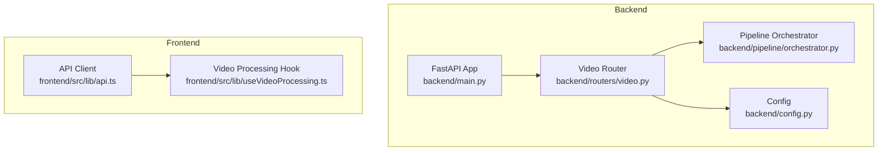
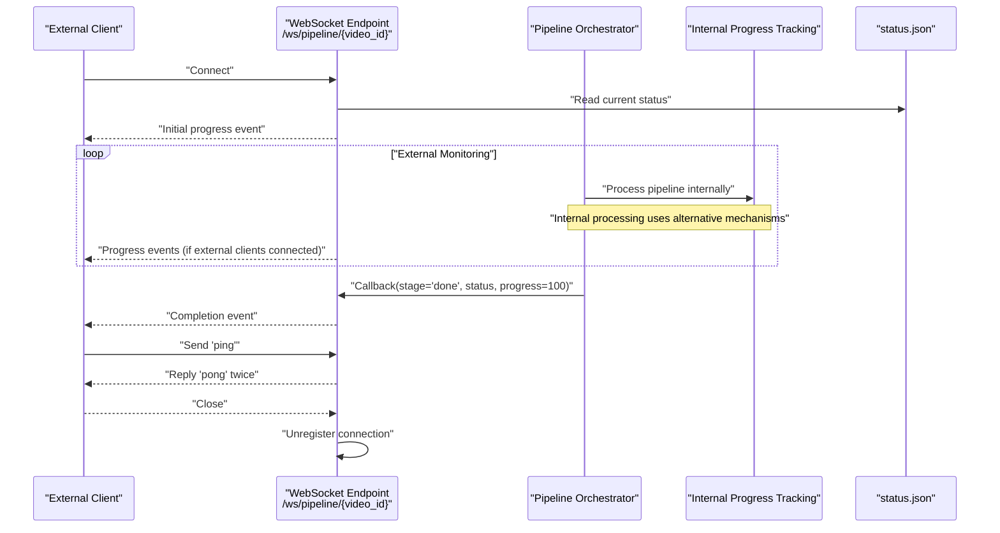
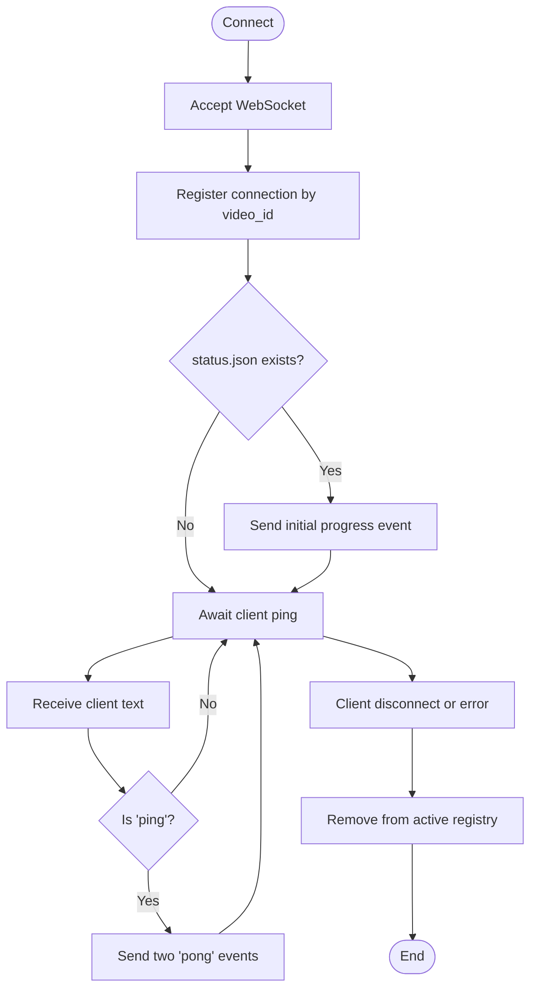
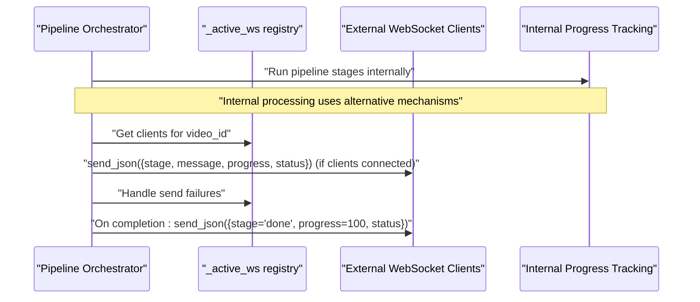
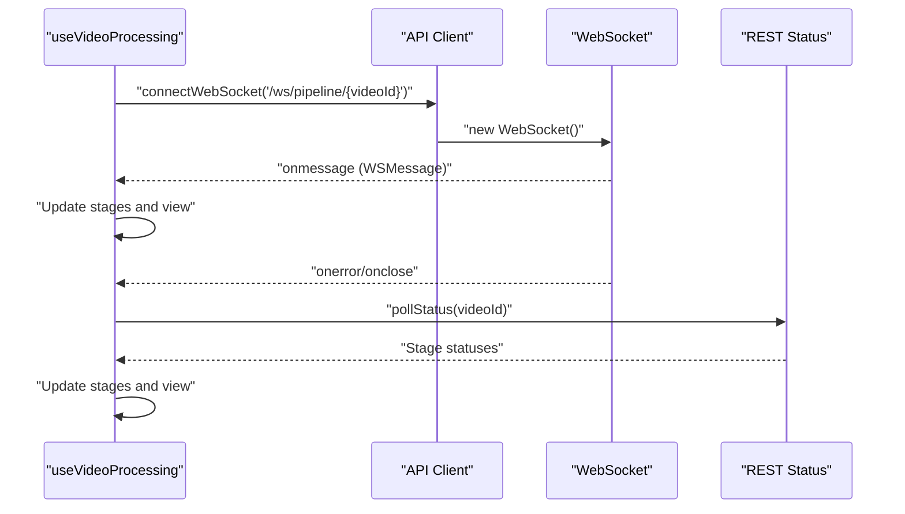
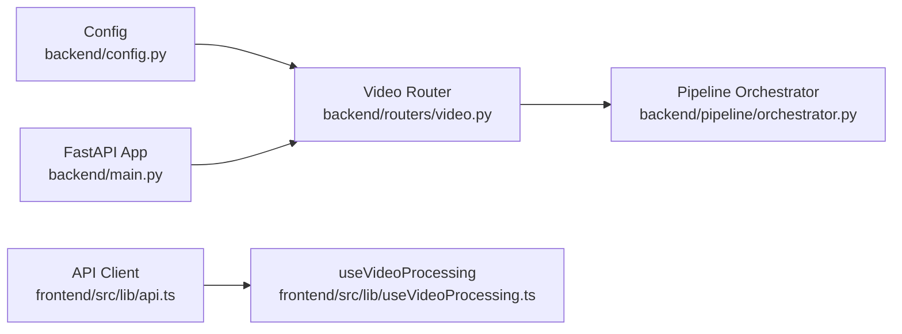

# WebSocket API

<cite>
**Referenced Files in This Document**
- [backend/main.py](file://backend/main.py)
- [backend/routers/video.py](file://backend/routers/video.py)
- [backend/pipeline/orchestrator.py](file://backend/pipeline/orchestrator.py)
- [backend/config.py](file://backend/config.py)
- [frontend/src/lib/api.ts](file://frontend/src/lib/api.ts)
- [frontend/src/lib/useVideoProcessing.ts](file://frontend/src/lib/useVideoProcessing.ts)
</cite>

## Update Summary
**Changes Made**
- Updated WebSocket endpoint documentation to clarify that while endpoints remain available, the internal pipeline no longer uses WebSocket callbacks
- Revised architecture overview to reflect the current implementation where WebSocket endpoints are maintained for external use
- Updated troubleshooting guidance to account for the change in internal callback usage
- Enhanced client-side integration notes to explain the current fallback mechanisms

## Table of Contents
1. [Introduction](#introduction)
2. [Project Structure](#project-structure)
3. [Core Components](#core-components)
4. [Architecture Overview](#architecture-overview)
5. [Detailed Component Analysis](#detailed-component-analysis)
6. [Dependency Analysis](#dependency-analysis)
7. [Performance Considerations](#performance-considerations)
8. [Troubleshooting Guide](#troubleshooting-guide)
9. [Conclusion](#conclusion)

## Introduction
This document describes the WebSocket real-time progress tracking system for video pipeline processing. The system provides WebSocket endpoints for external clients to monitor video processing progress, though the internal pipeline processing no longer relies on WebSocket callbacks. It focuses on the `/ws/pipeline/{video_id}` endpoint that streams progress updates, completion notifications, and stage transitions to connected clients. It also covers client-side integration patterns, connection lifecycle management, error handling, reconnection strategies, and troubleshooting guidance.

## Project Structure
The WebSocket system spans backend and frontend components:
- Backend FastAPI router defines the WebSocket endpoint and orchestrates pipeline progress callbacks.
- Backend pipeline orchestrator maintains support for WebSocket callbacks while the internal processing uses alternative mechanisms.
- Frontend API module provides a typed WebSocket connection helper and message interface.
- Frontend hook manages connection lifecycle, state updates, and fallback polling.

**Diagram sources**
- [backend/main.py:1-44](file://backend/main.py#L1-L44)
- [backend/routers/video.py:1-311](file://backend/routers/video.py#L1-L311)
- [backend/pipeline/orchestrator.py:1-382](file://backend/pipeline/orchestrator.py#L1-L382)
- [backend/config.py:1-30](file://backend/config.py#L1-L30)
- [frontend/src/lib/api.ts:1-277](file://frontend/src/lib/api.ts#L1-L277)
- [frontend/src/lib/useVideoProcessing.ts:1-533](file://frontend/src/lib/useVideoProcessing.ts#L1-L533)

**Section sources**
- [backend/main.py:1-44](file://backend/main.py#L1-L44)
- [backend/routers/video.py:1-311](file://backend/routers/video.py#L1-L311)
- [frontend/src/lib/api.ts:1-277](file://frontend/src/lib/api.ts#L1-L277)
- [frontend/src/lib/useVideoProcessing.ts:1-533](file://frontend/src/lib/useVideoProcessing.ts#L1-L533)

## Core Components
- WebSocket Endpoint (`/ws/pipeline/{video_id}`)
  - Accepts WebSocket connections and registers them per video_id.
  - Sends initial status snapshot if available.
  - Responds to client ping messages with pong replies.
  - Unregisters connections on disconnect or cleanup.
  - **Updated**: Remains available for external monitoring while internal pipeline uses different mechanisms.
- Pipeline Orchestrator
  - Executes pipeline stages sequentially with internal progress tracking.
  - **Updated**: Maintains ws_callback parameter for external WebSocket integrations but no longer uses callbacks internally.
  - Emits stage transitions, progress percentages, and completion notifications to external WebSocket clients.
- Frontend API Client
  - Provides a typed WebSocket connection helper with onmessage, onerror, and onclose handlers.
  - Defines the `WSMessage` interface for incoming progress events.
- Frontend Hook
  - Manages connection lifecycle, updates UI state based on progress, and falls back to REST polling on WebSocket errors/closures.

Key WebSocket message format:
- Fields: `video_id`, `stage`, `message`, `progress`, `status`
- Example scenarios:
  - Initial connection: `stage="connected"`, `status` reflects current pipeline status.
  - Stage progress: `stage` equals a pipeline stage id, `status` indicates processing state.
  - Completion: `stage="done"` with final status and 100% progress.

**Section sources**
- [backend/routers/video.py:264-311](file://backend/routers/video.py#L264-L311)
- [backend/pipeline/orchestrator.py:44-209](file://backend/pipeline/orchestrator.py#L44-L209)
- [frontend/src/lib/api.ts:99-130](file://frontend/src/lib/api.ts#L99-L130)
- [frontend/src/lib/useVideoProcessing.ts:215-276](file://frontend/src/lib/useVideoProcessing.ts#L215-L276)

## Architecture Overview
The WebSocket pipeline provides external monitoring capabilities while the internal pipeline uses alternative progress tracking mechanisms. The backend maintains active connections per video for external clients while internal processing follows different pathways.

**Diagram sources**
- [backend/routers/video.py:264-311](file://backend/routers/video.py#L264-L311)
- [backend/pipeline/orchestrator.py:95-209](file://backend/pipeline/orchestrator.py#L95-L209)
- [frontend/src/lib/api.ts:107-130](file://frontend/src/lib/api.ts#L107-L130)

## Detailed Component Analysis

### WebSocket Endpoint (`/ws/pipeline/{video_id}`)
Responsibilities:
- Accept connections and register per-video client lists.
- Send initial status snapshot if present.
- Handle keepalive via ping/pong.
- Gracefully unregister on disconnect or cleanup.
- **Updated**: Primarily serves external monitoring needs while internal pipeline uses different mechanisms.

Behavior highlights:
- On connect: registers the WebSocket under the given video_id.
- On disconnect: removes the WebSocket from the registry.
- On error: logs debug info and continues cleanup.

**Diagram sources**
- [backend/routers/video.py:264-311](file://backend/routers/video.py#L264-L311)

**Section sources**
- [backend/routers/video.py:264-311](file://backend/routers/video.py#L264-L311)

### Pipeline Orchestrator Progress Handling
Responsibilities:
- Execute pipeline stages sequentially with internal progress tracking.
- **Updated**: Maintains ws_callback parameter for external WebSocket integrations but no longer uses callbacks internally.
- Persist status to disk after each stage and on completion.
- **Updated**: Internal processing uses alternative mechanisms while still supporting external WebSocket callbacks.

Message emission pattern:
- For each stage: emits `{stage, message, progress, status}` to external WebSocket clients.
- On completion: emits `{stage="done", message, progress=100, status}` to external WebSocket clients.
- **Updated**: Internal pipeline progress tracking occurs independently of WebSocket callbacks.

**Diagram sources**
- [backend/pipeline/orchestrator.py:95-209](file://backend/pipeline/orchestrator.py#L95-L209)
- [backend/routers/video.py:95-120](file://backend/routers/video.py#L95-L120)

**Section sources**
- [backend/pipeline/orchestrator.py:44-209](file://backend/pipeline/orchestrator.py#L44-L209)
- [backend/routers/video.py:95-120](file://backend/routers/video.py#L95-L120)

### Frontend WebSocket Client Integration
Responsibilities:
- Establish WebSocket connections using a typed helper.
- Parse incoming progress events and update UI state.
- Implement fallback polling via REST status endpoint on WebSocket errors/closures.
- Manage connection lifecycle and cleanup.

Client-side patterns:
- Connection: use `connectWebSocket('/ws/pipeline/{video_id}', onMessage, onError, onClose)`.
- Message handling: update stage status, timestamps, and view state.
- Fallback: on error/close, poll `/api/video/{video_id}/status` and optionally fetch results.

**Diagram sources**
- [frontend/src/lib/api.ts:107-130](file://frontend/src/lib/api.ts#L107-L130)
- [frontend/src/lib/useVideoProcessing.ts:215-276](file://frontend/src/lib/useVideoProcessing.ts#L215-L276)

**Section sources**
- [frontend/src/lib/api.ts:99-130](file://frontend/src/lib/api.ts#L99-L130)
- [frontend/src/lib/useVideoProcessing.ts:215-276](file://frontend/src/lib/useVideoProcessing.ts#L215-L276)

### Message Formats and Stage Transitions
- Initial connection event:
  - `stage="connected"`
  - `status`: current pipeline status
  - `progress`: current progress percentage
- Stage progress events:
  - `stage`: one of pipeline stage ids
  - `status`: "running", "completed", or "failed"
  - `progress`: cumulative percentage
- Completion event:
  - `stage="done"`
  - `status`: final pipeline status
  - `progress`: 100

Frontend state mapping:
- Updates stage status, timestamps, and view transitions based on received events.
- Triggers result fetch upon completion.

**Section sources**
- [backend/routers/video.py:283-289](file://backend/routers/video.py#L283-L289)
- [backend/pipeline/orchestrator.py:228-281](file://backend/pipeline/orchestrator.py#L228-L281)
- [frontend/src/lib/useVideoProcessing.ts:223-261](file://frontend/src/lib/useVideoProcessing.ts#L223-L261)

## Dependency Analysis
- Backend dependencies:
  - FastAPI app mounts the video router.
  - Video router depends on the orchestrator and configuration.
  - Orchestrator depends on stage modules and writes status to disk.
  - **Updated**: Orchestrator maintains ws_callback parameter for external WebSocket integrations.
- Frontend dependencies:
  - API client provides WebSocket helper and REST wrappers.
  - Hook consumes API client and manages UI state.

**Diagram sources**
- [backend/main.py:1-44](file://backend/main.py#L1-L44)
- [backend/routers/video.py:1-311](file://backend/routers/video.py#L1-L311)
- [backend/pipeline/orchestrator.py:1-382](file://backend/pipeline/orchestrator.py#L1-L382)
- [backend/config.py:1-30](file://backend/config.py#L1-L30)
- [frontend/src/lib/api.ts:1-277](file://frontend/src/lib/api.ts#L1-L277)
- [frontend/src/lib/useVideoProcessing.ts:1-533](file://frontend/src/lib/useVideoProcessing.ts#L1-L533)

**Section sources**
- [backend/main.py:1-44](file://backend/main.py#L1-L44)
- [backend/routers/video.py:1-311](file://backend/routers/video.py#L1-L311)
- [backend/pipeline/orchestrator.py:1-382](file://backend/pipeline/orchestrator.py#L1-L382)
- [frontend/src/lib/api.ts:1-277](file://frontend/src/lib/api.ts#L1-L277)
- [frontend/src/lib/useVideoProcessing.ts:1-533](file://frontend/src/lib/useVideoProcessing.ts#L1-L533)

## Performance Considerations
- Connection scaling:
  - Active connections are tracked per video_id. Ensure appropriate cleanup to avoid memory leaks.
  - **Updated**: Connections primarily serve external monitoring needs.
- Broadcast efficiency:
  - The orchestrator sends updates to all registered clients. Consider batching or throttling if many clients are expected.
  - **Updated**: External WebSocket broadcasting occurs only when clients are connected.
- Disk I/O:
  - Status persistence occurs frequently during stages. Ensure storage performance is adequate for concurrent writes.
- Network resilience:
  - Client-side ping/pong keeps connections alive. Monitor for excessive reconnects indicating network instability.
- Frontend rendering:
  - Frequent state updates can trigger re-renders. Use memoization and minimal state updates where possible.

## Troubleshooting Guide
Common issues and resolutions:
- Connection fails immediately:
  - Verify backend CORS settings and that the WebSocket URL uses the correct scheme (ws/wss).
  - Confirm the endpoint path matches `/ws/pipeline/{video_id}`.
- No progress events received:
  - Ensure the pipeline is running and that `status.json` exists for the video_id.
  - **Updated**: Check that external WebSocket clients are connected to receive progress updates.
  - Verify that the orchestrator callback mechanism is functioning for external clients.
- Frequent reconnections:
  - Implement client-side exponential backoff and jitter for reconnection attempts.
  - Validate server-side keepalive behavior and network stability.
- Inconsistent state:
  - Use REST polling fallback (`/api/video/{video_id}/status`) when WebSocket is unavailable.
  - Ensure the frontend updates stages based on the latest received status.
- Completion not detected:
  - Listen for `stage="done"` with `progress=100` and `status` reflecting final outcome.
  - Trigger result fetch for metadata and transcript after completion.

Operational checks:
- Backend health: GET `/api/health` to confirm service availability.
- Status file: Verify presence of `status.json` under the video directory.
- Environment configuration: Ensure `BASE_URL`, `UPLOAD_DIR`, and API keys are set appropriately.
- **Updated**: Verify that external WebSocket clients can connect to monitor pipeline progress.

**Section sources**
- [backend/routers/video.py:264-311](file://backend/routers/video.py#L264-L311)
- [backend/pipeline/orchestrator.py:95-209](file://backend/pipeline/orchestrator.py#L95-L209)
- [frontend/src/lib/useVideoProcessing.ts:399-443](file://frontend/src/lib/useVideoProcessing.ts#L399-L443)

## Conclusion
The WebSocket progress tracking system provides external monitoring capabilities for video pipeline execution. While the internal pipeline processing no longer uses WebSocket callbacks internally, the WebSocket endpoints remain available for external monitoring and integration. The backend maintains structured progress events for external clients, while the frontend integrates them into a responsive UI with robust fallback mechanisms. Following the documented patterns ensures reliable, scalable, and maintainable real-time updates for external monitoring purposes.