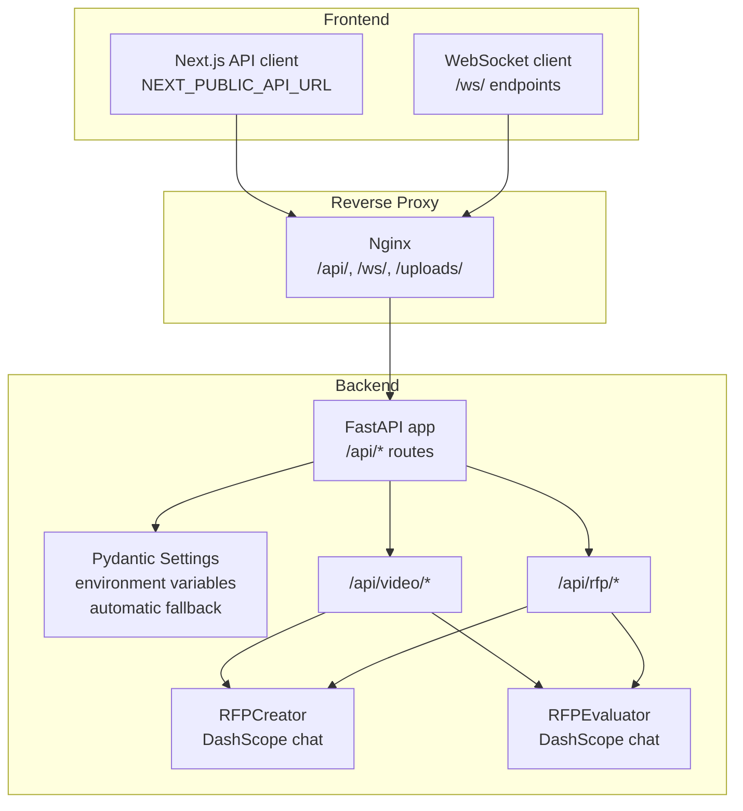
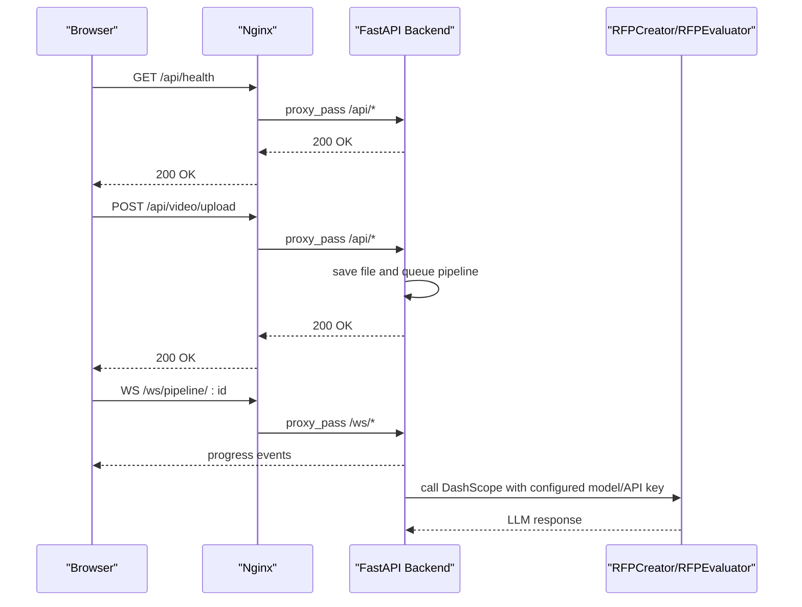
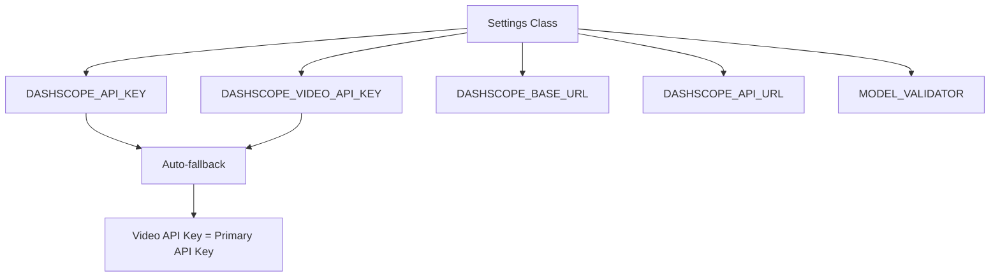
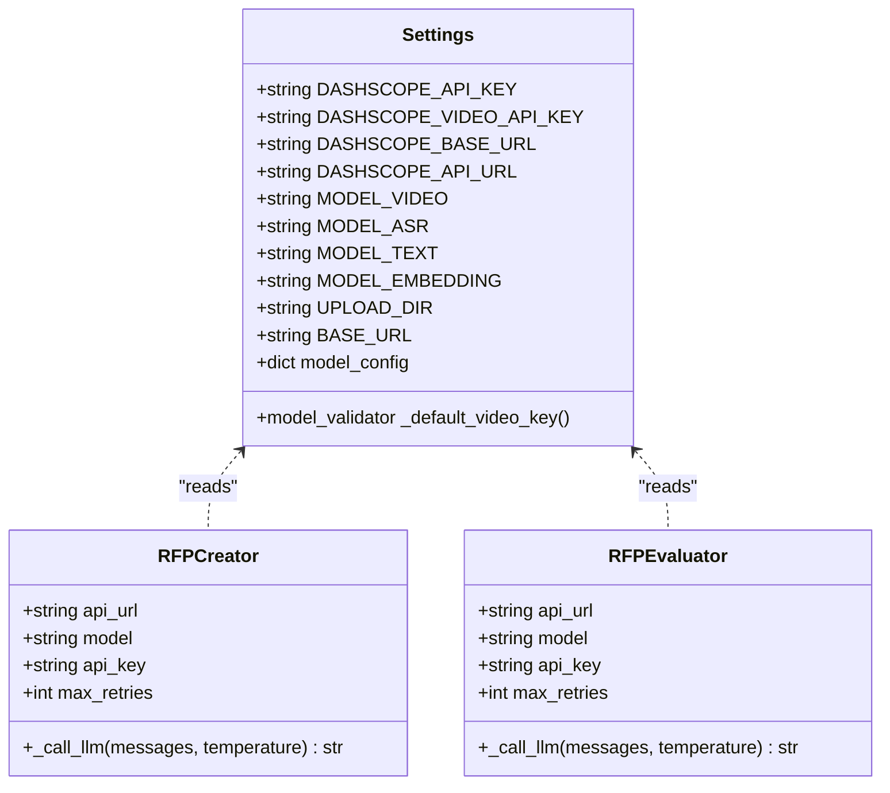
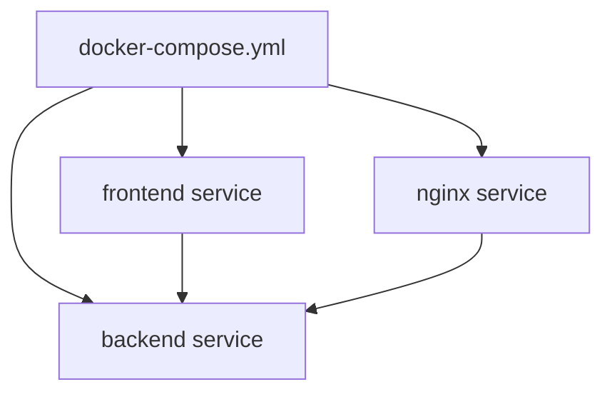
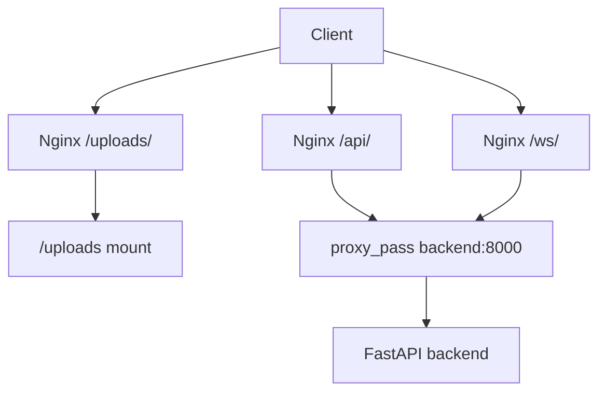
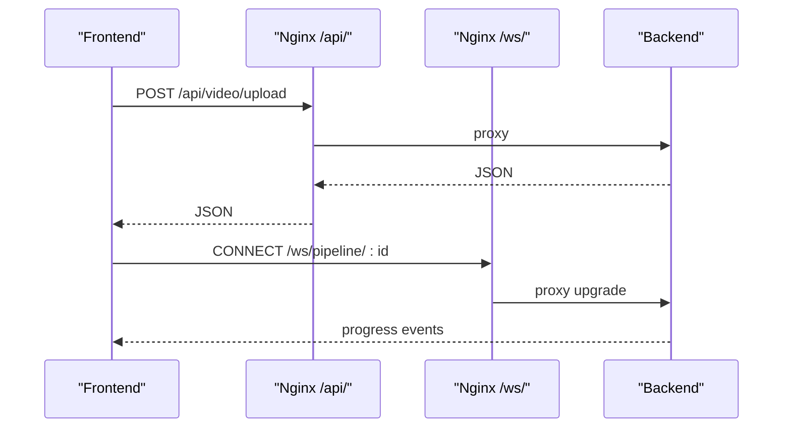
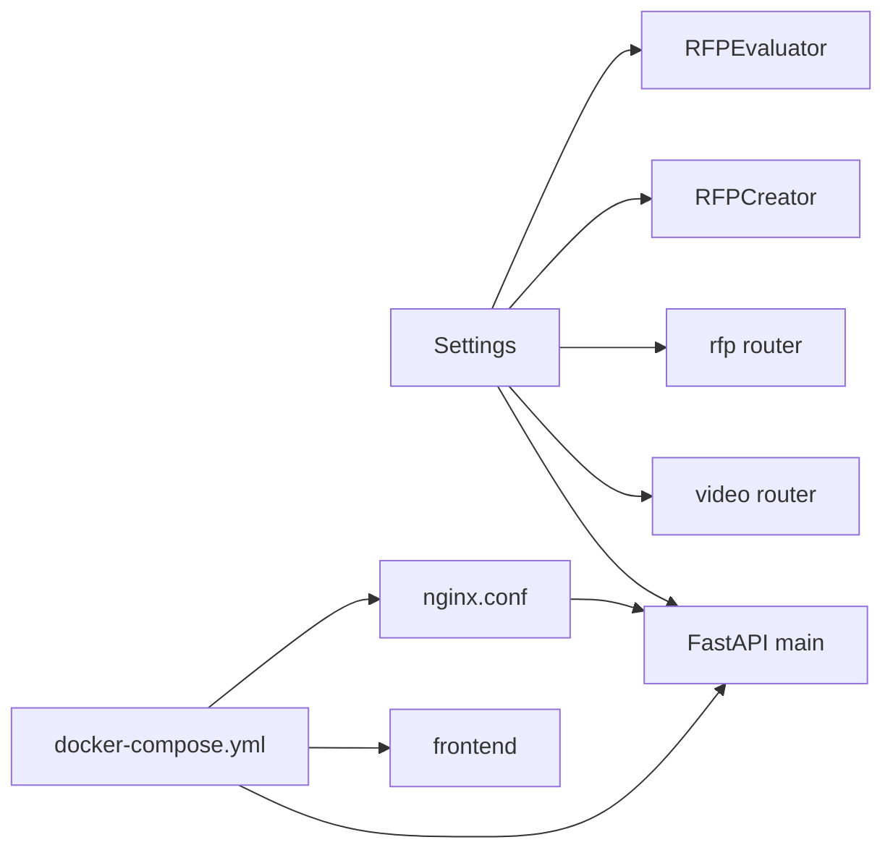

# Configuration and Environment

<cite>
**Referenced Files in This Document**
- [config.py](file://backend/config.py)
- [main.py](file://backend/main.py)
- [docker-compose.yml](file://docker-compose.yml)
- [nginx.conf](file://nginx.conf)
- [.env.example](file://.env.example)
- [api.ts](file://frontend/src/lib/api.ts)
- [useVideoProcessing.ts](file://frontend/src/lib/useVideoProcessing.ts)
- [requirements.txt](file://backend/requirements.txt)
- [rfp_creator.py](file://backend/services/rfp_creator.py)
- [rfp_evaluator.py](file://backend/services/rfp_evaluator.py)
- [video.py](file://backend/routers/video.py)
- [rfp.py](file://backend/routers/rfp.py)
- [visual_analysis.py](file://backend/pipeline/visual_analysis.py)
- [audio_analysis.py](file://backend/pipeline/audio_analysis.py)
</cite>

## Update Summary
**Changes Made**
- Updated environment variables section to include new DASHSCOPE_VIDEO_API_KEY and DASHSCOPE_API_URL fields
- Enhanced configuration management section to document the new model validator for automatic fallback mechanisms
- Updated architecture diagrams to reflect the dual API key system and separate API endpoints
- Added new section documenting the enhanced DashScope configuration system
- Updated troubleshooting guide to address new configuration scenarios

## Table of Contents
1. [Introduction](#introduction)
2. [Project Structure](#project-structure)
3. [Core Components](#core-components)
4. [Architecture Overview](#architecture-overview)
5. [Enhanced DashScope Configuration System](#enhanced-dashscope-configuration-system)
6. [Detailed Component Analysis](#detailed-component-analysis)
7. [Dependency Analysis](#dependency-analysis)
8. [Performance Considerations](#performance-considerations)
9. [Troubleshooting Guide](#troubleshooting-guide)
10. [Conclusion](#conclusion)
11. [Appendices](#appendices)

## Introduction
This document explains how the project manages configuration and environment setup. It covers environment variables, Pydantic settings usage, Docker Compose orchestration, Nginx reverse proxy configuration, and frontend-backend integration. It also provides guidance for production deployment, security best practices for API keys, scaling options, monitoring/logging recommendations, and troubleshooting configuration issues.

**Updated** Enhanced with new DashScope configuration capabilities including separate API keys for different services and dedicated API endpoints.

## Project Structure
The configuration system spans three layers:
- Backend configuration: centralized in a Pydantic settings class with environment loading and automatic fallback mechanisms.
- Orchestration: Docker Compose defines services for backend, frontend, and Nginx, sharing a named volume for uploads.
- Frontend integration: Next.js reads a public API URL from environment variables and connects to backend endpoints and WebSocket streams.

**Diagram sources**
- [docker-compose.yml:1-43](file://docker-compose.yml#L1-L43)
- [nginx.conf:1-51](file://nginx.conf#L1-L51)
- [config.py:4-20](file://backend/config.py#L4-L20)
- [main.py:20-38](file://backend/main.py#L20-L38)
- [api.ts:1-245](file://frontend/src/lib/api.ts#L1-L245)

**Section sources**
- [docker-compose.yml:1-43](file://docker-compose.yml#L1-L43)
- [nginx.conf:1-51](file://nginx.conf#L1-L51)
- [config.py:4-20](file://backend/config.py#L4-L20)
- [main.py:20-38](file://backend/main.py#L20-L38)
- [api.ts:1-245](file://frontend/src/lib/api.ts#L1-L245)

## Core Components
- Backend configuration class encapsulates environment-driven settings with automatic fallback mechanisms and loads from a .env file located relative to the backend directory.
- Docker Compose provisions backend, frontend, and Nginx services, mounts shared uploads storage, and forwards ports.
- Nginx proxies API and WebSocket traffic to the backend and serves uploaded media with caching and CORS headers.
- Frontend reads NEXT_PUBLIC_API_URL to construct API and WebSocket endpoints and interacts with backend routes.

Key configuration parameters:
- DASHSCOPE_API_KEY: Primary API key for general DashScope LLM calls.
- DASHSCOPE_VIDEO_API_KEY: Dedicated API key for video analysis and visual processing.
- DASHSCOPE_BASE_URL: Base URL for DashScope compatible API chat completions.
- DASHSCOPE_API_URL: Dedicated API endpoint for ASR and task management operations.
- MODEL_VIDEO, MODEL_ASR, MODEL_TEXT, MODEL_EMBEDDING: Model identifiers used by services.
- UPLOAD_DIR: Directory for persisted uploads and pipeline artifacts.
- BASE_URL: Public base URL used by the frontend to reach the backend.

Environment variable loading:
- Backend settings load from a .env file path relative to the backend directory.
- Frontend reads NEXT_PUBLIC_API_URL from environment variables during development and runtime.

**Updated** Enhanced with new DASHSCOPE_VIDEO_API_KEY and DASHSCOPE_API_URL fields for granular API key management and separate endpoint configuration.

**Section sources**
- [config.py:4-20](file://backend/config.py#L4-L20)
- [docker-compose.yml:11-12](file://docker-compose.yml#L11-L12)
- [docker-compose.yml:24-25](file://docker-compose.yml#L24-L25)
- [nginx.conf:24-38](file://nginx.conf#L24-L38)
- [api.ts:1-245](file://frontend/src/lib/api.ts#L1-L245)
- [.env.example:1-10](file://.env.example#L1-L10)

## Architecture Overview
The system uses a reverse proxy to centralize routing, enforce timeouts for long-running AI tasks, and serve static uploads. The backend FastAPI app exposes REST and WebSocket endpoints, while services consume DashScope APIs using configured models and API keys with automatic fallback mechanisms.

**Diagram sources**
- [nginx.conf:24-49](file://nginx.conf#L24-L49)
- [main.py:41-43](file://backend/main.py#L41-L43)
- [video.py:39-92](file://backend/routers/video.py#L39-L92)
- [video.py:220-267](file://backend/routers/video.py#L220-L267)
- [rfp_creator.py:70-123](file://backend/services/rfp_creator.py#L70-L123)
- [rfp_evaluator.py:42-104](file://backend/services/rfp_evaluator.py#L42-L104)

## Enhanced DashScope Configuration System

**New Section** The project now features an enhanced DashScope configuration system with granular API key management and separate endpoint configuration for optimal security and performance.

### Dual API Key Architecture
The configuration system now supports separate API keys for different service categories:

- **Primary API Key (DASHSCOPE_API_KEY)**: Used for general text generation and chat completions
- **Video API Key (DASHSCOPE_VIDEO_API_KEY)**: Dedicated key for video analysis and visual processing
- **Automatic Fallback**: The model validator automatically sets the video API key equal to the primary key if not explicitly configured

### Dedicated API Endpoints
- **Base URL (DASHSCOPE_BASE_URL)**: For chat completions and text generation endpoints
- **API URL (DASHSCOPE_API_URL)**: For ASR transcription and task management operations

### Configuration Validation and Fallback
The model validator ensures configuration integrity by automatically setting the video API key from the primary key if not provided, preventing configuration errors and simplifying deployment.

**Diagram sources**
- [config.py:22-26](file://backend/config.py#L22-L26)

**Section sources**
- [config.py:5-26](file://backend/config.py#L5-L26)
- [.env.example:1-10](file://.env.example#L1-L10)

## Detailed Component Analysis

### Backend Configuration Management
- Settings class defines strongly typed environment variables with defaults and loads from a .env file.
- The backend FastAPI app uses settings for upload directory and mounts a static route for uploads.
- Services instantiate API URLs and model names from settings, ensuring consistent configuration across components.
- **New**: Model validator provides automatic fallback for video API keys.

**Diagram sources**
- [config.py:4-26](file://backend/config.py#L4-L26)
- [rfp_creator.py:70-123](file://backend/services/rfp_creator.py#L70-L123)
- [rfp_evaluator.py:42-104](file://backend/services/rfp_evaluator.py#L42-L104)

**Section sources**
- [config.py:4-26](file://backend/config.py#L4-L26)
- [main.py:12-35](file://backend/main.py#L12-L35)
- [rfp_creator.py:70-123](file://backend/services/rfp_creator.py#L70-L123)
- [rfp_evaluator.py:42-104](file://backend/services/rfp_evaluator.py#L42-L104)

### Docker Compose Orchestration
- backend service builds from backend/Dockerfile, exposes port 8000, mounts uploads to a named volume, loads .env, and runs Uvicorn.
- frontend service builds from frontend/Dockerfile, exposes port 3000, sets NEXT_PUBLIC_API_URL, and depends on backend.
- nginx service uses nginx:alpine, binds port 8080, mounts nginx.conf, shares uploads volume, and depends on backend.

**Diagram sources**
- [docker-compose.yml:1-43](file://docker-compose.yml#L1-L43)

**Section sources**
- [docker-compose.yml:1-43](file://docker-compose.yml#L1-L43)

### Nginx Reverse Proxy Setup
- Serves uploaded files from /uploads/ with caching and CORS headers.
- Proxies /api/ to backend:8000 with increased timeouts for long-running AI operations and large uploads.
- Proxies /ws/ to backend:8000 with WebSocket upgrade headers and extended read timeouts.

**Diagram sources**
- [nginx.conf:5-22](file://nginx.conf#L5-L22)
- [nginx.conf:24-38](file://nginx.conf#L24-L38)
- [nginx.conf:40-49](file://nginx.conf#L40-L49)

**Section sources**
- [nginx.conf:1-51](file://nginx.conf#L1-L51)

### Frontend API and WebSocket Integration
- The frontend reads NEXT_PUBLIC_API_URL to construct API and WebSocket endpoints.
- It supports file uploads, REST endpoints for video and RFP workflows, and WebSocket connections for real-time pipeline progress.
- The frontend expects backend endpoints under /api/ and WebSocket endpoints under /ws/.

**Diagram sources**
- [api.ts:1-245](file://frontend/src/lib/api.ts#L1-L245)
- [useVideoProcessing.ts:215-276](file://frontend/src/lib/useVideoProcessing.ts#L215-L276)
- [nginx.conf:24-38](file://nginx.conf#L24-L38)
- [nginx.conf:40-49](file://nginx.conf#L40-L49)

**Section sources**
- [api.ts:1-245](file://frontend/src/lib/api.ts#L1-L245)
- [useVideoProcessing.ts:215-276](file://frontend/src/lib/useVideoProcessing.ts#L215-L276)

## Dependency Analysis
- Backend FastAPI app depends on settings for upload directory and static file serving.
- Routers depend on settings for upload paths and orchestrator/search index instances.
- Services depend on settings for DashScope base URL, model names, and API keys with automatic fallback.
- Docker Compose ties frontend, backend, and Nginx together with shared uploads volume and environment propagation.
- Nginx depends on backend availability and forwards traffic to backend containers.

**Diagram sources**
- [config.py:4-26](file://backend/config.py#L4-L26)
- [main.py:20-38](file://backend/main.py#L20-L38)
- [video.py:17-26](file://backend/routers/video.py#L17-L26)
- [rfp.py:11-17](file://backend/routers/rfp.py#L11-L17)
- [rfp_creator.py:70-74](file://backend/services/rfp_creator.py#L70-L74)
- [rfp_evaluator.py:42-46](file://backend/services/rfp_evaluator.py#L42-L46)
- [docker-compose.yml:1-43](file://docker-compose.yml#L1-L43)
- [nginx.conf:24-49](file://nginx.conf#L24-L49)

**Section sources**
- [config.py:4-26](file://backend/config.py#L4-L26)
- [main.py:20-38](file://backend/main.py#L20-L38)
- [video.py:17-26](file://backend/routers/video.py#L17-L26)
- [rfp.py:11-17](file://backend/routers/rfp.py#L11-L17)
- [rfp_creator.py:70-74](file://backend/services/rfp_creator.py#L70-L74)
- [rfp_evaluator.py:42-46](file://backend/services/rfp_evaluator.py#L42-L46)
- [docker-compose.yml:1-43](file://docker-compose.yml#L1-L43)
- [nginx.conf:24-49](file://nginx.conf#L24-L49)

## Performance Considerations
- Increased Nginx timeouts accommodate long-running AI inference and large file uploads.
- Static file caching reduces repeated downloads of uploaded media.
- WebSocket upgrades enable persistent connections for real-time progress updates.
- Backend upload directory and static file mounting support efficient media serving.
- **New**: Separate API endpoints allow for optimized resource allocation and reduced contention between different service types.

Recommendations:
- Monitor backend CPU and memory usage during AI inference.
- Consider horizontal scaling of backend replicas behind Nginx for throughput.
- Use CDN or external blob storage for very large uploads to reduce local disk pressure.
- Enable gzip compression in Nginx for smaller JSON payloads.
- **New**: Configure separate API keys for different service categories to optimize rate limiting and resource allocation.

**Section sources**
- [nginx.conf:32-38](file://nginx.conf#L32-L38)
- [nginx.conf:19-22](file://nginx.conf#L19-L22)
- [main.py:35](file://backend/main.py#L35)
- [config.py:22-26](file://backend/config.py#L22-L26)

## Troubleshooting Guide
Common configuration issues and resolutions:
- Missing DASHSCOPE_API_KEY
  - Symptom: LLM calls fail with authentication errors or explicit warnings.
  - Resolution: Set DASHSCOPE_API_KEY in .env and ensure it is loaded by backend settings.
  - Evidence: Services explicitly check for API key presence and raise errors if missing.
- **New**: Missing DASHSCOPE_VIDEO_API_KEY
  - Symptom: Video analysis fails despite having a primary API key.
  - Resolution: Either set DASHSCOPE_VIDEO_API_KEY explicitly or rely on automatic fallback mechanism.
  - Evidence: Model validator automatically sets video API key from primary key if not provided.
- **New**: Incorrect DASHSCOPE_API_URL
  - Symptom: ASR transcription and task management operations fail.
  - Resolution: Verify DASHSCOPE_API_URL matches the intended workspace endpoint for ASR operations.
- Incorrect DASHSCOPE_BASE_URL
  - Symptom: Requests to DashScope fail with unexpected host or path.
  - Resolution: Verify DASHSCOPE_BASE_URL matches the intended compatible API endpoint for chat completions.
- Frontend cannot reach backend
  - Symptom: API calls fail; browser console shows network errors.
  - Resolution: Confirm NEXT_PUBLIC_API_URL points to the correct host and port; ensure Nginx is running and proxying /api/ and /ws/.
- Uploads not served
  - Symptom: /uploads/ returns 404 or CORS errors.
  - Resolution: Verify Nginx /uploads/ location block and CORS headers; confirm uploads volume is mounted and accessible.
- Rate limiting from DashScope
  - Symptom: Frequent 429 responses during evaluations.
  - Resolution: Implement backoff and retries; consider reducing concurrent evaluations or upgrading API limits.
- Health checks failing
  - Symptom: Monitoring reports unhealthy service.
  - Resolution: Check backend health endpoint and container logs; verify Docker Compose service dependencies and restart policy.

**Section sources**
- [rfp_creator.py:78-81](file://backend/services/rfp_creator.py#L78-L81)
- [rfp_evaluator.py:50-53](file://backend/services/rfp_evaluator.py#L50-L53)
- [config.py:22-26](file://backend/config.py#L22-L26)
- [nginx.conf:10-17](file://nginx.conf#L10-L17)
- [docker-compose.yml:24-25](file://docker-compose.yml#L24-L25)
- [main.py:41-43](file://backend/main.py#L41-L43)

## Conclusion
The project's configuration model relies on Pydantic settings for centralized, typed environment management, Docker Compose for multi-service orchestration, and Nginx for reverse proxying and media serving. The enhanced DashScope configuration system now provides granular API key management with automatic fallback mechanisms, enabling secure and flexible deployment configurations. By securing API keys, validating environment variables, and tuning timeouts and caching, teams can operate reliably in development and production. Scaling and monitoring recommendations further improve robustness and performance.

## Appendices

### Environment Variables Reference
- DASHSCOPE_API_KEY: Required for general DashScope LLM calls and chat completions.
- DASHSCOPE_VIDEO_API_KEY: Dedicated API key for video analysis and visual processing (auto-fallback from DASHSCOPE_API_KEY).
- DASHSCOPE_BASE_URL: Base URL for DashScope compatible API chat completions.
- DASHSCOPE_API_URL: Dedicated API endpoint for ASR transcription and task management operations.
- MODEL_VIDEO: Model identifier for video processing and visual analysis.
- MODEL_ASR: Model identifier for automatic speech recognition.
- MODEL_TEXT: Model identifier for text generation.
- MODEL_EMBEDDING: Model identifier for embeddings.
- UPLOAD_DIR: Local directory for uploads and pipeline artifacts.
- BASE_URL: Public base URL used by the frontend to reach the backend.
- NEXT_PUBLIC_API_URL: Frontend environment variable for API base URL.

**Updated** Enhanced with new DASHSCOPE_VIDEO_API_KEY and DASHSCOPE_API_URL fields for granular API management.

**Section sources**
- [config.py:5-15](file://backend/config.py#L5-L15)
- [docker-compose.yml:24-25](file://docker-compose.yml#L24-L25)
- [api.ts:1-2](file://frontend/src/lib/api.ts#L1-L2)
- [.env.example:1-10](file://.env.example#L1-L10)

### Deployment Scenarios
- Local development
  - Use Docker Compose to run backend, frontend, and Nginx locally; set NEXT_PUBLIC_API_URL to http://localhost:8000; configure .env with API keys.
- Production with Nginx
  - Expose Nginx on port 80/443; secure TLS externally or via cert-manager; mount persistent storage for uploads; scale backend replicas behind Nginx.
- Kubernetes
  - Replace Docker Compose with Deployments/Services/Ingress; mount secrets for API keys; use ConfigMaps for non-sensitive settings; persist uploads via PersistentVolumes.
- **New**: Multi-region deployment
  - Configure separate API keys for different regions; set DASHSCOPE_API_URL to point to regional endpoints; leverage automatic fallback for simplified configuration.

### Security Best Practices
- Store DASHSCOPE_API_KEY and DASHSCOPE_VIDEO_API_KEY in secrets management (e.g., Docker secrets, environment managers, or platform secret stores).
- **New**: Use separate API keys for different service categories to limit blast radius of compromised credentials.
- Restrict CORS in production to trusted origins; avoid wildcard headers in sensitive environments.
- Rotate API keys regularly and monitor usage quotas.
- Limit upload sizes and sanitize filenames; validate file types at ingress.
- Use HTTPS termination at the edge (TLS) and internal HTTP between services.
- **New**: Monitor API usage patterns to detect unusual activity across different service categories.

### Monitoring and Logging Recommendations
- Backend
  - Enable structured logging; expose metrics via Prometheus-compatible exporter; monitor latency and error rates for /api/video/* and /api/rfp/* endpoints.
- Nginx
  - Enable access/error logs; track upstream backend response times; monitor 429 and timeout occurrences.
- Frontend
  - Capture network errors and WebSocket disconnections; log API endpoint failures and retry counts.
- **New**: API Key Usage Monitoring
  - Track API key utilization patterns separately for different service categories.
  - Monitor rate limiting events and quota consumption across different endpoints.