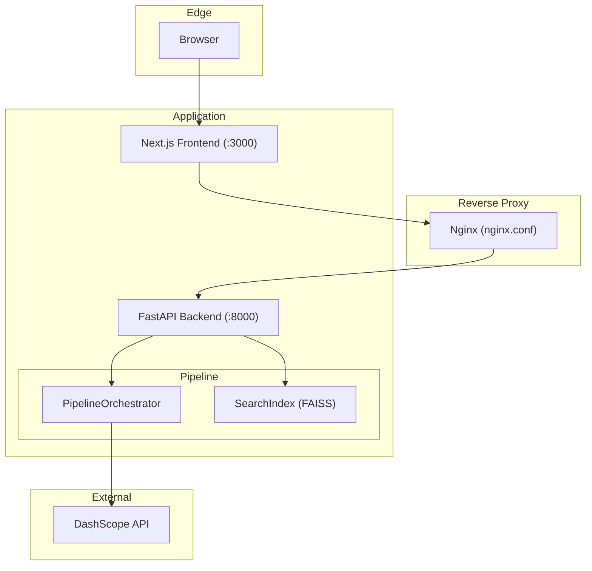
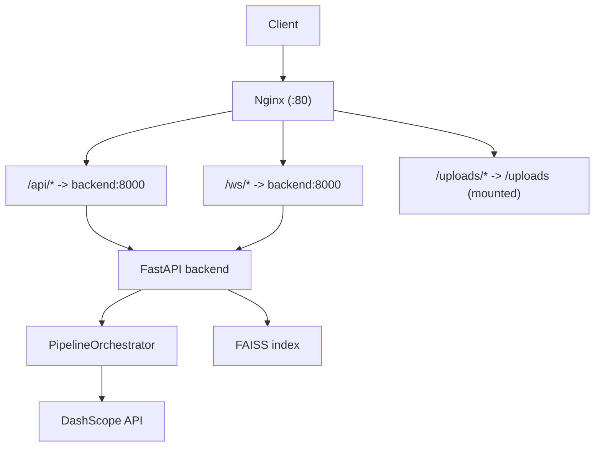
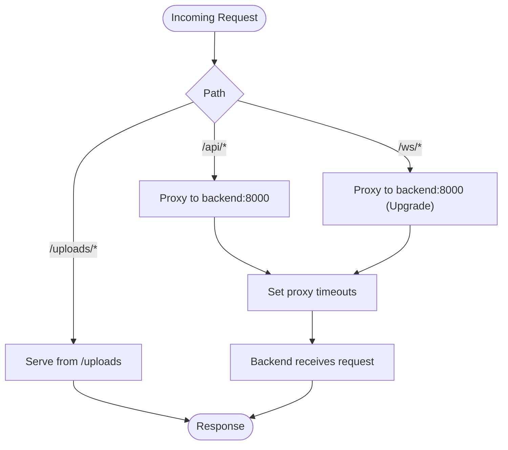
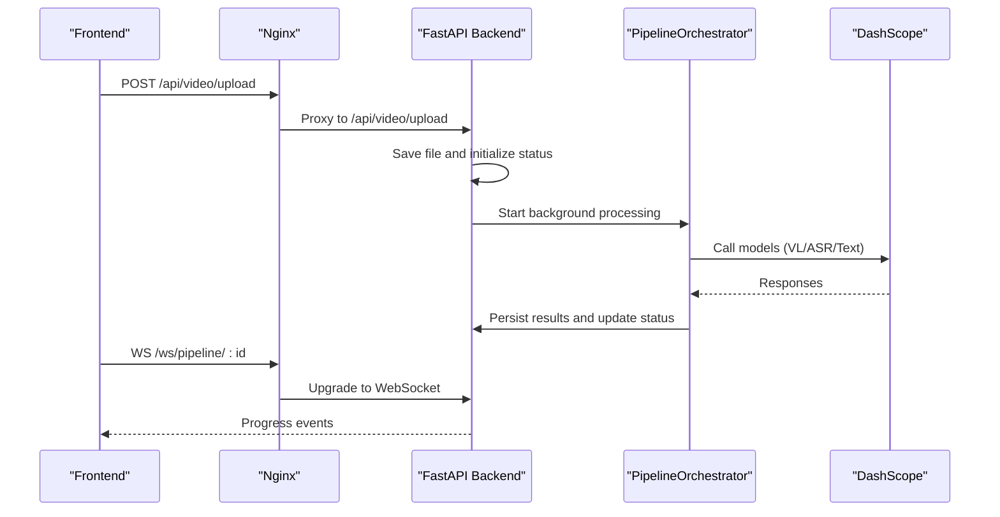
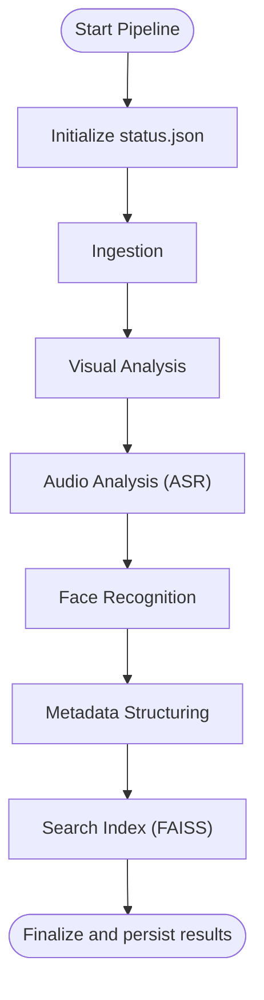
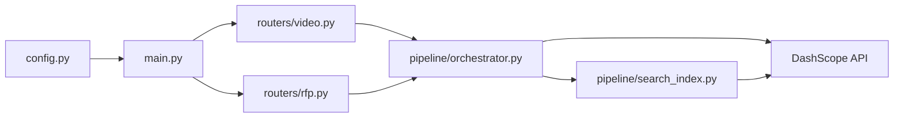

# Deployment and Operations

<cite>
**Referenced Files in This Document**
- [docker-compose.yml](file://docker-compose.yml)
- [nginx.conf](file://nginx.conf)
- [backend/main.py](file://backend/main.py)
- [backend/config.py](file://backend/config.py)
- [backend/requirements.txt](file://backend/requirements.txt)
- [backend/routers/video.py](file://backend/routers/video.py)
- [backend/routers/rfp.py](file://backend/routers/rfp.py)
- [backend/pipeline/orchestrator.py](file://backend/pipeline/orchestrator.py)
- [backend/pipeline/search_index.py](file://backend/pipeline/search_index.py)
- [backend/data/iptc_taxonomy.json](file://backend/data/iptc_taxonomy.json)
- [backend/data/reference_faces.json](file://backend/data/reference_faces.json)
- [README.md](file://README.md)
</cite>

## Table of Contents
1. [Introduction](#introduction)
2. [Project Structure](#project-structure)
3. [Core Components](#core-components)
4. [Architecture Overview](#architecture-overview)
5. [Detailed Component Analysis](#detailed-component-analysis)
6. [Dependency Analysis](#dependency-analysis)
7. [Performance Considerations](#performance-considerations)
8. [Monitoring and Logging](#monitoring-and-logging)
9. [Backup and Recovery](#backup-and-recovery)
10. [Scaling Strategies](#scaling-strategies)
11. [Security Hardening and Compliance](#security-hardening-and-compliance)
12. [Troubleshooting Guide](#troubleshooting-guide)
13. [Conclusion](#conclusion)

## Introduction
This document provides comprehensive deployment and operations guidance for the Dubai Media platform. It covers production-grade deployment using Docker Compose, Nginx reverse proxy configuration with SSL termination and static file serving, monitoring and logging setup, health checks, performance optimization, backup and recovery procedures for processed video data and search indexes, scaling considerations for AI model usage and database storage, and troubleshooting and security hardening recommendations tailored for media processing applications.

## Project Structure
The platform consists of:
- A FastAPI backend exposing REST APIs and WebSocket endpoints for video processing and RFP tools.
- An Nginx reverse proxy handling static file serving and routing API/WebSocket traffic to the backend.
- A Next.js frontend that communicates with the backend via HTTP and WebSocket.
- A pipeline orchestrator coordinating six stages of video processing and a FAISS-based semantic search index.

**Diagram sources**
- [docker-compose.yml:1-43](file://docker-compose.yml#L1-L43)
- [nginx.conf:1-51](file://nginx.conf#L1-L51)
- [backend/main.py:1-44](file://backend/main.py#L1-L44)
- [backend/pipeline/orchestrator.py:1-329](file://backend/pipeline/orchestrator.py#L1-L329)
- [backend/pipeline/search_index.py:1-245](file://backend/pipeline/search_index.py#L1-L245)

**Section sources**
- [README.md:19-40](file://README.md#L19-L40)
- [docker-compose.yml:1-43](file://docker-compose.yml#L1-L43)
- [nginx.conf:1-51](file://nginx.conf#L1-L51)

## Core Components
- Reverse Proxy and Static Serving
  - Nginx listens on port 80 and proxies API and WebSocket requests to the backend service. It also serves uploaded media files from a mounted volume with caching and CORS headers.
- Backend Application
  - FastAPI application with CORS enabled, static file mounting for uploads, and health check endpoint.
  - Routers expose endpoints for video upload/status/metadata/transcript, semantic search, and WebSocket progress streaming.
  - Configuration loaded from environment variables via Pydantic Settings.
- Pipeline and Search Index
  - Orchestration of six processing stages with progress tracking and persistence of status and results.
  - FAISS-based semantic search index backed by DashScope embeddings.

**Section sources**
- [nginx.conf:1-51](file://nginx.conf#L1-L51)
- [backend/main.py:1-44](file://backend/main.py#L1-L44)
- [backend/routers/video.py:1-267](file://backend/routers/video.py#L1-L267)
- [backend/routers/rfp.py:1-385](file://backend/routers/rfp.py#L1-L385)
- [backend/config.py:1-21](file://backend/config.py#L1-L21)
- [backend/pipeline/orchestrator.py:1-329](file://backend/pipeline/orchestrator.py#L1-L329)
- [backend/pipeline/search_index.py:1-245](file://backend/pipeline/search_index.py#L1-L245)

## Architecture Overview
The deployment architecture uses Docker Compose to run three services: backend, frontend, and Nginx. Nginx terminates HTTP/HTTPS at the edge and forwards traffic to the backend. The backend serves static uploads and exposes REST and WebSocket endpoints. AI model calls are made to DashScope via the configured base URL and API key.

**Diagram sources**
- [docker-compose.yml:30-39](file://docker-compose.yml#L30-L39)
- [nginx.conf:24-49](file://nginx.conf#L24-L49)
- [backend/main.py:35-43](file://backend/main.py#L35-L43)

## Detailed Component Analysis

### Reverse Proxy and Edge Routing
- Static File Serving
  - Nginx serves files from the uploads volume under /uploads/, enabling direct browser access to processed media.
  - Applies cache headers and CORS for cross-origin access.
- API and WebSocket Proxying
  - Proxies /api/ to backend:8000 and /ws/ to backend:8000 with WebSocket upgrade support.
  - Sets X-Forwarded-* headers and increases timeouts for long-running AI operations.
- Production Considerations
  - Replace the development HTTP listener with HTTPS and configure TLS certificates.
  - Add rate limiting, request size limits, and health checks upstream.

**Diagram sources**
- [nginx.conf:6-49](file://nginx.conf#L6-L49)

**Section sources**
- [nginx.conf:1-51](file://nginx.conf#L1-L51)
- [docker-compose.yml:30-39](file://docker-compose.yml#L30-L39)

### Backend Application and Endpoints
- Health Check
  - GET /api/health returns a simple JSON indicating service status.
- Static Files Mount
  - Mounted uploads directory enables serving processed media directly.
- Video Processing Endpoints
  - Upload triggers background pipeline execution and returns queued status.
  - Status and metadata endpoints read persisted JSON files.
  - Transcript endpoint returns parsed ASR output.
  - WebSocket endpoint streams progress updates during pipeline execution.
- RFP Endpoints
  - Create and regenerate RFP sections, export DOCX/PDF.
  - Evaluate vendor responses asynchronously with status tracking and exportable results.

**Diagram sources**
- [backend/routers/video.py:39-120](file://backend/routers/video.py#L39-L120)
- [backend/pipeline/orchestrator.py:44-206](file://backend/pipeline/orchestrator.py#L44-L206)
- [nginx.conf:40-49](file://nginx.conf#L40-L49)

**Section sources**
- [backend/main.py:41-43](file://backend/main.py#L41-L43)
- [backend/main.py:35-35](file://backend/main.py#L35-L35)
- [backend/routers/video.py:1-267](file://backend/routers/video.py#L1-L267)
- [backend/routers/rfp.py:1-385](file://backend/routers/rfp.py#L1-L385)

### Pipeline Orchestration and Data Persistence
- Stages
  - Ingestion, visual analysis, audio analysis, face recognition, metadata structuring, and search index building.
- Progress Tracking
  - Status JSON written per video with stage-by-stage progress and timestamps.
- Results Persistence
  - Individual stage results and combined results JSON saved to the video output directory.
- Search Index
  - FAISS index persists vectors and metadata to disk; rebuilds on startup.

**Diagram sources**
- [backend/pipeline/orchestrator.py:44-206](file://backend/pipeline/orchestrator.py#L44-L206)
- [backend/pipeline/search_index.py:88-154](file://backend/pipeline/search_index.py#L88-L154)

**Section sources**
- [backend/pipeline/orchestrator.py:1-329](file://backend/pipeline/orchestrator.py#L1-L329)
- [backend/pipeline/search_index.py:1-245](file://backend/pipeline/search_index.py#L1-L245)

### Configuration and Environment
- Settings
  - API keys, model identifiers, upload directory, and base URL are managed via environment variables.
- Dependencies
  - FastAPI, Uvicorn, DashScope SDK, FAISS CPU, ffmpeg-python, and others.

**Section sources**
- [backend/config.py:1-21](file://backend/config.py#L1-L21)
- [backend/requirements.txt:1-16](file://backend/requirements.txt#L1-L16)

## Dependency Analysis
The backend depends on external AI services and local persistence. The pipeline orchestrator coordinates multiple asynchronous stages and interacts with DashScope. The search index module encapsulates FAISS operations and embedding retrieval.

**Diagram sources**
- [backend/config.py:1-21](file://backend/config.py#L1-L21)
- [backend/main.py:1-44](file://backend/main.py#L1-L44)
- [backend/routers/video.py:1-267](file://backend/routers/video.py#L1-L267)
- [backend/routers/rfp.py:1-385](file://backend/routers/rfp.py#L1-L385)
- [backend/pipeline/orchestrator.py:1-329](file://backend/pipeline/orchestrator.py#L1-L329)
- [backend/pipeline/search_index.py:1-245](file://backend/pipeline/search_index.py#L1-L245)

**Section sources**
- [backend/requirements.txt:1-16](file://backend/requirements.txt#L1-L16)

## Performance Considerations
- Nginx Timeouts
  - Long-running AI operations require increased proxy_read_timeout and proxy_connect_timeout to avoid premature disconnects.
- Upload Limits
  - client_max_body_size should accommodate large media files typical in media processing.
- Static File Serving
  - Enable caching headers and immutable cache-control for media assets to reduce bandwidth and latency.
- Backend Concurrency
  - Use Uvicorn workers appropriately sized for CPU-bound AI tasks; monitor memory usage due to FAISS and model inference.
- AI Model Calls
  - Batch embedding requests where possible; implement retry/backoff and circuit breaker patterns.
- Disk I/O
  - Persist uploads and pipeline outputs to SSD-backed volumes; separate FAISS index directory for fast random access.
- Network
  - Place Nginx close to backend to minimize latency; consider CDN for static assets in production.

[No sources needed since this section provides general guidance]

## Monitoring and Logging
- Health Checks
  - Expose a simple GET /api/health endpoint returning service status for readiness/liveness probes.
- Logs
  - Capture application logs from the backend and Nginx access/error logs.
  - Forward logs to a centralized log collector (e.g., ELK stack or cloud-native logging).
- Metrics
  - Instrument pipeline duration per stage, embedding latency, and API throughput.
  - Track queue depth for background tasks and WebSocket connection counts.
- Observability
  - Add tracing for cross-service spans (Nginx → Backend → DashScope).
  - Monitor resource utilization (CPU, memory, disk IO) and network.

**Section sources**
- [backend/main.py:41-43](file://backend/main.py#L41-L43)

## Backup and Recovery
- Processed Video Data
  - Back up the uploads directory regularly; include status.json, results.json, transcripts, and derived media.
  - Use snapshot-based backups or incremental archival to a secure object storage.
- Search Index
  - Back up FAISS index file and metadata pickle; restore by placing them back into the index directory before startup.
- Reference Data
  - Back up IPTC taxonomy and reference faces JSON for downstream processing consistency.
- Recovery Procedure
  - Restore uploads and index directories; restart services; verify health and re-index if necessary.

**Section sources**
- [backend/pipeline/search_index.py:71-86](file://backend/pipeline/search_index.py#L71-L86)
- [backend/data/iptc_taxonomy.json:1-28](file://backend/data/iptc_taxonomy.json#L1-L28)
- [backend/data/reference_faces.json:1-101](file://backend/data/reference_faces.json#L1-L101)

## Scaling Strategies
- Horizontal Scaling
  - Scale backend replicas behind Nginx; ensure shared persistent storage for uploads and FAISS index.
  - Use sticky sessions for WebSocket connections if stateful; otherwise, externalize session state.
- AI Model Scaling
  - Rate-limit and batch DashScope calls; consider regional endpoints and quotas.
  - Offload embedding generation to a dedicated job queue if latency becomes a bottleneck.
- Database Storage
  - The platform currently stores JSON artifacts on disk; for production, migrate to a relational or document database for structured search and audit trails.
- Concurrent Users
  - Tune Uvicorn worker count and container CPU/memory limits; monitor queue depth and latency.
- CDN and Edge
  - Serve static media via CDN to reduce origin load and improve global latency.

[No sources needed since this section provides general guidance]

## Security Hardening and Compliance
- Transport Security
  - Terminate TLS at Nginx with strong ciphers and modern protocols; enforce HTTPS redirects.
- Access Control
  - Add API key-based authentication and rate limiting; restrict CORS origins to trusted domains.
- Secrets Management
  - Store DASHSCOPE_API_KEY and other secrets in a secure secret manager; inject via environment variables.
- Data Privacy
  - Minimize retention of processed media; implement deletion policies; anonymize personal identifiers where possible.
- Compliance
  - Align with UAE data localization requirements; ensure vendor SLAs for DashScope availability and data handling.
- Network Security
  - Restrict inbound ports; whitelist trusted IPs; segment services with Docker networks.
- Audit and Integrity
  - Log all administrative actions and API calls; maintain checksums for uploaded files and FAISS index.

[No sources needed since this section provides general guidance]

## Troubleshooting Guide
- Nginx Cannot Reach Backend
  - Verify service names and ports in docker-compose; confirm backend is healthy and listening on 0.0.0.0:8000.
- Large Uploads Fail
  - Increase client_max_body_size in nginx.conf and ensure filesystem quotas allow large writes.
- WebSocket Disconnections
  - Confirm proxy_read_timeout and Connection upgrade headers; check backend logs for exceptions.
- AI Calls Fail or Time Out
  - Validate DASHSCOPE_API_KEY and BASE_URL; implement retry/backoff; monitor rate limits.
- Search Index Empty
  - Ensure FAISS index and metadata files exist; verify embedding API responses and permissions.
- Health Check Fails
  - Review backend logs and environment configuration; confirm static mounts and upload directory existence.

**Section sources**
- [docker-compose.yml:1-43](file://docker-compose.yml#L1-L43)
- [nginx.conf:32-49](file://nginx.conf#L32-L49)
- [backend/config.py:1-21](file://backend/config.py#L1-L21)
- [backend/pipeline/search_index.py:198-244](file://backend/pipeline/search_index.py#L198-L244)

## Conclusion
This guide outlines a production-ready deployment strategy for the Dubai Media platform using Docker Compose and Nginx, with robust monitoring, performance tuning, and operational safeguards. By securing the environment, backing up critical data, and scaling thoughtfully, the platform can reliably handle media processing workloads and deliver value to users.