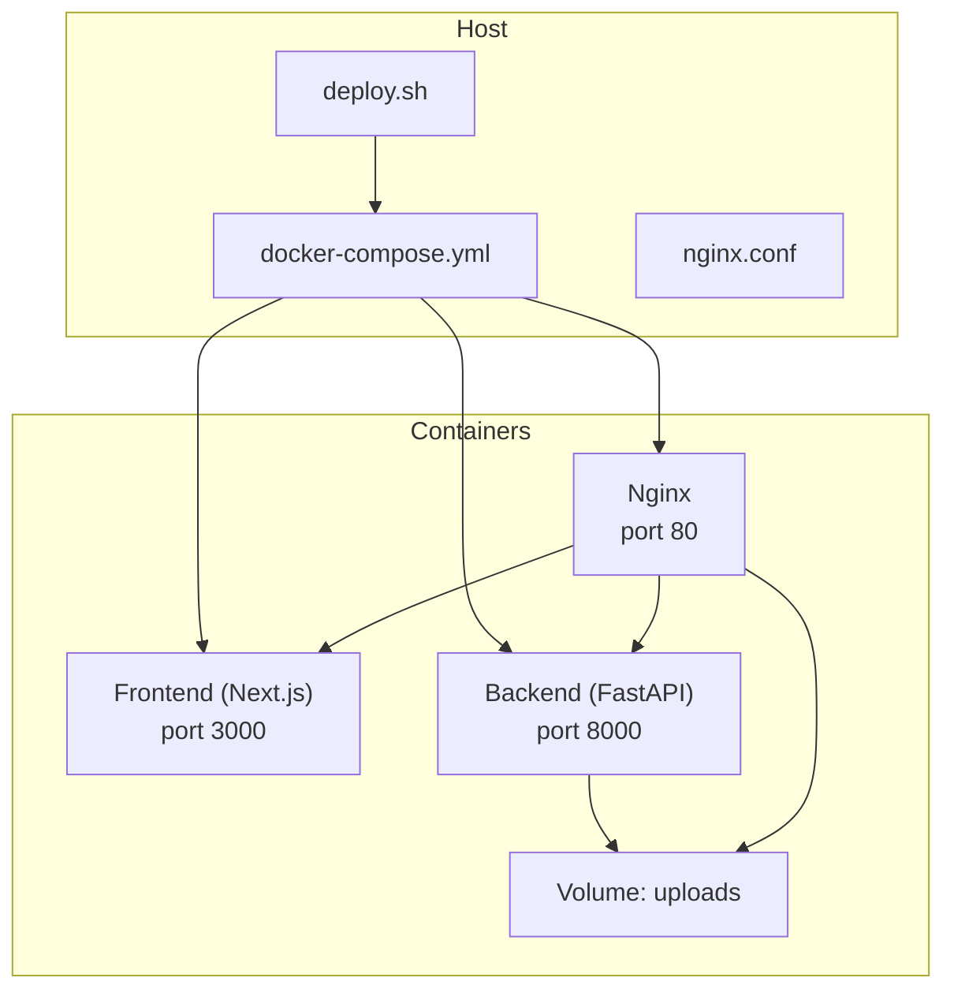
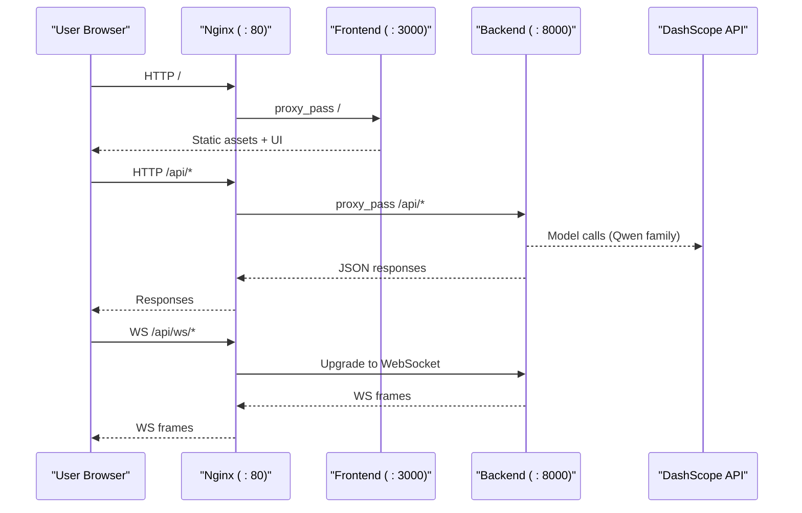
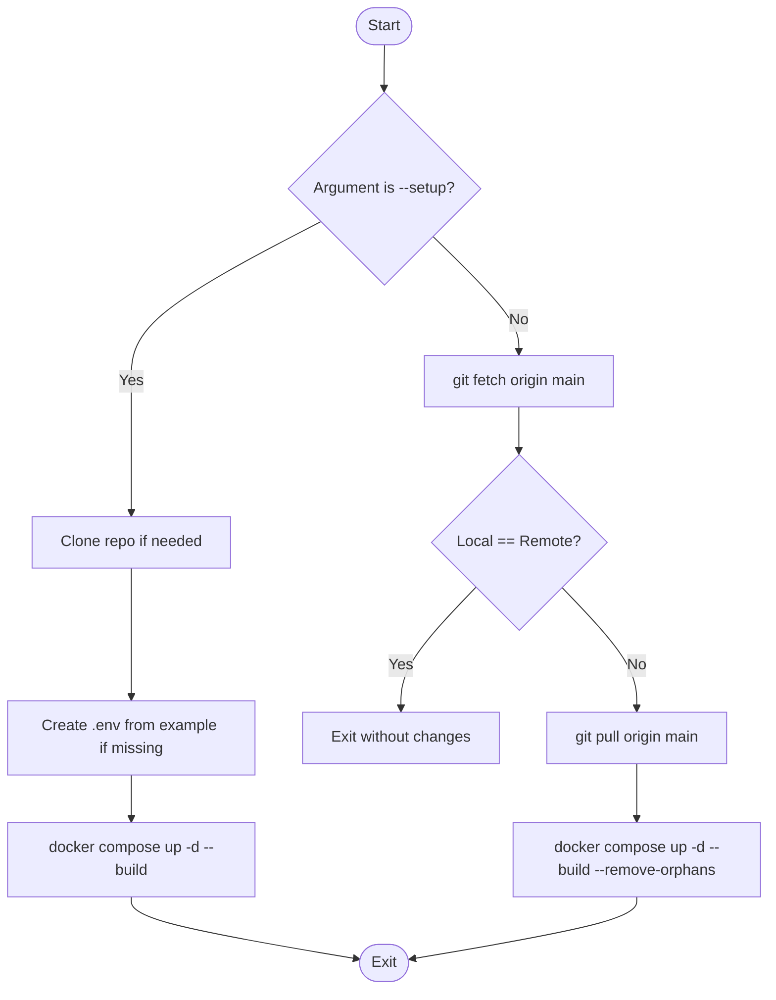
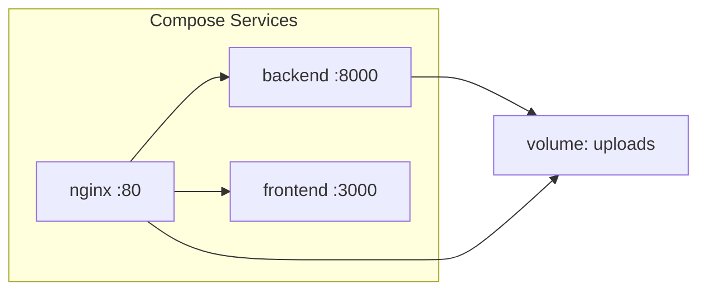
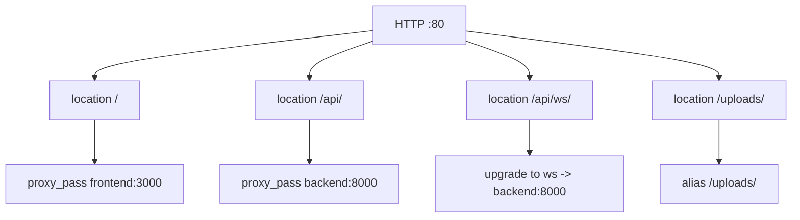
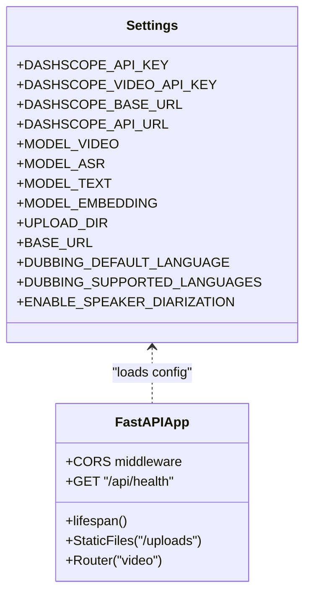
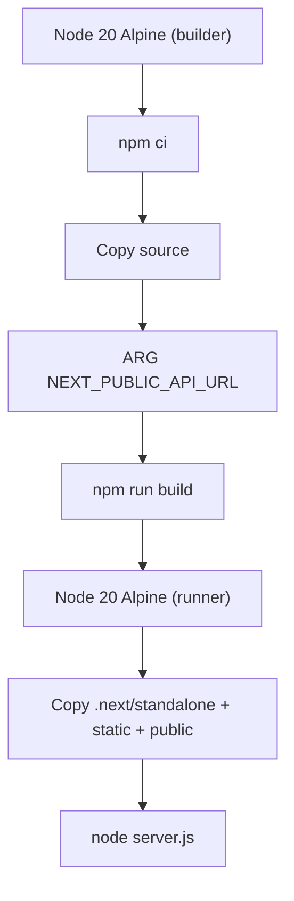
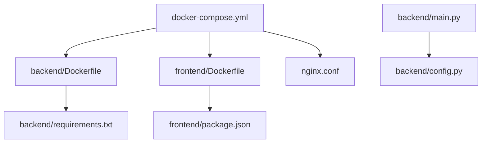

# Deployment Infrastructure and Automation

<cite>
**Referenced Files in This Document**
- [deploy.sh](file://deploy.sh)
- [docker-compose.yml](file://docker-compose.yml)
- [nginx.conf](file://nginx.conf)
- [backend/Dockerfile](file://backend/Dockerfile)
- [frontend/Dockerfile](file://frontend/Dockerfile)
- [backend/main.py](file://backend/main.py)
- [backend/config.py](file://backend/config.py)
- [backend/requirements.txt](file://backend/requirements.txt)
- [frontend/package.json](file://frontend/package.json)
- [frontend/next.config.ts](file://frontend/next.config.ts)
- [README.md](file://README.md)
</cite>

## Table of Contents
1. [Introduction](#introduction)
2. [Project Structure](#project-structure)
3. [Core Components](#core-components)
4. [Architecture Overview](#architecture-overview)
5. [Detailed Component Analysis](#detailed-component-analysis)
6. [Dependency Analysis](#dependency-analysis)
7. [Performance Considerations](#performance-considerations)
8. [Troubleshooting Guide](#troubleshooting-guide)
9. [Conclusion](#conclusion)

## Introduction
This document explains the deployment infrastructure and automation for the project. It covers containerization, reverse proxy configuration, environment setup, health checks, and automated redeployment. The goal is to enable reliable local and production deployments with minimal manual steps.

## Project Structure
The deployment surface includes:
- Container orchestration via Docker Compose
- Reverse proxy and routing via Nginx
- Automated deployment script for initial setup and continuous redeploy
- Backend and frontend container images built from dedicated Dockerfiles
- Application configuration through environment variables and build-time arguments

**Diagram sources**
- [docker-compose.yml:1-46](file://docker-compose.yml#L1-L46)
- [nginx.conf:1-51](file://nginx.conf#L1-L51)
- [deploy.sh:1-66](file://deploy.sh#L1-L66)

**Section sources**
- [docker-compose.yml:1-46](file://docker-compose.yml#L1-L46)
- [nginx.conf:1-51](file://nginx.conf#L1-L51)
- [deploy.sh:1-66](file://deploy.sh#L1-L66)

## Core Components
- Automated deployment script: one-shot setup and periodic auto-deploy
- Docker Compose services: backend, frontend, nginx; shared volume for uploads
- Nginx reverse proxy: routes HTTP, API, WebSocket, and static uploads
- Backend image: Python runtime with FFmpeg, FastAPI app, and uvicorn
- Frontend image: Node-based multi-stage build producing a standalone Next.js server
- Configuration: environment-driven settings for APIs, models, and paths

Key responsibilities:
- deploy.sh: clone repo, create .env if missing, build/start, detect new commits, rebuild/restart
- docker-compose.yml: define services, ports, volumes, env files, restart policies, healthcheck, dependencies
- nginx.conf: proxy rules, timeouts, buffering, WebSocket upgrade, upload serving
- backend/Dockerfile: base image, system deps, pip install, app copy, entrypoint
- frontend/Dockerfile: builder stage, dependency install, build, runner stage, standalone output
- backend/main.py: app initialization, middleware, static mount, router inclusion, health endpoint
- backend/config.py: typed settings loaded from .env with defaults and fallbacks
- backend/requirements.txt: Python dependencies including web server, AI SDK, media tools
- frontend/package.json: scripts and dependencies for Next.js
- frontend/next.config.ts: standalone output mode for efficient containerization

**Section sources**
- [deploy.sh:1-66](file://deploy.sh#L1-L66)
- [docker-compose.yml:1-46](file://docker-compose.yml#L1-L46)
- [nginx.conf:1-51](file://nginx.conf#L1-L51)
- [backend/Dockerfile:1-23](file://backend/Dockerfile#L1-L23)
- [frontend/Dockerfile:1-36](file://frontend/Dockerfile#L1-L36)
- [backend/main.py:1-43](file://backend/main.py#L1-L43)
- [backend/config.py:1-33](file://backend/config.py#L1-L33)
- [backend/requirements.txt:1-18](file://backend/requirements.txt#L1-L18)
- [frontend/package.json:1-29](file://frontend/package.json#L1-L29)
- [frontend/next.config.ts:1-9](file://frontend/next.config.ts#L1-L9)

## Architecture Overview
End-to-end request flow across containers and external services:

**Diagram sources**
- [nginx.conf:1-51](file://nginx.conf#L1-L51)
- [docker-compose.yml:1-46](file://docker-compose.yml#L1-L46)
- [backend/main.py:1-43](file://backend/main.py#L1-L43)

## Detailed Component Analysis

### Automated Deployment Script
- Modes:
  - Setup mode: clones repository, creates .env from example if missing, builds and starts services
  - Auto-deploy mode: compares local HEAD with remote branch, pulls changes, rebuilds and restarts only changed services
- Safety:
  - Exits early if no changes detected
  - Uses non-interactive flags for CI-friendly operation
- Integration:
  - Designed to run under cron or similar scheduler for continuous delivery

**Diagram sources**
- [deploy.sh:1-66](file://deploy.sh#L1-L66)

**Section sources**
- [deploy.sh:1-66](file://deploy.sh#L1-L66)

### Docker Compose Services
- Backend service:
  - Builds from backend/Dockerfile
  - Exposes port 8000
  - Mounts uploads volume
  - Loads environment from .env
  - Health check hits /api/health
  - Restarts unless stopped
- Frontend service:
  - Builds from frontend/Dockerfile
  - Receives NEXT_PUBLIC_API_URL at build time
  - Depends on backend being healthy
  - Exposes port 3000
  - Restarts unless stopped
- Nginx service:
  - Uses nginx:alpine image
  - Exposes port 80
  - Mounts nginx.conf and uploads volume read-only
  - Depends on backend and frontend
  - Restarts unless stopped
- Shared volume:
  - uploads: persists uploaded media across restarts

**Diagram sources**
- [docker-compose.yml:1-46](file://docker-compose.yml#L1-L46)

**Section sources**
- [docker-compose.yml:1-46](file://docker-compose.yml#L1-L46)

### Nginx Reverse Proxy
- Routes:
  - / → Frontend
  - /api/ → Backend
  - /api/ws/ → Backend with WebSocket upgrade
  - /uploads/ → Direct file serving from shared volume
- Timeouts and buffering:
  - Increased read/send/connect timeouts for long-running API requests
  - Request buffering disabled for streaming uploads
- Headers:
  - Standard proxy headers forwarded to upstream services

**Diagram sources**
- [nginx.conf:1-51](file://nginx.conf#L1-L51)

**Section sources**
- [nginx.conf:1-51](file://nginx.conf#L1-L51)

### Backend Image and Application
- Image construction:
  - Base: python:3.11-slim
  - System dependency: ffmpeg installed for media processing
  - Installs Python requirements
  - Copies application code
  - Creates uploads directory
  - Entrypoint runs uvicorn on 0.0.0.0:8000
- Application behavior:
  - Initializes FastAPI app with lifespan context manager
  - Adds CORS middleware
  - Mounts static files for uploads
  - Includes routers
  - Provides /api/health endpoint used by healthcheck

**Diagram sources**
- [backend/Dockerfile:1-23](file://backend/Dockerfile#L1-L23)
- [backend/main.py:1-43](file://backend/main.py#L1-L43)
- [backend/config.py:1-33](file://backend/config.py#L1-L33)

**Section sources**
- [backend/Dockerfile:1-23](file://backend/Dockerfile#L1-L23)
- [backend/main.py:1-43](file://backend/main.py#L1-L43)
- [backend/config.py:1-33](file://backend/config.py#L1-L33)
- [backend/requirements.txt:1-18](file://backend/requirements.txt#L1-L18)

### Frontend Image and Build
- Multi-stage build:
  - Builder stage installs dependencies and builds Next.js app
  - Runner stage copies standalone output and public assets
- Build-time configuration:
  - NEXT_PUBLIC_API_URL passed as build arg and set as env var
- Output:
  - Standalone server mode for efficient runtime image

**Diagram sources**
- [frontend/Dockerfile:1-36](file://frontend/Dockerfile#L1-L36)
- [frontend/next.config.ts:1-9](file://frontend/next.config.ts#L1-L9)
- [frontend/package.json:1-29](file://frontend/package.json#L1-L29)

**Section sources**
- [frontend/Dockerfile:1-36](file://frontend/Dockerfile#L1-L36)
- [frontend/next.config.ts:1-9](file://frontend/next.config.ts#L1-L9)
- [frontend/package.json:1-29](file://frontend/package.json#L1-L29)

## Dependency Analysis
Container and runtime dependencies:

**Diagram sources**
- [docker-compose.yml:1-46](file://docker-compose.yml#L1-L46)
- [backend/Dockerfile:1-23](file://backend/Dockerfile#L1-L23)
- [frontend/Dockerfile:1-36](file://frontend/Dockerfile#L1-L36)
- [nginx.conf:1-51](file://nginx.conf#L1-L51)
- [backend/requirements.txt:1-18](file://backend/requirements.txt#L1-L18)
- [frontend/package.json:1-29](file://frontend/package.json#L1-L29)
- [backend/main.py:1-43](file://backend/main.py#L1-L43)
- [backend/config.py:1-33](file://backend/config.py#L1-L33)

**Section sources**
- [docker-compose.yml:1-46](file://docker-compose.yml#L1-L46)
- [backend/Dockerfile:1-23](file://backend/Dockerfile#L1-L23)
- [frontend/Dockerfile:1-36](file://frontend/Dockerfile#L1-L36)
- [nginx.conf:1-51](file://nginx.conf#L1-L51)
- [backend/requirements.txt:1-18](file://backend/requirements.txt#L1-L18)
- [frontend/package.json:1-29](file://frontend/package.json#L1-L29)
- [backend/main.py:1-43](file://backend/main.py#L1-L43)
- [backend/config.py:1-33](file://backend/config.py#L1-L33)

## Performance Considerations
- Nginx timeouts are increased for long-running API operations; ensure these align with expected processing durations.
- Upload size limit is configured at the proxy layer; verify it matches storage and pipeline constraints.
- Backend uses a single uvicorn worker process by default; consider scaling workers or processes for higher concurrency.
- Frontend uses standalone output for smaller runtime images and faster cold starts.
- Shared volume for uploads avoids redundant transfers but requires careful disk sizing and backup strategy.

[No sources needed since this section provides general guidance]

## Troubleshooting Guide
- Health check failures:
  - The health endpoint is defined in the backend and checked by Compose; confirm the service is reachable on port 8000.
- Environment variables:
  - Ensure .env exists and contains required keys; the setup script will prompt to edit it after creation.
- Build-time API URL:
  - If the frontend cannot reach the backend, pass NEXT_PUBLIC_API_URL during build so the client points to the correct host.
- Uploads not accessible:
  - Verify the uploads volume is mounted and that Nginx serves /uploads/ correctly.
- Long requests timing out:
  - Review Nginx timeout settings and adjust if necessary for large media processing.

**Section sources**
- [backend/main.py:40-43](file://backend/main.py#L40-L43)
- [docker-compose.yml:13-17](file://docker-compose.yml#L13-L17)
- [deploy.sh:30-36](file://deploy.sh#L30-L36)
- [docker-compose.yml:23-24](file://docker-compose.yml#L23-L24)
- [nginx.conf:42-49](file://nginx.conf#L42-L49)
- [nginx.conf:24-29](file://nginx.conf#L24-L29)

## Conclusion
The deployment stack combines a simple yet robust automation script with Docker Compose, Nginx, and well-defined container images. Configuration is centralized in environment variables and build args, while health checks and restart policies improve resilience. For production, consider adding authentication, persistent object storage, and horizontal scaling of backend workers.

[No sources needed since this section summarizes without analyzing specific files]