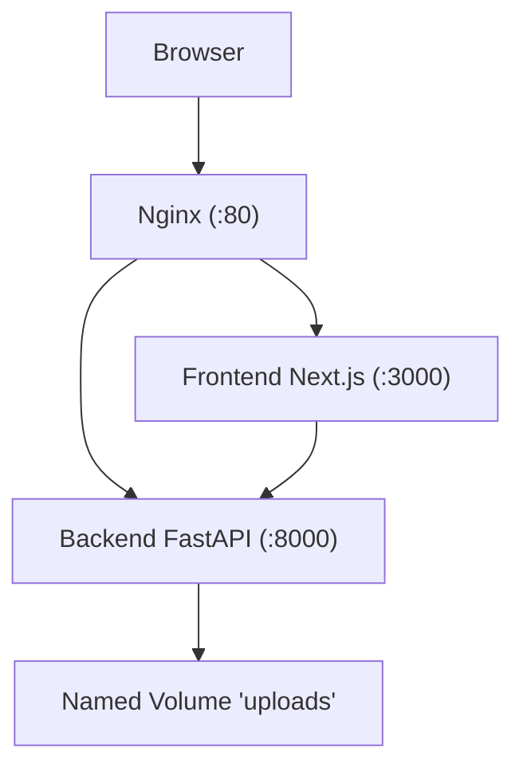
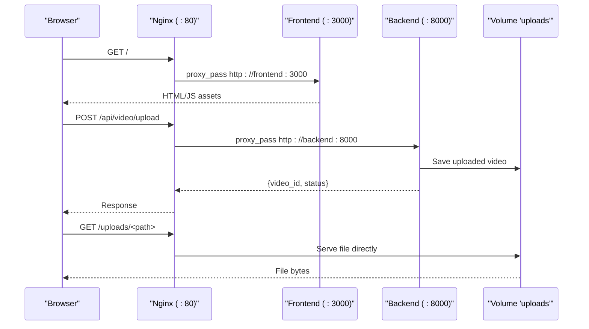

# Docker Containerization and Deployment

<cite>
**Referenced Files in This Document**
- [docker-compose.yml](file://docker-compose.yml)
- [backend/Dockerfile](file://backend/Dockerfile)
- [frontend/Dockerfile](file://frontend/Dockerfile)
- [nginx.conf](file://nginx.conf)
- [deploy.sh](file://deploy.sh)
- [backend/main.py](file://backend/main.py)
- [backend/config.py](file://backend/config.py)
- [backend/requirements.txt](file://backend/requirements.txt)
- [frontend/package.json](file://frontend/package.json)
- [frontend/next.config.ts](file://frontend/next.config.ts)
- [README.md](file://README.md)
</cite>

## Table of Contents
1. Introduction
2. Project Structure
3. Core Components
4. Architecture Overview
5. Detailed Component Analysis
6. Dependency Analysis
7. Performance Considerations
8. Troubleshooting Guide
9. Conclusion

## Introduction
This document explains how the project is containerized and deployed using Docker Compose, Nginx, and an automated deployment script. It covers service definitions, image builds, runtime configuration, reverse proxying, persistent storage, health checks, and operational guidance for local and production-like environments.

## Project Structure
The repository provides a multi-service setup:
- Backend (FastAPI) running on port 8000 inside its container
- Frontend (Next.js standalone server) running on port 3000 inside its container
- Nginx reverse proxy exposing port 80 to route traffic to frontend and backend
- A shared named volume for uploaded media files
- An optional auto-deploy script that pulls from Git and rebuilds services

**Diagram sources**
- [docker-compose.yml:1-46](file://docker-compose.yml#L1-L46)
- [nginx.conf:1-51](file://nginx.conf#L1-L51)

**Section sources**
- [docker-compose.yml:1-46](file://docker-compose.yml#L1-L46)
- [README.md:74-90](file://README.md#L74-L90)

## Core Components
- docker-compose.yml: Defines services, ports, volumes, environment, dependencies, and health checks.
- backend/Dockerfile: Builds a Python 3.11 image with FFmpeg, installs Python dependencies, exposes 8000, and runs Uvicorn.
- frontend/Dockerfile: Multi-stage build producing a Node 20 standalone Next.js app; accepts NEXT_PUBLIC_API_URL at build time.
- nginx.conf: Reverse proxy rules for frontend, API, WebSocket, and static uploads.
- deploy.sh: One-time setup and continuous redeployment by polling Git and rebuilding via Docker Compose.

Key runtime behaviors:
- The backend mounts a persistent uploads directory via a named volume.
- The frontend is built as a standalone server for efficient production runtime.
- Nginx proxies /api/* to the backend and serves the frontend at /.

**Section sources**
- [docker-compose.yml:1-46](file://docker-compose.yml#L1-L46)
- [backend/Dockerfile:1-23](file://backend/Dockerfile#L1-L23)
- [frontend/Dockerfile:1-36](file://frontend/Dockerfile#L1-L36)
- [nginx.conf:1-51](file://nginx.conf#L1-L51)
- [deploy.sh:1-66](file://deploy.sh#L1-L66)

## Architecture Overview
The system uses a three-tier container architecture:
- Browser communicates with Nginx over HTTP.
- Nginx routes requests to the Next.js frontend or FastAPI backend based on path.
- The backend persists media and results to a shared volume and can serve uploaded content directly.

**Diagram sources**
- [nginx.conf:1-51](file://nginx.conf#L1-L51)
- [docker-compose.yml:1-46](file://docker-compose.yml#L1-L46)
- [backend/main.py:35-37](file://backend/main.py#L35-L37)

## Detailed Component Analysis

### Service Orchestration (Docker Compose)
- Services:
  - backend: Builds from ./backend/Dockerfile, maps 8000, mounts uploads volume, loads .env, includes a health check against /api/health.
  - frontend: Builds from ./frontend/Dockerfile, maps 3000, depends on backend being healthy, supports NEXT_PUBLIC_API_URL build arg.
  - nginx: Uses nginx:alpine, maps 80, mounts nginx.conf and the uploads volume read-only, depends on both services.
- Volumes:
  - uploads: Named volume used by backend and nginx to persist and serve uploaded media.

Operational notes:
- Health check ensures the backend is reachable before starting the frontend.
- Restart policies keep services resilient across failures.

**Section sources**
- [docker-compose.yml:1-46](file://docker-compose.yml#L1-L46)
- [backend/main.py:40-43](file://backend/main.py#L40-L43)

### Backend Image and Runtime
- Base image: python:3.11-slim
- System dependency: FFmpeg installed for media processing
- Python dependencies: Installed from requirements.txt
- Working directory: /app
- Exposed port: 8000
- Command: Runs Uvicorn serving the FastAPI application

Configuration:
- Settings are loaded from environment variables via pydantic-settings, including model endpoints and upload directory paths.

Runtime behavior:
- Creates the upload directory if missing
- Mounts /uploads as a static file server under /uploads
- Includes routers and registers a health endpoint

**Section sources**
- [backend/Dockerfile:1-23](file://backend/Dockerfile#L1-L23)
- [backend/requirements.txt:1-18](file://backend/requirements.txt#L1-L18)
- [backend/config.py:1-33](file://backend/config.py#L1-L33)
- [backend/main.py:1-43](file://backend/main.py#L1-L43)

### Frontend Image and Build
- Builder stage: node:20-alpine
  - Installs dependencies with npm ci
  - Copies source and builds the Next.js app
  - Accepts NEXT_PUBLIC_API_URL at build time
- Runner stage: node:20-alpine
  - Sets NODE_ENV=production
  - Copies standalone output and static/public assets
  - Exposes 3000 and starts the server

Build optimization:
- Standalone output reduces runtime footprint and improves startup time.

**Section sources**
- [frontend/Dockerfile:1-36](file://frontend/Dockerfile#L1-L36)
- [frontend/package.json:1-29](file://frontend/package.json#L1-L29)
- [frontend/next.config.ts:1-9](file://frontend/next.config.ts#L1-L9)

### Reverse Proxy (Nginx)
Routing:
- / → Frontend (proxy_pass to frontend:3000)
- /api/ → Backend (proxy_pass to backend:8000)
- /api/ws/ → Backend with WebSocket upgrade headers
- /uploads/ → Serves files directly from the mounted volume

Performance and timeouts:
- Increased client_max_body_size for large uploads
- Longer proxy timeouts for long-running API calls
- Request buffering disabled for streaming uploads

Caching and CORS:
- Static caching headers for uploaded assets
- CORS header for cross-origin access to uploads

**Section sources**
- [nginx.conf:1-51](file://nginx.conf#L1-L51)

### Automated Deployment Script
Capabilities:
- Setup mode (--setup): Clones repo, creates .env from example, builds and starts services
- Auto-deploy mode: Compares HEAD with origin/main, pulls changes, rebuilds only changed services, removes orphans

Usage patterns:
- Initial setup followed by periodic execution (e.g., cron) to keep the deployment in sync with the repository

**Section sources**
- [deploy.sh:1-66](file://deploy.sh#L1-L66)

## Dependency Analysis
Service-level dependencies:
- Frontend depends on backend health before starting
- Nginx depends on both backend and frontend
- Backend depends on system tools (FFmpeg) and Python packages

Image-level dependencies:
- Backend requires ffmpeg-python and related libraries
- Frontend relies on Next.js standalone output

**Diagram sources**
- [docker-compose.yml:1-46](file://docker-compose.yml#L1-L46)

**Section sources**
- [docker-compose.yml:1-46](file://docker-compose.yml#L1-L46)

## Performance Considerations
- Use the standalone Next.js output for smaller images and faster cold starts.
- Keep FFmpeg installation minimal (already configured in the backend image).
- Prefer building the frontend with the correct NEXT_PUBLIC_API_URL to avoid runtime reconfiguration.
- For high-throughput uploads, ensure the host filesystem backing the uploads volume has sufficient I/O performance.
- Tune Nginx timeouts according to expected pipeline durations.

[No sources needed since this section provides general guidance]

## Troubleshooting Guide
Common issues and resolutions:
- Backend not healthy:
  - Verify /api/health responds within the health check interval.
  - Ensure .env is present and contains required keys.
- Uploads not accessible:
  - Confirm the uploads volume is mounted and readable by Nginx.
  - Check permissions on the host-backed volume directory.
- Long-running requests timing out:
  - Adjust Nginx proxy_read_timeout and proxy_send_timeout as needed.
- Frontend cannot reach backend:
  - Ensure NEXT_PUBLIC_API_URL is set during build and points to the correct internal hostname or external URL.
- WebSocket connections failing:
  - Validate Nginx WebSocket upgrade headers and long timeout settings.

**Section sources**
- [docker-compose.yml:13-17](file://docker-compose.yml#L13-L17)
- [nginx.conf:17-40](file://nginx.conf#L17-L40)
- [frontend/Dockerfile:14-16](file://frontend/Dockerfile#L14-L16)

## Conclusion
The project’s containerization strategy separates concerns into focused services orchestrated by Docker Compose, with Nginx providing a unified ingress point and persistent storage for media assets. The backend image includes necessary system dependencies, while the frontend leverages a multi-stage build for efficient production deployments. The provided deployment script streamlines initial setup and ongoing updates, making it straightforward to operate locally or in production-like environments.