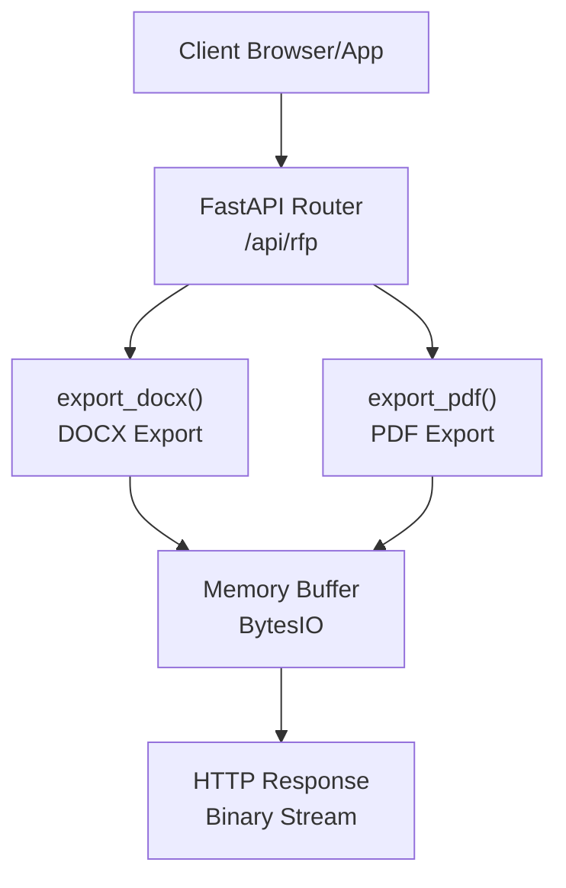
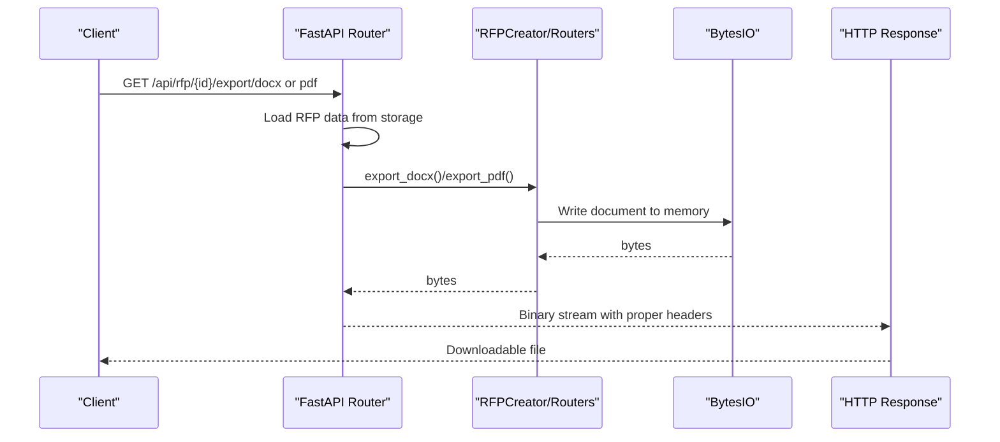
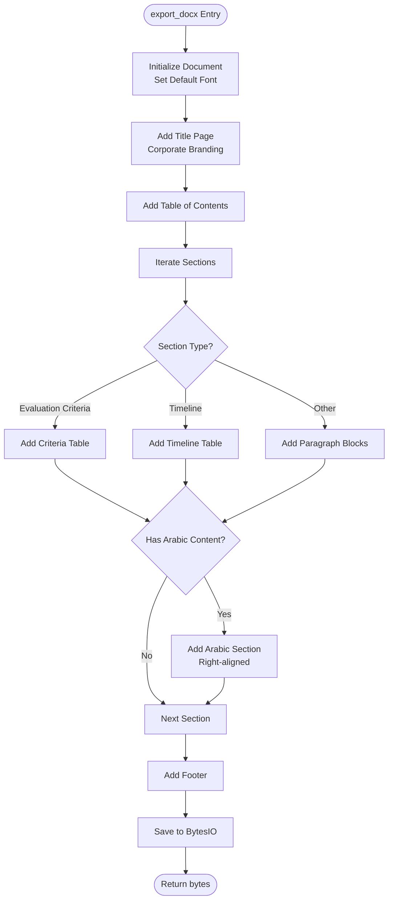
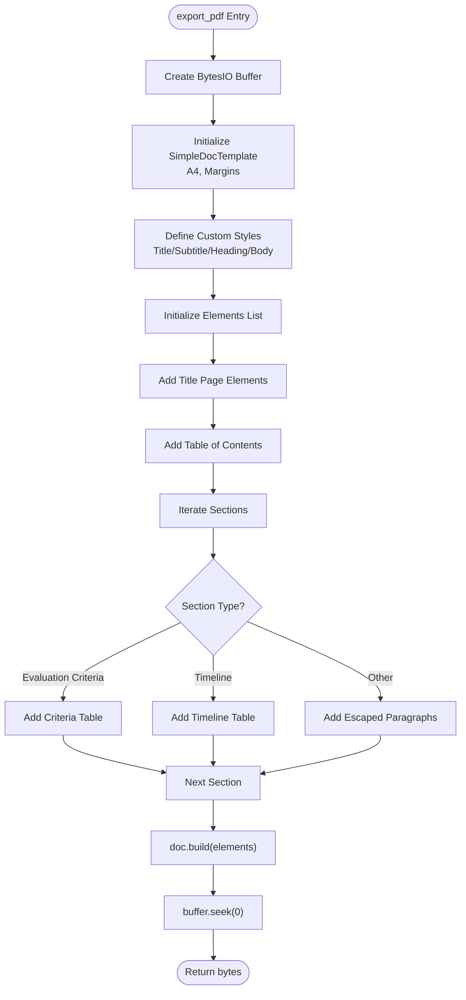
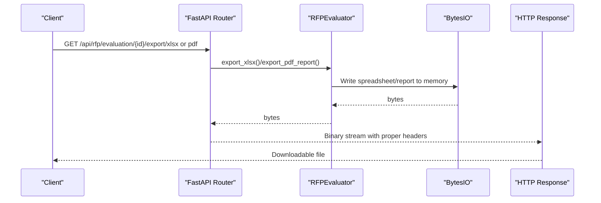
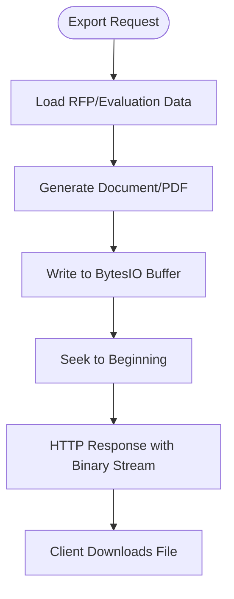
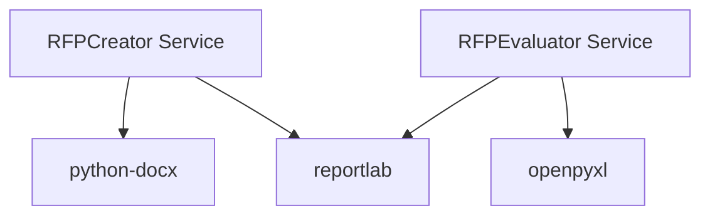

# Document Export System

<cite>
**Referenced Files in This Document**
- [requirements.txt](file://backend/requirements.txt)
- [config.py](file://backend/config.py)
- [rfp.py](file://backend/routers/rfp.py)
- [rfp_creator.py](file://backend/services/rfp_creator.py)
- [rfp_evaluator.py](file://backend/services/rfp_evaluator.py)
</cite>

## Table of Contents
1. [Introduction](#introduction)
2. [Project Structure](#project-structure)
3. [Core Components](#core-components)
4. [Architecture Overview](#architecture-overview)
5. [Detailed Component Analysis](#detailed-component-analysis)
6. [Dependency Analysis](#dependency-analysis)
7. [Performance Considerations](#performance-considerations)
8. [Troubleshooting Guide](#troubleshooting-guide)
9. [Conclusion](#conclusion)

## Introduction
This document describes the document export system that generates professional Request for Proposal (RFP) documents and evaluation reports in both DOCX and PDF formats. It covers:
- DOCX export using python-docx with custom fonts, styling, tables, and bilingual content handling
- PDF export using ReportLab with professional formatting, custom page layouts, table styling, and Arabic text support
- Content transformation processes, table generation for evaluation criteria and timelines
- Export workflow from RFP data to binary file streams, memory buffer management, and file download handling
- Examples of exported documents, styling customization options, and troubleshooting common formatting issues
- Performance considerations for large documents and memory optimization techniques

## Project Structure
The export functionality spans backend services and FastAPI routers:
- Dependencies are declared in requirements.txt
- Configuration is centralized in config.py
- Export endpoints are defined in rfp.py
- Business logic for DOCX and PDF exports resides in rfp_creator.py
- Evaluation report export is handled in rfp_evaluator.py

**Diagram sources**
- [rfp.py:170-200](file://backend/routers/rfp.py#L170-L200)
- [rfp_creator.py:297-381](file://backend/services/rfp_creator.py#L297-L381)
- [rfp_creator.py:449-555](file://backend/services/rfp_creator.py#L449-L555)

**Section sources**
- [requirements.txt:7-8](file://backend/requirements.txt#L7-L8)
- [config.py:4-21](file://backend/config.py#L4-L21)
- [rfp.py:170-200](file://backend/routers/rfp.py#L170-L200)

## Core Components
- DOCX Export Service: Generates DOCX documents with custom fonts, headers, footers, bilingual content, and specialized tables for evaluation criteria and timelines.
- PDF Export Service: Creates PDFs with custom page sizes, styles, tables, and XML-safe text handling.
- Evaluation Report Export: Produces comprehensive evaluation reports in XLSX and PDF formats.
- API Endpoints: Expose export routes that stream binary content to clients.

Key capabilities:
- Bilingual content handling with English and Arabic sections
- Automatic table generation for evaluation criteria and milestone timelines
- Memory-efficient streaming via BytesIO buffers
- Robust error handling and HTTP responses

**Section sources**
- [rfp_creator.py:297-381](file://backend/services/rfp_creator.py#L297-L381)
- [rfp_creator.py:449-555](file://backend/services/rfp_creator.py#L449-L555)
- [rfp_evaluator.py:351-472](file://backend/services/rfp_evaluator.py#L351-L472)
- [rfp_evaluator.py:474-621](file://backend/services/rfp_evaluator.py#L474-L621)
- [rfp.py:170-200](file://backend/routers/rfp.py#L170-L200)

## Architecture Overview
The export workflow follows a clear pipeline:
1. Client requests export via FastAPI endpoints
2. Router loads persisted RFP data
3. Service generates DOCX or PDF using appropriate libraries
4. Binary content is streamed back as HTTP response

**Diagram sources**
- [rfp.py:170-200](file://backend/routers/rfp.py#L170-L200)
- [rfp_creator.py:297-381](file://backend/services/rfp_creator.py#L297-L381)
- [rfp_creator.py:449-555](file://backend/services/rfp_creator.py#L449-L555)

## Detailed Component Analysis

### DOCX Export Implementation
The DOCX export builds a styled document with:
- Default font configuration (Calibri, 11pt)
- Title page with corporate branding
- Table of contents
- Sectioned content with bilingual support
- Specialized tables for evaluation criteria and timeline
- Footer with confidentiality notice

**Diagram sources**
- [rfp_creator.py:297-381](file://backend/services/rfp_creator.py#L297-L381)
- [rfp_creator.py:383-448](file://backend/services/rfp_creator.py#L383-L448)

Key features:
- Custom font and alignment for titles and paragraphs
- Arabic content insertion with right-to-left alignment
- Automatic table generation for evaluation criteria and timeline
- Footer configuration per section

**Section sources**
- [rfp_creator.py:297-381](file://backend/services/rfp_creator.py#L297-L381)
- [rfp_creator.py:383-448](file://backend/services/rfp_creator.py#L383-L448)

### PDF Export Implementation
The PDF export uses ReportLab to:
- Define custom page size and margins
- Create reusable styles for titles, subtitles, headings, and body text
- Escape XML special characters for safe paragraph rendering
- Generate styled tables for evaluation criteria and timeline
- Support bilingual content by rendering English or Arabic paragraphs

**Diagram sources**
- [rfp_creator.py:449-555](file://backend/services/rfp_creator.py#L449-L555)
- [rfp_creator.py:557-639](file://backend/services/rfp_creator.py#L557-L639)

Key features:
- Custom page layout with A4 and margin configuration
- XML-safe text escaping for ReportLab paragraphs
- Styled tables with alternating row backgrounds and grid borders
- Comprehensive section rendering with page breaks

**Section sources**
- [rfp_creator.py:449-555](file://backend/services/rfp_creator.py#L449-L555)
- [rfp_creator.py:557-639](file://backend/services/rfp_creator.py#L557-L639)

### Evaluation Report Export
The evaluation report system supports:
- XLSX export with comparison matrices, detailed scores, and recommendation sheets
- PDF export with executive summary, score comparison tables, and per-vendor scorecards

**Diagram sources**
- [rfp.py:349-384](file://backend/routers/rfp.py#L349-L384)
- [rfp_evaluator.py:351-472](file://backend/services/rfp_evaluator.py#L351-L472)
- [rfp_evaluator.py:474-621](file://backend/services/rfp_evaluator.py#L474-L621)

**Section sources**
- [rfp_evaluator.py:351-472](file://backend/services/rfp_evaluator.py#L351-L472)
- [rfp_evaluator.py:474-621](file://backend/services/rfp_evaluator.py#L474-L621)

### Bilingual Content Handling
Both DOCX and PDF exporters support bilingual content:
- English content is rendered in normal direction
- Arabic content is appended separately with right-to-left alignment in DOCX
- PDF rendering uses escaped text and standard left-to-right layout

Implementation highlights:
- Section-level Arabic content detection and insertion
- Conditional rendering based on language settings
- Proper paragraph alignment for Arabic text

**Section sources**
- [rfp_creator.py:349-370](file://backend/services/rfp_creator.py#L349-L370)
- [rfp_creator.py:533-549](file://backend/services/rfp_creator.py#L533-L549)

### Table Generation for Evaluation Criteria and Timelines
Tables are generated programmatically for:
- Evaluation Criteria Matrix: includes index, criterion name, weight percentage, and description
- Timeline & Milestones: includes index, milestone name, and target date

Features:
- Centered table alignment
- Bold header row with branded accent color
- Alternating row backgrounds for readability
- Grid borders and padding for visual clarity

**Section sources**
- [rfp_creator.py:383-416](file://backend/services/rfp_creator.py#L383-L416)
- [rfp_creator.py:417-448](file://backend/services/rfp_creator.py#L417-L448)
- [rfp_creator.py:557-598](file://backend/services/rfp_creator.py#L557-L598)
- [rfp_creator.py:599-639](file://backend/services/rfp_creator.py#L599-L639)

### Export Workflow and Memory Management
The export workflow uses BytesIO buffers to avoid disk I/O:
- DOCX: Document saved to BytesIO, seek to beginning, return bytes
- PDF: SimpleDocTemplate writes to BytesIO, seek to beginning, return bytes
- API responses set appropriate media types and Content-Disposition headers

**Diagram sources**
- [rfp.py:170-200](file://backend/routers/rfp.py#L170-L200)
- [rfp_creator.py:297-381](file://backend/services/rfp_creator.py#L297-L381)
- [rfp_creator.py:449-555](file://backend/services/rfp_creator.py#L449-L555)

**Section sources**
- [rfp.py:170-200](file://backend/routers/rfp.py#L170-L200)
- [rfp_creator.py:297-381](file://backend/services/rfp_creator.py#L297-L381)
- [rfp_creator.py:449-555](file://backend/services/rfp_creator.py#L449-L555)

## Dependency Analysis
External dependencies used for export:
- python-docx: DOCX document creation and styling
- reportlab: PDF document creation, tables, and styling
- openpyxl: XLSX export for evaluation results

**Diagram sources**
- [requirements.txt:7-9](file://backend/requirements.txt#L7-L9)
- [rfp_creator.py:11-28](file://backend/services/rfp_creator.py#L11-L28)
- [rfp_evaluator.py:13-18](file://backend/services/rfp_evaluator.py#L13-L18)

**Section sources**
- [requirements.txt:7-9](file://backend/requirements.txt#L7-L9)
- [rfp_creator.py:11-28](file://backend/services/rfp_creator.py#L11-L28)
- [rfp_evaluator.py:13-18](file://backend/services/rfp_evaluator.py#L13-L18)

## Performance Considerations
- Memory efficiency: All exports write to BytesIO buffers and return bytes, avoiding disk writes
- Large documents: For very large RFPs or evaluation reports, consider:
  - Streaming responses progressively
  - Reducing image-heavy content in PDFs
  - Optimizing table styles to minimize rendering overhead
- API timeouts: The DashScope integration uses timeouts; ensure adequate server resources for concurrent export requests
- Text extraction: Evaluation text extraction uses pdfplumber and python-docx; ensure sufficient memory for large PDFs

[No sources needed since this section provides general guidance]

## Troubleshooting Guide
Common formatting and export issues:
- Arabic text rendering in PDFs: The current implementation escapes XML characters but does not register Arabic fonts. To render Arabic properly, register a Unicode-compatible Arabic font with ReportLab and configure paragraph styles accordingly.
- Mixed-language content: Verify that bilingual separators and language flags are correctly applied during generation and export.
- Table styling inconsistencies: Confirm that table data arrays match column counts and that style tuples are correctly ordered.
- Memory errors on large exports: Reduce content density, split exports into smaller chunks, or increase server memory limits.
- API failures: Check DASHSCOPE_API_KEY configuration and network connectivity; the export services include retry logic with exponential backoff.

**Section sources**
- [config.py:4-12](file://backend/config.py#L4-L12)
- [rfp_creator.py:449-555](file://backend/services/rfp_creator.py#L449-L555)
- [rfp_evaluator.py:106-132](file://backend/services/rfp_evaluator.py#L106-L132)

## Conclusion
The document export system provides robust, scalable generation of professional RFP documents and evaluation reports in both DOCX and PDF formats. It leverages python-docx and ReportLab to deliver consistent styling, bilingual support, and specialized tables. By using memory buffers and efficient API responses, it ensures smooth client downloads. Future enhancements can focus on advanced Arabic font support in PDFs and further performance optimizations for large-scale deployments.