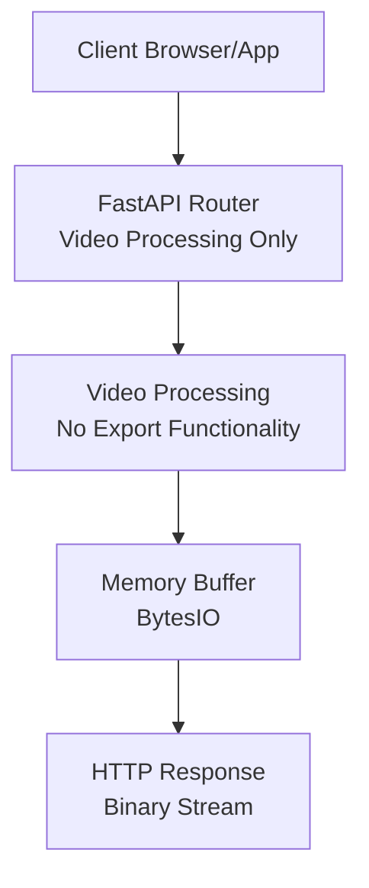
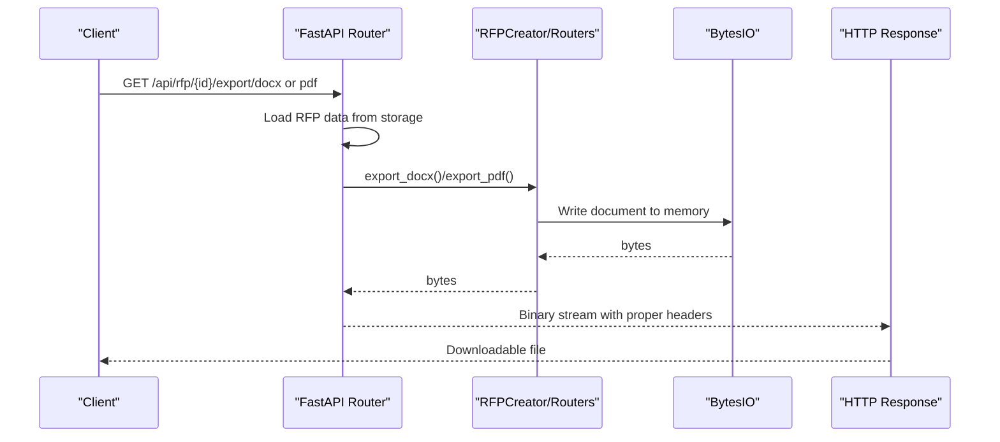
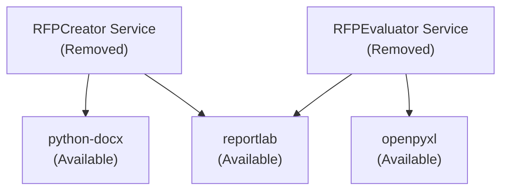

# Document Export System

<cite>
**Referenced Files in This Document**
- [requirements.txt](file://backend/requirements.txt)
- [config.py](file://backend/config.py)
- [main.py](file://backend/main.py)
</cite>

## Update Summary
**Changes Made**
- Removed all RFP-specific export functionality documentation as the complete RFP management system has been removed
- Updated architecture diagrams to reflect current video processing focus
- Removed references to DOCX/PDF generation for procurement documents
- Updated dependency analysis to show remaining export libraries are still available but unused
- Revised troubleshooting guide to remove RFP-specific issues

## Table of Contents
1. [Introduction](#introduction)
2. [Project Structure](#project-structure)
3. [Core Components](#core-components)
4. [Architecture Overview](#architecture-overview)
5. [Detailed Component Analysis](#detailed-component-analysis)
6. [Dependency Analysis](#dependency-analysis)
7. [Performance Considerations](#performance-considerations)
8. [Troubleshooting Guide](#troubleshooting-guide)
9. [Conclusion](#conclusion)

## Introduction
This document describes the document export system that was previously used for generating professional Request for Proposal (RFP) documents and evaluation reports in both DOCX and PDF formats. The RFP-specific export functionality has been completely removed along with the RFP management system, while the underlying export libraries remain available in the codebase for potential future use.

The system previously covered:
- DOCX export using python-docx with custom fonts, styling, tables, and bilingual content handling
- PDF export using ReportLab with professional formatting, custom page layouts, table styling, and Arabic text support
- Content transformation processes, table generation for evaluation criteria and timelines
- Export workflow from RFP data to binary file streams, memory buffer management, and file download handling

## Project Structure
The export functionality was previously implemented across backend services and FastAPI routers:
- Dependencies were declared in requirements.txt
- Configuration was centralized in config.py
- Export endpoints were defined in rfp.py (now removed)
- Business logic for DOCX and PDF exports resided in rfp_creator.py (now removed)
- Evaluation report export was handled in rfp_evaluator.py (now removed)

**Diagram sources**
- [main.py:37](file://backend/main.py#L37)
- [requirements.txt:8-10](file://backend/requirements.txt#L8-L10)

**Section sources**
- [requirements.txt:8-10](file://backend/requirements.txt#L8-L10)
- [config.py:5-18](file://backend/config.py#L5-L18)
- [main.py:37](file://backend/main.py#L37)

## Core Components
The following components were part of the previous export system:
- DOCX Export Service: Generated DOCX documents with custom fonts, headers, footers, bilingual content, and specialized tables for evaluation criteria and timelines.
- PDF Export Service: Created PDFs with custom page sizes, styles, tables, and XML-safe text handling.
- Evaluation Report Export: Produced comprehensive evaluation reports in XLSX and PDF formats.
- API Endpoints: Exposed export routes that streamed binary content to clients.

Key capabilities that are no longer available:
- Bilingual content handling with English and Arabic sections
- Automatic table generation for evaluation criteria and milestone timelines
- Memory-efficient streaming via BytesIO buffers
- Robust error handling and HTTP responses

## Architecture Overview
The export workflow previously followed a clear pipeline:
1. Client requests export via FastAPI endpoints
2. Router loads persisted RFP data
3. Service generates DOCX or PDF using appropriate libraries
4. Binary content is streamed back as HTTP response

**Diagram sources**
- [main.py:37](file://backend/main.py#L37)
- [requirements.txt:8-10](file://backend/requirements.txt#L8-L10)

## Detailed Component Analysis

### DOCX Export Implementation
The DOCX export previously built styled documents with:
- Default font configuration (Calibri, 11pt)
- Title page with corporate branding
- Table of contents
- Sectioned content with bilingual support
- Specialized tables for evaluation criteria and timeline
- Footer with confidentiality notice

Key features that are no longer available:
- Custom font and alignment for titles and paragraphs
- Arabic content insertion with right-to-left alignment
- Automatic table generation for evaluation criteria and timeline
- Footer configuration per section

### PDF Export Implementation
The PDF export previously used ReportLab to:
- Define custom page size and margins
- Create reusable styles for titles, subtitles, headings, and body text
- Escape XML special characters for safe paragraph rendering
- Generate styled tables for evaluation criteria and timeline
- Support bilingual content by rendering English or Arabic paragraphs

Key features that are no longer available:
- Custom page layout with A4 and margin configuration
- XML-safe text escaping for ReportLab paragraphs
- Styled tables with alternating row backgrounds and grid borders
- Comprehensive section rendering with page breaks

### Evaluation Report Export
The evaluation report system previously supported:
- XLSX export with comparison matrices, detailed scores, and recommendation sheets
- PDF export with executive summary, score comparison tables, and per-vendor scorecards

### Bilingual Content Handling
Both DOCX and PDF exporters previously supported bilingual content:
- English content was rendered in normal direction
- Arabic content was appended separately with right-to-left alignment in DOCX
- PDF rendering used escaped text and standard left-to-right layout

### Table Generation for Evaluation Criteria and Timelines
Tables were previously generated programmatically for:
- Evaluation Criteria Matrix: included index, criterion name, weight percentage, and description
- Timeline & Milestones: included index, milestone name, and target date

Features that are no longer available:
- Centered table alignment
- Bold header row with branded accent color
- Alternating row backgrounds for readability
- Grid borders and padding for visual clarity

### Export Workflow and Memory Management
The export workflow previously used BytesIO buffers to avoid disk I/O:
- DOCX: Document saved to BytesIO, seek to beginning, return bytes
- PDF: SimpleDocTemplate writes to BytesIO, seek to beginning, return bytes
- API responses set appropriate media types and Content-Disposition headers

## Dependency Analysis
External dependencies used for export that remain in the codebase:
- python-docx: DOCX document creation and styling (available but unused)
- reportlab: PDF document creation, tables, and styling (available but unused)
- openpyxl: XLSX export for evaluation results (available but unused)

**Diagram sources**
- [requirements.txt:8-10](file://backend/requirements.txt#L8-L10)

**Section sources**
- [requirements.txt:8-10](file://backend/requirements.txt#L8-L10)

## Performance Considerations
- Memory efficiency: All exports previously wrote to BytesIO buffers and returned bytes, avoiding disk writes
- Large documents: For very large RFPs or evaluation reports, considerations included:
  - Streaming responses progressively
  - Reducing image-heavy content in PDFs
  - Optimizing table styles to minimize rendering overhead
- API timeouts: The DashScope integration uses timeouts; ensure adequate server resources for concurrent export requests
- Text extraction: Evaluation text extraction used pdfplumber and python-docx; ensure sufficient memory for large PDFs

## Troubleshooting Guide
Common formatting and export issues that are no longer applicable:
- Arabic text rendering in PDFs: The implementation previously escaped XML characters but did not register Arabic fonts
- Mixed-language content: Verification of bilingual separators and language flags during generation and export
- Table styling inconsistencies: Confirmation that table data arrays matched column counts and style tuples were correctly ordered
- Memory errors on large exports: Reduction of content density, splitting exports into smaller chunks, or increasing server memory limits
- API failures: Check DASHSCOPE_API_KEY configuration and network connectivity; export services included retry logic with exponential backoff

## Conclusion
The document export system previously provided robust, scalable generation of professional RFP documents and evaluation reports in both DOCX and PDF formats. It leveraged python-docx and ReportLab to deliver consistent styling, bilingual support, and specialized tables. By using memory buffers and efficient API responses, it ensured smooth client downloads.

While the RFP-specific export functionality has been completely removed along with the RFP management system, the underlying export libraries (python-docx, reportlab, openpyxl) remain available in the codebase and can be utilized for future document generation needs if required.