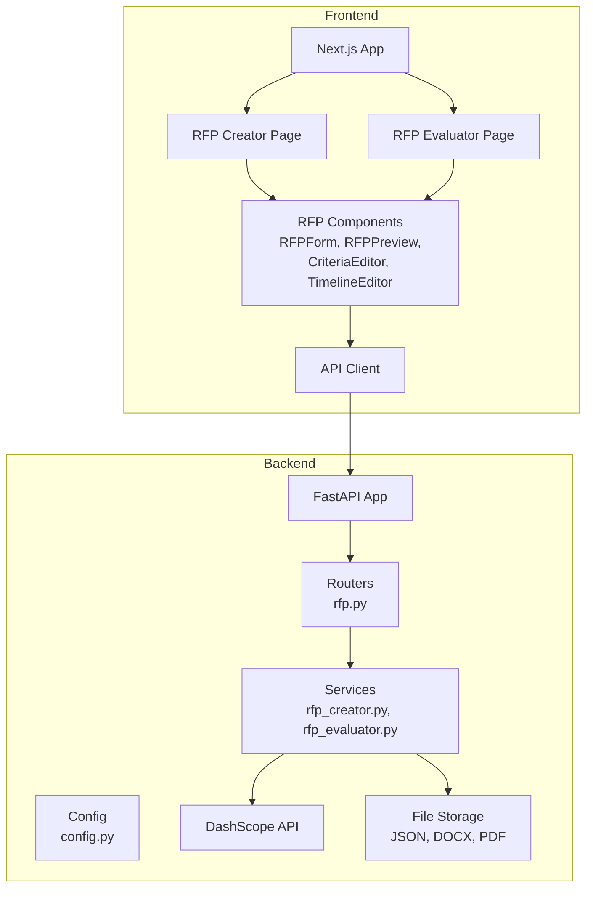
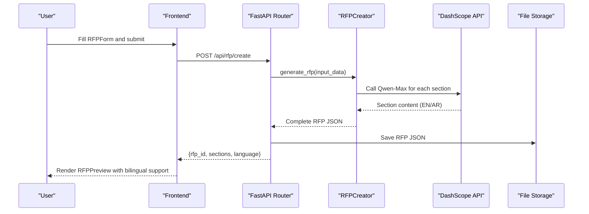
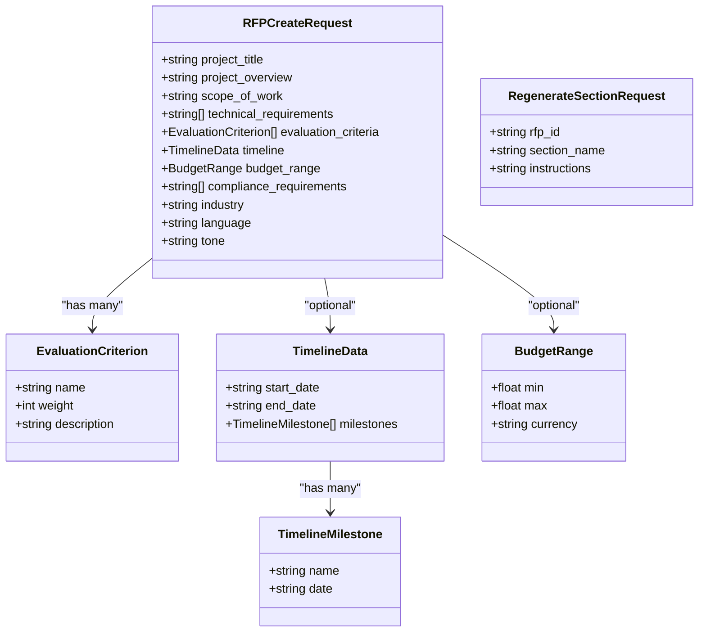
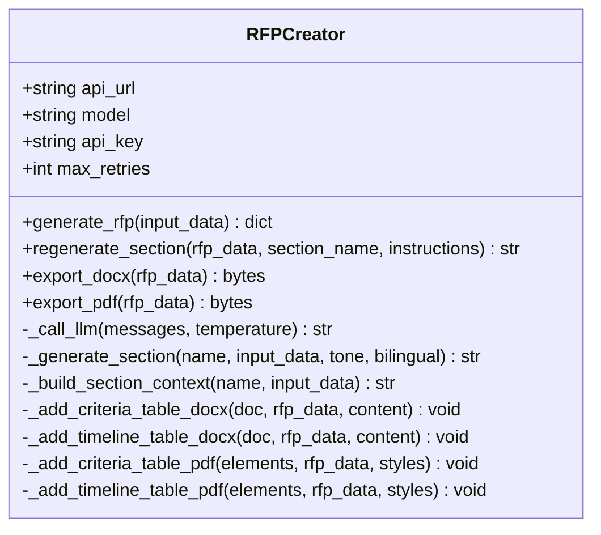
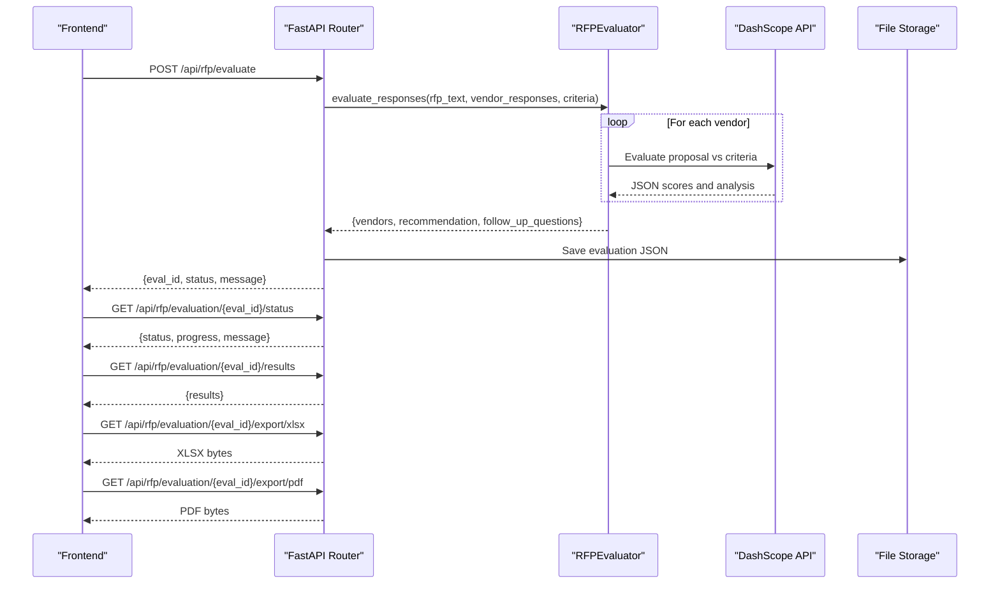
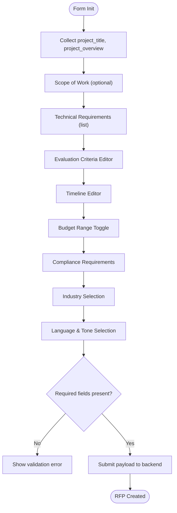
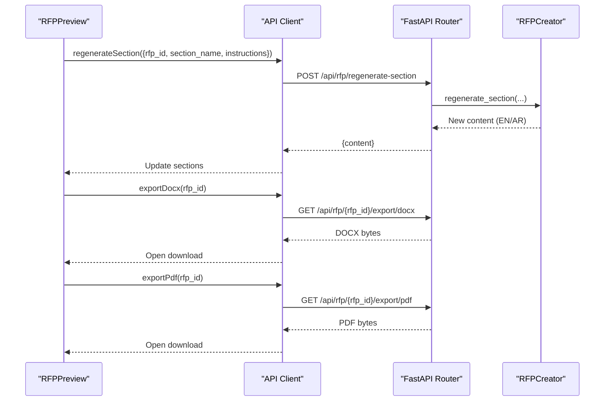
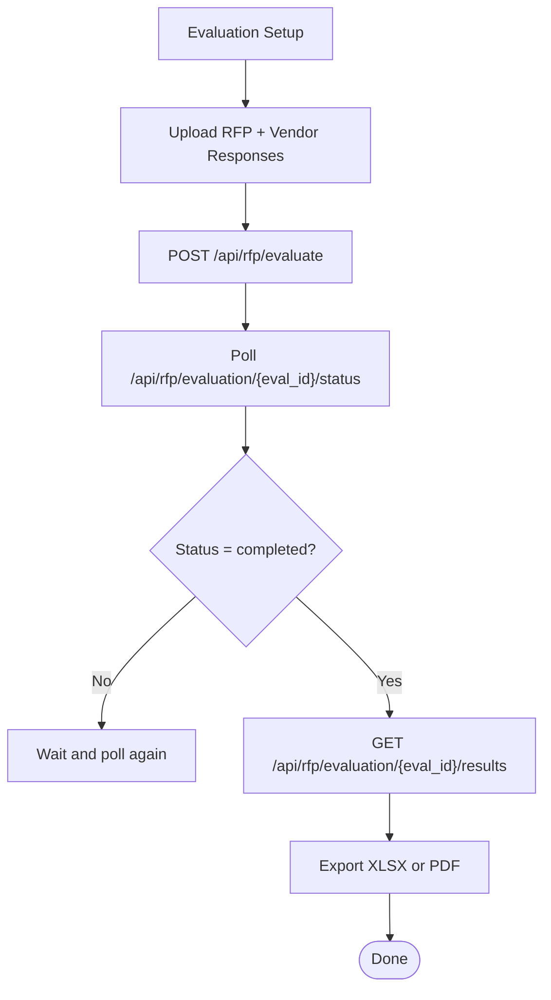
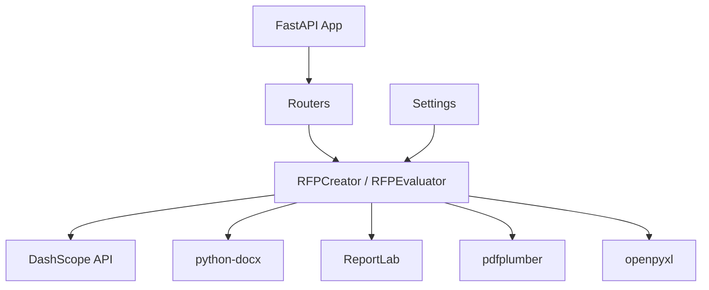

# Document Generation System

<cite>
**Referenced Files in This Document**
- [backend/routers/rfp.py](file://backend/routers/rfp.py)
- [backend/services/rfp_creator.py](file://backend/services/rfp_creator.py)
- [backend/services/rfp_evaluator.py](file://backend/services/rfp_evaluator.py)
- [backend/config.py](file://backend/config.py)
- [backend/main.py](file://backend/main.py)
- [backend/requirements.txt](file://backend/requirements.txt)
- [frontend/src/components/rfp/RFPForm.tsx](file://frontend/src/components/rfp/RFPForm.tsx)
- [frontend/src/components/rfp/RFPPreview.tsx](file://frontend/src/components/rfp/RFPPreview.tsx)
- [frontend/src/components/rfp/CriteriaEditor.tsx](file://frontend/src/components/rfp/CriteriaEditor.tsx)
- [frontend/src/components/rfp/TimelineEditor.tsx](file://frontend/src/components/rfp/TimelineEditor.tsx)
- [frontend/src/lib/api.ts](file://frontend/src/lib/api.ts)
- [frontend/src/app/rfp-creator/page.tsx](file://frontend/src/app/rfp-creator/page.tsx)
- [frontend/src/app/rfp-evaluator/page.tsx](file://frontend/src/app/rfp-evaluator/page.tsx)
</cite>

## Table of Contents
1. [Introduction](#introduction)
2. [Project Structure](#project-structure)
3. [Core Components](#core-components)
4. [Architecture Overview](#architecture-overview)
5. [Detailed Component Analysis](#detailed-component-analysis)
6. [Dependency Analysis](#dependency-analysis)
7. [Performance Considerations](#performance-considerations)
8. [Troubleshooting Guide](#troubleshooting-guide)
9. [Conclusion](#conclusion)
10. [Appendices](#appendices)

## Introduction
This document describes the RFP creation and document generation system built with Next.js (frontend) and FastAPI (backend). The system leverages Alibaba Cloud Qwen-Max via DashScope to generate professional, bilingual (English/Arabic) procurement documents following a standardized 10-section structure. It supports real-time editing, content regeneration, and exports to DOCX and PDF formats using python-docx and ReportLab. The evaluation module enables AI-driven vendor proposal assessment with exportable reports.

## Project Structure
The system is organized into two primary layers:
- Backend: FastAPI application exposing REST endpoints for RFP creation, regeneration, export, and vendor evaluation.
- Frontend: Next.js application providing interactive forms, live previews, and export controls.

**Diagram sources**
- [backend/main.py:20-44](file://backend/main.py#L20-L44)
- [backend/routers/rfp.py:15-385](file://backend/routers/rfp.py#L15-L385)
- [backend/services/rfp_creator.py:67-639](file://backend/services/rfp_creator.py#L67-L639)
- [backend/services/rfp_evaluator.py:39-622](file://backend/services/rfp_evaluator.py#L39-L622)
- [frontend/src/lib/api.ts:164-245](file://frontend/src/lib/api.ts#L164-L245)

**Section sources**
- [backend/main.py:20-44](file://backend/main.py#L20-L44)
- [frontend/src/app/rfp-creator/page.tsx:8-159](file://frontend/src/app/rfp-creator/page.tsx#L8-L159)
- [frontend/src/app/rfp-evaluator/page.tsx:18-178](file://frontend/src/app/rfp-evaluator/page.tsx#L18-L178)

## Core Components
- RFP Creation Service: Generates a complete RFP using Qwen-Max with a 10-section structure, bilingual support, and configurable tone.
- RFP Preview and Editing: Real-time preview with bilingual toggle, per-section regeneration, and export to DOCX/PDF.
- Evaluation Service: AI-powered vendor evaluation with scoring, weighted totals, and exportable reports.
- Frontend Forms: Interactive editors for evaluation criteria and timeline, with validation and dynamic updates.

Key capabilities:
- Structured 10-section RFP generation aligned with international procurement standards.
- Bilingual generation with Arabic translations for official UAE documents.
- Customizable evaluation criteria with weights and descriptions.
- Timeline integration with milestones and dates.
- Export to DOCX and PDF with professional formatting.
- Real-time editing and regeneration of individual sections.

**Section sources**
- [backend/services/rfp_creator.py:34-45](file://backend/services/rfp_creator.py#L34-L45)
- [backend/services/rfp_creator.py:124-151](file://backend/services/rfp_creator.py#L124-L151)
- [backend/routers/rfp.py:51-68](file://backend/routers/rfp.py#L51-L68)
- [frontend/src/components/rfp/RFPForm.tsx:31-122](file://frontend/src/components/rfp/RFPForm.tsx#L31-L122)
- [frontend/src/components/rfp/RFPPreview.tsx:18-46](file://frontend/src/components/rfp/RFPPreview.tsx#L18-L46)

## Architecture Overview
The system integrates a frontend React/Next.js UI with a FastAPI backend. The backend orchestrates AI generation via DashScope and persists data locally. The frontend handles user input, preview rendering, and export actions.

**Diagram sources**
- [backend/routers/rfp.py:97-131](file://backend/routers/rfp.py#L97-L131)
- [backend/services/rfp_creator.py:124-151](file://backend/services/rfp_creator.py#L124-L151)
- [backend/services/rfp_creator.py:76-123](file://backend/services/rfp_creator.py#L76-L123)
- [backend/config.py:4-12](file://backend/config.py#L4-L12)

## Detailed Component Analysis

### Backend: RFP Router and Models
The router defines request/response models and endpoints for RFP creation, regeneration, and export. It manages storage for RFPs and evaluations, and exposes endpoints for exporting DOCX and PDF.

Key responsibilities:
- Validate and transform incoming requests into internal structures.
- Persist RFPs and evaluations to disk.
- Trigger asynchronous export tasks and return downloadable URLs.
- Provide evaluation status and results endpoints.

**Diagram sources**
- [backend/routers/rfp.py:28-68](file://backend/routers/rfp.py#L28-L68)

**Section sources**
- [backend/routers/rfp.py:97-131](file://backend/routers/rfp.py#L97-L131)
- [backend/routers/rfp.py:133-167](file://backend/routers/rfp.py#L133-L167)
- [backend/routers/rfp.py:170-199](file://backend/routers/rfp.py#L170-L199)
- [backend/routers/rfp.py:243-346](file://backend/routers/rfp.py#L243-L346)

### Backend: RFPCreator Service
Generates RFP content using Qwen-Max with a fixed 10-section structure. Supports:
- Bilingual generation with Arabic translations.
- Configurable tone (formal, technical, concise).
- Section-specific context injection.
- DOCX and PDF export with professional formatting.

**Diagram sources**
- [backend/services/rfp_creator.py:67-639](file://backend/services/rfp_creator.py#L67-L639)

**Section sources**
- [backend/services/rfp_creator.py:124-151](file://backend/services/rfp_creator.py#L124-L151)
- [backend/services/rfp_creator.py:257-295](file://backend/services/rfp_creator.py#L257-L295)
- [backend/services/rfp_creator.py:297-381](file://backend/services/rfp_creator.py#L297-L381)
- [backend/services/rfp_creator.py:449-555](file://backend/services/rfp_creator.py#L449-L555)

### Backend: RFPEvaluator Service
Evaluates vendor proposals against custom criteria, computes weighted totals, and generates a recommendation and follow-up questions. Provides exportable XLSX and PDF reports.

**Diagram sources**
- [backend/routers/rfp.py:243-346](file://backend/routers/rfp.py#L243-L346)
- [backend/services/rfp_evaluator.py:230-295](file://backend/services/rfp_evaluator.py#L230-L295)
- [backend/services/rfp_evaluator.py:48-104](file://backend/services/rfp_evaluator.py#L48-L104)

**Section sources**
- [backend/services/rfp_evaluator.py:133-210](file://backend/services/rfp_evaluator.py#L133-L210)
- [backend/services/rfp_evaluator.py:230-295](file://backend/services/rfp_evaluator.py#L230-L295)
- [backend/services/rfp_evaluator.py:351-472](file://backend/services/rfp_evaluator.py#L351-L472)
- [backend/services/rfp_evaluator.py:474-621](file://backend/services/rfp_evaluator.py#L474-L621)

### Frontend: RFPForm and Editors
The RFP form collects project details, technical requirements, evaluation criteria, timeline, budget, compliance, industry, language, and tone. It validates inputs and constructs the payload sent to the backend.

**Diagram sources**
- [frontend/src/components/rfp/RFPForm.tsx:31-122](file://frontend/src/components/rfp/RFPForm.tsx#L31-L122)
- [frontend/src/components/rfp/CriteriaEditor.tsx:17-36](file://frontend/src/components/rfp/CriteriaEditor.tsx#L17-L36)
- [frontend/src/components/rfp/TimelineEditor.tsx:20-44](file://frontend/src/components/rfp/TimelineEditor.tsx#L20-L44)

**Section sources**
- [frontend/src/components/rfp/RFPForm.tsx:31-122](file://frontend/src/components/rfp/RFPForm.tsx#L31-L122)
- [frontend/src/components/rfp/CriteriaEditor.tsx:17-36](file://frontend/src/components/rfp/CriteriaEditor.tsx#L17-L36)
- [frontend/src/components/rfp/TimelineEditor.tsx:20-44](file://frontend/src/components/rfp/TimelineEditor.tsx#L20-L44)

### Frontend: RFPPreview and Export Controls
Provides a live preview of the generated RFP with bilingual support, per-section regeneration, and export buttons for DOCX and PDF.

**Diagram sources**
- [frontend/src/components/rfp/RFPPreview.tsx:18-46](file://frontend/src/components/rfp/RFPPreview.tsx#L18-L46)
- [frontend/src/lib/api.ts:192-208](file://frontend/src/lib/api.ts#L192-L208)
- [backend/routers/rfp.py:133-167](file://backend/routers/rfp.py#L133-L167)
- [backend/routers/rfp.py:170-199](file://backend/routers/rfp.py#L170-L199)

**Section sources**
- [frontend/src/components/rfp/RFPPreview.tsx:18-46](file://frontend/src/components/rfp/RFPPreview.tsx#L18-L46)
- [frontend/src/lib/api.ts:192-208](file://frontend/src/lib/api.ts#L192-L208)
- [backend/routers/rfp.py:133-167](file://backend/routers/rfp.py#L133-L167)
- [backend/routers/rfp.py:170-199](file://backend/routers/rfp.py#L170-L199)

### Frontend: RFP Evaluator Workflow
Handles vendor proposal uploads, evaluation initiation, polling for completion, and rendering results with export options.

**Diagram sources**
- [frontend/src/app/rfp-evaluator/page.tsx:33-98](file://frontend/src/app/rfp-evaluator/page.tsx#L33-L98)
- [backend/routers/rfp.py:243-346](file://backend/routers/rfp.py#L243-L346)

**Section sources**
- [frontend/src/app/rfp-evaluator/page.tsx:33-98](file://frontend/src/app/rfp-evaluator/page.tsx#L33-L98)
- [backend/routers/rfp.py:243-346](file://backend/routers/rfp.py#L243-L346)

## Dependency Analysis
External dependencies and integrations:
- DashScope API for Qwen-Max text generation.
- python-docx for DOCX export.
- ReportLab for PDF export.
- pdfplumber for extracting text from uploaded PDFs during evaluation.
- openpyxl for XLSX export of evaluation results.

**Diagram sources**
- [backend/requirements.txt:1-16](file://backend/requirements.txt#L1-L16)
- [backend/config.py:4-12](file://backend/config.py#L4-L12)

**Section sources**
- [backend/requirements.txt:1-16](file://backend/requirements.txt#L1-L16)
- [backend/config.py:4-12](file://backend/config.py#L4-L12)

## Performance Considerations
- API latency: DashScope calls are asynchronous with retries and exponential backoff to improve reliability.
- Content truncation: Evaluation service truncates RFP and vendor response texts to fit within model context limits.
- Export performance: DOCX and PDF generation are streamed to reduce memory overhead.
- UI responsiveness: Frontend uses skeleton loaders and controlled state updates to keep the interface responsive.

[No sources needed since this section provides general guidance]

## Troubleshooting Guide
Common issues and resolutions:
- API key missing: Ensure the DashScope API key is configured in the environment.
  - Verify settings and restart the server.
- Export failures: Confirm the RFP exists and the export endpoints are reachable.
  - Check server logs for exceptions during DOCX/PDF generation.
- Evaluation not completed: Poll the status endpoint until completion or failure.
  - Validate vendor file uploads and criteria JSON formatting.
- Text extraction errors: Uploaded files must be PDF or DOCX; otherwise, fallback decoding may fail.
- Formatting inconsistencies: DOCX/ReportLab formatting relies on consistent section content; ensure regenerated content follows expected structure.

**Section sources**
- [backend/services/rfp_creator.py:76-123](file://backend/services/rfp_creator.py#L76-L123)
- [backend/services/rfp_evaluator.py:106-132](file://backend/services/rfp_evaluator.py#L106-L132)
- [backend/routers/rfp.py:170-199](file://backend/routers/rfp.py#L170-L199)
- [backend/routers/rfp.py:368-385](file://backend/routers/rfp.py#L368-L385)

## Conclusion
The RFP creation and document generation system provides a robust, AI-assisted workflow for producing professional procurement documents in both English and Arabic. Its modular architecture, real-time editing, and export capabilities streamline the end-to-end process from form building to final document delivery. The evaluation module further enhances decision-making with AI-driven scoring and reporting.

[No sources needed since this section summarizes without analyzing specific files]

## Appendices

### Example Workflows
- Creating a bilingual RFP:
  - Select language “Bilingual” in the form.
  - Generate the RFP; the system produces English content with Arabic translations separated by a marker.
  - Preview toggles between EN/AR and allows per-section regeneration.
  - Export to DOCX or PDF for distribution.
- Customizing evaluation criteria:
  - Use the Criteria Editor to define named criteria, weights, and descriptions.
  - Ensure total weights equal 100% for accurate scoring.
  - Re-run evaluation after changes to regenerate results.
- Timeline integration:
  - Enter start/end dates and add milestones with target dates.
  - The system renders structured tables in the Evaluation Criteria Matrix and Timeline sections.

[No sources needed since this section provides general guidance]