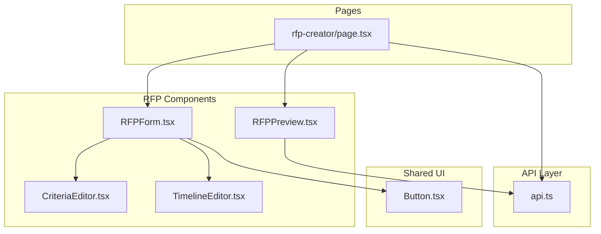
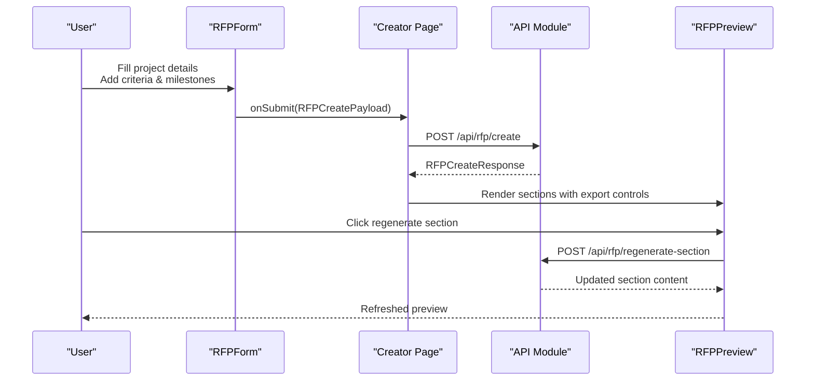
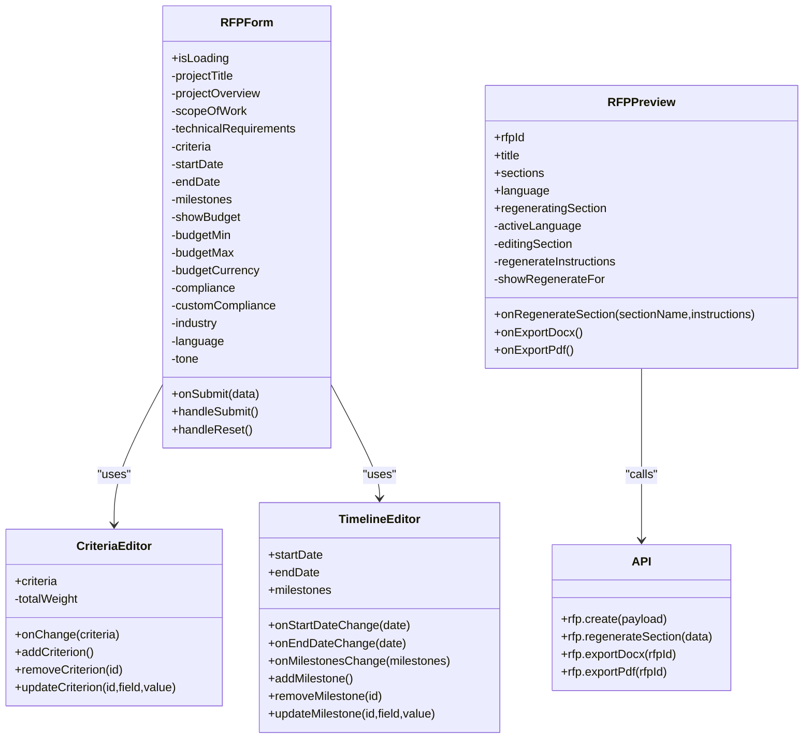
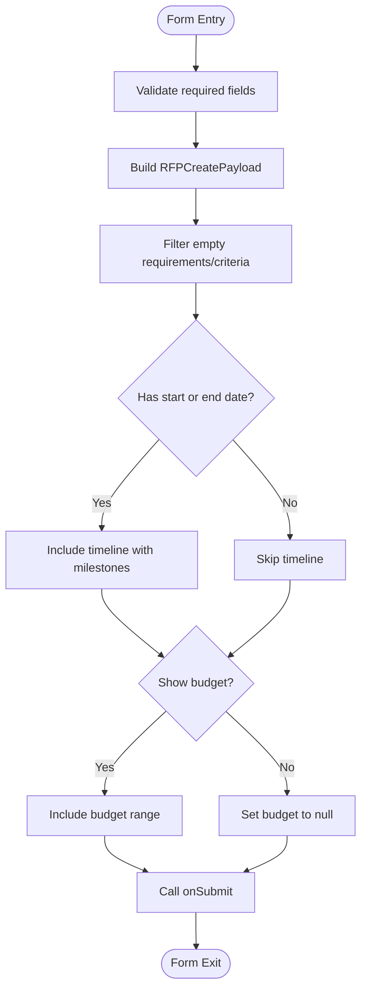
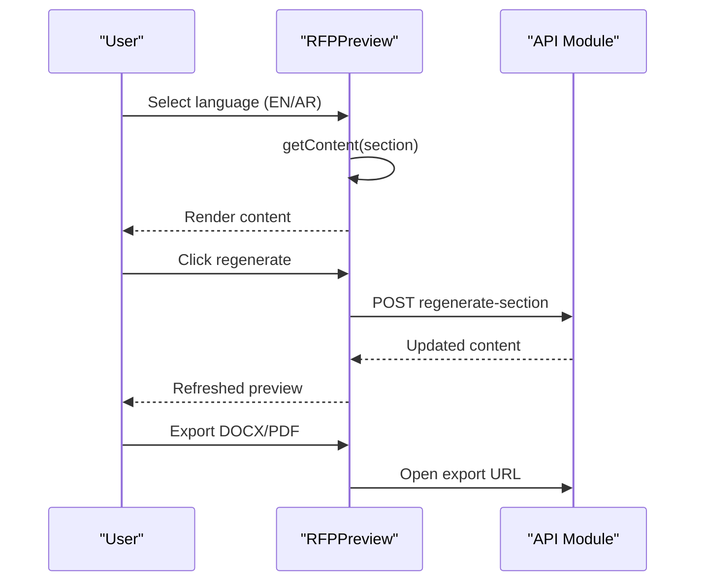
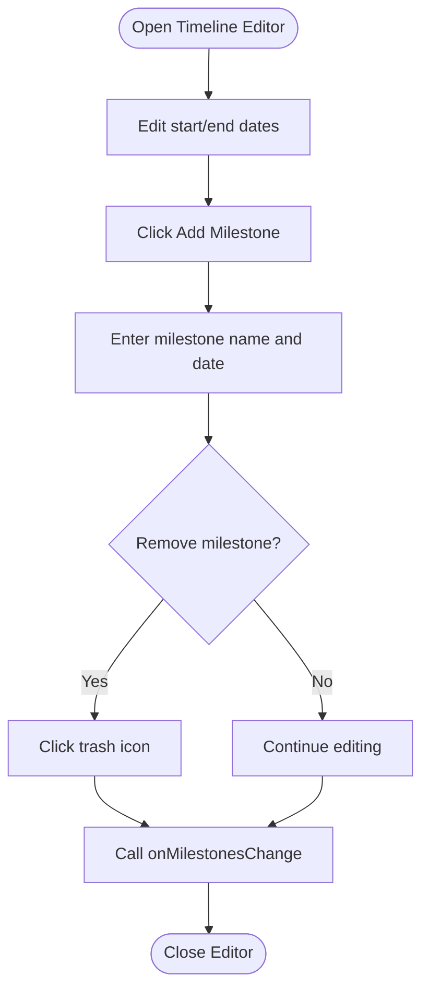
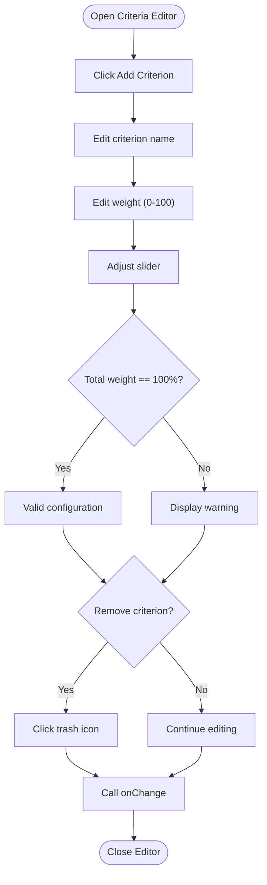

# Frontend RFP Components

<cite>
**Referenced Files in This Document**
- [RFPForm.tsx](file://frontend/src/components/rfp/RFPForm.tsx)
- [RFPPreview.tsx](file://frontend/src/components/rfp/RFPPreview.tsx)
- [TimelineEditor.tsx](file://frontend/src/components/rfp/TimelineEditor.tsx)
- [CriteriaEditor.tsx](file://frontend/src/components/rfp/CriteriaEditor.tsx)
- [api.ts](file://frontend/src/lib/api.ts)
- [page.tsx](file://frontend/src/app/rfp-creator/page.tsx)
- [Button.tsx](file://frontend/src/components/Button.tsx)
</cite>

## Table of Contents
1. [Introduction](#introduction)
2. [Project Structure](#project-structure)
3. [Core Components](#core-components)
4. [Architecture Overview](#architecture-overview)
5. [Detailed Component Analysis](#detailed-component-analysis)
6. [Dependency Analysis](#dependency-analysis)
7. [Performance Considerations](#performance-considerations)
8. [Troubleshooting Guide](#troubleshooting-guide)
9. [Conclusion](#conclusion)

## Introduction
This document provides comprehensive documentation for the RFP frontend components that enable users to create Request for Proposals with AI assistance. It covers the RFPForm component for collecting project requirements, evaluation criteria, and timeline information; the RFPPreview component for real-time document preview and content visualization; the TimelineEditor component for milestone creation and scheduling with interactive date management; and the CriteriaEditor component for configuring weighted evaluation matrices with dynamic addition/removal of criteria. The documentation includes component prop interfaces, state management patterns, form validation logic, user interaction flows, examples of component usage, customization options, integration with the backend API, and responsive design considerations.

## Project Structure
The RFP components are organized under the frontend/src/components/rfp/ directory and integrate with shared UI components and API utilities. The main pages demonstrate how these components are orchestrated to provide a seamless user experience.

**Diagram sources**
- [RFPForm.tsx:1-411](file://frontend/src/components/rfp/RFPForm.tsx#L1-L411)
- [RFPPreview.tsx:1-200](file://frontend/src/components/rfp/RFPPreview.tsx#L1-L200)
- [TimelineEditor.tsx:1-111](file://frontend/src/components/rfp/TimelineEditor.tsx#L1-L111)
- [CriteriaEditor.tsx:1-127](file://frontend/src/components/rfp/CriteriaEditor.tsx#L1-L127)
- [Button.tsx:1-30](file://frontend/src/components/Button.tsx#L1-L30)
- [api.ts:1-245](file://frontend/src/lib/api.ts#L1-L245)
- [page.tsx:1-159](file://frontend/src/app/rfp-creator/page.tsx#L1-L159)

**Section sources**
- [RFPForm.tsx:1-411](file://frontend/src/components/rfp/RFPForm.tsx#L1-L411)
- [RFPPreview.tsx:1-200](file://frontend/src/components/rfp/RFPPreview.tsx#L1-L200)
- [TimelineEditor.tsx:1-111](file://frontend/src/components/rfp/TimelineEditor.tsx#L1-L111)
- [CriteriaEditor.tsx:1-127](file://frontend/src/components/rfp/CriteriaEditor.tsx#L1-L127)
- [api.ts:1-245](file://frontend/src/lib/api.ts#L1-L245)
- [page.tsx:1-159](file://frontend/src/app/rfp-creator/page.tsx#L1-L159)

## Core Components
This section outlines the primary RFP components and their responsibilities:

- RFPForm: Collects project requirements, evaluation criteria, timeline, budget, compliance, industry, language, and tone preferences. It validates required fields and constructs a structured payload for submission.
- RFPPreview: Renders the generated RFP sections with bilingual support, export capabilities, and per-section regeneration controls.
- TimelineEditor: Manages project start/end dates and milestone entries with interactive editing and deletion.
- CriteriaEditor: Configures evaluation criteria with dynamic addition/removal, weight distribution, and total weight validation.

Key integration points:
- Shared UI components (Button) for consistent styling and behavior.
- API module (api.ts) for backend communication and data typing.

**Section sources**
- [RFPForm.tsx:10-13](file://frontend/src/components/rfp/RFPForm.tsx#L10-L13)
- [RFPPreview.tsx:7-16](file://frontend/src/components/rfp/RFPPreview.tsx#L7-L16)
- [TimelineEditor.tsx:11-18](file://frontend/src/components/rfp/TimelineEditor.tsx#L11-L18)
- [CriteriaEditor.tsx:12-15](file://frontend/src/components/rfp/CriteriaEditor.tsx#L12-L15)
- [Button.tsx:3-6](file://frontend/src/components/Button.tsx#L3-L6)
- [api.ts:140-160](file://frontend/src/lib/api.ts#L140-L160)

## Architecture Overview
The RFP workflow integrates form input collection, AI-driven document generation, and real-time preview with export capabilities. The creator page coordinates state and API interactions.

**Diagram sources**
- [RFPForm.tsx:75-104](file://frontend/src/components/rfp/RFPForm.tsx#L75-L104)
- [page.tsx:17-32](file://frontend/src/app/rfp-creator/page.tsx#L17-L32)
- [api.ts:186-200](file://frontend/src/lib/api.ts#L186-L200)
- [RFPPreview.tsx:42-46](file://frontend/src/components/rfp/RFPPreview.tsx#L42-L46)

## Detailed Component Analysis

### RFPForm Component
Purpose:
- Collects comprehensive project information including title, overview, scope, technical requirements, evaluation criteria, timeline, budget, compliance, industry, language, and tone.
- Validates required fields and constructs a structured payload for the backend.

Key props:
- onSubmit: Callback receiving RFPCreatePayload upon successful submission.
- isLoading: Boolean indicating submission state for UI feedback.

State management:
- Local state for all form fields, including arrays for technical requirements and milestones.
- Controlled components for inputs, radio buttons, and select elements.
- Utility functions for adding/removing technical requirements and toggling compliance options.

Validation logic:
- Required fields enforced via HTML attributes and runtime checks.
- Payload filtering removes empty entries for requirements and criteria.
- Timeline inclusion depends on presence of start or end date.
- Budget range inclusion controlled by a checkbox toggle.

User interaction flows:
- Dynamic addition/removal of technical requirements.
- Toggleable budget range with currency selection.
- Compliance checkboxes with custom compliance entry.
- Language and tone selection via radio groups.
- Submit button disabled until required fields are filled.

Usage example:
- Integrate with the creator page by passing handleGenerate as onSubmit and isLoading state.

Customization options:
- Modify default evaluation criteria initialization.
- Extend compliance options and industry selections.
- Adjust styling classes for consistent design.

Accessibility considerations:
- Proper labeling for all inputs.
- Focus management for keyboard navigation.
- Disabled states for submit button during loading.

**Section sources**
- [RFPForm.tsx:10-13](file://frontend/src/components/rfp/RFPForm.tsx#L10-L13)
- [RFPForm.tsx:31-122](file://frontend/src/components/rfp/RFPForm.tsx#L31-L122)
- [RFPForm.tsx:124-410](file://frontend/src/components/rfp/RFPForm.tsx#L124-L410)
- [Button.tsx:3-6](file://frontend/src/components/Button.tsx#L3-L6)

### RFPPreview Component
Purpose:
- Displays generated RFP sections with bilingual support and export options.
- Provides per-section regeneration controls with optional instructions.

Key props:
- rfpId: Identifier for the RFP document.
- title: Document title for display.
- sections: Array of RFPSection objects containing content in English and/or Arabic.
- language: Language mode ("en", "ar", or "both").
- onRegenerateSection: Callback to regenerate a specific section.
- onExportDocx/onExportPdf: Callbacks to trigger document exports.
- regeneratingSection: Current section being regenerated for UI feedback.

State management:
- Active language selection for bilingual display.
- Editing state for regeneration instructions.
- Hover-triggered regeneration prompts.

Content rendering:
- Conditional content selection based on active language.
- Skeleton loaders during regeneration.
- RTL support for Arabic content.

User interaction flows:
- Switch between English and Arabic views.
- Trigger regeneration with optional instructions.
- Export to DOCX or PDF.

Integration with backend:
- Calls regenerateSection endpoint and updates local sections accordingly.
- Uses export endpoints to open downloadable files.

**Section sources**
- [RFPPreview.tsx:7-16](file://frontend/src/components/rfp/RFPPreview.tsx#L7-L16)
- [RFPPreview.tsx:18-46](file://frontend/src/components/rfp/RFPPreview.tsx#L18-L46)
- [RFPPreview.tsx:48-199](file://frontend/src/components/rfp/RFPPreview.tsx#L48-L199)
- [api.ts:192-208](file://frontend/src/lib/api.ts#L192-L208)

### TimelineEditor Component
Purpose:
- Manages project timeline with start/end dates and milestone entries.
- Supports dynamic addition and removal of milestones with interactive editing.

Key props:
- startDate: Initial start date.
- endDate: Initial end date.
- milestones: Array of Milestone objects.
- onStartDateChange/onEndDateChange: Callbacks for date updates.
- onMilestonesChange: Callback for milestone array updates.

State management:
- Internal state mirrors props and updates via callbacks.
- Utility functions for adding, removing, and updating milestones.

User interaction flows:
- Edit start and end dates.
- Add/remove milestones with name and date fields.
- Real-time feedback on milestone count and validity.

Validation logic:
- Milestone entries validated by filtering empty names before submission.

**Section sources**
- [TimelineEditor.tsx:11-18](file://frontend/src/components/rfp/TimelineEditor.tsx#L11-L18)
- [TimelineEditor.tsx:20-43](file://frontend/src/components/rfp/TimelineEditor.tsx#L20-L43)
- [TimelineEditor.tsx:45-110](file://frontend/src/components/rfp/TimelineEditor.tsx#L45-L110)

### CriteriaEditor Component
Purpose:
- Configures evaluation criteria with dynamic addition/removal and weight distribution.
- Enforces total weight validation to ensure criteria sum to 100%.

Key props:
- criteria: Array of Criterion objects.
- onChange: Callback receiving updated criteria array.

State management:
- Computes total weight from current criteria.
- Utility functions for adding, removing, and updating criteria fields.

User interaction flows:
- Add/remove criteria entries.
- Edit criterion name, weight, and description.
- Weight slider for intuitive adjustment.
- Visual indicator for total weight compliance.

Validation logic:
- Total weight computed and displayed with color-coded status.
- Weight values constrained to 0–100 range.

**Section sources**
- [CriteriaEditor.tsx:12-15](file://frontend/src/components/rfp/CriteriaEditor.tsx#L12-L15)
- [CriteriaEditor.tsx:17-35](file://frontend/src/components/rfp/CriteriaEditor.tsx#L17-L35)
- [CriteriaEditor.tsx:37-126](file://frontend/src/components/rfp/CriteriaEditor.tsx#L37-L126)

### Component Prop Interfaces and Data Models
Interface definitions and payload structures:

- RFPCreatePayload: Defines the shape of the submission payload including project details, evaluation criteria, timeline, budget range, compliance requirements, industry, language, and tone.
- RFPSection: Represents a document section with optional English and Arabic content.
- Criterion: Represents an evaluation criterion with name, weight, and description.
- Milestone: Represents a project milestone with name and date.

These interfaces ensure type safety across component boundaries and API interactions.

**Section sources**
- [api.ts:140-160](file://frontend/src/lib/api.ts#L140-L160)
- [api.ts:103-107](file://frontend/src/lib/api.ts#L103-L107)
- [CriteriaEditor.tsx:5-10](file://frontend/src/components/rfp/CriteriaEditor.tsx#L5-L10)
- [TimelineEditor.tsx:5-9](file://frontend/src/components/rfp/TimelineEditor.tsx#L5-L9)

### Integration with Backend API
The components rely on the API module for:
- Creating RFP documents via POST /api/rfp/create.
- Regenerating individual sections via POST /api/rfp/regenerate-section.
- Exporting documents to DOCX/PDF via GET endpoints.
- Polling evaluation status and retrieving results for the evaluator.

The creator page demonstrates:
- Handling submission, error states, and loading indicators.
- Updating preview sections after regeneration.
- Triggering exports through browser navigation.

**Section sources**
- [api.ts:186-240](file://frontend/src/lib/api.ts#L186-L240)
- [page.tsx:17-65](file://frontend/src/app/rfp-creator/page.tsx#L17-L65)

### Responsive Design Considerations
- Grid layouts adapt to two-column layout on larger screens and stack vertically on smaller screens.
- Inputs and buttons use flexible sizing with padding and typography scales suitable for various screen sizes.
- Hover states and focus rings provide clear affordances for interactive elements.
- RTL support for Arabic content ensures proper text direction and alignment.

**Section sources**
- [RFPForm.tsx:124-410](file://frontend/src/components/rfp/RFPForm.tsx#L124-L410)
- [RFPPreview.tsx:48-199](file://frontend/src/components/rfp/RFPPreview.tsx#L48-L199)
- [TimelineEditor.tsx:45-110](file://frontend/src/components/rfp/TimelineEditor.tsx#L45-L110)
- [CriteriaEditor.tsx:37-126](file://frontend/src/components/rfp/CriteriaEditor.tsx#L37-L126)

## Architecture Overview
The RFP components form a cohesive system where the form collects data, the preview renders content, and the editor components manage specialized inputs. The API module centralizes network requests and typing.

**Diagram sources**
- [RFPForm.tsx:31-122](file://frontend/src/components/rfp/RFPForm.tsx#L31-L122)
- [RFPPreview.tsx:18-46](file://frontend/src/components/rfp/RFPPreview.tsx#L18-L46)
- [TimelineEditor.tsx:20-43](file://frontend/src/components/rfp/TimelineEditor.tsx#L20-L43)
- [CriteriaEditor.tsx:17-35](file://frontend/src/components/rfp/CriteriaEditor.tsx#L17-L35)
- [api.ts:186-208](file://frontend/src/lib/api.ts#L186-L208)

## Detailed Component Analysis

### RFPForm: Data Flow and Validation
The form aggregates multiple inputs into a structured payload. It filters out empty values and conditionally includes timeline and budget data based on user selections.

**Diagram sources**
- [RFPForm.tsx:75-104](file://frontend/src/components/rfp/RFPForm.tsx#L75-L104)

**Section sources**
- [RFPForm.tsx:75-104](file://frontend/src/components/rfp/RFPForm.tsx#L75-L104)

### RFPPreview: Content Rendering and Export
The preview component manages bilingual content rendering and export actions. It handles regeneration prompts and updates content dynamically.

**Diagram sources**
- [RFPPreview.tsx:35-46](file://frontend/src/components/rfp/RFPPreview.tsx#L35-L46)
- [api.ts:201-208](file://frontend/src/lib/api.ts#L201-L208)

**Section sources**
- [RFPPreview.tsx:35-199](file://frontend/src/components/rfp/RFPPreview.tsx#L35-L199)
- [api.ts:192-208](file://frontend/src/lib/api.ts#L192-L208)

### TimelineEditor: Interactive Milestone Management
The timeline editor provides a clean interface for managing project milestones with immediate feedback.

**Diagram sources**
- [TimelineEditor.tsx:28-43](file://frontend/src/components/rfp/TimelineEditor.tsx#L28-L43)

**Section sources**
- [TimelineEditor.tsx:28-110](file://frontend/src/components/rfp/TimelineEditor.tsx#L28-L110)

### CriteriaEditor: Weight Distribution and Validation
The criteria editor enforces a total weight constraint and provides intuitive controls for adjusting weights.

**Diagram sources**
- [CriteriaEditor.tsx:18-35](file://frontend/src/components/rfp/CriteriaEditor.tsx#L18-L35)

**Section sources**
- [CriteriaEditor.tsx:18-126](file://frontend/src/components/rfp/CriteriaEditor.tsx#L18-L126)

## Dependency Analysis
The components exhibit clear separation of concerns with minimal coupling:

- RFPForm depends on CriteriaEditor and TimelineEditor for specialized inputs.
- RFPPreview depends on API for data fetching and export actions.
- All components share common UI patterns via Button and consistent styling.
- API module centralizes network logic and typing.

Potential circular dependencies:
- None observed between RFP components and API module.

External dependencies:
- Heroicons for UI icons.
- Tailwind CSS for styling.

**Section sources**
- [RFPForm.tsx:5-8](file://frontend/src/components/rfp/RFPForm.tsx#L5-L8)
- [RFPPreview.tsx](file://frontend/src/components/rfp/RFPPreview.tsx#L4)
- [api.ts:1-39](file://frontend/src/lib/api.ts#L1-L39)

## Performance Considerations
- Efficient re-rendering: Components use controlled inputs and minimal state updates to reduce unnecessary renders.
- Lazy loading: Preview skeleton loaders improve perceived performance during regeneration.
- Debounced inputs: Consider debouncing heavy computations if criteria weight validation becomes more complex.
- Bundle size: Icons are imported from Heroicons; ensure tree-shaking is enabled to minimize bundle impact.

## Troubleshooting Guide
Common issues and resolutions:
- Submission disabled: Ensure required fields are filled; the submit button disables when project title or overview are empty.
- Budget range not included: Verify the budget toggle is enabled; otherwise, budget range is set to null.
- Timeline not included: Provide either start or end date to include timeline data.
- Regeneration errors: Check network connectivity and API availability; the creator page displays error messages.
- Export failures: Confirm the RFP ID exists and the export endpoints are reachable.

Debugging tips:
- Inspect the constructed payload in the form submission handler.
- Monitor API responses for detailed error messages.
- Use browser developer tools to verify network requests and responses.

**Section sources**
- [RFPForm.tsx:390-407](file://frontend/src/components/rfp/RFPForm.tsx#L390-L407)
- [page.tsx:26-31](file://frontend/src/app/rfp-creator/page.tsx#L26-L31)
- [api.ts:31-36](file://frontend/src/lib/api.ts#L31-L36)

## Conclusion
The RFP frontend components provide a robust, accessible, and responsive foundation for creating AI-generated Request for Proposals. They integrate seamlessly with the backend API, enforce validation, and offer intuitive user interactions for managing requirements, timelines, and evaluation criteria. The modular design allows for easy customization and extension while maintaining consistency across the application.