# RFP Creation Service

<cite>
**Referenced Files in This Document**
- [rfp_creator.py](file://backend/services/rfp_creator.py)
- [rfp.py](file://backend/routers/rfp.py)
- [config.py](file://backend/config.py)
- [main.py](file://backend/main.py)
- [RFPForm.tsx](file://frontend/src/components/rfp/RFPForm.tsx)
- [RFPPreview.tsx](file://frontend/src/components/rfp/RFPPreview.tsx)
- [page.tsx](file://frontend/src/app/rfp-creator/page.tsx)
- [api.ts](file://frontend/src/lib/api.ts)
- [RFPForm.tsx](file://frontend/src/components/rfp/CriteriaEditor.tsx)
- [TimelineEditor.tsx](file://frontend/src/components/rfp/TimelineEditor.tsx)
</cite>

## Table of Contents
1. [Introduction](#introduction)
2. [System Architecture](#system-architecture)
3. [Core Components](#core-components)
4. [RFPCreator Implementation](#rfpcreator-implementation)
5. [RFP Structure and Content Generation](#rfp-structure-and-content-generation)
6. [Bilingual Content Generation](#bilingual-content-generation)
7. [AI Prompting Strategy](#ai-prompting-strategy)
8. [Asynchronous API Integration](#asynchronous-api-integration)
9. [Content Export and Formatting](#content-export-and-formatting)
10. [Frontend Integration](#frontend-integration)
11. [Error Handling and Retry Mechanisms](#error-handling-and-retry-mechanisms)
12. [Performance Considerations](#performance-considerations)
13. [Troubleshooting Guide](#troubleshooting-guide)
14. [Conclusion](#conclusion)

## Introduction

The RFP Creation Service is an AI-powered system that generates professional Request for Proposal documents using Alibaba Cloud DashScope's Qwen-Max models. This comprehensive service transforms structured project data into complete, compliant RFP documents with bilingual support for English and Arabic languages, featuring professional tone control and advanced content regeneration capabilities.

The system follows international procurement standards while adhering to UAE regulations and business practices, making it ideal for government organizations like Dubai Media Incorporated. The service integrates seamlessly with both backend APIs and frontend user interfaces, providing a complete workflow from data input to document export.

## System Architecture

The RFP Creation Service follows a modern microservice architecture with clear separation of concerns:

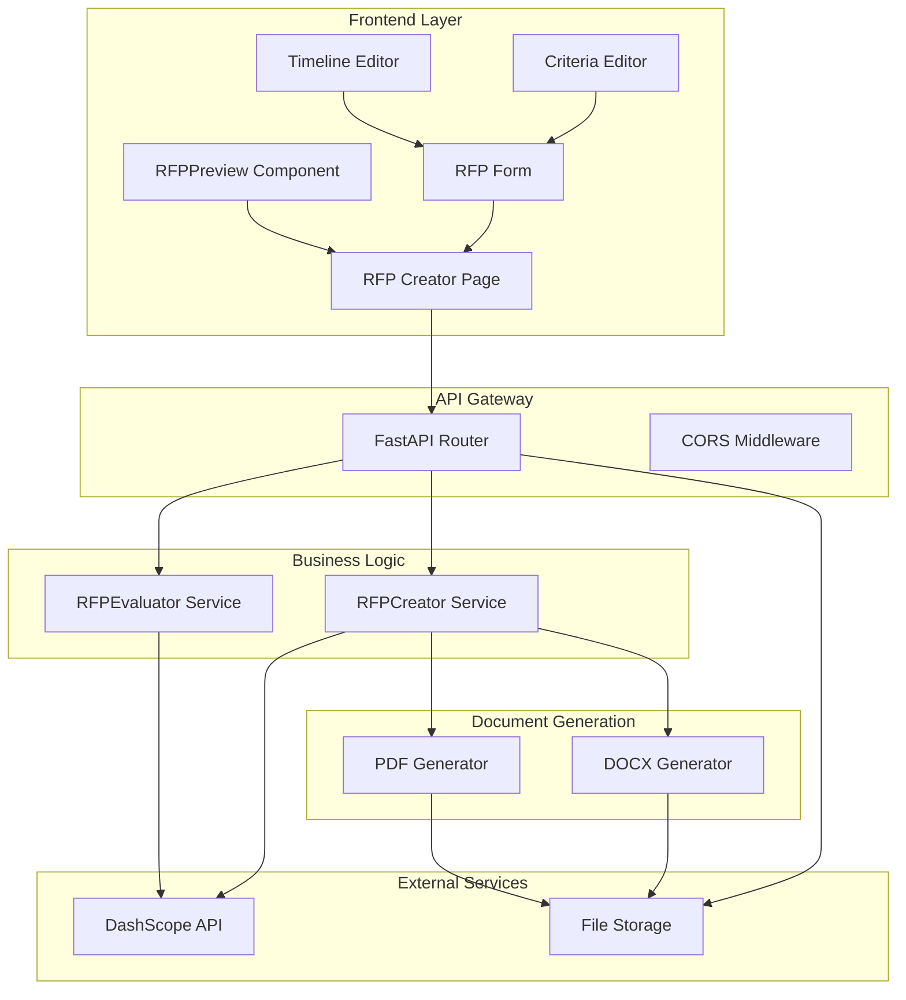

**Diagram sources**
- [main.py:20-44](file://backend/main.py#L20-L44)
- [rfp.py:15-38](file://backend/routers/rfp.py#L15-L38)
- [rfp_creator.py:67-123](file://backend/services/rfp_creator.py#L67-L123)

The architecture consists of four main layers:
- **Presentation Layer**: React-based frontend components for user interaction
- **API Layer**: FastAPI router handling HTTP requests and responses
- **Business Logic Layer**: RFPCreator service managing AI generation and document processing
- **Integration Layer**: External API connections and file storage systems

## Core Components

### RFPCreator Service

The RFPCreator class serves as the central orchestrator for RFP document generation, implementing sophisticated AI integration patterns:

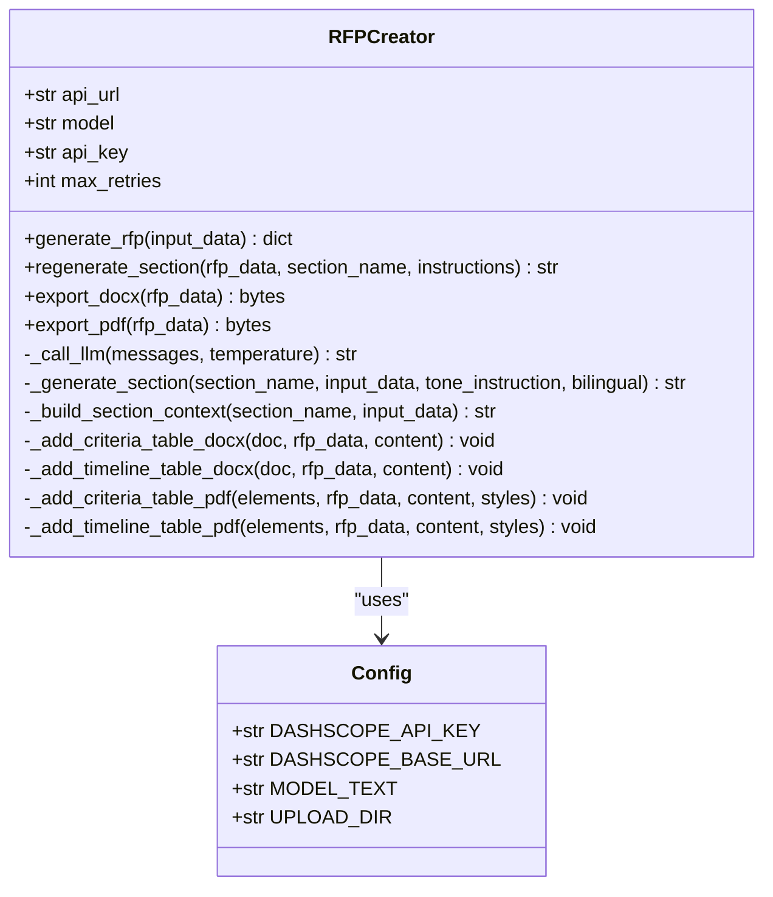

**Diagram sources**
- [rfp_creator.py:67-639](file://backend/services/rfp_creator.py#L67-L639)
- [config.py:4-21](file://backend/config.py#L4-L21)

### API Router

The FastAPI router provides comprehensive endpoints for RFP management:

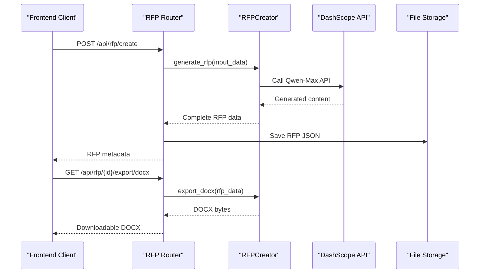

**Diagram sources**
- [rfp.py:97-131](file://backend/routers/rfp.py#L97-L131)
- [rfp_creator.py:297-381](file://backend/services/rfp_creator.py#L297-L381)

**Section sources**
- [rfp_creator.py:67-151](file://backend/services/rfp_creator.py#L67-L151)
- [rfp.py:15-131](file://backend/routers/rfp.py#L15-L131)

## RFPCreator Implementation

### Initialization and Configuration

The RFPCreator initializes with essential configuration parameters:

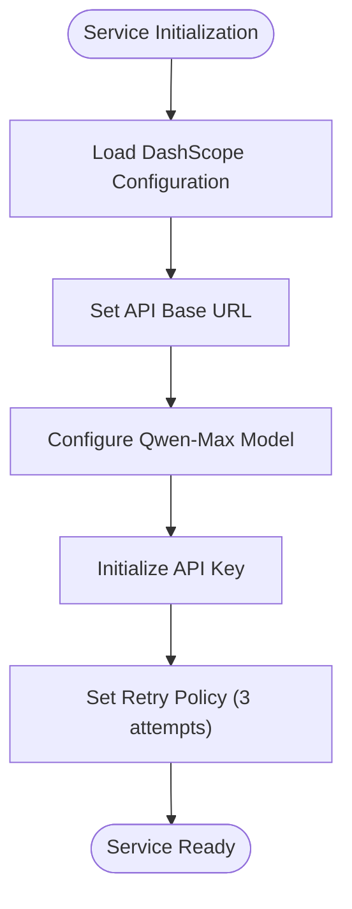

**Diagram sources**
- [rfp_creator.py:70-75](file://backend/services/rfp_creator.py#L70-L75)
- [config.py:5-9](file://backend/config.py#L5-L9)

### Core Generation Workflow

The generation process follows a systematic approach:

1. **Input Validation**: Validates and processes incoming RFP data
2. **Section Processing**: Iterates through predefined RFP sections
3. **Context Building**: Constructs section-specific context from input data
4. **AI Generation**: Calls DashScope API with tailored prompts
5. **Content Assembly**: Compiles generated content into final RFP structure

**Section sources**
- [rfp_creator.py:124-151](file://backend/services/rfp_creator.py#L124-L151)
- [rfp_creator.py:153-182](file://backend/services/rfp_creator.py#L153-L182)

## RFP Structure and Content Generation

The system generates comprehensive RFP documents following a standardized 10-section structure:

### Section Definitions

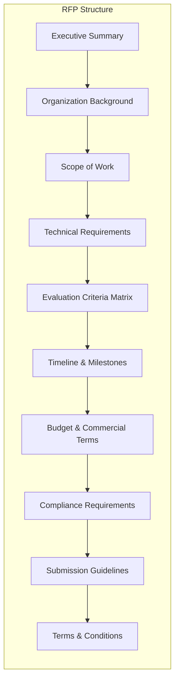

**Diagram sources**
- [rfp_creator.py:34-45](file://backend/services/rfp_creator.py#L34-L45)

### Section-Specific Context Building

Each section receives tailored context based on the project requirements:

| Section | Context Elements | Purpose |
|---------|------------------|---------|
| Executive Summary | Project overview, objectives, expected outcomes | Provides high-level understanding |
| Organization Background | Industry context, Dubai Media Incorporated role | Establishes organizational context |
| Scope of Work | Detailed project scope, deliverables | Defines project boundaries |
| Technical Requirements | Specific technical specifications | Communicates technical needs |
| Evaluation Criteria Matrix | Weighted criteria, descriptions | Establishes evaluation framework |
| Timeline & Milestones | Start/end dates, milestone schedule | Communicates project timeline |
| Budget & Commercial Terms | Budget range, payment terms | Clarifies financial arrangements |
| Compliance Requirements | Regulatory requirements, standards | Ensures legal compliance |
| Submission Guidelines | Submission procedures, requirements | Standardizes vendor process |
| Terms & Conditions | Legal terms, obligations | Establishes contractual framework |

**Section sources**
- [rfp_creator.py:184-255](file://backend/services/rfp_creator.py#L184-L255)

## Bilingual Content Generation

### Language Support Strategy

The system provides flexible bilingual support with three modes:

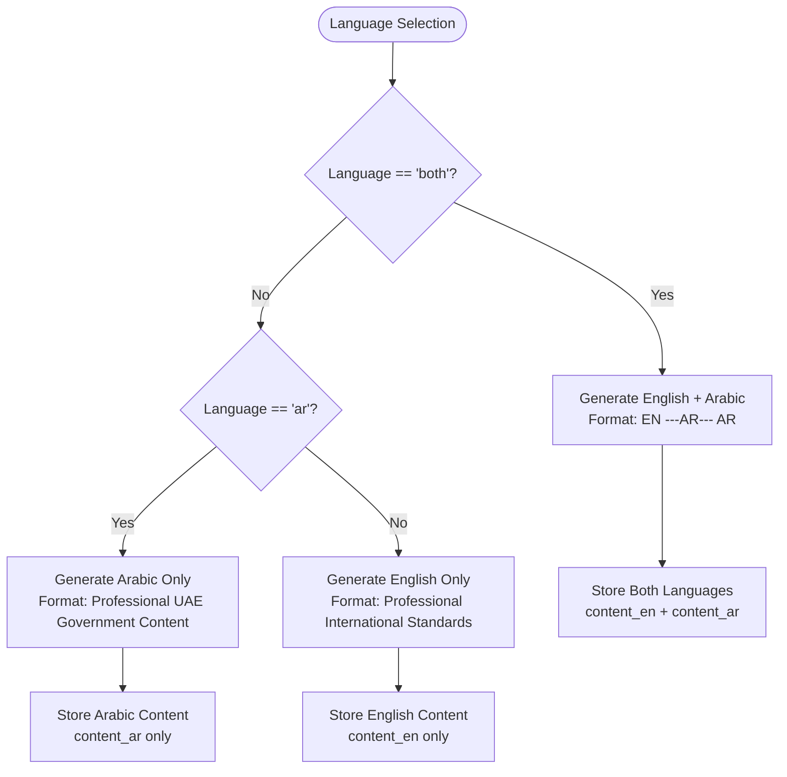

**Diagram sources**
- [rfp_creator.py:127-142](file://backend/services/rfp_creator.py#L127-L142)
- [rfp_creator.py:163-164](file://backend/services/rfp_creator.py#L163-L164)

### Content Generation Process

The bilingual generation follows a two-phase approach:

1. **Primary Generation**: AI generates content in the selected language
2. **Translation Integration**: Arabic content is integrated alongside English when applicable

**Section sources**
- [rfp_creator.py:61-64](file://backend/services/rfp_creator.py#L61-L64)
- [rfp_creator.py:127-142](file://backend/services/rfp_creator.py#L127-L142)

## AI Prompting Strategy

### System Prompt Design

The system prompt establishes professional standards and compliance requirements:

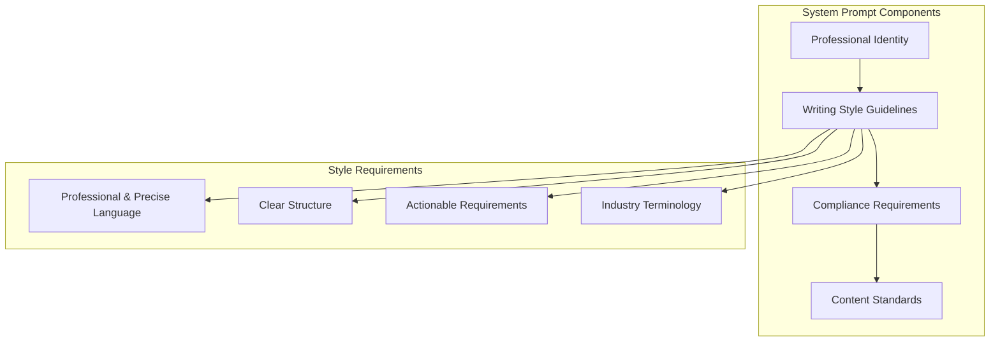

**Diagram sources**
- [rfp_creator.py:47-59](file://backend/services/rfp_creator.py#L47-L59)

### Section-Specific Prompt Engineering

Each section receives specialized prompting based on its requirements:

| Section | Prompt Strategy | Key Elements |
|---------|----------------|--------------|
| Executive Summary | High-level overview synthesis | Project goals, expected outcomes, strategic importance |
| Scope of Work | Detailed specification generation | Deliverables, boundaries, exclusions |
| Technical Requirements | Technical specification formatting | Standards compliance, technical specifications |
| Evaluation Criteria | Matrix construction | Weight distribution, scoring rationale |
| Timeline | Schedule formatting | Milestone alignment, resource planning |
| Budget | Financial specification | Cost breakdown, payment terms |
| Compliance | Regulatory adherence | Legal requirements, standards compliance |
| Submission Guidelines | Procedural specification | Documentation requirements, submission process |
| Terms & Conditions | Legal compliance | Contractual obligations, dispute resolution |

**Section sources**
- [rfp_creator.py:166-176](file://backend/services/rfp_creator.py#L166-L176)
- [rfp_creator.py:184-255](file://backend/services/rfp_creator.py#L184-L255)

## Asynchronous API Integration

### DashScope Integration Pattern

The system implements robust asynchronous communication with DashScope:

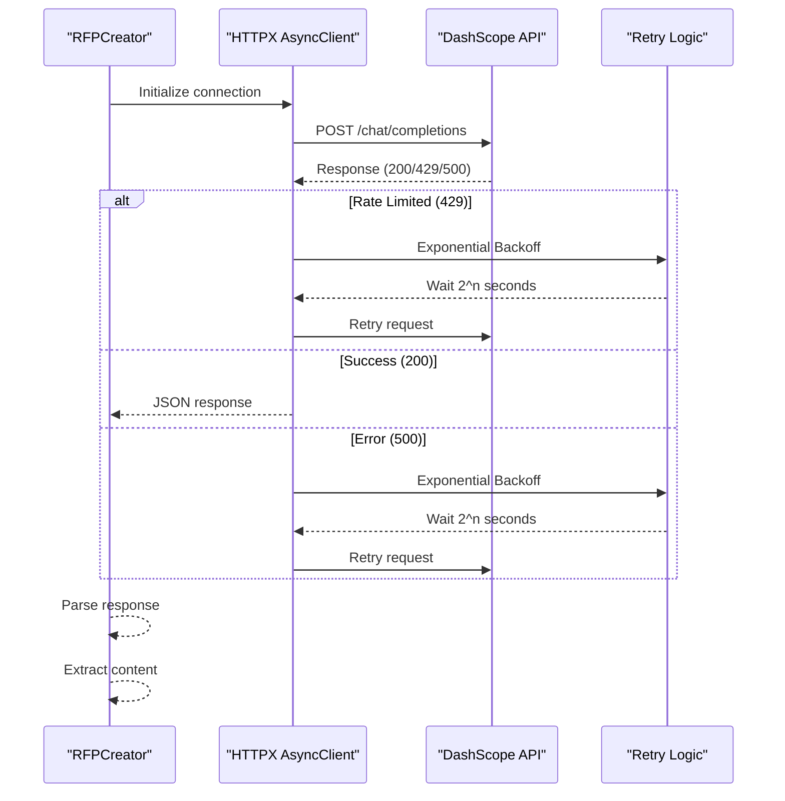

**Diagram sources**
- [rfp_creator.py:76-122](file://backend/services/rfp_creator.py#L76-L122)

### Retry Mechanism Implementation

The retry system implements exponential backoff with configurable limits:

| Attempt | Wait Time | Purpose |
|---------|-----------|---------|
| 1 | 2^0 = 1 second | Initial failure handling |
| 2 | 2^1 = 2 seconds | Second attempt with backoff |
| 3 | 2^2 = 4 seconds | Final retry attempt |
| 4 | 2^3 = 8 seconds | Maximum wait time reached |

**Section sources**
- [rfp_creator.py:94-122](file://backend/services/rfp_creator.py#L94-L122)

## Content Export and Formatting

### DOCX Generation

The system creates professionally formatted DOCX documents with:

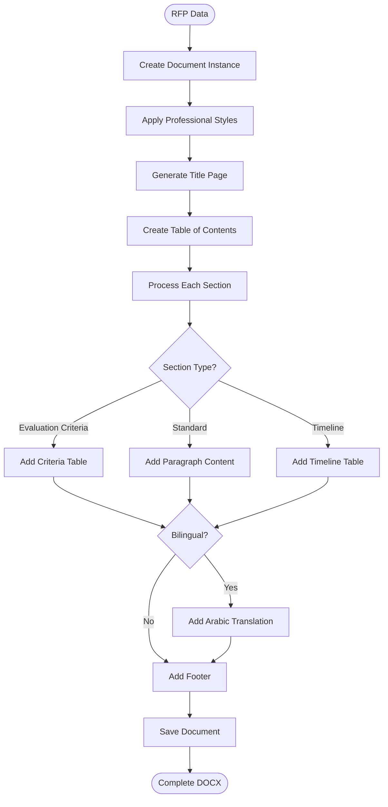

**Diagram sources**
- [rfp_creator.py:297-381](file://backend/services/rfp_creator.py#L297-L381)

### PDF Generation

PDF generation uses ReportLab for professional print-ready documents:

| Feature | Implementation | Purpose |
|---------|---------------|---------|
| Professional Typography | Calibri 11pt, Orange (#F97316) accents | Corporate branding |
| Document Structure | Hierarchical headings, numbered sections | Navigation and organization |
| Table Formatting | Custom styles, alternating row colors | Data presentation |
| Page Layout | A4 size, professional margins | Print standards |
| Footer Information | "Dubai Media Incorporated - Confidential" | Document security |

**Section sources**
- [rfp_creator.py:449-555](file://backend/services/rfp_creator.py#L449-L555)

## Frontend Integration

### User Interface Components

The frontend provides an intuitive interface for RFP creation:

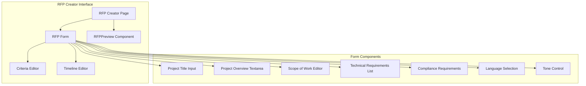

**Diagram sources**
- [page.tsx:96-155](file://frontend/src/app/rfp-creator/page.tsx#L96-L155)

### Real-time Interaction Features

The interface supports dynamic content manipulation:

| Feature | Implementation | User Benefit |
|---------|---------------|--------------|
| Live Preview | Real-time content updates | Immediate feedback |
| Section Regeneration | Individual section refresh | Content refinement |
| Language Switching | Dynamic content switching | Bilingual preview |
| Export Options | Multiple format support | Flexible distribution |
| Loading States | Progress indicators | User confidence |

**Section sources**
- [RFPForm.tsx:31-411](file://frontend/src/components/rfp/RFPForm.tsx#L31-L411)
- [RFPPreview.tsx:18-200](file://frontend/src/components/rfp/RFPPreview.tsx#L18-L200)

## Error Handling and Retry Mechanisms

### Comprehensive Error Management

The system implements layered error handling:

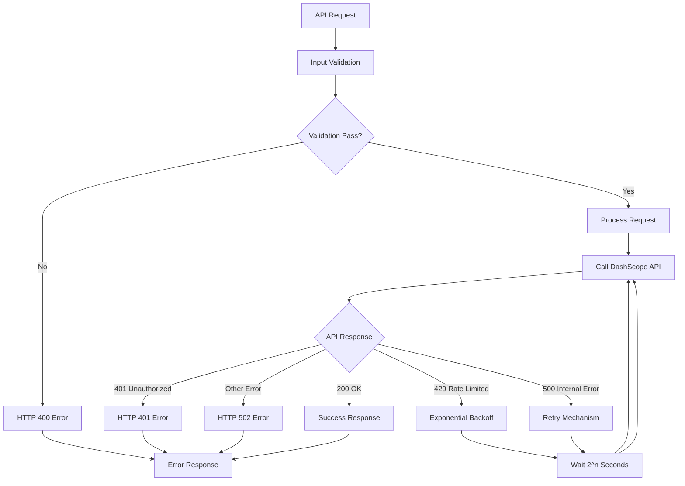

**Diagram sources**
- [rfp.py:114-120](file://backend/routers/rfp.py#L114-L120)
- [rfp_creator.py:94-122](file://backend/services/rfp_creator.py#L94-L122)

### Timeout Management

The system implements robust timeout handling:

| Component | Timeout Value | Purpose |
|----------|---------------|---------|
| Async HTTP Client | 120 seconds | API response handling |
| Retry Attempts | 3 attempts | Reliability assurance |
| Backoff Strategy | 2^n seconds | Rate limit compliance |
| Connection Pool | Automatic | Resource optimization |

**Section sources**
- [rfp_creator.py:97-122](file://backend/services/rfp_creator.py#L97-L122)
- [rfp.py:116-144](file://backend/routers/rfp.py#L116-L144)

## Performance Considerations

### Optimization Strategies

The system employs several performance optimization techniques:

1. **Asynchronous Processing**: Non-blocking API calls prevent UI blocking
2. **Content Caching**: Generated content stored for quick access
3. **Efficient Serialization**: JSON-based storage minimizes overhead
4. **Memory Management**: Streaming file generation prevents memory issues
5. **Connection Pooling**: Reused HTTP connections reduce latency

### Scalability Features

| Aspect | Implementation | Benefit |
|--------|---------------|---------|
| Concurrent Requests | Async I/O model | Handles multiple users |
| Document Generation | Streaming output | Reduces memory footprint |
| API Integration | Connection pooling | Improves throughput |
| Storage | Efficient JSON format | Optimizes disk usage |
| Caching | In-memory storage | Speeds up repeated access |

## Troubleshooting Guide

### Common Issues and Solutions

| Issue | Symptoms | Solution |
|-------|----------|----------|
| API Key Missing | ValueError during generation | Configure DASHSCOPE_API_KEY |
| Network Timeout | HTTP 504 errors | Check network connectivity |
| Rate Limiting | HTTP 429 responses | Implement backoff strategy |
| Invalid Input | HTTP 400 errors | Validate form data |
| File Generation Failure | PDF/DOCX export errors | Check storage permissions |

### Debugging Procedures

1. **API Connectivity**: Verify DashScope API accessibility
2. **Configuration Validation**: Confirm environment variables
3. **Network Diagnostics**: Test outbound connections
4. **Storage Permissions**: Ensure write access to upload directory
5. **Memory Monitoring**: Check system resources during generation

**Section sources**
- [config.py:5-9](file://backend/config.py#L5-L9)
- [rfp.py:116-119](file://backend/routers/rfp.py#L116-L119)

## Conclusion

The RFP Creation Service represents a comprehensive solution for AI-powered document generation, combining advanced language model integration with professional document formatting capabilities. The system successfully addresses the complex requirements of modern procurement processes while maintaining strict compliance with organizational standards and regulatory requirements.

Key achievements include:

- **Professional AI Integration**: Seamless DashScope API utilization with robust error handling
- **Bilingual Support**: Comprehensive English and Arabic content generation
- **Structured Content**: 10-section RFP framework with specialized context building
- **Flexible Export**: Professional DOCX and PDF document generation
- **User-Friendly Interface**: Intuitive frontend components with real-time interaction
- **Reliable Infrastructure**: Asynchronous processing with comprehensive error management

The service provides significant value for organizations requiring efficient, compliant, and professional RFP document creation, while maintaining the flexibility needed for customization and iterative improvement.