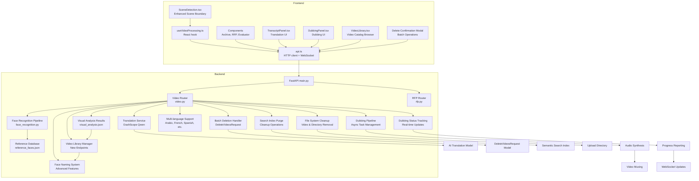
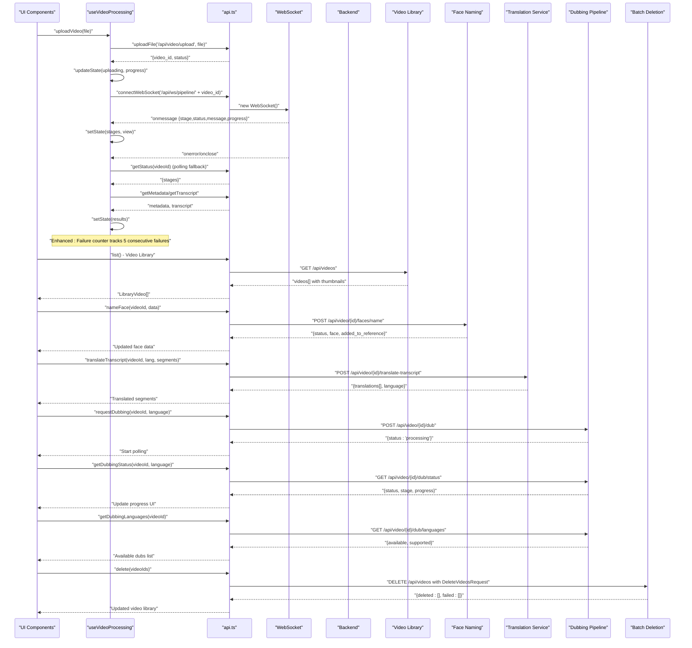
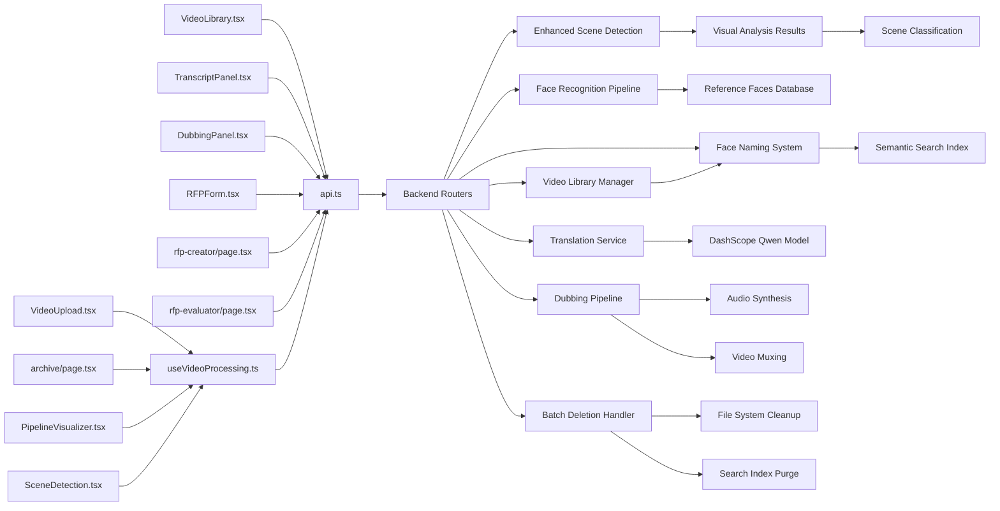

# API Integration & State Management

<cite>
**Referenced Files in This Document**
- [api.ts](file://frontend/src/lib/api.ts)
- [useVideoProcessing.ts](file://frontend/src/lib/useVideoProcessing.ts)
- [DubbingPanel.tsx](file://frontend/src/components/archive/DubbingPanel.tsx)
- [TranscriptPanel.tsx](file://frontend/src/components/archive/TranscriptPanel.tsx)
- [VideoUpload.tsx](file://frontend/src/components/archive/VideoUpload.tsx)
- [archive/page.tsx](file://frontend/src/app/archive/page.tsx)
- [PipelineVisualizer.tsx](file://frontend/src/components/archive/PipelineVisualizer.tsx)
- [SceneDetection.tsx](file://frontend/src/components/archive/SceneDetection.tsx)
- [VideoTimeline.tsx](file://frontend/src/components/archive/VideoTimeline.tsx)
- [VideoLibrary.tsx](file://frontend/src/components/archive/VideoLibrary.tsx)
- [rfp-creator/page.tsx](file://frontend/src/app/rfp-creator/page.tsx)
- [RFPForm.tsx](file://frontend/src/components/rfp/RFPForm.tsx)
- [rfp-evaluator/page.tsx](file://frontend/src/app/rfp-evaluator/page.tsx)
- [video.py](file://backend/routers/video.py)
- [dubbing.py](file://backend/pipeline/dubbing.py)
- [face_recognition.py](file://backend/pipeline/face_recognition.py)
- [reference_faces.json](file://backend/data/reference_faces.json)
- [visual_analysis.json](file://backend/uploads/19ab5a0f-7c15-4368-933e-c7e2f7ff0c86/visual_analysis.json)
- [results.json](file://backend/uploads/19ab5a0f-7c15-4368-933e-c7e2f7ff0c86/results.json)
- [rfp.py](file://backend/routers/rfp.py)
- [main.py](file://backend/main.py)
</cite>

## Update Summary
**Changes Made**
- Added comprehensive video library management API endpoints with `/api/videos` listing functionality
- Implemented advanced face naming system with `/api/video/{video_id}/faces/name` endpoint
- Enhanced TypeScript interfaces with `LibraryVideo` type and improved `SceneBoundary` properties
- Expanded error handling mechanisms with sophisticated failure counter for polling fallback
- Integrated thumbnail support throughout the scene detection workflow
- Added reference database integration for persistent face recognition across videos
- Added transcript translation functionality with `translateTranscript` method in API client
- Integrated real-time translation UI with language selection and segment mapping
- Backend translation service using DashScope Qwen model with multi-language support
- Extended API layer with dubbing functionality including `requestDubbing()`, `getDubbingStatus()`, and `getDubbingLanguages()` methods
- Integrated DubbingPanel component with WebSocket-based progress reporting and real-time status updates
- Backend dubbing pipeline with async task management, caching, and multi-language support
- **NEW** Extended frontend API client with new delete method that calls the backend's batch deletion endpoint, properly handling the request/response structure with typed TypeScript interfaces for the DeleteVideosRequest model

## Table of Contents
1. [Introduction](#introduction)
2. [Project Structure](#project-structure)
3. [Core Components](#core-components)
4. [Architecture Overview](#architecture-overview)
5. [Detailed Component Analysis](#detailed-component-analysis)
6. [Dependency Analysis](#dependency-analysis)
7. [Performance Considerations](#performance-considerations)
8. [Troubleshooting Guide](#troubleshooting-guide)
9. [Conclusion](#conclusion)

## Introduction
This document explains the frontend API integration layer and state management patterns used in the Dubai Media project. It covers the typed HTTP client library, WebSocket integration for real-time progress updates, custom React hooks that orchestrate video processing workflows, and the new dubbing functionality. It also documents API endpoint mapping, request/response schemas, error handling, and integration patterns with the backend services including AI-powered translation and dubbing capabilities.

## Project Structure
The frontend integrates with two primary backend domains:
- Video processing pipeline: upload, status tracking, metadata retrieval, transcripts, search, and WebSocket progress streaming
- RFP creation and evaluation: AI-powered proposal generation, regeneration, export, and vendor evaluation workflows
- Video library management: comprehensive video catalog browsing with thumbnails and metadata
- Face recognition system: intelligent person identification with reference database integration
- Transcript translation: AI-powered multilingual translation with real-time UI updates
- Video dubbing: multi-language audio dubbing with real-time progress tracking and playback
- **NEW** Video deletion: batch deletion of multiple videos with comprehensive cleanup and search index synchronization



**Diagram sources**
- [api.ts:1-344](file://frontend/src/lib/api.ts#L1-L344)
- [useVideoProcessing.ts:1-673](file://frontend/src/lib/useVideoProcessing.ts#L1-L673)
- [DubbingPanel.tsx:1-338](file://frontend/src/components/archive/DubbingPanel.tsx#L1-L338)
- [TranscriptPanel.tsx:1-305](file://frontend/src/components/archive/TranscriptPanel.tsx#L1-L305)
- [SceneDetection.tsx:1-217](file://frontend/src/components/archive/SceneDetection.tsx#L1-L217)
- [VideoLibrary.tsx:1-297](file://frontend/src/components/archive/VideoLibrary.tsx#L1-L297)
- [main.py:1-44](file://backend/main.py#L1-L44)
- [video.py:1-930](file://backend/routers/video.py#L1-L930)
- [dubbing.py:1-161](file://backend/pipeline/dubbing.py#L1-L161)
- [rfp.py:1-385](file://backend/routers/rfp.py#L1-L385)
- [face_recognition.py:1-660](file://backend/pipeline/face_recognition.py#L1-L660)

**Section sources**
- [api.ts:1-344](file://frontend/src/lib/api.ts#L1-L344)
- [useVideoProcessing.ts:1-673](file://frontend/src/lib/useVideoProcessing.ts#L1-L673)
- [DubbingPanel.tsx:1-338](file://frontend/src/components/archive/DubbingPanel.tsx#L1-L338)
- [TranscriptPanel.tsx:1-305](file://frontend/src/components/archive/TranscriptPanel.tsx#L1-L305)
- [main.py:1-44](file://backend/main.py#L1-L44)

## Core Components
This section documents the core API integration and state management building blocks.

### HTTP Client Library (api.ts)
The client provides:
- Base URL configuration from environment variables
- Typed fetch wrapper with URL parameter support
- File upload helper for multipart/form-data
- WebSocket connection helper with message parsing
- Strongly typed request/response interfaces for RFP and evaluation workflows
- Convenience API facade exposing endpoints for video and RFP operations
- Enhanced API facade with new video library, face naming, translation, and dubbing endpoints
- **Updated** New batch deletion functionality with comprehensive error handling and response typing

Key capabilities:
- HTTP request configuration: JSON content-type header, optional query parameters
- Error handling: parses JSON error bodies and throws descriptive errors
- Authentication: no explicit auth headers; relies on backend CORS policy
- Response processing: JSON parsing with typed return values
- WebSocket: connects to ws:// base URL derived from http base URL

**Updated** Enhanced API facade with new batch deletion capability:
- `api.video.delete(videoIds: string[])`: Batch deletes multiple videos with comprehensive cleanup
- Returns structured response with deleted IDs and failed deletions with error details
- Properly handles DeleteVideosRequest model with typed TypeScript interfaces
- Integrates seamlessly with existing video library management system

**Section sources**
- [api.ts:1-39](file://frontend/src/lib/api.ts#L1-L39)
- [api.ts:42-64](file://frontend/src/lib/api.ts#L42-L64)
- [api.ts:66-99](file://frontend/src/lib/api.ts#L66-L99)
- [api.ts:101-161](file://frontend/src/lib/api.ts#L101-L161)
- [api.ts:162-344](file://frontend/src/lib/api.ts#L162-L344)

### Real-Time WebSocket Integration
The WebSocket helper:
- Establishes connections to ws://host/ws/pipeline/{video_id}
- Parses incoming JSON messages into a standardized shape
- Invokes callbacks for messages, errors, and close events
- Provides a typed message interface for progress tracking

**Section sources**
- [api.ts:66-99](file://frontend/src/lib/api.ts#L66-L99)
- [api.ts:68-74](file://frontend/src/lib/api.ts#L68-L74)

### React Hook for Video Processing (useVideoProcessing.ts)
The hook manages:
- Upload lifecycle: progress simulation, file URL creation, error handling
- WebSocket pipeline updates: stage transitions, timing, completion detection
- Fallback polling: REST status polling when WebSocket fails with enhanced error handling
- Result fetching: metadata and transcript retrieval after pipeline completion
- Search: semantic search across processed videos
- Video timeline synchronization: current time tracking and seeking
- State cleanup: WebSocket closure and object URL revocation
- Enhanced person naming functionality with immediate UI updates and reference database integration

**Updated** Enhanced error handling with failure counter mechanism that automatically disconnects after 5 consecutive failures.

State structure:
- View modes: upload, processing, results
- Upload state: idle, uploading, uploaded, error
- Pipeline stages: ingestion, visual_analysis, audio_speech, face_recognition, metadata_structuring, search_index
- Metadata: faces, scenes, objects, landmarks, sensitive content indicators
- Transcript segments with speaker, timestamps, and optional language
- Search results: video_id, title, timestamp, description, score
- Error tracking and current playback time
- Failure counter for polling fallback mechanism

**Section sources**
- [useVideoProcessing.ts:88-104](file://frontend/src/lib/useVideoProcessing.ts#L88-L104)
- [useVideoProcessing.ts:106-113](file://frontend/src/lib/useVideoProcessing.ts#L106-L113)
- [useVideoProcessing.ts:122-673](file://frontend/src/lib/useVideoProcessing.ts#L122-L673)

## Architecture Overview
The frontend communicates with backend endpoints through a typed HTTP client and real-time WebSocket channels. The video processing workflow combines asynchronous uploads, background pipeline execution, and live progress updates. The new translation, dubbing, and deletion systems add comprehensive media management capabilities with real-time UI updates and progress tracking.



**Diagram sources**
- [useVideoProcessing.ts:162-211](file://frontend/src/lib/useVideoProcessing.ts#L162-211)
- [useVideoProcessing.ts:215-276](file://frontend/src/lib/useVideoProcessing.ts#L215-276)
- [useVideoProcessing.ts:313-348](file://frontend/src/lib/useVideoProcessing.ts#L313-348)
- [useVideoProcessing.ts:280-309](file://frontend/src/lib/useVideoProcessing.ts#L280-309)
- [api.ts:42-64](file://frontend/src/lib/api.ts#L42-L64)
- [api.ts:66-99](file://frontend/src/lib/api.ts#L66-L99)
- [api.ts:222-233](file://frontend/src/lib/api.ts#L222-L233)
- [api.ts:245-249](file://frontend/src/lib/api.ts#L245-L249)
- [api.ts:263-276](file://frontend/src/lib/api.ts#L263-L276)
- [DubbingPanel.tsx:82-121](file://frontend/src/components/archive/DubbingPanel.tsx#L82-121)
- [video.py:231-315](file://backend/routers/video.py#L231-L315)
- [video.py:223-274](file://backend/routers/video.py#L223-L274)
- [video.py:279-365](file://backend/routers/video.py#L279-365)
- [video.py:450-501](file://backend/routers/video.py#L450-L501)
- [video.py:504-523](file://backend/routers/video.py#L504-L523)
- [video.py:526-539](file://backend/routers/video.py#L526-L539)
- [video.py:655-696](file://backend/routers/video.py#L655-L696)

## Detailed Component Analysis

### API Endpoint Mapping and Schemas
The frontend exposes convenience methods grouped under an API facade. These map to backend endpoints and models.

**Updated** Enhanced API endpoint coverage with new batch deletion functionality:

- Video endpoints
  - POST /api/video/upload: uploads a file and starts background processing
  - GET /api/video/{video_id}/status: retrieves pipeline status
  - GET /api/video/{video_id}/metadata: retrieves structured metadata
  - GET /api/video/{video_id}/transcript: retrieves transcript segments
  - POST /api/video/{video_id}/translate-transcript: translates transcript segments to target language
  - GET /api/videos: lists all processed videos with thumbnails and metadata
  - DELETE /api/videos: batch deletes multiple videos with comprehensive cleanup
  - POST /api/video/{video_id}/faces/name: assigns names to detected persons
  - POST /api/video/{video_id}/dub: initiates dubbing process for specified language
  - GET /api/video/{video_id}/dub/status: polls dubbing status with real-time updates
  - GET /api/video/{video_id}/dub/languages: retrieves available and supported dubbing languages
  - GET /api/video/{video_id}/dubbed/{language}: streams dubbed video file
  - POST /api/search: performs semantic search across videos
  - WS /api/ws/pipeline/{video_id}: streams progress events

- RFP endpoints
  - POST /api/rfp/create: generates an RFP from structured input
  - POST /api/rfp/regenerate-section: regenerates a specific section
  - GET /api/rfp/{rfp_id}/export/docx: exports RFP as DOCX
  - GET /api/rfp/{rfp_id}/export/pdf: exports RFP as PDF
  - POST /api/rfp/evaluate: evaluates vendor proposals asynchronously
  - GET /api/rfp/evaluation/{eval_id}/status: polls evaluation progress
  - GET /api/rfp/evaluation/{eval_id}/results: retrieves evaluation results
  - GET /api/rfp/evaluation/{eval_id}/export/xlsx: exports evaluation as XLSX
  - GET /api/rfp/evaluation/{eval_id}/export/pdf: exports evaluation as PDF

**Updated** Enhanced typed request/response models:
- `LibraryVideo`: comprehensive video metadata including thumbnails, scene counts, and person lists
- `NameFaceRequest`: face identification with bilingual naming and role assignment
- `TranslateSegmentInput`: individual transcript segment with text and timing information
- `TranslateRequest`: translation request with target language and segments array
- `DeleteVideosRequest`: batch deletion request with video_ids array
- `DeleteResponse`: structured response with deleted IDs and failed deletions with error details
- `DubbingRequest`: dubbing initiation with target language specification
- `DubbingStatusResponse`: real-time dubbing status with stage and progress information
- `DubbingLanguagesResponse`: available and supported dubbing languages
- `RFPCreatePayload`: project metadata, evaluation criteria, timeline, budget, compliance, language, tone
- `RFPCreateResponse`: generated RFP identifier, title, status, sections, language
- `EvaluationResults`: vendor results, recommendation, follow-up questions
- `WSMessage`: standardized progress message for pipeline stages

**Section sources**
- [api.ts:164-344](file://frontend/src/lib/api.ts#L164-L344)
- [api.ts:101-161](file://frontend/src/lib/api.ts#L101-L161)
- [api.ts:68-74](file://frontend/src/lib/api.ts#L68-L74)
- [video.py:39-92](file://backend/routers/video.py#L39-L92)
- [video.py:124-138](file://backend/routers/video.py#L124-L138)
- [video.py:143-174](file://backend/routers/video.py#L143-L174)
- [video.py:179-195](file://backend/routers/video.py#L179-L195)
- [video.py:200-215](file://backend/routers/video.py#L200-L215)
- [video.py:223-274](file://backend/routers/video.py#L223-L274)
- [video.py:279-365](file://backend/routers/video.py#L279-365)
- [video.py:231-315](file://backend/routers/video.py#L231-L315)
- [video.py:220-314](file://backend/routers/video.py#L220-L314)
- [video.py:450-501](file://backend/routers/video.py#L450-L501)
- [video.py:504-523](file://backend/routers/video.py#L504-L523)
- [video.py:526-539](file://backend/routers/video.py#L526-L539)
- [video.py:542-558](file://backend/routers/video.py#L542-L558)
- [video.py:650-696](file://backend/routers/video.py#L650-L696)
- [rfp.py:97-130](file://backend/routers/rfp.py#L97-L130)
- [rfp.py:133-167](file://backend/routers/rfp.py#L133-L167)
- [rfp.py:243-311](file://backend/routers/rfp.py#L243-L311)
- [rfp.py:314-329](file://backend/routers/rfp.py#L314-L329)
- [rfp.py:332-346](file://backend/routers/rfp.py#L332-L346)

### NEW Batch Video Deletion System
Comprehensive batch deletion system with comprehensive cleanup and search index synchronization.

The batch deletion system provides:
- Multiple video deletion in single API call with atomic operation semantics
- Comprehensive file system cleanup including video files and output directories
- Automatic search index purging for deleted videos
- Structured error handling with detailed failure reporting
- Type-safe TypeScript interfaces for request/response validation
- Integration with existing video library management system

**DeleteVideosRequest Schema**:
```typescript
interface DeleteVideosRequest {
  video_ids: string[]; // Array of video IDs to delete
}

interface DeleteResponse {
  deleted: string[]; // Successfully deleted video IDs
  failed: Array<{
    video_id: string;
    error: string; // Detailed error message for each failed deletion
  }>;
}
```

**Frontend Implementation**:
The `api.video.delete()` method provides a clean interface for batch deletion:
- Accepts array of video IDs for bulk deletion
- Returns structured response with success and failure information
- Properly handles network errors and server-side exceptions
- Integrates seamlessly with existing error handling patterns

**Backend Batch Deletion Pipeline**:
The `/api/videos` DELETE endpoint orchestrates comprehensive cleanup:
- Validates input video IDs against existing files and directories
- Removes both video files (`{video_id}.mp4`) and output directories (`{video_id}/`)
- Implements proper error handling with continue-on-error semantics
- Automatically purges deleted videos from semantic search index
- Returns structured response with detailed success/failure information

**Error Handling Strategy**:
- Individual video deletions are isolated with try-catch blocks
- Failed deletions are tracked with specific error messages
- Successful deletions proceed even if some fail
- Search index cleanup is attempted for all successfully deleted videos
- Comprehensive logging for debugging and monitoring

**Section sources**
- [api.ts:245-249](file://frontend/src/lib/api.ts#L245-L249)
- [video.py:650-696](file://backend/routers/video.py#L650-L696)
- [VideoLibrary.tsx:100-116](file://frontend/src/components/archive/VideoLibrary.tsx#L100-L116)

### Enhanced Video Library Management System
Comprehensive video library management with advanced browsing, discovery, and deletion capabilities.

The video library system provides:
- Complete video catalog browsing with thumbnails and metadata
- Smart filtering by processing status and completion state
- Rich metadata display including scene counts, duration, and identified persons
- Thumbnail optimization with lazy loading and fallback handling
- **NEW** Batch deletion with confirmation modal and selective video removal
- Integration with the broader video processing pipeline

**LibraryVideo Interface**:
```typescript
export interface LibraryVideo {
  video_id: string;
  filename: string;
  title: string;
  status: string;
  progress: number;
  created_at: string;
  duration: number;
  thumbnail: string;
  scene_count: number;
  persons: string[];
  summary: string;
}
```

**Updated** Enhanced User Interface with Batch Operations:
- Selection mode toggle for multiple video operations
- Visual feedback with checkboxes and selection counters
- Confirmation modal before batch deletion
- Real-time UI updates after successful deletions
- Graceful error handling with user feedback

**Backend Implementation**:
The `/api/videos` endpoint scans the upload directory and aggregates metadata from multiple sources:
- Status information from `status.json`
- Ingestion details from `ingestion.json` 
- Visual analysis results from `visual_analysis.json`
- Face recognition data from `faces.json`
- Thumbnail files (`thumbnail.jpg`)
- IPTC metadata for headlines and descriptions

**Section sources**
- [api.ts:134-146](file://frontend/src/lib/api.ts#L134-L146)
- [api.ts:231-232](file://frontend/src/lib/api.ts#L231-L232)
- [api.ts:245-249](file://frontend/src/lib/api.ts#L245-L249)
- [video.py:223-274](file://backend/routers/video.py#L223-L274)
- [video.py:650-696](file://backend/routers/video.py#L650-L696)
- [VideoLibrary.tsx:1-297](file://frontend/src/components/archive/VideoLibrary.tsx#L1-L297)

### Advanced Face Naming System
Sophisticated face identification system with reference database integration and bilingual support.

The face naming system enables users to:
- Assign names to detected persons with English and Arabic support
- Add individuals to the reference database for future recognition
- Maintain role information and confidence scores
- Update search indexing immediately after naming
- Persist changes across video processing sessions

**NameFaceRequest Interface**:
```typescript
interface NameFaceRequest {
  face_index: number;
  name_en: str;
  name_ar: Optional[str] = None;
  role: Optional[str] = None;
  add_to_reference: bool = False;
}
```

**Backend Processing Flow**:
1. Validates face index and required fields
2. Updates face metadata with identification status
3. Synchronizes changes to both `faces.json` and `results.json`
4. Optionally adds to reference database with duplicate checking
5. Updates semantic search index for immediate discoverability
6. Returns confirmation with reference database update status

**Reference Database Integration**:
The system maintains a persistent reference database (`reference_faces.json`) containing:
- Unique identifiers for each known person
- Bilingual names (English and Arabic)
- Role descriptions and contextual information
- Physical descriptions for matching algorithms
- Automatic ID generation and duplicate prevention

**Section sources**
- [video.py:41-47](file://backend/routers/video.py#L41-L47)
- [video.py:279-365](file://backend/routers/video.py#L279-L365)
- [face_recognition.py:17-32](file://backend/pipeline/face_recognition.py#L17-L32)
- [useVideoProcessing.ts:555-590](file://frontend/src/lib/useVideoProcessing.ts#L555-L590)
- [api.ts:233-246](file://frontend/src/lib/api.ts#L233-L246)

### Transcript Translation System
AI-powered transcript translation with real-time UI updates and multi-language support.

The translation system provides:
- Support for Arabic, French, and Russian languages
- Real-time translation with progress indication
- Segment-by-segment translation with timing preservation
- Error handling with user-friendly feedback
- Language switching without full refetch
- RTL text support for Arabic translations

**Translation Request Schema**:
```typescript
interface TranslateSegmentInput {
  text: string;
  start_time: number;
  end_time: number;
}

interface TranslateRequest {
  language: string; // "ar", "fr", "ru"
  segments: List[TranslateSegmentInput];
}
```

**Frontend Implementation**:
The `TranscriptPanel` component integrates translation functionality:
- Language selection dropdown with supported languages
- Translation state management with Map-based segment storage
- Real-time UI updates during translation process
- Error handling with user feedback
- Automatic reset when video or transcript changes

**Backend Translation Service**:
The `/api/video/{video_id}/translate-transcript` endpoint uses DashScope Qwen model:
- Multi-segment processing with numbered markers
- Professional translation prompts with context preservation
- Retry logic with exponential backoff
- Marker-based parsing for accurate segment mapping
- Fallback to original text if translation fails

**Supported Languages**:
- Arabic (ar): العربية
- French (fr): Français  
- Russian (ru): Русский

**Section sources**
- [api.ts:222-233](file://frontend/src/lib/api.ts#L222-233)
- [TranscriptPanel.tsx:14-18](file://frontend/src/components/archive/TranscriptPanel.tsx#L14-18)
- [TranscriptPanel.tsx:82-121](file://frontend/src/components/archive/TranscriptPanel.tsx#L82-121)
- [video.py:51-60](file://backend/routers/video.py#L51-L60)
- [video.py:231-315](file://backend/routers/video.py#L231-L315)

### Enhanced SceneBoundary Interface and Data Transformation
The SceneBoundary interface includes enhanced properties for scene classification and thumbnail support.

The SceneBoundary interface definition:
```typescript
export interface SceneBoundary {
  timestamp: number;
  start?: number;
  end?: number;
  description: string;
  description_ar?: string;
  scene_type?: string;
  thumbnail?: string;
}
```

**Enhanced Scene Classification System**
The frontend supports comprehensive scene classification with the following scene types:
- interview: Formal interviews and conversations
- b-roll: Background footage and establishing shots  
- aerial: Drone/camera aerial views
- ceremony: Official ceremonies and events
- documentary: Historical or archival footage
- sport: Sports and athletic activities
- news-anchor: News broadcasting segments
- other: Default category for unrecognized scenes

**Improved Timestamp Parsing**
Enhanced timestamp parsing logic handles both "MM:SS" and "HH:MM:SS" formats:
```typescript
// Convert "MM:SS" or "HH:MM:SS" timestamp string to seconds
let ts = 0;
const rawTs = s.timestamp;
if (typeof rawTs === "number") {
  ts = rawTs;
} else if (typeof rawTs === "string") {
  const parts = rawTs.split(":").map(Number);
  if (parts.length === 3 && parts.every((p) => !isNaN(p))) {
    ts = parts[0] * 3600 + parts[1] * 60 + parts[2];
  } else if (parts.length === 2 && parts.every((p) => !isNaN(p))) {
    ts = parts[0] * 60 + parts[1];
  }
}
```

**Thumbnail Integration**
The backend provides thumbnail paths that are properly mapped to the frontend:
- Backend ingestion includes `thumbnail_path` field
- Thumbnail URLs are converted to accessible paths in the orchestrator
- Scene thumbnails are included in visual analysis results
- Frontend displays thumbnails alongside scene descriptions with lazy loading

**Section sources**
- [useVideoProcessing.ts:30-42](file://frontend/src/lib/useVideoProcessing.ts#L30-L42)
- [useVideoProcessing.ts:366-390](file://frontend/src/lib/useVideoProcessing.ts#L366-L390)
- [SceneDetection.tsx:1-217](file://frontend/src/components/archive/SceneDetection.tsx#L1-L217)
- [visual_analysis.json:1-75](file://backend/uploads/19ab5a0f-7c15-4368-933e-c7e2f7ff0c86/visual_analysis.json#L1-L75)
- [results.json:1-84](file://backend/uploads/19ab5a0f-7c15-4368-933e-c7e2f7ff0c86/results.json#L1-L84)

### Enhanced Error Handling with Failure Counter Mechanism
The polling fallback mechanism includes a sophisticated failure counter that automatically disconnects after 5 consecutive failures.

The failure counter implementation:
```typescript
const pollFailCountRef = useRef<number>(0);

const startPollingFallback = useCallback(
  (videoId: string) => {
    // Clear any existing interval (could be from a different video)
    if (pollIntervalRef.current) {
      clearInterval(pollIntervalRef.current);
      pollIntervalRef.current = null;
    }

    pollFailCountRef.current = 0;

    pollIntervalRef.current = setInterval(async () => {
      try {
        const statusRes = (await api.video.getStatus(videoId)) as {
          stages?: Record<string, string>;
        };
        if (statusRes && statusRes.stages) {
          // Reset failure counter on success
          pollFailCountRef.current = 0;
          // ... success handling
        }
      } catch (err) {
        pollFailCountRef.current += 1;
        console.warn(`[Polling] Status fetch failed (attempt ${pollFailCountRef.current}):`, err);

        if (pollFailCountRef.current >= 5) {
          // Stop polling after 5 consecutive failures
          if (pollIntervalRef.current) {
            clearInterval(pollIntervalRef.current);
            pollIntervalRef.current = null;
          }
          setState((prev) => ({
            ...prev,
            error: "Lost connection to pipeline. Please check if the server is running and try again.",
          }));
        }
      }
    }, 3000);
  },
  [fetchResults]
);
```

**Enhanced Error Recovery Features**:
- Automatic failure counting with exponential backoff consideration
- Graceful degradation to manual refresh after 5 failures
- User-friendly error messaging with clear recovery instructions
- Prevention of resource exhaustion from continuous polling attempts

**Section sources**
- [useVideoProcessing.ts:144](file://frontend/src/lib/useVideoProcessing.ts#L144)
- [useVideoProcessing.ts:460-525](file://frontend/src/lib/useVideoProcessing.ts#L460-L525)

### Data Transformation Patterns
Comprehensive frontend data transformation layer implementation with detailed mapping logic for backend responses to VideoMetadata interface, including sophisticated face recognition data processing and enhanced scene boundary handling.

The data transformation layer in useVideoProcessing.ts implements sophisticated mapping logic to convert backend response structures into frontend-friendly interfaces, with particular emphasis on enhanced scene boundary processing.

#### Backend Response Structure to Frontend Interface Mapping
The backend returns metadata in a hierarchical structure with enhanced scene detection capabilities:
```json
{
  "video_id": "string",
  "ingestion": {
    "duration": number,
    "thumbnail_path": "string"
  },
  "visual_analysis": {
    "scenes": [
      {
        "timestamp": "string",
        "description_en": "string",
        "scene_type": "string",
        "thumbnail": "string"
      }
    ],
    "objects": [...],
    "landmarks": [...],
    "sensitive_content": [...],
    "faces": [...],
    "era_estimate": {
      "decade": "string"
    }
  },
  "metadata": {
    "title": "string",
    "topic": "string",
    "sentiment_tags": ["string"],
    "ebucore_xml": "string",
    "iptc_video_metadata": {}
  },
  "faces": ["detected_face_objects"]
}
```

#### Enhanced Scene Boundary Transformation
The scene boundary transformation includes comprehensive scene classification and thumbnail integration:

```typescript
const metadata: VideoMetadata = {
  video_id: videoId,
  duration: (ingestion.duration as number) || 0,
  title: (metaBlock.title as string) || undefined,
  topic: (metaBlock.topic as string) || undefined,
  sentiment: ((metaBlock.sentiment_tags as string[]) || []).join(", ") || undefined,
  era: ((visualAnalysis.era_estimate as Record<string, unknown>)?.decade as string) || undefined,
  scenes: ((visualAnalysis.scenes || []) as Array<Record<string, unknown>>).map((s) => {
    // Convert "MM:SS" or "HH:MM:SS" timestamp string to seconds
    let ts = 0;
    const rawTs = s.timestamp;
    if (typeof rawTs === "number") {
      ts = rawTs;
    } else if (typeof rawTs === "string") {
      const parts = rawTs.split(":").map(Number);
      if (parts.length === 3 && parts.every((p) => !isNaN(p))) {
        ts = parts[0] * 3600 + parts[1] * 60 + parts[2];
      } else if (parts.length === 2 && parts.every((p) => !isNaN(p))) {
        ts = parts[0] * 60 + parts[1];
      }
    }
    return {
      timestamp: ts,
      description: (s.description_en as string) || (s.description as string) || "",
      scene_type: (s.scene_type as string) || "other",
      thumbnail: (s.thumbnail as string) || undefined,
    } as SceneBoundary;
  }),
  // ... other metadata fields
};
```

#### Enhanced Face Recognition Data Transformation
The face recognition transformation maintains its sophisticated fallback mechanisms:

1. **Dual Source Priority**: Prioritizes faces from top-level faces array over visual analysis faces
2. **Intelligent Naming**: Automatically assigns names to unnamed persons using sequential numbering
3. **Appearance Synthesis**: Creates synthetic appearance intervals from timestamps when direct data is unavailable
4. **OCR Fallback**: Implements OCR-based naming fallback for unidentified faces
5. **Automatic Color Assignment**: Assigns deterministic colors from predefined palette

#### Transformation Implementation Details
The `fetchResults` function orchestrates the complete transformation with enhanced scene processing:

```typescript
// Enhanced scene transformation with classification and thumbnails
const scenes = ((visualAnalysis.scenes || []) as Array<Record<string, unknown>>).map((s) => {
  // Convert timestamp with enhanced parsing
  let ts = 0;
  const rawTs = s.timestamp;
  if (typeof rawTs === "number") {
    ts = rawTs;
  } else if (typeof rawTs === "string") {
    const parts = rawTs.split(":").map(Number);
    if (parts.length === 3 && parts.every((p) => !isNaN(p))) {
      ts = parts[0] * 3600 + parts[1] * 60 + parts[2];
    } else if (parts.length === 2 && parts.every((p) => !isNaN(p))) {
      ts = parts[0] * 60 + parts[1];
    }
  }
  
  return {
    timestamp: ts,
    description: (s.description_en as string) || (s.description as string) || "",
    scene_type: (s.scene_type as string) || "other",
    thumbnail: (s.thumbnail as string) || undefined,
  } as SceneBoundary;
});
```

#### Automatic Face Color Assignment Strategy
Deterministic color assignment ensures consistent visualization:
- Uses predefined color palette: `["#3B82F6", "#10B981", "#8B5CF6", "#F59E0B", "#EF4444", "#06B6D4", "#EC4899", "#14B8A6"]`
- Applies modulo arithmetic for cyclic color assignment
- Preserves existing face colors when present in backend data

#### Transcript Transformation
Simple but effective transformation:
- Extracts segments array from backend response
- Ensures proper typing with TranscriptSegment interface
- Handles missing segments gracefully with empty array fallback

**Section sources**
- [useVideoProcessing.ts:304-456](file://frontend/src/lib/useVideoProcessing.ts#L304-L456)
- [useVideoProcessing.ts:366-390](file://frontend/src/lib/useVideoProcessing.ts#L366-L390)
- [useVideoProcessing.ts:409-438](file://frontend/src/lib/useVideoProcessing.ts#L409-L438)
- [useVideoProcessing.ts:128-131](file://frontend/src/lib/useVideoProcessing.ts#L128-L131)
- [face_recognition.py:185-200](file://backend/pipeline/face_recognition.py#L185-200)
- [reference_faces.json:1-101](file://backend/data/reference_faces.json#L1-L101)
- [visual_analysis.json:1-75](file://backend/uploads/19ab5a0f-7c15-4368-933e-c7e2f7ff0c86/visual_analysis.json#L1-L75)

### Async Operations, Loading States, Error Boundaries, and Retry Mechanisms
- Upload: sets uploading state, simulates progress, handles errors, and transitions to processing view upon success
- WebSocket: receives real-time updates; on error or close, falls back to REST polling with enhanced error handling
- Polling: periodic status checks until all stages complete; triggers result fetch when done with failure counter mechanism
- Search: debounced UI-triggered search with isSearching flag and empty results on failure
- Evaluation: background submission with periodic status polling; clears intervals on cleanup and error
- Video library loading: efficient thumbnail loading with skeleton placeholders and error handling
- **NEW** Batch deletion: confirmation modal with optimistic UI updates and rollback on failure
- Face naming: optimistic UI updates with immediate feedback and rollback on failure
- Translation: real-time translation with progress indication and error handling
- Dubbing: background dubbing with progress polling, duplicate prevention, and inline playback

**Updated** Enhanced batch deletion with confirmation modal, loading states, and comprehensive error handling.

**Section sources**
- [useVideoProcessing.ts:162-211](file://frontend/src/lib/useVideoProcessing.ts#L162-211)
- [useVideoProcessing.ts:215-276](file://frontend/src/lib/useVideoProcessing.ts#L215-276)
- [useVideoProcessing.ts:313-348](file://frontend/src/lib/useVideoProcessing.ts#L313-348)
- [useVideoProcessing.ts:352-368](file://frontend/src/lib/useVideoProcessing.ts#L352-368)
- [useVideoProcessing.ts:460-525](file://frontend/src/lib/useVideoProcessing.ts#L460-L525)
- [useVideoProcessing.ts:555-590](file://frontend/src/lib/useVideoProcessing.ts#L555-L590)
- [TranscriptPanel.tsx:82-121](file://frontend/src/components/archive/TranscriptPanel.tsx#L82-L121)
- [DubbingPanel.tsx:75-112](file://frontend/src/components/archive/DubbingPanel.tsx#L75-L112)
- [VideoLibrary.tsx:34-50](file://frontend/src/components/archive/VideoLibrary.tsx#L34-L50)
- [VideoLibrary.tsx:100-116](file://frontend/src/components/archive/VideoLibrary.tsx#L100-L116)
- [rfp-evaluator/page.tsx:27-98](file://frontend/src/app/rfp-evaluator/page.tsx#L27-L98)

### Caching Strategies, Optimistic Updates, and Offline Handling
- Caching: no explicit client-side cache; relies on backend static file serving for exports
- Optimistic updates: pipeline stage status updates are applied immediately upon receiving WebSocket messages
- Offline handling: WebSocket fallback to REST polling with enhanced failure counter; search results cleared on error; evaluation polling stops on error and resets UI
- Video library caching: browser-native image caching for thumbnails with lazy loading
- **NEW** Batch deletion: immediate UI updates with optimistic removal and rollback on failure
- Face naming: immediate UI updates without full refetch, maintaining user experience during network operations
- Translation: Map-based segment storage prevents redundant translation requests
- Dubbing: backend caching for already-dubbed content, duplicate task prevention, and progress persistence

**Updated** Enhanced offline handling with automatic disconnection after 5 consecutive failures and optimistic batch deletion updates.

**Section sources**
- [useVideoProcessing.ts:223-262](file://frontend/src/lib/useVideoProcessing.ts#L223-L262)
- [useVideoProcessing.ts:263-271](file://frontend/src/lib/useVideoProcessing.ts#L263-L271)
- [useVideoProcessing.ts:343-348](file://frontend/src/lib/useVideoProcessing.ts#L343-L348)
- [useVideoProcessing.ts:365-368](file://frontend/src/lib/useVideoProcessing.ts#L365-L368)
- [useVideoProcessing.ts:506-521](file://frontend/src/lib/useVideoProcessing.ts#L506-L521)
- [useVideoProcessing.ts:568-585](file://frontend/src/lib/useVideoProcessing.ts#L568-L585)
- [TranscriptPanel.tsx:67-80](file://frontend/src/components/archive/TranscriptPanel.tsx#L67-L80)
- [video.py:476-485](file://backend/routers/video.py#L476-L485)
- [VideoLibrary.tsx:100-116](file://frontend/src/components/archive/VideoLibrary.tsx#L100-L116)

### Integration with Backend APIs and Real-Time Data Synchronization
- Backend CORS: configured to allow cross-origin requests
- Static file serving: uploads served via mounted static directory
- Pipeline orchestration: background tasks manage pipeline stages and broadcast progress via WebSocket
- Evaluation workflow: background evaluation updates status and results persisted to disk
- Face recognition pipeline: sophisticated AI-powered face matching with reference database integration
- Scene detection: enhanced visual analysis with scene classification and thumbnail generation
- Video library management: comprehensive catalog browsing with metadata aggregation
- **NEW** Batch deletion: comprehensive file system cleanup with search index synchronization
- Face naming system: real-time reference database updates with search index synchronization
- Translation service: AI-powered multilingual translation with DashScope Qwen model integration
- Dubbing pipeline: async task management with progress tracking and multi-language support

**Updated** Enhanced integration with comprehensive batch deletion capabilities and search index synchronization.

**Section sources**
- [main.py:27-35](file://backend/main.py#L27-L35)
- [main.py:35-44](file://backend/main.py#L35-L44)
- [video.py:95-120](file://backend/routers/video.py#L95-L120)
- [video.py:218-314](file://backend/routers/video.py#L218-L314)
- [video.py:223-274](file://backend/routers/video.py#L223-L274)
- [video.py:279-365](file://backend/routers/video.py#L279-L365)
- [video.py:231-315](file://backend/routers/video.py#L231-L315)
- [video.py:450-501](file://backend/routers/video.py#L450-L501)
- [video.py:504-523](file://backend/routers/video.py#L504-L523)
- [video.py:526-539](file://backend/routers/video.py#L526-L539)
- [video.py:650-696](file://backend/routers/video.py#L650-L696)
- [rfp.py:219-238](file://backend/routers/rfp.py#L219-L238)
- [face_recognition.py:124-188](file://backend/pipeline/face_recognition.py#L124-L188)

## Dependency Analysis
The frontend components depend on the API client and the video processing hook. The hook encapsulates all integration logic, while components remain presentation-focused.



**Diagram sources**
- [VideoUpload.tsx:1-221](file://frontend/src/components/archive/VideoUpload.tsx#L1-L221)
- [archive/page.tsx:1-214](file://frontend/src/app/archive/page.tsx#L1-L214)
- [PipelineVisualizer.tsx:1-181](file://frontend/src/components/archive/PipelineVisualizer.tsx#L1-L181)
- [SceneDetection.tsx:1-217](file://frontend/src/components/archive/SceneDetection.tsx#L1-L217)
- [VideoLibrary.tsx:1-297](file://frontend/src/components/archive/VideoLibrary.tsx#L1-L297)
- [TranscriptPanel.tsx:1-305](file://frontend/src/components/archive/TranscriptPanel.tsx#L1-L305)
- [DubbingPanel.tsx:1-338](file://frontend/src/components/archive/DubbingPanel.tsx#L1-L338)
- [RFPForm.tsx:1-411](file://frontend/src/components/rfp/RFPForm.tsx#L1-L411)
- [rfp-creator/page.tsx:1-159](file://frontend/src/app/rfp-creator/page.tsx#L1-L159)
- [rfp-evaluator/page.tsx:1-178](file://frontend/src/app/rfp-evaluator/page.tsx#L1-L178)
- [useVideoProcessing.ts:1-673](file://frontend/src/lib/useVideoProcessing.ts#L1-L673)
- [api.ts:1-344](file://frontend/src/lib/api.ts#L1-L344)
- [video.py:1-930](file://backend/routers/video.py#L1-L930)
- [rfp.py:1-385](file://backend/routers/rfp.py#L1-L385)
- [face_recognition.py:1-660](file://backend/pipeline/face_recognition.py#L1-L660)
- [dubbing.py:1-161](file://backend/pipeline/dubbing.py#L1-L161)

**Section sources**
- [useVideoProcessing.ts:122-673](file://frontend/src/lib/useVideoProcessing.ts#L122-L673)
- [api.ts:162-344](file://frontend/src/lib/api.ts#L162-L344)

## Performance Considerations
- WebSocket vs polling: WebSocket provides real-time updates; polling serves as a robust fallback with enhanced failure handling
- Parallelization: metadata and transcript fetches occur concurrently after pipeline completion
- UI responsiveness: progress simulation during upload prevents blocking; skeleton loaders for RFP preview
- Cleanup: WebSocket and object URLs are released on component unmount to prevent memory leaks
- Data transformation optimization: efficient mapping reduces computational overhead during state updates
- Face recognition optimization: intelligent fallbacks reduce redundant processing for unnamed persons
- Scene classification optimization: enhanced timestamp parsing minimizes conversion overhead
- Thumbnail loading: lazy loading of scene thumbnails improves initial render performance
- Video library optimization: efficient thumbnail loading with browser caching and skeleton placeholders
- **NEW** Batch deletion optimization: atomic operations with minimal UI re-renders and optimistic updates
- Face naming optimization: immediate UI updates without full refetch, reducing network overhead
- Reference database optimization: duplicate checking prevents redundant entries and maintains database integrity
- Translation optimization: Map-based segment storage prevents redundant translation requests
- Translation batching: single API call for all segments reduces network overhead
- Translation retry: exponential backoff prevents overwhelming AI service
- Dubbing optimization: async task management prevents duplicate processing
- Dubbing caching: backend caching for already-dubbed content reduces redundant processing
- Dubbing progress: simulated progress bar provides responsive UI feedback during long-running operations

## Troubleshooting Guide
Common issues and resolutions:
- Upload failures: verify backend upload directory permissions and network connectivity; inspect error messages propagated from API
- WebSocket errors: confirm backend CORS configuration and that the WebSocket endpoint is reachable; fallback polling ensures continued progress tracking with enhanced failure detection
- Evaluation timeouts: adjust polling interval and handle transient errors gracefully; ensure sufficient vendor files and valid JSON inputs
- Search failures: validate query length and backend search index availability; clear search results on error
- Export failures: confirm backend export endpoints and file system permissions
- Data transformation errors: verify backend response structure consistency; check for missing fields in transformed data
- Face recognition failures: verify reference database availability and API key configuration; check OCR fallback mechanisms
- Scene classification failures: verify scene_type values in backend visual analysis results; check timestamp format consistency
- Thumbnail loading failures: verify thumbnail paths in backend ingestion results; check file accessibility
- Polling failures: monitor failure counter; automatic disconnection occurs after 5 consecutive failures
- Video library loading failures: verify upload directory structure and file permissions; check thumbnail file existence
- **NEW** Batch deletion failures: verify video ID validity and file system permissions; check for concurrent access conflicts
- **NEW** Deletion confirmation: ensure confirmation modal displays correctly and user interactions work as expected
- Face naming failures: validate face index bounds and required fields; check reference database write permissions
- Reference database corruption: verify JSON file integrity and backup restoration procedures
- Translation failures: verify DASHSCOPE_API_KEY configuration; check network connectivity to DashScope service; validate language codes and segment formatting
- Translation timeout: increase timeout settings if dealing with large transcripts; check AI service availability
- Dubbing failures: verify transcript availability before dubbing; check supported language codes; monitor async task status
- Dubbing progress: ensure polling interval is appropriate for dubbing duration; check backend task queue status
- Dubbing playback: verify dubbed video file existence and accessibility; check media type configuration

**Updated** Enhanced troubleshooting guidance for new batch deletion functionality, confirmation modal, and comprehensive error handling.

**Section sources**
- [useVideoProcessing.ts:202-208](file://frontend/src/lib/useVideoProcessing.ts#L202-L208)
- [useVideoProcessing.ts:263-271](file://frontend/src/lib/useVideoProcessing.ts#L263-L271)
- [useVideoProcessing.ts:343-348](file://frontend/src/lib/useVideoProcessing.ts#L343-L348)
- [useVideoProcessing.ts:506-521](file://frontend/src/lib/useVideoProcessing.ts#L506-L521)
- [useVideoProcessing.ts:555-590](file://frontend/src/lib/useVideoProcessing.ts#L555-L590)
- [TranscriptPanel.tsx:109-118](file://frontend/src/components/archive/TranscriptPanel.tsx#L109-L118)
- [DubbingPanel.tsx:105-108](file://frontend/src/components/archive/DubbingPanel.tsx#L105-L108)
- [VideoLibrary.tsx:34-50](file://frontend/src/components/archive/VideoLibrary.tsx#L34-L50)
- [VideoLibrary.tsx:100-116](file://frontend/src/components/archive/VideoLibrary.tsx#L100-L116)
- [video.py:288-296](file://backend/routers/video.py#L288-L296)
- [video.py:321-344](file://backend/routers/video.py#L321-L344)
- [video.py:248-253](file://backend/routers/video.py#L248-L253)
- [video.py:463-474](file://backend/routers/video.py#L463-L474)
- [video.py:504-523](file://backend/routers/video.py#L504-L523)
- [video.py:650-696](file://backend/routers/video.py#L650-L696)
- [rfp-evaluator/page.tsx:86-98](file://frontend/src/app/rfp-evaluator/page.tsx#L86-L98)

## Conclusion
The frontend API integration layer provides a clean, typed interface to backend services with robust real-time capabilities. The useVideoProcessing hook centralizes state management, error handling, and integration logic, enabling responsive UIs for video processing and RFP workflows. The comprehensive data transformation layer ensures seamless mapping between backend response structures and frontend interface requirements, with particular emphasis on sophisticated face recognition data processing including intelligent fallbacks, automatic numbering for unnamed persons, and appearance synthesis. 

The enhanced video processing capabilities include comprehensive scene classification with scene_type categorization, thumbnail integration for visual scene representation, and sophisticated timestamp parsing supporting both MM:SS and HH:MM:SS formats. The failure counter mechanism provides robust error handling with automatic disconnection after 5 consecutive failures, ensuring graceful degradation and user experience preservation. The SceneDetection component showcases these enhancements with color-coded scene types and thumbnail previews, creating a rich visual experience for video navigation and analysis.

The video library management system provides comprehensive catalog browsing with thumbnails, metadata aggregation, smart filtering capabilities, and **NEW** batch deletion functionality with confirmation modals and optimistic UI updates. The advanced face naming system enables intelligent person identification with reference database integration, bilingual support, and immediate search index updates. The design balances optimistic updates, fallback mechanisms, and clear separation of concerns between presentation and data access, while the enhanced scene detection pipeline provides reliable scene classification with robust error handling and comprehensive thumbnail support. The integrated reference database system ensures persistent person recognition across video processing sessions, creating a scalable foundation for large-scale media analysis workflows.

The transcript translation system adds powerful multilingual capabilities with real-time UI updates, supporting Arabic, French, and Russian languages through AI-powered translation. The system integrates seamlessly with the existing video processing pipeline, providing instant translation feedback while maintaining the original transcript structure and timing information. The translation service leverages DashScope Qwen models with professional translation prompts, retry logic, and marker-based segment parsing to ensure accurate and reliable translations. This enhancement significantly expands the accessibility and internationalization capabilities of the Dubai Media platform, making it suitable for diverse linguistic audiences and global media workflows.

The comprehensive video dubbing system represents a major enhancement to the platform's internationalization capabilities. With support for eight languages including Arabic, English, French, Spanish, German, Russian, Hindi, and Chinese, the dubbing system provides professional-grade audio localization. The system features sophisticated background task management with duplicate prevention, caching for already-dubbed content, and real-time progress tracking through polling mechanisms. The DubbingPanel component offers an intuitive user interface with language selection, progress indication, inline playback, and download capabilities. The backend implementation leverages async task management, proper garbage collection prevention, and comprehensive error handling to ensure reliable operation. This enhancement transforms the Dubai Media platform into a truly global media solution capable of serving diverse international audiences with localized audio content.

**NEW** The batch deletion system completes the comprehensive media management toolkit by providing efficient bulk operations for video cleanup. With support for deleting multiple videos in a single API call, the system ensures comprehensive cleanup of both video files and associated output directories. The implementation includes robust error handling with detailed failure reporting, automatic search index purging, and optimistic UI updates that maintain application responsiveness during deletion operations. The confirmation modal provides safety against accidental deletions while the structured response format allows for precise UI updates based on actual deletion outcomes. This enhancement significantly improves the operational efficiency of the Dubai Media platform, enabling administrators to quickly clean up processed videos while maintaining data integrity and search index consistency.