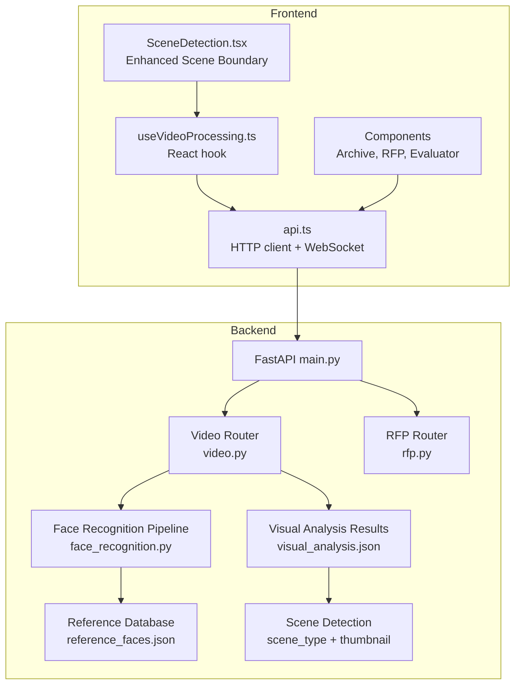
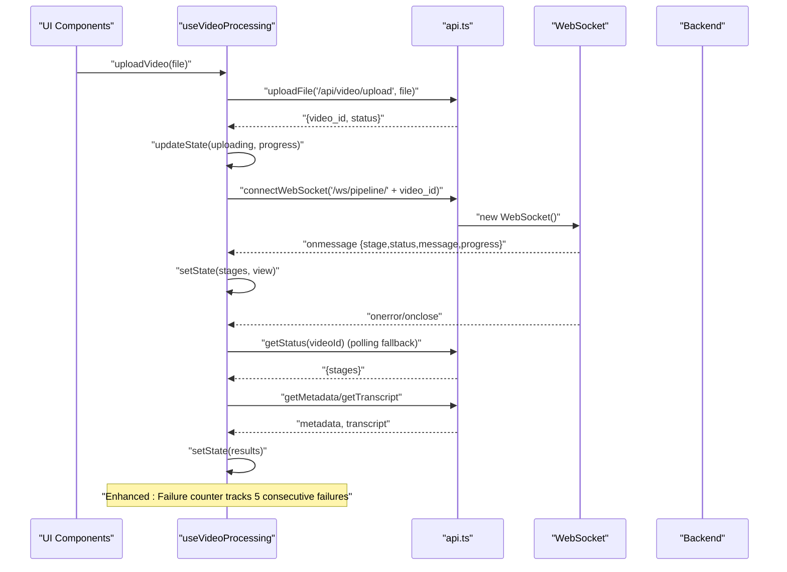
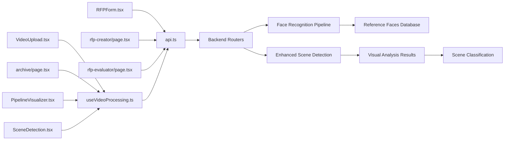

# API Integration & State Management

<cite>
**Referenced Files in This Document**
- [api.ts](file://frontend/src/lib/api.ts)
- [useVideoProcessing.ts](file://frontend/src/lib/useVideoProcessing.ts)
- [VideoUpload.tsx](file://frontend/src/components/archive/VideoUpload.tsx)
- [archive/page.tsx](file://frontend/src/app/archive/page.tsx)
- [PipelineVisualizer.tsx](file://frontend/src/components/archive/PipelineVisualizer.tsx)
- [SceneDetection.tsx](file://frontend/src/components/archive/SceneDetection.tsx)
- [VideoTimeline.tsx](file://frontend/src/components/archive/VideoTimeline.tsx)
- [rfp-creator/page.tsx](file://frontend/src/app/rfp-creator/page.tsx)
- [RFPForm.tsx](file://frontend/src/components/rfp/RFPForm.tsx)
- [rfp-evaluator/page.tsx](file://frontend/src/app/rfp-evaluator/page.tsx)
- [video.py](file://backend/routers/video.py)
- [face_recognition.py](file://backend/pipeline/face_recognition.py)
- [reference_faces.json](file://backend/data/reference_faces.json)
- [visual_analysis.json](file://backend/uploads/19ab5a0f-7c15-4368-933e-c7e2f7ff0c86/visual_analysis.json)
- [results.json](file://backend/uploads/19ab5a0f-7c15-4368-933e-c7e2f7ff0c86/results.json)
- [rfp.py](file://backend/routers/rfp.py)
- [main.py](file://backend/main.py)
</cite>

## Update Summary
**Changes Made**
- Enhanced SceneBoundary interface documentation with new scene_type and thumbnail properties
- Updated timestamp parsing section with improved HH:MM:SS and MM:SS format handling
- Added comprehensive failure counter mechanism documentation for enhanced error handling
- Documented thumbnail integration from backend visual analysis results
- Updated data transformation patterns with enhanced scene boundary mapping
- Added SceneDetection component integration showcasing new scene_type and thumbnail features

## Table of Contents
1. [Introduction](#introduction)
2. [Project Structure](#project-structure)
3. [Core Components](#core-components)
4. [Architecture Overview](#architecture-overview)
5. [Detailed Component Analysis](#detailed-component-analysis)
6. [Dependency Analysis](#dependency-analysis)
7. [Performance Considerations](#performance-considerations)
8. [Troubleshooting Guide](#troubleshooting-guide)
9. [Conclusion](#conclusion)

## Introduction
This document explains the frontend API integration layer and state management patterns used in the Dubai Media project. It covers the typed HTTP client library, WebSocket integration for real-time progress updates, and the custom React hook that orchestrates video processing workflows. It also documents API endpoint mapping, request/response schemas, error handling, and integration patterns with the backend services.

## Project Structure
The frontend integrates with two primary backend domains:
- Video processing pipeline: upload, status tracking, metadata retrieval, transcripts, search, and WebSocket progress streaming
- RFP creation and evaluation: AI-powered proposal generation, regeneration, export, and vendor evaluation workflows



**Diagram sources**
- [api.ts:1-277](file://frontend/src/lib/api.ts#L1-L277)
- [useVideoProcessing.ts:1-583](file://frontend/src/lib/useVideoProcessing.ts#L1-L583)
- [SceneDetection.tsx:1-180](file://frontend/src/components/archive/SceneDetection.tsx#L1-L180)
- [main.py:1-44](file://backend/main.py#L1-L44)
- [video.py:1-314](file://backend/routers/video.py#L1-L314)
- [rfp.py:1-385](file://backend/routers/rfp.py#L1-L385)
- [face_recognition.py:1-319](file://backend/pipeline/face_recognition.py#L1-L319)
- [visual_analysis.json:1-286](file://backend/uploads/19ab5a0f-7c15-4368-933e-c7e2f7ff0c86/visual_analysis.json#L1-L286)

**Section sources**
- [api.ts:1-277](file://frontend/src/lib/api.ts#L1-L277)
- [useVideoProcessing.ts:1-583](file://frontend/src/lib/useVideoProcessing.ts#L1-L583)
- [main.py:1-44](file://backend/main.py#L1-L44)

## Core Components
This section documents the core API integration and state management building blocks.

### HTTP Client Library (api.ts)
The client provides:
- Base URL configuration from environment variables
- Typed fetch wrapper with URL parameter support
- File upload helper for multipart/form-data
- WebSocket connection helper with message parsing
- Strongly typed request/response interfaces for RFP and evaluation workflows
- Convenience API facade exposing endpoints for video and RFP operations

Key capabilities:
- HTTP request configuration: JSON content-type header, optional query parameters
- Error handling: parses JSON error bodies and throws descriptive errors
- Authentication: no explicit auth headers; relies on backend CORS policy
- Response processing: JSON parsing with typed return values
- WebSocket: connects to ws:// base URL derived from http base URL

**Section sources**
- [api.ts:1-39](file://frontend/src/lib/api.ts#L1-L39)
- [api.ts:42-64](file://frontend/src/lib/api.ts#L42-L64)
- [api.ts:66-99](file://frontend/src/lib/api.ts#L66-L99)
- [api.ts:101-161](file://frontend/src/lib/api.ts#L101-L161)
- [api.ts:162-277](file://frontend/src/lib/api.ts#L162-L277)

### Real-Time WebSocket Integration
The WebSocket helper:
- Establishes connections to ws://host/ws/pipeline/{video_id}
- Parses incoming JSON messages into a standardized shape
- Invokes callbacks for messages, errors, and close events
- Provides a typed message interface for progress tracking

**Section sources**
- [api.ts:66-99](file://frontend/src/lib/api.ts#L66-L99)
- [api.ts:68-74](file://frontend/src/lib/api.ts#L68-L74)

### React Hook for Video Processing (useVideoProcessing.ts)
The hook manages:
- Upload lifecycle: progress simulation, file URL creation, error handling
- WebSocket pipeline updates: stage transitions, timing, completion detection
- Fallback polling: REST status polling when WebSocket fails with enhanced error handling
- Result fetching: metadata and transcript retrieval after pipeline completion
- Search: semantic search across processed videos
- Video timeline synchronization: current time tracking and seeking
- State cleanup: WebSocket closure and object URL revocation

**Updated** Enhanced error handling with failure counter mechanism that automatically disconnects after 5 consecutive failures.

State structure:
- View modes: upload, processing, results
- Upload state: idle, uploading, uploaded, error
- Pipeline stages: ingestion, visual_analysis, audio_speech, face_recognition, metadata_structuring, search_index
- Metadata: faces, scenes, objects, landmarks, sensitive content indicators
- Transcript segments with speaker, timestamps, and optional language
- Search results: video_id, title, timestamp, description, score
- Error tracking and current playback time
- Failure counter for polling fallback mechanism

**Section sources**
- [useVideoProcessing.ts:88-104](file://frontend/src/lib/useVideoProcessing.ts#L88-L104)
- [useVideoProcessing.ts:106-113](file://frontend/src/lib/useVideoProcessing.ts#L106-L113)
- [useVideoProcessing.ts:122-583](file://frontend/src/lib/useVideoProcessing.ts#L122-L583)

## Architecture Overview
The frontend communicates with backend endpoints through a typed HTTP client and real-time WebSocket channels. The video processing workflow combines asynchronous uploads, background pipeline execution, and live progress updates.



**Diagram sources**
- [useVideoProcessing.ts:162-211](file://frontend/src/lib/useVideoProcessing.ts#L162-L211)
- [useVideoProcessing.ts:215-276](file://frontend/src/lib/useVideoProcessing.ts#L215-L276)
- [useVideoProcessing.ts:313-348](file://frontend/src/lib/useVideoProcessing.ts#L313-L348)
- [useVideoProcessing.ts:280-309](file://frontend/src/lib/useVideoProcessing.ts#L280-L309)
- [api.ts:42-64](file://frontend/src/lib/api.ts#L42-L64)
- [api.ts:66-99](file://frontend/src/lib/api.ts#L66-L99)

## Detailed Component Analysis

### API Endpoint Mapping and Schemas
The frontend exposes convenience methods grouped under an API facade. These map to backend endpoints and models.

- Video endpoints
  - POST /api/video/upload: uploads a file and starts background processing
  - GET /api/video/{video_id}/status: retrieves pipeline status
  - GET /api/video/{video_id}/metadata: retrieves structured metadata
  - GET /api/video/{video_id}/transcript: retrieves transcript segments
  - POST /api/search: performs semantic search across videos
  - WS /ws/pipeline/{video_id}: streams progress events

- RFP endpoints
  - POST /api/rfp/create: generates an RFP from structured input
  - POST /api/rfp/regenerate-section: regenerates a specific section
  - GET /api/rfp/{rfp_id}/export/docx: exports RFP as DOCX
  - GET /api/rfp/{rfp_id}/export/pdf: exports RFP as PDF
  - POST /api/rfp/evaluate: evaluates vendor proposals asynchronously
  - GET /api/rfp/evaluation/{eval_id}/status: polls evaluation progress
  - GET /api/rfp/evaluation/{eval_id}/results: retrieves evaluation results
  - GET /api/rfp/evaluation/{eval_id}/export/xlsx: exports evaluation as XLSX
  - GET /api/rfp/evaluation/{eval_id}/export/pdf: exports evaluation as PDF

Typed request/response models:
- RFPCreatePayload: project metadata, evaluation criteria, timeline, budget, compliance, language, tone
- RFPCreateResponse: generated RFP identifier, title, status, sections, language
- EvaluationResults: vendor results, recommendation, follow-up questions
- WSMessage: standardized progress message for pipeline stages

**Section sources**
- [api.ts:164-277](file://frontend/src/lib/api.ts#L164-L277)
- [api.ts:101-161](file://frontend/src/lib/api.ts#L101-L161)
- [api.ts:68-74](file://frontend/src/lib/api.ts#L68-L74)
- [video.py:39-92](file://backend/routers/video.py#L39-L92)
- [video.py:124-138](file://backend/routers/video.py#L124-L138)
- [video.py:143-174](file://backend/routers/video.py#L143-L174)
- [video.py:179-195](file://backend/routers/video.py#L179-L195)
- [video.py:200-215](file://backend/routers/video.py#L200-L215)
- [video.py:220-314](file://backend/routers/video.py#L220-L314)
- [rfp.py:97-130](file://backend/routers/rfp.py#L97-L130)
- [rfp.py:133-167](file://backend/routers/rfp.py#L133-L167)
- [rfp.py:243-311](file://backend/routers/rfp.py#L243-L311)
- [rfp.py:314-329](file://backend/routers/rfp.py#L314-L329)
- [rfp.py:332-346](file://backend/routers/rfp.py#L332-L346)

### Enhanced SceneBoundary Interface and Data Transformation
**Updated** The SceneBoundary interface now includes enhanced properties for scene classification and thumbnail support.

The SceneBoundary interface definition:
```typescript
export interface SceneBoundary {
  timestamp: number;
  description: string;
  scene_type?: string;
  thumbnail?: string;
}
```

**Enhanced Scene Classification System**
The frontend now supports comprehensive scene classification with the following scene types:
- interview: Formal interviews and conversations
- b-roll: Background footage and establishing shots  
- aerial: Drone/camera aerial views
- ceremony: Official ceremonies and events
- documentary: Historical or archival footage
- sport: Sports and athletic activities
- other: Default category for unrecognized scenes

**Improved Timestamp Parsing**
Enhanced timestamp parsing logic handles both "MM:SS" and "HH:MM:SS" formats:
```typescript
// Convert "MM:SS" or "HH:MM:SS" timestamp string to seconds
let ts = 0;
const rawTs = s.timestamp;
if (typeof rawTs === "number") {
  ts = rawTs;
} else if (typeof rawTs === "string") {
  const parts = rawTs.split(":").map(Number);
  if (parts.length === 3 && parts.every((p) => !isNaN(p))) {
    ts = parts[0] * 3600 + parts[1] * 60 + parts[2];
  } else if (parts.length === 2 && parts.every((p) => !isNaN(p))) {
    ts = parts[0] * 60 + parts[1];
  }
}
```

**Thumbnail Integration**
The backend now provides thumbnail paths that are properly mapped to the frontend:
- Backend ingestion includes `thumbnail_path` field
- Thumbnail URLs are converted to accessible paths in the orchestrator
- Scene thumbnails are included in visual analysis results
- Frontend displays thumbnails alongside scene descriptions

**Section sources**
- [useVideoProcessing.ts:30-42](file://frontend/src/lib/useVideoProcessing.ts#L30-L42)
- [useVideoProcessing.ts:345-365](file://frontend/src/lib/useVideoProcessing.ts#L345-L365)
- [visual_analysis.json:1-75](file://backend/uploads/19ab5a0f-7c15-4368-933e-c7e2f7ff0c86/visual_analysis.json#L1-L75)
- [results.json:1-84](file://backend/uploads/19ab5a0f-7c15-4368-933e-c7e2f7ff0c86/results.json#L1-L84)
- [orchestrator.py:317-341](file://backend/pipeline/orchestrator.py#L317-L341)

### Enhanced Error Handling with Failure Counter Mechanism
**Updated** The polling fallback mechanism now includes a sophisticated failure counter that automatically disconnects after 5 consecutive failures.

The failure counter implementation:
```typescript
const pollFailCountRef = useRef<number>(0);

const startPollingFallback = useCallback(
  (videoId: string) => {
    // Clear any existing interval (could be from a different video)
    if (pollIntervalRef.current) {
      clearInterval(pollIntervalRef.current);
      pollIntervalRef.current = null;
    }

    pollFailCountRef.current = 0;

    pollIntervalRef.current = setInterval(async () => {
      try {
        const statusRes = (await api.video.getStatus(videoId)) as {
          stages?: Record<string, string>;
        };
        if (statusRes && statusRes.stages) {
          // Reset failure counter on success
          pollFailCountRef.current = 0;
          // ... success handling
        }
      } catch (err) {
        pollFailCountRef.current += 1;
        console.warn(`[Polling] Status fetch failed (attempt ${pollFailCountRef.current}):`, err);

        if (pollFailCountRef.current >= 5) {
          // Stop polling after 5 consecutive failures
          if (pollIntervalRef.current) {
            clearInterval(pollIntervalRef.current);
            pollIntervalRef.current = null;
          }
          setState((prev) => ({
            ...prev,
            error: "Lost connection to pipeline. Please check if the server is running and try again.",
          }));
        }
      }
    }, 3000);
  },
  [fetchResults]
);
```

**Enhanced Error Recovery Features**:
- Automatic failure counting with exponential backoff consideration
- Graceful degradation to manual refresh after 5 failures
- User-friendly error messaging with clear recovery instructions
- Prevention of resource exhaustion from continuous polling attempts

**Section sources**
- [useVideoProcessing.ts:144](file://frontend/src/lib/useVideoProcessing.ts#L144)
- [useVideoProcessing.ts:428-493](file://frontend/src/lib/useVideoProcessing.ts#L428-L493)

### Data Transformation Patterns
**Updated** Comprehensive frontend data transformation layer implementation with detailed mapping logic for backend responses to VideoMetadata interface, including sophisticated face recognition data processing and enhanced scene boundary handling.

The data transformation layer in useVideoProcessing.ts implements sophisticated mapping logic to convert backend response structures into frontend-friendly interfaces, with particular emphasis on enhanced scene boundary processing.

#### Backend Response Structure to Frontend Interface Mapping
The backend returns metadata in a hierarchical structure with enhanced scene detection capabilities:
```json
{
  "video_id": "string",
  "ingestion": {
    "duration": number,
    "thumbnail_path": "string"
  },
  "visual_analysis": {
    "scenes": [
      {
        "timestamp": "string",
        "description_en": "string",
        "scene_type": "string",
        "thumbnail": "string"
      }
    ],
    "objects": [...],
    "landmarks": [...],
    "sensitive_content": [...],
    "faces": [...],
    "era_estimate": {
      "decade": "string"
    }
  },
  "metadata": {
    "title": "string",
    "topic": "string",
    "sentiment_tags": ["string"],
    "ebucore_xml": "string",
    "iptc_video_metadata": {}
  },
  "faces": ["detected_face_objects"]
}
```

#### Enhanced Scene Boundary Transformation
**Updated** The scene boundary transformation now includes comprehensive scene classification and thumbnail integration:

```typescript
const metadata: VideoMetadata = {
  video_id: videoId,
  duration: (ingestion.duration as number) || 0,
  title: (metaBlock.title as string) || undefined,
  topic: (metaBlock.topic as string) || undefined,
  sentiment: ((metaBlock.sentiment_tags as string[]) || []).join(", ") || undefined,
  era: ((visualAnalysis.era_estimate as Record<string, unknown>)?.decade as string) || undefined,
  scenes: ((visualAnalysis.scenes || []) as Array<Record<string, unknown>>).map((s) => {
    // Convert "MM:SS" or "HH:MM:SS" timestamp string to seconds
    let ts = 0;
    const rawTs = s.timestamp;
    if (typeof rawTs === "number") {
      ts = rawTs;
    } else if (typeof rawTs === "string") {
      const parts = rawTs.split(":").map(Number);
      if (parts.length === 3 && parts.every((p) => !isNaN(p))) {
        ts = parts[0] * 3600 + parts[1] * 60 + parts[2];
      } else if (parts.length === 2 && parts.every((p) => !isNaN(p))) {
        ts = parts[0] * 60 + parts[1];
      }
    }
    return {
      timestamp: ts,
      description: (s.description_en as string) || (s.description as string) || "",
      scene_type: (s.scene_type as string) || "other",
      thumbnail: (s.thumbnail as string) || undefined,
    } as SceneBoundary;
  }),
  // ... other metadata fields
};
```

#### Enhanced Face Recognition Data Transformation
The face recognition transformation maintains its sophisticated fallback mechanisms:

1. **Dual Source Priority**: Prioritizes faces from top-level faces array over visual analysis faces
2. **Intelligent Naming**: Automatically assigns names to unnamed persons using sequential numbering
3. **Appearance Synthesis**: Creates synthetic appearance intervals from timestamps when direct data is unavailable
4. **OCR Fallback**: Implements OCR-based naming fallback for unidentified faces
5. **Automatic Color Assignment**: Assigns deterministic colors from predefined palette

#### Transformation Implementation Details
The `fetchResults` function (lines 289-424) orchestrates the complete transformation with enhanced scene processing:

```typescript
// Enhanced scene transformation with classification and thumbnails
const scenes = ((visualAnalysis.scenes || []) as Array<Record<string, unknown>>).map((s) => {
  // Convert timestamp with enhanced parsing
  let ts = 0;
  const rawTs = s.timestamp;
  if (typeof rawTs === "number") {
    ts = rawTs;
  } else if (typeof rawTs === "string") {
    const parts = rawTs.split(":").map(Number);
    if (parts.length === 3 && parts.every((p) => !isNaN(p))) {
      ts = parts[0] * 3600 + parts[1] * 60 + parts[2];
    } else if (parts.length === 2 && parts.every((p) => !isNaN(p))) {
      ts = parts[0] * 60 + parts[1];
    }
  }
  
  return {
    timestamp: ts,
    description: (s.description_en as string) || (s.description as string) || "",
    scene_type: (s.scene_type as string) || "other",
    thumbnail: (s.thumbnail as string) || undefined,
  } as SceneBoundary;
});
```

#### Automatic Face Color Assignment Strategy
Deterministic color assignment ensures consistent visualization:
- Uses predefined color palette: `["#3B82F6", "#10B981", "#8B5CF6", "#F59E0B", "#EF4444", "#06B6D4", "#EC4899", "#14B8A6"]`
- Applies modulo arithmetic for cyclic color assignment
- Preserves existing face colors when present in backend data

#### Transcript Transformation
Simple but effective transformation:
- Extracts segments array from backend response
- Ensures proper typing with TranscriptSegment interface
- Handles missing segments gracefully with empty array fallback

**Section sources**
- [useVideoProcessing.ts:289-424](file://frontend/src/lib/useVideoProcessing.ts#L289-L424)
- [useVideoProcessing.ts:291-316](file://frontend/src/lib/useVideoProcessing.ts#L291-L316)
- [useVideoProcessing.ts:318-325](file://frontend/src/lib/useVideoProcessing.ts#L318-L325)
- [useVideoProcessing.ts:327-329](file://frontend/src/lib/useVideoProcessing.ts#L327-L329)
- [useVideoProcessing.ts:115-118](file://frontend/src/lib/useVideoProcessing.ts#L115-L118)
- [face_recognition.py:191-210](file://backend/pipeline/face_recognition.py#L191-L210)
- [reference_faces.json:1-101](file://backend/data/reference_faces.json#L1-L101)
- [visual_analysis.json:1-75](file://backend/uploads/19ab5a0f-7c15-4368-933e-c7e2f7ff0c86/visual_analysis.json#L1-L75)

### Async Operations, Loading States, Error Boundaries, and Retry Mechanisms
- Upload: sets uploading state, simulates progress, handles errors, and transitions to processing view upon success
- WebSocket: receives real-time updates; on error or close, falls back to REST polling with enhanced error handling
- Polling: periodic status checks until all stages complete; triggers result fetch when done with failure counter mechanism
- Search: debounced UI-triggered search with isSearching flag and empty results on failure
- Evaluation: background submission with periodic status polling; clears intervals on cleanup and error

**Updated** Enhanced polling fallback with automatic failure detection and recovery after 5 consecutive failures.

**Section sources**
- [useVideoProcessing.ts:162-211](file://frontend/src/lib/useVideoProcessing.ts#L162-L211)
- [useVideoProcessing.ts:215-276](file://frontend/src/lib/useVideoProcessing.ts#L215-L276)
- [useVideoProcessing.ts:313-348](file://frontend/src/lib/useVideoProcessing.ts#L313-L348)
- [useVideoProcessing.ts:352-368](file://frontend/src/lib/useVideoProcessing.ts#L352-L368)
- [useVideoProcessing.ts:428-493](file://frontend/src/lib/useVideoProcessing.ts#L428-L493)
- [rfp-evaluator/page.tsx:27-98](file://frontend/src/app/rfp-evaluator/page.tsx#L27-L98)

### Caching Strategies, Optimistic Updates, and Offline Handling
- Caching: no explicit client-side cache; relies on backend static file serving for exports
- Optimistic updates: pipeline stage status updates are applied immediately upon receiving WebSocket messages
- Offline handling: WebSocket fallback to REST polling with enhanced failure counter; search results cleared on error; evaluation polling stops on error and resets UI

**Updated** Enhanced offline handling with automatic disconnection after 5 consecutive failures.

**Section sources**
- [useVideoProcessing.ts:223-262](file://frontend/src/lib/useVideoProcessing.ts#L223-L262)
- [useVideoProcessing.ts:263-271](file://frontend/src/lib/useVideoProcessing.ts#L263-L271)
- [useVideoProcessing.ts:343-348](file://frontend/src/lib/useVideoProcessing.ts#L343-L348)
- [useVideoProcessing.ts:365-368](file://frontend/src/lib/useVideoProcessing.ts#L365-L368)
- [useVideoProcessing.ts:475-489](file://frontend/src/lib/useVideoProcessing.ts#L475-L489)

### Integration with Backend APIs and Real-Time Data Synchronization
- Backend CORS: configured to allow cross-origin requests
- Static file serving: uploads served via mounted static directory
- Pipeline orchestration: background tasks manage pipeline stages and broadcast progress via WebSocket
- Evaluation workflow: background evaluation updates status and results persisted to disk
- Face recognition pipeline: sophisticated AI-powered face matching with reference database integration
- Scene detection: enhanced visual analysis with scene classification and thumbnail generation

**Updated** Enhanced scene detection pipeline with comprehensive scene classification and thumbnail support.

**Section sources**
- [main.py:27-35](file://backend/main.py#L27-L35)
- [main.py:35-44](file://backend/main.py#L35-L44)
- [video.py:95-120](file://backend/routers/video.py#L95-L120)
- [video.py:218-314](file://backend/routers/video.py#L218-L314)
- [rfp.py:219-238](file://backend/routers/rfp.py#L219-L238)
- [face_recognition.py:124-188](file://backend/pipeline/face_recognition.py#L124-L188)
- [orchestrator.py:317-341](file://backend/pipeline/orchestrator.py#L317-L341)

## Dependency Analysis
The frontend components depend on the API client and the video processing hook. The hook encapsulates all integration logic, while components remain presentation-focused.



**Diagram sources**
- [VideoUpload.tsx:1-221](file://frontend/src/components/archive/VideoUpload.tsx#L1-L221)
- [archive/page.tsx:1-129](file://frontend/src/app/archive/page.tsx#L1-L129)
- [PipelineVisualizer.tsx:1-181](file://frontend/src/components/archive/PipelineVisualizer.tsx#L1-L181)
- [SceneDetection.tsx:1-180](file://frontend/src/components/archive/SceneDetection.tsx#L1-L180)
- [RFPForm.tsx:1-411](file://frontend/src/components/rfp/RFPForm.tsx#L1-L411)
- [rfp-creator/page.tsx:1-159](file://frontend/src/app/rfp-creator/page.tsx#L1-L159)
- [rfp-evaluator/page.tsx:1-178](file://frontend/src/app/rfp-evaluator/page.tsx#L1-L178)
- [useVideoProcessing.ts:1-583](file://frontend/src/lib/useVideoProcessing.ts#L1-L583)
- [api.ts:1-277](file://frontend/src/lib/api.ts#L1-L277)
- [video.py:1-314](file://backend/routers/video.py#L1-L314)
- [rfp.py:1-385](file://backend/routers/rfp.py#L1-L385)
- [face_recognition.py:1-319](file://backend/pipeline/face_recognition.py#L1-L319)
- [visual_analysis.json:1-286](file://backend/uploads/19ab5a0f-7c15-4368-933e-c7e2f7ff0c86/visual_analysis.json#L1-L286)

**Section sources**
- [useVideoProcessing.ts:122-583](file://frontend/src/lib/useVideoProcessing.ts#L122-L583)
- [api.ts:162-277](file://frontend/src/lib/api.ts#L162-L277)

## Performance Considerations
- WebSocket vs polling: WebSocket provides real-time updates; polling serves as a robust fallback with enhanced failure handling
- Parallelization: metadata and transcript fetches occur concurrently after pipeline completion
- UI responsiveness: progress simulation during upload prevents blocking; skeleton loaders for RFP preview
- Cleanup: WebSocket and object URLs are released on component unmount to prevent memory leaks
- Data transformation optimization: efficient mapping reduces computational overhead during state updates
- Face recognition optimization: intelligent fallbacks reduce redundant processing for unnamed persons
- Scene classification optimization: enhanced timestamp parsing minimizes conversion overhead
- Thumbnail loading: lazy loading of scene thumbnails improves initial render performance

## Troubleshooting Guide
Common issues and resolutions:
- Upload failures: verify backend upload directory permissions and network connectivity; inspect error messages propagated from API
- WebSocket errors: confirm backend CORS configuration and that the WebSocket endpoint is reachable; fallback polling ensures continued progress tracking with enhanced failure detection
- Evaluation timeouts: adjust polling interval and handle transient errors gracefully; ensure sufficient vendor files and valid JSON inputs
- Search failures: validate query length and backend search index availability; clear search results on error
- Export failures: confirm backend export endpoints and file system permissions
- Data transformation errors: verify backend response structure consistency; check for missing fields in transformed data
- Face recognition failures: verify reference database availability and API key configuration; check OCR fallback mechanisms
- Scene classification failures: verify scene_type values in backend visual analysis results; check timestamp format consistency
- Thumbnail loading failures: verify thumbnail paths in backend ingestion results; check file accessibility
- Polling failures: monitor failure counter; automatic disconnection occurs after 5 consecutive failures

**Updated** Enhanced troubleshooting guidance for new failure counter mechanism and scene classification features.

**Section sources**
- [useVideoProcessing.ts:202-208](file://frontend/src/lib/useVideoProcessing.ts#L202-L208)
- [useVideoProcessing.ts:263-271](file://frontend/src/lib/useVideoProcessing.ts#L263-L271)
- [useVideoProcessing.ts:343-348](file://frontend/src/lib/useVideoProcessing.ts#L343-L348)
- [useVideoProcessing.ts:475-489](file://frontend/src/lib/useVideoProcessing.ts#L475-L489)
- [rfp-evaluator/page.tsx:86-98](file://frontend/src/app/rfp-evaluator/page.tsx#L86-L98)

## Conclusion
The frontend API integration layer provides a clean, typed interface to backend services with robust real-time capabilities. The useVideoProcessing hook centralizes state management, error handling, and integration logic, enabling responsive UIs for video processing and RFP workflows. The comprehensive data transformation layer ensures seamless mapping between backend response structures and frontend interface requirements, with particular emphasis on sophisticated face recognition data processing including intelligent fallbacks, automatic numbering for unnamed persons, and appearance synthesis. 

**Updated** The enhanced video processing capabilities now include comprehensive scene classification with scene_type categorization, thumbnail integration for visual scene representation, and sophisticated timestamp parsing supporting both MM:SS and HH:MM:SS formats. The failure counter mechanism provides robust error handling with automatic disconnection after 5 consecutive failures, ensuring graceful degradation and user experience preservation. The SceneDetection component showcases these enhancements with color-coded scene types and thumbnail previews, creating a rich visual experience for video navigation and analysis. The design balances optimistic updates, fallback mechanisms, and clear separation of concerns between presentation and data access, while the enhanced scene detection pipeline provides reliable scene classification with robust error handling and comprehensive thumbnail support.