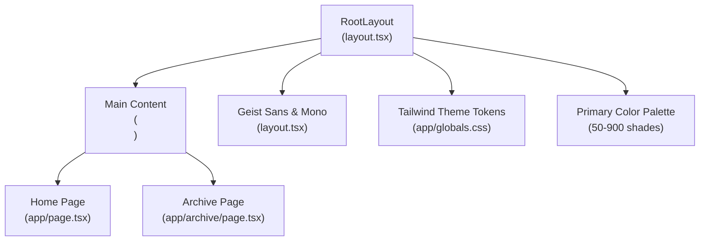
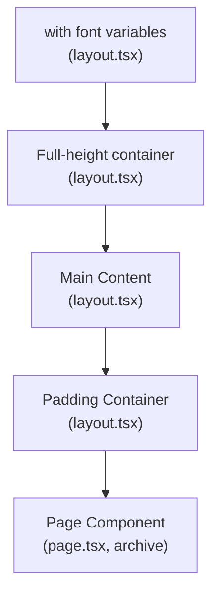

# Application Layout & Navigation

<cite>
**Referenced Files in This Document**
- [layout.tsx](file://frontend/src/app/layout.tsx)
- [globals.css](file://frontend/src/app/globals.css)
- [page.tsx](file://frontend/src/app/page.tsx)
- [archive/page.tsx](file://frontend/src/app/archive/page.tsx)
- [Button.tsx](file://frontend/src/components/Button.tsx)
- [Card.tsx](file://frontend/src/components/Card.tsx)
- [SceneDetection.tsx](file://frontend/src/components/archive/SceneDetection.tsx)
- [TranscriptPanel.tsx](file://frontend/src/components/archive/TranscriptPanel.tsx)
- [MetadataPanel.tsx](file://frontend/src/components/archive/MetadataPanel.tsx)
- [VideoTimeline.tsx](file://frontend/src/components/archive/VideoTimeline.tsx)
- [package.json](file://frontend/package.json)
- [postcss.config.mjs](file://frontend/postcss.config.mjs)
- [next.config.ts](file://frontend/next.config.ts)
- [tsconfig.json](file://frontend/tsconfig.json)
- [useVideoProcessing.ts](file://frontend/src/lib/useVideoProcessing.ts)
</cite>

## Update Summary
**Changes Made**
- Removed all references to Sidebar component as it no longer exists in the codebase
- Updated layout documentation to reflect the new full-width interface without side navigation
- Streamlined main landing page documentation to focus on core media processing features only
- Removed references to RFP Creator and RFP Evaluator pages that have been removed
- Updated architecture diagrams to show simplified layout structure
- Enhanced documentation for the streamlined single-tool approach

## Table of Contents
1. [Introduction](#introduction)
2. [Project Structure](#project-structure)
3. [Core Components](#core-components)
4. [Architecture Overview](#architecture-overview)
5. [Detailed Component Analysis](#detailed-component-analysis)
6. [Enhanced Styling System](#enhanced-styling-system)
7. [Color Palette Management](#color-palette-management)
8. [Form Input Accessibility](#form-input-accessibility)
9. [Typography Consistency](#typography-consistency)
10. [Component Styling Examples](#component-styling-examples)
11. [Theme Integration](#theme-integration)
12. [Performance Considerations](#performance-considerations)
13. [Troubleshooting Guide](#troubleshooting-guide)
14. [Conclusion](#conclusion)

## Introduction
This document explains the Next.js application layout and navigation system used in the frontend. It covers the RootLayout component structure, font configuration with Geist and Geist Mono fonts, responsive design implementation, and the main content area layout with padding and background styling. The application now provides a streamlined, full-width interface focused on core media processing features without side navigation. It also provides examples of layout customization, theme integration, and how layout components relate to page rendering, including SSR/SSG considerations and performance optimizations.

**Updated** The application has been streamlined to provide a focused, full-width interface centered around core media processing capabilities. The sidebar navigation has been removed in favor of a clean, direct user experience that emphasizes the Video Archive Metadata tool as the primary feature.

## Project Structure
The layout system centers around a single RootLayout that wraps all pages with a full-width interface. Pages render inside the main content area with consistent padding and background styling. Fonts are configured via Next.js font optimization, and Tailwind CSS provides responsive utilities and theme tokens with comprehensive color palette support.



**Diagram sources**
- [layout.tsx:20-37](file://frontend/src/app/layout.tsx#L20-L37)
- [globals.css:8-23](file://frontend/src/app/globals.css#L8-L23)
- [page.tsx:35-162](file://frontend/src/app/page.tsx#L35-L162)
- [archive/page.tsx](file://frontend/src/app/archive/page.tsx)

**Section sources**
- [layout.tsx:1-38](file://frontend/src/app/layout.tsx#L1-L38)
- [globals.css:1-98](file://frontend/src/app/globals.css#L1-L98)

## Core Components
- RootLayout: Provides the HTML skeleton, font variables, global styles, and full-width main content container with padding.
- Global Styles: Tailwind-based theme tokens and comprehensive color palette, plus font family variables.
- Pages: Home and Archive pages render within the main content area with their own layouts.
- Archive Page: Complex video processing interface with specialized panels for different aspects of video analysis.

Key responsibilities:
- RootLayout sets up the base HTML element with font variables and ensures the body fills the viewport.
- Global styles define theme tokens and comprehensive color scheme for light/dark modes.
- Pages define their own content and responsive layouts within the main content area.
- Archive page manages complex video processing state with multiple specialized panels.

**Section sources**
- [layout.tsx:20-37](file://frontend/src/app/layout.tsx#L20-L37)
- [globals.css:8-23](file://frontend/src/app/globals.css#L8-L23)

## Architecture Overview
The layout architecture follows a simplified hierarchy: RootLayout wraps all pages and defines the main content container. Pages render inside the main content area with their own responsive grids and components.



**Diagram sources**
- [layout.tsx:20-37](file://frontend/src/app/layout.tsx#L20-L37)
- [page.tsx:35-162](file://frontend/src/app/page.tsx#L35-L162)

## Detailed Component Analysis

### RootLayout Component
RootLayout is the application shell:
- Sets HTML language and applies font variables for Geist Sans and Geist Mono.
- Wraps children in a full-height body and full-width main content area.
- Renders the main content area with a light gray background and inner padding container.
- Adds minimum height to ensure the content fills the viewport.

Responsive and accessibility considerations:
- Uses antialiased class for improved text rendering.
- Ensures min-height for the body and main content to avoid layout shifts.
- Provides a clean, distraction-free interface optimized for content consumption.

Customization examples:
- To modify background, update the background class on the main content area.
- To alter font families, replace the font variable classes applied to the HTML element.
- To change padding, adjust the inner div's padding classes.

**Section sources**
- [layout.tsx:20-37](file://frontend/src/app/layout.tsx#L20-L37)

### Font Configuration (Geist Sans and Geist Mono)
Font configuration:
- Two Next.js font instances are created: one for sans-serif and one for monospace.
- Variables are injected into the HTML root to enable CSS variable-based font selection.
- The global stylesheet references these variables for Tailwind theme tokens.

Integration with Tailwind:
- Tailwind theme tokens map to the font variables, enabling consistent typography across the app.

Dark mode compatibility:
- Fonts remain consistent under light/dark modes via CSS variables.

**Section sources**
- [layout.tsx:5-13](file://frontend/src/app/layout.tsx#L5-L13)
- [globals.css:11-12](file://frontend/src/app/globals.css#L11-L12)

### Main Content Area Layout
Main content area characteristics:
- Full-width layout with no sidebar constraints.
- Light gray background for visual separation.
- Minimum height to fill the viewport.
- Inner padding container adds horizontal padding around page content.

Responsive behavior:
- The main content area itself does not apply responsive grid; pages manage their own responsive layouts.
- Use Tailwind responsive modifiers (e.g., sm:, md:, lg:) within page components to adapt to screen sizes.

Background and padding examples:
- Background color can be changed by modifying the background class on the main element.
- Padding can be adjusted by changing the inner div's padding classes.

**Section sources**
- [layout.tsx:30-33](file://frontend/src/app/layout.tsx#L30-L33)

### Global Styles and Theme Integration
Theme tokens:
- CSS variables define background and foreground colors.
- Tailwind theme inline directive maps color palettes and font variables to CSS custom properties.

Font integration:
- Tailwind theme tokens reference the Geist font variables, ensuring consistent typography.

Customization examples:
- Adjust primary color scale by updating the primary color variables.
- Change default background/foreground by modifying the CSS variables in :root.
- Extend the color palette by adding more variables and referencing them in Tailwind utilities.

**Section sources**
- [globals.css:3-23](file://frontend/src/app/globals.css#L3-L23)

### Home Page Layout and Features
The home page represents a streamlined, focused interface showcasing the core media processing capabilities:

#### Single Tool Focus
The home page now features a single, prominent tool card for "Video Archive Metadata":
- **Hero Section**: Clear branding and value proposition with Alibaba Cloud integration badge
- **Feature Card**: Comprehensive overview of video processing capabilities
- **Technology Stack**: Display of AI models and technologies used
- **Value Propositions**: Three key benefits highlighting Arabic-first AI, data sovereignty, and unified vendor approach

#### Responsive Design
- **Grid Layout**: Uses `grid-cols-1 lg:grid-cols-3` for adaptive card display
- **Mobile Optimization**: Stacks vertically on smaller screens
- **Touch-Friendly**: Large tap targets and clear call-to-action buttons

#### Content Organization
- **Tool Capabilities**: Detailed list of supported features including speech-to-text, scene detection, face recognition, and metadata export
- **Model Information**: Clear presentation of underlying AI technologies
- **Strategic Benefits**: Emphasis on regional compliance and vendor consolidation

**Section sources**
- [page.tsx:35-162](file://frontend/src/app/page.tsx#L35-L162)

### Archive Page Layout and Component Integration
The archive page represents the most complex layout in the application, featuring a sophisticated three-column design with specialized components for comprehensive video analysis.

#### Three-Column Layout Architecture
The archive page implements a responsive grid system:
- **Left Column (66% width)**: Contains VideoTimeline and SceneDetection components stacked vertically
- **Right Column (33% width)**: Contains MetadataPanel and APITransparencyPanel stacked vertically
- **Responsive Breakpoints**: Uses `lg:grid-cols-5` for desktop, collapsing to single column on smaller screens

#### Component Interaction Patterns
The archive page demonstrates sophisticated component interaction:
- **State Management**: Centralized through useVideoProcessing hook managing video processing lifecycle
- **Event Propagation**: Seek events bubble up from components to trigger video playback synchronization
- **Conditional Rendering**: Components only render when relevant data is available
- **Responsive Design**: Grid layout adapts to different screen sizes while maintaining component functionality

**Section sources**
- [archive/page.tsx](file://frontend/src/app/archive/page.tsx)

### SceneDetection Component
The SceneDetection component provides comprehensive scene analysis and visualization capabilities:

#### Scene Timeline Visualization
- **Timeline Bar**: Horizontal bar showing scene boundaries with color-coded segments
- **Interactive Segments**: Clickable scene regions that jump to specific timestamps
- **Playback Indicator**: Real-time position marker synchronized with video playback
- **Legend System**: Color-coded scene type indicators for quick identification

#### Scene Type Classification
The component supports multiple scene types with distinct visual treatments:
- **interview**: Blue timeline segments with blue accent colors
- **b-roll**: Orange segments with orange styling
- **aerial**: Teal segments with teal styling
- **ceremony**: Purple segments with purple styling
- **documentary**: Amber segments with amber styling
- **news-anchor**: Red segments with red styling
- **sport**: Green segments with green styling
- **other**: Gray segments with default styling

#### Interactive Features
- **Timestamp Seeking**: Click scene segments to jump to specific video positions
- **Description Expansion**: Expand/collapse detailed scene descriptions
- **Active Scene Highlighting**: Current scene is visually emphasized
- **Auto-Scroll**: Smooth scrolling to active scene during playback

#### Technical Implementation
- **Scene Boundary Calculation**: Computes start/end times for each scene segment
- **Active Scene Detection**: Real-time determination of currently playing scene
- **Color Mapping**: Dynamic color assignment based on scene type
- **Performance Optimization**: Efficient rendering with virtualized lists for long transcripts

**Section sources**
- [SceneDetection.tsx:14-27](file://frontend/src/components/archive/SceneDetection.tsx#L14-L27)
- [SceneDetection.tsx:45-55](file://frontend/src/components/archive/SceneDetection.tsx#L45-L55)
- [SceneDetection.tsx:118-176](file://frontend/src/components/archive/SceneDetection.tsx#L118-L176)

### Page Rendering and Layout Relationship
Home page:
- Demonstrates streamlined, focused design with single tool emphasis.
- Uses Tailwind utilities for spacing, typography, and responsive breakpoints.
- Features modern card-based layout with clear visual hierarchy.

Archive page:
- **Complex State Management**: Integrates useVideoProcessing hook for comprehensive video processing lifecycle
- **Multi-Panel Layout**: Three-column design with specialized components for different aspects of video analysis
- **Real-time Synchronization**: Components coordinate through shared state for seamless user experience
- **Conditional Rendering**: Components only display when relevant data is available

Layout relationship:
- All pages render inside the main content area defined by RootLayout.
- Pages benefit from the full-width interface without sidebar constraints.
- Archive page serves as the most complex example of component integration and state management.

**Section sources**
- [page.tsx:35-162](file://frontend/src/app/page.tsx#L35-L162)
- [archive/page.tsx](file://frontend/src/app/archive/page.tsx)

## Enhanced Styling System

**Updated** The application maintains its comprehensive styling system with enhanced color palette management, form input accessibility, and typography consistency.

### Comprehensive Color Palette System
The color palette system provides extensive primary color variations from 50 to 900 shades:

```css
--color-primary-50: #fff7ed;
--color-primary-100: #ffedd5;
--color-primary-200: #fed7aa;
--color-primary-300: #fdba74;
--color-primary-400: #fb923c;
--color-primary-500: #f97316;
--color-primary-600: #ea580c;
--color-primary-700: #c2410c;
--color-primary-800: #9a3412;
--color-primary-900: #7c2d12;
```

Color variations enable:
- **Light to dark progression**: From subtle light tints (50) to deep dark tones (900)
- **Accessibility compliance**: Sufficient contrast ratios for text and backgrounds
- **Design flexibility**: Multiple intensity levels for different UI contexts
- **Brand consistency**: Cohesive color system across all components

### Enhanced Form Input Accessibility
The styling system includes dedicated accessibility features for form inputs:

```css
/* Ensure form inputs always have readable text and placeholder colors */
input,
textarea,
select {
  color: #1f2937;
}

input::placeholder,
textarea::placeholder {
  color: #6b7280;
  opacity: 1;
}
```

Accessibility benefits:
- **High contrast text**: Dark gray (#1f2937) for improved readability
- **Clear placeholder visibility**: Medium gray (#6b7280) with full opacity
- **Cross-browser compatibility**: Explicit opacity setting for placeholder visibility
- **Consistent styling**: Applied globally to all form input elements

### Typography Consistency
Font integration ensures consistent typography across the application:

```css
@theme inline {
  --font-sans: var(--font-geist-sans);
  --font-mono: var(--font-geist-mono);
}
```

Typography features:
- **Variable font support**: Dynamic font sizing and weight adjustments
- **System font fallback**: Arial, Helvetica, sans-serif for broad compatibility
- **CSS variable integration**: Seamless font variable usage throughout Tailwind utilities
- **Performance optimization**: Next.js font optimization for fast loading

**Section sources**
- [globals.css:8-23](file://frontend/src/app/globals.css#L8-L23)
- [globals.css:50-61](file://frontend/src/app/globals.css#L50-L61)
- [globals.css:11-12](file://frontend/src/app/globals.css#L11-L12)

## Color Palette Management

**Updated** Comprehensive color palette management system with Tailwind CSS theme integration.

### Primary Color Scale Implementation
The color palette follows a systematic approach from light to dark tints:

| Shade | Hex Value | Usage Context |
|-------|-----------|---------------|
| 50 | #fff7ed | Lightest background accents |
| 100 | #ffedd5 | Subtle borders and highlights |
| 200 | #fed7aa | Secondary backgrounds |
| 300 | #fdba74 | Medium emphasis |
| 400 | #fb923c | Standard emphasis |
| 500 | #f97316 | Primary brand color |
| 600 | #ea580c | Strong emphasis |
| 700 | #c2410c | Deep accents |
| 800 | #9a3412 | Darkest accents |
| 900 | #7c2d12 | Strongest emphasis |

Implementation in components:
- **Button variants**: `bg-primary-500 text-white hover:bg-primary-600`
- **Status indicators**: `text-primary-500` for API connectivity status
- **Accent colors**: Various shades for interactive elements and highlights

### Tailwind CSS Theme Integration
The color palette integrates seamlessly with Tailwind CSS utilities:

```css
@theme inline {
  --color-primary-50: #fff7ed;
  --color-primary-100: #ffedd5;
  --color-primary-200: #fed7aa;
  --color-primary-300: #fdba74;
  --color-primary-400: #fb923c;
  --color-primary-500: #f97316;
  --color-primary-600: #ea580c;
  --color-primary-700: #c2410c;
  --color-primary-800: #9a3412;
  --color-primary-900: #7c2d12;
}
```

Tailwind utility usage:
- `bg-primary-500`: Primary brand background
- `text-primary-600`: Secondary text color
- `border-primary-400`: Border accent color
- `hover:bg-primary-600`: Interactive hover state

### Dark Mode Compatibility
The color palette system works seamlessly with dark mode:

```css
@media (prefers-color-scheme: dark) {
  :root {
    --background: #0a0a0a;
    --foreground: #ededed;
  }
}
```

Dark mode adaptations:
- **Background inversion**: Dark gray (#0a0a0a) for dark theme
- **Foreground enhancement**: Light gray (#ededed) for improved readability
- **Color preservation**: Primary colors maintain their intended hues
- **Contrast maintenance**: Sufficient contrast ratios across all shades

**Section sources**
- [globals.css:13-22](file://frontend/src/app/globals.css#L13-L22)
- [globals.css:8-23](file://frontend/src/app/globals.css#L8-L23)

## Form Input Accessibility

**Updated** Enhanced form input styling with comprehensive accessibility features.

### Readable Text Implementation
Form inputs feature optimized text colors for maximum readability:

```css
input,
textarea,
select {
  color: #1f2937;
}
```

Readability benefits:
- **Dark gray text**: #1f2937 provides excellent contrast against light backgrounds
- **Consistent sizing**: Applicable to all form input elements uniformly
- **Browser compatibility**: Works across all modern browsers
- **Performance efficient**: Single CSS rule applies to all input types

### Placeholder Visibility Enhancement
Placeholder text receives dedicated styling for improved clarity:

```css
input::placeholder,
textarea::placeholder {
  color: #6b7280;
  opacity: 1;
}
```

Placeholder features:
- **Medium gray color**: #6b7280 balances visibility and subtlety
- **Full opacity**: Explicit opacity setting ensures consistent visibility
- **Cross-browser support**: Addresses browser-specific placeholder opacity issues
- **Accessibility compliance**: Meets WCAG guidelines for text contrast

### Component-Level Form Styling
Individual components leverage the enhanced form styling:

```typescript
// Example from Button component
const base =
  "inline-flex items-center justify-center px-4 py-2.5 rounded-lg text-sm font-medium transition-colors focus:outline-none focus:ring-2 focus:ring-offset-2 disabled:opacity-50 disabled:cursor-not-allowed";

// Example from Card component
<div className={`bg-white rounded-xl border border-gray-200 p-6 ${className}`}>
```

Component integration:
- **Universal application**: All form inputs inherit enhanced styling automatically
- **Component consistency**: Individual components maintain their specific styling while inheriting accessibility features
- **Performance optimization**: CSS-in-JS approach ensures optimal bundle size
- **Maintainability**: Centralized styling rules reduce code duplication

**Section sources**
- [globals.css:50-61](file://frontend/src/app/globals.css#L50-L61)
- [Button.tsx:14-22](file://frontend/src/components/Button.tsx#L14-L22)
- [Card.tsx:7-15](file://frontend/src/components/Card.tsx#L7-L15)

## Typography Consistency

**Updated** Comprehensive typography system with font variable integration and consistent styling.

### Font Variable Integration
The typography system integrates seamlessly with CSS variables:

```css
@theme inline {
  --font-sans: var(--font-geist-sans);
  --font-mono: var(--font-geist-mono);
}
```

Font variable benefits:
- **Dynamic font selection**: CSS variables enable runtime font switching
- **Theme integration**: Fonts align with overall theme system
- **Performance optimization**: Next.js font optimization reduces loading times
- **Flexibility**: Easy to modify font families without code changes

### System Font Fallback
Robust font fallback ensures broad compatibility:

```css
body {
  font-family: Arial, Helvetica, sans-serif;
}
```

Fallback advantages:
- **Wide browser support**: System fonts available on virtually all devices
- **Performance optimization**: No external font loading required
- **Reliability**: Consistent rendering across different environments
- **Accessibility**: Familiar fonts improve readability for users

### Component Typography Usage
Components utilize the typography system effectively:

```typescript
// Example from Button component
"inline-flex items-center justify-center px-4 py-2.5 rounded-lg text-sm font-medium"
```

Typography implementation:
- **Consistent sizing**: Standardized font sizes across components
- **Proper hierarchy**: Logical heading and text hierarchy
- **Leading optimization**: Appropriate line heights for readability
- **Weight balance**: Balanced font weights for visual appeal

**Section sources**
- [globals.css:11-12](file://frontend/src/app/globals.css#L11-L12)
- [globals.css:25-31](file://frontend/src/app/globals.css#L25-L31)
- [Button.tsx:14-15](file://frontend/src/components/Button.tsx#L14-L15)

## Component Styling Examples

**Updated** Demonstrates practical implementation of the enhanced styling system across components.

### Button Component Styling
The Button component showcases the comprehensive color palette system:

```typescript
const variants = {
  primary:
    "bg-primary-500 text-white hover:bg-primary-600 focus:ring-primary-500",
  secondary:
    "bg-white text-gray-700 border border-gray-300 hover:bg-gray-50 focus:ring-primary-500",
};
```

Button features:
- **Primary variant**: Solid orange (#f97316) background with white text
- **Secondary variant**: White background with gray border and orange focus ring
- **Hover effects**: Darker primary color on hover for visual feedback
- **Focus states**: Orange ring for keyboard navigation accessibility

### Card Component Integration
The Card component demonstrates consistent styling practices:

```typescript
<div className={`bg-white rounded-xl border border-gray-200 p-6 ${className}`}>
```

Card characteristics:
- **White background**: Clean, modern appearance
- **Subtle borders**: Light gray (#e5e7eb) for definition without visual weight
- **Rounded corners**: Large radius (12px) for contemporary design
- **Padding consistency**: 24px padding for comfortable content spacing

### Home Page Component Styling
The home page demonstrates streamlined, focused design patterns:

```typescript
// Hero section styling
<div className="text-center mb-12 pt-4">

// Feature card styling
<div className={`rounded-xl border bg-white p-6 transition-all hover:shadow-md ${tool.borderColor} flex flex-col`}>

// Technology badges styling
<div className="inline-flex items-center gap-2 px-4 py-2 rounded-lg bg-gray-50 border border-gray-200">
```

Home page styling patterns:
- **Clean hero section**: Centered layout with clear value proposition
- **Prominent CTA**: Large, accessible call-to-action buttons
- **Information hierarchy**: Clear visual distinction between sections
- **Responsive design**: Adapts gracefully to different screen sizes
- **Modern aesthetics**: Subtle shadows, rounded corners, and consistent spacing

### Archive Page Component Styling
The archive page demonstrates sophisticated component integration:

```typescript
// SceneDetection component styling
<div className="bg-white rounded-xl border border-gray-200 shadow-sm overflow-hidden">

// TranscriptPanel component styling  
<div className="bg-white rounded-xl border border-gray-200 shadow-sm flex flex-col h-full">

// MetadataPanel component styling
<div className="bg-white rounded-xl border border-gray-200 shadow-sm flex flex-col h-full">
```

Archive styling patterns:
- **Consistent card design**: All components follow the same rounded corner and border treatment
- **Shadow system**: Subtle shadows provide depth while maintaining clean aesthetics
- **Responsive grid**: Flexible grid layout adapts to different screen sizes
- **Color coordination**: SceneDetection uses vibrant colors for scene type differentiation
- **Typography hierarchy**: Clear visual hierarchy with consistent font weights and sizes

**Section sources**
- [Button.tsx:8-29](file://frontend/src/components/Button.tsx#L8-L29)
- [Card.tsx:7-16](file://frontend/src/components/Card.tsx#L7-L16)
- [page.tsx:35-162](file://frontend/src/app/page.tsx#L35-L162)
- [SceneDetection.tsx:58-179](file://frontend/src/components/archive/SceneDetection.tsx#L58-L179)
- [TranscriptPanel.tsx:102-167](file://frontend/src/components/archive/TranscriptPanel.tsx#L102-L167)
- [MetadataPanel.tsx:344-378](file://frontend/src/components/archive/MetadataPanel.tsx#L344-L378)

## Theme Integration

**Updated** Comprehensive theme integration with Tailwind CSS and CSS custom properties.

### Tailwind CSS Theme Configuration
The theme system integrates deeply with Tailwind CSS:

```css
@theme inline {
  --color-background: var(--background);
  --color-foreground: var(--foreground);
  --font-sans: var(--font-geist-sans);
  --font-mono: var(--font-geist-mono);
  --color-primary-50: #fff7ed;
  --color-primary-100: #ffedd5;
  --color-primary-200: #fed7aa;
  --color-primary-300: #fdba74;
  --color-primary-400: #fb923c;
  --color-primary-500: #f97316;
  --color-primary-600: #ea580c;
  --color-primary-700: #c2410c;
  --color-primary-800: #9a3412;
  --color-primary-900: #7c2d12;
}
```

Theme integration benefits:
- **CSS custom properties**: Seamless integration with modern CSS features
- **Dynamic theming**: Runtime theme switching capabilities
- **Component compatibility**: All components benefit from theme updates
- **Performance optimization**: Efficient property-based theming

### Dark Mode Theme Support
The theme system includes comprehensive dark mode support:

```css
@media (prefers-color-scheme: dark) {
  :root {
    --background: #0a0a0a;
    --foreground: #ededed;
  }
}
```

Dark mode features:
- **Automatic detection**: Native browser preference detection
- **Smooth transitions**: CSS custom properties enable smooth theme changes
- **Consistent colors**: All color values adapt appropriately for dark backgrounds
- **Accessibility compliance**: Proper contrast ratios maintained in dark mode

### Component Theme Usage
Components utilize the theme system effectively:

```typescript
// Example from Button component
"bg-primary-500 text-white hover:bg-primary-600"
```

Theme usage patterns:
- **Consistent color schemes**: All components follow established color guidelines
- **State management**: Hover and active states maintain theme consistency
- **Accessibility compliance**: Focus states and hover effects meet accessibility standards
- **Performance optimization**: CSS custom properties minimize style recalculation

**Section sources**
- [globals.css:8-23](file://frontend/src/app/globals.css#L8-L23)
- [Button.tsx:17-22](file://frontend/src/components/Button.tsx#L17-L22)

## Performance Considerations
- Font optimization: Using Next.js font optimization ensures font resources are preloaded and optimized, reducing layout shifts and improving Core Web Vitals.
- Minimal layout overhead: Full-width layout relies on simple CSS positioning and flexbox, minimizing reflows.
- Tailwind utilities: Prefer utility classes for layout to avoid custom CSS bloat and leverage PurgeCSS in production builds.
- Conditional rendering: Pages use conditional rendering to avoid unnecessary DOM nodes, especially in loading states.
- SSR/SSG: Pages are server-rendered by default in Next.js; consider static generation for fully static pages where appropriate to reduce server load.
- **Enhanced** Color palette optimization: CSS custom properties enable efficient theme switching without style recalculation.
- **Enhanced** Form input accessibility: Optimized CSS rules minimize repaints and improve rendering performance.
- **Enhanced** Typography system: Font variables reduce font loading overhead and improve text rendering performance.
- **Enhanced** Theme integration: CSS custom properties provide efficient theming with minimal performance impact.
- **Enhanced** SceneDetection performance: Efficient rendering with virtualized lists and optimized scene boundary calculations.
- **Streamlined** Reduced complexity: Removal of sidebar navigation eliminates additional DOM nodes and event listeners, improving initial load performance.

## Troubleshooting Guide
Common issues and resolutions:
- Fonts not applying: Ensure font variables are present on the HTML element and Tailwind theme tokens reference them.
- Active state not highlighting: Confirm the pathname comparison logic matches the intended href values and nested route prefixes.
- Dark mode not switching colors: Check the dark mode media query and CSS variable overrides.
- Responsive layout breaking: Use Tailwind responsive modifiers consistently within page components.
- **Enhanced** Color palette not displaying: Verify CSS custom properties are properly defined and accessible to Tailwind utilities.
- **Enhanced** Form input styling not applying: Check CSS specificity and ensure global styles are loaded before component styles.
- **Enhanced** Typography not consistent: Verify font variables are properly set and Tailwind theme integration is functioning.
- **Enhanced** Theme switching issues: Check CSS custom property definitions and ensure proper media query handling.
- **Enhanced** Button color variations not working: Verify Tailwind configuration includes the primary color scale.
- **Enhanced** Card styling inconsistencies: Check component class composition and ensure proper Tailwind utility ordering.
- **Enhanced** SceneDetection component not rendering: Verify scenes array is populated and duration is greater than zero.
- **Enhanced** Scene timeline not interactive: Check onSeek prop is properly passed and currentTime state is updating.
- **Enhanced** Archive page layout broken: Verify grid classes are correctly applied and responsive breakpoints are configured.
- **New** Full-width layout issues: Ensure main content area has proper width and padding classes applied.
- **New** Missing sidebar navigation: Verify that navigation is handled through page links rather than sidebar components.

**Section sources**
- [layout.tsx:20-37](file://frontend/src/app/layout.tsx#L20-L37)
- [globals.css:44-49](file://frontend/src/app/globals.css#L44-L49)
- [globals.css:13-22](file://frontend/src/app/globals.css#L13-L22)
- [Button.tsx:17-22](file://frontend/src/components/Button.tsx#L17-L22)
- [SceneDetection.tsx:43-44](file://frontend/src/components/archive/SceneDetection.tsx#L43-L44)

## Conclusion
The layout and navigation system is intentionally streamlined and efficient. RootLayout centralizes global structure, fonts, and theme tokens, providing a clean, full-width interface without sidebar distractions. Pages render within the main content area, leveraging Tailwind utilities for responsive design. The system supports customization through theme variables, font configuration, and component-level styling, while maintaining strong performance characteristics via Next.js font optimization and utility-first CSS.

**Updated** The streamlined approach focuses on delivering a distraction-free user experience centered around core media processing capabilities. The removal of sidebar navigation and RFP-related features creates a cleaner, more focused interface that emphasizes the Video Archive Metadata tool as the primary feature. The enhanced styling system continues to provide comprehensive color palette management with 50-900 shade variations, improved form input accessibility with readable text and placeholder colors, consistent typography through font variable integration, and seamless Tailwind CSS theme customization.

The addition of the SceneDetection component to the archive page demonstrates the system's ability to handle complex, data-driven layouts while maintaining responsive design principles and performance optimization. The component integrates seamlessly with existing panels and provides advanced functionality for video scene analysis and timeline visualization. The full-width interface allows for better utilization of screen real estate and improved focus on content delivery.