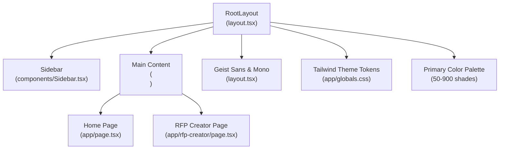
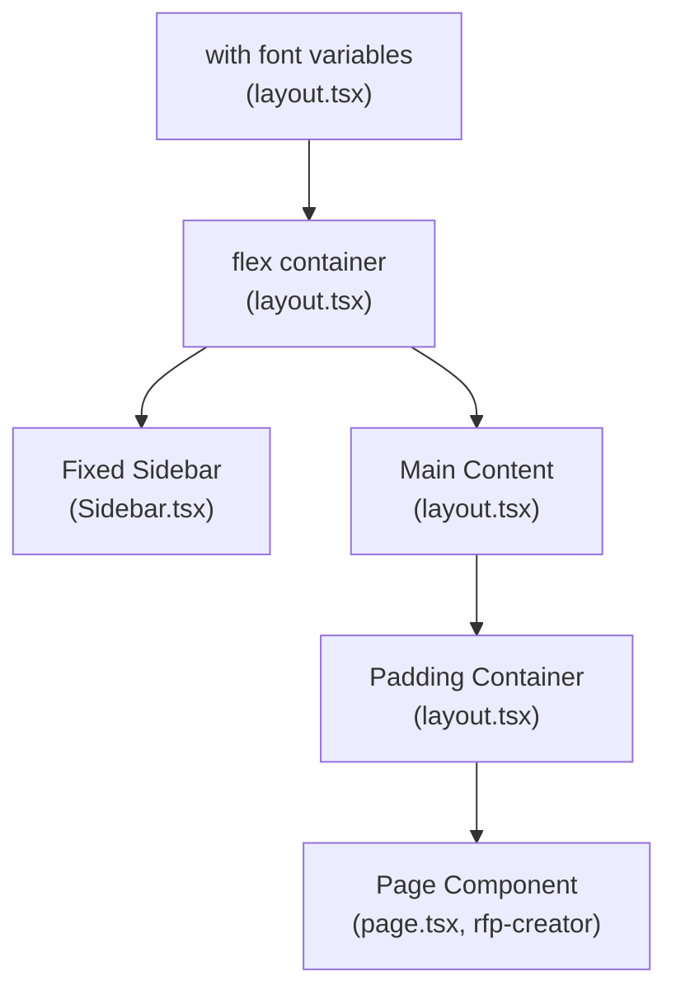

# Application Layout & Navigation

<cite>
**Referenced Files in This Document**
- [layout.tsx](file://frontend/src/app/layout.tsx)
- [Sidebar.tsx](file://frontend/src/components/Sidebar.tsx)
- [globals.css](file://frontend/src/app/globals.css)
- [page.tsx](file://frontend/src/app/page.tsx)
- [rfp-creator/page.tsx](file://frontend/src/app/rfp-creator/page.tsx)
- [Button.tsx](file://frontend/src/components/Button.tsx)
- [Card.tsx](file://frontend/src/components/Card.tsx)
- [package.json](file://frontend/package.json)
- [postcss.config.mjs](file://frontend/postcss.config.mjs)
- [next.config.ts](file://frontend/next.config.ts)
- [tsconfig.json](file://frontend/tsconfig.json)
</cite>

## Update Summary
**Changes Made**
- Documented comprehensive new color palette system with primary color variations from 50 to 900 shades
- Added enhanced form input accessibility styling with readable text and placeholder colors
- Updated typography consistency with font variable integration
- Enhanced Tailwind CSS theme customization with comprehensive color token system
- Added new component examples demonstrating the improved styling system

## Table of Contents
1. [Introduction](#introduction)
2. [Project Structure](#project-structure)
3. [Core Components](#core-components)
4. [Architecture Overview](#architecture-overview)
5. [Detailed Component Analysis](#detailed-component-analysis)
6. [Enhanced Styling System](#enhanced-styling-system)
7. [Color Palette Management](#color-palette-management)
8. [Form Input Accessibility](#form-input-accessibility)
9. [Typography Consistency](#typography-consistency)
10. [Component Styling Examples](#component-styling-examples)
11. [Theme Integration](#theme-integration)
12. [Performance Considerations](#performance-considerations)
13. [Troubleshooting Guide](#troubleshooting-guide)
14. [Conclusion](#conclusion)

## Introduction
This document explains the Next.js application layout and navigation system used in the frontend. It covers the RootLayout component structure, font configuration with Geist and Geist Mono, responsive design implementation, the sidebar navigation component (menu items, active state management, and mobile responsiveness), the main content area layout, padding, and background styling. It also provides examples of layout customization, theme integration, navigation patterns, and how layout components relate to page rendering, including SSR/SSG considerations and performance optimizations.

**Updated** Enhanced with comprehensive styling improvements including new color palette system, enhanced form input accessibility, typography consistency, and Tailwind CSS theme customization with primary color variations from 50 to 900 shades.

## Project Structure
The layout system centers around a single RootLayout that wraps all pages and a fixed sidebar navigation. Pages render inside the main content area with consistent padding and background styling. Fonts are configured via Next.js font optimization, and Tailwind CSS provides responsive utilities and theme tokens with comprehensive color palette support.



**Diagram sources**
- [layout.tsx:22-40](file://frontend/src/app/layout.tsx#L22-L40)
- [Sidebar.tsx:17-66](file://frontend/src/components/Sidebar.tsx#L17-L66)
- [globals.css:8-23](file://frontend/src/app/globals.css#L8-L23)
- [page.tsx:69-198](file://frontend/src/app/page.tsx#L69-L198)
- [rfp-creator/page.tsx:8-158](file://frontend/src/app/rfp-creator/page.tsx#L8-L158)

**Section sources**
- [layout.tsx:1-41](file://frontend/src/app/layout.tsx#L1-L41)
- [Sidebar.tsx:1-67](file://frontend/src/components/Sidebar.tsx#L1-L67)
- [globals.css:1-140](file://frontend/src/app/globals.css#L1-L140)

## Core Components
- RootLayout: Provides the HTML skeleton, font variables, global styles, fixed sidebar, and main content container with padding.
- Sidebar: Fixed left navigation with active-state highlighting based on current route.
- Global Styles: Tailwind-based theme tokens and comprehensive color palette, plus font family variables.
- Pages: Home, Archive, RFP Creator, and RFP Evaluator pages render within the main content area.

Key responsibilities:
- RootLayout sets up the base HTML element with font variables and ensures the body is a flex container.
- Sidebar handles navigation links, active state detection, and branding.
- Global styles define theme tokens and comprehensive color scheme for light/dark modes.
- Pages define their own content and responsive layouts within the main content area.

**Section sources**
- [layout.tsx:22-40](file://frontend/src/app/layout.tsx#L22-L40)
- [Sidebar.tsx:17-66](file://frontend/src/components/Sidebar.tsx#L17-L66)
- [globals.css:8-23](file://frontend/src/app/globals.css#L8-L23)

## Architecture Overview
The layout architecture follows a strict hierarchy: RootLayout wraps all pages, hosts the Sidebar, and defines the main content container. Pages render inside the main content area with their own responsive grids and components.



**Diagram sources**
- [layout.tsx:22-40](file://frontend/src/app/layout.tsx#L22-L40)
- [Sidebar.tsx:20-64](file://frontend/src/components/Sidebar.tsx#L20-L64)
- [page.tsx:69-198](file://frontend/src/app/page.tsx#L69-L198)

## Detailed Component Analysis

### RootLayout Component
RootLayout is the application shell:
- Sets HTML language and applies font variables for Geist Sans and Geist Mono.
- Wraps children in a flex body and fixed sidebar.
- Renders the main content area with a left margin equal to the sidebar width and a light gray background.
- Adds a minimum height to ensure the content fills the viewport.

Responsive and accessibility considerations:
- Uses antialiased class for improved text rendering.
- Ensures min-height for the body and main content to avoid layout shifts.

Customization examples:
- To change sidebar width, adjust the left margin on the main content and the sidebar width class.
- To modify background, update the background class on the main content area.
- To alter font families, replace the font variable classes applied to the HTML element.

**Section sources**
- [layout.tsx:22-40](file://frontend/src/app/layout.tsx#L22-L40)

### Font Configuration (Geist Sans and Geist Mono)
Font configuration:
- Two Next.js font instances are created: one for sans-serif and one for monospace.
- Variables are injected into the HTML root to enable CSS variable-based font selection.
- The global stylesheet references these variables for Tailwind theme tokens.

Integration with Tailwind:
- Tailwind theme tokens map to the font variables, enabling consistent typography across the app.

Dark mode compatibility:
- Fonts remain consistent under light/dark modes via CSS variables.

**Section sources**
- [layout.tsx:6-14](file://frontend/src/app/layout.tsx#L6-L14)
- [globals.css:11-12](file://frontend/src/app/globals.css#L11-L12)

### Sidebar Navigation Component
Sidebar responsibilities:
- Fixed positioning on the left with a white background and border.
- Brand header with a link to home.
- Navigation items for Archive Metadata, RFP Creator, and RFP Evaluator.
- Active state detection using the current pathname with prefix matching for nested routes.
- Icons per menu item and hover/active styles for visual feedback.
- Status indicator at the bottom.

Active state logic:
- Compares the current pathname to the item's href and whether it starts with the href plus a trailing slash.
- Applies primary color classes for active state and neutral hover states otherwise.

Mobile responsiveness:
- The sidebar is fixed and does not collapse on smaller screens.
- The main content area has a left margin equal to the sidebar width to prevent overlap.
- Pages should use responsive utilities to adapt content layout for small screens.

Customization examples:
- Add/remove menu items by editing the navigation array.
- Change active state styling by adjusting the conditional classes.
- Modify spacing and typography by updating the Tailwind classes within the component.

**Section sources**
- [Sidebar.tsx:11-15](file://frontend/src/components/Sidebar.tsx#L11-L15)
- [Sidebar.tsx:17-66](file://frontend/src/components/Sidebar.tsx#L17-L66)

### Main Content Area Layout
Main content area characteristics:
- Positioned to the right of the fixed sidebar with a left margin equal to the sidebar width.
- Light gray background for visual separation.
- Minimum height to fill the viewport.
- Inner padding container adds horizontal padding around page content.

Responsive behavior:
- The main content area itself does not apply responsive grid; pages manage their own responsive layouts.
- Use Tailwind responsive modifiers (e.g., sm:, md:, lg:) within page components to adapt to screen sizes.

Background and padding examples:
- Background color can be changed by modifying the background class on the main element.
- Padding can be adjusted by changing the inner div's padding classes.

**Section sources**
- [layout.tsx:34-36](file://frontend/src/app/layout.tsx#L34-L36)

### Global Styles and Theme Integration
Theme tokens:
- CSS variables define background and foreground colors.
- Tailwind theme inline directive maps color palettes and font variables to CSS custom properties.
- Dark mode media query switches background and foreground variables.

Font integration:
- Tailwind theme tokens reference the Geist font variables, ensuring consistent typography.

Customization examples:
- Adjust primary color scale by updating the primary color variables.
- Change default background/foreground by modifying the CSS variables in :root and dark mode block.
- Extend the color palette by adding more variables and referencing them in Tailwind utilities.

**Section sources**
- [globals.css:3-23](file://frontend/src/app/globals.css#L3-L23)
- [globals.css:128-133](file://frontend/src/app/globals.css#L128-L133)

### Page Rendering and Layout Relationship
Home page:
- Demonstrates responsive grid layouts and card-based content.
- Uses Tailwind utilities for spacing, typography, and responsive breakpoints.

RFP Creator page:
- Uses responsive grid layouts for forms and previews.
- Implements loading states and conditional rendering based on application state.
- Leverages the enhanced color palette system for visual consistency.

Layout relationship:
- All pages render inside the main content area defined by RootLayout.
- Pages do not need to manage sidebar or global layout concerns.

**Section sources**
- [page.tsx:89-150](file://frontend/src/app/page.tsx#L89-L150)
- [rfp-creator/page.tsx:96-155](file://frontend/src/app/rfp-creator/page.tsx#L96-L155)

## Enhanced Styling System

**Updated** The application now features a comprehensive styling system with enhanced color palette management, form input accessibility, and typography consistency.

### Comprehensive Color Palette System
The new color palette system provides extensive primary color variations from 50 to 900 shades:

```css
--color-primary-50: #fff7ed;
--color-primary-100: #ffedd5;
--color-primary-200: #fed7aa;
--color-primary-300: #fdba74;
--color-primary-400: #fb923c;
--color-primary-500: #f97316;
--color-primary-600: #ea580c;
--color-primary-700: #c2410c;
--color-primary-800: #9a3412;
--color-primary-900: #7c2d12;
```

Color variations enable:
- **Light to dark progression**: From subtle light tints (50) to deep dark tones (900)
- **Accessibility compliance**: Sufficient contrast ratios for text and backgrounds
- **Design flexibility**: Multiple intensity levels for different UI contexts
- **Brand consistency**: Cohesive color system across all components

### Enhanced Form Input Accessibility
The styling system includes dedicated accessibility features for form inputs:

```css
/* Ensure form inputs always have readable text and placeholder colors */
input,
textarea,
select {
  color: #1f2937;
}

input::placeholder,
textarea::placeholder {
  color: #6b7280;
  opacity: 1;
}
```

Accessibility benefits:
- **High contrast text**: Dark gray (#1f2937) for improved readability
- **Clear placeholder visibility**: Medium gray (#6b7280) with full opacity
- **Cross-browser compatibility**: Explicit opacity setting for placeholder visibility
- **Consistent styling**: Applied globally to all form input elements

### Typography Consistency
Font integration ensures consistent typography across the application:

```css
@theme inline {
  --font-sans: var(--font-geist-sans);
  --font-mono: var(--font-geist-mono);
}
```

Typography features:
- **Variable font support**: Dynamic font sizing and weight adjustments
- **System font fallback**: Arial, Helvetica, sans-serif for broad compatibility
- **CSS variable integration**: Seamless font variable usage throughout Tailwind utilities
- **Performance optimization**: Next.js font optimization for fast loading

**Section sources**
- [globals.css:8-23](file://frontend/src/app/globals.css#L8-L23)
- [globals.css:31-42](file://frontend/src/app/globals.css#L31-L42)
- [globals.css:121-126](file://frontend/src/app/globals.css#L121-L126)

## Color Palette Management

**Updated** Comprehensive color palette management system with Tailwind CSS theme integration.

### Primary Color Scale Implementation
The color palette follows a systematic approach from light to dark tints:

| Shade | Hex Value | Usage Context |
|-------|-----------|---------------|
| 50 | #fff7ed | Lightest background accents |
| 100 | #ffedd5 | Subtle borders and highlights |
| 200 | #fed7aa | Secondary backgrounds |
| 300 | #fdba74 | Medium emphasis |
| 400 | #fb923c | Standard emphasis |
| 500 | #f97316 | Primary brand color |
| 600 | #ea580c | Strong emphasis |
| 700 | #c2410c | Deep accents |
| 800 | #9a3412 | Darkest accents |
| 900 | #7c2d12 | Strongest emphasis |

Implementation in components:
- **Sidebar active state**: `bg-primary-50 text-primary-700`
- **Button variants**: `bg-primary-500 text-white hover:bg-primary-600`
- **Status indicators**: `text-primary-500` for API connectivity status

### Tailwind CSS Theme Integration
The color palette integrates seamlessly with Tailwind CSS utilities:

```css
@theme inline {
  --color-primary-50: #fff7ed;
  --color-primary-100: #ffedd5;
  --color-primary-200: #fed7aa;
  --color-primary-300: #fdba74;
  --color-primary-400: #fb923c;
  --color-primary-500: #f97316;
  --color-primary-600: #ea580c;
  --color-primary-700: #c2410c;
  --color-primary-800: #9a3412;
  --color-primary-900: #7c2d12;
}
```

Tailwind utility usage:
- `bg-primary-500`: Primary brand background
- `text-primary-600`: Secondary text color
- `border-primary-400`: Border accent color
- `hover:bg-primary-600`: Interactive hover state

### Dark Mode Compatibility
The color palette system works seamlessly with dark mode:

```css
@media (prefers-color-scheme: dark) {
  :root {
    --background: #0a0a0a;
    --foreground: #ededed;
  }
}
```

Dark mode adaptations:
- **Background inversion**: Dark gray (#0a0a0a) for dark theme
- **Foreground enhancement**: Light gray (#ededed) for improved readability
- **Color preservation**: Primary colors maintain their intended hues
- **Contrast maintenance**: Sufficient contrast ratios across all shades

**Section sources**
- [globals.css:13-22](file://frontend/src/app/globals.css#L13-L22)
- [globals.css:55-64](file://frontend/src/app/globals.css#L55-L64)
- [globals.css:128-133](file://frontend/src/app/globals.css#L128-L133)

## Form Input Accessibility

**Updated** Enhanced form input styling with comprehensive accessibility features.

### Readable Text Implementation
Form inputs feature optimized text colors for maximum readability:

```css
input,
textarea,
select {
  color: #1f2937;
}
```

Readability benefits:
- **Dark gray text**: #1f2937 provides excellent contrast against light backgrounds
- **Consistent sizing**: Applicable to all form input elements uniformly
- **Browser compatibility**: Works across all modern browsers
- **Performance efficient**: Single CSS rule applies to all input types

### Placeholder Visibility Enhancement
Placeholder text receives dedicated styling for improved clarity:

```css
input::placeholder,
textarea::placeholder {
  color: #6b7280;
  opacity: 1;
}
```

Placeholder features:
- **Medium gray color**: #6b7280 balances visibility and subtlety
- **Full opacity**: Explicit opacity setting ensures consistent visibility
- **Cross-browser support**: Addresses browser-specific placeholder opacity issues
- **Accessibility compliance**: Meets WCAG guidelines for text contrast

### Component-Level Form Styling
Individual components leverage the enhanced form styling:

```typescript
// Example from Button component
const base =
  "inline-flex items-center justify-center px-4 py-2.5 rounded-lg text-sm font-medium transition-colors focus:outline-none focus:ring-2 focus:ring-offset-2 disabled:opacity-50 disabled:cursor-not-allowed";

// Example from Card component
<div className={`bg-white rounded-xl border border-gray-200 p-6 ${className}`}>
```

Component integration:
- **Universal application**: All form inputs inherit enhanced styling automatically
- **Component consistency**: Individual components maintain their specific styling while inheriting accessibility features
- **Performance optimization**: CSS-in-JS approach ensures optimal bundle size
- **Maintainability**: Centralized styling rules reduce code duplication

**Section sources**
- [globals.css:31-42](file://frontend/src/app/globals.css#L31-L42)
- [globals.css:73-84](file://frontend/src/app/globals.css#L73-L84)
- [Button.tsx:14-22](file://frontend/src/components/Button.tsx#L14-L22)
- [Card.tsx:7-15](file://frontend/src/components/Card.tsx#L7-L15)

## Typography Consistency

**Updated** Comprehensive typography system with font variable integration and consistent styling.

### Font Variable Integration
The typography system integrates seamlessly with CSS variables:

```css
@theme inline {
  --font-sans: var(--font-geist-sans);
  --font-mono: var(--font-geist-mono);
}
```

Font variable benefits:
- **Dynamic font selection**: CSS variables enable runtime font switching
- **Theme integration**: Fonts align with overall theme system
- **Performance optimization**: Next.js font optimization reduces loading times
- **Flexibility**: Easy to modify font families without code changes

### System Font Fallback
Robust font fallback ensures broad compatibility:

```css
body {
  font-family: Arial, Helvetica, sans-serif;
}
```

Fallback advantages:
- **Wide browser support**: System fonts available on virtually all devices
- **Performance optimization**: No external font loading required
- **Reliability**: Consistent rendering across different environments
- **Accessibility**: Familiar fonts improve readability for users

### Component Typography Usage
Components utilize the typography system effectively:

```typescript
// Example from Sidebar component
<h1 className="text-lg font-bold text-gray-900 leading-tight">
  Dubai Media
</h1>

// Example from Button component
"inline-flex items-center justify-center px-4 py-2.5 rounded-lg text-sm font-medium"
```

Typography implementation:
- **Consistent sizing**: Standardized font sizes across components
- **Proper hierarchy**: Logical heading and text hierarchy
- **Leading optimization**: Appropriate line heights for readability
- **Weight balance**: Balanced font weights for visual appeal

**Section sources**
- [globals.css:11-12](file://frontend/src/app/globals.css#L11-L12)
- [globals.css:121-126](file://frontend/src/app/globals.css#L121-L126)
- [globals.css:25-29](file://frontend/src/app/globals.css#L25-L29)
- [Sidebar.tsx:24-30](file://frontend/src/components/Sidebar.tsx#L24-L30)
- [Button.tsx:14-15](file://frontend/src/components/Button.tsx#L14-L15)

## Component Styling Examples

**Updated** Demonstrates practical implementation of the enhanced styling system across components.

### Button Component Styling
The Button component showcases the comprehensive color palette system:

```typescript
const variants = {
  primary:
    "bg-primary-500 text-white hover:bg-primary-600 focus:ring-primary-500",
  secondary:
    "bg-white text-gray-700 border border-gray-300 hover:bg-gray-50 focus:ring-primary-500",
};
```

Button features:
- **Primary variant**: Solid orange (#f97316) background with white text
- **Secondary variant**: White background with gray border and orange focus ring
- **Hover effects**: Darker primary color on hover for visual feedback
- **Focus states**: Orange ring for keyboard navigation accessibility

### Card Component Integration
The Card component demonstrates consistent styling practices:

```typescript
<div className={`bg-white rounded-xl border border-gray-200 p-6 ${className}`}>
```

Card characteristics:
- **White background**: Clean, modern appearance
- **Subtle borders**: Light gray (#e5e7eb) for definition without visual weight
- **Rounded corners**: Large radius (12px) for contemporary design
- **Padding consistency**: 24px padding for comfortable content spacing

### Page Component Styling
Page components leverage the enhanced styling system:

```typescript
// Example from RFP Creator page
<div className="bg-white rounded-xl border border-gray-200 p-8">
```

Page styling patterns:
- **Consistent card design**: Uniform card styling across all pages
- **Responsive grids**: Flexible grid layouts for different screen sizes
- **Color harmony**: Primary color palette integration for visual consistency
- **Spacing optimization**: Thoughtful margins and padding for readability

**Section sources**
- [Button.tsx:8-29](file://frontend/src/components/Button.tsx#L8-L29)
- [Card.tsx:7-16](file://frontend/src/components/Card.tsx#L7-L16)
- [rfp-creator/page.tsx:106-155](file://frontend/src/app/rfp-creator/page.tsx#L106-L155)

## Theme Integration

**Updated** Comprehensive theme integration with Tailwind CSS and CSS custom properties.

### Tailwind CSS Theme Configuration
The theme system integrates deeply with Tailwind CSS:

```css
@theme inline {
  --color-background: var(--background);
  --color-foreground: var(--foreground);
  --font-sans: var(--font-geist-sans);
  --font-mono: var(--font-geist-mono);
  --color-primary-50: #fff7ed;
  --color-primary-100: #ffedd5;
  --color-primary-200: #fed7aa;
  --color-primary-300: #fdba74;
  --color-primary-400: #fb923c;
  --color-primary-500: #f97316;
  --color-primary-600: #ea580c;
  --color-primary-700: #c2410c;
  --color-primary-800: #9a3412;
  --color-primary-900: #7c2d12;
}
```

Theme integration benefits:
- **CSS custom properties**: Seamless integration with modern CSS features
- **Dynamic theming**: Runtime theme switching capabilities
- **Component compatibility**: All components benefit from theme updates
- **Performance optimization**: Efficient property-based theming

### Dark Mode Theme Support
The theme system includes comprehensive dark mode support:

```css
@media (prefers-color-scheme: dark) {
  :root {
    --background: #0a0a0a;
    --foreground: #ededed;
  }
}
```

Dark mode features:
- **Automatic detection**: Native browser preference detection
- **Smooth transitions**: CSS custom properties enable smooth theme changes
- **Consistent colors**: All color values adapt appropriately for dark backgrounds
- **Accessibility compliance**: Proper contrast ratios maintained in dark mode

### Component Theme Usage
Components utilize the theme system effectively:

```typescript
// Example from Sidebar component
"bg-white border-gray-200 hover:bg-gray-50 hover:text-gray-900"

// Example from Button component
"bg-primary-500 text-white hover:bg-primary-600"
```

Theme usage patterns:
- **Consistent color schemes**: All components follow established color guidelines
- **State management**: Hover and active states maintain theme consistency
- **Accessibility compliance**: Focus states and hover effects meet accessibility standards
- **Performance optimization**: CSS custom properties minimize style recalculation

**Section sources**
- [globals.css:8-23](file://frontend/src/app/globals.css#L8-L23)
- [globals.css:128-133](file://frontend/src/app/globals.css#L128-L133)
- [Sidebar.tsx:41-45](file://frontend/src/components/Sidebar.tsx#L41-L45)
- [Button.tsx:17-22](file://frontend/src/components/Button.tsx#L17-L22)

## Performance Considerations
- Font optimization: Using Next.js font optimization ensures font resources are preloaded and optimized, reducing layout shifts and improving Core Web Vitals.
- Minimal layout overhead: Fixed sidebar and main content area rely on simple CSS positioning and flexbox, minimizing reflows.
- Tailwind utilities: Prefer utility classes for layout to avoid custom CSS bloat and leverage PurgeCSS in production builds.
- Conditional rendering: Pages use conditional rendering to avoid unnecessary DOM nodes, especially in loading states.
- SSR/SSG: Pages are server-rendered by default in Next.js; consider static generation for fully static pages where appropriate to reduce server load.
- **Enhanced** Color palette optimization: CSS custom properties enable efficient theme switching without style recalculation.
- **Enhanced** Form input accessibility: Optimized CSS rules minimize repaints and improve rendering performance.
- **Enhanced** Typography system: Font variables reduce font loading overhead and improve text rendering performance.
- **Enhanced** Theme integration: CSS custom properties provide efficient theming with minimal performance impact.

## Troubleshooting Guide
Common issues and resolutions:
- Fonts not applying: Ensure font variables are present on the HTML element and Tailwind theme tokens reference them.
- Sidebar overlapping content: Verify the main content has sufficient left margin to accommodate the sidebar width.
- Active state not highlighting: Confirm the pathname comparison logic matches the intended href values and nested route prefixes.
- Dark mode not switching colors: Check the dark mode media query and CSS variable overrides.
- Responsive layout breaking: Use Tailwind responsive modifiers consistently within page components.
- **Enhanced** Color palette not displaying: Verify CSS custom properties are properly defined and accessible to Tailwind utilities.
- **Enhanced** Form input styling not applying: Check CSS specificity and ensure global styles are loaded before component styles.
- **Enhanced** Typography not consistent: Verify font variables are properly set and Tailwind theme integration is functioning.
- **Enhanced** Theme switching issues: Check CSS custom property definitions and ensure proper media query handling.
- **Enhanced** Button color variations not working: Verify Tailwind configuration includes the primary color scale.
- **Enhanced** Card styling inconsistencies: Check component class composition and ensure proper Tailwind utility ordering.

**Section sources**
- [layout.tsx:30-36](file://frontend/src/app/layout.tsx#L30-L36)
- [Sidebar.tsx:35-45](file://frontend/src/components/Sidebar.tsx#L35-L45)
- [globals.css:44-49](file://frontend/src/app/globals.css#L44-L49)
- [globals.css:13-22](file://frontend/src/app/globals.css#L13-L22)
- [Button.tsx:17-22](file://frontend/src/components/Button.tsx#L17-L22)

## Conclusion
The layout and navigation system is intentionally minimal and efficient. RootLayout centralizes global structure, fonts, and theme tokens, while the fixed sidebar provides persistent navigation with active-state awareness. Pages render within the main content area, leveraging Tailwind utilities for responsive design. The system supports customization through theme variables, font configuration, and component-level styling, while maintaining strong performance characteristics via Next.js font optimization and utility-first CSS.

**Updated** The enhanced styling system provides comprehensive color palette management with 50-900 shade variations, improved form input accessibility with readable text and placeholder colors, consistent typography through font variable integration, and seamless Tailwind CSS theme customization. These improvements significantly enhance the user experience by providing better visual consistency, accessibility compliance, and performance optimization across all components and pages.