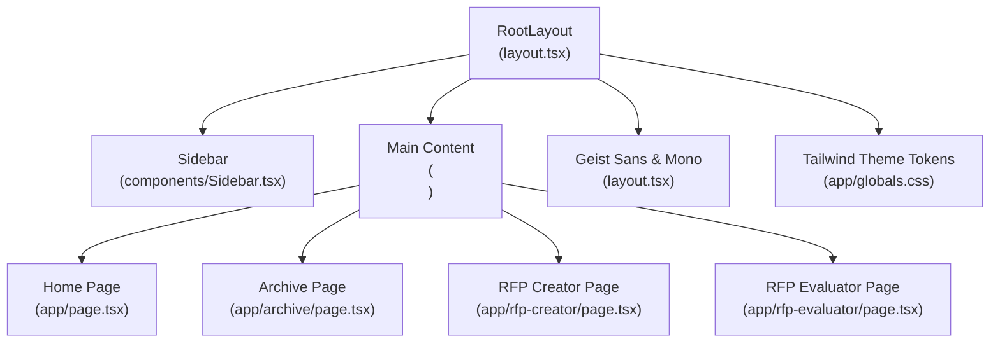
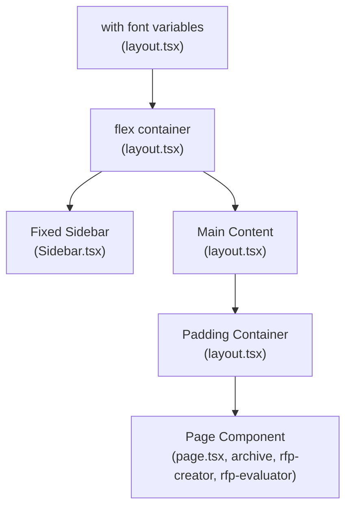
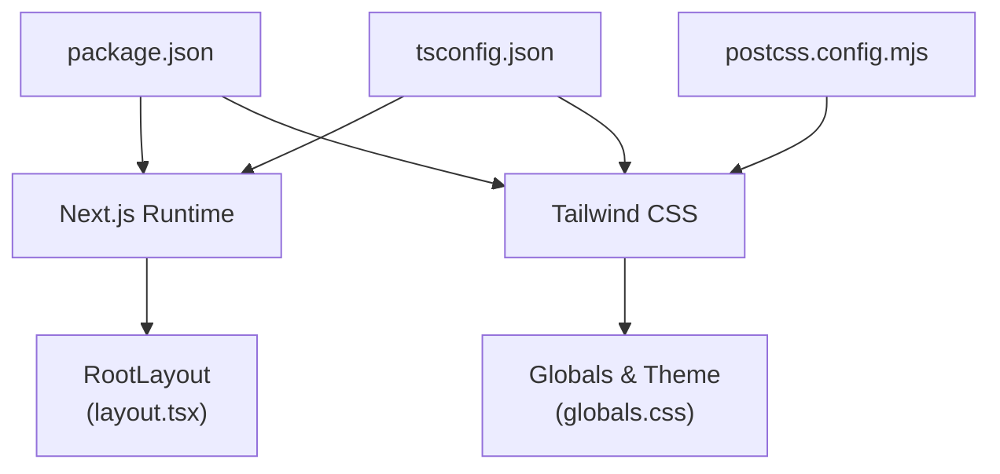

# Application Layout & Navigation

<cite>
**Referenced Files in This Document**
- [layout.tsx](file://frontend/src/app/layout.tsx)
- [Sidebar.tsx](file://frontend/src/components/Sidebar.tsx)
- [globals.css](file://frontend/src/app/globals.css)
- [page.tsx](file://frontend/src/app/page.tsx)
- [archive/page.tsx](file://frontend/src/app/archive/page.tsx)
- [rfp-creator/page.tsx](file://frontend/src/app/rfp-creator/page.tsx)
- [rfp-evaluator/page.tsx](file://frontend/src/app/rfp-evaluator/page.tsx)
- [SearchDemo.tsx](file://frontend/src/components/archive/SearchDemo.tsx)
- [TranscriptPanel.tsx](file://frontend/src/components/archive/TranscriptPanel.tsx)
- [useVideoProcessing.ts](file://frontend/src/lib/useVideoProcessing.ts)
- [package.json](file://frontend/package.json)
- [postcss.config.mjs](file://frontend/postcss.config.mjs)
- [next.config.ts](file://frontend/next.config.ts)
- [tsconfig.json](file://frontend/tsconfig.json)
</cite>

## Update Summary
**Changes Made**
- Enhanced timestamp handling with improved parseTimestamp() function in archive page
- Improved formatTimestamp() function in SearchDemo component with better fallback handling
- Enhanced person name display with better fallback handling for unknown persons
- Added robust timestamp parsing for various formats (seconds, MM:SS, HH:MM:SS)
- Improved person identification with automatic naming for unnamed individuals

## Table of Contents
1. [Introduction](#introduction)
2. [Project Structure](#project-structure)
3. [Core Components](#core-components)
4. [Architecture Overview](#architecture-overview)
5. [Detailed Component Analysis](#detailed-component-analysis)
6. [Enhanced Timestamp Handling System](#enhanced-timestamp-handling-system)
7. [Improved Person Name Display](#improved-person-name-display)
8. [Dependency Analysis](#dependency-analysis)
9. [Performance Considerations](#performance-considerations)
10. [Troubleshooting Guide](#troubleshooting-guide)
11. [Conclusion](#conclusion)

## Introduction
This document explains the Next.js application layout and navigation system used in the frontend. It covers the RootLayout component structure, font configuration with Geist and Geist Mono, responsive design implementation, the sidebar navigation component (menu items, active state management, and mobile responsiveness), the main content area layout, padding, and background styling. It also provides examples of layout customization, theme integration, navigation patterns, and how layout components relate to page rendering, including SSR/SSG considerations and performance optimizations.

**Updated** Enhanced with improved timestamp handling capabilities and better person name display with fallback mechanisms for unknown individuals.

## Project Structure
The layout system centers around a single RootLayout that wraps all pages and a fixed sidebar navigation. Pages render inside the main content area with consistent padding and background styling. Fonts are configured via Next.js font optimization, and Tailwind CSS provides responsive utilities and theme tokens.



**Diagram sources**
- [layout.tsx:22-40](file://frontend/src/app/layout.tsx#L22-L40)
- [Sidebar.tsx:17-66](file://frontend/src/components/Sidebar.tsx#L17-L66)
- [globals.css:1-56](file://frontend/src/app/globals.css#L1-L56)
- [page.tsx:69-198](file://frontend/src/app/page.tsx#L69-L198)
- [archive/page.tsx:12-128](file://frontend/src/app/archive/page.tsx#L12-L128)
- [rfp-creator/page.tsx:8-158](file://frontend/src/app/rfp-creator/page.tsx#L8-L158)
- [rfp-evaluator/page.tsx:18-177](file://frontend/src/app/rfp-evaluator/page.tsx#L18-L177)

**Section sources**
- [layout.tsx:1-41](file://frontend/src/app/layout.tsx#L1-L41)
- [Sidebar.tsx:1-67](file://frontend/src/components/Sidebar.tsx#L1-L67)
- [globals.css:1-56](file://frontend/src/app/globals.css#L1-L56)

## Core Components
- RootLayout: Provides the HTML skeleton, font variables, global styles, fixed sidebar, and main content container with padding.
- Sidebar: Fixed left navigation with active-state highlighting based on current route.
- Global Styles: Tailwind-based theme tokens and color palette, plus font family variables.
- Pages: Home, Archive, RFP Creator, and RFP Evaluator pages render within the main content area.

Key responsibilities:
- RootLayout sets up the base HTML element with font variables and ensures the body is a flex container.
- Sidebar handles navigation links, active state detection, and branding.
- Global styles define theme tokens and color scheme for light/dark modes.
- Pages define their own content and responsive layouts within the main content area.

**Section sources**
- [layout.tsx:22-40](file://frontend/src/app/layout.tsx#L22-L40)
- [Sidebar.tsx:17-66](file://frontend/src/components/Sidebar.tsx#L17-L66)
- [globals.css:8-49](file://frontend/src/app/globals.css#L8-L49)

## Architecture Overview
The layout architecture follows a strict hierarchy: RootLayout wraps all pages, hosts the Sidebar, and defines the main content container. Pages render inside the main content area with their own responsive grids and components.



**Diagram sources**
- [layout.tsx:22-40](file://frontend/src/app/layout.tsx#L22-L40)
- [Sidebar.tsx:20-64](file://frontend/src/components/Sidebar.tsx#L20-L64)
- [page.tsx:69-198](file://frontend/src/app/page.tsx#L69-L198)

## Detailed Component Analysis

### RootLayout Component
RootLayout is the application shell:
- Sets HTML language and applies font variables for Geist Sans and Geist Mono.
- Wraps children in a flex body and fixed sidebar.
- Renders the main content area with a left margin equal to the sidebar width and a light gray background.
- Adds a minimum height to ensure the content fills the viewport.

Responsive and accessibility considerations:
- Uses antialiased class for improved text rendering.
- Ensures min-height for the body and main content to avoid layout shifts.

Customization examples:
- To change sidebar width, adjust the left margin on the main content and the sidebar width class.
- To modify background, update the background class on the main content area.
- To alter font families, replace the font variable classes applied to the HTML element.

**Section sources**
- [layout.tsx:22-40](file://frontend/src/app/layout.tsx#L22-L40)

### Font Configuration (Geist Sans and Geist Mono)
Font configuration:
- Two Next.js font instances are created: one for sans-serif and one for monospace.
- Variables are injected into the HTML root to enable CSS variable-based font selection.
- The global stylesheet references these variables for Tailwind theme tokens.

Integration with Tailwind:
- Tailwind theme tokens map to the font variables, enabling consistent typography across the app.

Dark mode compatibility:
- Fonts remain consistent under light/dark modes via CSS variables.

**Section sources**
- [layout.tsx:6-14](file://frontend/src/app/layout.tsx#L6-L14)
- [globals.css:11-12](file://frontend/src/app/globals.css#L11-L12)

### Sidebar Navigation Component
Sidebar responsibilities:
- Fixed positioning on the left with a white background and border.
- Brand header with a link to home.
- Navigation items for Archive Metadata, RFP Creator, and RFP Evaluator.
- Active state detection using the current pathname with prefix matching for nested routes.
- Icons per menu item and hover/active styles for visual feedback.
- Status indicator at the bottom.

Active state logic:
- Compares the current pathname to the item's href and whether it starts with the href plus a trailing slash.
- Applies primary color classes for active state and neutral hover states otherwise.

Mobile responsiveness:
- The sidebar is fixed and does not collapse on smaller screens.
- The main content area has a left margin equal to the sidebar width to prevent overlap.
- Pages should use responsive utilities to adapt content layout for small screens.

Customization examples:
- Add/remove menu items by editing the navigation array.
- Change active state styling by adjusting the conditional classes.
- Modify spacing and typography by updating the Tailwind classes within the component.

**Section sources**
- [Sidebar.tsx:11-15](file://frontend/src/components/Sidebar.tsx#L11-L15)
- [Sidebar.tsx:17-66](file://frontend/src/components/Sidebar.tsx#L17-L66)

### Main Content Area Layout
Main content area characteristics:
- Positioned to the right of the fixed sidebar with a left margin equal to the sidebar width.
- Light gray background for visual separation.
- Minimum height to fill the viewport.
- Inner padding container adds horizontal padding around page content.

Responsive behavior:
- The main content area itself does not apply responsive grid; pages manage their own responsive layouts.
- Use Tailwind responsive modifiers (e.g., sm:, md:, lg:) within page components to adapt to screen sizes.

Background and padding examples:
- Background color can be changed by modifying the background class on the main element.
- Padding can be adjusted by changing the inner div's padding classes.

**Section sources**
- [layout.tsx:34-36](file://frontend/src/app/layout.tsx#L34-L36)

### Global Styles and Theme Integration
Theme tokens:
- CSS variables define background and foreground colors.
- Tailwind theme inline directive maps color palettes and font variables to CSS custom properties.
- Dark mode media query switches background and foreground variables.

Font integration:
- Tailwind theme tokens reference the Geist font variables, ensuring consistent typography.

Customization examples:
- Adjust primary color scale by updating the primary color variables.
- Change default background/foreground by modifying the CSS variables in :root and dark mode block.
- Extend the color palette by adding more variables and referencing them in Tailwind utilities.

**Section sources**
- [globals.css:3-23](file://frontend/src/app/globals.css#L3-L23)
- [globals.css:37-49](file://frontend/src/app/globals.css#L37-L49)

### Page Rendering and Layout Relationship
Home page:
- Demonstrates responsive grid layouts and card-based content.
- Uses Tailwind utilities for spacing, typography, and responsive breakpoints.

Archive page:
- Responsive two-column layout on larger screens and stacked layout on smaller screens.
- Uses grid utilities to split content areas.
- Implements enhanced timestamp parsing for video seeking functionality.

RFP Creator and RFP Evaluator pages:
- Both use responsive grid layouts for forms and previews.
- Implement loading states and conditional rendering based on application state.

Layout relationship:
- All pages render inside the main content area defined by RootLayout.
- Pages do not need to manage sidebar or global layout concerns.

**Section sources**
- [page.tsx:89-150](file://frontend/src/app/page.tsx#L89-L150)
- [archive/page.tsx:84-110](file://frontend/src/app/archive/page.tsx#L84-L110)
- [rfp-creator/page.tsx:96-155](file://frontend/src/app/rfp-creator/page.tsx#L96-L155)
- [rfp-evaluator/page.tsx:133-174](file://frontend/src/app/rfp-evaluator/page.tsx#L133-L174)

## Enhanced Timestamp Handling System

**Updated** The application now features a comprehensive timestamp handling system with robust parsing and formatting capabilities.

### Timestamp Parsing in Archive Page
The `parseTimestamp()` function in the Archive page provides flexible timestamp conversion:

```typescript
function parseTimestamp(value: unknown): number {
  if (typeof value === "number" && !isNaN(value)) return value;
  if (typeof value === "string") {
    // Try "HH:MM:SS" or "MM:SS"
    const parts = value.split(":").map(Number);
    if (parts.length === 3 && parts.every((p) => !isNaN(p))) {
      return parts[0] * 3600 + parts[1] * 60 + parts[2];
    }
    if (parts.length === 2 && parts.every((p) => !isNaN(p))) {
      return parts[0] * 60 + parts[1];
    }
    const parsed = parseFloat(value);
    if (!isNaN(parsed)) return parsed;
  }
  return 0;
}
```

Supported formats:
- **Seconds (number)**: Direct numeric conversion
- **"HH:MM:SS" (string)**: Hours, minutes, seconds format
- **"MM:SS" (string)**: Minutes, seconds format
- **Numeric string**: String representation of seconds
- **Fallback**: Returns 0 for invalid inputs

### Timestamp Formatting in Search Demo
The `formatTimestamp()` function provides consistent timestamp display:

```typescript
function formatTimestamp(value: unknown): string {
  // Handle string timestamps (e.g., "00:15", "1:30", "01:02:03")
  if (typeof value === "string") {
    if (/^\d{1,2}(:\d{2}){1,2}$/.test(value)) {
      return value;
    }
    // Try parsing as a number string
    const parsed = parseFloat(value);
    if (!isNaN(parsed)) {
      const m = Math.floor(parsed / 60);
      const s = Math.floor(parsed % 60);
      return `${m}:${s.toString().padStart(2, "0")}`;
    }
    return "0:00";
  }
  // Handle numeric seconds
  if (typeof value === "number" && !isNaN(value)) {
    const m = Math.floor(value / 60);
    const s = Math.floor(value % 60);
    return `${m}:${s.toString().padStart(2, "0")}`;
  }
  // Fallback for NaN, undefined, null, etc.
  return "0:00";
}
```

Display formats:
- **Direct string format**: Preserves "HH:MM:SS" or "MM:SS" formats
- **Numeric conversion**: Converts seconds to "M:SS" format with zero-padding
- **Fallback**: Always displays "0:00" for invalid inputs

### Transcript Panel Timestamp Handling
The TranscriptPanel component uses a simplified timestamp formatter:

```typescript
function formatTimestamp(seconds: number): string {
  const m = Math.floor(seconds / 60);
  const s = Math.floor(seconds % 60);
  return `${m}:${s.toString().padStart(2, "0")}`;
}
```

Integration points:
- **Video timeline seeking**: Uses parseTimestamp() for precise video navigation
- **Search result display**: Uses formatTimestamp() for readable timestamp presentation
- **Transcript segment navigation**: Uses formatTimestamp() for timestamp display

**Section sources**
- [archive/page.tsx:12-28](file://frontend/src/app/archive/page.tsx#L12-L28)
- [SearchDemo.tsx:15-38](file://frontend/src/components/archive/SearchDemo.tsx#L15-L38)
- [TranscriptPanel.tsx:30-34](file://frontend/src/components/archive/TranscriptPanel.tsx#L30-L34)

## Improved Person Name Display

**Updated** Enhanced person identification system with intelligent fallback handling for unknown individuals.

### Automatic Person Naming System
The useVideoProcessing hook implements sophisticated person name resolution:

```typescript
let unknownCount = 0;
const mappedFaces: DetectedFace[] = sourceFaces.map((face) => {
  // Map name_en → name, with fallback
  let name = (face.name_en as string) || (face.name as string) || "";
  if (!name) {
    unknownCount++;
    name = `Person ${unknownCount}`;
  }

  // Map appearances or synthesize from timestamp
  let appearances = face.appearances as { start: number; end: number }[] | undefined;
  if (!appearances || appearances.length === 0) {
    const ts = face.timestamp as string;
    if (ts) {
      const parts = ts.split(":");
      const seconds = (parseInt(parts[0] || "0") * 60) + parseInt(parts[1] || "0");
      appearances = [{ start: seconds, end: seconds + 15 }];
    } else {
      appearances = [];
    }
  }

  return {
    name,
    name_ar: (face.name_ar as string) || undefined,
    appearances,
    color: "",
  };
});
```

Name resolution priority:
1. **Primary**: `name_en` field (English name)
2. **Secondary**: `name` field (fallback name)
3. **Fallback**: Automatic naming as `Person 1`, `Person 2`, etc.

Appearance synthesis:
- **Direct appearances**: Uses existing appearance data
- **Timestamp synthesis**: Converts "MM:SS" timestamps to appearance ranges
- **Missing data**: Creates empty appearance arrays for unknown persons

### Search Demo Person Display
The SearchDemo component renders person information with fallback handling:

```typescript
{(result as unknown as { persons?: string[] }).persons &&
  (result as unknown as { persons: string[] }).persons.length > 0 && (
    <p className="text-xs text-primary-600 mt-1">
      {(result as unknown as { persons: string[] }).persons.join(", ")}
    </p>
  )}
```

Features:
- **Conditional rendering**: Only displays when persons array exists and is non-empty
- **Comma-separated list**: Formats multiple persons with proper spacing
- **Color styling**: Uses primary-600 text color for visual prominence
- **Responsive design**: Maintains proper spacing and readability

### Face Recognition Integration
The system integrates with face recognition pipeline:

```typescript
const FACE_COLORS = [
  "#3B82F6", "#10B981", "#8B5CF6", "#F59E0B",
  "#EF4444", "#06B6D4", "#EC4899", "#14B8A6",
];

// Assign colors to faces
if (metadata.faces) {
  metadata.faces = metadata.faces.map((face, i) => ({
    ...face,
    appearances: face.appearances || [],
    color: face.color || FACE_COLORS[i % FACE_COLORS.length],
  }));
}
```

Color assignment:
- **Automatic coloring**: Assigns distinct colors to different persons
- **Consistent mapping**: Maintains color consistency across sessions
- **Visual differentiation**: Enhances person identification in UI components

**Section sources**
- [useVideoProcessing.ts:303-331](file://frontend/src/lib/useVideoProcessing.ts#L303-L331)
- [SearchDemo.tsx:174-180](file://frontend/src/components/archive/SearchDemo.tsx#L174-L180)
- [useVideoProcessing.ts:115-118](file://frontend/src/lib/useVideoProcessing.ts#L115-L118)

## Dependency Analysis
External dependencies and build configuration:
- Next.js runtime and font optimization are used for font loading.
- Tailwind CSS is integrated via PostCSS plugin.
- TypeScript configuration enables path aliases and JSX transform.

Build and toolchain:
- PostCSS configuration registers the Tailwind plugin.
- Next.js configuration is minimal; defaults apply.
- Path aliases resolve @/* to ./src/* for imports.



**Diagram sources**
- [package.json:11-27](file://frontend/package.json#L11-L27)
- [postcss.config.mjs:1-7](file://frontend/postcss.config.mjs#L1-L7)
- [tsconfig.json:21-23](file://frontend/tsconfig.json#L21-L23)
- [layout.tsx:1-4](file://frontend/src/app/layout.tsx#L1-L4)
- [globals.css:1-56](file://frontend/src/app/globals.css#L1-L56)

**Section sources**
- [package.json:11-27](file://frontend/package.json#L11-L27)
- [postcss.config.mjs:1-7](file://frontend/postcss.config.mjs#L1-L7)
- [tsconfig.json:21-23](file://frontend/tsconfig.json#L21-L23)

## Performance Considerations
- Font optimization: Using Next.js font optimization ensures font resources are preloaded and optimized, reducing layout shifts and improving Core Web Vitals.
- Minimal layout overhead: Fixed sidebar and main content area rely on simple CSS positioning and flexbox, minimizing reflows.
- Tailwind utilities: Prefer utility classes for layout to avoid custom CSS bloat and leverage PurageCSS in production builds.
- Conditional rendering: Pages use conditional rendering to avoid unnecessary DOM nodes, especially in loading states.
- SSR/SSG: Pages are server-rendered by default in Next.js; consider static generation for fully static pages where appropriate to reduce server load.
- **Enhanced** Timestamp processing: Optimized parsing algorithms minimize computational overhead during video seeking operations.
- **Enhanced** Person name caching: Automatic naming reduces repeated API calls for unknown persons.

## Troubleshooting Guide
Common issues and resolutions:
- Fonts not applying: Ensure font variables are present on the HTML element and Tailwind theme tokens reference them.
- Sidebar overlapping content: Verify the main content has sufficient left margin to accommodate the sidebar width.
- Active state not highlighting: Confirm the pathname comparison logic matches the intended href values and nested route prefixes.
- Dark mode not switching colors: Check the dark mode media query and CSS variable overrides.
- Responsive layout breaking: Use Tailwind responsive modifiers consistently within page components.
- **Enhanced** Timestamp parsing errors: Verify timestamp formats match expected patterns (seconds, "MM:SS", "HH:MM:SS").
- **Enhanced** Person name display issues: Check face recognition pipeline output format and ensure proper fallback handling.
- **Enhanced** Search demo person list: Verify persons array structure and conditional rendering logic.

**Section sources**
- [layout.tsx:30-36](file://frontend/src/app/layout.tsx#L30-L36)
- [Sidebar.tsx:35-45](file://frontend/src/components/Sidebar.tsx#L35-L45)
- [globals.css:44-49](file://frontend/src/app/globals.css#L44-L49)
- [archive/page.tsx:12-28](file://frontend/src/app/archive/page.tsx#L12-L28)
- [SearchDemo.tsx:15-38](file://frontend/src/components/archive/SearchDemo.tsx#L15-L38)

## Conclusion
The layout and navigation system is intentionally minimal and efficient. RootLayout centralizes global structure, fonts, and theme tokens, while the fixed sidebar provides persistent navigation with active-state awareness. Pages render within the main content area, leveraging Tailwind utilities for responsive design. The system supports customization through theme variables, font configuration, and component-level styling, while maintaining strong performance characteristics via Next.js font optimization and utility-first CSS.

**Updated** The enhanced timestamp handling system provides robust support for various timestamp formats with intelligent fallbacks, while the improved person name display system offers better identification and labeling for unknown individuals. These enhancements improve user experience by providing more reliable video navigation and clearer person identification throughout the application.