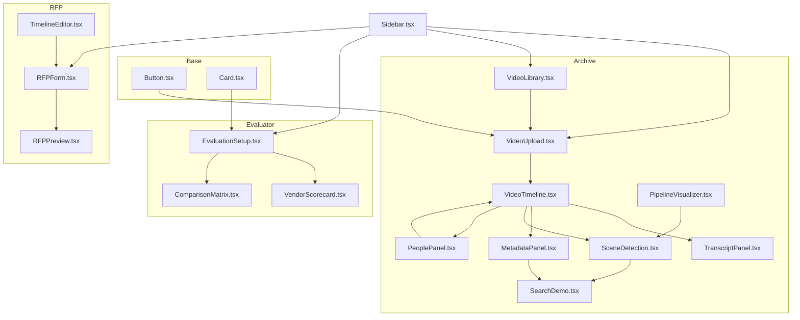
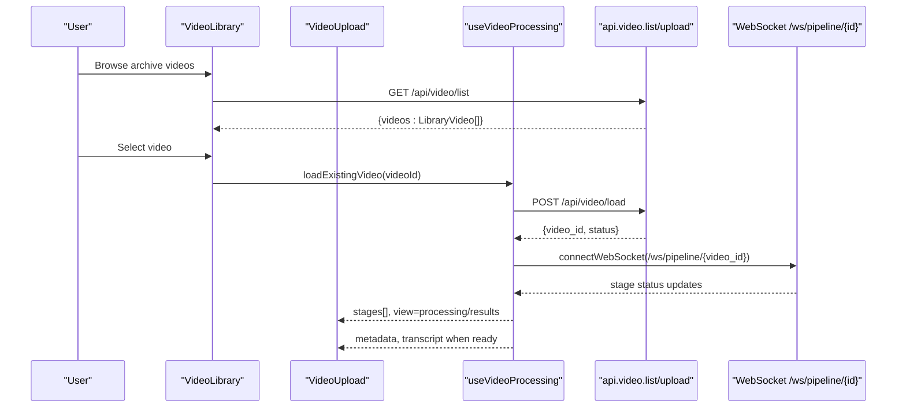
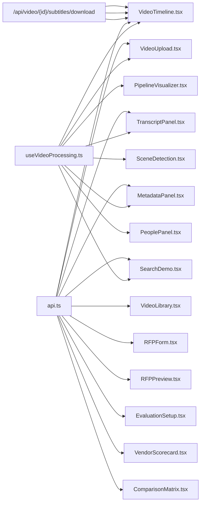

# Component Library

<cite>
**Referenced Files in This Document**
- [globals.css](file://frontend/src/app/globals.css)
- [Button.tsx](file://frontend/src/components/Button.tsx)
- [Card.tsx](file://frontend/src/components/Card.tsx)
- [VideoUpload.tsx](file://frontend/src/components/archive/VideoUpload.tsx)
- [VideoTimeline.tsx](file://frontend/src/components/archive/VideoTimeline.tsx)
- [TranscriptPanel.tsx](file://frontend/src/components/archive/TranscriptPanel.tsx)
- [MetadataPanel.tsx](file://frontend/src/components/archive/MetadataPanel.tsx)
- [SearchDemo.tsx](file://frontend/src/components/archive/SearchDemo.tsx)
- [PipelineVisualizer.tsx](file://frontend/src/components/archive/PipelineVisualizer.tsx)
- [SceneDetection.tsx](file://frontend/src/components/archive/SceneDetection.tsx)
- [PeoplePanel.tsx](file://frontend/src/components/archive/PeoplePanel.tsx)
- [VideoLibrary.tsx](file://frontend/src/components/archive/VideoLibrary.tsx)
- [RFPForm.tsx](file://frontend/src/components/rfp/RFPForm.tsx)
- [RFPPreview.tsx](file://frontend/src/components/rfp/RFPPreview.tsx)
- [TimelineEditor.tsx](file://frontend/src/components/rfp/TimelineEditor.tsx)
- [EvaluationSetup.tsx](file://frontend/src/components/evaluator/EvaluationSetup.tsx)
- [VendorScorecard.tsx](file://frontend/src/components/evaluator/VendorScorecard.tsx)
- [ComparisonMatrix.tsx](file://frontend/src/components/evaluator/ComparisonMatrix.tsx)
- [Sidebar.tsx](file://frontend/src/components/Sidebar.tsx)
- [api.ts](file://frontend/src/lib/api.ts)
- [useVideoProcessing.ts](file://frontend/src/lib/useVideoProcessing.ts)
- [video.py](file://backend/routers/video.py)
- [subtitle_generation.py](file://backend/pipeline/subtitle_generation.py)
- [archive/page.tsx](file://frontend/src/app/archive/page.tsx)
</cite>

## Update Summary
**Changes Made**
- Enhanced VideoTimeline component with comprehensive closed captioning interface including CC toggle button, language selection menu supporting English/Arabic/French/Russian, native HTML5 track elements, proper RTL support for Arabic subtitles, download functionality for SRT files, and accessibility features with ARIA attributes
- Added detailed documentation for the new subtitle management system and its integration with backend APIs
- Updated component props and state management to include closed captioning capabilities
- Enhanced accessibility features for multilingual subtitle display

## Table of Contents
1. [Introduction](#introduction)
2. [Project Structure](#project-structure)
3. [Core Components](#core-components)
4. [Architecture Overview](#architecture-overview)
5. [Detailed Component Analysis](#detailed-component-analysis)
6. [Accessibility Improvements](#accessibility-improvements)
7. [Defensive Programming and Error Handling](#defensive-programming-and-error-handling)
8. [Dependency Analysis](#dependency-analysis)
9. [Performance Considerations](#performance-considerations)
10. [Troubleshooting Guide](#troubleshooting-guide)
11. [Conclusion](#conclusion)

## Introduction
This document describes the reusable UI component library used across the Dubai Media application. It covers foundational components (Button, Card) and specialized components grouped by feature areas: Archive, RFP Creator, and RFP Evaluator. For each component, we document props, events, styling patterns, composition guidelines, state management integration, accessibility, responsiveness, and performance characteristics. The goal is to enable consistent development and easy reuse across pages such as Archive Metadata, RFP Creator, and RFP Evaluator.

## Project Structure
The component library is organized by feature folders under frontend/src/components:
- Base primitives: Button, Card
- Archive feature: VideoUpload, VideoTimeline, TranscriptPanel, MetadataPanel, SearchDemo, PipelineVisualizer, SceneDetection, PeoplePanel, VideoLibrary
- RFP feature: RFPForm, RFPPreview, TimelineEditor
- Evaluator feature: EvaluationSetup, VendorScorecard, ComparisonMatrix
- Shared layout: Sidebar
- Shared libraries: api.ts (typed API helpers), useVideoProcessing.ts (video pipeline state hook)



**Diagram sources**
- [Button.tsx:1-30](file://frontend/src/components/Button.tsx#L1-L30)
- [Card.tsx:1-17](file://frontend/src/components/Card.tsx#L1-L17)
- [VideoUpload.tsx:1-221](file://frontend/src/components/archive/VideoUpload.tsx#L1-L221)
- [VideoTimeline.tsx:1-469](file://frontend/src/components/archive/VideoTimeline.tsx#L1-L469)
- [TranscriptPanel.tsx:1-305](file://frontend/src/components/archive/TranscriptPanel.tsx#L1-L305)
- [MetadataPanel.tsx:1-380](file://frontend/src/components/archive/MetadataPanel.tsx#L1-L380)
- [SearchDemo.tsx:1-230](file://frontend/src/components/archive/SearchDemo.tsx#L1-L230)
- [PipelineVisualizer.tsx:1-181](file://frontend/src/components/archive/PipelineVisualizer.tsx#L1-L181)
- [SceneDetection.tsx:1-181](file://frontend/src/components/archive/SceneDetection.tsx#L1-L181)
- [PeoplePanel.tsx:1-226](file://frontend/src/components/archive/PeoplePanel.tsx#L1-L226)
- [VideoLibrary.tsx:1-128](file://frontend/src/components/archive/VideoLibrary.tsx#L1-L128)
- [RFPForm.tsx:1-411](file://frontend/src/components/rfp/RFPForm.tsx#L1-L411)
- [RFPPreview.tsx:1-200](file://frontend/src/components/rfp/RFPPreview.tsx#L1-L200)
- [TimelineEditor.tsx:1-111](file://frontend/src/components/rfp/TimelineEditor.tsx#L1-L111)
- [EvaluationSetup.tsx:1-429](file://frontend/src/components/evaluator/EvaluationSetup.tsx#L1-L429)
- [VendorScorecard.tsx:1-241](file://frontend/src/components/evaluator/VendorScorecard.tsx#L1-L241)
- [ComparisonMatrix.tsx:1-318](file://frontend/src/components/evaluator/ComparisonMatrix.tsx#L1-L318)
- [Sidebar.tsx:1-67](file://frontend/src/components/Sidebar.tsx#L1-L67)

**Section sources**
- [Button.tsx:1-30](file://frontend/src/components/Button.tsx#L1-L30)
- [Card.tsx:1-17](file://frontend/src/components/Card.tsx#L1-L17)
- [VideoUpload.tsx:1-221](file://frontend/src/components/archive/VideoUpload.tsx#L1-L221)
- [VideoTimeline.tsx:1-469](file://frontend/src/components/archive/VideoTimeline.tsx#L1-L469)
- [TranscriptPanel.tsx:1-305](file://frontend/src/components/archive/TranscriptPanel.tsx#L1-L305)
- [MetadataPanel.tsx:1-380](file://frontend/src/components/archive/MetadataPanel.tsx#L1-L380)
- [SearchDemo.tsx:1-230](file://frontend/src/components/archive/SearchDemo.tsx#L1-L230)
- [PipelineVisualizer.tsx:1-181](file://frontend/src/components/archive/PipelineVisualizer.tsx#L1-L181)
- [SceneDetection.tsx:1-181](file://frontend/src/components/archive/SceneDetection.tsx#L1-L181)
- [PeoplePanel.tsx:1-226](file://frontend/src/components/archive/PeoplePanel.tsx#L1-L226)
- [VideoLibrary.tsx:1-128](file://frontend/src/components/archive/VideoLibrary.tsx#L1-L128)
- [RFPForm.tsx:1-411](file://frontend/src/components/rfp/RFPForm.tsx#L1-L411)
- [RFPPreview.tsx:1-200](file://frontend/src/components/rfp/RFPPreview.tsx#L1-L200)
- [TimelineEditor.tsx:1-111](file://frontend/src/components/rfp/TimelineEditor.tsx#L1-L111)
- [EvaluationSetup.tsx:1-429](file://frontend/src/components/evaluator/EvaluationSetup.tsx#L1-L429)
- [VendorScorecard.tsx:1-241](file://frontend/src/components/evaluator/VendorScorecard.tsx#L1-L241)
- [ComparisonMatrix.tsx:1-318](file://frontend/src/components/evaluator/ComparisonMatrix.tsx#L1-L318)
- [Sidebar.tsx:1-67](file://frontend/src/components/Sidebar.tsx#L1-L67)

## Core Components
These are the foundational building blocks reused across the application.

- Button
  - Purpose: Standardized button with primary/secondary variants and consistent focus/ring behavior.
  - Props:
    - children: ReactNode
    - variant?: "primary" | "secondary"
    - className?: string
    - Additional native button attributes (e.g., onClick, disabled)
  - Events: Inherits standard button events.
  - Styling: Uses Tailwind utility classes for spacing, colors, borders, transitions, and focus rings.
  - Accessibility: Focus-visible ring and keyboard operable.
  - Composition: Wrap with Card or layout containers for grouping.

- Card
  - Purpose: lightweight container with rounded corners, border, and padding.
  - Props:
    - children: ReactNode
    - className?: string
    - Additional native div attributes
  - Styling: Consistent white background, rounded-xl, gray-200 border, and p-6 padding.
  - Composition: Ideal for sectioning content in forms and dashboards.

**Section sources**
- [Button.tsx:3-29](file://frontend/src/components/Button.tsx#L3-L29)
- [Card.tsx:3-16](file://frontend/src/components/Card.tsx#L3-L16)

## Architecture Overview
The component library integrates with shared state and APIs:
- useVideoProcessing.ts manages upload, pipeline stages, metadata, transcript, search, and playback synchronization.
- api.ts provides typed wrappers for REST and WebSocket interactions.
- Components are designed to be stateless consumers of props and callbacks, enabling composability.



**Diagram sources**
- [VideoLibrary.tsx:34-50](file://frontend/src/components/archive/VideoLibrary.tsx#L34-L50)
- [VideoUpload.tsx:63-67](file://frontend/src/components/archive/VideoUpload.tsx#L63-L67)
- [useVideoProcessing.ts:162-211](file://frontend/src/lib/useVideoProcessing.ts#L162-L211)
- [api.ts:167-182](file://frontend/src/lib/api.ts#L167-182)

## Detailed Component Analysis

### Archive Components

#### VideoUpload
- Purpose: Accepts video uploads with drag-and-drop, validates file types/extensions, displays progress, and surfaces errors.
- Props:
  - uploadState: UploadState ("idle" | "uploading" | "uploaded" | "error")
  - uploadProgress: number (0–100)
  - fileName: string | null
  - fileSize: number | null
  - error: string | null
  - onUpload: (file: File) => void
- Events:
  - Clicking the drop zone triggers hidden file input.
  - Drag-and-drop handlers manage dragOver state and file selection.
- Styling: Rounded card container, centered film/camera icon, hover states, disabled pointer-events during upload.
- Accessibility: Hidden input focusable via click; drag-and-drop uses aria-friendly markup.
- State integration: Integrates with useVideoProcessing for upload lifecycle and progress.
- Performance: Uses object URL for immediate playback; limits DOM updates to essential fields.

**Section sources**
- [VideoUpload.tsx:7-67](file://frontend/src/components/archive/VideoUpload.tsx#L7-L67)
- [useVideoProcessing.ts:162-211](file://frontend/src/lib/useVideoProcessing.ts#L162-L211)

#### VideoTimeline
- Purpose: Renders a video player with a scrubber timeline, scene markers, detected objects, per-face appearance bars, and comprehensive closed captioning interface with multi-language subtitle support.
- Props:
  - videoRef: RefObject<HTMLVideoElement | null>
  - pendingSeekRef?: RefObject<number | null>
  - videoId: string | null
  - videoUrl: string | null
  - metadata: VideoMetadata | null
  - currentTime: number
  - onTimeUpdate: (time: number) => void
  - onSeek: (time: number) => void
- Interactions:
  - Timeline click seeks to computed timestamp.
  - Hover shows tooltip for nearby scene.
  - Clicking markers or face bars seeks to target time.
  - **Enhanced**: CC toggle button enables/disables captions with language selection dropdown.
  - **Enhanced**: Language selection menu supports English, Arabic, French, and Russian with RTL support.
  - **Enhanced**: SRT download functionality for offline subtitle access.
- Styling: Dark video container, progress overlay, blue scene markers, yellow object dots, primary-position indicator, CC control bar with active state indicators.
- Accessibility: Keyboard-accessible scrubber; tooltips provide context; ARIA attributes for CC controls; proper RTL text direction for Arabic subtitles; screen reader friendly language selection menus.
- State integration: Subscribes to video timeupdate and loadedmetadata; syncs with current time prop; manages CC state and subtitle track modes.
- **Enhanced Closed Captioning Interface**: Comprehensive subtitle management system with native HTML5 track elements, real-time language switching, and proper RTL support for Arabic content.

**Updated** Enhanced closed captioning capabilities have been implemented to provide comprehensive multilingual subtitle support:

- **CC Toggle Button**: Integrated caption control with visual feedback showing enabled/disabled state using `aria-pressed` attribute for accessibility
- **Language Selection Menu**: Dropdown menu supporting four languages (English, العربية, Français, Русский) with proper RTL directionality for Arabic text
- **Native HTML5 Track Elements**: Utilizes `<track>` elements for WebVTT subtitle format with automatic browser-native caption rendering
- **Real-time Track Mode Management**: Synchronizes TextTrack modes with CC state, automatically showing/hiding tracks based on user preferences
- **SRT Download Functionality**: Dedicated download button with language-specific SRT file generation and proper filename formatting
- **RTL Support**: Automatic right-to-left text direction for Arabic subtitles using `dir="rtl"` attribute on language menu items
- **Accessibility Features**: Comprehensive ARIA attributes including `aria-pressed`, `title` attributes, and keyboard navigation support
- **Backend Integration**: Seamless connection to `/api/video/{videoId}/subtitles` endpoint for WebVTT streaming and `/api/video/{videoId}/subtitles/download` for SRT downloads

**Section sources**
- [VideoTimeline.tsx:12-22](file://frontend/src/components/archive/VideoTimeline.tsx#L12-L22)
- [VideoTimeline.tsx:24-35](file://frontend/src/components/archive/VideoTimeline.tsx#L24-L35)
- [VideoTimeline.tsx:58-114](file://frontend/src/components/archive/VideoTimeline.tsx#L58-L114)
- [VideoTimeline.tsx:194-204](file://frontend/src/components/archive/VideoTimeline.tsx#L194-L204)
- [VideoTimeline.tsx:214-330](file://frontend/src/components/archive/VideoTimeline.tsx#L214-L330)
- [VideoTimeline.tsx:200-201](file://frontend/src/components/archive/VideoTimeline.tsx#L200-L201)
- [VideoTimeline.tsx:216-219](file://frontend/src/components/archive/VideoTimeline.tsx#L216-L219)
- [useVideoProcessing.ts:370-381](file://frontend/src/lib/useVideoProcessing.ts#L370-L381)

#### TranscriptPanel
- Purpose: Displays speech transcript segments with speaker identity, timestamps, and language indicators; auto-scrolls to active segment; supports real-time translation into multiple languages.
- Props:
  - videoId: string | null
  - segments: TranscriptSegment[]
  - currentTime: number
  - onSeek: (time: number) => void
- Interactions:
  - Clicking a timestamp seeks video to start of segment.
  - Auto-scroll keeps active segment visible.
  - Language selection dropdown for translation into Arabic, French, or Russian.
  - Real-time translation status indicators with loading spinner.
- Styling: Scrollable panel, speaker badges with distinct colors, active segment highlighting, translation dropdown with globe icon, bilingual text display with proper RTL support.
- Accessibility: Smooth scroll behavior; clickable buttons for seeking; readable monospace timestamps; proper ARIA labels for translation controls; RTL text direction support for Arabic translations.
- **Enhanced Translation Interface**: Comprehensive translation system with language selection dropdown, real-time status indicators, error handling, and bilingual display showing both original and translated text.

**Updated** Enhanced translation capabilities have been implemented to provide comprehensive multilingual support:

- **Language Selection Dropdown**: Integrated translation dropdown with globe icon supporting Arabic (العربية), French (Français), and Russian (Русский) languages
- **Real-time Status Indicators**: Animated loading spinner and "Translating..." status message during translation requests
- **Error Handling**: Comprehensive error state management with user-friendly error messages displayed in red banner
- **RTL Support**: Automatic right-to-left text direction for Arabic translations using `dir="rtl"` attribute
- **Bilingual Display**: Translated text displayed below original text with visual separator and italic styling
- **Translation State Management**: Map-based storage of translations indexed by segment position for efficient lookup
- **Auto-reset on Video Change**: Translation state automatically clears when underlying video or transcript changes
- **Backend Integration**: Seamless integration with `/api/video/{videoId}/translate-transcript` endpoint using DashScope Qwen model

**Section sources**
- [TranscriptPanel.tsx:7-12](file://frontend/src/components/archive/TranscriptPanel.tsx#L7-L12)
- [TranscriptPanel.tsx:67-121](file://frontend/src/components/archive/TranscriptPanel.tsx#L67-L121)
- [TranscriptPanel.tsx:175-231](file://frontend/src/components/archive/TranscriptPanel.tsx#L175-231)
- [TranscriptPanel.tsx:286-297](file://frontend/src/components/archive/TranscriptPanel.tsx#L286-L297)
- [api.ts:222-233](file://frontend/src/lib/api.ts#L222-233)

#### MetadataPanel
- Purpose: Presents processed metadata in tabs: Summary, EBUCore XML, IPTC JSON, Raw JSON.
- Props:
  - metadata: VideoMetadata | null
- Features:
  - Summary: Topic, sentiment, era, duration, detected persons, landmarks, sensitive content flags.
  - EBUCore: Copy XML and download as .xml.
  - IPTC/Raw: Expandable JSON tree with copy-to-clipboard.
- Styling: Tabbed interface with active-state underline; dark theme JSON viewer; badge chips for tags.
- Accessibility: Keyboard navigation among tabs; focusable copy/download buttons.

**Updated** Enhanced multilingual support and structured flag objects have been implemented to improve metadata display capabilities:

- **Bilingual person display**: When Arabic names are available, they are shown alongside English names in parentheses with proper RTL directionality
- **Structured flag objects**: Enhanced sensitive_content field now supports both string flags and structured objects with type, severity, and timestamp properties
- **Improved fallback handling**: Graceful handling of missing Arabic names with conditional rendering
- **RTL text support**: Proper right-to-left text direction for Arabic content within the badge display

**Section sources**
- [MetadataPanel.tsx:6-376](file://frontend/src/components/archive/MetadataPanel.tsx#L6-L376)
- [useVideoProcessing.ts:36-41](file://frontend/src/lib/useVideoProcessing.ts#L36-L41)

#### SearchDemo
- Purpose: Demonstrates semantic search over the archive with query input, results list, and result click handler.
- Props:
  - searchResults: SearchResult[]
  - isSearching: boolean
  - searchQuery: string
  - onSearch: (query: string) => void
  - onResultClick?: (result: SearchResult) => void
- Interactions:
  - Enter-key submission; disabled when empty or searching.
  - Clicking a result invokes onResultClick.
- Styling: Search icon, prominent input, result cards with thumbnails and score badges.

**Updated** Enhanced thumbnail URL resolution has been implemented to provide robust handling of various thumbnail path formats:

- **Universal URL resolution**: The resolveThumbnailUrl function handles multiple thumbnail path formats including "./uploads/...", "uploads/...", "/uploads/...", and full URLs
- **Environment-aware URLs**: Automatically prepends API_BASE_URL for relative paths to ensure browser accessibility
- **Null-safe handling**: Gracefully handles undefined or null thumbnail values without crashing
- **Cross-platform compatibility**: Works with different deployment environments and CDN configurations

**Section sources**
- [SearchDemo.tsx:7-43](file://frontend/src/components/archive/SearchDemo.tsx#L7-L43)
- [SearchDemo.tsx:13-21](file://frontend/src/components/archive/SearchDemo.tsx#L13-L21)

#### PipelineVisualizer
- Purpose: Visualizes pipeline stage statuses, progress, elapsed time, and messages.
- Props:
  - stages: PipelineStage[]
- Features:
  - Overall completion percentage bar.
  - Grid of stages with icons, status badges, elapsed time, and optional messages.
  - Animated processing state with spinner.
- Styling: Responsive grid (2–6 columns), connector lines between stages, color-coded backgrounds per status.

**Section sources**
- [PipelineVisualizer.tsx:6-91](file://frontend/src/components/archive/PipelineVisualizer.tsx#L6-L91)

#### SceneDetection
- Purpose: Provides sophisticated video scene analysis with timeline visualization, scene type categorization, and interactive navigation features.
- Props:
  - scenes: SceneBoundary[] - Array of scene boundary objects containing timestamp, description, and optional scene_type
  - duration: number - Total video duration in seconds
  - currentTime: number - Current playback position in seconds
  - onSeek: (time: number) => void - Callback function to seek to a specific timestamp
- Features:
  - Timeline visualization with color-coded scene segments based on scene_type
  - Active scene highlighting with orange ring indicator
  - Scene type legend with color mapping
  - Interactive scene list with expandable descriptions
  - Timestamp navigation from both timeline and list views
  - Responsive design with hover effects and smooth transitions
- Interactions:
  - Click timeline segments to navigate to scene start time
  - Click scene list items to seek to specific timestamps
  - Expand/collapse scene descriptions for detailed information
  - Hover over timeline segments for scene type and timestamp tooltips
- Styling: White card container with rounded corners, shadow, and responsive layout; color-coded scene segments with hover effects; active scene highlighting; scrollable scene list with expandable descriptions.
- Accessibility: Keyboard navigable timeline segments; clear visual hierarchy; color-coded legend; descriptive tooltips; expand/collapse controls with proper ARIA attributes.
- **Enhanced Scene Type Categorization**: Implements comprehensive color mapping for 8 different scene types including interview, b-roll, aerial, ceremony, documentary, news-anchor, sport, and other. Each scene type has associated background, text, border, and bar colors for consistent visual representation.
- **Interactive Timeline Visualization**: Provides precise timeline segmentation with calculated width percentages based on scene durations, creating an intuitive visual representation of scene distribution throughout the video.
- **Responsive Scene List**: Features expandable scene descriptions with show more/show less functionality, preventing clutter while providing detailed information access.
- **Integration with VideoTimeline**: Seamlessly complements VideoTimeline by providing an alternative visualization method and additional scene analysis capabilities. Both components share the same SceneBoundary interface from useVideoProcessing, ensuring consistency across the video analysis ecosystem.

**New** Comprehensive documentation for the SceneDetection component, including:
- Scene type color mapping system with 8 predefined categories
- Timeline visualization with interactive segments and playback indicator
- Detailed scene list with expandable descriptions and timestamp navigation
- Integration with useVideoProcessing SceneBoundary interface
- Responsive design patterns and accessibility features

**Section sources**
- [SceneDetection.tsx:6-40](file://frontend/src/components/archive/SceneDetection.tsx#L6-40)
- [SceneDetection.tsx:14-27](file://frontend/src/components/archive/SceneDetection.tsx#L14-27)
- [SceneDetection.tsx:74-101](file://frontend/src/components/archive/SceneDetection.tsx#L74-101)
- [SceneDetection.tsx:119-176](file://frontend/src/components/archive/SceneDetection.tsx#L119-176)
- [useVideoProcessing.ts:30-35](file://frontend/src/lib/useVideoProcessing.ts#L30-L35)

#### PeoplePanel
- Purpose: Provides comprehensive person management interface for identifying and managing detected faces in videos with confidence scoring and source attribution.
- Props:
  - faces: DetectedFace[] - Array of detected face objects with identification status, names, roles, and appearance timestamps
  - duration: number - Total video duration in seconds for accurate time range calculations
  - onSeek: (time: number) => void - Callback function to navigate to specific timestamps
  - onRename: (faceIndex: number, data: { name_en: string; name_ar?: string; role?: string; add_to_reference?: boolean }) => Promise<unknown> - Async callback for updating person information
- Features:
  - Person identification status tracking with confidence percentages
  - Source attribution labels (AI match, OCR, transcript, AI suggestion, manual)
  - Inline editing interface for person names, roles, and reference database inclusion
  - Appearance timeline chips showing exact time ranges for each person's presence
  - Bilingual name support with Arabic name display
  - Real-time save confirmation feedback
- Interactions:
  - Click "Name person" button to open inline editing form
  - Click appearance time chips to jump to specific timestamps
  - Edit existing person information with validation
  - Toggle option to add person to reference database for future videos
- Styling: White card container with rounded corners and subtle shadow; color-coded avatar circles; source attribution badges with distinct colors; responsive layout with scrollable person list.
- Accessibility: Keyboard navigable editing forms; clear visual hierarchy with identified vs unidentified persons; descriptive tooltips for time ranges; proper ARIA labels for interactive elements.
- **Enhanced Source Attribution System**: Implements comprehensive labeling system for 5 different person identification sources with distinct color coding and descriptive labels for better user understanding of identification confidence.
- **Inline Editing Interface**: Provides contextual editing experience with validation, loading states, and success feedback without leaving the main interface.
- **Appearance Timeline Integration**: Seamlessly connects with video timeline by providing clickable time range chips that navigate directly to person appearances.
- **Reference Database Management**: Enables persistent person identification across videos through optional reference database integration.

**New** Comprehensive documentation for the PeoplePanel component, including:
- Person identification workflow with confidence scoring
- Inline editing interface with validation and feedback
- Source attribution system with visual indicators
- Appearance timeline integration with timestamp navigation
- Reference database management for cross-video person recognition

**Section sources**
- [PeoplePanel.tsx:6-14](file://frontend/src/components/archive/PeoplePanel.tsx#L6-14)
- [PeoplePanel.tsx:22-28](file://frontend/src/components/archive/PeoplePanel.tsx#L22-28)
- [PeoplePanel.tsx:30-108](file://frontend/src/components/archive/PeoplePanel.tsx#L30-108)
- [PeoplePanel.tsx:110-226](file://frontend/src/components/archive/PeoplePanel.tsx#L110-226)
- [useVideoProcessing.ts:555-566](file://frontend/src/lib/useVideoProcessing.ts#L555-L566)

#### VideoLibrary
- Purpose: Provides browsable video interface for archive library with metadata display and quick access controls for completed videos.
- Props:
  - onSelect: (videoId: string) => void - Callback function triggered when user selects a video from the library
- Features:
  - Responsive grid layout displaying video thumbnails with metadata
  - Automatic filtering of only completed videos from the archive
  - Duration overlay display on video thumbnails
  - Creation date formatting and scene count display
  - Person names display for videos with identified people
  - Loading skeleton animation during data fetch
  - Empty state handling when no videos are available
- Interactions:
  - Click any video card to select and navigate to that video
  - Hover effects with scale animation and shadow enhancement
  - Responsive grid adapts from 2 columns on mobile to 4 columns on large screens
- Styling: Clean card-based layout with consistent spacing; aspect-ratio maintained thumbnails; gradient overlays for duration badges; typography hierarchy for metadata display.
- Accessibility: Semantic button elements for video selection; proper alt text handling; keyboard navigation support; screen reader friendly metadata presentation.
- **Enhanced Thumbnail Resolution**: Utilizes API_BASE_URL configuration for proper thumbnail URL resolution across different deployment environments.
- **Robust Data Filtering**: Filters videos by status prefix to ensure only fully processed videos are displayed in the library.
- **Responsive Design Pattern**: Implements modern CSS Grid with responsive breakpoints for optimal viewing across device sizes.
- **Loading State Management**: Provides skeleton loading animation for improved user experience during data fetching.

**New** Comprehensive documentation for the VideoLibrary component, including:
- Video browsing interface with metadata display
- Responsive grid layout with thumbnail previews
- Archive filtering and status-based video selection
- Integration with API for video listing and metadata retrieval
- User interaction patterns for video selection and navigation

**Section sources**
- [VideoLibrary.tsx:6-8](file://frontend/src/components/archive/VideoLibrary.tsx#L6-8)
- [VideoLibrary.tsx:30-50](file://frontend/src/components/archive/VideoLibrary.tsx#L30-50)
- [VideoLibrary.tsx:68-127](file://frontend/src/components/archive/VideoLibrary.tsx#L68-127)
- [api.ts:134-146](file://frontend/src/lib/api.ts#L134-146)

### RFP Components

#### RFPForm
- Purpose: Creates an RFP by collecting project details, technical requirements, evaluation criteria, timeline/milestones, budget range, compliance requirements, industry, language, and tone.
- Props:
  - onSubmit: (payload: RFPCreatePayload) => void
  - isLoading: boolean
- Interactions:
  - Dynamic lists for technical requirements and evaluation criteria.
  - Toggle for budget visibility; currency selector.
  - Compliance checkboxes with custom addition.
  - Language/tone radio groups.
  - Reset form to defaults.
- Validation:
  - Required fields: project title and overview.
  - Disabled submit until required fields are filled.
- Styling: Form sections with labels, inputs, toggles, and chips for custom compliance.

**Section sources**
- [RFPForm.tsx:10-123](file://frontend/src/components/rfp/RFPForm.tsx#L10-L123)

#### RFPPreview
- Purpose: Renders a bilingual preview of generated RFP sections with export options and optional regeneration.
- Props:
  - rfpId: string
  - title: string
  - sections: RFPSection[]
  - language: string
  - onRegenerateSection: (sectionName: string, instructions: string) => Promise<void>
  - onExportDocx: () => void
  - onExportPdf: () => void
  - regeneratingSection: string | null
- Interactions:
  - Switch between EN/AR views when bilingual.
  - Per-section regenerate prompt with instructions.
  - Export to DOCX/PDF via API endpoints.
- Styling: Document-like header/footer, sectioned content with RTL support when Arabic is active.

**Section sources**
- [RFPPreview.tsx:7-46](file://frontend/src/components/rfp/RFPPreview.tsx#L7-L46)

#### TimelineEditor
- Purpose: Manages project start/end dates and milestone entries with add/remove actions.
- Props:
  - startDate: string
  - endDate: string
  - milestones: Milestone[]
  - onStartDateChange: (date: string) => void
  - onEndDateChange: (date: string) => void
  - onMilestonesChange: (milestones: Milestone[]) => void
- Interactions:
  - Add milestone row; remove individual milestones.
  - Edit milestone name/date inline.

**Section sources**
- [TimelineEditor.tsx:11-43](file://frontend/src/components/rfp/TimelineEditor.tsx#L11-L43)

### Evaluator Components

#### EvaluationSetup
- Purpose: Configures evaluation by uploading the original RFP, vendor responses, and evaluation criteria weights; validates totals and runs evaluation.
- Props:
  - onEvaluate: (data) => Promise<void>
  - isEvaluating: boolean
  - progressMessage: string
- Interactions:
  - Upload RFP (PDF/DOCX); preview first 200 chars.
  - Add/remove vendor rows with name and file.
  - Manage criteria: add/remove, edit name/description, adjust weight, mark mandatory.
  - Apply preset templates.
  - Submit with validation: RFP present, minimum 2 vendors, all vendors complete, weights sum to 100%.
- Styling: Three-column layout with Cards; template chips; total weight indicator.

**Section sources**
- [EvaluationSetup.tsx:26-189](file://frontend/src/components/evaluator/EvaluationSetup.tsx#L26-L189)

#### VendorScorecard
- Purpose: Displays a vendor's overall score and detailed criterion breakdown with expandable justifications and evidence.
- Props:
  - vendors: VendorResult[]
- Features:
  - Tabbed vendor switching.
  - Radial progress for overall score.
  - Strengths/Gaps/Risks summary cards.
  - Expandable criterion rows with justification and evidence.
- Styling: Color-coded score badges; SVG radial progress; responsive grid for summary cards.

**Section sources**
- [VendorScorecard.tsx:70-239](file://frontend/src/components/evaluator/VendorScorecard.tsx#L70-239)

#### ComparisonMatrix
- Purpose: Compares vendors across criteria with a matrix table, radar chart, and mandatory compliance checks; exports to XLSX/PDF.
- Props:
  - results: EvaluationResults
  - criteriaWeights: Record<string, number>
  - onExportXlsx: () => void
  - onExportPdf: () => void
- Features:
  - Top-score summary cards.
  - Matrix table with criterion weights and scores.
  - Radar chart visualization of vendor profiles.
  - Mandatory compliance matrix with pass/fail icons.
- Styling: Responsive tables, legend for radar chart, color-coded score badges.

**Section sources**
- [ComparisonMatrix.tsx:42-317](file://frontend/src/components/evaluator/ComparisonMatrix.tsx#L42-317)

### Sidebar
- Purpose: Navigation sidebar linking to Archive Metadata, RFP Creator, and RFP Evaluator with active state indication and API connection status.
- Props: None (client-side navigation).
- Styling: Fixed position, brand header, navigation items with icons, active highlight.

**Section sources**
- [Sidebar.tsx:17-66](file://frontend/src/components/Sidebar.tsx#L17-L66)

## Accessibility Improvements

**Updated** Comprehensive CSS improvements have been implemented to address text visibility issues on dark backgrounds and improve overall accessibility across form components.

### Text Color Standards
The global stylesheet now enforces consistent text colors for optimal readability:

- **Primary text color**: `#1f2937` for all input elements (inputs, textareas, selects)
- **Placeholder text color**: `#6b7280` with full opacity for better contrast
- **Dark mode compatibility**: Automatic color adaptation through CSS variables

### CSS Structure Enhancements
The global stylesheet has been optimized to eliminate conflicts:

- **Removed duplicate imports**: Consolidated multiple `@import "tailwindcss"` statements
- **Eliminated conflicting dark mode queries**: Streamlined media query handling
- **Added systematic form styling**: Universal text color rules applied to all form controls

### Form Component Accessibility Improvements
All form components now benefit from improved text visibility:

- **Input fields**: Consistent dark gray text (`#1f2937`) ensures readability regardless of background
- **Placeholders**: Medium gray text (`#6b7280`) with opacity 1 prevents fading issues
- **Focus states**: Maintained high contrast for keyboard navigation
- **Error states**: Red text colors maintain sufficient contrast against light backgrounds

### Implementation Details
The accessibility improvements are implemented through:

```css
/* Ensure form inputs always have readable text and placeholder colors */
input,
textarea,
select {
  color: #1f2937;
}

input::placeholder,
textarea::placeholder {
  color: #6b7280;
  opacity: 1;
}
```

These changes ensure consistent text visibility across:
- Light and dark themes
- All form input types (text, textarea, select, checkbox, radio)
- Interactive states (hover, focus, disabled)
- High contrast scenarios

**Section sources**
- [globals.css:31-42](file://frontend/src/app/globals.css#L31-L42)
- [globals.css:86-91](file://frontend/src/app/globals.css#L86-L91)

## Defensive Programming and Error Handling

**Updated** The component library now includes comprehensive defensive programming practices to ensure robust operation even when data is incomplete or unexpected.

### Null-Safe Data Access Patterns
Components consistently implement null-safe data access patterns to prevent runtime errors:

- **Optional chaining operators (?.)**: Used for accessing nested properties that may be undefined
- **Logical OR fallbacks (|| [])**: Ensures arrays always have a valid fallback
- **Conditional rendering**: Components check for data existence before attempting to render

### Specific Defensive Programming Improvements

#### VideoTimeline Component
The VideoTimeline component demonstrates key defensive programming practices:

- **Face appearances safety**: Uses `(face.appearances || []).map()` to safely handle null/undefined appearances arrays
- **Duration validation**: Checks `duration > 0` before calculating percentages to prevent division by zero
- **Metadata fallbacks**: Provides default empty arrays for scenes, faces, and objects when metadata is unavailable
- **Individual appearance click handlers**: Each face appearance now has its own click handler that seeks to the specific start time of the appearance range
- **Subtitle track safety**: Implements null-safe event listener attachment with optional chaining for `addEventListener` and `removeEventListener` methods
- **CC state validation**: Validates video element availability before manipulating TextTrack modes

#### SceneDetection Component
The SceneDetection component implements comprehensive defensive programming patterns:

- **Empty scenes handling**: Returns null when scenes array is empty or undefined to prevent rendering issues
- **Scene boundary calculation**: Safely computes scene segments with fallback duration for the final scene
- **Active scene detection**: Uses findIndex with proper boundary checking to determine current scene
- **Scene type color mapping**: Provides fallback color mapping for unknown scene types
- **Expandable description handling**: Uses conditional rendering for truncated descriptions with proper state management

#### PeoplePanel Component
The PeoplePanel component includes robust defensive programming for person management:

- **Empty faces handling**: Returns null when faces array is empty or undefined to prevent rendering issues
- **Source label safety**: Uses optional chaining and fallback labels for unknown source types
- **Confidence calculation safety**: Validates confidence values before percentage conversion
- **Role and name validation**: Trims whitespace and validates required fields before saving
- **Async error handling**: Wraps rename operations in try-catch blocks with user-friendly error messages

#### VideoLibrary Component
The VideoLibrary component implements comprehensive defensive programming for video browsing:

- **API response validation**: Checks for videos array existence and filters by status prefix
- **Duration formatting safety**: Validates duration values before formatting to prevent NaN outputs
- **Date parsing error handling**: Wraps date formatting in try-catch blocks with fallback empty strings
- **Thumbnail URL safety**: Uses API_BASE_URL concatenation with proper null checking
- **Component cleanup**: Implements proper useEffect cleanup to prevent memory leaks

#### SearchDemo Component
The SearchDemo component includes enhanced defensive programming for thumbnail handling:

- **Thumbnail URL resolution safety**: The resolveThumbnailUrl function handles multiple input formats and edge cases
- **Environment configuration**: Uses NEXT_PUBLIC_API_URL with fallback to localhost for development
- **Null-safe rendering**: Thumbnail images are only rendered when valid URLs are available

#### TranscriptPanel Component
The TranscriptPanel component implements robust defensive programming for translation functionality:

- **Translation state safety**: Map-based storage with proper initialization and cleanup
- **API error handling**: Comprehensive try-catch blocks with user-friendly error messages
- **Language validation**: Supports only predefined languages (ar, fr, ru) with graceful fallback
- **Empty segment handling**: Prevents translation requests when no segments are available
- **Auto-reset functionality**: Clears translation state when video or transcript changes
- **RTL direction safety**: Conditional RTL attribute application based on selected language

#### MetadataPanel Component
The MetadataPanel component includes enhanced multilingual support with defensive programming:

- **Conditional Arabic name rendering**: Uses `face.name_ar &&` to conditionally render Arabic names only when available
- **RTL direction handling**: Applies `dir="rtl"` attribute for proper right-to-left text display
- **Fallback to English names**: Gracefully falls back to English names when Arabic names are not available
- **Structured flag objects**: Enhanced sensitive_content field supports both string and object formats

#### General Error Handling Patterns
- **Early returns**: Functions return early when required data is missing
- **Safe calculations**: Percentage calculations include bounds checking
- **Graceful degradation**: Components render partial content when data is incomplete
- **Async operation safety**: All async operations wrapped in try-catch blocks with appropriate error states

### Benefits of Defensive Programming
- **Improved reliability**: Components continue functioning even with incomplete data
- **Better user experience**: Users see meaningful content rather than blank screens
- **Easier debugging**: Clear error boundaries help identify data source issues
- **Future-proofing**: Components can handle API changes gracefully

**Section sources**
- [VideoTimeline.tsx:84-86](file://frontend/src/components/archive/VideoTimeline.tsx#L84-L86)
- [VideoTimeline.tsx:200-201](file://frontend/src/components/archive/VideoTimeline.tsx#L200-L201)
- [VideoTimeline.tsx:216-219](file://frontend/src/components/archive/VideoTimeline.tsx#L216-L219)
- [VideoTimeline.tsx:229-239](file://frontend/src/components/archive/VideoTimeline.tsx#L229-L239)
- [VideoTimeline.tsx:71-91](file://frontend/src/components/archive/VideoTimeline.tsx#L71-L91)
- [SceneDetection.tsx:43](file://frontend/src/components/archive/SceneDetection.tsx#L43)
- [SceneDetection.tsx:52-55](file://frontend/src/components/archive/SceneDetection.tsx#L52-L55)
- [SceneDetection.tsx:25-27](file://frontend/src/components/archive/SceneDetection.tsx#L25-L27)
- [PeoplePanel.tsx:114](file://frontend/src/components/archive/PeoplePanel.tsx#L114)
- [PeoplePanel.tsx:45-59](file://frontend/src/components/archive/PeoplePanel.tsx#L45-L59)
- [VideoLibrary.tsx:34-50](file://frontend/src/components/archive/VideoLibrary.tsx#L34-50)
- [VideoLibrary.tsx:17-28](file://frontend/src/components/archive/VideoLibrary.tsx#L17-L28)
- [SearchDemo.tsx:13-21](file://frontend/src/components/archive/SearchDemo.tsx#L13-L21)
- [TranscriptPanel.tsx:67-121](file://frontend/src/components/archive/TranscriptPanel.tsx#L67-L121)
- [TranscriptPanel.tsx:286-297](file://frontend/src/components/archive/TranscriptPanel.tsx#L286-L297)
- [MetadataPanel.tsx:193-198](file://frontend/src/components/archive/MetadataPanel.tsx#L193-L198)

## Dependency Analysis
- Component coupling:
  - Archive components depend on useVideoProcessing for state and on api for REST/WebSocket calls.
  - PeoplePanel depends on useVideoProcessing for face renaming functionality.
  - VideoLibrary depends on api for video listing and metadata retrieval.
  - TranscriptPanel depends on api for translation functionality.
  - **Enhanced**: VideoTimeline now depends on backend subtitle endpoints for WebVTT streaming and SRT downloads.
  - RFP components depend on api for creation, regeneration, and evaluation workflows.
  - Evaluator components depend on api for evaluation status/results and exports.
- External dependencies:
  - Recharts for radar visualization in ComparisonMatrix.
  - Heroicons for UI icons across components.
- Potential circular dependencies:
  - None observed; components are leaf nodes consuming hooks and APIs.



**Diagram sources**
- [useVideoProcessing.ts:122-420](file://frontend/src/lib/useVideoProcessing.ts#L122-L420)
- [api.ts:164-244](file://frontend/src/lib/api.ts#L164-244)
- [VideoUpload.tsx:1-221](file://frontend/src/components/archive/VideoUpload.tsx#L1-L221)
- [VideoTimeline.tsx:1-469](file://frontend/src/components/archive/VideoTimeline.tsx#L1-L469)
- [TranscriptPanel.tsx:1-305](file://frontend/src/components/archive/TranscriptPanel.tsx#L1-L305)
- [MetadataPanel.tsx:1-380](file://frontend/src/components/archive/MetadataPanel.tsx#L1-L380)
- [SearchDemo.tsx:1-230](file://frontend/src/components/archive/SearchDemo.tsx#L1-L230)
- [PipelineVisualizer.tsx:1-181](file://frontend/src/components/archive/PipelineVisualizer.tsx#L1-L181)
- [SceneDetection.tsx:1-181](file://frontend/src/components/archive/SceneDetection.tsx#L1-L181)
- [PeoplePanel.tsx:1-226](file://frontend/src/components/archive/PeoplePanel.tsx#L1-L226)
- [VideoLibrary.tsx:1-128](file://frontend/src/components/archive/VideoLibrary.tsx#L1-L128)
- [RFPForm.tsx:1-411](file://frontend/src/components/rfp/RFPForm.tsx#L1-L411)
- [RFPPreview.tsx:1-200](file://frontend/src/components/rfp/RFPPreview.tsx#L1-L200)
- [EvaluationSetup.tsx:1-429](file://frontend/src/components/evaluator/EvaluationSetup.tsx#L1-L429)
- [VendorScorecard.tsx:1-241](file://frontend/src/components/evaluator/VendorScorecard.tsx#L1-L241)
- [ComparisonMatrix.tsx:1-318](file://frontend/src/components/evaluator/ComparisonMatrix.tsx#L1-L318)
- [video.py:349-420](file://backend/routers/video.py#L349-L420)

**Section sources**
- [useVideoProcessing.ts:122-420](file://frontend/src/lib/useVideoProcessing.ts#L122-L420)
- [api.ts:164-244](file://frontend/src/lib/api.ts#L164-244)

## Performance Considerations
- Virtualization: Not implemented; transcripts and metadata panels render lists. Consider virtualizing long lists if performance becomes an issue.
- Rendering frequency:
  - VideoTimeline updates on timeupdate; throttle if needed.
  - SceneDetection renders scene lists with expandable descriptions; consider virtualization for videos with many scenes.
  - MetadataPanel JSON tree renders deeply nested structures; keep expansion defaults minimal.
  - PeoplePanel renders person lists with inline editing; consider limiting visible faces for very large datasets.
  - VideoLibrary renders video grids with thumbnails; lazy loading could improve initial load performance.
  - **TranscriptPanel translation**: Translation requests are batched and cached; consider debouncing rapid language changes.
  - **Enhanced**: VideoTimeline subtitle track management uses efficient TextTrack mode switching without re-rendering entire video elements.
- Network:
  - useVideoProcessing simulates upload progress; real progress requires XHR with onprogress. Consider upgrading upload flow for accurate progress.
  - VideoLibrary fetches video list on mount; consider pagination for large archives.
  - **Translation API**: Single API call translates all segments efficiently; consider caching translations for repeated requests.
  - **Enhanced**: Subtitle streaming uses native HTML5 track elements for optimal browser performance and memory management.
- Memory:
  - VideoUpload creates object URLs; revoke on reset to prevent leaks.
  - PipelineVisualizer and ComparisonMatrix render charts; unmount components to dispose resources.
  - SceneDetection maintains expanded state for individual scenes; consider limiting expanded scenes to improve performance.
  - PeoplePanel maintains editing state for individual faces; clean up state on component unmount.
  - VideoLibrary stores video list in component state; consider memoization for large video collections.
  - **Translation state**: Map-based translation storage is efficient but should be cleared when video changes to prevent memory leaks.
  - **Enhanced**: Subtitle track listeners are properly cleaned up using removeEventListener to prevent memory leaks.

## Troubleshooting Guide
- Upload fails:
  - Check error prop in VideoUpload and inspect network requests.
  - Verify accepted file types and sizes.
- Pipeline stalls:
  - Confirm WebSocket connection; fallback polling is used but may delay results.
  - Inspect stage statuses and elapsed times.
- Transcript not appearing:
  - Ensure pipeline reached completion and metadata/transcript fetched.
- RFP generation stuck:
  - Validate required fields and weights; ensure submit conditions are met.
- Evaluation errors:
  - Review validation messages and ensure RFP and vendor documents are present.
- **VideoTimeline rendering issues**:
  - Check if face appearances data is available in metadata.
  - Verify that duration is properly calculated before rendering appearance bars.
  - Ensure metadata is fully loaded before attempting to render timeline components.
  - **Updated**: Individual face appearance click handlers should now work correctly even when some faces lack appearance data.
  - **Enhanced**: Subtitle track events may take time to populate after video loads; ensure proper event listener setup with addtrack event handling.
- **Closed Captioning Issues**:
  - **New**: Verify that videoId is provided for subtitle endpoints to generate proper URLs.
  - Check that backend subtitle generation has completed successfully for the selected video.
  - Ensure DASHSCOPE_API_KEY is configured on the backend server for translated subtitles.
  - Verify that subtitle files exist in the correct format (WebVTT) at `/api/video/{videoId}/subtitles`.
  - Check browser console for TextTrack-related errors when captions fail to display.
  - **Updated**: Language selection menu should properly apply RTL direction for Arabic subtitles.
  - **Updated**: SRT download functionality should generate proper filenames with language codes.
- **SceneDetection rendering issues**:
  - **New**: Verify that scenes array contains valid SceneBoundary objects with timestamp and description properties.
  - Check that scene_type values match the predefined color mapping keys (interview, b-roll, aerial, ceremony, documentary, news-anchor, sport, other).
  - Ensure duration is greater than 0 to prevent timeline calculation errors.
  - Verify that onSeek callback properly handles timestamp values.
  - **Updated**: Scene detection now includes comprehensive defensive programming to handle missing or incomplete scene data gracefully.
- **PeoplePanel rendering issues**:
  - **New**: Verify that faces array contains valid DetectedFace objects with proper structure.
  - Check that face.index values are unique and properly incrementing.
  - Ensure onRename callback is properly bound and handles async operations.
  - Verify that duration value is provided for accurate time range calculations.
  - **Updated**: Person identification and editing should work correctly even with incomplete face data.
- **VideoLibrary rendering issues**:
  - **New**: Verify that API endpoint `/api/video/list` is accessible and returns proper response format.
  - Check that video status values start with "completed" prefix for proper filtering.
  - Ensure API_BASE_URL environment variable is properly configured.
  - Verify that thumbnail URLs are accessible and properly formatted.
  - **Updated**: Video library should gracefully handle empty archives and API failures.
- **MetadataPanel display issues**:
  - **Updated**: Arabic names should now display properly alongside English names with proper RTL directionality.
  - Check if face.name_ar property exists in the metadata structure.
  - Verify that the conditional rendering logic handles missing Arabic names gracefully.
  - **Updated**: Sensitive content flags now support both string and structured object formats.
- **SearchDemo thumbnail issues**:
  - **Updated**: Thumbnail URLs are now resolved using the enhanced resolveThumbnailUrl function.
  - Verify that thumbnail paths are properly formatted and accessible.
  - Check API_BASE_URL environment variable configuration.
- **TranscriptPanel translation issues**:
  - **Updated**: Translation dropdown should display supported languages (Arabic, French, Russian).
  - Verify that DASHSCOPE_API_KEY is configured on the backend server.
  - Check network requests to `/api/video/{videoId}/translate-transcript` endpoint.
  - Ensure translation error messages are displayed in red banner when API calls fail.
  - Verify that RTL text direction is properly applied for Arabic translations.
  - **Updated**: Translation state should automatically clear when video or transcript changes.
- **TranscriptPanel timestamp problems**:
  - **Updated**: Timestamp formatting now handles multiple input formats and edge cases.
  - Verify that transcript segments contain valid start/end time values.
  - Check for malformed timestamp data in the backend response.

**Section sources**
- [VideoUpload.tsx:199-217](file://frontend/src/components/archive/VideoUpload.tsx#L199-L217)
- [useVideoProcessing.ts:215-276](file://frontend/src/lib/useVideoProcessing.ts#L215-L276)
- [EvaluationSetup.tsx:156-189](file://frontend/src/components/evaluator/EvaluationSetup.tsx#L156-L189)
- [VideoTimeline.tsx:200-201](file://frontend/src/components/archive/VideoTimeline.tsx#L200-L201)
- [VideoTimeline.tsx:71-91](file://frontend/src/components/archive/VideoTimeline.tsx#L71-L91)
- [VideoTimeline.tsx:214-330](file://frontend/src/components/archive/VideoTimeline.tsx#L214-L330)
- [SceneDetection.tsx:43](file://frontend/src/components/archive/SceneDetection.tsx#L43)
- [SceneDetection.tsx:52-55](file://frontend/src/components/archive/SceneDetection.tsx#L52-L55)
- [PeoplePanel.tsx:114](file://frontend/src/components/archive/PeoplePanel.tsx#L114)
- [VideoLibrary.tsx:34-50](file://frontend/src/components/archive/VideoLibrary.tsx#L34-L50)
- [MetadataPanel.tsx:193-198](file://frontend/src/components/archive/MetadataPanel.tsx#L193-L198)
- [SearchDemo.tsx:13-21](file://frontend/src/components/archive/SearchDemo.tsx#L13-L21)
- [TranscriptPanel.tsx:67-121](file://frontend/src/components/archive/TranscriptPanel.tsx#L67-L121)
- [TranscriptPanel.tsx:286-297](file://frontend/src/components/archive/TranscriptPanel.tsx#L286-L297)
- [video.py:349-420](file://backend/routers/video.py#L349-L420)

## Conclusion
The component library provides a cohesive, accessible, and extensible foundation for the Dubai Media application. Base components (Button, Card) standardize UI patterns; feature-specific components encapsulate complex workflows while integrating with shared state and APIs. The recent defensive programming improvements ensure reliable operation even with incomplete data, while the accessibility enhancements guarantee consistent text visibility across all form components. 

The enhanced VideoTimeline component represents a significant advancement in multimedia accessibility, providing comprehensive closed captioning capabilities with native HTML5 track elements, multi-language subtitle support, and proper RTL handling for Arabic content. The new subtitle management system seamlessly integrates with backend APIs to deliver WebVTT streams and SRT downloads, while maintaining excellent performance through efficient TextTrack mode management. The enhanced TranscriptPanel component represents another major advancement in multilingual support, providing comprehensive translation capabilities with real-time status indicators, error handling, and proper RTL support for Arabic translations. The new PeoplePanel and VideoLibrary components significantly enhance the Archive feature by providing comprehensive person management and video browsing capabilities. The PeoplePanel offers sophisticated person identification with confidence scoring, source attribution, and inline editing, while the VideoLibrary provides an intuitive browsing interface for archived videos with rich metadata display. Both components integrate seamlessly with the existing video processing pipeline and follow established architectural patterns.

Key improvements include:
- **Comprehensive Closed Captioning Interface**: VideoTimeline now supports native HTML5 subtitle tracks with CC toggle, language selection menu, and SRT download functionality
- **Multi-Language Subtitle Support**: Built-in support for English, Arabic, French, and Russian subtitles with proper RTL text direction
- **Enhanced Multilingual Support**: Automatic language detection, error handling, and user-friendly status indicators for translation requests
- **Robust Error Management**: Comprehensive try-catch blocks with user-friendly error messages and graceful fallbacks
- **Seamless Backend Integration**: Efficient subtitle streaming and download APIs using WebVTT format with DashScope Qwen model for translations
- **Accessibility Features**: Proper ARIA labels, keyboard navigation, and screen reader support for all multilingual content
- **Performance Optimization**: Native HTML5 track elements for optimal browser performance and memory management

The enhanced VideoTimeline component now provides granular face detection navigation with improved tooltip information, and the MetadataPanel component offers comprehensive multilingual support with proper RTL handling. The SearchDemo component now features robust thumbnail URL resolution that handles various path formats, and the TranscriptPanel provides reliable timestamp formatting across multiple input types. By adhering to the documented props, composition patterns, defensive programming practices, and accessibility guidelines, teams can build consistent experiences across Archive, RFP, and Evaluator features.