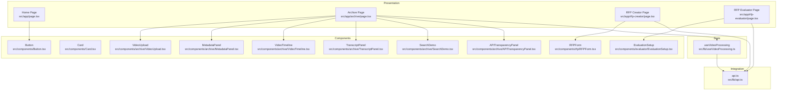
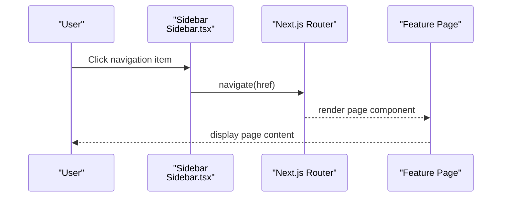
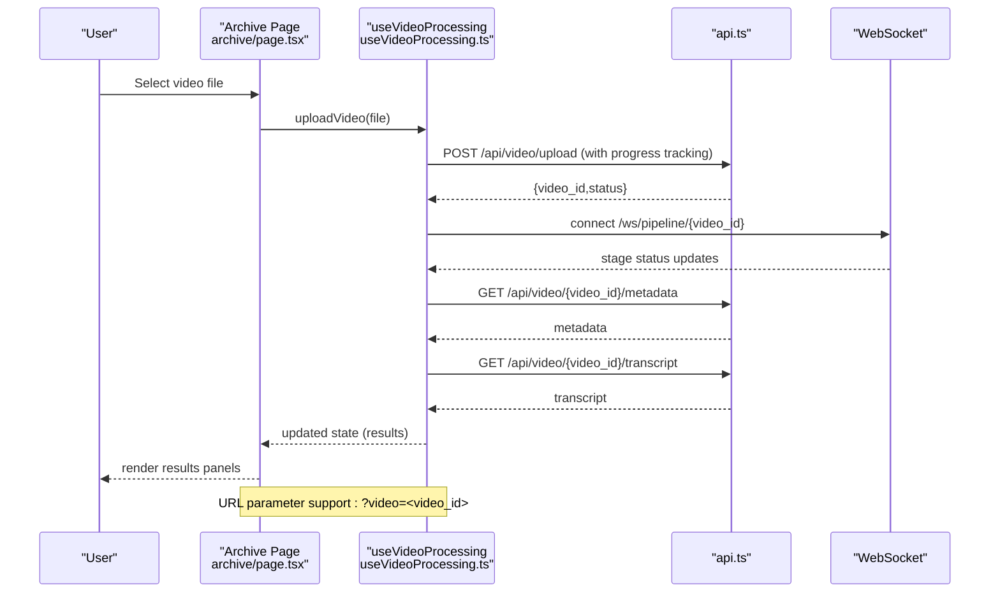
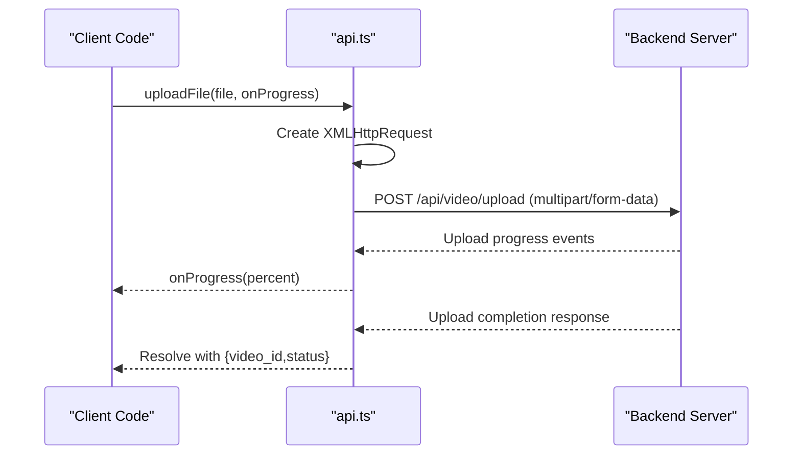
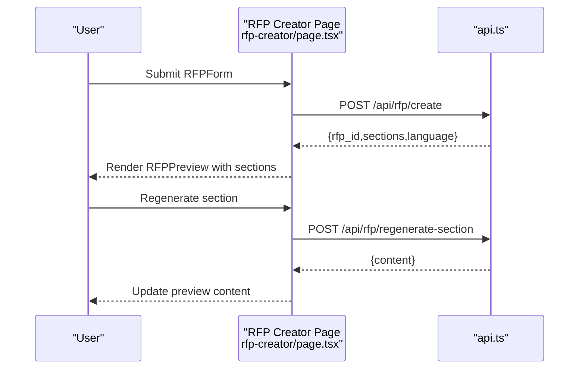
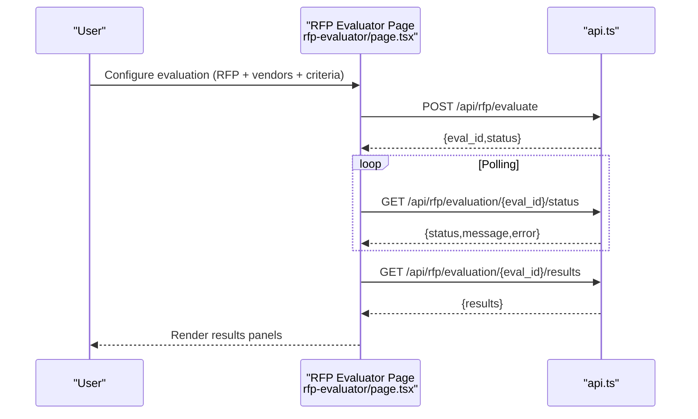
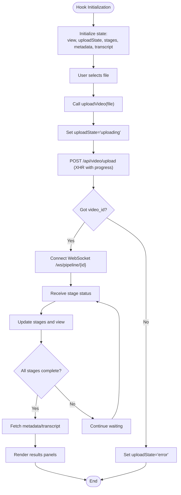
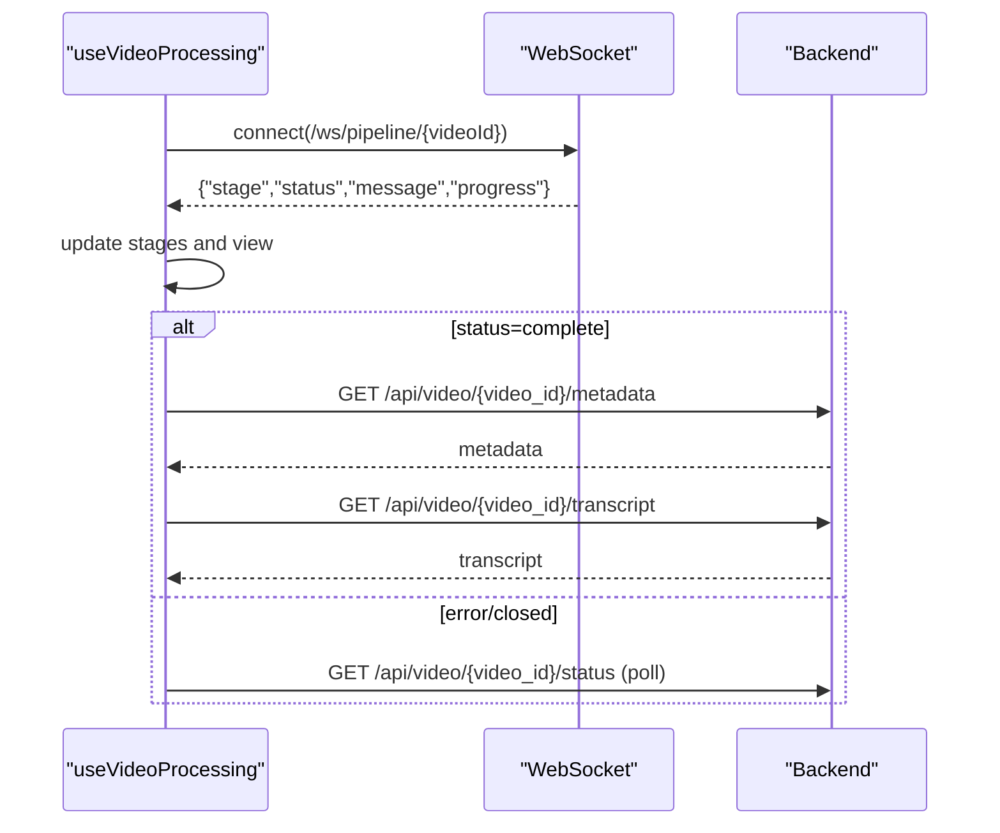
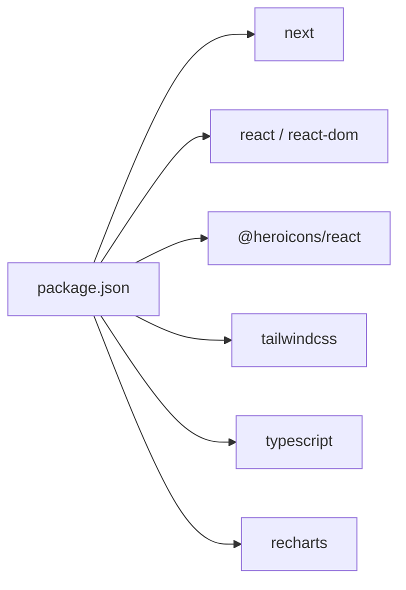

# Frontend Application

<cite>
**Referenced Files in This Document**
- [layout.tsx](file://frontend/src/app/layout.tsx)
- [page.tsx](file://frontend/src/app/page.tsx)
- [archive/page.tsx](file://frontend/src/app/archive/page.tsx)
- [rfp-creator/page.tsx](file://frontend/src/app/rfp-creator/page.tsx)
- [rfp-evaluator/page.tsx](file://frontend/src/app/rfp-evaluator/page.tsx)
- [api.ts](file://frontend/src/lib/api.ts)
- [useVideoProcessing.ts](file://frontend/src/lib/useVideoProcessing.ts)
- [Sidebar.tsx](file://frontend/src/components/Sidebar.tsx)
- [Button.tsx](file://frontend/src/components/Button.tsx)
- [Card.tsx](file://frontend/src/components/Card.tsx)
- [VideoUpload.tsx](file://frontend/src/components/archive/VideoUpload.tsx)
- [RFPForm.tsx](file://frontend/src/components/rfp/RFPForm.tsx)
- [EvaluationSetup.tsx](file://frontend/src/components/evaluator/EvaluationSetup.tsx)
- [MetadataPanel.tsx](file://frontend/src/components/archive/MetadataPanel.tsx)
- [VideoTimeline.tsx](file://frontend/src/components/archive/VideoTimeline.tsx)
- [TranscriptPanel.tsx](file://frontend/src/components/archive/TranscriptPanel.tsx)
- [SearchDemo.tsx](file://frontend/src/components/archive/SearchDemo.tsx)
- [APITransparencyPanel.tsx](file://frontend/src/components/archive/APITransparencyPanel.tsx)
- [package.json](file://frontend/package.json)
- [next.config.ts](file://frontend/next.config.ts)
</cite>

## Update Summary
**Changes Made**
- Enhanced API integration with real upload progress tracking via XMLHttpRequest
- Improved timestamp formatting utilities across multiple components
- Enhanced sensitive content display with better flag handling
- Intelligent thumbnail URL resolution with automatic path normalization
- Added URL parameter support for loading existing videos via ?video=<video_id>
- Improved error handling and user feedback mechanisms

## Table of Contents
1. [Introduction](#introduction)
2. [Project Structure](#project-structure)
3. [Core Components](#core-components)
4. [Architecture Overview](#architecture-overview)
5. [Detailed Component Analysis](#detailed-component-analysis)
6. [Dependency Analysis](#dependency-analysis)
7. [Performance Considerations](#performance-considerations)
8. [Troubleshooting Guide](#troubleshooting-guide)
9. [Conclusion](#conclusion)
10. [Appendices](#appendices)

## Introduction
This document explains the Next.js frontend application architecture for the Dubai Media × Alibaba Cloud AI project. It covers the page-based routing structure, component library organization, reusable UI components, state management patterns, API integration layer, real-time WebSocket handling, sidebar navigation, layout components, responsive design, and integration patterns with backend APIs. It also provides examples of component usage, customization guidelines, performance optimization techniques, and troubleshooting guidance for common frontend issues.

## Project Structure
The frontend is organized using Next.js App Router conventions under the src/app directory. Each feature area has its own page route:
- Home page: src/app/page.tsx
- Archive Metadata Tool: src/app/archive/page.tsx
- RFP Creator: src/app/rfp-creator/page.tsx
- RFP Evaluator: src/app/rfp-evaluator/page.tsx

Global layout and fonts are configured in src/app/layout.tsx, which renders a fixed sidebar and a main content area. The sidebar navigation is implemented in src/components/Sidebar.tsx and is shared across all pages.

Reusable UI primitives live in src/components/ and include Button and Card. Feature-specific components are grouped under:
- Archive: src/components/archive/*
- RFP: src/components/rfp/*
- Evaluator: src/components/evaluator/*

The API integration layer is centralized in src/lib/api.ts, while real-time pipeline updates are handled by src/lib/useVideoProcessing.ts.

```mermaid
graph TB
A["App Router Pages<br/>src/app/*"] --> L["Root Layout<br/>src/app/layout.tsx"]
L --> S["Sidebar<br/>src/components/Sidebar.tsx"]
L --> M["Main Content<br/>pages rendered inside <main>"]
subgraph "Pages"
H["Home<br/>src/app/page.tsx"]
AR["Archive<br/>src/app/archive/page.tsx"]
RC["RFP Creator<br/>src/app/rfp-creator/page.tsx"]
RE["RFP Evaluator<br/>src/app/rfp-evaluator/page.tsx"]
end
subgraph "Components"
B["Button<br/>src/components/Button.tsx"]
C["Card<br/>src/components/Card.tsx"]
SU["Sidebar<br/>src/components/Sidebar.tsx"]
VU["VideoUpload<br/>src/components/archive/VideoUpload.tsx"]
RFPF["RFPForm<br/>src/components/rfp/RFPForm.tsx"]
ES["EvaluationSetup<br/>src/components/evaluator/EvaluationSetup.tsx"]
MP["MetadataPanel<br/>src/components/archive/MetadataPanel.tsx"]
VT["VideoTimeline<br/>src/components/archive/VideoTimeline.tsx"]
TP["TranscriptPanel<br/>src/components/archive/TranscriptPanel.tsx"]
SD["SearchDemo<br/>src/components/archive/SearchDemo.tsx"]
ATP["APITransparencyPanel<br/>src/components/archive/APITransparencyPanel.tsx"]
end
subgraph "Lib"
API["api.ts<br/>src/lib/api.ts"]
UVP["useVideoProcessing.ts<br/>src/lib/useVideoProcessing.ts"]
end
H --> B
H --> C
AR --> VU
AR --> MP
AR --> VT
AR --> TP
AR --> SD
AR --> ATP
RC --> RFPF
RE --> ES
AR --> UVP
AR --> API
RC --> API
RE --> API
UVP --> API
```

**Diagram sources**
- [layout.tsx:22-40](file://frontend/src/app/layout.tsx#L22-L40)
- [Sidebar.tsx:17-66](file://frontend/src/components/Sidebar.tsx#L17-L66)
- [archive/page.tsx:12-167](file://frontend/src/app/archive/page.tsx#L12-L167)
- [rfp-creator/page.tsx:8-158](file://frontend/src/app/rfp-creator/page.tsx#L8-L158)
- [rfp-evaluator/page.tsx:18-177](file://frontend/src/app/rfp-evaluator/page.tsx#L18-L177)
- [api.ts:164-244](file://frontend/src/lib/api.ts#L164-L244)
- [useVideoProcessing.ts:122-420](file://frontend/src/lib/useVideoProcessing.ts#L122-L420)

**Section sources**
- [layout.tsx:1-41](file://frontend/src/app/layout.tsx#L1-L41)
- [Sidebar.tsx:1-67](file://frontend/src/components/Sidebar.tsx#L1-L67)
- [archive/page.tsx:1-167](file://frontend/src/app/archive/page.tsx#L1-L167)
- [rfp-creator/page.tsx:1-159](file://frontend/src/app/rfp-creator/page.tsx#L1-L159)
- [rfp-evaluator/page.tsx:1-178](file://frontend/src/app/rfp-evaluator/page.tsx#L1-L178)

## Core Components
This section documents the reusable UI primitives and their roles in the application.

- Button: Provides primary and secondary variants with consistent sizing and focus styles. Used across forms and action buttons.
- Card: A lightweight container with rounded borders and padding, used to group related form sections and results panels.

These components are designed for consistency and minimal props, enabling easy reuse across pages.

**Section sources**
- [Button.tsx:1-30](file://frontend/src/components/Button.tsx#L1-L30)
- [Card.tsx:1-17](file://frontend/src/components/Card.tsx#L1-L17)

## Architecture Overview
The application follows a layered architecture:
- Presentation Layer: Next.js App Router pages render feature-specific views and orchestrate component composition.
- Component Layer: Reusable UI primitives and feature-specific components encapsulate UI logic and interactions.
- State Management: React hooks manage local UI state; a dedicated hook centralizes video processing state and WebSocket handling.
- Integration Layer: A typed API client abstracts HTTP requests and WebSocket connections, exposing convenience methods per domain (video, RFP).
- Backend Integration: Pages call the API client to perform uploads, fetch results, and poll evaluation status.

**Diagram sources**
- [page.tsx:69-198](file://frontend/src/app/page.tsx#L69-L198)
- [archive/page.tsx:12-167](file://frontend/src/app/archive/page.tsx#L12-L167)
- [rfp-creator/page.tsx:8-158](file://frontend/src/app/rfp-creator/page.tsx#L8-L158)
- [rfp-evaluator/page.tsx:18-177](file://frontend/src/app/rfp-evaluator/page.tsx#L18-L177)
- [useVideoProcessing.ts:122-420](file://frontend/src/lib/useVideoProcessing.ts#L122-L420)
- [api.ts:164-244](file://frontend/src/lib/api.ts#L164-L244)

## Detailed Component Analysis

### Page-Based Routing and Navigation
- Root layout sets up fonts, global CSS, a fixed sidebar, and a main content area. The sidebar uses Next.js navigation to highlight active routes and links to the three feature areas.
- Home page presents feature cards linking to the three tools and showcases technology highlights.
- Each feature page composes domain-specific components and integrates with the API client.

**Diagram sources**
- [layout.tsx:22-40](file://frontend/src/app/layout.tsx#L22-L40)
- [Sidebar.tsx:17-66](file://frontend/src/components/Sidebar.tsx#L17-L66)
- [page.tsx:69-198](file://frontend/src/app/page.tsx#L69-L198)

**Section sources**
- [layout.tsx:1-41](file://frontend/src/app/layout.tsx#L1-L41)
- [Sidebar.tsx:1-67](file://frontend/src/components/Sidebar.tsx#L1-L67)
- [page.tsx:1-199](file://frontend/src/app/page.tsx#L1-L199)

### Archive Metadata Tool
The Archive page coordinates video upload, pipeline visualization, and results presentation. It relies on a custom hook to manage upload state, WebSocket updates, and result retrieval.

Key responsibilities:
- Orchestrate VideoUpload component and pass upload callbacks.
- Render PipelineVisualizer during processing.
- Display VideoTimeline, TranscriptPanel, MetadataPanel, and APITransparencyPanel upon completion.
- Provide a persistent SearchDemo for semantic search across the archive.
- Support loading existing videos via URL parameters (?video=<video_id>).

**Diagram sources**
- [archive/page.tsx:12-167](file://frontend/src/app/archive/page.tsx#L12-L167)
- [useVideoProcessing.ts:122-420](file://frontend/src/lib/useVideoProcessing.ts#L122-L420)
- [api.ts:164-244](file://frontend/src/lib/api.ts#L164-L244)

**Section sources**
- [archive/page.tsx:1-167](file://frontend/src/app/archive/page.tsx#L1-L167)
- [useVideoProcessing.ts:1-533](file://frontend/src/lib/useVideoProcessing.ts#L1-L533)
- [api.ts:164-244](file://frontend/src/lib/api.ts#L164-L244)

### Enhanced API Integration Layer
The api.ts module has been enhanced with real upload progress tracking and improved error handling:

- **Real Upload Progress Tracking**: Uses XMLHttpRequest instead of fetch for multipart/form-data uploads, enabling precise progress callbacks during file transfer.
- **Enhanced Error Handling**: Improved error responses with detailed error messages and proper JSON parsing.
- **WebSocket Integration**: Maintains WebSocket connection helper with typed message shapes for pipeline updates.
- **Domain-Specific Methods**: Video and RFP operations with proper typing and parameter handling.

**Updated** Enhanced with XMLHttpRequest-based upload progress tracking for better user feedback during large file transfers.

**Diagram sources**
- [api.ts:43-95](file://frontend/src/lib/api.ts#L43-L95)

**Section sources**
- [api.ts:1-277](file://frontend/src/lib/api.ts#L1-L277)

### Enhanced Video Processing Hook
The useVideoProcessing hook has been enhanced with improved timestamp handling and better state management:

- **Improved Timestamp Formatting**: Enhanced parsing and formatting functions for various timestamp formats (seconds, MM:SS, HH:MM:SS).
- **Better State Management**: More robust state updates with proper cleanup and resource management.
- **Enhanced Error Handling**: Improved error recovery and fallback mechanisms.
- **Resource Cleanup**: Proper cleanup of WebSockets, polling intervals, and object URLs on component unmount.

**Updated** Enhanced with improved timestamp parsing utilities and better state management for video processing workflows.

**Section sources**
- [useVideoProcessing.ts:1-533](file://frontend/src/lib/useVideoProcessing.ts#L1-L533)

### Enhanced Component Features

#### VideoUpload Component
- **Real Progress Tracking**: Displays upload progress with percentage and file size formatting.
- **Enhanced File Validation**: Improved file type checking and size validation.
- **Better User Feedback**: Clear error states and loading indicators.

#### MetadataPanel Component
- **Enhanced Sensitive Content Display**: Improved handling and display of sensitive content flags with better formatting.
- **Better Tab Management**: Enhanced tab switching with better state persistence.
- **Improved Data Visualization**: Better display of detected persons, landmarks, and scenes.

#### SearchDemo Component
- **Intelligent Thumbnail URL Resolution**: Automatic conversion of raw thumbnail paths to accessible URLs.
- **Enhanced Timestamp Formatting**: Support for various timestamp formats in search results.
- **Better Result Handling**: Improved result display with person detection information.

**Updated** Enhanced with improved timestamp formatting, better sensitive content display, and intelligent thumbnail URL resolution.

**Section sources**
- [VideoUpload.tsx:1-221](file://frontend/src/components/archive/VideoUpload.tsx#L1-L221)
- [MetadataPanel.tsx:1-380](file://frontend/src/components/archive/MetadataPanel.tsx#L1-L380)
- [SearchDemo.tsx:1-230](file://frontend/src/components/archive/SearchDemo.tsx#L1-L230)

### RFP Creator
The RFP Creator page manages form submission, skeleton previews, and section regeneration. It uses the API client to create RFPs, regenerate sections, and export documents.

Key responsibilities:
- Capture project details and evaluation criteria.
- Call api.rfp.create to generate sections.
- Render RFPPreview with bilingual support and export actions.
- Handle errors and loading states.

**Diagram sources**
- [rfp-creator/page.tsx:8-158](file://frontend/src/app/rfp-creator/page.tsx#L8-L158)
- [api.ts:186-200](file://frontend/src/lib/api.ts#L186-L200)

**Section sources**
- [rfp-creator/page.tsx:1-159](file://frontend/src/app/rfp-creator/page.tsx#L1-L159)
- [RFPForm.tsx:1-411](file://frontend/src/components/rfp/RFPForm.tsx#L1-L411)
- [api.ts:186-200](file://frontend/src/lib/api.ts#L186-L200)

### RFP Evaluator
The RFP Evaluator page handles vendor proposal evaluation via a multi-phase workflow: setup, evaluating, and results. It polls evaluation status and displays structured results.

Key responsibilities:
- Collect RFP and vendor files, criteria, and weights.
- Start evaluation and poll status until completion.
- Render ComparisonMatrix, VendorScorecard, and RecommendationPanel.
- Provide export actions for evaluation reports.

**Diagram sources**
- [rfp-evaluator/page.tsx:18-177](file://frontend/src/app/rfp-evaluator/page.tsx#L18-L177)
- [api.ts:209-239](file://frontend/src/lib/api.ts#L209-L239)

**Section sources**
- [rfp-evaluator/page.tsx:1-178](file://frontend/src/app/rfp-evaluator/page.tsx#L1-L178)
- [EvaluationSetup.tsx:1-429](file://frontend/src/components/evaluator/EvaluationSetup.tsx#L1-L429)
- [api.ts:209-239](file://frontend/src/lib/api.ts#L209-L239)

### Component Library Organization
- Reusable primitives: Button and Card provide consistent styling and behavior across pages.
- Feature-specific components:
  - Archive: VideoUpload, PipelineVisualizer, VideoTimeline, TranscriptPanel, MetadataPanel, SearchDemo, APITransparencyPanel.
  - RFP: RFPForm, RFPPreview, CriteriaEditor, TimelineEditor.
  - Evaluator: EvaluationSetup, ComparisonMatrix, VendorScorecard, RecommendationPanel.

These components are designed to be self-contained, accept typed props, and minimize coupling to external state.

**Section sources**
- [Button.tsx:1-30](file://frontend/src/components/Button.tsx#L1-L30)
- [Card.tsx:1-17](file://frontend/src/components/Card.tsx#L1-L17)
- [VideoUpload.tsx:1-221](file://frontend/src/components/archive/VideoUpload.tsx#L1-L221)
- [RFPForm.tsx:1-411](file://frontend/src/components/rfp/RFPForm.tsx#L1-L411)
- [EvaluationSetup.tsx:1-429](file://frontend/src/components/evaluator/EvaluationSetup.tsx#L1-L429)

### State Management Patterns
- Local UI state: Pages maintain transient UI state (loading, errors, form inputs).
- Centralized video processing state: The useVideoProcessing hook encapsulates upload progress, pipeline stages, metadata, transcript, search results, and WebSocket lifecycle.
- Controlled components: Inputs and interactive elements are controlled, updating state via callbacks.

**Diagram sources**
- [useVideoProcessing.ts:122-420](file://frontend/src/lib/useVideoProcessing.ts#L122-L420)

**Section sources**
- [useVideoProcessing.ts:1-533](file://frontend/src/lib/useVideoProcessing.ts#L1-L533)

### Real-Time WebSocket Handling
The useVideoProcessing hook connects to a WebSocket endpoint to receive pipeline stage updates. It:
- Establishes the connection on successful upload.
- Parses incoming messages and updates stage statuses and timing.
- Falls back to REST polling if WebSocket fails or closes.
- Triggers result retrieval when the final stage completes.

**Diagram sources**
- [useVideoProcessing.ts:215-276](file://frontend/src/lib/useVideoProcessing.ts#L215-L276)
- [api.ts:179-183](file://frontend/src/lib/api.ts#L179-L183)

**Section sources**
- [useVideoProcessing.ts:213-348](file://frontend/src/lib/useVideoProcessing.ts#L213-L348)
- [api.ts:179-183](file://frontend/src/lib/api.ts#L179-L183)

### Sidebar Navigation and Layout
The layout.tsx defines the global HTML structure with fonts and a fixed sidebar. The Sidebar component:
- Renders navigation items for Archive Metadata, RFP Creator, and RFP Evaluator.
- Uses Next.js usePathname to compute active state and apply active styles.
- Displays a small connectivity indicator.

Responsive design:
- The layout uses Tailwind utilities to ensure a minimum height and flexible main content area.
- Grid layouts adapt to larger screens for results panels.

**Section sources**
- [layout.tsx:1-41](file://frontend/src/app/layout.tsx#L1-L41)
- [Sidebar.tsx:1-67](file://frontend/src/components/Sidebar.tsx#L1-L67)

### Component Usage and Customization Guidelines
- Button
  - Props: children, variant ("primary" | "secondary"), className, and standard button attributes.
  - Usage: Prefer variant="primary" for main actions; use variant="secondary" for secondary actions.
- Card
  - Props: children, className.
  - Usage: Wrap form sections and result panels for consistent spacing and borders.
- VideoUpload
  - Props: uploadState, uploadProgress, fileName, fileSize, error, onUpload.
  - Usage: Pass callbacks from useVideoProcessing to handle file selection and upload.
- RFPForm
  - Props: onSubmit, isLoading.
  - Usage: Validate required fields and construct RFPCreatePayload before calling onSubmit.
- EvaluationSetup
  - Props: onEvaluate, isEvaluating, progressMessage.
  - Usage: Ensure total criteria weights equal 100% before submitting.

Customization tips:
- Extend Button and Card with additional variants or sizes by adding new style mappings.
- For components with complex forms, keep validation close to submission to surface errors early.
- Use controlled components to avoid unexpected re-renders and simplify debugging.

**Section sources**
- [Button.tsx:1-30](file://frontend/src/components/Button.tsx#L1-L30)
- [Card.tsx:1-17](file://frontend/src/components/Card.tsx#L1-L17)
- [VideoUpload.tsx:1-221](file://frontend/src/components/archive/VideoUpload.tsx#L1-L221)
- [RFPForm.tsx:1-411](file://frontend/src/components/rfp/RFPForm.tsx#L1-L411)
- [EvaluationSetup.tsx:1-429](file://frontend/src/components/evaluator/EvaluationSetup.tsx#L1-L429)

## Dependency Analysis
External dependencies include Next.js, React, Heroicons, Tailwind CSS, TypeScript, and Recharts. The project uses a minimal configuration with Tailwind PostCSS support.

**Diagram sources**
- [package.json:11-28](file://frontend/package.json#L11-L28)

**Section sources**
- [package.json:1-29](file://frontend/package.json#L1-L29)
- [next.config.ts:1-8](file://frontend/next.config.ts#L1-L8)

## Performance Considerations
- Lazy loading: Defer heavy chart rendering until results are available.
- Memoization: Use React.memo for static panels and useCallback for event handlers to reduce re-renders.
- Virtualization: For large lists (e.g., search results), consider virtualizing rows.
- Image optimization: Use Next.js Image component for thumbnails and visual assets.
- Network efficiency: Batch API calls where possible; cancel ongoing requests on route changes.
- Web Workers: Offload heavy computations (e.g., transcript processing) to workers if needed.
- Bundle size: Keep icons and charts scoped to pages to avoid unnecessary imports.
- **Enhanced Upload Performance**: XMLHttpRequest-based uploads provide better progress tracking and user feedback for large files.

## Troubleshooting Guide
Common issues and resolutions:
- Upload failures
  - Symptom: Error displayed in VideoUpload with red banner.
  - Actions: Verify backend connectivity, supported file types (.mp4, .mov, .avi), and file size limits.
  - **Updated**: Check upload progress tracking for XMLHttpRequest errors.
- WebSocket disconnects
  - Symptom: Pipeline stalls; fallback polling occurs.
  - Actions: Check network stability; confirm backend WebSocket endpoint availability.
- Evaluation timeout
  - Symptom: Polling continues indefinitely.
  - Actions: Inspect backend logs; ensure evaluation job starts and progresses.
- Export downloads blocked
  - Symptom: Blank tab or blocked popup.
  - Actions: Allow popups; verify CORS and backend export endpoints.
- Navigation highlighting incorrect
  - Symptom: Sidebar active state mismatch.
  - Actions: Confirm route paths match navigation entries; ensure usePathname is used consistently.
- **New**: Thumbnail URL resolution issues
  - Symptom: Missing or broken thumbnails in search results.
  - Actions: Verify thumbnail path resolution logic handles various formats correctly.
- **New**: Timestamp formatting problems
  - Symptom: Incorrect time display in timeline or transcript panels.
  - Actions: Check timestamp parsing utilities for various input formats.

**Section sources**
- [VideoUpload.tsx:200-217](file://frontend/src/components/archive/VideoUpload.tsx#L200-L217)
- [useVideoProcessing.ts:263-270](file://frontend/src/lib/useVideoProcessing.ts#L263-L270)
- [api.ts:31-36](file://frontend/src/lib/api.ts#L31-L36)

## Conclusion
The frontend employs a clean separation of concerns with Next.js App Router, reusable UI primitives, a centralized API client, and a dedicated hook for complex state and real-time updates. The architecture supports scalable feature development, robust error handling, and a responsive user experience across devices. Recent enhancements include improved upload progress tracking, better timestamp formatting, enhanced sensitive content display, and intelligent thumbnail URL resolution.

## Appendices
- Environment variables: NEXT_PUBLIC_API_URL is used to configure the API base URL at runtime.
- Fonts: Google Fonts via Next.js font providers are applied globally for sans-serif and mono fonts.
- Styling: Tailwind utility classes are used extensively for responsive layouts and component styling.

**Section sources**
- [api.ts:1-3](file://frontend/src/lib/api.ts#L1-L3)
- [layout.tsx:6-14](file://frontend/src/app/layout.tsx#L6-L14)