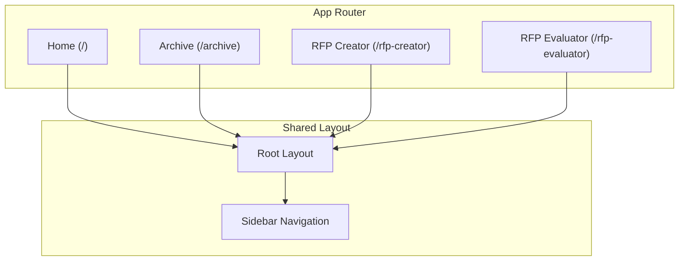
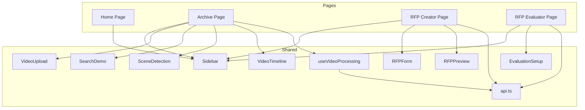
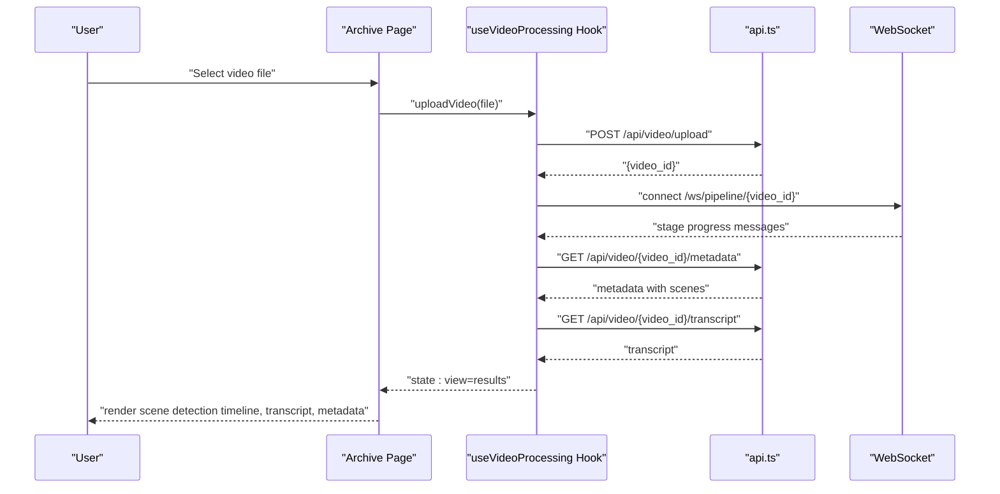
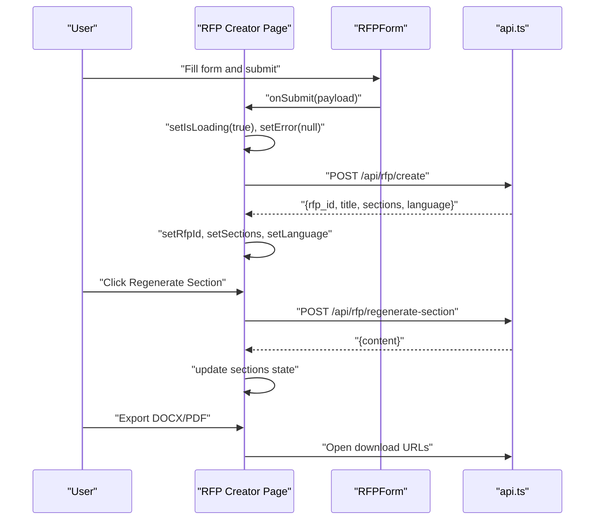
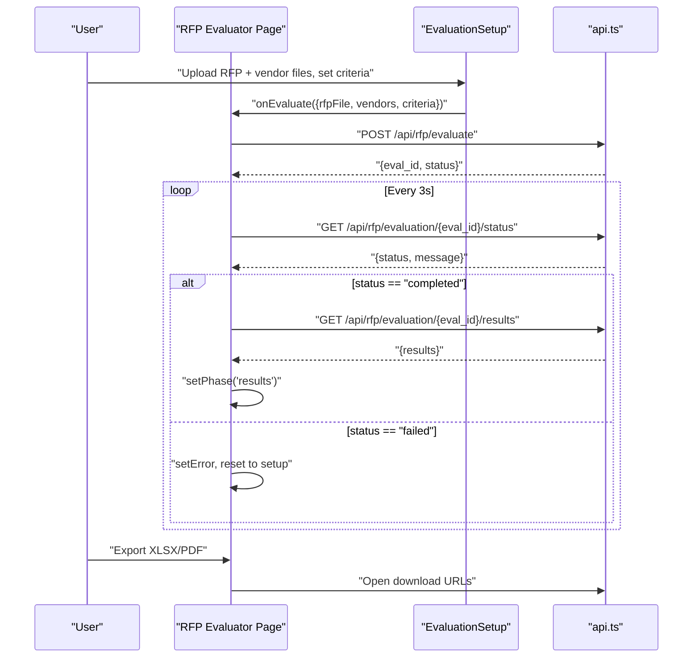
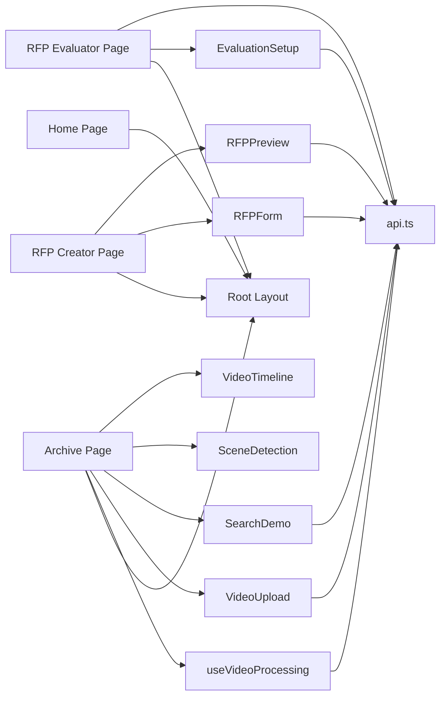

# Page Components & Routing

<cite>
**Referenced Files in This Document**
- [layout.tsx](file://frontend/src/app/layout.tsx)
- [page.tsx](file://frontend/src/app/page.tsx)
- [archive/page.tsx](file://frontend/src/app/archive/page.tsx)
- [rfp-creator/page.tsx](file://frontend/src/app/rfp-creator/page.tsx)
- [rfp-evaluator/page.tsx](file://frontend/src/app/rfp-evaluator/page.tsx)
- [api.ts](file://frontend/src/lib/api.ts)
- [useVideoProcessing.ts](file://frontend/src/lib/useVideoProcessing.ts)
- [Sidebar.tsx](file://frontend/src/components/Sidebar.tsx)
- [VideoUpload.tsx](file://frontend/src/components/archive/VideoUpload.tsx)
- [RFPForm.tsx](file://frontend/src/components/rfp/RFPForm.tsx)
- [RFPPreview.tsx](file://frontend/src/components/rfp/RFPPreview.tsx)
- [EvaluationSetup.tsx](file://frontend/src/components/evaluator/EvaluationSetup.tsx)
- [SearchDemo.tsx](file://frontend/src/components/archive/SearchDemo.tsx)
- [SceneDetection.tsx](file://frontend/src/components/archive/SceneDetection.tsx)
- [VideoTimeline.tsx](file://frontend/src/components/archive/VideoTimeline.tsx)
- [package.json](file://frontend/package.json)
- [next.config.ts](file://frontend/next.config.ts)
</cite>

## Update Summary
**Changes Made**
- Updated Archive Page section to reflect the replacement of VideoTimeline with SceneDetection component
- Added new SceneDetection component documentation with enhanced scene detection capabilities
- Updated component architecture diagrams to show the new SceneDetection integration
- Enhanced archive page layout documentation to include the new scene detection timeline

## Table of Contents
1. [Introduction](#introduction)
2. [Project Structure](#project-structure)
3. [Core Components](#core-components)
4. [Architecture Overview](#architecture-overview)
5. [Detailed Component Analysis](#detailed-component-analysis)
6. [Dependency Analysis](#dependency-analysis)
7. [Performance Considerations](#performance-considerations)
8. [Troubleshooting Guide](#troubleshooting-guide)
9. [Conclusion](#conclusion)

## Introduction
This document explains the Next.js page components and routing structure for the Dubai Media application. It covers three main application pages:
- Archive page for media processing and semantic search
- RFP creator page for generating procurement documents
- RFP evaluator page for assessing vendor proposals

It details the page component architecture, data fetching patterns, route-based rendering, page-specific state management, form handling, and API integration. It also documents page transitions, loading states, error handling, and the relationship between pages and shared components, including prop passing and context usage.

## Project Structure
The frontend follows Next.js App Router conventions with route-based rendering under the app directory. Pages are organized by route:
- Home page at the root
- Archive page at /archive
- RFP creator page at /rfp-creator
- RFP evaluator page at /rfp-evaluator

Shared UI and logic live under src/components and src/lib, while global styles and layout are configured in layout.tsx and page.tsx.

**Diagram sources**
- [layout.tsx:22-40](file://frontend/src/app/layout.tsx#L22-L40)
- [Sidebar.tsx:17-67](file://frontend/src/components/Sidebar.tsx#L17-L67)

**Section sources**
- [layout.tsx:1-41](file://frontend/src/app/layout.tsx#L1-L41)
- [page.tsx:1-199](file://frontend/src/app/page.tsx#L1-L199)
- [archive/page.tsx:1-174](file://frontend/src/app/archive/page.tsx#L1-L174)
- [rfp-creator/page.tsx:1-159](file://frontend/src/app/rfp-creator/page.tsx#L1-L159)
- [rfp-evaluator/page.tsx:1-178](file://frontend/src/app/rfp-evaluator/page.tsx#L1-L178)

## Core Components
- Root layout and sidebar provide consistent navigation and page framing across routes.
- Page components encapsulate route-specific UI, state, and data flows.
- Shared hooks and APIs abstract data fetching and WebSocket connections.
- Reusable components handle forms, previews, and evaluation setups.

Key responsibilities:
- Root layout: global fonts, theme classes, sidebar, and main content container.
- Sidebar: route-aware highlighting and navigation.
- Archive page: video upload, pipeline visualization, scene detection timeline, transcript, metadata, and search demo.
- RFP creator page: form collection, generation, regeneration, and export.
- RFP evaluator page: setup, polling, and results presentation.

**Section sources**
- [layout.tsx:22-40](file://frontend/src/app/layout.tsx#L22-L40)
- [Sidebar.tsx:17-67](file://frontend/src/components/Sidebar.tsx#L17-L67)
- [archive/page.tsx:12-174](file://frontend/src/app/archive/page.tsx#L12-L174)
- [rfp-creator/page.tsx:8-159](file://frontend/src/app/rfp-creator/page.tsx#L8-L159)
- [rfp-evaluator/page.tsx:18-178](file://frontend/src/app/rfp-evaluator/page.tsx#L18-L178)

## Architecture Overview
The application uses route-based rendering with client-side state and API integration:
- Pages are client components enabling interactive state and effects.
- A centralized API module abstracts REST and WebSocket communications.
- A dedicated hook manages video processing state, uploads, and pipeline events.
- Shared components receive props for controlled interactions and reactivity.

**Diagram sources**
- [layout.tsx:22-40](file://frontend/src/app/layout.tsx#L22-L40)
- [Sidebar.tsx:17-67](file://frontend/src/components/Sidebar.tsx#L17-L67)
- [archive/page.tsx:3-13](file://frontend/src/app/archive/page.tsx#L3-L13)
- [VideoUpload.tsx:26-33](file://frontend/src/components/archive/VideoUpload.tsx#L26-L33)
- [SearchDemo.tsx:21-27](file://frontend/src/components/archive/SearchDemo.tsx#L21-L27)
- [SceneDetection.tsx:35-40](file://frontend/src/components/archive/SceneDetection.tsx#L35-L40)
- [VideoTimeline.tsx:26-33](file://frontend/src/components/archive/VideoTimeline.tsx#L26-L33)
- [useVideoProcessing.ts:122-420](file://frontend/src/lib/useVideoProcessing.ts#L122-L420)
- [RFPForm.tsx:31-104](file://frontend/src/components/rfp/RFPForm.tsx#L31-L104)
- [RFPPreview.tsx:18-46](file://frontend/src/components/rfp/RFPPreview.tsx#L18-L46)
- [EvaluationSetup.tsx:61-189](file://frontend/src/components/evaluator/EvaluationSetup.tsx#L61-L189)
- [api.ts:164-244](file://frontend/src/lib/api.ts#L164-L244)

## Detailed Component Analysis

### Archive Page
Purpose: Process uploaded videos through a six-stage AI pipeline, visualize progress, and present metadata, transcripts, and search results.

Key behaviors:
- Uses a custom hook to manage upload, pipeline WebSocket updates, and results retrieval.
- Renders upload UI, pipeline stages, scene detection timeline, transcript panel, metadata panel, and search demo.
- Supports resetting to initial state and seeking within the video.

**Updated** The archive page now features an enhanced scene detection timeline component that provides detailed scene segmentation with color-coded scene types and interactive scene browsing.

State management:
- Centralized in a hook returning state and actions for upload, search, time sync, and reset.
- View modes: upload, processing, results.

API integration:
- Uploads via REST, connects to WebSocket for pipeline events, fetches metadata/transcript upon completion.

**Diagram sources**
- [archive/page.tsx:12-174](file://frontend/src/app/archive/page.tsx#L12-L174)
- [useVideoProcessing.ts:162-309](file://frontend/src/lib/useVideoProcessing.ts#L162-L309)
- [api.ts:166-183](file://frontend/src/lib/api.ts#L166-L183)

**Section sources**
- [archive/page.tsx:12-174](file://frontend/src/app/archive/page.tsx#L12-L174)
- [useVideoProcessing.ts:122-420](file://frontend/src/lib/useVideoProcessing.ts#L122-L420)
- [VideoUpload.tsx:26-221](file://frontend/src/components/archive/VideoUpload.tsx#L26-L221)
- [SearchDemo.tsx:21-189](file://frontend/src/components/archive/SearchDemo.tsx#L21-L189)

### Scene Detection Component
Purpose: Provide an enhanced scene detection timeline with color-coded scene types, interactive scene browsing, and detailed scene information.

Key behaviors:
- Displays a color-coded timeline bar representing different scene types (interview, b-roll, aerial, ceremony, documentary, news-anchor, sport, other).
- Shows scene list with expandable descriptions and timestamp navigation.
- Provides playback position indicator synchronized with current video time.
- Supports clicking on scene segments to jump to specific timestamps.
- Includes scene type legend and color coding for visual distinction.

Scene types and colors:
- Interview: Blue (#3B82F6)
- B-roll: Orange (#F97316)
- Aerial: Teal (#14B8A6)
- Ceremony: Purple (#8B5CF6)
- Documentary: Amber (#F59E0B)
- News anchor: Red (#EF4444)
- Sport: Green (#22C55E)
- Other: Gray (#9CA3AF)

**Section sources**
- [SceneDetection.tsx:1-181](file://frontend/src/components/archive/SceneDetection.tsx#L1-L181)
- [useVideoProcessing.ts:30-35](file://frontend/src/lib/useVideoProcessing.ts#L30-L35)

### RFP Creator Page
Purpose: Collect project details, generate an RFP, preview sections, regenerate individual sections, and export to DOCX/PDF.

Key behaviors:
- Maintains page-level state for RFP ID, title, sections, language, loading, and errors.
- Submits form data to backend and handles success/error states.
- Supports regenerating specific sections with optional instructions.
- Exports generated RFP to DOCX/PDF via browser downloads.

**Diagram sources**
- [rfp-creator/page.tsx:8-74](file://frontend/src/app/rfp-creator/page.tsx#L8-L74)
- [RFPForm.tsx:75-104](file://frontend/src/components/rfp/RFPForm.tsx#L75-L104)
- [api.ts:187-208](file://frontend/src/lib/api.ts#L187-L208)

**Section sources**
- [rfp-creator/page.tsx:8-159](file://frontend/src/app/rfp-creator/page.tsx#L8-L159)
- [RFPForm.tsx:31-411](file://frontend/src/components/rfp/RFPForm.tsx#L31-L411)
- [RFPPreview.tsx:18-200](file://frontend/src/components/rfp/RFPPreview.tsx#L18-L200)
- [api.ts:164-244](file://frontend/src/lib/api.ts#L164-L244)

### RFP Evaluator Page
Purpose: Upload original RFP and vendor responses, configure evaluation criteria, poll for completion, and render results.

Key behaviors:
- Manages a phase machine: setup → evaluating → results.
- Builds FormData and starts evaluation, then polls status every 3 seconds.
- Renders comparison matrix, vendor scorecards, and recommendation panel.
- Provides reset to setup and error handling.

**Diagram sources**
- [rfp-evaluator/page.tsx:18-98](file://frontend/src/app/rfp-evaluator/page.tsx#L18-L98)
- [EvaluationSetup.tsx:61-189](file://frontend/src/components/evaluator/EvaluationSetup.tsx#L61-L189)
- [api.ts:209-239](file://frontend/src/lib/api.ts#L209-L239)

**Section sources**
- [rfp-evaluator/page.tsx:18-178](file://frontend/src/app/rfp-evaluator/page.tsx#L18-L178)
- [EvaluationSetup.tsx:61-429](file://frontend/src/components/evaluator/EvaluationSetup.tsx#L61-L429)
- [api.ts:164-244](file://frontend/src/lib/api.ts#L164-L244)

### Shared Components and Utilities

#### Sidebar Navigation
- Uses Next.js routing to highlight active route and navigate between pages.
- Fixed position with branding and status indicator.

**Section sources**
- [Sidebar.tsx:17-67](file://frontend/src/components/Sidebar.tsx#L17-L67)

#### Video Upload Component
- Accepts drag-and-drop or file selection.
- Validates file types and sizes.
- Shows progress and error states.

**Section sources**
- [VideoUpload.tsx:26-221](file://frontend/src/components/archive/VideoUpload.tsx#L26-L221)

#### Search Demo Component
- Implements semantic search with debounced submission.
- Displays results with thumbnails, timestamps, and scores.

**Section sources**
- [SearchDemo.tsx:21-189](file://frontend/src/components/archive/SearchDemo.tsx#L21-L189)

#### API Module
- Centralized REST and WebSocket helpers.
- Typed fetch wrapper, file upload helper, and convenience methods for video and RFP endpoints.

**Section sources**
- [api.ts:11-39](file://frontend/src/lib/api.ts#L11-L39)
- [api.ts:43-64](file://frontend/src/lib/api.ts#L43-L64)
- [api.ts:68-99](file://frontend/src/lib/api.ts#L68-L99)
- [api.ts:164-244](file://frontend/src/lib/api.ts#L164-L244)

#### Video Processing Hook
- Encapsulates upload progress simulation, WebSocket pipeline updates, fallback polling, metadata/transcript fetching, search, time synchronization, and reset logic.
- Returns state and actions for consumers.

**Section sources**
- [useVideoProcessing.ts:122-420](file://frontend/src/lib/useVideoProcessing.ts#L122-L420)

## Dependency Analysis
- Pages depend on shared components and the API module.
- The Archive page depends on the video processing hook.
- The RFP Creator and Evaluator pages depend on the API module for server communication.
- The Sidebar integrates with Next.js routing to reflect current location.

**Diagram sources**
- [layout.tsx:22-40](file://frontend/src/app/layout.tsx#L22-L40)
- [archive/page.tsx:3-13](file://frontend/src/app/archive/page.tsx#L3-L13)
- [rfp-creator/page.tsx:3-6](file://frontend/src/app/rfp-creator/page.tsx#L3-L6)
- [rfp-evaluator/page.tsx:4-14](file://frontend/src/app/rfp-evaluator/page.tsx#L4-L14)
- [useVideoProcessing.ts:122-420](file://frontend/src/lib/useVideoProcessing.ts#L122-L420)
- [api.ts:164-244](file://frontend/src/lib/api.ts#L164-L244)

**Section sources**
- [package.json:11-27](file://frontend/package.json#L11-L27)
- [next.config.ts:1-8](file://frontend/next.config.ts#L1-L8)

## Performance Considerations
- Archive page uses concurrent metadata and transcript fetching to reduce perceived latency.
- RFP Creator employs skeleton loaders during generation to improve perceived responsiveness.
- RFP Evaluator uses polling with a fixed interval; consider adaptive intervals or SSE if supported by backend.
- Video upload simulates progress; real progress requires XMLHttpRequest for accurate reporting.
- Debounce search queries to avoid excessive API calls.
- Scene detection component efficiently renders large numbers of scenes with virtualization and lazy loading.

## Troubleshooting Guide
Common issues and resolutions:
- Upload failures: Check file type and size constraints; display error messages from the hook.
- Pipeline stalls: Verify WebSocket connectivity; fallback to REST polling.
- Generation errors: Surface API error messages and allow retry.
- Evaluation failures: Clear polling interval and reset to setup; surface error messages.
- Navigation highlights: Ensure Sidebar path matching logic aligns with route prefixes.
- Scene detection issues: Verify scene data availability in metadata; check for empty scene arrays.

**Section sources**
- [VideoUpload.tsx:200-217](file://frontend/src/components/archive/VideoUpload.tsx#L200-L217)
- [useVideoProcessing.ts:263-271](file://frontend/src/lib/useVideoProcessing.ts#L263-L271)
- [rfp-creator/page.tsx:26-32](file://frontend/src/app/rfp-creator/page.tsx#L26-L32)
- [rfp-evaluator/page.tsx:86-97](file://frontend/src/app/rfp-evaluator/page.tsx#L86-L97)
- [Sidebar.tsx:35-45](file://frontend/src/components/Sidebar.tsx#L35-L45)

## Conclusion
The application leverages Next.js App Router for clean route-based rendering, with client components managing interactive state and shared utilities handling API integrations. The Archive, RFP Creator, and RFP Evaluator pages each encapsulate domain-specific flows while sharing common UI and data-layer abstractions. The design supports robust error handling, loading states, and responsive interactions across pages. The integration of the enhanced SceneDetection component provides users with powerful scene analysis capabilities, replacing the previous VideoTimeline component with more sophisticated scene segmentation and visualization features.