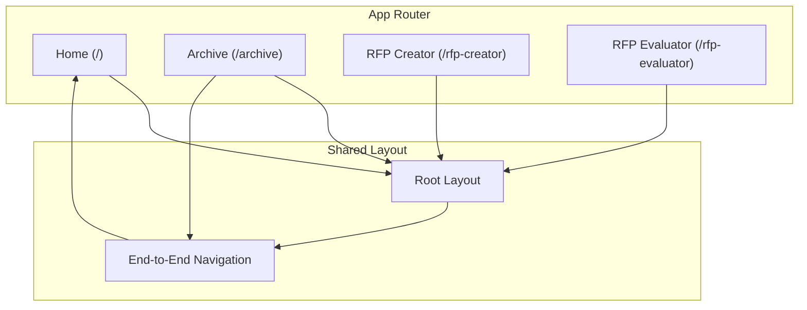
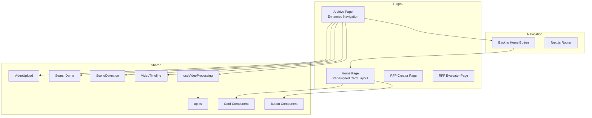
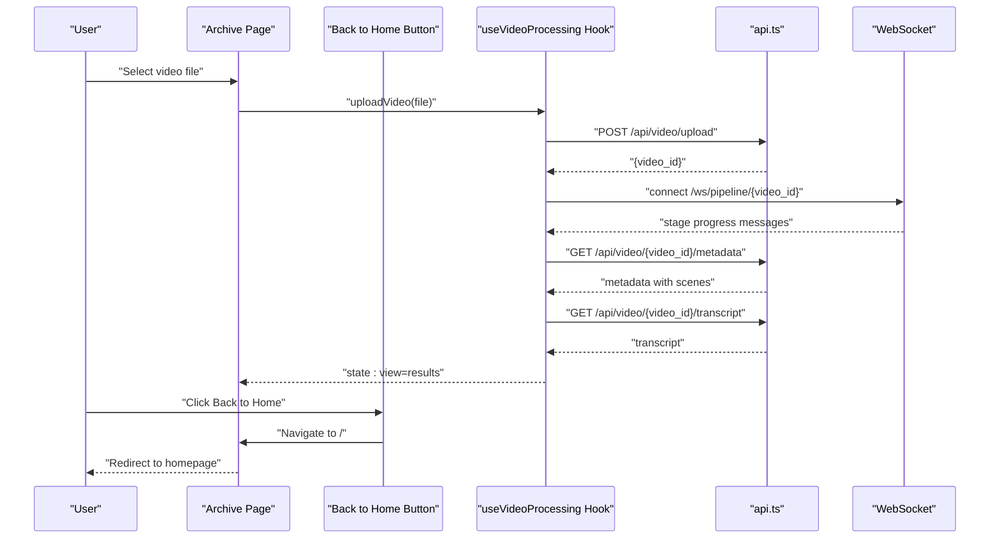
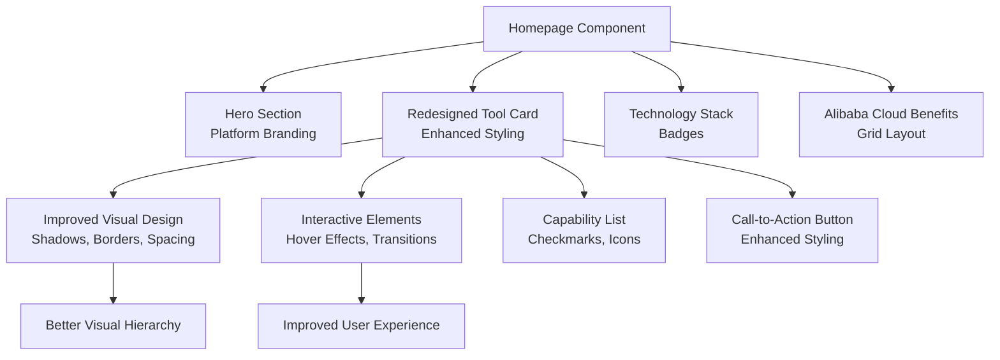
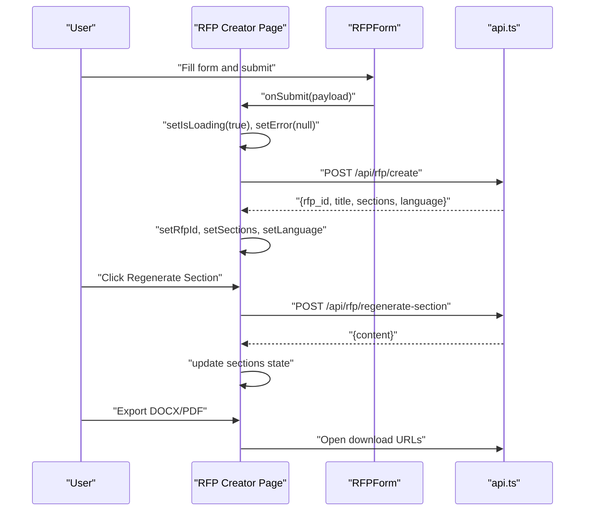
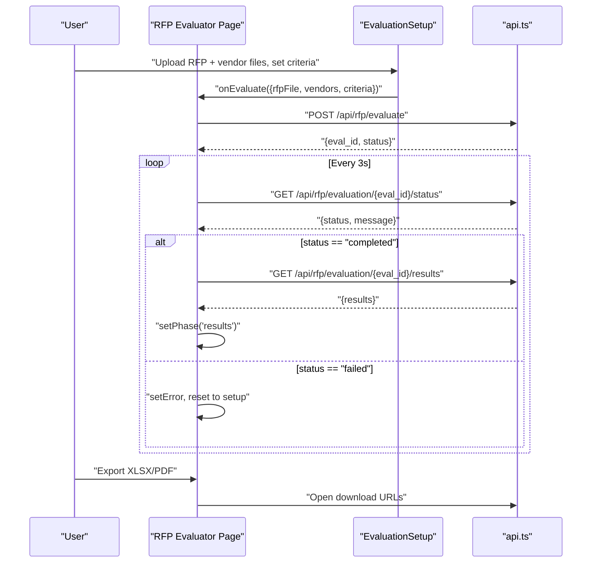
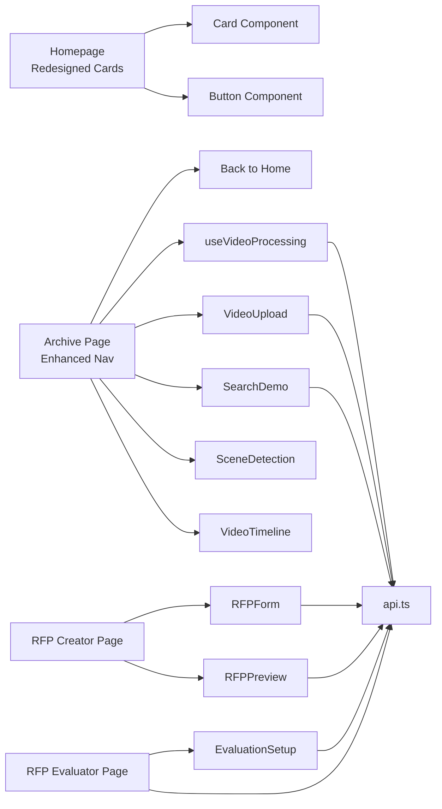

# Page Components & Routing

<cite>
**Referenced Files in This Document**
- [layout.tsx](file://frontend/src/app/layout.tsx)
- [page.tsx](file://frontend/src/app/page.tsx)
- [archive/page.tsx](file://frontend/src/app/archive/page.tsx)
- [Card.tsx](file://frontend/src/components/Card.tsx)
- [Button.tsx](file://frontend/src/components/Button.tsx)
- [api.ts](file://frontend/src/lib/api.ts)
- [useVideoProcessing.ts](file://frontend/src/lib/useVideoProcessing.ts)
- [VideoUpload.tsx](file://frontend/src/components/archive/VideoUpload.tsx)
- [SearchDemo.tsx](file://frontend/src/components/archive/SearchDemo.tsx)
- [SceneDetection.tsx](file://frontend/src/components/archive/SceneDetection.tsx)
- [VideoTimeline.tsx](file://frontend/src/components/archive/VideoTimeline.tsx)
- [package.json](file://frontend/package.json)
- [next.config.ts](file://frontend/next.config.ts)
</cite>

## Update Summary
**Changes Made**
- Updated Archive Page section to document the new 'Back to Home' navigation button
- Enhanced Homepage Card Layout documentation with improved styling, typography, and interactive elements
- Updated navigation flow documentation to include the new back-to-home functionality
- Added details about the redesigned homepage card component with enhanced visual hierarchy

## Table of Contents
1. [Introduction](#introduction)
2. [Project Structure](#project-structure)
3. [Core Components](#core-components)
4. [Architecture Overview](#architecture-overview)
5. [Detailed Component Analysis](#detailed-component-analysis)
6. [Dependency Analysis](#dependency-analysis)
7. [Performance Considerations](#performance-considerations)
8. [Troubleshooting Guide](#troubleshooting-guide)
9. [Conclusion](#conclusion)

## Introduction
This document explains the Next.js page components and routing structure for the Dubai Media application. It covers three main application pages:
- Archive page for media processing and semantic search
- RFP creator page for generating procurement documents  
- RFP evaluator page for assessing vendor proposals

It details the page component architecture, data fetching patterns, route-based rendering, page-specific state management, form handling, and API integration. It also documents page transitions, loading states, error handling, and the relationship between pages and shared components, including prop passing and context usage.

## Project Structure
The frontend follows Next.js App Router conventions with route-based rendering under the app directory. Pages are organized by route:
- Home page at the root
- Archive page at /archive
- RFP creator page at /rfp-creator
- RFP evaluator page at /rfp-evaluator

Shared UI and logic live under src/components and src/lib, while global styles and layout are configured in layout.tsx and page.tsx.

**Diagram sources**
- [layout.tsx:20-37](file://frontend/src/app/layout.tsx#L20-L37)
- [archive/page.tsx:73-79](file://frontend/src/app/archive/page.tsx#L73-L79)

**Section sources**
- [layout.tsx:1-38](file://frontend/src/app/layout.tsx#L1-L38)
- [page.tsx:1-165](file://frontend/src/app/page.tsx#L1-L165)
- [archive/page.tsx:1-223](file://frontend/src/app/archive/page.tsx#L1-L223)

## Core Components
- Root layout provides consistent typography, theme classes, and main content container across routes.
- Page components encapsulate route-specific UI, state, and data flows.
- Shared hooks and APIs abstract data fetching and WebSocket connections.
- Reusable components handle forms, previews, and evaluation setups.

Key responsibilities:
- Root layout: global fonts (Geist), theme classes, and responsive content container.
- Archive page: video upload, pipeline visualization, scene detection timeline, transcript, metadata, and search demo with enhanced navigation.
- Homepage: redesigned card layout with improved styling, typography, and interactive elements.
- RFP creator page: form collection, generation, regeneration, and export.
- RFP evaluator page: setup, polling, and results presentation.

**Updated** The archive page now features enhanced navigation with a prominent 'Back to Home' button, while the homepage showcases a redesigned card layout with improved visual hierarchy and interactive elements.

**Section sources**
- [layout.tsx:20-37](file://frontend/src/app/layout.tsx#L20-L37)
- [archive/page.tsx:73-116](file://frontend/src/app/archive/page.tsx#L73-L116)
- [page.tsx:35-165](file://frontend/src/app/page.tsx#L35-L165)

## Architecture Overview
The application uses route-based rendering with client-side state and API integration:
- Pages are client components enabling interactive state and effects.
- A centralized API module abstracts REST and WebSocket communications.
- A dedicated hook manages video processing state, uploads, and pipeline events.
- Shared components receive props for controlled interactions and reactivity.
- Enhanced navigation patterns provide seamless transitions between pages.

**Diagram sources**
- [archive/page.tsx:73-79](file://frontend/src/app/archive/page.tsx#L73-L79)
- [page.tsx:54-90](file://frontend/src/app/page.tsx#L54-L90)
- [Card.tsx:7-16](file://frontend/src/components/Card.tsx#L7-L16)
- [Button.tsx:8-29](file://frontend/src/components/Button.tsx#L8-L29)

## Detailed Component Analysis

### Archive Page
Purpose: Process uploaded videos through a six-stage AI pipeline, visualize progress, and present metadata, transcripts, and search results.

Key behaviors:
- Uses a custom hook to manage upload, pipeline WebSocket updates, and results retrieval.
- Renders upload UI, pipeline stages, scene detection timeline, transcript panel, metadata panel, and search demo.
- Supports resetting to initial state and seeking within the video.
- **Enhanced** Features a prominent 'Back to Home' navigation button for improved user experience.

**Updated** The archive page now includes an enhanced navigation system with a clearly visible 'Back to Home' button positioned at the top of the page, providing users with easy access to return to the main landing page.

State management:
- Centralized in a hook returning state and actions for upload, search, time sync, and reset.
- View modes: upload, processing, results.

API integration:
- Uploads via REST, connects to WebSocket for pipeline events, fetches metadata/transcript upon completion.

**Diagram sources**
- [archive/page.tsx:73-79](file://frontend/src/app/archive/page.tsx#L73-L79)
- [archive/page.tsx:12-174](file://frontend/src/app/archive/page.tsx#L12-L174)
- [useVideoProcessing.ts:162-309](file://frontend/src/lib/useVideoProcessing.ts#L162-L309)

**Section sources**
- [archive/page.tsx:73-116](file://frontend/src/app/archive/page.tsx#L73-L116)
- [archive/page.tsx:12-174](file://frontend/src/app/archive/page.tsx#L12-L174)
- [useVideoProcessing.ts:122-420](file://frontend/src/lib/useVideoProcessing.ts#L122-L420)

### Homepage with Redesigned Card Layout
Purpose: Serve as the main landing page showcasing the Dubai Media platform capabilities with enhanced visual design and user experience.

Key behaviors:
- Displays a hero section with platform branding and description.
- Features a redesigned tool card with improved styling, typography, and interactive elements.
- Showcases technology stack badges and Alibaba Cloud benefits.
- Provides clear call-to-action buttons for accessing different tools.

**Updated** The homepage now features a completely redesigned card layout with enhanced visual hierarchy, improved typography, better spacing, and more interactive elements. The card design includes subtle shadows, hover effects, and a more polished appearance.

Design improvements:
- Enhanced card styling with rounded corners, borders, and shadow effects
- Improved typography with better font weights and spacing
- Interactive hover states with smooth transitions
- Better visual hierarchy with color-coded icons and capability lists
- Responsive design that adapts well to different screen sizes

**Diagram sources**
- [page.tsx:35-165](file://frontend/src/app/page.tsx#L35-L165)
- [page.tsx:54-90](file://frontend/src/app/page.tsx#L54-L90)

**Section sources**
- [page.tsx:35-165](file://frontend/src/app/page.tsx#L35-L165)

### Scene Detection Component
Purpose: Provide an enhanced scene detection timeline with color-coded scene types, interactive scene browsing, and detailed scene information.

Key behaviors:
- Displays a color-coded timeline bar representing different scene types (interview, b-roll, aerial, ceremony, documentary, news-anchor, sport, other).
- Shows scene list with expandable descriptions and timestamp navigation.
- Provides playback position indicator synchronized with current video time.
- Supports clicking on scene segments to jump to specific timestamps.
- Includes scene type legend and color coding for visual distinction.

Scene types and colors:
- Interview: Blue (#3B82F6)
- B-roll: Orange (#F97316)
- Aerial: Teal (#14B8A6)
- Ceremony: Purple (#8B5CF6)
- Documentary: Amber (#F59E0B)
- News anchor: Red (#EF4444)
- Sport: Green (#22C55E)
- Other: Gray (#9CA3AF)

**Section sources**
- [SceneDetection.tsx:1-181](file://frontend/src/components/archive/SceneDetection.tsx#L1-L181)
- [useVideoProcessing.ts:30-35](file://frontend/src/lib/useVideoProcessing.ts#L30-L35)

### RFP Creator Page
Purpose: Collect project details, generate an RFP, preview sections, regenerate individual sections, and export to DOCX/PDF.

Key behaviors:
- Maintains page-level state for RFP ID, title, sections, language, loading, and errors.
- Submits form data to backend and handles success/error states.
- Supports regenerating specific sections with optional instructions.
- Exports generated RFP to DOCX/PDF via browser downloads.

**Diagram sources**
- [rfp-creator/page.tsx:8-74](file://frontend/src/app/rfp-creator/page.tsx#L8-L74)
- [RFPForm.tsx:75-104](file://frontend/src/components/rfp/RFPForm.tsx#L75-L104)
- [api.ts:187-208](file://frontend/src/lib/api.ts#L187-L208)

**Section sources**
- [rfp-creator/page.tsx:8-159](file://frontend/src/app/rfp-creator/page.tsx#L8-L159)
- [RFPForm.tsx:31-411](file://frontend/src/components/rfp/RFPForm.tsx#L31-L411)
- [RFPPreview.tsx:18-200](file://frontend/src/components/rfp/RFPPreview.tsx#L18-L200)
- [api.ts:164-244](file://frontend/src/lib/api.ts#L164-L244)

### RFP Evaluator Page
Purpose: Upload original RFP and vendor responses, configure evaluation criteria, poll for completion, and render results.

Key behaviors:
- Manages a phase machine: setup → evaluating → results.
- Builds FormData and starts evaluation, then polls status every 3 seconds.
- Renders comparison matrix, vendor scorecards, and recommendation panel.
- Provides reset to setup and error handling.

**Diagram sources**
- [rfp-evaluator/page.tsx:18-98](file://frontend/src/app/rfp-evaluator/page.tsx#L18-L98)
- [EvaluationSetup.tsx:61-189](file://frontend/src/components/evaluator/EvaluationSetup.tsx#L61-L189)
- [api.ts:209-239](file://frontend/src/lib/api.ts#L209-L239)

**Section sources**
- [rfp-evaluator/page.tsx:18-178](file://frontend/src/app/rfp-evaluator/page.tsx#L18-L178)
- [EvaluationSetup.tsx:61-429](file://frontend/src/components/evaluator/EvaluationSetup.tsx#L61-L429)
- [api.ts:164-244](file://frontend/src/lib/api.ts#L164-L244)

### Shared Components and Utilities

#### Card Component
- Reusable card wrapper with consistent styling and border radius.
- Accepts className prop for customization.
- Provides white background, rounded corners, and subtle border.

**Section sources**
- [Card.tsx:7-16](file://frontend/src/components/Card.tsx#L7-L16)

#### Button Component
- Versatile button component with primary and secondary variants.
- Consistent styling with hover states and focus rings.
- Supports disabled states and custom className overrides.

**Section sources**
- [Button.tsx:8-29](file://frontend/src/components/Button.tsx#L8-L29)

#### Video Upload Component
- Accepts drag-and-drop or file selection.
- Validates file types and sizes.
- Shows progress and error states.

**Section sources**
- [VideoUpload.tsx:26-221](file://frontend/src/components/archive/VideoUpload.tsx#L26-L221)

#### Search Demo Component
- Implements semantic search with debounced submission.
- Displays results with thumbnails, timestamps, and scores.

**Section sources**
- [SearchDemo.tsx:21-189](file://frontend/src/components/archive/SearchDemo.tsx#L21-L189)

#### API Module
- Centralized REST and WebSocket helpers.
- Typed fetch wrapper, file upload helper, and convenience methods for video and RFP endpoints.

**Section sources**
- [api.ts:11-39](file://frontend/src/lib/api.ts#L11-L39)
- [api.ts:43-64](file://frontend/src/lib/api.ts#L43-L64)
- [api.ts:68-99](file://frontend/src/lib/api.ts#L68-L99)
- [api.ts:164-244](file://frontend/src/lib/api.ts#L164-L244)

#### Video Processing Hook
- Encapsulates upload progress simulation, WebSocket pipeline updates, fallback polling, metadata/transcript fetching, search, time synchronization, and reset logic.
- Returns state and actions for consumers.

**Section sources**
- [useVideoProcessing.ts:122-420](file://frontend/src/lib/useVideoProcessing.ts#L122-L420)

## Dependency Analysis
- Pages depend on shared components and the API module.
- The Archive page depends on the video processing hook and enhanced navigation components.
- The Homepage utilizes redesigned card and button components for improved UI.
- The RFP Creator and Evaluator pages depend on the API module for server communication.

**Diagram sources**
- [page.tsx:54-90](file://frontend/src/app/page.tsx#L54-L90)
- [archive/page.tsx:73-79](file://frontend/src/app/archive/page.tsx#L73-L79)
- [Card.tsx:7-16](file://frontend/src/components/Card.tsx#L7-L16)
- [Button.tsx:8-29](file://frontend/src/components/Button.tsx#L8-L29)

**Section sources**
- [package.json:11-27](file://frontend/package.json#L11-L27)
- [next.config.ts:1-8](file://frontend/next.config.ts#L1-L8)

## Performance Considerations
- Archive page uses concurrent metadata and transcript fetching to reduce perceived latency.
- RFP Creator employs skeleton loaders during generation to improve perceived responsiveness.
- RFP Evaluator uses polling with a fixed interval; consider adaptive intervals or SSE if supported by backend.
- Video upload simulates progress; real progress requires XMLHttpRequest for accurate reporting.
- Debounce search queries to avoid excessive API calls.
- Scene detection component efficiently renders large numbers of scenes with virtualization and lazy loading.
- **Enhanced** Homepage card layout optimized with CSS transitions and efficient re-rendering patterns.

## Troubleshooting Guide
Common issues and resolutions:
- Upload failures: Check file type and size constraints; display error messages from the hook.
- Pipeline stalls: Verify WebSocket connectivity; fallback to REST polling.
- Generation errors: Surface API error messages and allow retry.
- Evaluation failures: Clear polling interval and reset to setup; surface error messages.
- Navigation highlights: Ensure Sidebar path matching logic aligns with route prefixes.
- Scene detection issues: Verify scene data availability in metadata; check for empty scene arrays.
- **New** Back to Home navigation: Verify Link component href attribute points to correct root path.
- **New** Homepage card styling: Check Tailwind CSS classes and ensure proper import of icon components.

**Section sources**
- [VideoUpload.tsx:200-217](file://frontend/src/components/archive/VideoUpload.tsx#L200-L217)
- [useVideoProcessing.ts:263-271](file://frontend/src/lib/useVideoProcessing.ts#L263-L271)
- [archive/page.tsx:73-79](file://frontend/src/app/archive/page.tsx#L73-L79)
- [page.tsx:54-90](file://frontend/src/app/page.tsx#L54-L90)

## Conclusion
The application leverages Next.js App Router for clean route-based rendering, with client components managing interactive state and shared utilities handling API integrations. The Archive, RFP Creator, and RFP Evaluator pages each encapsulate domain-specific flows while sharing common UI and data-layer abstractions. The design supports robust error handling, loading states, and responsive interactions across pages. 

**Enhanced** Recent improvements include the addition of a prominent 'Back to Home' navigation button in the archive page, providing users with intuitive navigation back to the main landing page. The homepage has been completely redesigned with a modern card layout featuring improved styling, typography, and interactive elements that enhance the overall user experience. These changes demonstrate the application's commitment to providing a polished, professional interface while maintaining functional excellence in media processing workflows.