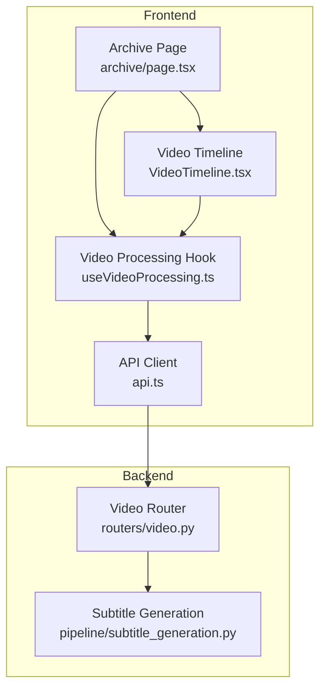
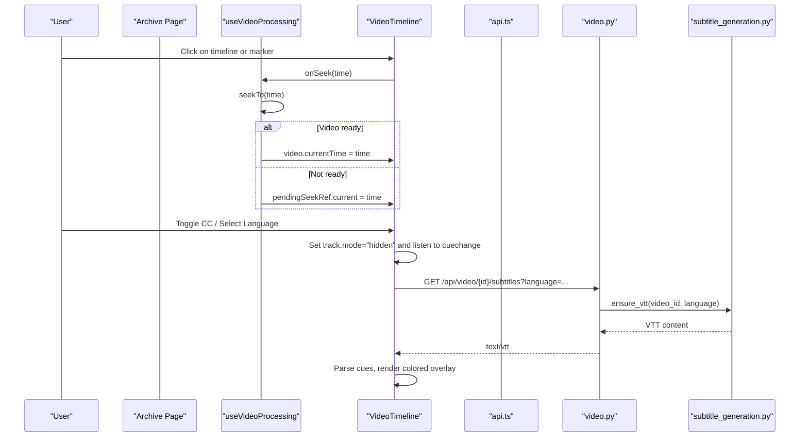
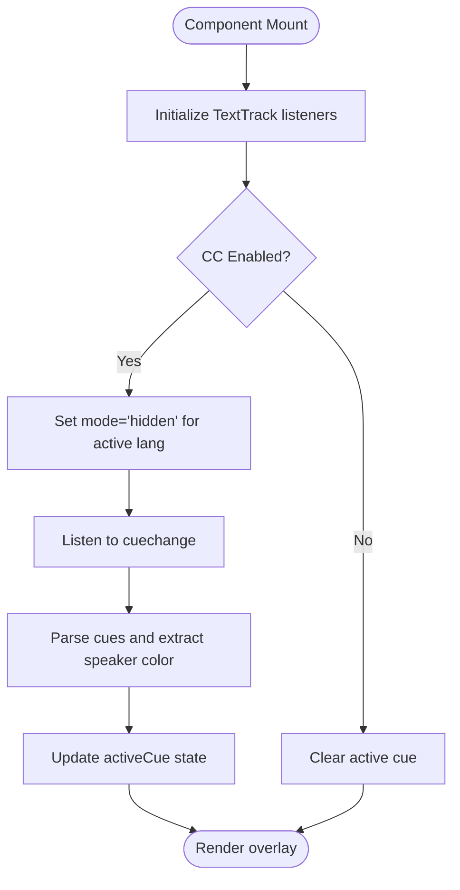
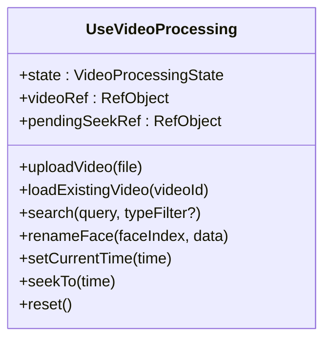
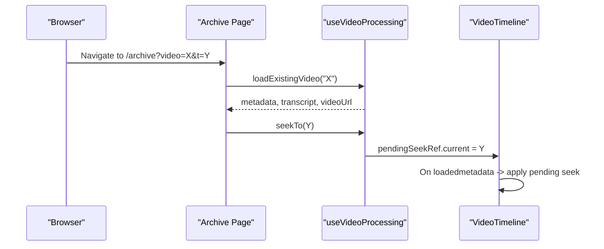
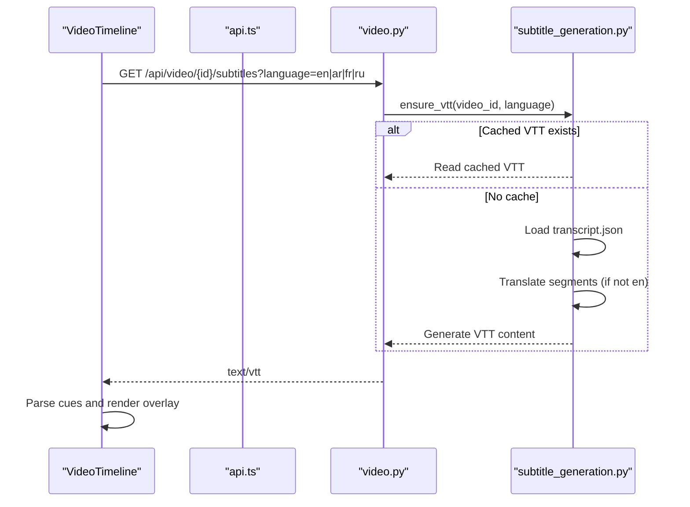
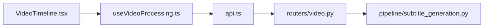

# Video Timeline Component

<cite>
**Referenced Files in This Document**
- [VideoTimeline.tsx](file://frontend/src/components/archive/VideoTimeline.tsx)
- [useVideoProcessing.ts](file://frontend/src/lib/useVideoProcessing.ts)
- [api.ts](file://frontend/src/lib/api.ts)
- [archive/page.tsx](file://frontend/src/app/archive/page.tsx)
- [video.py](file://backend/routers/video.py)
- [subtitle_generation.py](file://backend/pipeline/subtitle_generation.py)
</cite>

## Table of Contents
1. [Introduction](#introduction)
2. [Project Structure](#project-structure)
3. [Core Components](#core-components)
4. [Architecture Overview](#architecture-overview)
5. [Detailed Component Analysis](#detailed-component-analysis)
6. [Dependency Analysis](#dependency-analysis)
7. [Performance Considerations](#performance-considerations)
8. [Troubleshooting Guide](#troubleshooting-guide)
9. [Conclusion](#conclusion)

## Introduction
This document explains the Video Timeline component and its surrounding integration within the Dubai Media application. The timeline provides an interactive video player with:
- Click-to-seek and hover previews
- Scene markers, object markers, and face appearance bars
- Custom closed captions with per-speaker coloring and language selection
- SRT/VTT subtitle download support
- Deep-linking to specific timestamps via URL parameters

It is part of a larger media archive workflow that uploads videos, runs a multi-stage AI pipeline, and surfaces rich metadata for exploration and search.

## Project Structure
The Video Timeline is a React client component integrated into the Archive page. It consumes state from a custom hook and communicates with backend endpoints for subtitles and other features.

**Diagram sources**
- [archive/page.tsx:1-214](file://frontend/src/app/archive/page.tsx#L1-L214)
- [VideoTimeline.tsx:1-573](file://frontend/src/components/archive/VideoTimeline.tsx#L1-L573)
- [useVideoProcessing.ts:1-673](file://frontend/src/lib/useVideoProcessing.ts#L1-L673)
- [api.ts:1-339](file://frontend/src/lib/api.ts#L1-L339)
- [video.py:1-918](file://backend/routers/video.py#L1-L918)
- [subtitle_generation.py:1-577](file://backend/pipeline/subtitle_generation.py#L1-L577)

**Section sources**
- [archive/page.tsx:1-214](file://frontend/src/app/archive/page.tsx#L1-L214)
- [VideoTimeline.tsx:1-573](file://frontend/src/components/archive/VideoTimeline.tsx#L1-L573)
- [useVideoProcessing.ts:1-673](file://frontend/src/lib/useVideoProcessing.ts#L1-L673)
- [api.ts:1-339](file://frontend/src/lib/api.ts#L1-L339)
- [video.py:1-918](file://backend/routers/video.py#L1-L918)
- [subtitle_generation.py:1-577](file://backend/pipeline/subtitle_generation.py#L1-L577)

## Core Components
- VideoTimeline (React component): Renders the video player, timeline bar, scene/object/face overlays, and caption controls. It manages local UI state (hover, active cue, CC toggles) and delegates playback control to the parent via callbacks.
- useVideoProcessing (custom hook): Holds global processing state, orchestrates upload, pipeline status polling/WebSocket, transcript/metadata fetching, and exposes seek/time synchronization helpers.
- api.ts: Provides typed fetch wrappers, file upload with progress, WebSocket helper, and convenience methods for video endpoints.
- Backend video router: Exposes endpoints for upload, status, metadata, transcript, subtitles, dubbing, search, and person naming.
- Subtitle generation module: Converts transcripts to WebVTT/SRT, supports translation, and caches generated files.

**Section sources**
- [VideoTimeline.tsx:1-573](file://frontend/src/components/archive/VideoTimeline.tsx#L1-L573)
- [useVideoProcessing.ts:1-673](file://frontend/src/lib/useVideoProcessing.ts#L1-L673)
- [api.ts:1-339](file://frontend/src/lib/api.ts#L1-L339)
- [video.py:1-918](file://backend/routers/video.py#L1-L918)
- [subtitle_generation.py:1-577](file://backend/pipeline/subtitle_generation.py#L1-L577)

## Architecture Overview
The timeline integrates tightly with the archive page and the processing hook. Playback events are propagated up to the hook, which updates shared state and can trigger seeks across components. Subtitles are provided as native <track> elements; however, rendering is handled by a custom overlay to enable per-speaker colors and consistent behavior across browsers.

**Diagram sources**
- [archive/page.tsx:130-203](file://frontend/src/app/archive/page.tsx#L130-L203)
- [VideoTimeline.tsx:82-178](file://frontend/src/components/archive/VideoTimeline.tsx#L82-L178)
- [useVideoProcessing.ts:594-608](file://frontend/src/lib/useVideoProcessing.ts#L594-L608)
- [api.ts:211-277](file://frontend/src/lib/api.ts#L211-L277)
- [video.py:359-430](file://backend/routers/video.py#L359-L430)
- [subtitle_generation.py:465-527](file://backend/pipeline/subtitle_generation.py#L465-L527)

## Detailed Component Analysis

### VideoTimeline Component
Responsibilities:
- Render the HTML5 video element with optional <track> elements for multiple languages.
- Provide a custom JS-driven caption overlay using hidden tracks and cuechange events.
- Display timeline interactions: click-to-seek, hover preview, scene/object markers, and face appearance bars.
- Manage CC toggle, language selection, and SRT download.

Key behaviors:
- Caption parsing: Extracts speaker labels from WebVTT voice tags and maps them to predefined colors.
- Time sync: Listens to timeupdate and loadedmetadata; honors pending seeks before media is ready.
- Hover tooltip: Finds nearest scene boundary based on hover position.
- Face bars: Visualizes detected persons’ appearances over time with clickable segments.

**Diagram sources**
- [VideoTimeline.tsx:115-178](file://frontend/src/components/archive/VideoTimeline.tsx#L115-L178)

**Section sources**
- [VideoTimeline.tsx:1-573](file://frontend/src/components/archive/VideoTimeline.tsx#L1-L573)

### useVideoProcessing Hook
Responsibilities:
- Maintain processing state (upload, stages, metadata, transcript, search results).
- Upload videos with real-time progress.
- Connect to WebSocket for pipeline updates; fallback to polling if needed.
- Fetch metadata and transcript after completion; map backend responses to frontend types.
- Provide setCurrentTime and seekTo utilities for synchronized playback.

Important details:
- Mapping logic converts backend structures (e.g., scenes timestamps, faces appearances) to frontend-friendly formats.
- Pending seek mechanism ensures deep links and cross-video navigation work even when the player is not yet mounted.

**Diagram sources**
- [useVideoProcessing.ts:135-672](file://frontend/src/lib/useVideoProcessing.ts#L135-L672)

**Section sources**
- [useVideoProcessing.ts:1-673](file://frontend/src/lib/useVideoProcessing.ts#L1-L673)

### Archive Page Integration
The Archive page composes the timeline with other panels and wires up:
- URL-based loading: ?video=<id>&t=<seconds> triggers loadExistingVideo and then seekTo.
- Event wiring: currentTime updates and seek actions flow through the hook’s state.

**Diagram sources**
- [archive/page.tsx:52-68](file://frontend/src/app/archive/page.tsx#L52-L68)
- [useVideoProcessing.ts:644-658](file://frontend/src/lib/useVideoProcessing.ts#L644-L658)
- [VideoTimeline.tsx:203-237](file://frontend/src/components/archive/VideoTimeline.tsx#L203-L237)

**Section sources**
- [archive/page.tsx:1-214](file://frontend/src/app/archive/page.tsx#L1-L214)

### Subtitles and Translation Flow
The timeline uses native <track> elements but renders captions via a custom overlay. The backend generates WebVTT (and optionally SRT) from transcript.json, translating to supported languages when needed.

**Diagram sources**
- [video.py:359-430](file://backend/routers/video.py#L359-L430)
- [subtitle_generation.py:465-527](file://backend/pipeline/subtitle_generation.py#L465-L527)

**Section sources**
- [video.py:359-430](file://backend/routers/video.py#L359-L430)
- [subtitle_generation.py:1-577](file://backend/pipeline/subtitle_generation.py#L1-L577)

## Dependency Analysis
- VideoTimeline depends on:
  - useVideoProcessing for state and callbacks (currentTime, seekTo).
  - api.ts indirectly via track URLs built from API_BASE_URL and videoId.
- useVideoProcessing depends on:
  - api.ts for HTTP and WebSocket calls.
  - Backend endpoints for upload, status, metadata, transcript, search, and person naming.
- Backend video router depends on:
  - Pipeline orchestration and search index.
  - Subtitle generation module for VTT/SRT creation and caching.

**Diagram sources**
- [VideoTimeline.tsx:1-573](file://frontend/src/components/archive/VideoTimeline.tsx#L1-L573)
- [useVideoProcessing.ts:1-673](file://frontend/src/lib/useVideoProcessing.ts#L1-L673)
- [api.ts:1-339](file://frontend/src/lib/api.ts#L1-L339)
- [video.py:1-918](file://backend/routers/video.py#L1-L918)
- [subtitle_generation.py:1-577](file://backend/pipeline/subtitle_generation.py#L1-L577)

**Section sources**
- [VideoTimeline.tsx:1-573](file://frontend/src/components/archive/VideoTimeline.tsx#L1-L573)
- [useVideoProcessing.ts:1-673](file://frontend/src/lib/useVideoProcessing.ts#L1-L673)
- [api.ts:1-339](file://frontend/src/lib/api.ts#L1-L339)
- [video.py:1-918](file://backend/routers/video.py#L1-L918)
- [subtitle_generation.py:1-577](file://backend/pipeline/subtitle_generation.py#L1-L577)

## Performance Considerations
- Avoid excessive re-renders:
  - Keep heavy computations out of render paths; compute derived values like progressPercent once per update.
  - Memoize expensive operations if needed (e.g., scene/object mapping).
- Efficient subtitle handling:
  - Hidden tracks reduce DOM overhead while still enabling cuechange events.
  - Cache VTT files server-side to avoid repeated translations.
- Seek performance:
  - For large videos, prefer seeking only when ready; pendingSeekRef prevents premature seeks.
- UI responsiveness:
  - Debounce hover calculations if many objects/faces exist.
  - Limit number of rendered markers or virtualize if necessary.

[No sources needed since this section provides general guidance]

## Troubleshooting Guide
Common issues and resolutions:
- Captions do not appear:
  - Ensure CC is enabled and a language is selected.
  - Verify backend returns valid VTT and that track elements are attached.
- Wrong speaker color:
  - Confirm WebVTT voice tags match expected labels; check parseCueText logic.
- Seek does nothing:
  - Check if video is ready; pendingSeekRef should be applied on loadedmetadata.
- Subtitle download fails:
  - Validate language/format parameters; ensure transcript exists and translation succeeded.
- Pipeline stalls:
  - Inspect WebSocket connection; fallback polling will start on error/close.

**Section sources**
- [VideoTimeline.tsx:115-178](file://frontend/src/components/archive/VideoTimeline.tsx#L115-L178)
- [useVideoProcessing.ts:239-300](file://frontend/src/lib/useVideoProcessing.ts#L239-L300)
- [video.py:359-430](file://backend/routers/video.py#L359-L430)

## Conclusion
The Video Timeline component offers a robust, accessible way to explore archived videos with rich metadata overlays and multilingual captions. Its design separates concerns between UI (VideoTimeline), state management (useVideoProcessing), and backend services (video router and subtitle generation), enabling scalability and maintainability. With careful attention to performance and error handling, it delivers a smooth user experience for complex media workflows.