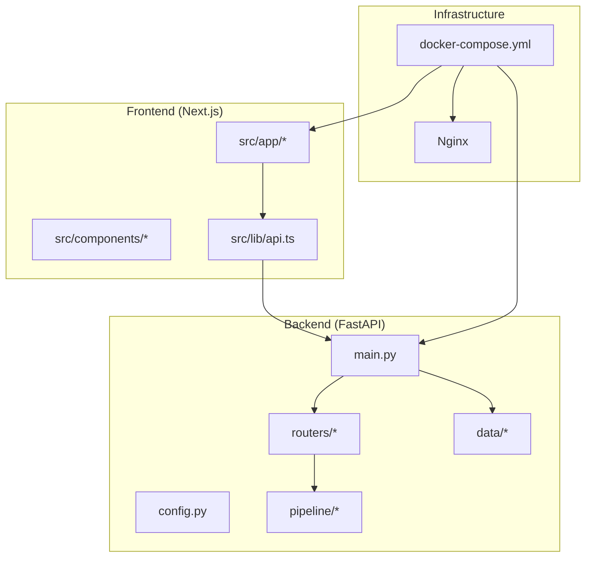
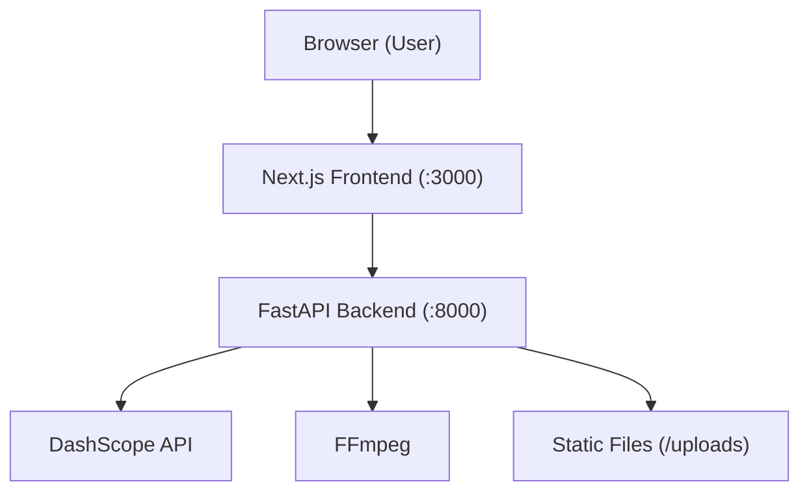
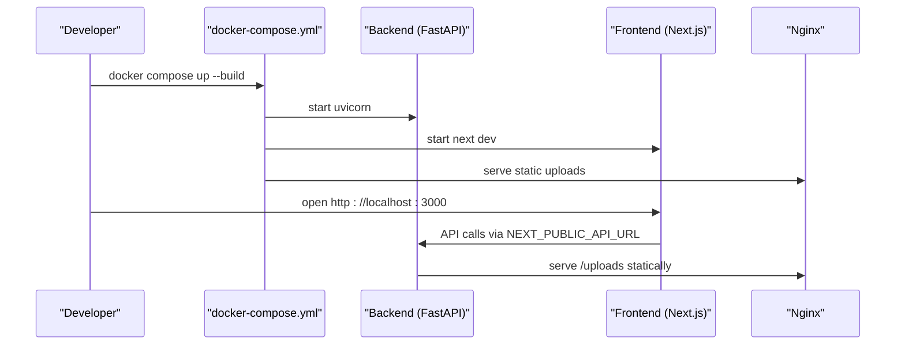
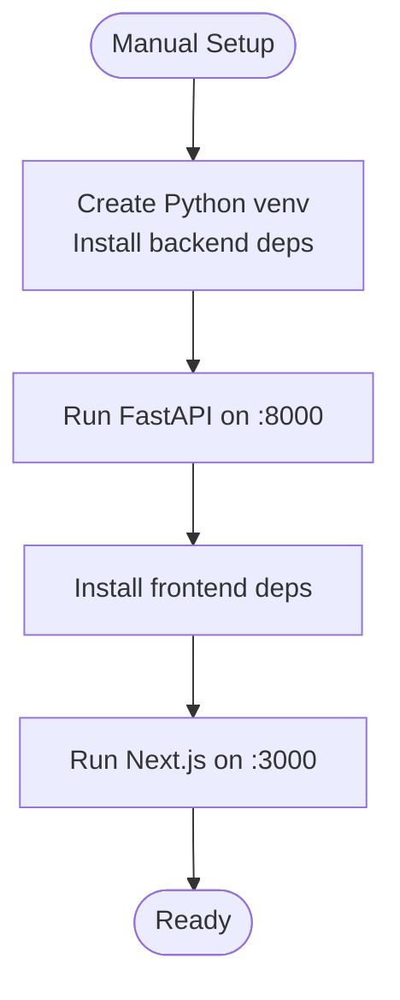
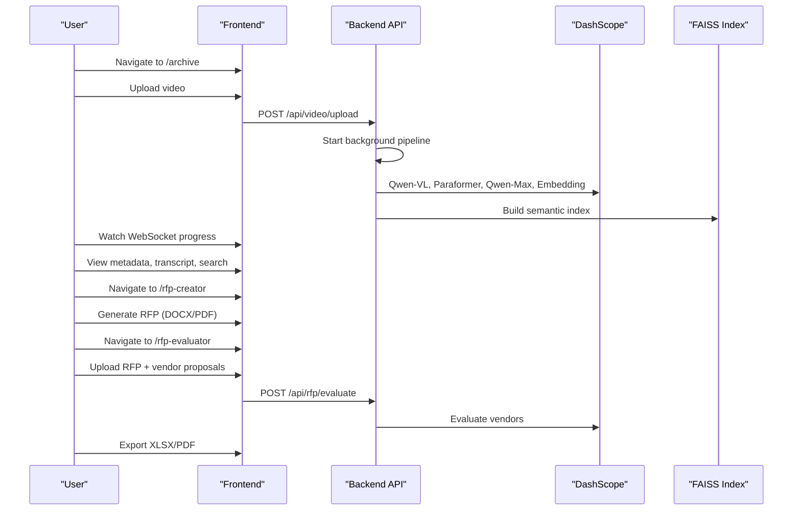
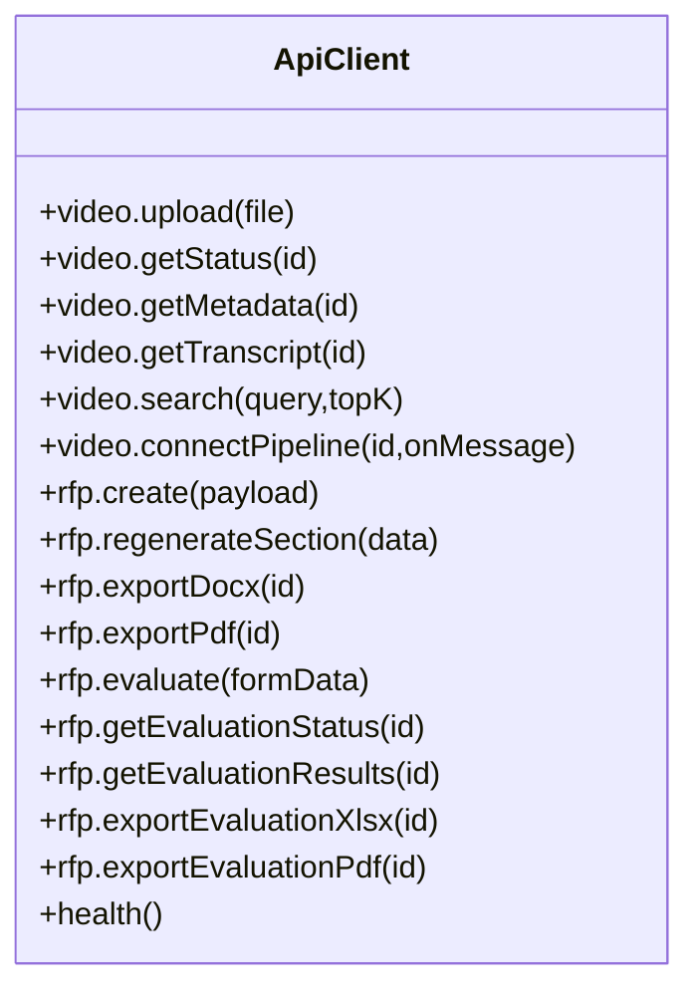
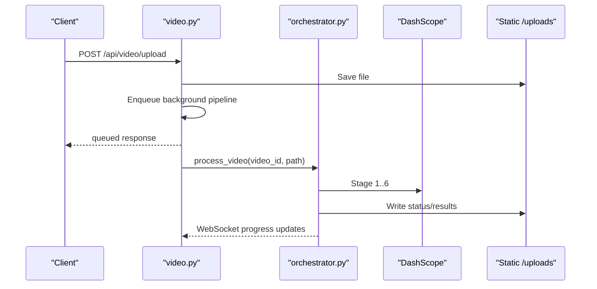
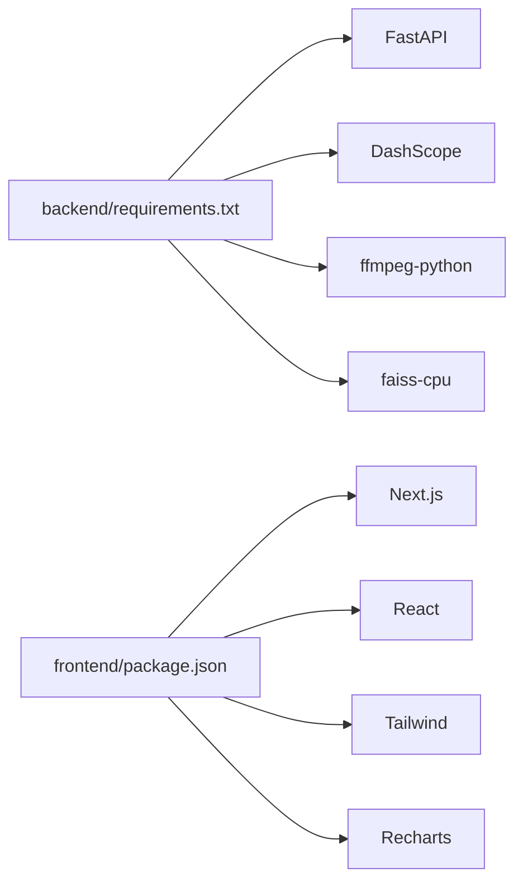

# Getting Started

<cite>
**Referenced Files in This Document**
- [README.md](file://README.md)
- [DEMO_SCRIPT.md](file://DEMO_SCRIPT.md)
- [docker-compose.yml](file://docker-compose.yml)
- [backend/requirements.txt](file://backend/requirements.txt)
- [frontend/package.json](file://frontend/package.json)
- [backend/config.py](file://backend/config.py)
- [backend/main.py](file://backend/main.py)
- [.env.example](file://.env.example)
- [backend/data/iptc_taxonomy.json](file://backend/data/iptc_taxonomy.json)
- [frontend/next.config.ts](file://frontend/next.config.ts)
- [frontend/src/lib/api.ts](file://frontend/src/lib/api.ts)
- [frontend/src/components/Sidebar.tsx](file://frontend/src/components/Sidebar.tsx)
- [frontend/src/components/archive/VideoUpload.tsx](file://frontend/src/components/archive/VideoUpload.tsx)
- [backend/pipeline/orchestrator.py](file://backend/pipeline/orchestrator.py)
- [backend/routers/video.py](file://backend/routers/video.py)
</cite>

## Table of Contents
1. [Introduction](#introduction)
2. [Project Structure](#project-structure)
3. [Core Components](#core-components)
4. [Architecture Overview](#architecture-overview)
5. [Detailed Component Analysis](#detailed-component-analysis)
6. [Dependency Analysis](#dependency-analysis)
7. [Performance Considerations](#performance-considerations)
8. [Troubleshooting Guide](#troubleshooting-guide)
9. [Conclusion](#conclusion)
10. [Appendices](#appendices)

## Introduction
This guide helps you set up and run the Dubai Media × Alibaba Cloud AI MVP quickly. You will configure prerequisites, choose between Docker Compose (recommended) and manual setup, and walk through the demo that showcases video metadata extraction, semantic search, and RFP tools.

Key capabilities:
- Video archive metadata extraction with a six-stage pipeline
- Semantic search over video content
- RFP creation and vendor evaluation workflows

Prerequisites:
- Python 3.11+
- Node.js 20+
- FFmpeg installed and available in PATH
- Alibaba Cloud DashScope API key

## Project Structure
The project is split into:
- backend: FastAPI server, AI pipeline, routers, and configuration
- frontend: Next.js application with React UI and typed API helpers
- docker-compose.yml: Orchestration for backend, frontend, and Nginx
- .env.example: Environment variables template

**Diagram sources**
- [docker-compose.yml:1-43](file://docker-compose.yml#L1-L43)
- [backend/main.py:1-44](file://backend/main.py#L1-L44)
- [frontend/src/lib/api.ts:1-245](file://frontend/src/lib/api.ts#L1-L245)

**Section sources**
- [README.md:193-233](file://README.md#L193-L233)
- [docker-compose.yml:1-43](file://docker-compose.yml#L1-L43)

## Core Components
- Backend configuration and environment variables
- Frontend API client and routing
- Pipeline orchestration and routers
- Demo walkthrough and environment variables

**Section sources**
- [backend/config.py:1-21](file://backend/config.py#L1-L21)
- [frontend/src/lib/api.ts:1-245](file://frontend/src/lib/api.ts#L1-L245)
- [backend/pipeline/orchestrator.py:1-200](file://backend/pipeline/orchestrator.py#L1-L200)
- [backend/routers/video.py:1-200](file://backend/routers/video.py#L1-L200)
- [DEMO_SCRIPT.md:1-151](file://DEMO_SCRIPT.md#L1-L151)

## Architecture Overview
High-level runtime architecture:
- Browser (user) interacts with Next.js frontend
- Frontend calls FastAPI backend endpoints
- Backend invokes Alibaba Cloud DashScope models and local tools (FFmpeg)
- Results are persisted under uploads and served via static files

**Diagram sources**
- [README.md:17-40](file://README.md#L17-L40)
- [backend/main.py:35](file://backend/main.py#L35)
- [backend/requirements.txt:6](file://backend/requirements.txt#L6)

## Detailed Component Analysis

### Environment Configuration
- Create .env from .env.example and set DASHSCOPE_API_KEY
- Backend reads environment via pydantic-settings and exposes configurable models and base URLs
- Frontend reads NEXT_PUBLIC_API_URL to determine backend origin

Key variables:
- DASHSCOPE_API_KEY (required)
- DASHSCOPE_BASE_URL (default provided)
- MODEL_VIDEO, MODEL_ASR, MODEL_TEXT, MODEL_EMBEDDING (defaults provided)
- BASE_URL (used for serving uploads)

**Section sources**
- [.env.example:1-8](file://.env.example#L1-L8)
- [backend/config.py:4-21](file://backend/config.py#L4-L21)
- [frontend/src/lib/api.ts:1-4](file://frontend/src/lib/api.ts#L1-L4)

### Installation Approaches

#### Option 1: Docker Compose (Recommended)
- Build and start backend, frontend, and Nginx
- Backend mounts uploads volume and serves static files
- Frontend sets NEXT_PUBLIC_API_URL to http://localhost:8000
- Access:
  - Frontend: http://localhost:3000
  - Backend API: http://localhost:8000
  - Nginx proxy: http://localhost:8080

**Diagram sources**
- [docker-compose.yml:1-43](file://docker-compose.yml#L1-L43)
- [frontend/src/lib/api.ts:1-4](file://frontend/src/lib/api.ts#L1-L4)

**Section sources**
- [README.md:74-91](file://README.md#L74-L91)
- [docker-compose.yml:1-43](file://docker-compose.yml#L1-L43)

#### Option 2: Manual Setup (Development)
- Backend:
  - Create virtual environment
  - Install Python dependencies
  - Run FastAPI with Uvicorn on port 8000
- Frontend:
  - Install Node.js dependencies
  - Run Next.js dev server on port 3000

**Diagram sources**
- [README.md:92-109](file://README.md#L92-L109)
- [backend/requirements.txt:1-16](file://backend/requirements.txt#L1-L16)
- [frontend/package.json:1-29](file://frontend/package.json#L1-L29)

**Section sources**
- [README.md:92-109](file://README.md#L92-L109)

### First Run Tutorial
- Ensure FFmpeg is installed and on PATH
- Create .env from .env.example and set DASHSCOPE_API_KEY
- Choose Docker Compose (recommended) or manual setup
- Open http://localhost:3000 and verify API connectivity

**Section sources**
- [README.md:63-70](file://README.md#L63-L70)
- [README.md:112-125](file://README.md#L112-L125)
- [frontend/src/components/Sidebar.tsx:58-63](file://frontend/src/components/Sidebar.tsx#L58-L63)

### Demo Walkthrough
Follow the end-to-end demo script to explore all tools.

**Diagram sources**
- [DEMO_SCRIPT.md:21-120](file://DEMO_SCRIPT.md#L21-L120)
- [backend/routers/video.py:39-92](file://backend/routers/video.py#L39-L92)
- [backend/pipeline/orchestrator.py:44-200](file://backend/pipeline/orchestrator.py#L44-L200)

**Section sources**
- [DEMO_SCRIPT.md:1-151](file://DEMO_SCRIPT.md#L1-L151)
- [README.md:137-145](file://README.md#L137-L145)

### Frontend API and Routing
- API client centralizes HTTP and WebSocket calls
- Routes include video upload/status/metadata/transcript/search and RFP endpoints
- Sidebar navigation links to archive, RFP creator, and RFP evaluator

**Diagram sources**
- [frontend/src/lib/api.ts:164-244](file://frontend/src/lib/api.ts#L164-L244)

**Section sources**
- [frontend/src/lib/api.ts:1-245](file://frontend/src/lib/api.ts#L1-L245)
- [frontend/src/components/Sidebar.tsx:11-15](file://frontend/src/components/Sidebar.tsx#L11-L15)

### Backend Pipeline and Routers
- Pipeline orchestrator coordinates six stages and emits progress via WebSocket
- Routers expose endpoints for video processing, search, and RFP workflows
- Static files mount serves uploaded content

**Diagram sources**
- [backend/routers/video.py:39-120](file://backend/routers/video.py#L39-L120)
- [backend/pipeline/orchestrator.py:44-200](file://backend/pipeline/orchestrator.py#L44-L200)
- [backend/main.py:35](file://backend/main.py#L35)

**Section sources**
- [backend/routers/video.py:1-200](file://backend/routers/video.py#L1-L200)
- [backend/pipeline/orchestrator.py:1-200](file://backend/pipeline/orchestrator.py#L1-L200)
- [backend/main.py:35](file://backend/main.py#L35)

## Dependency Analysis
- Backend dependencies include FastAPI, Uvicorn, DashScope SDK, FFmpeg wrapper, FAISS, and others
- Frontend dependencies include Next.js, React, Tailwind, and Recharts

**Diagram sources**
- [backend/requirements.txt:1-16](file://backend/requirements.txt#L1-L16)
- [frontend/package.json:11-27](file://frontend/package.json#L11-L27)

**Section sources**
- [backend/requirements.txt:1-16](file://backend/requirements.txt#L1-L16)
- [frontend/package.json:1-29](file://frontend/package.json#L1-L29)

## Performance Considerations
- Large videos increase DashScope token/time usage; keep demos under 10 minutes
- ASR is asynchronous; expect delays for long audio
- FAISS indexing is CPU-bound; consider scaling with managed vector services for production
- Use Docker Compose for consistent resource isolation and predictable performance

## Troubleshooting Guide
Common issues and resolutions:
- FFmpeg not found
  - Ensure FFmpeg is installed and on PATH
  - The ingestion stage requires FFmpeg to extract audio and thumbnails
- Invalid or missing DASHSCOPE_API_KEY
  - Set DASHSCOPE_API_KEY in .env
  - Confirm model names and base URL match your DashScope configuration
- CORS or static file serving
  - Backend serves /uploads via StaticFiles; verify BASE_URL and Nginx mount
- Frontend cannot reach backend
  - Ensure NEXT_PUBLIC_API_URL matches backend address
  - In Docker, set NEXT_PUBLIC_API_URL=http://localhost:8000
- Long-running operations
  - Pipeline and evaluation are async; use WebSocket endpoints for progress
  - For demo resilience, pre-process a video so cached results appear instantly

Environment variables to verify:
- DASHSCOPE_API_KEY, DASHSCOPE_BASE_URL, MODEL_VIDEO, MODEL_ASR, MODEL_TEXT, MODEL_EMBEDDING, BASE_URL

**Section sources**
- [README.md:63-70](file://README.md#L63-L70)
- [README.md:112-125](file://README.md#L112-L125)
- [backend/config.py:4-21](file://backend/config.py#L4-L21)
- [frontend/src/lib/api.ts:1-4](file://frontend/src/lib/api.ts#L1-L4)
- [backend/main.py:35](file://backend/main.py#L35)
- [DEMO_SCRIPT.md:144-151](file://DEMO_SCRIPT.md#L144-L151)

## Conclusion
You now have the essentials to install, configure, and run the Dubai Media MVP. Use Docker Compose for a quick start, or follow manual steps for development. Explore the demo to see video metadata extraction, semantic search, and RFP tools in action.

## Appendices

### API Endpoints Reference
- Video
  - POST /api/video/upload
  - GET /api/video/{id}/status
  - GET /api/video/{id}/metadata
  - GET /api/video/{id}/transcript
  - POST /api/search
  - WS /ws/pipeline/{id}
- RFP
  - POST /api/rfp/create
  - POST /api/rfp/regenerate-section
  - GET /api/rfp/{id}/export/docx
  - GET /api/rfp/{id}/export/pdf
  - POST /api/rfp/evaluate
  - GET /api/rfp/evaluation/{id}/status
  - GET /api/rfp/evaluation/{id}/results
  - GET /api/rfp/evaluation/{id}/export/xlsx
  - GET /api/rfp/evaluation/{id}/export/pdf
- Health
  - GET /api/health

**Section sources**
- [README.md:148-168](file://README.md#L148-L168)

### IPTC Taxonomy Reference
- The backend includes a reference taxonomy for IPTC topics used in metadata structuring.

**Section sources**
- [backend/data/iptc_taxonomy.json:1-28](file://backend/data/iptc_taxonomy.json#L1-L28)