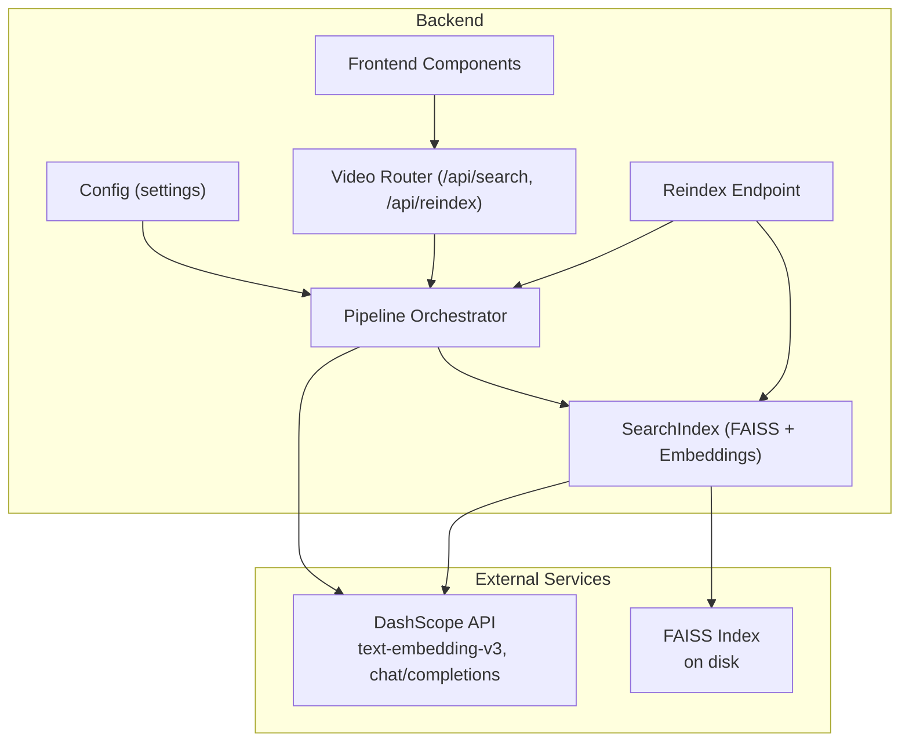
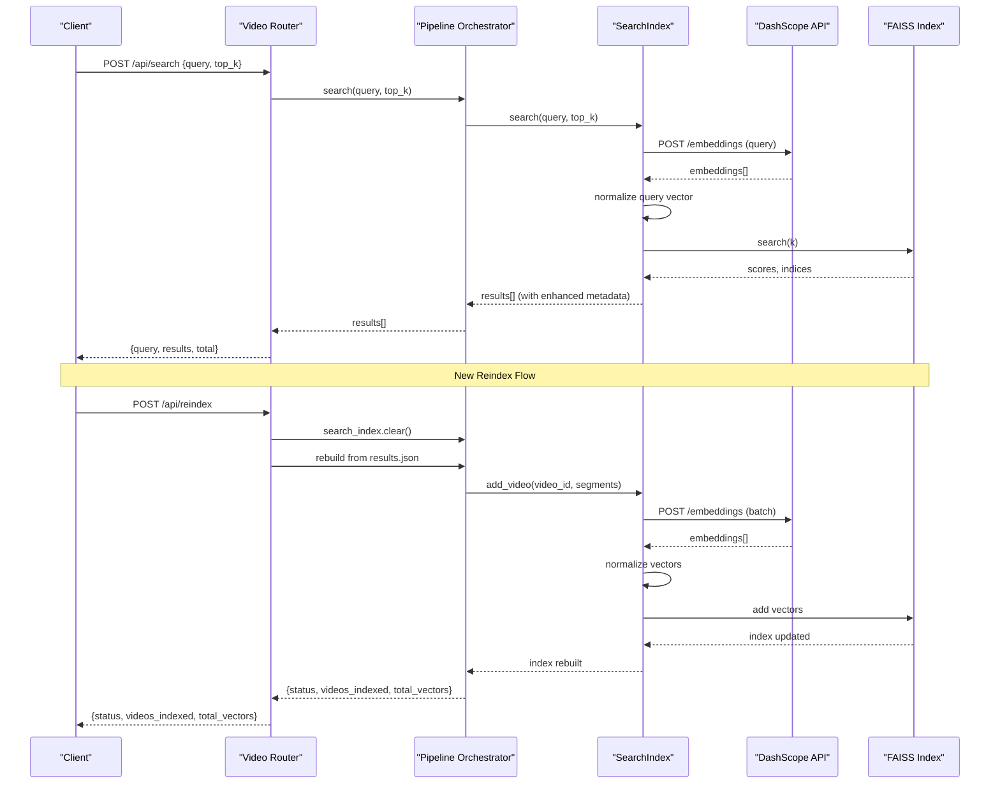
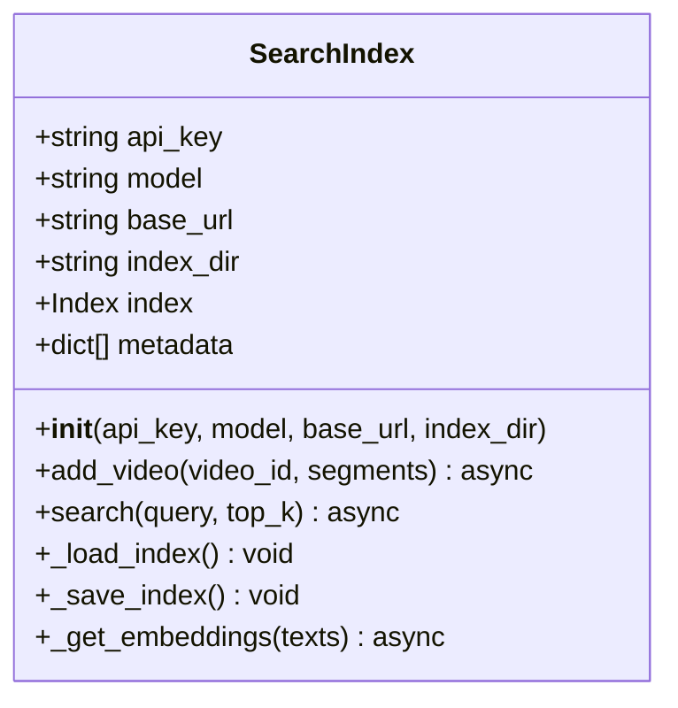
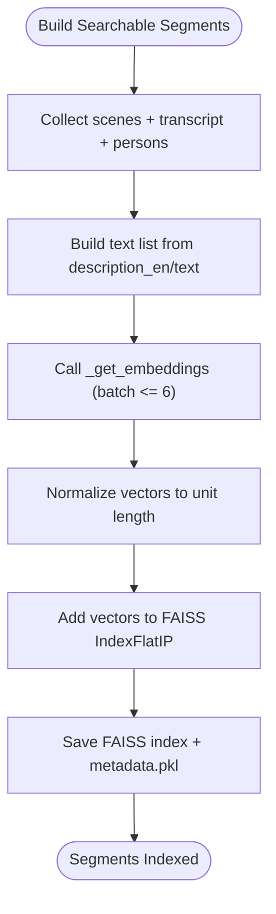
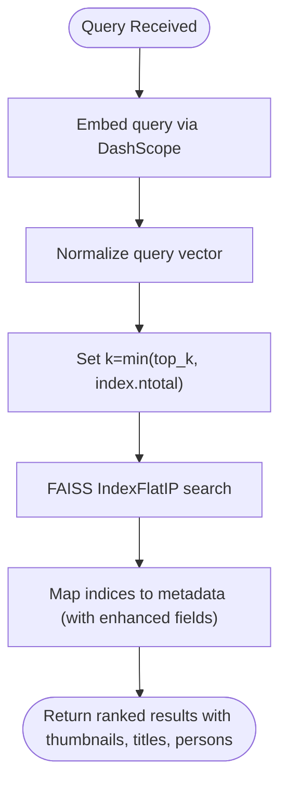
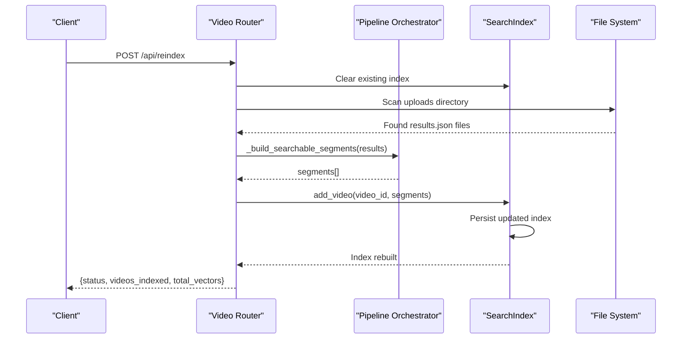
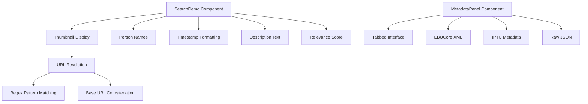
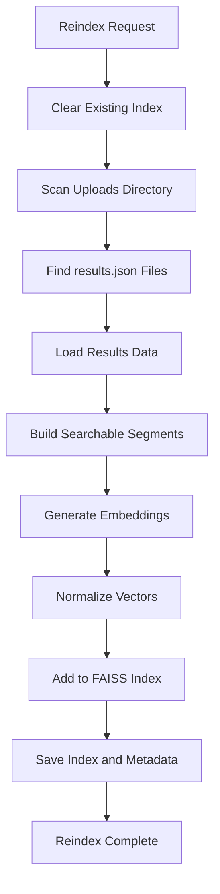
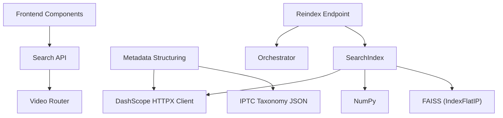

# Intelligent Search System

<cite>
**Referenced Files in This Document**
- [backend/pipeline/search_index.py](file://backend/pipeline/search_index.py)
- [backend/pipeline/orchestrator.py](file://backend/pipeline/orchestrator.py)
- [backend/routers/video.py](file://backend/routers/video.py)
- [backend/config.py](file://backend/config.py)
- [backend/data/iptc_taxonomy.json](file://backend/data/iptc_taxonomy.json)
- [backend/pipeline/metadata_structuring.py](file://backend/pipeline/metadata_structuring.py)
- [backend/requirements.txt](file://backend/requirements.txt)
- [frontend/src/components/archive/SearchDemo.tsx](file://frontend/src/components/archive/SearchDemo.tsx)
- [frontend/src/components/archive/MetadataPanel.tsx](file://frontend/src/components/archive/MetadataPanel.tsx)
- [frontend/src/lib/useVideoProcessing.ts](file://frontend/src/lib/useVideoProcessing.ts)
- [README.md](file://README.md)
</cite>

## Update Summary
**Changes Made**
- Added new `/api/reindex` endpoint for rebuilding search indexes from existing processed videos
- Enhanced thumbnail URL resolution with improved path handling and browser accessibility
- Improved search segment building with better metadata extraction and person identification
- Enhanced search results display with comprehensive metadata including thumbnails, titles, person names, and scene types
- Updated orchestrator to include person identification in searchable segments
- Enhanced frontend components to render richer search results with improved thumbnail resolution

## Table of Contents
1. [Introduction](#introduction)
2. [Project Structure](#project-structure)
3. [Core Components](#core-components)
4. [Architecture Overview](#architecture-overview)
5. [Detailed Component Analysis](#detailed-component-analysis)
6. [Enhanced Search Results Display](#enhanced-search-results-display)
7. [Search Index Management](#search-index-management)
8. [Dependency Analysis](#dependency-analysis)
9. [Performance Considerations](#performance-considerations)
10. [Troubleshooting Guide](#troubleshooting-guide)
11. [Conclusion](#conclusion)
12. [Appendices](#appendices)

## Introduction
This document explains the intelligent semantic search system that powers natural language search over a media archive. The system builds a FAISS-based vector index using embeddings generated by Alibaba Cloud's DashScope text-embedding-v3 model. Video metadata—captured during automated processing—is converted into searchable segments and normalized vectors. The IPTC taxonomy is integrated to enrich metadata and improve topic-awareness for search relevance. The system now provides enhanced search results with comprehensive metadata including thumbnails, titles, person names, and scene types, significantly improving the user experience for content discovery. Additionally, the system now includes robust search index management capabilities with reindex functionality for maintaining and rebuilding search indexes.

## Project Structure
The search system is implemented as part of a six-stage video processing pipeline orchestrated by a central controller. The key components involved in semantic search are:
- SearchIndex: FAISS-backed vector store with embedding generation and persistence
- Pipeline Orchestrator: Pipeline coordinator that invokes search index building
- Routers: API endpoints exposing upload, status, metadata, transcript, search, and reindex functionality
- Config: Application settings including DashScope credentials and model identifiers
- IPTC Taxonomy: Topic classification vocabulary for metadata structuring
- Frontend Components: Rich search result display with thumbnails and person information

**Diagram sources**
- [backend/pipeline/search_index.py:22-245](file://backend/pipeline/search_index.py#L22-L245)
- [backend/pipeline/orchestrator.py:34-207](file://backend/pipeline/orchestrator.py#L34-L207)
- [backend/routers/video.py:198-279](file://backend/routers/video.py#L198-L279)
- [backend/config.py:4-21](file://backend/config.py#L4-L21)

**Section sources**
- [README.md:17-41](file://README.md#L17-L41)
- [backend/requirements.txt:1-16](file://backend/requirements.txt#L1-L16)

## Core Components
- SearchIndex: Manages FAISS index lifecycle, embedding generation via DashScope, normalization, batched indexing, and persistence to disk. Now includes enhanced metadata fields for richer search results.
- Pipeline Orchestrator: Coordinates pipeline stages and triggers search index population using scene and transcript segments, including person identification.
- Video Router: Exposes POST /api/search and GET /api/search endpoints for semantic search, plus the new POST/GET /api/reindex endpoint for index management.
- Config: Provides DashScope API key, base URL, and model identifiers used by the search index and other pipeline stages.
- IPTC Taxonomy: Loaded by the metadata structuring stage and included in prompts to produce IPTC-aligned metadata.
- Frontend Components: Rich display of search results with thumbnails, titles, person names, and scene types.

Key responsibilities:
- Embedding generation: Uses DashScope text-embedding-v3 to convert text to 1024-dimensional vectors.
- Index normalization: Normalizes vectors to unit length to enable cosine similarity via inner product index.
- Persistence: Saves FAISS index and associated metadata to disk for durability across restarts.
- Search: Embeds the query, normalizes, performs a top-k inner-product search, and returns ranked results with comprehensive metadata.
- Enhanced Results: Provides rich metadata including thumbnails, titles, person names, and scene types for improved user experience.
- **New**: Reindex functionality: Allows rebuilding search indexes from all existing processed videos with full metadata preservation.

**Section sources**
- [backend/pipeline/search_index.py:22-245](file://backend/pipeline/search_index.py#L22-L245)
- [backend/pipeline/orchestrator.py:34-207](file://backend/pipeline/orchestrator.py#L34-L207)
- [backend/routers/video.py:198-279](file://backend/routers/video.py#L198-L279)
- [backend/config.py:4-21](file://backend/config.py#L4-L21)
- [backend/data/iptc_taxonomy.json:1-28](file://backend/data/iptc_taxonomy.json#L1-L28)

## Architecture Overview
The semantic search architecture integrates external AI services with local FAISS indexing and persistence. The pipeline produces searchable segments from scenes and transcripts, converts them to embeddings, normalizes vectors, and adds them to the index. Queries are embedded and searched similarly, with results mapped back to original metadata including enhanced fields for comprehensive display. The new reindex endpoint enables maintenance and recovery operations by rebuilding indexes from existing processed data.

**Diagram sources**
- [backend/routers/video.py:198-279](file://backend/routers/video.py#L198-L279)
- [backend/pipeline/orchestrator.py:168-182](file://backend/pipeline/orchestrator.py#L168-L182)
- [backend/pipeline/search_index.py:156-196](file://backend/pipeline/search_index.py#L156-L196)
- [backend/pipeline/search_index.py:198-244](file://backend/pipeline/search_index.py#L198-L244)

## Detailed Component Analysis

### SearchIndex: FAISS-based Vector Search
The SearchIndex class encapsulates:
- Initialization with DashScope credentials and model settings
- Loading an existing FAISS index and metadata from disk, or creating a new index
- Building searchable segments from video results and adding them to the index
- Persisting the index and metadata to disk
- Performing semantic search with normalized query vectors and returning ranked results

Implementation highlights:
- Embedding dimension: 1024 (text-embedding-v3)
- Index type: Inner-product (IndexFlatIP) enabling cosine similarity after vector normalization
- Batch embedding: Up to 6 texts per DashScope embeddings call (optimized for performance)
- Fallback: Zero-vector embedding when API calls fail
- Persistence: FAISS index and pickled metadata saved under backend/data/search_index
- Enhanced metadata: Now includes title, thumbnail, and persons arrays for richer results

**Diagram sources**
- [backend/pipeline/search_index.py:22-245](file://backend/pipeline/search_index.py#L22-L245)

**Section sources**
- [backend/pipeline/search_index.py:22-245](file://backend/pipeline/search_index.py#L22-L245)

### Embedding Generation and Segment Conversion
The orchestrator prepares searchable segments from:
- Scenes: description_en, timestamp, scene_type
- Transcript: text segments with timestamps
- Identified persons: name_en and role appended to descriptions

These segments are passed to SearchIndex.add_video, which:
- Builds a list of texts from description_en/text fields
- Calls _get_embeddings with DashScope text-embedding-v3
- Normalizes vectors to unit length
- Adds vectors to FAISS and persists index and metadata

**Diagram sources**
- [backend/pipeline/orchestrator.py:283-314](file://backend/pipeline/orchestrator.py#L283-L314)
- [backend/pipeline/search_index.py:88-155](file://backend/pipeline/search_index.py#L88-L155)
- [backend/pipeline/search_index.py:198-244](file://backend/pipeline/search_index.py#L198-L244)

**Section sources**
- [backend/pipeline/orchestrator.py:283-314](file://backend/pipeline/orchestrator.py#L283-L314)
- [backend/pipeline/search_index.py:88-155](file://backend/pipeline/search_index.py#L88-L155)

### Search Algorithm, Similarity Scoring, and Ranking
Search behavior:
- Query embedding: Generated via DashScope embeddings
- Normalization: Query vector normalized to unit length
- Similarity: Inner product on normalized vectors equals cosine similarity
- Top-k: FAISS search returns scores and indices for top_k matches
- Ranking: Results ordered by descending score, with metadata reconstructed from stored parallel metadata list

**Diagram sources**
- [backend/pipeline/search_index.py:156-196](file://backend/pipeline/search_index.py#L156-L196)

**Section sources**
- [backend/pipeline/search_index.py:156-196](file://backend/pipeline/search_index.py#L156-L196)

### IPTC Taxonomy Integration
The IPTC taxonomy is integrated during metadata structuring:
- The taxonomy is loaded from backend/data/iptc_taxonomy.json
- It is injected into the metadata structuring prompt to guide topic classification aligned with IPTC codes
- The resulting metadata includes topic codes and names in English and Arabic, enhancing semantic richness for downstream tasks

**Diagram sources**
- [backend/data/iptc_taxonomy.json:1-28](file://backend/data/iptc_taxonomy.json#L1-L28)
- [backend/pipeline/metadata_structuring.py:22-33](file://backend/pipeline/metadata_structuring.py#L22-L33)
- [backend/pipeline/metadata_structuring.py:108-112](file://backend/pipeline/metadata_structuring.py#L108-L112)

**Section sources**
- [backend/data/iptc_taxonomy.json:1-28](file://backend/data/iptc_taxonomy.json#L1-L28)
- [backend/pipeline/metadata_structuring.py:35-78](file://backend/pipeline/metadata_structuring.py#L35-L78)

### API and Routing
The search endpoint:
- Accepts a SearchRequest with query and top_k
- Delegates to the orchestrator's SearchIndex.search
- Returns results with video_id, timestamp, description, scene_type, score, thumbnail, and persons

**Updated** Added new reindex endpoint for managing search indexes

The reindex endpoint:
- Accepts GET/POST requests to rebuild the search index
- Clears existing index and metadata
- Scans all processed videos with results.json
- Rebuilds segments from scratch using orchestrator's segment builder
- Returns status, count of videos indexed, and total vector count

**Diagram sources**
- [backend/routers/video.py:239-279](file://backend/routers/video.py#L239-L279)
- [backend/pipeline/orchestrator.py:307-367](file://backend/pipeline/orchestrator.py#L307-L367)
- [backend/pipeline/search_index.py:143-213](file://backend/pipeline/search_index.py#L143-L213)

**Section sources**
- [backend/routers/video.py:198-279](file://backend/routers/video.py#L198-L279)

## Enhanced Search Results Display

### Rich Metadata Fields
The search system now provides comprehensive metadata in search results:

- **Title**: Video title extracted from IPTC metadata (headline)
- **Thumbnail**: Preview image path for visual recognition
- **Persons**: Array of person names identified in the segment
- **Scene Type**: Category of the visual scene (e.g., interview, aerial shot)
- **Timestamp**: Precise timing information for video navigation
- **Description**: Full text description of the segment
- **Score**: Confidence score for relevance ranking

### Enhanced Thumbnail URL Resolution
**Updated** Improved thumbnail URL handling for better browser accessibility:

- **Backend**: Converts filesystem paths to URL-accessible paths using regex pattern matching
- **Frontend**: Resolves raw thumbnail paths to full URLs with proper base URL concatenation
- **Format Support**: Handles various input formats including "./uploads/...", "uploads/...", "/uploads/..."

### Frontend Implementation
The frontend components have been enhanced to display this rich metadata:

- **SearchDemo Component**: Shows thumbnails, person names, and formatted timestamps with improved URL resolution
- **MetadataPanel Component**: Provides detailed metadata visualization
- **useVideoProcessing Hook**: Defines SearchResult interface with all enhanced fields

**Diagram sources**
- [frontend/src/components/archive/SearchDemo.tsx:13-21](file://frontend/src/components/archive/SearchDemo.tsx#L13-L21)
- [frontend/src/components/archive/SearchDemo.tsx:131-190](file://frontend/src/components/archive/SearchDemo.tsx#L131-L190)
- [frontend/src/components/archive/MetadataPanel.tsx:304-376](file://frontend/src/components/archive/MetadataPanel.tsx#L304-L376)
- [frontend/src/lib/useVideoProcessing.ts:77-84](file://frontend/src/lib/useVideoProcessing.ts#L77-L84)

**Section sources**
- [frontend/src/components/archive/SearchDemo.tsx:13-21](file://frontend/src/components/archive/SearchDemo.tsx#L13-L21)
- [frontend/src/components/archive/SearchDemo.tsx:131-190](file://frontend/src/components/archive/SearchDemo.tsx#L131-L190)
- [frontend/src/components/archive/MetadataPanel.tsx:304-376](file://frontend/src/components/archive/MetadataPanel.tsx#L304-L376)
- [frontend/src/lib/useVideoProcessing.ts:77-84](file://frontend/src/lib/useVideoProcessing.ts#L77-L84)

## Search Index Management

### Reindex Endpoint
**New Feature** The system now includes a comprehensive reindex endpoint for managing search indexes:

- **Endpoint**: `/api/reindex` (supports both GET and POST methods)
- **Functionality**: Rebuilds the entire search index from all existing processed videos
- **Process**: Clears existing index, scans uploads directory for results.json files, rebuilds segments, and persists new index
- **Monitoring**: Returns detailed status including videos processed, total vectors, and success indicators

### Enhanced Segment Building
**Improved** The orchestrator's segment building now includes:

- **Better Metadata Extraction**: Extracts title from IPTC metadata for consistent segment labeling
- **Enhanced Thumbnail Handling**: Converts filesystem paths to URL-accessible formats
- **Improved Person Identification**: Better handling of identified persons with role information
- **Robust Timestamp Parsing**: More reliable conversion from various timestamp formats

**Diagram sources**
- [backend/routers/video.py:239-279](file://backend/routers/video.py#L239-L279)
- [backend/pipeline/orchestrator.py:307-367](file://backend/pipeline/orchestrator.py#L307-L367)
- [backend/pipeline/search_index.py:143-213](file://backend/pipeline/search_index.py#L143-L213)

**Section sources**
- [backend/routers/video.py:239-279](file://backend/routers/video.py#L239-L279)
- [backend/pipeline/orchestrator.py:307-367](file://backend/pipeline/orchestrator.py#L307-L367)

## Dependency Analysis
External dependencies relevant to search:
- DashScope SDK and HTTP client for embeddings and model completions
- FAISS (faiss-cpu) for vector indexing and similarity search
- NumPy for vector math and normalization

**Diagram sources**
- [backend/requirements.txt:5-12](file://backend/requirements.txt#L5-L12)
- [backend/pipeline/search_index.py:13-14](file://backend/pipeline/search_index.py#L13-L14)
- [backend/pipeline/metadata_structuring.py:14-14](file://backend/pipeline/metadata_structuring.py#L14-L14)

**Section sources**
- [backend/requirements.txt:1-16](file://backend/requirements.txt#L1-L16)

## Performance Considerations
- Embedding throughput: The system batches up to 6 texts per DashScope embeddings call (optimized from previous 25). For very large segment lists, consider adjusting batch size and monitoring API latency and rate limits.
- Index size and recall: Larger indexes increase memory usage and search latency. Tune top_k and consider index types beyond IndexFlatIP for large-scale deployments.
- Normalization overhead: Vector normalization is O(n) per query; pre-normalized vectors reduce runtime cost but require careful pipeline consistency.
- Persistence frequency: Saving the index after each add_video ensures durability but may impact throughput. Consider batching additions and periodic saves for heavy workloads.
- Network reliability: Embedding calls are retried with exponential backoff; ensure adequate timeouts and monitor API availability.
- Frontend rendering: Enhanced metadata requires efficient rendering of thumbnails and person lists to maintain responsive user experience.
- **New**: Reindex performance: The reindex endpoint processes all existing videos sequentially; consider the impact on system resources during large-scale reindex operations.

## Troubleshooting Guide
Common issues and resolutions:
- No FAISS available: If faiss-cpu is not installed, the SearchIndex logs a warning and skips indexing. Install faiss-cpu to enable vector search.
- Empty or missing index: On startup, if the FAISS index or metadata file is missing, a new index is created. Verify persistence paths and permissions.
- Embedding API failures: The system retries with exponential backoff and falls back to zero vectors for batches. Check DashScope API key validity, quotas, and network connectivity.
- Search returns no results: Ensure at least one video has completed the search_index stage and that the index contains vectors. Confirm embeddings are being generated and vectors are normalized.
- Slow search performance: Reduce top_k, ensure vectors are normalized, and consider upgrading to a GPU-enabled FAISS build for larger datasets.
- **New**: Reindex failures: If reindex fails, check that all processed videos have results.json files and that the orchestrator can successfully build segments from the data.
- **New**: Thumbnail resolution issues: Verify that thumbnail paths are properly extracted and accessible. The system now handles various path formats including relative and absolute paths.
- Person names not displaying: Ensure face recognition has successfully identified persons and that name_en fields are populated.

**Section sources**
- [backend/pipeline/search_index.py:61-70](file://backend/pipeline/search_index.py#L61-L70)
- [backend/pipeline/search_index.py:214-244](file://backend/pipeline/search_index.py#L214-L244)

## Conclusion
The intelligent semantic search system leverages DashScope embeddings and FAISS to deliver natural language search over video archive content. By converting scenes, transcripts, and identified persons into normalized vectors and persisting them to disk, the system supports scalable, accurate, and durable semantic retrieval. The IPTC taxonomy integration further enriches metadata and improves topic-aware search. The enhanced search results display with thumbnails, titles, person names, and scene types significantly improves user experience for content discovery. The new reindex functionality provides robust index management capabilities, allowing administrators to rebuild and maintain search indexes efficiently. With appropriate configuration and operational practices, the system can be tuned for performance and reliability in production environments.

## Appendices

### Configuration Options for Search Behavior
- DashScope API key and base URL: Provided via environment variables and loaded by settings
- Model identifiers: MODEL_EMBEDDING selects the embedding model; MODEL_VIDEO, MODEL_ASR, MODEL_TEXT are used by other pipeline stages
- Index persistence directory: Controlled by the SearchIndex constructor and defaults to backend/data/search_index
- Batch size optimization: Default batch size of 6 texts per embedding call balances throughput and API limits

Operational tips:
- Set DASHSCOPE_API_KEY and ensure DASHSCOPE_BASE_URL is reachable
- Monitor embedding costs and quota limits
- Back up the search_index directory regularly for disaster recovery
- Adjust batch sizes based on API rate limits and performance requirements
- **New**: Use the reindex endpoint to rebuild indexes after system upgrades or data corruption

**Section sources**
- [backend/config.py:4-21](file://backend/config.py#L4-L21)
- [backend/pipeline/search_index.py:18-39](file://backend/pipeline/search_index.py#L18-L39)

### Example Search Queries
Effective queries typically combine visual and textual descriptors:
- "Aerial shots of Dubai skyline"
- "Interview with government official"
- "Person speaking about tourism"
- "Sports event in progress"
- "Sheikh Mohammed in official meeting"
- "Dubai Media Council members discussing policy"

### Enhanced Metadata Field Reference
The search system now provides the following enhanced metadata fields:

- **video_id**: Unique identifier for the video
- **title**: Video title extracted from IPTC metadata
- **timestamp**: Precise timing information in seconds
- **description**: Full text description of the segment
- **scene_type**: Category of the visual scene
- **score**: Confidence score for relevance ranking
- **thumbnail**: Path to preview image (now URL-resolved for browser accessibility)
- **persons**: Array of person names identified in the segment

### Reindex Endpoint Usage
**New Section** The reindex endpoint provides comprehensive search index management:

- **Endpoint**: `/api/reindex`
- **Methods**: GET and POST (both supported)
- **Response**: JSON object with status, videos_indexed, and total_vectors
- **Use Cases**: 
  - Rebuilding indexes after system upgrades
  - Recovering from corrupted indexes
  - Updating indexes with new metadata formats
  - Maintenance operations during system migrations

**Section sources**
- [backend/routers/video.py:239-279](file://backend/routers/video.py#L239-L279)
- [backend/pipeline/orchestrator.py:307-367](file://backend/pipeline/orchestrator.py#L307-L367)
- [backend/pipeline/search_index.py:143-213](file://backend/pipeline/search_index.py#L143-L213)