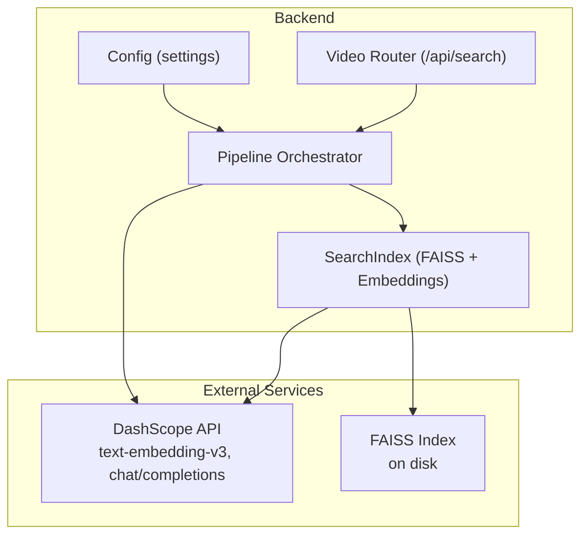
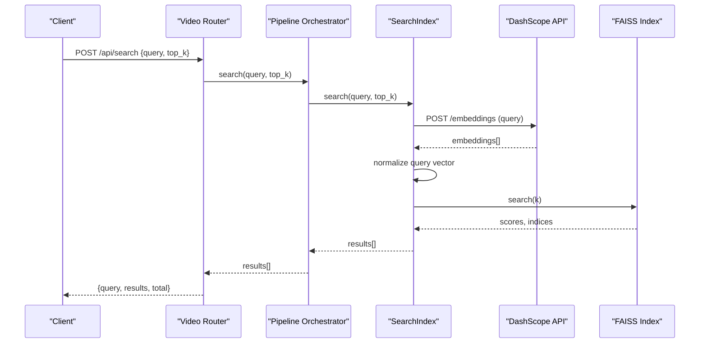
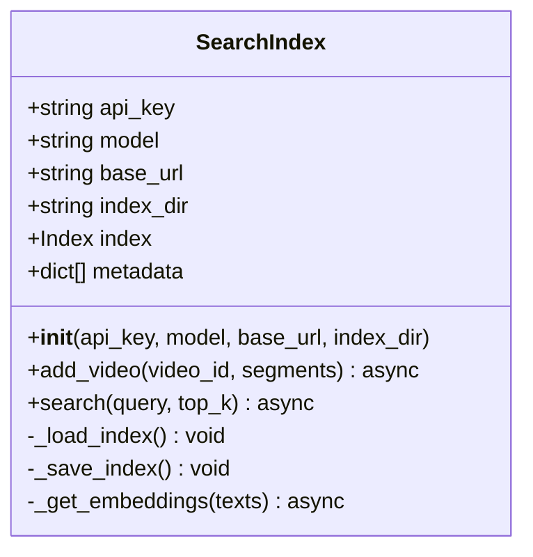
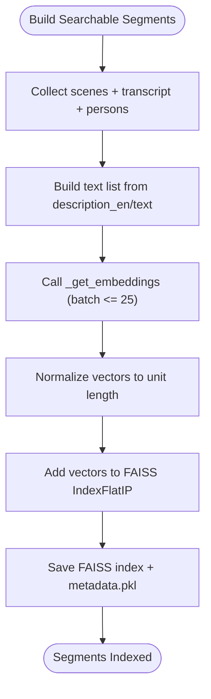
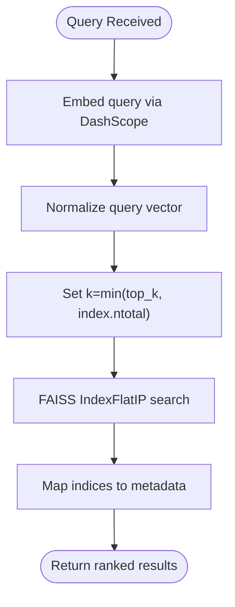
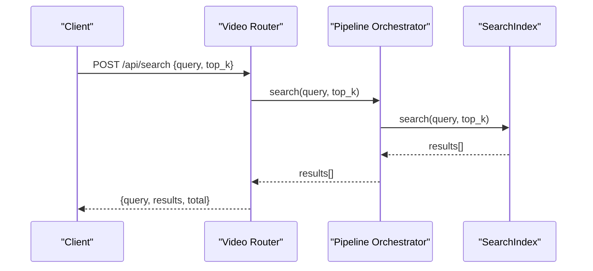
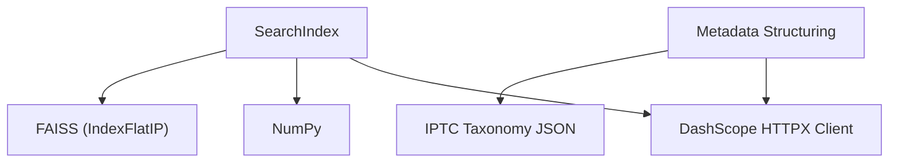

# Intelligent Search System

<cite>
**Referenced Files in This Document**
- [backend/pipeline/search_index.py](file://backend/pipeline/search_index.py)
- [backend/pipeline/orchestrator.py](file://backend/pipeline/orchestrator.py)
- [backend/routers/video.py](file://backend/routers/video.py)
- [backend/config.py](file://backend/config.py)
- [backend/data/iptc_taxonomy.json](file://backend/data/iptc_taxonomy.json)
- [backend/pipeline/metadata_structuring.py](file://backend/pipeline/metadata_structuring.py)
- [backend/requirements.txt](file://backend/requirements.txt)
- [README.md](file://README.md)
</cite>

## Table of Contents
1. [Introduction](#introduction)
2. [Project Structure](#project-structure)
3. [Core Components](#core-components)
4. [Architecture Overview](#architecture-overview)
5. [Detailed Component Analysis](#detailed-component-analysis)
6. [Dependency Analysis](#dependency-analysis)
7. [Performance Considerations](#performance-considerations)
8. [Troubleshooting Guide](#troubleshooting-guide)
9. [Conclusion](#conclusion)
10. [Appendices](#appendices)

## Introduction
This document explains the intelligent semantic search system that powers natural language search over a media archive. The system builds a FAISS-based vector index using embeddings generated by Alibaba Cloud’s DashScope text-embedding-v3 model. Video metadata—captured during automated processing—is converted into searchable segments and normalized vectors. The IPTC taxonomy is integrated to enrich metadata and improve topic-awareness for search relevance. The document covers the embedding pipeline, FAISS index construction and persistence, search algorithm mechanics, similarity scoring, result ranking, and operational guidance for tuning and troubleshooting.

## Project Structure
The search system is implemented as part of a six-stage video processing pipeline orchestrated by a central controller. The key components involved in semantic search are:
- SearchIndex: FAISS-backed vector store with embedding generation and persistence
- Orchestrator: Pipeline coordinator that invokes search index building
- Routers: API endpoints exposing upload, status, metadata, transcript, and search
- Config: Application settings including DashScope credentials and model identifiers
- IPTC Taxonomy: Topic classification vocabulary for metadata structuring

**Diagram sources**
- [backend/pipeline/search_index.py:22-245](file://backend/pipeline/search_index.py#L22-L245)
- [backend/pipeline/orchestrator.py:34-207](file://backend/pipeline/orchestrator.py#L34-L207)
- [backend/routers/video.py:198-216](file://backend/routers/video.py#L198-L216)
- [backend/config.py:4-21](file://backend/config.py#L4-L21)

**Section sources**
- [README.md:17-41](file://README.md#L17-L41)
- [backend/requirements.txt:1-16](file://backend/requirements.txt#L1-L16)

## Core Components
- SearchIndex: Manages FAISS index lifecycle, embedding generation via DashScope, normalization, batched indexing, and persistence to disk.
- Pipeline Orchestrator: Coordinates pipeline stages and triggers search index population using scene and transcript segments.
- Video Router: Exposes a POST /api/search endpoint that delegates to the orchestrator’s search index.
- Config: Provides DashScope API key, base URL, and model identifiers used by the search index and other pipeline stages.
- IPTC Taxonomy: Loaded by the metadata structuring stage and included in prompts to produce IPTC-aligned metadata.

Key responsibilities:
- Embedding generation: Uses DashScope text-embedding-v3 to convert text to 1024-dimensional vectors.
- Index normalization: Normalizes vectors to unit length to enable cosine similarity via inner product index.
- Persistence: Saves FAISS index and associated metadata to disk for durability across restarts.
- Search: Embeds the query, normalizes, performs a top-k inner-product search, and returns ranked results with segment metadata.

**Section sources**
- [backend/pipeline/search_index.py:22-245](file://backend/pipeline/search_index.py#L22-L245)
- [backend/pipeline/orchestrator.py:34-207](file://backend/pipeline/orchestrator.py#L34-L207)
- [backend/routers/video.py:198-216](file://backend/routers/video.py#L198-L216)
- [backend/config.py:4-21](file://backend/config.py#L4-L21)
- [backend/data/iptc_taxonomy.json:1-28](file://backend/data/iptc_taxonomy.json#L1-L28)

## Architecture Overview
The semantic search architecture integrates external AI services with local FAISS indexing and persistence. The pipeline produces searchable segments from scenes and transcripts, converts them to embeddings, normalizes vectors, and adds them to the index. Queries are embedded and searched similarly, with results mapped back to original metadata.

**Diagram sources**
- [backend/routers/video.py:198-216](file://backend/routers/video.py#L198-L216)
- [backend/pipeline/orchestrator.py:168-182](file://backend/pipeline/orchestrator.py#L168-L182)
- [backend/pipeline/search_index.py:156-196](file://backend/pipeline/search_index.py#L156-L196)
- [backend/pipeline/search_index.py:198-244](file://backend/pipeline/search_index.py#L198-L244)

## Detailed Component Analysis

### SearchIndex: FAISS-based Vector Search
The SearchIndex class encapsulates:
- Initialization with DashScope credentials and model settings
- Loading an existing FAISS index and metadata from disk, or creating a new index
- Building searchable segments from video results and adding them to the index
- Persisting the index and metadata to disk
- Performing semantic search with normalized query vectors and returning ranked results

Implementation highlights:
- Embedding dimension: 1024 (text-embedding-v3)
- Index type: Inner-product (IndexFlatIP) enabling cosine similarity after vector normalization
- Batch embedding: Up to 25 texts per DashScope embeddings call
- Fallback: Zero-vector embedding when API calls fail
- Persistence: FAISS index and pickled metadata saved under backend/data/search_index

**Diagram sources**
- [backend/pipeline/search_index.py:22-245](file://backend/pipeline/search_index.py#L22-L245)

**Section sources**
- [backend/pipeline/search_index.py:22-245](file://backend/pipeline/search_index.py#L22-L245)

### Embedding Generation and Segment Conversion
The orchestrator prepares searchable segments from:
- Scenes: description_en, timestamp, scene_type
- Transcript: text segments with timestamps
- Identified persons: name_en and role appended to descriptions

These segments are passed to SearchIndex.add_video, which:
- Builds a list of texts from description_en/text fields
- Calls _get_embeddings with DashScope text-embedding-v3
- Normalizes vectors to unit length
- Adds vectors to FAISS and persists index and metadata

**Diagram sources**
- [backend/pipeline/orchestrator.py:283-314](file://backend/pipeline/orchestrator.py#L283-L314)
- [backend/pipeline/search_index.py:88-155](file://backend/pipeline/search_index.py#L88-L155)
- [backend/pipeline/search_index.py:198-244](file://backend/pipeline/search_index.py#L198-L244)

**Section sources**
- [backend/pipeline/orchestrator.py:283-314](file://backend/pipeline/orchestrator.py#L283-L314)
- [backend/pipeline/search_index.py:88-155](file://backend/pipeline/search_index.py#L88-L155)

### Search Algorithm, Similarity Scoring, and Ranking
Search behavior:
- Query embedding: Generated via DashScope embeddings
- Normalization: Query vector normalized to unit length
- Similarity: Inner product on normalized vectors equals cosine similarity
- Top-k: FAISS search returns scores and indices for top_k matches
- Ranking: Results ordered by descending score, with metadata reconstructed from stored parallel metadata list

**Diagram sources**
- [backend/pipeline/search_index.py:156-196](file://backend/pipeline/search_index.py#L156-L196)

**Section sources**
- [backend/pipeline/search_index.py:156-196](file://backend/pipeline/search_index.py#L156-L196)

### IPTC Taxonomy Integration
The IPTC taxonomy is integrated during metadata structuring:
- The taxonomy is loaded from backend/data/iptc_taxonomy.json
- It is injected into the metadata structuring prompt to guide topic classification aligned with IPTC codes
- The resulting metadata includes topic codes and names in English and Arabic, enhancing semantic richness for downstream tasks

**Diagram sources**
- [backend/data/iptc_taxonomy.json:1-28](file://backend/data/iptc_taxonomy.json#L1-L28)
- [backend/pipeline/metadata_structuring.py:22-33](file://backend/pipeline/metadata_structuring.py#L22-L33)
- [backend/pipeline/metadata_structuring.py:108-112](file://backend/pipeline/metadata_structuring.py#L108-L112)

**Section sources**
- [backend/data/iptc_taxonomy.json:1-28](file://backend/data/iptc_taxonomy.json#L1-L28)
- [backend/pipeline/metadata_structuring.py:35-78](file://backend/pipeline/metadata_structuring.py#L35-L78)

### API and Routing
The search endpoint:
- Accepts a SearchRequest with query and top_k
- Delegates to the orchestrator’s SearchIndex.search
- Returns results with video_id, timestamp, description, scene_type, and score

**Diagram sources**
- [backend/routers/video.py:198-216](file://backend/routers/video.py#L198-L216)
- [backend/pipeline/orchestrator.py:168-182](file://backend/pipeline/orchestrator.py#L168-L182)
- [backend/pipeline/search_index.py:156-196](file://backend/pipeline/search_index.py#L156-L196)

**Section sources**
- [backend/routers/video.py:198-216](file://backend/routers/video.py#L198-L216)

## Dependency Analysis
External dependencies relevant to search:
- DashScope SDK and HTTP client for embeddings and model completions
- FAISS (faiss-cpu) for vector indexing and similarity search
- NumPy for vector math and normalization

**Diagram sources**
- [backend/requirements.txt:5-12](file://backend/requirements.txt#L5-L12)
- [backend/pipeline/search_index.py:13-14](file://backend/pipeline/search_index.py#L13-L14)
- [backend/pipeline/metadata_structuring.py:14-14](file://backend/pipeline/metadata_structuring.py#L14-L14)

**Section sources**
- [backend/requirements.txt:1-16](file://backend/requirements.txt#L1-L16)

## Performance Considerations
- Embedding throughput: The system batches up to 25 texts per DashScope embeddings call. For very large segment lists, consider increasing batch size cautiously and monitoring API latency and rate limits.
- Index size and recall: Larger indexes increase memory usage and search latency. Tune top_k and consider index types beyond IndexFlatIP for large-scale deployments.
- Normalization overhead: Vector normalization is O(n) per query; pre-normalized vectors reduce runtime cost but require careful pipeline consistency.
- Persistence frequency: Saving the index after each add_video ensures durability but may impact throughput. Consider batching additions and periodic saves for heavy workloads.
- Network reliability: Embedding calls are retried with exponential backoff; ensure adequate timeouts and monitor API availability.

[No sources needed since this section provides general guidance]

## Troubleshooting Guide
Common issues and resolutions:
- No FAISS available: If faiss-cpu is not installed, the SearchIndex logs a warning and skips indexing. Install faiss-cpu to enable vector search.
- Empty or missing index: On startup, if the FAISS index or metadata file is missing, a new index is created. Verify persistence paths and permissions.
- Embedding API failures: The system retries with exponential backoff and falls back to zero vectors for batches. Check DashScope API key validity, quotas, and network connectivity.
- Search returns no results: Ensure at least one video has completed the search_index stage and that the index contains vectors. Confirm embeddings are being generated and vectors are normalized.
- Slow search performance: Reduce top_k, ensure vectors are normalized, and consider upgrading to a GPU-enabled FAISS build for larger datasets.

**Section sources**
- [backend/pipeline/search_index.py:61-70](file://backend/pipeline/search_index.py#L61-L70)
- [backend/pipeline/search_index.py:214-244](file://backend/pipeline/search_index.py#L214-L244)

## Conclusion
The intelligent semantic search system leverages DashScope embeddings and FAISS to deliver natural language search over video archive content. By converting scenes, transcripts, and identified persons into normalized vectors and persisting them to disk, the system supports scalable, accurate, and durable semantic retrieval. The IPTC taxonomy integration further enriches metadata and improves topic-aware search. With appropriate configuration and operational practices, the system can be tuned for performance and reliability in production environments.

[No sources needed since this section summarizes without analyzing specific files]

## Appendices

### Configuration Options for Search Behavior
- DashScope API key and base URL: Provided via environment variables and loaded by settings
- Model identifiers: MODEL_EMBEDDING selects the embedding model; MODEL_VIDEO, MODEL_ASR, MODEL_TEXT are used by other pipeline stages
- Index persistence directory: Controlled by the SearchIndex constructor and defaults to backend/data/search_index

Operational tips:
- Set DASHSCOPE_API_KEY and ensure DASHSCOPE_BASE_URL is reachable
- Monitor embedding costs and quota limits
- Back up the search_index directory regularly for disaster recovery

**Section sources**
- [backend/config.py:4-21](file://backend/config.py#L4-L21)
- [backend/pipeline/search_index.py:18-39](file://backend/pipeline/search_index.py#L18-L39)

### Example Search Queries
Effective queries typically combine visual and textual descriptors:
- “Aerial shots of Dubai skyline”
- “Interview with government official”
- “Person speaking about tourism”
- “Sports event in progress”

[No sources needed since this section provides general guidance]