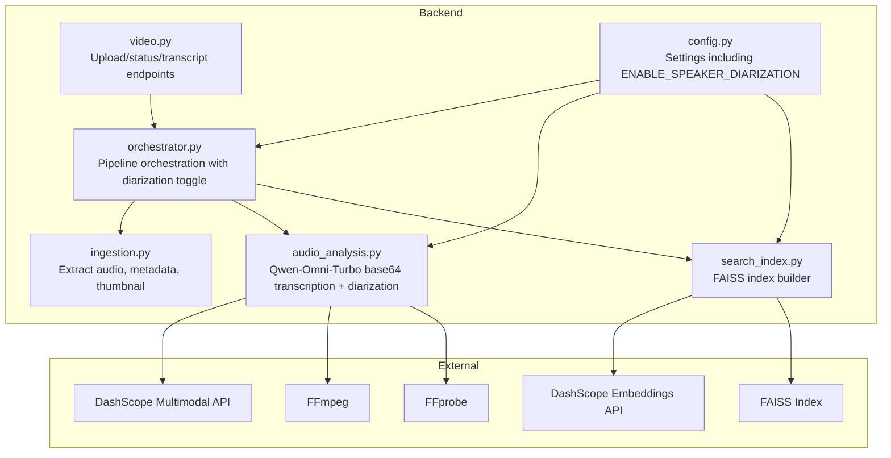
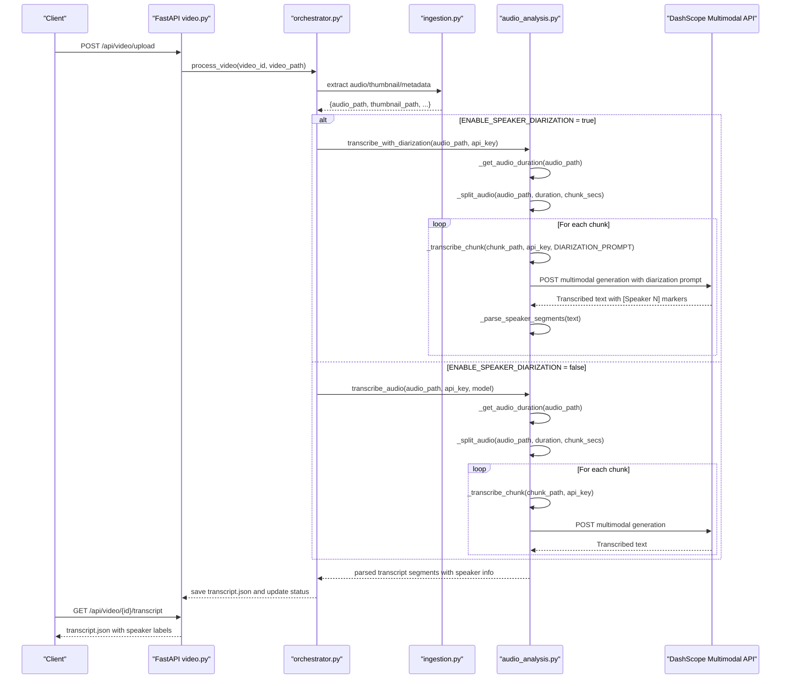
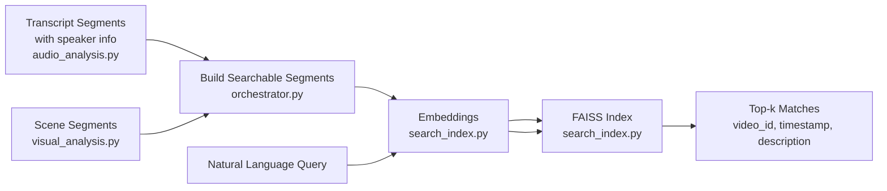
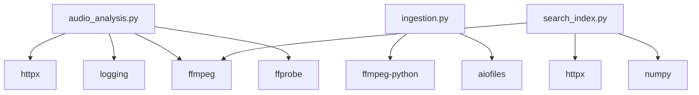
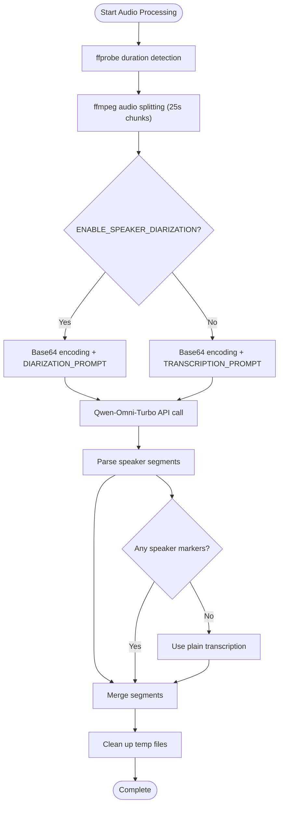

# Audio Analysis Stage

<cite>
**Referenced Files in This Document**
- [audio_analysis.py](file://backend/pipeline/audio_analysis.py)
- [ingestion.py](file://backend/pipeline/ingestion.py)
- [orchestrator.py](file://backend/pipeline/orchestrator.py)
- [video.py](file://backend/routers/video.py)
- [config.py](file://backend/config.py)
- [search_index.py](file://backend/pipeline/search_index.py)
- [README.md](file://README.md)
- [requirements.txt](file://backend/requirements.txt)
- [TranscriptPanel.tsx](file://frontend/src/components/archive/TranscriptPanel.tsx)
- [VideoTimeline.tsx](file://frontend/src/components/archive/VideoTimeline.tsx)
- [useVideoProcessing.ts](file://frontend/src/lib/useVideoProcessing.ts)
</cite>

## Update Summary
**Changes Made**
- Added new `transcribe_with_diarization()` function supporting speaker identification using [Speaker N] markers
- Implemented SPEAKER_MARKER_RE regex pattern for flexible speaker format detection
- Added ENABLE_SPEAKER_DIARIZATION configuration setting for feature toggling
- Enhanced orchestrator to conditionally use diarization based on configuration
- Updated frontend to display speaker badges with color-coded styling
- Improved transcript parsing to handle both diarized and non-diarized content

## Table of Contents
1. [Introduction](#introduction)
2. [Project Structure](#project-structure)
3. [Core Components](#core-components)
4. [Architecture Overview](#architecture-overview)
5. [Detailed Component Analysis](#detailed-component-analysis)
6. [Dependency Analysis](#dependency-analysis)
7. [Performance Considerations](#performance-considerations)
8. [Troubleshooting Guide](#troubleshooting-guide)
9. [Conclusion](#conclusion)
10. [Appendices](#appendices)

## Introduction
This document explains the audio analysis and speech-to-text transcription stage powered by Alibaba Cloud DashScope's Qwen-Omni-Turbo multimodal API. The system has evolved from asynchronous URL-based polling to a synchronous base64 audio encoding approach with intelligent chunking and advanced speaker diarization capabilities. It covers audio extraction from video, preprocessing steps, chunked transcription workflow, API integration, parameter configuration, response parsing, and how the resulting transcript connects to semantic search. It also includes practical guidance on performance, latency, quality factors, and troubleshooting.

## Project Structure
The audio analysis stage is part of a six-stage pipeline orchestrated by the backend. The relevant modules are:
- Audio extraction and ingestion: prepares audio for ASR
- Audio analysis: submits audio chunks to Qwen-Omni-Turbo via base64 encoding with optional speaker diarization and parses results
- Orchestration: coordinates stages and passes artifacts between them
- API: exposes endpoints to upload videos, retrieve status, transcripts, and trigger search
- Search index: builds a vector index from scenes and transcript for semantic search
- Frontend: renders transcripts with speaker badges and timelines for playback alignment

**Diagram sources**
- [ingestion.py:16-51](file://backend/pipeline/ingestion.py#L16-L51)
- [audio_analysis.py:22-59](file://backend/pipeline/audio_analysis.py#L22-L59)
- [orchestrator.py:44-207](file://backend/pipeline/orchestrator.py#L44-L207)
- [video.py:39-92](file://backend/routers/video.py#L39-L92)
- [search_index.py:22-154](file://backend/pipeline/search_index.py#L22-L154)
- [config.py:4-20](file://backend/config.py#L4-L20)

**Section sources**
- [README.md:17-40](file://README.md#L17-L40)
- [README.md:193-233](file://README.md#L193-L233)

## Core Components
- Audio ingestion: extracts 16 kHz mono WAV audio and a thumbnail from the uploaded video for downstream stages.
- ASR transcription: synchronously encodes audio chunks as base64 and submits them to Qwen-Omni-Turbo multimodal API with intelligent chunking and retry mechanisms.
- **Speaker Diarization**: New capability to identify and label different speakers using [Speaker N] markers with automatic fallback to single-speaker mode.
- Audio chunking: splits long audio files into 25-second chunks using ffmpeg for optimal processing limits.
- Duration detection: uses ffprobe to determine audio length for efficient chunk calculation.
- Orchestration: wires ingestion and ASR into the pipeline with configurable diarization support, computes URLs for audio assets, and saves results.
- API endpoints: expose upload, status, and transcript retrieval; WebSocket provides live progress.
- Search index: converts scenes and transcript segments into embeddings and adds them to FAISS for semantic search.

**Section sources**
- [ingestion.py:16-51](file://backend/pipeline/ingestion.py#L16-L51)
- [audio_analysis.py:22-59](file://backend/pipeline/audio_analysis.py#L22-L59)
- [audio_analysis.py:130-248](file://backend/pipeline/audio_analysis.py#L130-L248)
- [audio_analysis.py:140-189](file://backend/pipeline/audio_analysis.py#L140-L189)
- [audio_analysis.py:116-137](file://backend/pipeline/audio_analysis.py#L116-L137)
- [orchestrator.py:114-136](file://backend/pipeline/orchestrator.py#L114-L136)
- [video.py:39-92](file://backend/routers/video.py#L39-L92)
- [search_index.py:88-154](file://backend/pipeline/search_index.py#L88-L154)

## Architecture Overview
The audio analysis stage participates in a sequential pipeline with significant architectural improvements including speaker diarization:
1. Upload a video via API
2. Ingestion stage extracts audio and metadata
3. Audio analysis stage detects duration, chunks audio, encodes base64, and submits to Qwen-Omni-Turbo with optional speaker diarization
4. Results are persisted and later consumed by semantic search

**Diagram sources**
- [video.py:39-92](file://backend/routers/video.py#L39-L92)
- [orchestrator.py:44-207](file://backend/pipeline/orchestrator.py#L44-L207)
- [ingestion.py:16-51](file://backend/pipeline/ingestion.py#L16-L51)
- [audio_analysis.py:33-113](file://backend/pipeline/audio_analysis.py#L33-L113)
- [audio_analysis.py:116-137](file://backend/pipeline/audio_analysis.py#L116-L137)
- [audio_analysis.py:130-248](file://backend/pipeline/audio_analysis.py#L130-L248)
- [audio_analysis.py:140-189](file://backend/pipeline/audio_analysis.py#L140-L189)
- [audio_analysis.py:192-265](file://backend/pipeline/audio_analysis.py#L192-L265)

## Detailed Component Analysis

### Audio Extraction from Video
- Extracts a 16 kHz mono WAV audio track suitable for ASR.
- Generates a JPEG thumbnail from the first frame.
- Probes video metadata (duration, resolution, FPS, codec) for downstream use.

Key behaviors:
- Uses ffmpeg-python to run ffmpeg commands asynchronously.
- Writes audio.wav and thumbnail.jpg under the video's output directory.
- On failure, raises exceptions logged by the ingestion module.

**Section sources**
- [ingestion.py:16-51](file://backend/pipeline/ingestion.py#L16-L51)
- [ingestion.py:100-122](file://backend/pipeline/ingestion.py#L100-L122)
- [ingestion.py:124-146](file://backend/pipeline/ingestion.py#L124-L146)

### Audio Duration Detection and Chunking
- Detects audio duration using ffprobe for precise chunk calculation.
- Splits audio into 25-second chunks using ffmpeg with 16kHz mono WAV output.
- Each chunk maintains accurate start and end timestamps for timeline alignment.

Key improvements:
- **Chunk Duration**: 25 seconds (optimized for Qwen-Omni-Turbo audio length limits)
- **Base64 Encoding**: Each chunk is encoded to base64 before transmission
- **Retry Mechanisms**: Up to 3 attempts with exponential backoff for robustness
- **Memory Management**: Temporary chunk files are cleaned up after processing

**Section sources**
- [audio_analysis.py:116-137](file://backend/pipeline/audio_analysis.py#L116-L137)
- [audio_analysis.py:140-189](file://backend/pipeline/audio_analysis.py#L140-L189)

### Speaker Diarization Implementation
**New Feature**: Advanced speaker identification using inline [Speaker N] markers with automatic fallback.

The diarization system works through a sophisticated multi-step process:

1. **Prompt Engineering**: Uses specialized DIARIZATION_PROMPT that instructs the model to prefix dialogue with [Speaker 1], [Speaker 2], etc.
2. **Flexible Pattern Matching**: SPEAKER_MARKER_RE regex supports various formats like "[Speaker 1]", "[speaker 2]:", "[SPEAKER 3]"
3. **Intelligent Parsing**: _parse_speaker_segments() splits text into speaker-specific segments
4. **Automatic Fallback**: If no speaker markers are detected, automatically falls back to plain transcription
5. **Timestamp Estimation**: Distributes segment timing proportionally based on text length within each chunk

Key components:
- **DIARIZATION_PROMPT**: Specialized instruction set for speaker differentiation
- **SPEAKER_MARKER_RE**: Flexible regex pattern for speaker marker detection
- **_parse_speaker_segments()**: Converts marked text into structured speaker segments
- **Fallback Logic**: Seamless transition to non-diarized mode when needed

**Section sources**
- [audio_analysis.py:32-44](file://backend/pipeline/audio_analysis.py#L32-44)
- [audio_analysis.py:130-248](file://backend/pipeline/audio_analysis.py#L130-L248)
- [audio_analysis.py:251-269](file://backend/pipeline/audio_analysis.py#L251-L269)

### Qwen-Omni-Turbo Multimodal API Integration
- **Model**: Qwen-Omni-Turbo (multimodal generation API)
- **Endpoint**: `{DASHSCOPE_API_URL}/services/aigc/multimodal-generation/generation`
- **Input Format**: Base64-encoded audio with transcription prompt
- **Authentication**: Bearer token from DASHSCOPE_API_KEY
- **Parameters**: max_tokens: 2048 for comprehensive transcription

Key features:
- **Synchronous Processing**: Direct API calls replace asynchronous polling
- **Intelligent Retry**: Exponential backoff for transient failures
- **Error Handling**: Comprehensive logging and graceful degradation
- **Prompt Engineering**: Specific transcription instructions for accuracy
- **Dual Prompt Support**: Both standard and diarization prompts available

**Section sources**
- [audio_analysis.py:192-265](file://backend/pipeline/audio_analysis.py#L192-L265)
- [config.py:8-9](file://backend/config.py#L8-L9)

### Configuration and Feature Toggle
**New Configuration**: ENABLE_SPEAKER_DIARIZATION boolean setting controls diarization behavior.

The orchestrator conditionally selects between diarization and standard transcription:
- When `ENABLE_SPEAKER_DIARIZATION = True`: Uses `transcribe_with_diarization()`
- When `ENABLE_SPEAKER_DIARIZATION = False`: Uses `transcribe_audio()` with traditional model parameter

This provides flexibility for different deployment scenarios and testing requirements.

**Section sources**
- [config.py:18](file://backend/config.py#L18)
- [orchestrator.py:123-136](file://backend/pipeline/orchestrator.py#L123-L136)

### Transcript Generation and Timestamp Alignment
- Segments include start_time and end_time in seconds (accurate to chunk boundaries).
- Word-level timestamps are not available in this implementation.
- **Enhanced Speaker Support**: speaker_id field now contains either numeric IDs ("0", "1", "2") or "unknown" for non-diarized content.
- The orchestrator saves transcript.json for later retrieval and search indexing.

Frontend integration:
- TranscriptPanel displays segments with color-coded speaker badges, language tags, and timestamps.
- Clicking a timestamp seeks the player to the aligned position.
- Speaker mapping converts numeric IDs to friendly "Speaker 1", "Speaker 2" labels.

**Section sources**
- [audio_analysis.py:86-113](file://backend/pipeline/audio_analysis.py#L86-L113)
- [video.py:179-196](file://backend/routers/video.py#L179-L196)
- [TranscriptPanel.tsx:20-36](file://frontend/src/components/archive/TranscriptPanel.tsx#L20-36)
- [useVideoProcessing.ts:409-438](file://frontend/src/lib/useVideoProcessing.ts#L409-L438)

### Relationship Between Audio Analysis and Semantic Search
- The orchestrator builds searchable segments combining:
  - Scene descriptions from visual analysis
  - Transcript segments from audio analysis (including speaker information)
- These segments are embedded and indexed using DashScope embeddings and FAISS.
- Users can issue natural language queries to find relevant video segments.

**Diagram sources**
- [orchestrator.py:283-314](file://backend/pipeline/orchestrator.py#L283-L314)
- [search_index.py:88-154](file://backend/pipeline/search_index.py#L88-L154)

**Section sources**
- [orchestrator.py:283-314](file://backend/pipeline/orchestrator.py#L283-L314)
- [search_index.py:88-154](file://backend/pipeline/search_index.py#L88-L154)

## Dependency Analysis
- Runtime dependencies include httpx for HTTP, ffmpeg-python for audio extraction, and aiofiles for async file IO.
- The ASR stage depends on DashScope's multimodal generation API endpoint.
- The search stage depends on DashScope embeddings and FAISS for vector search.
- **New Dependencies**: ffmpeg and ffprobe for audio processing and duration detection.

**Diagram sources**
- [requirements.txt:1-16](file://backend/requirements.txt#L1-L16)
- [audio_analysis.py:11](file://backend/pipeline/audio_analysis.py#L11)
- [ingestion.py:11](file://backend/pipeline/ingestion.py#L11)
- [search_index.py:13-14](file://backend/pipeline/search_index.py#L13-L14)

**Section sources**
- [requirements.txt:1-16](file://backend/requirements.txt#L1-L16)

## Performance Considerations
- **Latency Drivers**:
  - **Base64 Encoding**: Time proportional to audio size (linear scaling)
  - **API Calls**: Each 25-second chunk requires separate API call
  - **Network Latency**: DashScope API response times vary by region
  - **Chunk Processing**: Sequential processing of chunks (no parallelization)
  - **Speaker Diarization**: Additional processing overhead for speaker detection and parsing
- **Throughput**:
  - **Sequential Processing**: Chunks are processed one after another
  - **Memory Usage**: Base64 encoding increases memory by ~33%
  - **Disk I/O**: Temporary chunk files require additional storage
  - **Diarization Impact**: Speaker detection adds computational overhead but maintains same chunk structure
- **Quality Factors**:
  - **Audio Sampling Rate**: 16kHz mono WAV ensures optimal ASR quality
  - **Chunk Size**: 25-second chunks balance accuracy and API limits
  - **Language Support**: Qwen-Omni-Turbo handles English and Arabic effectively
  - **Speaker Detection**: Works best with clear voice separation and distinct speaking patterns
- **Resource Usage**:
  - **CPU**: ffmpeg processing, base64 encoding, and speaker parsing
  - **Memory**: Base64-encoded audio buffers and speaker segment data
  - **Storage**: Temporary chunk files during processing

## Troubleshooting Guide
Common issues and resolutions:
- **Missing FFmpeg/FFprobe**:
  - Symptom: ffprobe failures with duration detection
  - Action: Install FFmpeg and ensure it's in PATH; verify installation with `ffmpeg -version`
- **Base64 Encoding Errors**:
  - Symptom: Failed to read chunk file or encode audio
  - Action: Check file permissions and available disk space; verify audio file integrity
- **API Key Issues**:
  - Symptom: Authentication failures or empty responses
  - Action: Verify DASHSCOPE_API_KEY is set correctly; check API quota limits
- **Chunk Processing Failures**:
  - Symptom: Individual chunks failing while others succeed
  - Action: Check audio quality in problematic segments; verify chunk boundaries
- **Timeout Issues**:
  - Symptom: API calls timing out during transcription
  - Action: Increase timeout values; check network connectivity; consider reducing chunk size
- **Memory Issues**:
  - Symptom: Out of memory errors during base64 encoding
  - Action: Process shorter audio files; monitor system resources; consider chunk size adjustment
- **Audio Quality Problems**:
  - Symptom: Poor transcription accuracy
  - Action: Ensure 16kHz mono WAV format; minimize background noise; check audio levels
- **Speaker Diarization Issues**:
  - Symptom: No speaker markers detected or incorrect speaker assignment
  - Action: Check audio clarity between speakers; verify ENABLE_SPEAKER_DIARIZATION setting; review DIARIZATION_PROMPT effectiveness
- **Configuration Problems**:
  - Symptom: Diarization not working as expected
  - Action: Verify ENABLE_SPEAKER_DIARIZATION is set to True; check orchestrator logic for conditional execution

**Section sources**
- [audio_analysis.py:57-59](file://backend/pipeline/audio_analysis.py#L57-L59)
- [audio_analysis.py:116-137](file://backend/pipeline/audio_analysis.py#L116-L137)
- [audio_analysis.py:198-202](file://backend/pipeline/audio_analysis.py#L198-L202)
- [audio_analysis.py:256-261](file://backend/pipeline/audio_analysis.py#L256-L261)
- [config.py:18](file://backend/config.py#L18)
- [orchestrator.py:123-136](file://backend/pipeline/orchestrator.py#L123-L136)

## Conclusion
The audio analysis stage has evolved significantly, transitioning from asynchronous URL-based polling to a robust synchronous base64 encoding approach with intelligent chunking and advanced speaker diarization capabilities. The new Qwen-Omni-Turbo integration provides superior transcription capabilities with better error handling, retry mechanisms, and performance characteristics. The addition of speaker diarization functionality enables automatic identification and labeling of different speakers using [Speaker N] markers, with intelligent fallback to single-speaker mode when diarization fails. By leveraging ffmpeg-based chunking, ffprobe duration detection, optimized base64 encoding, and flexible speaker detection, the system achieves reliable, high-quality speech-to-text transcription suitable for downstream semantic search applications.

## Appendices

### Example: Retrieving a Transcript
- Upload a video via POST /api/video/upload.
- Poll GET /api/video/{id}/status until audio_analysis completes.
- Retrieve the transcript via GET /api/video/{id}/transcript.

**Section sources**
- [video.py:39-92](file://backend/routers/video.py#L39-L92)
- [video.py:179-196](file://backend/routers/video.py#L179-L196)

### Frontend Interaction
- TranscriptPanel renders segments with color-coded speaker badges and timestamp alignment.
- VideoTimeline supports seeking to scene boundaries and transcript-aligned positions.
- Speaker mapping converts numeric IDs to friendly "Speaker 1", "Speaker 2" labels with consistent color coding.

**Section sources**
- [TranscriptPanel.tsx:20-36](file://frontend/src/components/archive/TranscriptPanel.tsx#L20-36)
- [TranscriptPanel.tsx:237-300](file://frontend/src/components/archive/TranscriptPanel.tsx#L237-L300)
- [VideoTimeline.tsx:26-244](file://frontend/src/components/archive/VideoTimeline.tsx#L26-L244)
- [useVideoProcessing.ts:409-438](file://frontend/src/lib/useVideoProcessing.ts#L409-L438)

### Qwen-Omni-Turbo Configuration Details
The audio analysis system now uses Qwen-Omni-Turbo multimodal API with the following configuration:

- **Model**: qwen-omni-turbo (multimodal generation)
- **Endpoint**: `{DASHSCOPE_API_URL}/services/aigc/multimodal-generation/generation`
- **Chunk Duration**: 25 seconds (optimized for API limits)
- **Audio Format**: 16kHz mono WAV (base64 encoded)
- **Max Tokens**: 2048 (for comprehensive transcription)
- **Retry Strategy**: Up to 3 attempts with exponential backoff
- **Error Handling**: Graceful degradation with empty results
- **Speaker Diarization**: Optional feature controlled by ENABLE_SPEAKER_DIARIZATION setting
- **Speaker Markers**: Supports [Speaker N] format with flexible regex matching

**Section sources**
- [audio_analysis.py:23-30](file://backend/pipeline/audio_analysis.py#L23-L30)
- [audio_analysis.py:32-44](file://backend/pipeline/audio_analysis.py#L32-44)
- [audio_analysis.py:204-226](file://backend/pipeline/audio_analysis.py#L204-L226)
- [audio_analysis.py:228-263](file://backend/pipeline/audio_analysis.py#L228-L263)
- [config.py:18](file://backend/config.py#L18)

### Audio Processing Pipeline
The complete audio processing workflow involves multiple stages with optional speaker diarization:

**Diagram sources**
- [audio_analysis.py:116-137](file://backend/pipeline/audio_analysis.py#L116-L137)
- [audio_analysis.py:140-189](file://backend/pipeline/audio_analysis.py#L140-L189)
- [audio_analysis.py:192-265](file://backend/pipeline/audio_analysis.py#L192-L265)
- [audio_analysis.py:237-241](file://backend/pipeline/audio_analysis.py#L237-L241)

**Section sources**
- [audio_analysis.py:116-189](file://backend/pipeline/audio_analysis.py#L116-L189)
- [audio_analysis.py:192-265](file://backend/pipeline/audio_analysis.py#L192-L265)
- [audio_analysis.py:237-241](file://backend/pipeline/audio_analysis.py#L237-L241)