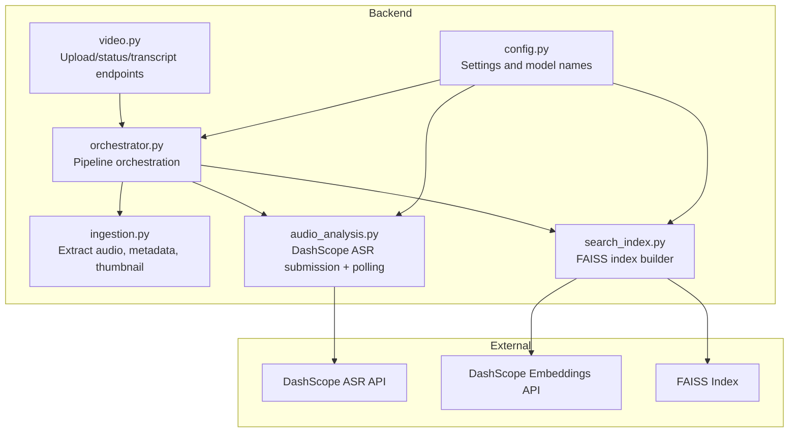
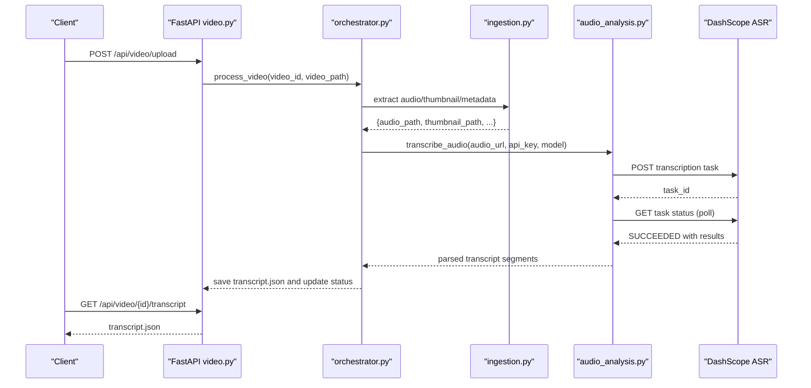
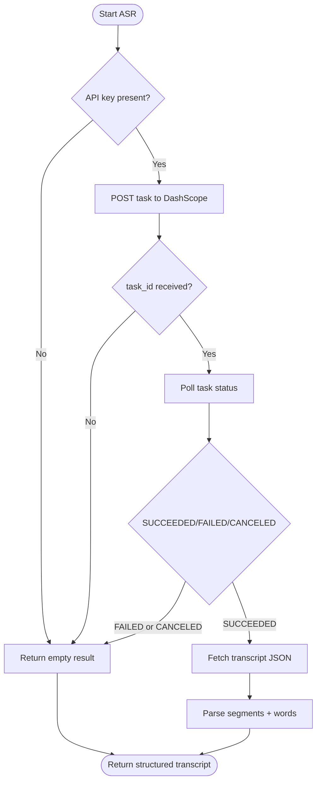
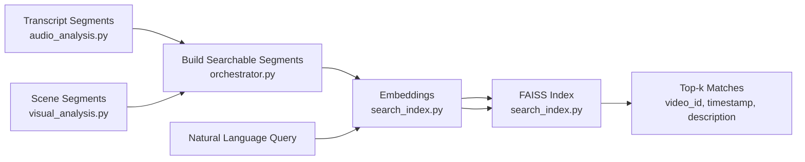
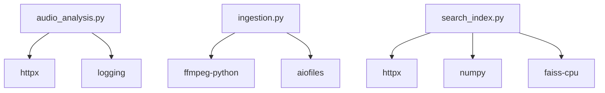

# Audio Analysis Stage

<cite>
**Referenced Files in This Document**
- [audio_analysis.py](file://backend/pipeline/audio_analysis.py)
- [ingestion.py](file://backend/pipeline/ingestion.py)
- [orchestrator.py](file://backend/pipeline/orchestrator.py)
- [video.py](file://backend/routers/video.py)
- [config.py](file://backend/config.py)
- [search_index.py](file://backend/pipeline/search_index.py)
- [README.md](file://README.md)
- [requirements.txt](file://backend/requirements.txt)
- [TranscriptPanel.tsx](file://frontend/src/components/archive/TranscriptPanel.tsx)
- [VideoTimeline.tsx](file://frontend/src/components/archive/VideoTimeline.tsx)
</cite>

## Table of Contents
1. [Introduction](#introduction)
2. [Project Structure](#project-structure)
3. [Core Components](#core-components)
4. [Architecture Overview](#architecture-overview)
5. [Detailed Component Analysis](#detailed-component-analysis)
6. [Dependency Analysis](#dependency-analysis)
7. [Performance Considerations](#performance-considerations)
8. [Troubleshooting Guide](#troubleshooting-guide)
9. [Conclusion](#conclusion)
10. [Appendices](#appendices)

## Introduction
This document explains the audio analysis and speech-to-text transcription stage powered by Alibaba Cloud DashScope’s Paraformer ASR model. It covers how audio is extracted from video, preprocessing steps, asynchronous transcription workflow, API integration, parameter configuration, response parsing, and how the resulting transcript connects to semantic search. It also includes practical guidance on performance, latency, quality factors, and troubleshooting.

## Project Structure
The audio analysis stage is part of a six-stage pipeline orchestrated by the backend. The relevant modules are:
- Audio extraction and ingestion: prepares audio for ASR
- Audio analysis: submits audio to DashScope ASR and parses results
- Orchestration: coordinates stages and passes artifacts between them
- API: exposes endpoints to upload videos, retrieve status, transcripts, and trigger search
- Search index: builds a vector index from scenes and transcript for semantic search
- Frontend: renders transcripts and timelines for playback alignment

**Diagram sources**
- [ingestion.py:16-51](file://backend/pipeline/ingestion.py#L16-L51)
- [audio_analysis.py:22-59](file://backend/pipeline/audio_analysis.py#L22-L59)
- [orchestrator.py:44-207](file://backend/pipeline/orchestrator.py#L44-L207)
- [video.py:39-92](file://backend/routers/video.py#L39-L92)
- [search_index.py:22-154](file://backend/pipeline/search_index.py#L22-L154)
- [config.py:4-20](file://backend/config.py#L4-L20)

**Section sources**
- [README.md:17-40](file://README.md#L17-L40)
- [README.md:193-233](file://README.md#L193-L233)

## Core Components
- Audio ingestion: extracts 16 kHz mono WAV audio and a thumbnail from the uploaded video for downstream stages.
- ASR transcription: asynchronously submits audio to DashScope Paraformer ASR, polls for completion, and parses the transcript into structured segments with speaker and word-level timestamps.
- Orchestration: wires ingestion and ASR into the pipeline, computes URLs for audio assets, and saves results.
- API endpoints: expose upload, status, and transcript retrieval; WebSocket provides live progress.
- Search index: converts scenes and transcript segments into embeddings and adds them to FAISS for semantic search.

**Section sources**
- [ingestion.py:16-51](file://backend/pipeline/ingestion.py#L16-L51)
- [audio_analysis.py:22-59](file://backend/pipeline/audio_analysis.py#L22-L59)
- [orchestrator.py:114-129](file://backend/pipeline/orchestrator.py#L114-L129)
- [video.py:39-92](file://backend/routers/video.py#L39-L92)
- [search_index.py:88-154](file://backend/pipeline/search_index.py#L88-L154)

## Architecture Overview
The audio analysis stage participates in a sequential pipeline:
1. Upload a video via API
2. Ingestion stage extracts audio and metadata
3. Audio analysis stage sends audio URL to DashScope ASR
4. Results are persisted and later consumed by semantic search

**Diagram sources**
- [video.py:39-92](file://backend/routers/video.py#L39-L92)
- [orchestrator.py:44-207](file://backend/pipeline/orchestrator.py#L44-L207)
- [ingestion.py:16-51](file://backend/pipeline/ingestion.py#L16-L51)
- [audio_analysis.py:22-59](file://backend/pipeline/audio_analysis.py#L22-L59)

## Detailed Component Analysis

### Audio Extraction from Video
- Extracts a 16 kHz mono WAV audio track suitable for ASR.
- Generates a JPEG thumbnail from the first frame.
- Probes video metadata (duration, resolution, FPS, codec) for downstream use.

Key behaviors:
- Uses ffmpeg-python to run ffmpeg commands asynchronously.
- Writes audio.wav and thumbnail.jpg under the video’s output directory.
- On failure, raises exceptions logged by the ingestion module.

**Section sources**
- [ingestion.py:16-51](file://backend/pipeline/ingestion.py#L16-L51)
- [ingestion.py:100-122](file://backend/pipeline/ingestion.py#L100-L122)
- [ingestion.py:124-146](file://backend/pipeline/ingestion.py#L124-L146)

### Preprocessing for ASR
- The orchestrator constructs the audio URL for DashScope consumption.
- The URL points to the static uploads directory served by the backend.
- The ingestion stage ensures audio.wav is present and ready.

Important note:
- The audio must be publicly reachable by the DashScope service. In development, the backend serves uploads statically; in production, use a CDN or object storage URL.

**Section sources**
- [orchestrator.py:77-79](file://backend/pipeline/orchestrator.py#L77-L79)
- [main.py:35](file://backend/main.py#L35)

### ASR Transcription Workflow (DashScope Paraformer)
- Submits an asynchronous transcription task with:
  - Model: configurable (default paraformer-v2)
  - Input: array of file URLs (single audio file)
  - Parameters: language hints (Arabic and English), speaker diarization enabled
- Polls task status until completion or failure, with bounded retries and timeouts.
- Parses the returned transcript into structured segments:
  - Segment-level: start/end times, speaker ID, text, language
  - Word-level: optional word timestamps
  - Aggregated full text and speaker count

**Diagram sources**
- [audio_analysis.py:22-59](file://backend/pipeline/audio_analysis.py#L22-L59)
- [audio_analysis.py:62-112](file://backend/pipeline/audio_analysis.py#L62-L112)
- [audio_analysis.py:115-142](file://backend/pipeline/audio_analysis.py#L115-L142)
- [audio_analysis.py:145-175](file://backend/pipeline/audio_analysis.py#L145-L175)
- [audio_analysis.py:177-187](file://backend/pipeline/audio_analysis.py#L177-L187)
- [audio_analysis.py:190-229](file://backend/pipeline/audio_analysis.py#L190-L229)

**Section sources**
- [audio_analysis.py:22-59](file://backend/pipeline/audio_analysis.py#L22-L59)
- [audio_analysis.py:62-112](file://backend/pipeline/audio_analysis.py#L62-L112)
- [audio_analysis.py:115-142](file://backend/pipeline/audio_analysis.py#L115-L142)
- [audio_analysis.py:145-175](file://backend/pipeline/audio_analysis.py#L145-L175)
- [audio_analysis.py:177-187](file://backend/pipeline/audio_analysis.py#L177-L187)
- [audio_analysis.py:190-229](file://backend/pipeline/audio_analysis.py#L190-L229)

### API Integration and Parameter Configuration
- Model selection: configurable via settings (default paraformer-v2).
- Authentication: Bearer token from DASHSCOPE_API_KEY.
- Endpoints:
  - POST /api/video/upload: starts pipeline
  - GET /api/video/{id}/transcript: retrieves transcript.json
  - GET /api/video/{id}/status: reads status.json
  - WS /ws/pipeline/{id}: real-time progress

Environment variables:
- DASHSCOPE_API_KEY: required for all DashScope calls
- MODEL_ASR: selects the ASR model
- BASE_URL: used to construct audio URLs for external access

**Section sources**
- [config.py:4-20](file://backend/config.py#L4-L20)
- [video.py:39-92](file://backend/routers/video.py#L39-L92)
- [video.py:179-196](file://backend/routers/video.py#L179-L196)
- [README.md:112-125](file://README.md#L112-L125)

### Transcript Generation and Timestamp Alignment
- Segments include start_time and end_time in seconds.
- Word-level timestamps are included when available.
- Speaker diarization assigns speaker_id per segment.
- The orchestrator saves transcript.json for later retrieval and search indexing.

Frontend integration:
- TranscriptPanel displays segments with speaker badges, language tags, and timestamps.
- Clicking a timestamp seeks the player to the aligned position.

**Section sources**
- [audio_analysis.py:190-229](file://backend/pipeline/audio_analysis.py#L190-L229)
- [video.py:179-196](file://backend/routers/video.py#L179-L196)
- [TranscriptPanel.tsx:36-154](file://frontend/src/components/archive/TranscriptPanel.tsx#L36-L154)

### Relationship Between Audio Analysis and Semantic Search
- The orchestrator builds searchable segments combining:
  - Scene descriptions from visual analysis
  - Transcript segments from audio analysis
- These segments are embedded and indexed using DashScope embeddings and FAISS.
- Users can issue natural language queries to find relevant video segments.

**Diagram sources**
- [orchestrator.py:283-314](file://backend/pipeline/orchestrator.py#L283-L314)
- [search_index.py:88-154](file://backend/pipeline/search_index.py#L88-L154)

**Section sources**
- [orchestrator.py:283-314](file://backend/pipeline/orchestrator.py#L283-L314)
- [search_index.py:88-154](file://backend/pipeline/search_index.py#L88-L154)

## Dependency Analysis
- Runtime dependencies include httpx for HTTP, ffmpeg-python for audio extraction, and aiofiles for async file IO.
- The ASR stage depends on DashScope’s transcription and task status endpoints.
- The search stage depends on DashScope embeddings and FAISS for vector search.

**Diagram sources**
- [requirements.txt:1-16](file://backend/requirements.txt#L1-L16)
- [audio_analysis.py:11](file://backend/pipeline/audio_analysis.py#L11)
- [ingestion.py:11](file://backend/pipeline/ingestion.py#L11)
- [search_index.py:13-14](file://backend/pipeline/search_index.py#L13-L14)

**Section sources**
- [requirements.txt:1-16](file://backend/requirements.txt#L1-L16)

## Performance Considerations
- Latency drivers:
  - ASR asynchronous polling: expect several minutes for long audio.
  - Network latency to DashScope endpoints.
  - Disk I/O for saving intermediate artifacts and transcripts.
- Throughput:
  - The pipeline runs stages sequentially; concurrency is limited to one video at a time per worker.
  - Consider scaling workers or splitting long videos for improved throughput.
- Quality factors:
  - Audio sampling rate and mono channelization improve ASR accuracy.
  - Clear audio with minimal background noise yields better transcripts.
  - Language hints (Arabic and English) help bilingual recognition.
- Resource usage:
  - FAISS index grows with the number of indexed segments; manage index persistence and memory footprint.

[No sources needed since this section provides general guidance]

## Troubleshooting Guide
Common issues and resolutions:
- No API key configured:
  - Symptom: empty transcription result and warning logs.
  - Action: set DASHSCOPE_API_KEY in environment.
- ASR task submission failures:
  - Symptom: errors during task submission or missing task_id.
  - Action: retry with exponential backoff; verify network connectivity and endpoint URLs.
- ASR polling timeouts:
  - Symptom: task does not complete within the maximum attempts.
  - Action: reduce video length or increase timeouts; check DashScope quotas.
- Missing transcript data:
  - Symptom: could not retrieve transcript JSON.
  - Action: confirm the audio URL is publicly accessible; verify file exists.
- ffprobe/ffmpeg errors:
  - Symptom: ingestion fails due to probing or extraction errors.
  - Action: ensure FFmpeg is installed and in PATH; verify video codec compatibility.
- Search index unavailable:
  - Symptom: FAISS not installed or index loading fails.
  - Action: install faiss-cpu; ensure index files exist and are readable.

**Section sources**
- [audio_analysis.py:40-42](file://backend/pipeline/audio_analysis.py#L40-L42)
- [audio_analysis.py:94-111](file://backend/pipeline/audio_analysis.py#L94-L111)
- [audio_analysis.py:136-142](file://backend/pipeline/audio_analysis.py#L136-L142)
- [audio_analysis.py:163-170](file://backend/pipeline/audio_analysis.py#L163-L170)
- [ingestion.py:92-97](file://backend/pipeline/ingestion.py#L92-L97)
- [ingestion.py:116-121](file://backend/pipeline/ingestion.py#L116-L121)
- [search_index.py:61-70](file://backend/pipeline/search_index.py#L61-L70)

## Conclusion
The audio analysis stage transforms video audio into structured, timestamp-aligned transcripts using DashScope’s Paraformer ASR. It integrates tightly with ingestion, orchestration, and semantic search to enable rich, searchable video archives. By tuning audio quality, leveraging language hints, and ensuring reliable network access, teams can achieve accurate, low-latency transcription suitable for downstream applications.

[No sources needed since this section summarizes without analyzing specific files]

## Appendices

### Example: Retrieving a Transcript
- Upload a video via POST /api/video/upload.
- Poll GET /api/video/{id}/status until audio_analysis completes.
- Retrieve the transcript via GET /api/video/{id}/transcript.

**Section sources**
- [video.py:39-92](file://backend/routers/video.py#L39-L92)
- [video.py:179-196](file://backend/routers/video.py#L179-L196)

### Frontend Interaction
- TranscriptPanel renders segments with speaker and timestamp alignment.
- VideoTimeline supports seeking to scene boundaries and transcript-aligned positions.

**Section sources**
- [TranscriptPanel.tsx:36-154](file://frontend/src/components/archive/TranscriptPanel.tsx#L36-L154)
- [VideoTimeline.tsx:26-244](file://frontend/src/components/archive/VideoTimeline.tsx#L26-L244)