# Dubbing Pipeline System

<cite>
**Referenced Files in This Document**
- [main.py](file://backend/main.py)
- [config.py](file://backend/config.py)
- [run_pipeline.py](file://backend/run_pipeline.py)
- [orchestrator.py](file://backend/pipeline/orchestrator.py)
- [audio_analysis.py](file://backend/pipeline/audio_analysis.py)
- [subtitle_generation.py](file://backend/pipeline/subtitle_generation.py)
- [dubbing.py](file://backend/pipeline/dubbing.py)
- [video.py](file://backend/routers/video.py)
- [DubbingPanel.tsx](file://frontend/src/components/archive/DubbingPanel.tsx)
- [api.ts](file://frontend/src/lib/api.ts)
</cite>

## Update Summary
**Changes Made**
- Updated Audio Assembly section to document enhanced normalization parameters and format consistency handling
- Enhanced Silence Generation section to reflect improved Edge-TTS format matching (24kHz mono)
- Updated Error Logging section to document increased stderr truncation limits for better debugging
- Added detailed technical specifications for FFmpeg audio processing improvements

## Table of Contents
1. [Introduction](#introduction)
2. [Project Structure](#project-structure)
3. [Core Components](#core-components)
4. [Architecture Overview](#architecture-overview)
5. [Detailed Component Analysis](#detailed-component-analysis)
6. [Dependency Analysis](#dependency-analysis)
7. [Performance Considerations](#performance-considerations)
8. [Troubleshooting Guide](#troubleshooting-guide)
9. [Conclusion](#conclusion)

## Introduction
This document explains the end-to-end dubbing pipeline for video content. The system:
- Transcribes audio from uploaded videos using a speech-to-text model with optional speaker diarization.
- Generates and caches subtitles in multiple languages.
- On demand, translates transcript segments into target languages, synthesizes speech per segment, assembles an audio track respecting original timing, and muxes it back into the source video to produce dubbed outputs.
- Exposes REST endpoints for upload, status, metadata, subtitle retrieval, and dubbing control, with a Next.js frontend panel to initiate and monitor dubbing jobs.

The backend is built on FastAPI; the orchestrator runs the full processing pipeline in a separate process to avoid blocking the API server. Dubbing is invoked on-demand after transcription is available.

## Project Structure
Key directories and files relevant to dubbing:
- Backend entrypoint and configuration
  - main.py: FastAPI app setup, CORS, static uploads mount, router inclusion
  - config.py: Settings (API keys, models, supported dubbing languages)
  - run_pipeline.py: Standalone runner that executes the orchestrator in a subprocess
- Pipeline modules
  - orchestrator.py: Coordinates ingestion, visual analysis, audio analysis, face recognition, metadata structuring, search indexing
  - audio_analysis.py: Chunked transcription with optional diarization
  - subtitle_generation.py: VTT/SRT generation and translation caching
  - dubbing.py: Translation, Edge-TTS synthesis, FFmpeg assembly/muxing
- API layer
  - routers/video.py: Upload, status, metadata, transcript, subtitles, dubbing endpoints
- Frontend
  - components/archive/DubbingPanel.tsx: UI to select language, start dubbing, poll progress, play/download results
  - lib/api.ts: Client helpers for REST calls and WebSocket connections

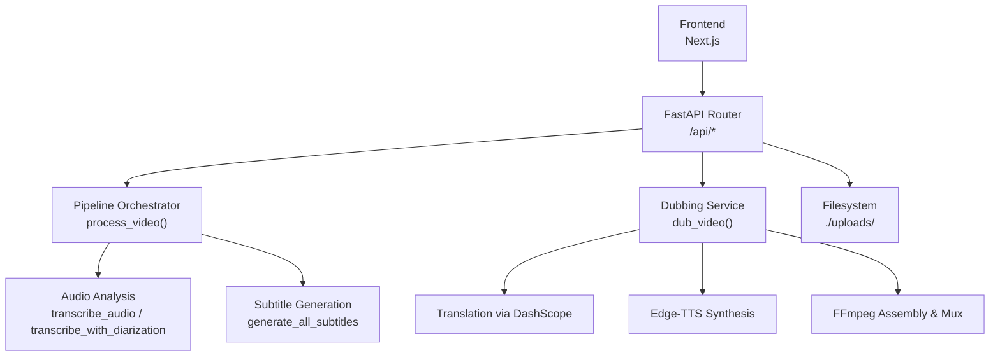

**Diagram sources**
- [main.py:20-38](file://backend/main.py#L20-L38)
- [video.py:67-129](file://backend/routers/video.py#L67-L129)
- [orchestrator.py:45-233](file://backend/pipeline/orchestrator.py#L45-L233)
- [audio_analysis.py:47-127](file://backend/pipeline/audio_analysis.py#L47-L127)
- [subtitle_generation.py:286-328](file://backend/pipeline/subtitle_generation.py#L286-L328)
- [dubbing.py:56-161](file://backend/pipeline/dubbing.py#L56-L161)

**Section sources**
- [main.py:1-44](file://backend/main.py#L1-L44)
- [config.py:1-33](file://backend/config.py#L1-L33)
- [run_pipeline.py:1-36](file://backend/run_pipeline.py#L1-L36)
- [orchestrator.py:1-410](file://backend/pipeline/orchestrator.py#L1-L410)
- [audio_analysis.py:1-435](file://backend/pipeline/audio_analysis.py#L1-L435)
- [subtitle_generation.py:1-443](file://backend/pipeline/subtitle_generation.py#L1-L443)
- [dubbing.py:1-521](file://backend/pipeline/dubbing.py#L1-L521)
- [video.py:1-860](file://backend/routers/video.py#L1-L860)
- [DubbingPanel.tsx:1-338](file://frontend/src/components/archive/DubbingPanel.tsx#L1-L338)
- [api.ts:1-339](file://frontend/src/lib/api.ts#L1-L339)

## Core Components
- FastAPI application and routers
  - Mounts static uploads directory and includes video and RFP routers
  - Provides health check endpoint
- Configuration
  - Centralized settings for API keys, base URLs, model identifiers, upload directory, default dubbing language, supported languages, and diarization toggle
- Pipeline orchestrator
  - Runs ingestion → visual analysis → audio analysis → face recognition → metadata structuring → search index
  - Emits stage-level progress and persists JSON artifacts
- Audio analysis
  - Splits long audio into chunks, transcribes via multimodal API, supports diarization markers and fallback
- Subtitle generation
  - Builds WebVTT/SRT from transcript segments, translates into AR/FR/RU, caches generated files
- Dubbing service
  - Loads transcript, translates segments, synthesizes per-segment speech, assembles track with silence gaps, muxes into video
- API endpoints
  - Upload, status, metadata, transcript, subtitles, semantic search, person naming, and dubbing lifecycle management
- Frontend dubbing panel
  - Language selection, start dubbing, polling progress, inline playback, download links

**Section sources**
- [main.py:20-38](file://backend/main.py#L20-L38)
- [config.py:5-29](file://backend/config.py#L5-L29)
- [orchestrator.py:35-233](file://backend/pipeline/orchestrator.py#L35-L233)
- [audio_analysis.py:47-248](file://backend/pipeline/audio_analysis.py#L47-L248)
- [subtitle_generation.py:97-154](file://backend/pipeline/subtitle_generation.py#L97-L154)
- [dubbing.py:56-161](file://backend/pipeline/dubbing.py#L56-L161)
- [video.py:67-129](file://backend/routers/video.py#L67-L129)
- [DubbingPanel.tsx:27-138](file://frontend/src/components/archive/DubbingPanel.tsx#L27-L138)
- [api.ts:211-277](file://frontend/src/lib/api.ts#L211-L277)

## Architecture Overview
End-to-end flow from upload to dubbed output:

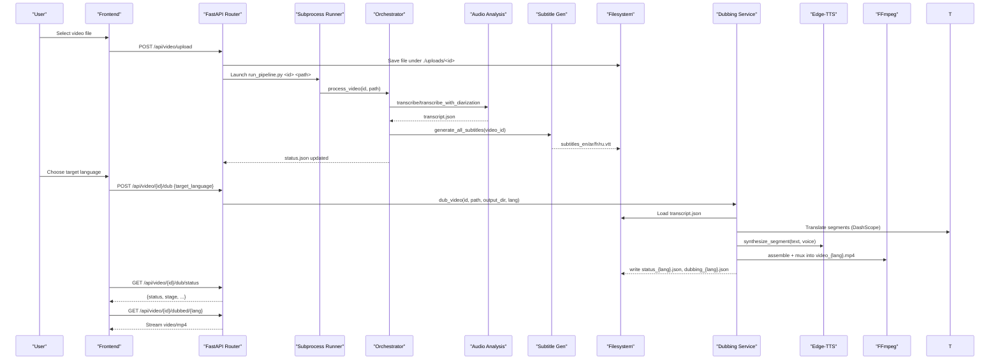

**Diagram sources**
- [video.py:67-129](file://backend/routers/video.py#L67-L129)
- [run_pipeline.py:22-35](file://backend/run_pipeline.py#L22-L35)
- [orchestrator.py:45-233](file://backend/pipeline/orchestrator.py#L45-L233)
- [audio_analysis.py:47-248](file://backend/pipeline/audio_analysis.py#L47-L248)
- [subtitle_generation.py:286-328](file://backend/pipeline/subtitle_generation.py#L286-L328)
- [dubbing.py:56-161](file://backend/pipeline/dubbing.py#L56-L161)
- [video.py:450-558](file://backend/routers/video.py#L450-L558)

## Detailed Component Analysis

### Video Upload and Background Processing
- Upload endpoint saves the file, initializes status.json, and launches a detached subprocess to run the pipeline without blocking the server.
- The subprocess invokes the orchestrator to execute all stages sequentially, persisting intermediate results and updating status.json.

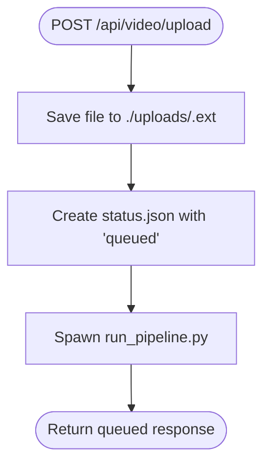

**Diagram sources**
- [video.py:67-129](file://backend/routers/video.py#L67-L129)
- [run_pipeline.py:22-35](file://backend/run_pipeline.py#L22-L35)

**Section sources**
- [video.py:67-129](file://backend/routers/video.py#L67-L129)
- [run_pipeline.py:1-36](file://backend/run_pipeline.py#L1-L36)

### Orchestrator and Stage Execution
- The orchestrator defines six stages and runs them sequentially, emitting progress updates and saving per-stage JSON artifacts.
- It builds searchable segments combining scenes, transcript, and identified persons for semantic search.

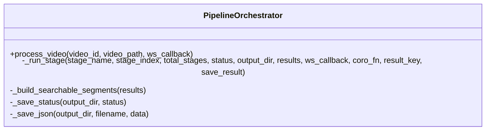

**Diagram sources**
- [orchestrator.py:35-233](file://backend/pipeline/orchestrator.py#L35-L233)
- [orchestrator.py:331-395](file://backend/pipeline/orchestrator.py#L331-L395)

**Section sources**
- [orchestrator.py:1-410](file://backend/pipeline/orchestrator.py#L1-L410)

### Audio Analysis and Diarization
- Audio is split into fixed-duration chunks and transcribed via a multimodal API.
- Optional diarization uses inline speaker markers; if none are detected, it falls back to plain transcription.
- Output is a list of segments with start/end times and optional speaker IDs.

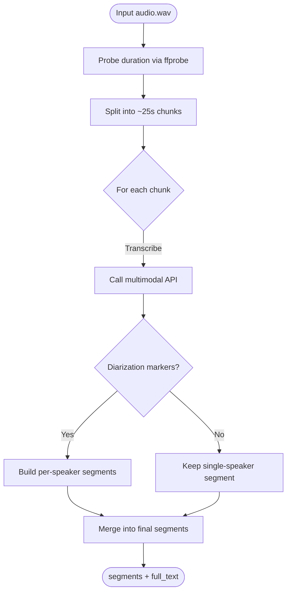

**Diagram sources**
- [audio_analysis.py:47-127](file://backend/pipeline/audio_analysis.py#L47-127)
- [audio_analysis.py:130-248](file://backend/pipeline/audio_analysis.py#L130-248)

**Section sources**
- [audio_analysis.py:1-435](file://backend/pipeline/audio_analysis.py#L1-L435)

### Subtitle Generation and Caching
- Generates WebVTT for English and translated versions (AR/FR/RU).
- Translates segments once and caches VTT files; SRT downloads are derived from cached VTT to ensure consistency.

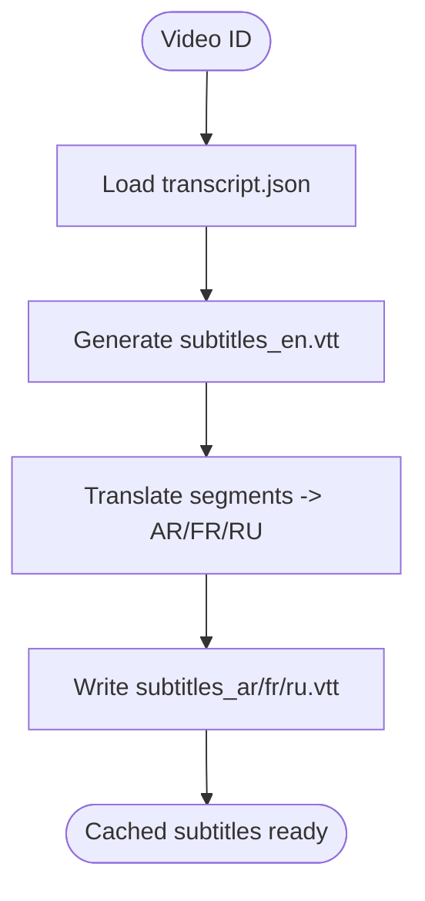

**Diagram sources**
- [subtitle_generation.py:286-328](file://backend/pipeline/subtitle_generation.py#L286-328)
- [subtitle_generation.py:331-367](file://backend/pipeline/subtitle_generation.py#L331-367)

**Section sources**
- [subtitle_generation.py:1-443](file://backend/pipeline/subtitle_generation.py#L1-L443)

### Dubbing Service
- Reads transcript.json, validates target language, translates segments, synthesizes speech per segment, assembles an audio track with silence gaps, and muxes into the source video.
- Persists per-language status and result files; returns completed paths for audio and video.

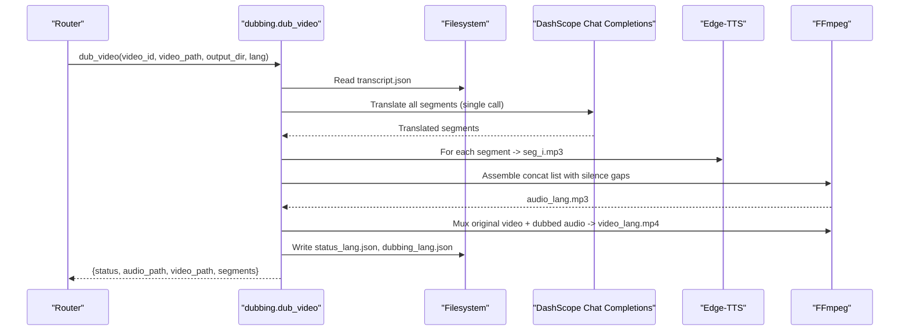

**Diagram sources**
- [dubbing.py:56-161](file://backend/pipeline/dubbing.py#L56-L161)
- [dubbing.py:166-238](file://backend/pipeline/dubbing.py#L166-L238)
- [dubbing.py:297-370](file://backend/pipeline/dubbing.py#L297-L370)
- [dubbing.py:421-457](file://backend/pipeline/dubbing.py#L421-L457)

**Section sources**
- [dubbing.py:1-521](file://backend/pipeline/dubbing.py#L1-L521)

### Enhanced Audio Assembly Process
**Updated** Enhanced with advanced normalization parameters to handle format inconsistencies during FFmpeg operations.

The audio assembly process has been significantly improved with robust format normalization to prevent encoding failures:

- **Format Normalization**: All audio pieces are normalized to a consistent 44.1kHz stereo format before encoding using FFmpeg's `aresample` filter
- **Encoding Parameters**: Uses `-af aresample=44100`, `-ar 44100`, `-ac 2` to ensure uniform stream format for the libmp3lame encoder
- **Error Prevention**: Prevents "inadequate AVFrame plane padding" errors that occur when mixing different audio formats
- **Silence Generation**: Generated silence matches Edge-TTS output format (24kHz mono) to maintain format consistency throughout the pipeline

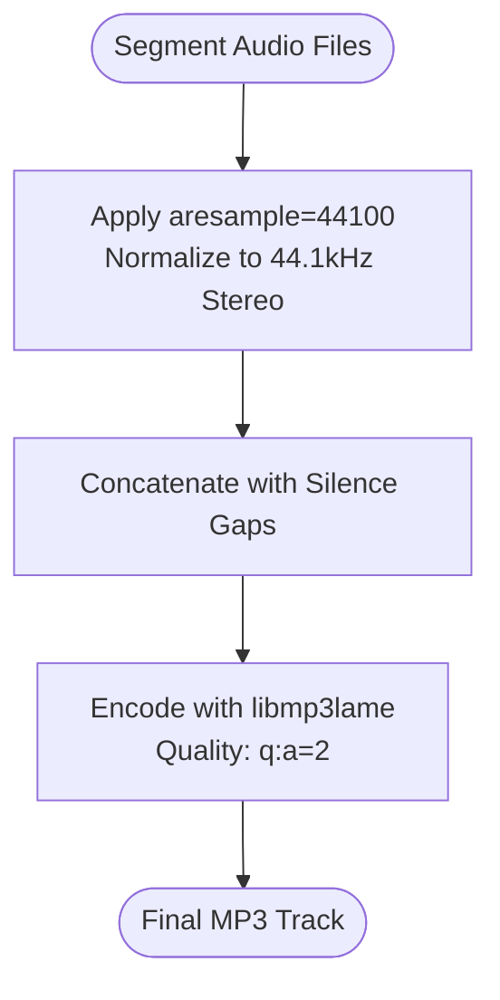

**Diagram sources**
- [dubbing.py:346-363](file://backend/pipeline/dubbing.py#L346-L363)
- [dubbing.py:381-407](file://backend/pipeline/dubbing.py#L381-L407)

**Section sources**
- [dubbing.py:297-378](file://backend/pipeline/dubbing.py#L297-378)
- [dubbing.py:381-407](file://backend/pipeline/dubbing.py#L381-L407)

### Improved Silence Generation
**Updated** Enhanced silence generation to match Edge-TTS output format for seamless concatenation.

Silence generation has been optimized to maintain format consistency with Edge-TTS synthesized speech:

- **Format Matching**: Generates silence at 24kHz mono to match Edge-TTS output specifications
- **Seamless Concatenation**: Eliminates format switching between silence and speech segments
- **Encoder Stability**: Prevents encoder reconfiguration issues during concatenation
- **Timing Precision**: Maintains exact timing gaps between speech segments

**Section sources**
- [dubbing.py:381-407](file://backend/pipeline/dubbing.py#L381-L407)

### Enhanced Error Logging
**Updated** Increased stderr truncation limits for better debugging capabilities.

Error logging has been enhanced to provide more comprehensive diagnostic information:

- **Audio Assembly Errors**: Increased stderr truncation from 400 to 800 characters for detailed FFmpeg error reporting
- **Muxing Errors**: Maintains 400-character truncation for video muxing operations
- **Debugging Support**: Provides sufficient context for troubleshooting complex audio processing issues
- **Performance Impact**: Minimal overhead while significantly improving diagnostic capabilities

**Section sources**
- [dubbing.py:372-375](file://backend/pipeline/dubbing.py#L372-L375)
- [dubbing.py:464-467](file://backend/pipeline/dubbing.py#L464-L467)

### API Endpoints for Dubbing
- Request dubbing: POST /api/video/{video_id}/dub
  - Validates language support and transcript availability
  - Returns cached result if already produced
  - Prevents duplicate tasks by tracking active tasks
- Status: GET /api/video/{video_id}/dub/status
  - Reads per-language status or dubbing JSON
  - Reflects in-flight task state
- Languages: GET /api/video/{video_id}/dub/languages
  - Lists available dubbed languages and supported set
- Download: GET /api/video/{video_id}/dubbed/{language}
  - Streams the resulting MP4

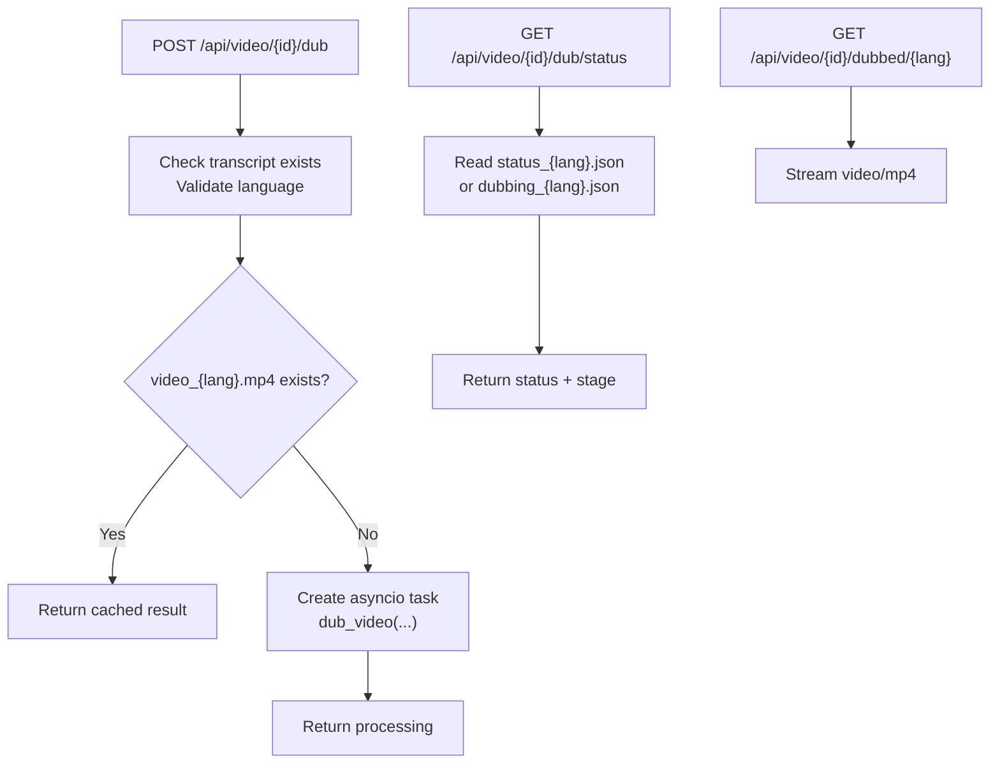

**Diagram sources**
- [video.py:450-558](file://backend/routers/video.py#L450-L558)

**Section sources**
- [video.py:450-558](file://backend/routers/video.py#L450-L558)

### Frontend Dubbing Panel
- Displays supported languages, initiates dubbing, polls status every few seconds, shows progress bar, and provides inline playback and download links.
- Uses api.ts helpers for REST calls and manages timers to stop polling when complete or failed.

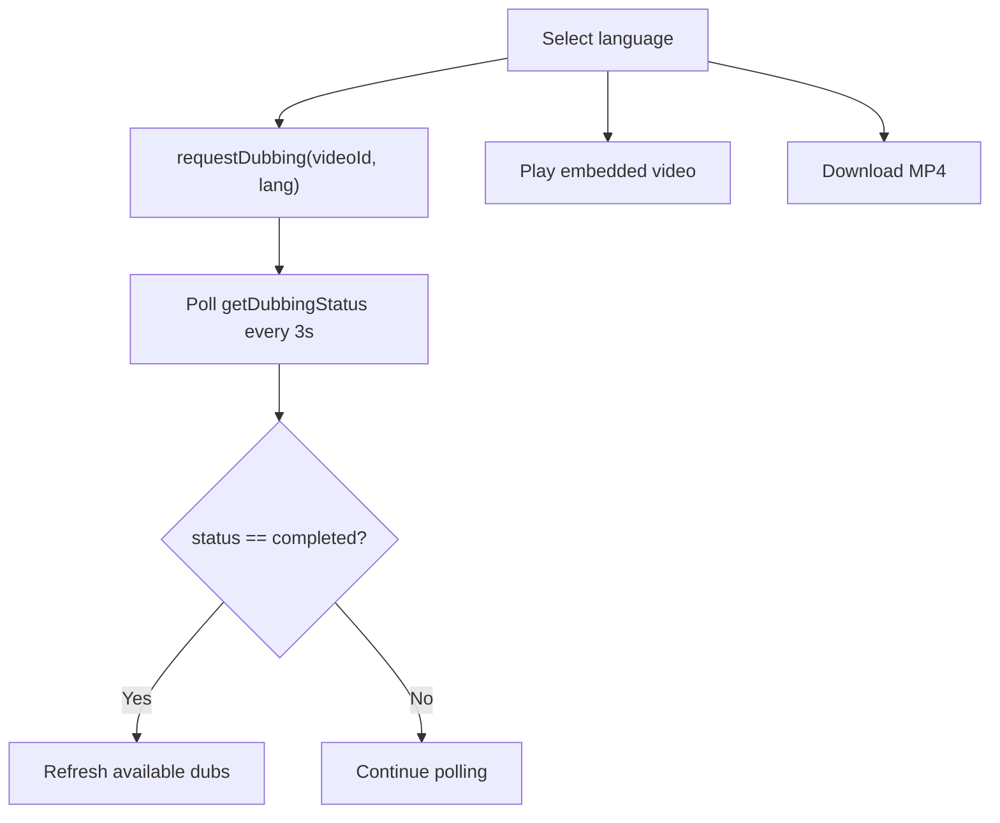

**Diagram sources**
- [DubbingPanel.tsx:75-138](file://frontend/src/components/archive/DubbingPanel.tsx#L75-L138)
- [api.ts:263-276](file://frontend/src/lib/api.ts#L263-L276)

**Section sources**
- [DubbingPanel.tsx:1-338](file://frontend/src/components/archive/DubbingPanel.tsx#L1-L338)
- [api.ts:211-277](file://frontend/src/lib/api.ts#L211-L277)

## Dependency Analysis
- Application wiring
  - main.py mounts static uploads and includes routers
  - config.py centralizes environment-driven settings
- Router dependencies
  - video.py depends on orchestrator, search_index, subtitle_generation, and dubbing
- Orchestrator dependencies
  - orchestrator.py imports ingestion, visual_analysis, audio_analysis, face_recognition, metadata_structuring, search_index, subtitle_generation
- Dubbing dependencies
  - dubbing.py uses httpx for translation, edge_tts for synthesis, ffmpeg/ffprobe for media operations
- Frontend dependencies
  - DubbingPanel.tsx uses api.ts methods for REST calls and manages local UI state

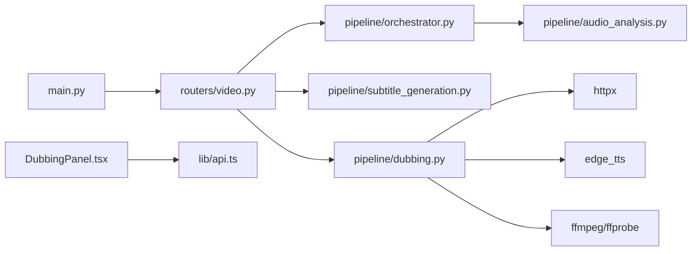

**Diagram sources**
- [main.py:20-38](file://backend/main.py#L20-L38)
- [video.py:22-26](file://backend/routers/video.py#L22-L26)
- [orchestrator.py:14-21](file://backend/pipeline/orchestrator.py#L14-L21)
- [dubbing.py:23-27](file://backend/pipeline/dubbing.py#L23-L27)
- [DubbingPanel.tsx:4](file://frontend/src/components/archive/DubbingPanel.tsx#L4)
- [api.ts:211-277](file://frontend/src/lib/api.ts#L211-L277)

**Section sources**
- [main.py:1-44](file://backend/main.py#L1-L44)
- [video.py:1-860](file://backend/routers/video.py#L1-L860)
- [orchestrator.py:1-410](file://backend/pipeline/orchestrator.py#L1-L410)
- [dubbing.py:1-521](file://backend/pipeline/dubbing.py#L1-L521)
- [DubbingPanel.tsx:1-338](file://frontend/src/components/archive/DubbingPanel.tsx#L1-L338)
- [api.ts:1-339](file://frontend/src/lib/api.ts#L1-L339)

## Performance Considerations
- Subprocess isolation: The pipeline runs in a detached subprocess to prevent long-running AI tasks from blocking the API server.
- Chunked transcription: Audio is split into ~25-second chunks to respect model limits and improve reliability.
- Resilient subtitle generation: Subtitle translation failures do not block other languages; results are cached to disk.
- Task deduplication: In-memory tracking prevents duplicate dubbing tasks for the same video/language pair.
- Media operations: FFmpeg commands use executors to avoid blocking the event loop; durations are probed via ffprobe.
- **Enhanced audio processing**: Format normalization prevents encoding failures and improves reliability across diverse input formats.
- **Optimized silence generation**: Matching Edge-TTS format eliminates encoder reconfiguration overhead during concatenation.

## Troubleshooting Guide
Common issues and checks:
- Missing transcript before dubbing
  - Ensure the pipeline has completed at least the audio analysis stage so transcript.json exists.
- Unsupported target language
  - Verify the requested language is included in the supported list configured in settings.
- API key not configured
  - Translation and synthesis require valid API keys and base URLs; confirm environment variables.
- FFmpeg/ffprobe not installed
  - Audio assembly and muxing depend on these tools being available in PATH.
- File permissions
  - Ensure the uploads directory is writable and accessible by the backend process.
- Long-running jobs
  - Use GET /api/video/{id}/dub/status to poll progress; the frontend simulates a progress bar while polling.
- **Audio assembly failures**
  - Check enhanced error logs with 800-character stderr truncation for detailed FFmpeg diagnostics
  - Verify FFmpeg version supports aresample filter for format normalization
- **Format inconsistency errors**
  - The system now automatically normalizes audio formats to prevent "inadequate AVFrame plane padding" errors
  - Monitor logs for any remaining format mismatch warnings

**Section sources**
- [video.py:450-558](file://backend/routers/video.py#L450-L558)
- [config.py:5-29](file://backend/config.py#L5-L29)
- [dubbing.py:56-161](file://backend/pipeline/dubbing.py#L56-L161)
- [audio_analysis.py:47-127](file://backend/pipeline/audio_analysis.py#L47-L127)
- [dubbing.py:372-375](file://backend/pipeline/dubbing.py#L372-L375)

## Conclusion
The dubbing pipeline integrates transcription, translation, speech synthesis, and media assembly into a cohesive workflow. It leverages a robust orchestration strategy with background execution, resilient subtitle generation, and clear API contracts. The frontend provides an intuitive interface to initiate dubbing, monitor progress, and consume results. With proper configuration and tooling (FFmpeg), the system can reliably produce high-quality dubbed videos across multiple languages.

**Recent Enhancements**: The latest improvements include advanced audio format normalization, optimized silence generation matching Edge-TTS specifications, and enhanced error logging with increased stderr truncation limits. These changes significantly improve reliability and debugging capabilities while maintaining backward compatibility with existing workflows.