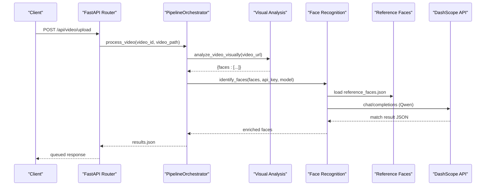
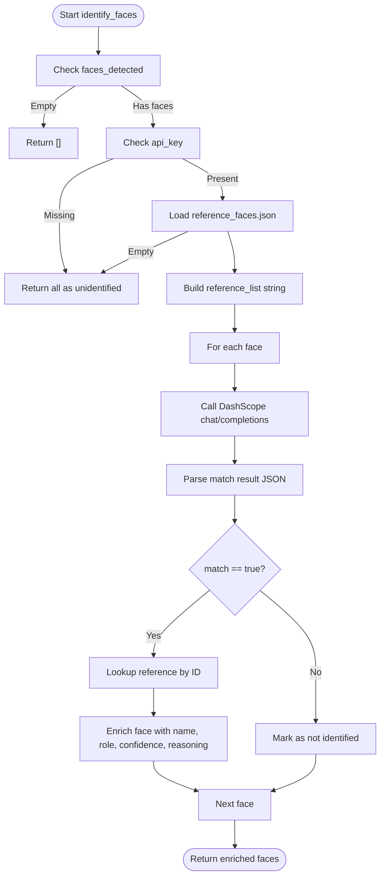
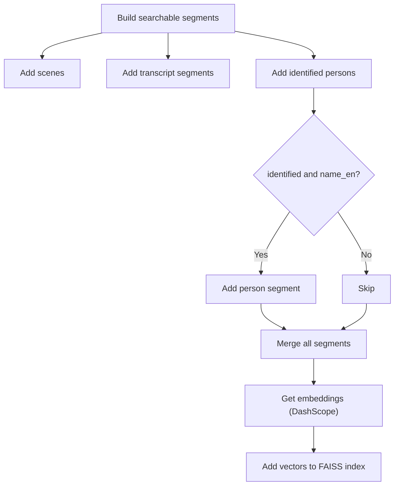
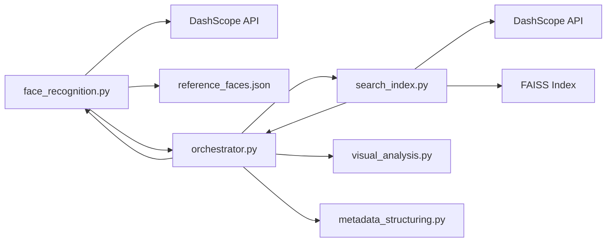

# Face Recognition Stage

<cite>
**Referenced Files in This Document**
- [face_recognition.py](file://backend/pipeline/face_recognition.py)
- [visual_analysis.py](file://backend/pipeline/visual_analysis.py)
- [orchestrator.py](file://backend/pipeline/orchestrator.py)
- [search_index.py](file://backend/pipeline/search_index.py)
- [config.py](file://backend/config.py)
- [reference_faces.json](file://backend/data/reference_faces.json)
- [iptc_taxonomy.json](file://backend/data/iptc_taxonomy.json)
- [video.py](file://backend/routers/video.py)
- [main.py](file://backend/main.py)
</cite>

## Table of Contents
1. [Introduction](#introduction)
2. [Project Structure](#project-structure)
3. [Core Components](#core-components)
4. [Architecture Overview](#architecture-overview)
5. [Detailed Component Analysis](#detailed-component-analysis)
6. [Dependency Analysis](#dependency-analysis)
7. [Performance Considerations](#performance-considerations)
8. [Troubleshooting Guide](#troubleshooting-guide)
9. [Conclusion](#conclusion)

## Introduction
This document explains the face recognition and identification stage powered by Alibaba Cloud DashScope’s Qwen model. It covers the end-to-end workflow from face detection in the visual analysis stage to person identification using a curated reference database, enrichment of face metadata, and integration with the search index. It also documents API usage patterns, confidence scoring, and practical guidance for accuracy and troubleshooting.

## Project Structure
The face recognition stage is part of a six-stage pipeline orchestrated by a central controller. The stage consumes detected faces from the visual analysis stage and enriches them with identity information using Qwen text capabilities.

**Diagram sources**
- [visual_analysis.py:43-131](file://backend/pipeline/visual_analysis.py#L43-L131)
- [face_recognition.py:54-107](file://backend/pipeline/face_recognition.py#L54-L107)
- [metadata_structuring.py:81-163](file://backend/pipeline/metadata_structuring.py#L81-L163)
- [search_index.py:88-154](file://backend/pipeline/search_index.py#L88-L154)

**Section sources**
- [orchestrator.py:131-148](file://backend/pipeline/orchestrator.py#L131-L148)
- [visual_analysis.py:26-40](file://backend/pipeline/visual_analysis.py#L26-L40)

## Core Components
- Face Recognition Module: Matches detected faces against a reference database using Qwen text prompts and returns enriched face records with identification metadata and confidence.
- Reference Database: A curated JSON dataset of UAE public figures with identifiers, names, roles, and descriptions.
- Orchestrator: Coordinates pipeline stages and passes detected faces to the face recognition stage.
- Search Index: Builds a vector index from scenes, transcripts, and identified persons for semantic search.

**Section sources**
- [face_recognition.py:21-31](file://backend/pipeline/face_recognition.py#L21-L31)
- [reference_faces.json:1-101](file://backend/data/reference_faces.json#L1-L101)
- [orchestrator.py:131-148](file://backend/pipeline/orchestrator.py#L131-L148)
- [search_index.py:88-154](file://backend/pipeline/search_index.py#L88-L154)

## Architecture Overview
The face recognition stage integrates tightly with the visual analysis stage and the orchestrator. Detected faces are passed as-is from the visual analysis results and enriched with identification outcomes.

**Diagram sources**
- [video.py:39-92](file://backend/routers/video.py#L39-L92)
- [orchestrator.py:131-148](file://backend/pipeline/orchestrator.py#L131-L148)
- [visual_analysis.py:43-131](file://backend/pipeline/visual_analysis.py#L43-L131)
- [face_recognition.py:54-107](file://backend/pipeline/face_recognition.py#L54-L107)

## Detailed Component Analysis

### Face Detection Workflow
- Visual analysis produces a list of faces with attributes such as description, age estimate, gender, timestamp, and bounding box.
- These records are passed to the face recognition stage as-is.

**Section sources**
- [visual_analysis.py:26-40](file://backend/pipeline/visual_analysis.py#L26-L40)
- [visual_analysis.py:162-175](file://backend/pipeline/visual_analysis.py#L162-L175)

### Facial Feature Extraction and Person Identification
- The face recognition module loads a reference database of known individuals.
- For each detected face, it constructs a prompt that includes:
  - Physical description of the detected person
  - Age estimate, gender, and timestamp
  - A curated list of reference persons with identifiers, names, roles, and descriptions
- The prompt is sent to Qwen (text model) to determine if there is a match.
- On successful match, the result includes:
  - Identified flag set to true
  - Names (English and Arabic), role, reference ID, confidence, and reasoning
- On failure, the record remains un-identified with confidence set to zero.

**Diagram sources**
- [face_recognition.py:54-107](file://backend/pipeline/face_recognition.py#L54-L107)
- [face_recognition.py:110-195](file://backend/pipeline/face_recognition.py#L110-L195)
- [reference_faces.json:1-101](file://backend/data/reference_faces.json#L1-L101)

**Section sources**
- [face_recognition.py:34-51](file://backend/pipeline/face_recognition.py#L34-L51)
- [face_recognition.py:198-214](file://backend/pipeline/face_recognition.py#L198-L214)

### Integration with Visual Analysis Results
- The orchestrator extracts the faces list from the visual analysis stage and passes it to the face recognition stage.
- The enriched faces are stored as a separate result artifact and later used by metadata structuring and search index creation.

**Section sources**
- [orchestrator.py:131-148](file://backend/pipeline/orchestrator.py#L131-L148)
- [video.py:154-174](file://backend/routers/video.py#L154-L174)

### Person Metadata Generation
- The metadata structuring stage compiles a compact representation of analysis results, including identified persons.
- Identified persons are included with their names, roles, and timestamps to enrich broadcast metadata.

**Section sources**
- [metadata_structuring.py:195-208](file://backend/pipeline/metadata_structuring.py#L195-L208)

### Relationship Between Face Recognition Results and Search Index Creation
- The search index builder aggregates:
  - Scene descriptions from visual analysis
  - Transcript segments
  - Identified persons (when available)
- Identified persons contribute textual segments that include the person’s name and role, enabling semantic search across named figures.

**Diagram sources**
- [orchestrator.py:283-314](file://backend/pipeline/orchestrator.py#L283-L314)
- [search_index.py:88-154](file://backend/pipeline/search_index.py#L88-L154)

**Section sources**
- [orchestrator.py:283-314](file://backend/pipeline/orchestrator.py#L283-L314)

### API Usage Examples
- Face recognition API call signature:
  - Input: faces_detected (list), api_key (string), model (string), base_url (string)
  - Output: list of enriched face dictionaries
- Example invocation is orchestrated by the pipeline; the orchestrator calls the face recognition function with the detected faces from visual analysis and passes the configured API key and model.

**Section sources**
- [face_recognition.py:54-107](file://backend/pipeline/face_recognition.py#L54-L107)
- [orchestrator.py:131-148](file://backend/pipeline/orchestrator.py#L131-L148)
- [config.py:4-12](file://backend/config.py#L4-L12)

## Dependency Analysis
- The face recognition stage depends on:
  - DashScope API for text-based matching
  - Local reference database for known identities
  - Orchestrator for passing detected faces and managing pipeline progress
- The search index stage depends on:
  - DashScope embeddings API
  - FAISS for vector storage and similarity search
  - The enriched faces produced by the face recognition stage

**Diagram sources**
- [face_recognition.py:54-107](file://backend/pipeline/face_recognition.py#L54-L107)
- [reference_faces.json:1-101](file://backend/data/reference_faces.json#L1-L101)
- [search_index.py:88-154](file://backend/pipeline/search_index.py#L88-L154)
- [orchestrator.py:131-148](file://backend/pipeline/orchestrator.py#L131-L148)

**Section sources**
- [face_recognition.py:13,127-136](file://backend/pipeline/face_recognition.py#L13,L127-L136)
- [search_index.py:13,204-212](file://backend/pipeline/search_index.py#L13,L204-L212)

## Performance Considerations
- API latency and throughput:
  - Face recognition calls are asynchronous with exponential backoff and timeouts to handle transient failures.
  - The search index stage batches embedding requests to reduce overhead.
- Prompt construction cost:
  - Building the reference list string scales with the number of reference entries; keep the reference database reasonably sized.
- Confidence scoring:
  - Confidence values are returned by the model; treat them as relative indicators rather than absolute probabilities.
- Resource usage:
  - FAISS index persistence avoids rebuilding on startup; ensure sufficient disk space for index and metadata files.

[No sources needed since this section provides general guidance]

## Troubleshooting Guide
Common issues and remedies:
- No API key configured:
  - Symptom: All faces remain un-identified.
  - Action: Set the DashScope API key in environment variables and restart the service.
- Reference database missing or invalid:
  - Symptom: Warning logs indicating missing or invalid JSON; all faces remain un-identified.
  - Action: Verify the reference_faces.json file exists and is valid JSON.
- DashScope API errors:
  - Symptom: HTTP status errors or request exceptions during face recognition or embedding calls.
  - Action: Check network connectivity, API key validity, and rate limits; the code retries with exponential backoff.
- Parsing failures:
  - Symptom: Parse errors when extracting JSON from model responses.
  - Action: Ensure the model returns valid JSON; the parser attempts multiple strategies (direct, markdown block, bracket extraction).
- Search index unavailable:
  - Symptom: Warning that FAISS index is unavailable.
  - Action: Install faiss-cpu or ensure it is available; otherwise, search capability will be disabled.

**Section sources**
- [face_recognition.py:76-81](file://backend/pipeline/face_recognition.py#L76-L81)
- [face_recognition.py:84-89](file://backend/pipeline/face_recognition.py#L84-L89)
- [face_recognition.py:176-183](file://backend/pipeline/face_recognition.py#L176-L183)
- [face_recognition.py:198-214](file://backend/pipeline/face_recognition.py#L198-L214)
- [search_index.py:61-70](file://backend/pipeline/search_index.py#L61-L70)
- [search_index.py:226-242](file://backend/pipeline/search_index.py#L226-L242)

## Conclusion
The face recognition stage leverages DashScope’s Qwen model to match detected faces against a curated reference database, enriching them with identity metadata and confidence scores. The orchestrator coordinates this stage seamlessly with visual analysis, metadata structuring, and search index creation. Proper configuration of API keys, a valid reference database, and robust error handling ensures reliable identification and search capabilities.