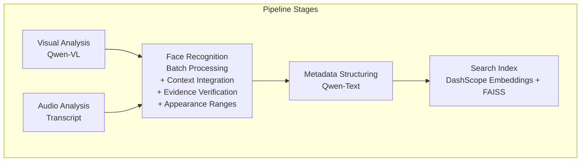
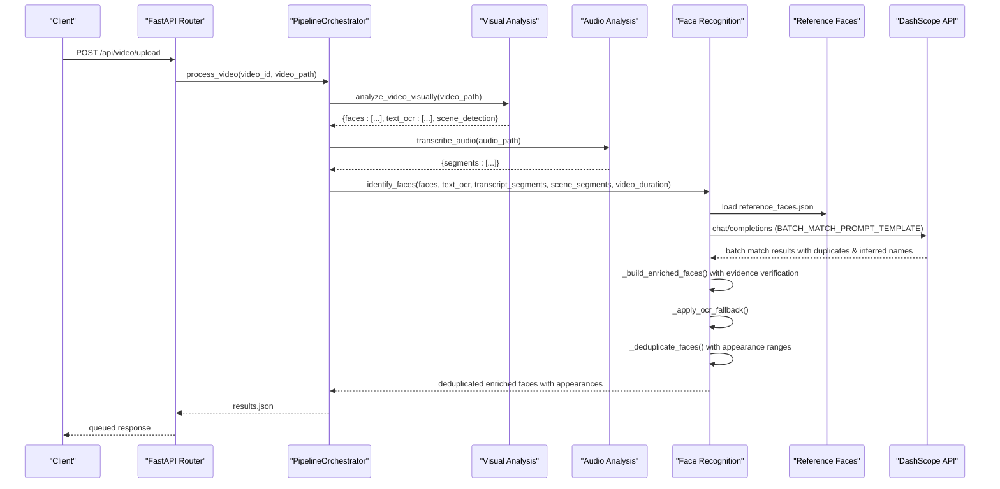
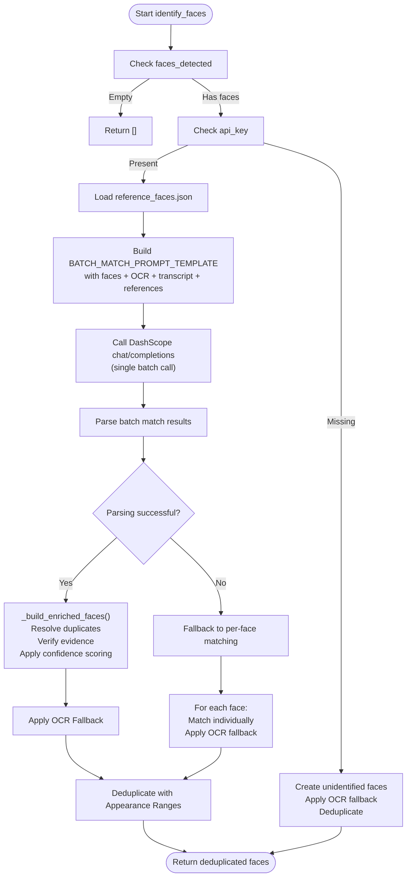
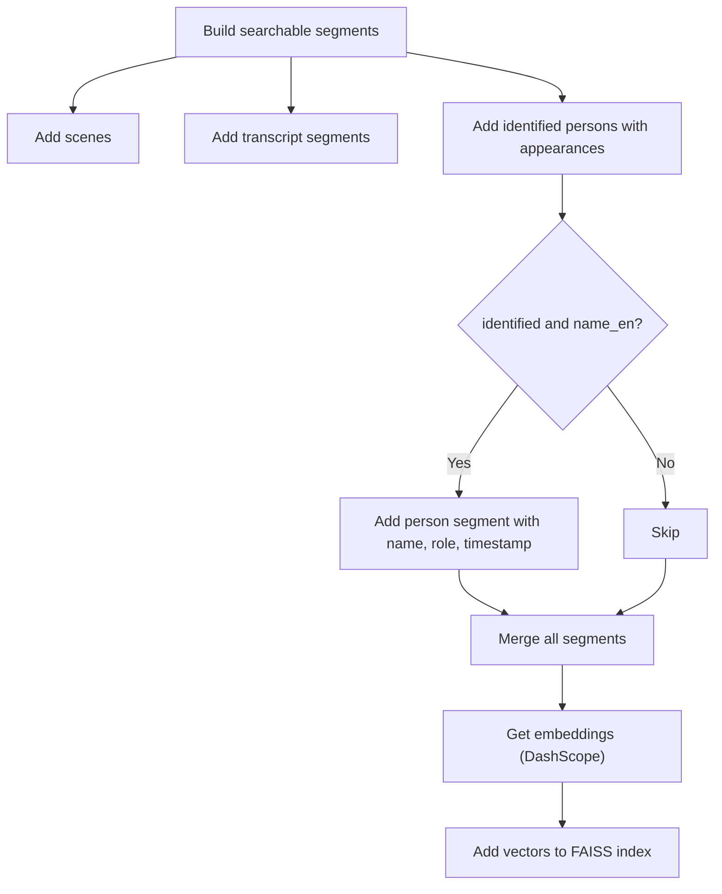
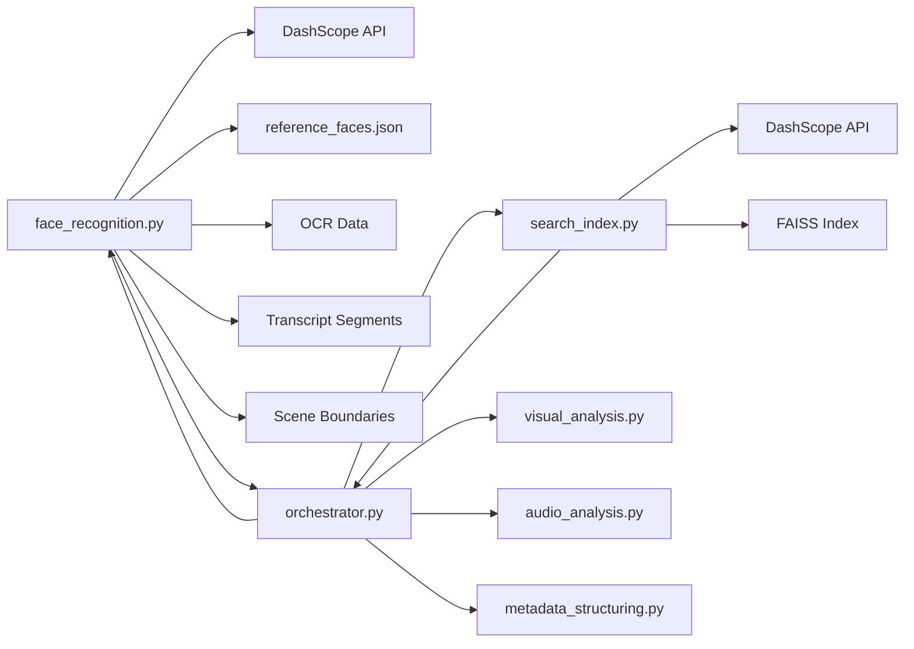

# Face Recognition Stage

<cite>
**Referenced Files in This Document**
- [face_recognition.py](file://backend/pipeline/face_recognition.py)
- [visual_analysis.py](file://backend/pipeline/visual_analysis.py)
- [orchestrator.py](file://backend/pipeline/orchestrator.py)
- [search_index.py](file://backend/pipeline/search_index.py)
- [metadata_structuring.py](file://backend/pipeline/metadata_structuring.py)
- [config.py](file://backend/config.py)
- [reference_faces.json](file://backend/data/reference_faces.json)
- [video.py](file://backend/routers/video.py)
- [main.py](file://backend/main.py)
</cite>

## Update Summary
**Changes Made**
- Complete overhaul of face recognition system with batch processing capabilities using enhanced prompt templates
- Added OCR and transcript context integration for improved identity resolution
- Implemented evidence verification system to validate model claims against actual context
- Enhanced deduplication with appearance range calculations based on scene boundaries
- Added duplicate face detection and inheritance system for unified person tracking
- Integrated confidence scoring with source-based weighting (OCR, transcript, knowledge)
- Updated API parameters to support new batch processing and context inputs

## Table of Contents
1. [Introduction](#introduction)
2. [Project Structure](#project-structure)
3. [Core Components](#core-components)
4. [Architecture Overview](#architecture-overview)
5. [Detailed Component Analysis](#detailed-component-analysis)
6. [Advanced Features](#advanced-features)
7. [Dependency Analysis](#dependency-analysis)
8. [Performance Considerations](#performance-considerations)
9. [Troubleshooting Guide](#troubleshooting-guide)
10. [Conclusion](#conclusion)

## Introduction
This document explains the comprehensive face recognition and identification stage powered by Alibaba Cloud DashScope's Qwen model. The system has been completely overhauled to provide batch processing capabilities, enhanced identity resolution using OCR and transcript context, evidence verification, and improved deduplication with appearance range calculations. It covers the end-to-end workflow from face detection in the visual analysis stage through advanced multi-source identity resolution to person identification using a curated reference database, enriched metadata generation, and seamless integration with the search index.

## Project Structure
The face recognition stage is part of a six-stage pipeline orchestrated by a central controller. The stage now consumes detected faces from the visual analysis stage along with OCR data and transcript segments, processes them through batch matching with context awareness, applies evidence verification, and returns deduplicated person records with unified appearance ranges.

**Diagram sources**
- [visual_analysis.py:60-218](file://backend/pipeline/visual_analysis.py#L60-L218)
- [face_recognition.py:185-262](file://backend/pipeline/face_recognition.py#L185-L262)
- [metadata_structuring.py:81-163](file://backend/pipeline/metadata_structuring.py#L81-L163)
- [search_index.py:143-212](file://backend/pipeline/search_index.py#L143-L212)

**Section sources**
- [orchestrator.py:130-156](file://backend/pipeline/orchestrator.py#L130-L156)
- [visual_analysis.py:60-82](file://backend/pipeline/visual_analysis.py#L60-L82)

## Core Components
- **Enhanced Face Recognition Module**: Processes all detected faces in a single batch call with integrated OCR and transcript context, returning enriched face records with identification metadata, confidence scores, and unified appearance information.
- **Reference Database**: A curated JSON dataset of UAE public figures with identifiers, names, roles, and descriptions for conservative matching.
- **Context Integration System**: Combines OCR text from visual analysis and transcript segments to provide additional identification clues beyond visual descriptions.
- **Evidence Verification Engine**: Validates model claims about name sources (on-screen vs. transcript vs. knowledge) against actual context tokens.
- **Advanced Deduplication Engine**: Groups multiple face detections of the same person across different timestamps into unified appearance records with merged time intervals based on scene boundaries.
- **Duplicate Detection System**: Identifies when the same person appears multiple times within a video and creates inheritance relationships for efficient processing.
- **Orchestrator**: Coordinates pipeline stages and passes detected faces, OCR data, transcript segments, scene boundaries, and video duration to the face recognition stage.
- **Search Index**: Builds a vector index from scenes, transcripts, and identified persons for semantic search with person-specific segments.

**Section sources**
- [face_recognition.py:185-262](file://backend/pipeline/face_recognition.py#L185-L262)
- [reference_faces.json:1-101](file://backend/data/reference_faces.json#L1-L101)
- [orchestrator.py:130-156](file://backend/pipeline/orchestrator.py#L130-L156)
- [search_index.py:143-212](file://backend/pipeline/search_index.py#L143-L212)

## Architecture Overview
The face recognition stage integrates tightly with both the visual analysis and audio analysis stages. Detected faces are passed along with OCR data, transcript segments, scene boundaries, and video duration, then processed through batch matching with context awareness, evidence verification, and deduplication before being enriched with identification outcomes.

**Diagram sources**
- [video.py:51-113](file://backend/routers/video.py#L51-L113)
- [orchestrator.py:130-156](file://backend/pipeline/orchestrator.py#L130-L156)
- [visual_analysis.py:60-218](file://backend/pipeline/visual_analysis.py#L60-L218)
- [face_recognition.py:185-262](file://backend/pipeline/face_recognition.py#L185-L262)

## Detailed Component Analysis

### Enhanced Face Detection Workflow
- Visual analysis produces a list of faces with attributes such as description, age estimate, gender, timestamp, bounding box, on-screen text information, and scene boundaries.
- Audio analysis provides transcript segments with timestamps for spoken introductions and context.
- These records are passed to the face recognition stage along with OCR data, transcript segments, scene boundaries, and video duration from previous stages.

**Section sources**
- [visual_analysis.py:60-82](file://backend/pipeline/visual_analysis.py#L60-L82)
- [visual_analysis.py:228-275](file://backend/pipeline/visual_analysis.py#L228-L275)
- [orchestrator.py:130-156](file://backend/pipeline/orchestrator.py#L130-L156)

### Batch Processing and Multi-Source Identity Resolution
- The enhanced face recognition module loads a reference database of known individuals and constructs a comprehensive batch prompt containing:
  - All detected faces with their physical descriptions, timestamps, and on-screen labels
  - OCR text captured throughout the video with timestamps
  - Transcript segments with spoken introductions and contextual information
  - Reference database entries for conservative matching
- For each detected face, the system determines:
  - Whether it's a duplicate of an earlier face in the same video
  - Whether it matches a person in the reference database
  - Whether it can be named from OCR or transcript context
  - The confidence level and evidence source for any identification
- On successful match, the result includes:
  - Identified flag set to true with appropriate confidence scoring
  - Names (English and Arabic), role, reference ID, reasoning, and evidence source
  - Duplicate relationships for efficient processing
- On failure, the record remains un-identified with confidence set to zero.

**Diagram sources**
- [face_recognition.py:185-262](file://backend/pipeline/face_recognition.py#L185-L262)
- [face_recognition.py:282-371](file://backend/pipeline/face_recognition.py#L282-L371)
- [face_recognition.py:404-499](file://backend/pipeline/face_recognition.py#L404-L499)

**Section sources**
- [face_recognition.py:53-83](file://backend/pipeline/face_recognition.py#L53-83)
- [face_recognition.py:282-371](file://backend/pipeline/face_recognition.py#L282-L371)
- [face_recognition.py:404-499](file://backend/pipeline/face_recognition.py#L404-L499)

### Evidence Verification System
- The system validates model claims about name sources against actual context tokens:
  - OCR claims verified against OCR corpus tokens
  - Transcript claims verified against transcript corpus tokens
  - Knowledge-based suggestions capped at lower confidence levels
- Name normalization handles shouting lower-third text (e.g., "CRAIG BILLINGS" → "Craig Billings")
- Source-based confidence scoring:
  - OCR evidence: 0.9 confidence
  - Transcript evidence: 0.8 confidence  
  - Knowledge-based suggestions: 0.6 confidence maximum
  - Reference database matches: model-provided confidence

**Section sources**
- [face_recognition.py:374-401](file://backend/pipeline/face_recognition.py#L374-L401)
- [face_recognition.py:380-395](file://backend/pipeline/face_recognition.py#L380-L395)
- [face_recognition.py:450-482](file://backend/pipeline/face_recognition.py#L450-L482)

### Advanced Deduplication with Appearance Range Calculations
- The `_deduplicate_faces()` function groups multiple face detections of the same person across different timestamps into unified appearance records:
  - Groups by identity using name_en for identified persons or description for unidentified persons
  - Handles duplicate chains where one face inherits identity from another
  - Calculates frame interval based on video duration and distinct timestamps
  - Uses scene boundaries when available for precise appearance windows
  - Merges overlapping or adjacent time ranges into continuous appearance intervals
  - Removes per-frame fields that don't apply to merged entries
  - Preserves identification metadata and confidence scores
- Output format includes:
  - `appearances`: List of time range objects with start and end timestamps
  - Identity fields: `name_en`, `name_ar`, `role`, `confidence`, `identified`
  - Other relevant metadata from the first occurrence

**Section sources**
- [face_recognition.py:121-182](file://backend/pipeline/face_recognition.py#L121-L182)
- [face_recognition.py:97-118](file://backend/pipeline/face_recognition.py#L97-L118)

### Integration with Visual and Audio Analysis Results
- The orchestrator extracts faces, OCR data, transcript segments, scene boundaries, and video duration from previous stages and passes them to the face recognition stage.
- The enriched faces are stored as a separate result artifact and later used by metadata structuring and search index creation.

**Section sources**
- [orchestrator.py:130-156](file://backend/pipeline/orchestrator.py#L130-L156)
- [video.py:138-172](file://backend/routers/video.py#L138-L172)

### Person Metadata Generation
- The metadata structuring stage compiles a compact representation of analysis results, including identified persons with their unified appearance information.
- Identified persons are included with their names, roles, and timestamps to enrich broadcast metadata.

**Section sources**
- [metadata_structuring.py:195-208](file://backend/pipeline/metadata_structuring.py#L195-L208)

### Relationship Between Face Recognition Results and Search Index Creation
- The search index builder aggregates:
  - Scene descriptions from visual analysis
  - Transcript segments
  - Identified persons with their appearance ranges
- Identified persons contribute textual segments that include the person's name, role, and appearance timestamps, enabling semantic search across named figures with temporal precision.

**Diagram sources**
- [orchestrator.py:313-377](file://backend/pipeline/orchestrator.py#L313-L377)
- [search_index.py:143-212](file://backend/pipeline/search_index.py#L143-L212)

**Section sources**
- [orchestrator.py:313-377](file://backend/pipeline/orchestrator.py#L313-L377)

### Enhanced API Usage Examples
- Face recognition API call signature:
  - Input: faces_detected (list), api_key (string), text_ocr (list), transcript_segments (list), scene_segments (list), video_duration (float), model (string), base_url (string)
  - Output: list of deduplicated enriched face dictionaries with appearance ranges
- Example invocation is orchestrated by the pipeline; the orchestrator calls the face recognition function with all available context data from visual and audio analysis stages.

**Section sources**
- [face_recognition.py:185-214](file://backend/pipeline/face_recognition.py#L185-L214)
- [orchestrator.py:145-155](file://backend/pipeline/orchestrator.py#L145-L155)
- [config.py:4-15](file://backend/config.py#L4-L15)

## Advanced Features

### Batch Processing Capabilities
The system now processes all detected faces in a single LLM call using the `BATCH_MATCH_PROMPT_TEMPLATE`, significantly improving efficiency and enabling cross-face context analysis.

**Key Features:**
- Single API call for all faces instead of individual calls
- Cross-face duplicate detection within the same video
- Context-aware matching using OCR and transcript information
- Efficient token usage through compact face descriptions
- Automatic fallback to per-face matching if batch parsing fails

**Section sources**
- [face_recognition.py:53-83](file://backend/pipeline/face_recognition.py#L53-83)
- [face_recognition.py:282-371](file://backend/pipeline/face_recognition.py#L282-L371)

### Enhanced Identity Resolution with Multiple Sources
The system integrates three sources of identity information with evidence verification:

**OCR-Based Identification:**
- Scans detected faces for on-screen name and title information
- Applies OCR-based identification with high confidence (0.9)
- Verifies names exist in OCR corpus before claiming OCR source

**Transcript-Based Identification:**
- Analyzes transcript segments for spoken introductions
- Matches names mentioned near face timestamps
- Provides medium confidence (0.8) for transcript-sourced names

**Knowledge-Based Suggestions:**
- Uses general knowledge for well-known public figures
- Capped at low confidence (0.6) to indicate suggestion status
- Requires careful review before use

**Section sources**
- [face_recognition.py:450-482](file://backend/pipeline/face_recognition.py#L450-L482)
- [face_recognition.py:532-551](file://backend/pipeline/face_recognition.py#L532-L551)

### Evidence Verification System
The system validates model claims about evidence sources against actual context:

**Token-Based Verification:**
- Creates token sets from OCR corpus and transcript corpus
- Verifies claimed names appear literally in cited contexts
- Downgrades unverified claims to AI suggestions

**Name Normalization:**
- Converts shouting lower-third text to readable casing
- Preserves acronyms (CEO, WSJ, UAE) while normalizing other words
- Handles various text formats consistently

**Section sources**
- [face_recognition.py:374-401](file://backend/pipeline/face_recognition.py#L374-L401)
- [face_recognition.py:380-395](file://backend/pipeline/face_recognition.py#L380-L395)

### Improved Deduplication with Appearance Range Calculations
The enhanced deduplication system provides precise appearance tracking:

**Scene-Aware Timing:**
- Uses scene boundaries when available for accurate shot detection
- Falls back to calculated intervals when scene data unavailable
- Supports nested shot boundaries within scenes

**Intelligent Merging:**
- Sorts and merges overlapping or adjacent time ranges
- Creates continuous appearance intervals for better user experience
- Preserves temporal accuracy for search and navigation

**Section sources**
- [face_recognition.py:121-182](file://backend/pipeline/face_recognition.py#L121-L182)
- [face_recognition.py:97-118](file://backend/pipeline/face_recognition.py#L97-L118)

### Duplicate Face Inheritance System
The system efficiently handles repeated appearances of the same person:

**Chain Resolution:**
- Resolves duplicate_of chains to find root faces
- Inherits identity from root faces automatically
- Maintains efficient processing by avoiding redundant analysis

**Unified Grouping:**
- Groups unidentified faces marked as duplicates together
- Creates shared identity roots for consistent merging
- Preserves original face data while providing unified view

**Section sources**
- [face_recognition.py:420-431](file://backend/pipeline/face_recognition.py#L420-L431)
- [face_recognition.py:491-499](file://backend/pipeline/face_recognition.py#L491-L499)

## Dependency Analysis
- The face recognition stage depends on:
  - DashScope API for batch text-based matching
  - Local reference database for known identities
  - OCR data from visual analysis for fallback identification
  - Transcript segments from audio analysis for spoken context
  - Scene boundaries from visual analysis for precise timing
  - Orchestrator for passing all context data and managing pipeline progress
- The search index stage depends on:
  - DashScope embeddings API
  - FAISS for vector storage and similarity search
  - The deduplicated faces produced by the face recognition stage with appearance ranges

**Diagram sources**
- [face_recognition.py:185-262](file://backend/pipeline/face_recognition.py#L185-L262)
- [reference_faces.json:1-101](file://backend/data/reference_faces.json#L1-L101)
- [search_index.py:143-212](file://backend/pipeline/search_index.py#L143-L212)
- [orchestrator.py:130-156](file://backend/pipeline/orchestrator.py#L130-L156)

**Section sources**
- [face_recognition.py:13,127-136](file://backend/pipeline/face_recognition.py#L13,L127-L136)
- [search_index.py:13,204-212](file://backend/pipeline/search_index.py#L13,L204-L212)

## Performance Considerations
- **Batch Processing Efficiency:**
  - Single API call for all faces reduces overhead significantly compared to per-face matching
  - Token-efficient prompt construction balances context richness with cost control
  - Automatic fallback ensures robustness when batch processing fails
- **Context Integration Cost:**
  - OCR and transcript context adds to prompt size but improves accuracy
  - Transcript formatting limits segments to prevent token overflow
  - Scene boundary processing adds minimal overhead
- **Evidence Verification Overhead:**
  - Token creation and verification adds computational cost but prevents false positives
  - Name normalization is lightweight string processing
- **Deduplication Performance:**
  - Scene-aware timing requires additional processing but provides better results
  - Chain resolution uses efficient graph traversal algorithms
  - Memory usage scales with number of unique identities and face detections
- **Confidence Scoring:**
  - Source-based confidence provides meaningful reliability indicators
  - Model confidence values treated as relative rather than absolute probabilities
- **Resource Usage:**
  - FAISS index persistence avoids rebuilding on startup
  - Batch embedding requests reduce API overhead in search index stage

## Troubleshooting Guide
Common issues and remedies:
- **No API key configured:**
  - Symptom: All faces remain un-identified.
  - Action: Set the DashScope API key in environment variables and restart the service.
- **Reference database missing or invalid:**
  - Symptom: Warning logs indicating missing or invalid JSON; all faces remain un-identified.
  - Action: Verify the reference_faces.json file exists and is valid JSON.
- **Batch processing failures:**
  - Symptom: Warning about batch face matching failure, falling back to per-face matching.
  - Action: Check model response format; ensure batch prompt template generates valid JSON array.
- **Evidence verification issues:**
  - Symptom: Names downgraded from OCR/transcript to AI suggestions unexpectedly.
  - Action: Verify OCR and transcript data contains expected text; check tokenization logic.
- **Duplicate detection problems:**
  - Symptom: Same person appearing multiple times without proper grouping.
  - Action: Check duplicate_of relationships in batch response; verify chain resolution logic.
- **Appearance range calculation errors:**
  - Symptom: Incorrect timing or missing scene boundaries.
  - Action: Verify scene_segments data structure; check timestamp format consistency.
- **OCR fallback not working:**
  - Symptom: Missing on-screen names despite visible text in video.
  - Action: Verify visual analysis OCR extraction is enabled and check that on-screen text is properly detected.
- **Search index unavailable:**
  - Symptom: Warning that FAISS index is unavailable.
  - Action: Install faiss-cpu or ensure it is available; otherwise, search capability will be disabled.
- **Parsing failures:**
  - Symptom: Parse errors when extracting JSON from model responses.
  - Action: Ensure the model returns valid JSON; the parser attempts multiple strategies (direct, markdown block, bracket extraction).

**Section sources**
- [face_recognition.py:244-257](file://backend/pipeline/face_recognition.py#L244-L257)
- [face_recognition.py:342-344](file://backend/pipeline/face_recognition.py#L342-L344)
- [face_recognition.py:463-473](file://backend/pipeline/face_recognition.py#L463-L473)
- [face_recognition.py:532-551](file://backend/pipeline/face_recognition.py#L532-L551)
- [search_index.py:61-70](file://backend/pipeline/search_index.py#L61-L70)
- [search_index.py:226-242](file://backend/pipeline/search_index.py#L226-L242)

## Conclusion
The face recognition stage has been completely overhauled to provide enterprise-grade identity resolution capabilities. The system now leverages batch processing to efficiently handle multiple faces in a single API call, integrates OCR and transcript context for enhanced identification accuracy, implements evidence verification to validate model claims, and provides sophisticated deduplication with precise appearance range calculations. The orchestrator coordinates this enhanced stage seamlessly with visual analysis, audio analysis, metadata structuring, and search index creation. Proper configuration of API keys, a valid reference database, robust error handling, and utilization of multi-source context integration ensure reliable identification and comprehensive search capabilities for media archive applications.