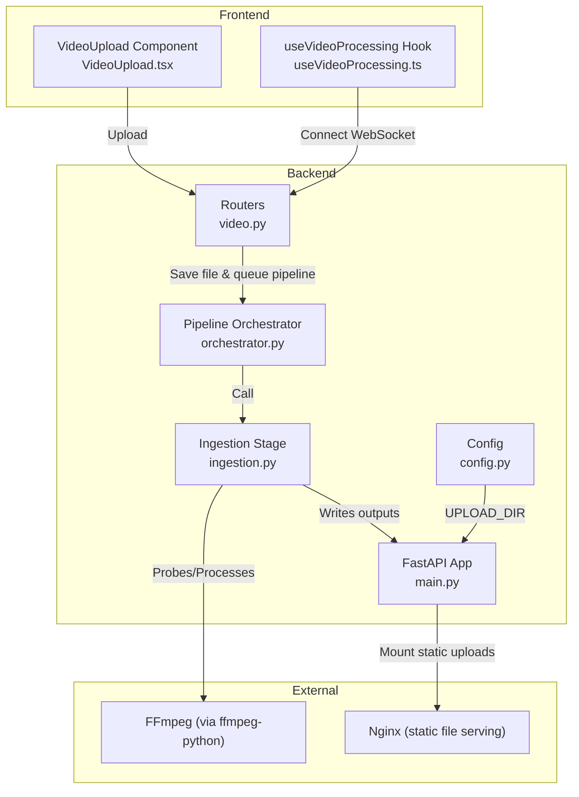
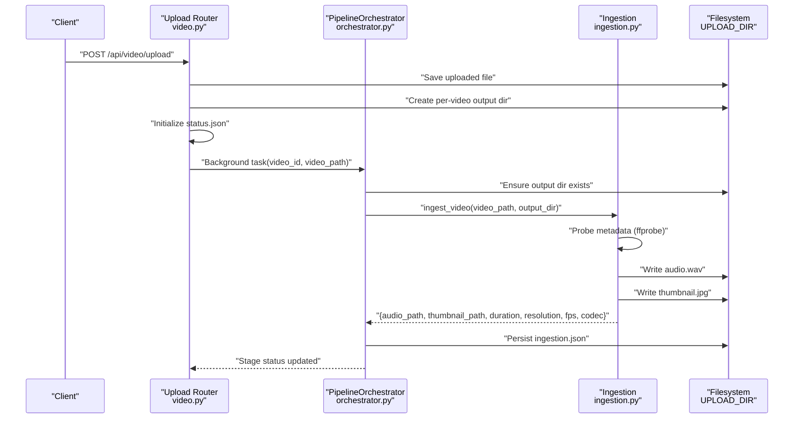
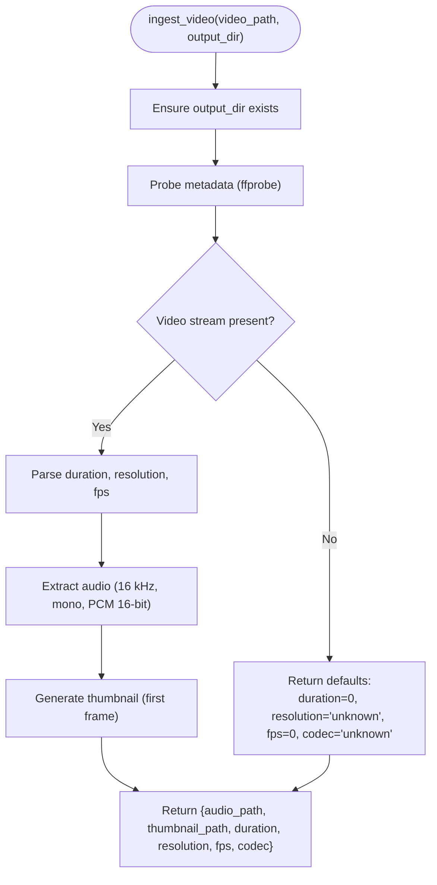
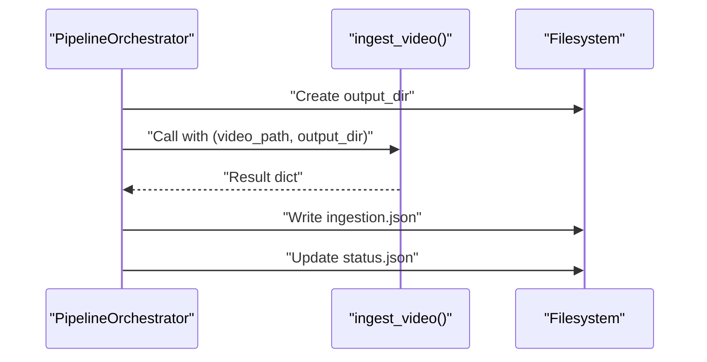
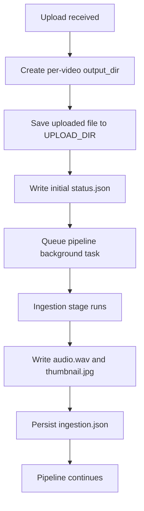
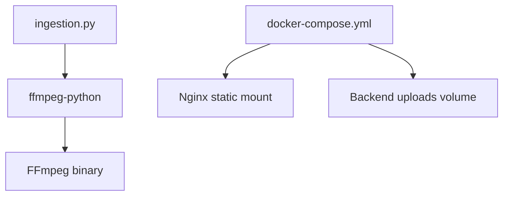

# Ingestion Stage

<cite>
**Referenced Files in This Document**
- [ingestion.py](file://backend/pipeline/ingestion.py)
- [orchestrator.py](file://backend/pipeline/orchestrator.py)
- [video.py](file://backend/routers/video.py)
- [config.py](file://backend/config.py)
- [main.py](file://backend/main.py)
- [requirements.txt](file://backend/requirements.txt)
- [docker-compose.yml](file://docker-compose.yml)
- [VideoUpload.tsx](file://frontend/src/components/archive/VideoUpload.tsx)
- [useVideoProcessing.ts](file://frontend/src/lib/useVideoProcessing.ts)
</cite>

## Table of Contents
1. [Introduction](#introduction)
2. [Project Structure](#project-structure)
3. [Core Components](#core-components)
4. [Architecture Overview](#architecture-overview)
5. [Detailed Component Analysis](#detailed-component-analysis)
6. [Dependency Analysis](#dependency-analysis)
7. [Performance Considerations](#performance-considerations)
8. [Troubleshooting Guide](#troubleshooting-guide)
9. [Conclusion](#conclusion)
10. [Appendices](#appendices)

## Introduction
This document explains the video ingestion stage that extracts audio, generates a thumbnail, and probes video metadata. It covers the ingestion function parameters, input validation, supported formats, temporary file management, directory structure, and integration with FFmpeg. It also documents performance considerations for large files and memory usage patterns during ingestion.

## Project Structure
The ingestion stage is part of a multi-stage pipeline orchestrated by a central orchestrator. The backend exposes an upload API that saves the video to disk, initializes a per-video working directory, and starts the pipeline asynchronously. The ingestion stage runs concurrently with other pipeline stages and writes outputs to the same directory.

**Diagram sources**
- [main.py:12-35](file://backend/main.py#L12-L35)
- [video.py:39-92](file://backend/routers/video.py#L39-L92)
- [orchestrator.py:44-94](file://backend/pipeline/orchestrator.py#L44-L94)
- [ingestion.py:16-51](file://backend/pipeline/ingestion.py#L16-L51)
- [config.py:11](file://backend/config.py#L11)

**Section sources**
- [main.py:12-35](file://backend/main.py#L12-L35)
- [video.py:39-92](file://backend/routers/video.py#L39-L92)
- [orchestrator.py:44-94](file://backend/pipeline/orchestrator.py#L44-L94)
- [ingestion.py:16-51](file://backend/pipeline/ingestion.py#L16-L51)
- [config.py:11](file://backend/config.py#L11)

## Core Components
- Ingestion function: Validates and prepares the output directory, probes metadata, extracts audio, and generates a thumbnail. Returns standardized metadata and file paths.
- Orchestrator: Coordinates pipeline stages, manages per-video output directories, and persists status and intermediate results.
- Upload router: Handles file upload, creates per-video directories, initializes status, and triggers the pipeline.
- Config: Provides the upload directory path used by the ingestion stage.
- Frontend: Client-side validation and upload flow for supported formats.

Key ingestion outputs:
- audio_path: Path to the extracted 16 kHz mono WAV audio.
- thumbnail_path: Path to the JPEG thumbnail from the first frame.
- duration: Video duration in seconds.
- resolution: Width x Height string.
- fps: Frames per second derived from stream r_frame_rate.
- codec: Video codec name.

**Section sources**
- [ingestion.py:16-51](file://backend/pipeline/ingestion.py#L16-L51)
- [ingestion.py:54-97](file://backend/pipeline/ingestion.py#L54-L97)
- [ingestion.py:100-121](file://backend/pipeline/ingestion.py#L100-L121)
- [ingestion.py:124-145](file://backend/pipeline/ingestion.py#L124-L145)
- [orchestrator.py:59-72](file://backend/pipeline/orchestrator.py#L59-L72)
- [video.py:62-82](file://backend/routers/video.py#L62-L82)
- [config.py:11](file://backend/config.py#L11)

## Architecture Overview
The ingestion stage is invoked by the orchestrator after initializing per-video directories. It uses ffmpeg-python to probe metadata and perform audio extraction/thumbnail generation. Outputs are written under the video’s output directory and persisted as JSON alongside other stage results.

**Diagram sources**
- [video.py:39-92](file://backend/routers/video.py#L39-L92)
- [orchestrator.py:84-94](file://backend/pipeline/orchestrator.py#L84-L94)
- [ingestion.py:16-51](file://backend/pipeline/ingestion.py#L16-L51)

## Detailed Component Analysis

### Ingestion Function
Responsibilities:
- Ensures output directory exists.
- Probes video metadata using ffprobe (duration, resolution, fps, codec).
- Extracts audio as 16 kHz mono WAV.
- Generates a JPEG thumbnail from the first frame.

Parameters:
- video_path: Absolute path to the input video file.
- output_dir: Directory where audio.wav and thumbnail.jpg are written.

Behavior highlights:
- Metadata probing handles missing streams and parsing errors gracefully, returning safe defaults.
- Audio extraction enforces PCM 16-bit, mono, 16 kHz.
- Thumbnail generation captures the first frame with a fixed frame count and quality setting.

**Diagram sources**
- [ingestion.py:16-51](file://backend/pipeline/ingestion.py#L16-L51)
- [ingestion.py:54-97](file://backend/pipeline/ingestion.py#L54-L97)
- [ingestion.py:100-121](file://backend/pipeline/ingestion.py#L100-L121)
- [ingestion.py:124-145](file://backend/pipeline/ingestion.py#L124-L145)

**Section sources**
- [ingestion.py:16-51](file://backend/pipeline/ingestion.py#L16-L51)
- [ingestion.py:54-97](file://backend/pipeline/ingestion.py#L54-L97)
- [ingestion.py:100-121](file://backend/pipeline/ingestion.py#L100-L121)
- [ingestion.py:124-145](file://backend/pipeline/ingestion.py#L124-L145)

### Orchestrator Integration
The orchestrator invokes ingestion and manages status and persistence:
- Creates and maintains per-video output directories.
- Initializes and updates status.json.
- Persists ingestion results to ingestion.json.
- Coordinates progress callbacks and WebSocket notifications.

**Diagram sources**
- [orchestrator.py:59-72](file://backend/pipeline/orchestrator.py#L59-L72)
- [orchestrator.py:84-94](file://backend/pipeline/orchestrator.py#L84-L94)
- [orchestrator.py:236-247](file://backend/pipeline/orchestrator.py#L236-L247)

**Section sources**
- [orchestrator.py:59-72](file://backend/pipeline/orchestrator.py#L59-L72)
- [orchestrator.py:84-94](file://backend/pipeline/orchestrator.py#L84-L94)
- [orchestrator.py:236-247](file://backend/pipeline/orchestrator.py#L236-L247)

### Upload and Temporary File Management
- The upload route saves the incoming file to the configured upload directory with a UUID-based filename.
- A per-video subdirectory is created for outputs and status.
- The pipeline writes audio.wav and thumbnail.jpg into this directory.
- Static file serving mounts the upload directory so downstream stages can reference URLs.

**Diagram sources**
- [video.py:48-82](file://backend/routers/video.py#L48-L82)
- [main.py:35](file://backend/main.py#L35)
- [config.py:11](file://backend/config.py#L11)

**Section sources**
- [video.py:48-82](file://backend/routers/video.py#L48-L82)
- [main.py:35](file://backend/main.py#L35)
- [config.py:11](file://backend/config.py#L11)

### Supported Formats and Validation
- Client-side acceptance includes MP4, MOV, AVI (MIME types and extensions).
- The ingestion stage relies on FFmpeg for probing and processing, which supports a broad range of codecs and containers. No explicit format checks are performed in the ingestion code itself; failures surface as FFmpeg exceptions.

**Section sources**
- [VideoUpload.tsx:23-24](file://frontend/src/components/archive/VideoUpload.tsx#L23-L24)
- [ingestion.py:54-97](file://backend/pipeline/ingestion.py#L54-L97)

## Dependency Analysis
- FFmpeg integration: The ingestion stage uses ffmpeg-python for probing and processing. The backend requires ffmpeg-python and FFmpeg binaries to be installed in the runtime environment.
- Static serving: Nginx serves the uploads directory, enabling downstream stages to reference the original video and outputs via HTTP URLs.
- Containerization: Docker Compose mounts the uploads volume and exposes ports for backend and frontend.

**Diagram sources**
- [requirements.txt:6](file://backend/requirements.txt#L6)
- [docker-compose.yml:30-39](file://docker-compose.yml#L30-L39)

**Section sources**
- [requirements.txt:6](file://backend/requirements.txt#L6)
- [docker-compose.yml:30-39](file://docker-compose.yml#L30-L39)

## Performance Considerations
- Large video files: The ingestion stage performs three operations—metadata probing, audio extraction, and thumbnail generation—each of which reads and processes the input file. For very large files, expect proportional CPU and I/O usage.
- Memory usage: ffmpeg-python executes external processes; memory consumption primarily reflects the decoding/transcoding workload rather than accumulating Python objects. Streaming reads/writes minimize buffering overhead.
- Concurrency: The orchestrator runs stages sequentially but uses thread pools to execute blocking FFmpeg operations off the event loop, reducing latency spikes.
- Recommendations:
  - Prefer modern, well-encoded containers/codecs supported broadly by FFmpeg.
  - Monitor disk throughput when ingesting many large files concurrently.
  - Consider pre-validating container compatibility at the gateway (client-side) to reduce failed ingestion retries.

[No sources needed since this section provides general guidance]

## Troubleshooting Guide
Common failure cases and resolutions:
- No video stream detected:
  - Symptom: Metadata probing returns defaults; ingestion proceeds but metadata is incomplete.
  - Action: Verify the file contains a video stream or re-encode with a proper video track.
- FFmpeg probe failure:
  - Symptom: ffprobe errors logged; ingestion returns defaults.
  - Action: Inspect stderr logs; ensure FFmpeg is installed and the file is not corrupted.
- Audio extraction failure:
  - Symptom: Audio extraction raises an FFmpeg error; ingestion re-raises.
  - Action: Confirm the input has an audio stream; verify codec compatibility.
- Thumbnail generation failure:
  - Symptom: Thumbnail generation raises an FFmpeg error; ingestion re-raises.
  - Action: Retry with a valid first-frame accessible input; check permissions on output_dir.
- Upload/save errors:
  - Symptom: 500 error on upload; server logs indicate save failure.
  - Action: Check disk space and permissions for the upload directory.

Operational tips:
- Use the status endpoint to inspect stage progress and errors.
- For WebSocket connectivity issues, fall back to polling the status endpoint.

**Section sources**
- [ingestion.py:92-97](file://backend/pipeline/ingestion.py#L92-L97)
- [ingestion.py:116-121](file://backend/pipeline/ingestion.py#L116-L121)
- [ingestion.py:140-145](file://backend/pipeline/ingestion.py#L140-L145)
- [video.py:57-59](file://backend/routers/video.py#L57-L59)
- [video.py:124-138](file://backend/routers/video.py#L124-L138)

## Conclusion
The ingestion stage provides a robust foundation for extracting audio, generating thumbnails, and probing essential video metadata. It integrates tightly with the orchestrator and FFmpeg, writing deterministic outputs to a per-video directory. By validating inputs early (client-side) and monitoring FFmpeg logs, most ingestion issues can be diagnosed quickly and resolved efficiently.

[No sources needed since this section summarizes without analyzing specific files]

## Appendices

### API and File Paths Reference
- Upload endpoint: POST /api/video/upload
- Status endpoint: GET /api/video/{video_id}/status
- Metadata endpoint: GET /api/video/{video_id}/metadata
- Transcripts endpoint: GET /api/video/{video_id}/transcript
- WebSocket: /ws/pipeline/{video_id}

Outputs produced by ingestion:
- audio.wav: 16 kHz, mono, PCM 16-bit
- thumbnail.jpg: First frame JPEG
- ingestion.json: Standardized metadata and file paths

**Section sources**
- [video.py:39-92](file://backend/routers/video.py#L39-L92)
- [video.py:124-138](file://backend/routers/video.py#L124-L138)
- [video.py:143-174](file://backend/routers/video.py#L143-L174)
- [video.py:179-195](file://backend/routers/video.py#L179-L195)
- [video.py:220-266](file://backend/routers/video.py#L220-L266)