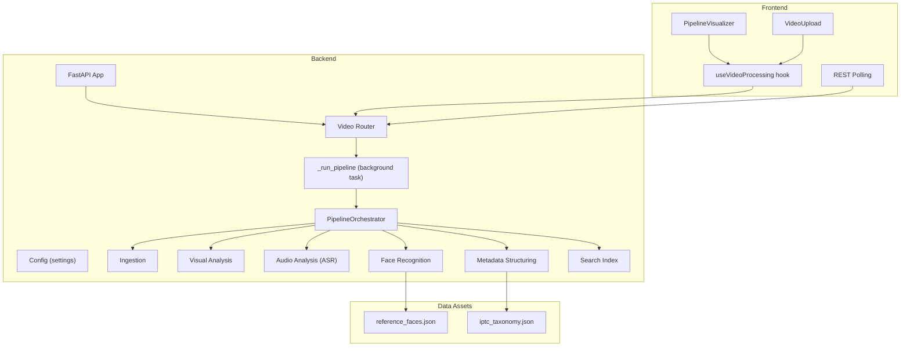
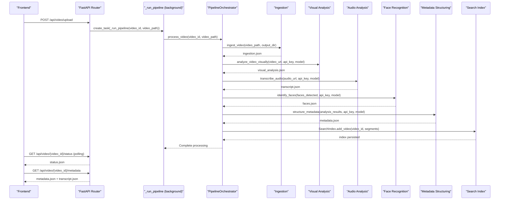
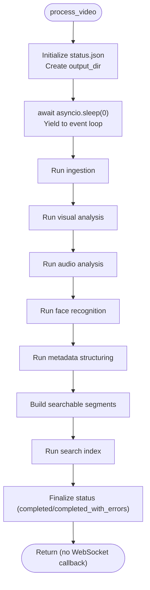
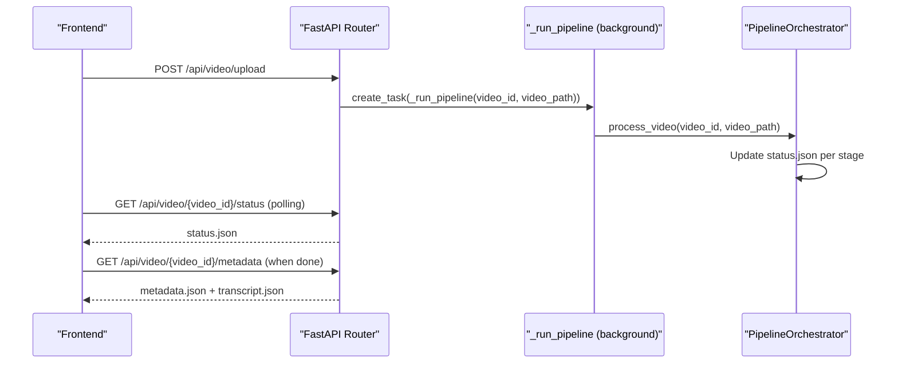
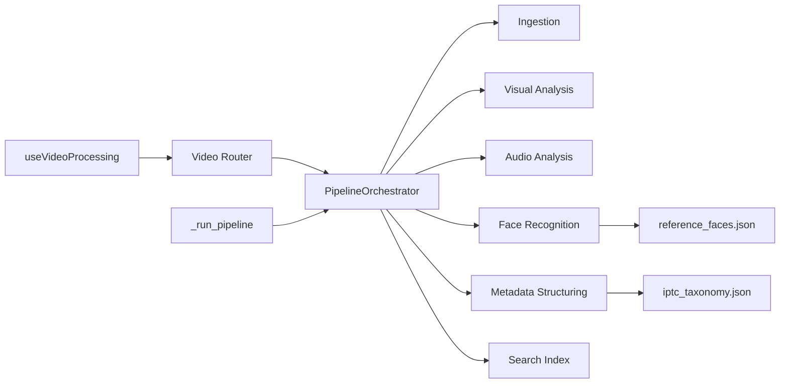

# Media Processing Pipeline

<cite>
**Referenced Files in This Document**
- [backend/pipeline/orchestrator.py](file://backend/pipeline/orchestrator.py)
- [backend/pipeline/ingestion.py](file://backend/pipeline/ingestion.py)
- [backend/pipeline/visual_analysis.py](file://backend/pipeline/visual_analysis.py)
- [backend/pipeline/audio_analysis.py](file://backend/pipeline/audio_analysis.py)
- [backend/pipeline/face_recognition.py](file://backend/pipeline/face_recognition.py)
- [backend/pipeline/metadata_structuring.py](file://backend/pipeline/metadata_structuring.py)
- [backend/pipeline/search_index.py](file://backend/pipeline/search_index.py)
- [backend/routers/video.py](file://backend/routers/video.py)
- [backend/config.py](file://backend/config.py)
- [backend/main.py](file://backend/main.py)
- [backend/data/reference_faces.json](file://backend/data/reference_faces.json)
- [backend/data/iptc_taxonomy.json](file://backend/data/iptc_taxonomy.json)
- [frontend/src/lib/useVideoProcessing.ts](file://frontend/src/lib/useVideoProcessing.ts)
- [frontend/src/components/archive/PipelineVisualizer.tsx](file://frontend/src/components/archive/PipelineVisualizer.tsx)
- [frontend/src/components/archive/VideoUpload.tsx](file://frontend/src/components/archive/VideoUpload.tsx)
</cite>

## Update Summary
**Changes Made**
- Updated Core Components section to reflect simplified background task approach
- Removed WebSocket callback mechanism documentation
- Updated Architecture Overview to show background task execution flow
- Revised Real-time Progress Tracking section to reflect polling-based approach
- Enhanced Troubleshooting Guide for polling-based status monitoring
- Updated Performance Considerations to reflect non-WebSocket implementation

## Table of Contents
1. [Introduction](#introduction)
2. [Project Structure](#project-structure)
3. [Core Components](#core-components)
4. [Architecture Overview](#architecture-overview)
5. [Detailed Component Analysis](#detailed-component-analysis)
6. [Dependency Analysis](#dependency-analysis)
7. [Performance Considerations](#performance-considerations)
8. [Troubleshooting Guide](#troubleshooting-guide)
9. [Conclusion](#conclusion)
10. [Appendices](#appendices)

## Introduction
This document explains the 6-stage AI-powered media processing pipeline designed for automated metadata extraction and indexing of video archives. It covers the orchestration layer, each processing stage, AI model integrations, and operational guidance for performance and reliability.

The pipeline transforms raw video into structured metadata, transcripts, face identifications, and a semantic search index, enabling efficient discovery and archival workflows. **The pipeline now uses a simplified background task approach** instead of WebSocket callbacks, maintaining system responsiveness while reducing complexity.

## Project Structure
The system is organized into:
- Backend: Orchestration, stage implementations, API routes, configuration, and data assets
- Frontend: Real-time UI for upload, progress visualization, and search

**Diagram sources**
- [backend/main.py:1-44](file://backend/main.py#L1-L44)
- [backend/routers/video.py:1-311](file://backend/routers/video.py#L1-L311)
- [backend/pipeline/orchestrator.py:1-382](file://backend/pipeline/orchestrator.py#L1-L382)
- [backend/pipeline/ingestion.py:1-146](file://backend/pipeline/ingestion.py#L1-L146)
- [backend/pipeline/visual_analysis.py:1-344](file://backend/pipeline/visual_analysis.py#L1-L344)
- [backend/pipeline/audio_analysis.py:1-277](file://backend/pipeline/audio_analysis.py#L1-L277)
- [backend/pipeline/face_recognition.py:1-319](file://backend/pipeline/face_recognition.py#L1-L319)
- [backend/pipeline/metadata_structuring.py:1-252](file://backend/pipeline/metadata_structuring.py#L1-L252)
- [backend/pipeline/search_index.py:1-306](file://backend/pipeline/search_index.py#L1-L306)
- [backend/data/reference_faces.json:1-101](file://backend/data/reference_faces.json#L1-L101)
- [backend/data/iptc_taxonomy.json:1-28](file://backend/data/iptc_taxonomy.json#L1-L28)
- [frontend/src/lib/useVideoProcessing.ts:1-533](file://frontend/src/lib/useVideoProcessing.ts#L1-L533)
- [frontend/src/components/archive/PipelineVisualizer.tsx:1-181](file://frontend/src/components/archive/PipelineVisualizer.tsx#L1-L181)
- [frontend/src/components/archive/VideoUpload.tsx:1-221](file://frontend/src/components/archive/VideoUpload.tsx#L1-L221)

**Section sources**
- [backend/main.py:1-44](file://backend/main.py#L1-L44)
- [backend/routers/video.py:1-311](file://backend/routers/video.py#L1-L311)

## Core Components
- PipelineOrchestrator: Manages sequential stages, progress tracking, status persistence, and background task execution.
- Stage modules: Ingestion, Visual Analysis, Audio Analysis, Face Recognition, Metadata Structuring, Search Index.
- Router: Upload, status, metadata, transcript, search, and WebSocket endpoints.
- Config: Centralized settings for API keys, models, and base URLs.
- Frontend hook and components: Real-time progress, upload UX, and visualization.

Key orchestration responsibilities:
- Sequential stage execution with cooperative yielding for server responsiveness
- Persistent status and intermediate results
- Background task execution without WebSocket callbacks
- Building searchable segments for embedding

**Updated** The pipeline now uses a simplified background task approach where the orchestrator runs sequentially without WebSocket callbacks. The `_run_pipeline` function creates a background task that processes videos asynchronously, eliminating the complexity of WebSocket connections while maintaining system responsiveness.

**Section sources**
- [backend/pipeline/orchestrator.py:44-382](file://backend/pipeline/orchestrator.py#L44-L382)
- [backend/routers/video.py:95-101](file://backend/routers/video.py#L95-L101)
- [backend/config.py:4-30](file://backend/config.py#L4-L30)

## Architecture Overview
The pipeline is a server-side orchestration backed by external AI APIs and local file storage. The frontend connects via REST endpoints to observe progress and retrieve results. **The simplified background task approach** eliminates WebSocket complexity while maintaining real-time status updates through REST polling.

**Diagram sources**
- [backend/routers/video.py:40-92](file://backend/routers/video.py#L40-L92)
- [backend/routers/video.py:95-101](file://backend/routers/video.py#L95-L101)
- [backend/pipeline/orchestrator.py:44-209](file://backend/pipeline/orchestrator.py#L44-L209)
- [backend/pipeline/ingestion.py:16-51](file://backend/pipeline/ingestion.py#L16-L51)
- [backend/pipeline/visual_analysis.py:57-188](file://backend/pipeline/visual_analysis.py#L57-L188)
- [backend/pipeline/audio_analysis.py:33-113](file://backend/pipeline/audio_analysis.py#L33-L113)
- [backend/pipeline/face_recognition.py:124-188](file://backend/pipeline/face_recognition.py#L124-L188)
- [backend/pipeline/metadata_structuring.py:81-163](file://backend/pipeline/metadata_structuring.py#L81-L163)
- [backend/pipeline/search_index.py:143-212](file://backend/pipeline/search_index.py#L143-L212)

## Detailed Component Analysis

### PipelineOrchestrator
Responsibilities:
- Sequentially executes six stages with cooperative yielding for server responsiveness
- Tracks progress and status per stage
- Persists status.json and intermediate results
- **Eliminates WebSocket callback mechanism** in favor of background task execution
- Builds searchable segments for embedding

**Updated** The orchestrator now operates without WebSocket callbacks. The `process_video` method accepts an optional `ws_callback` parameter but ignores it, focusing solely on sequential stage execution and status persistence. This simplification maintains system responsiveness while reducing implementation complexity.

Inputs:
- video_id, video_path
- Optional ws_callback parameter (ignored in current implementation)

Outputs:
- status.json, results.json
- Per-stage artifacts under output_dir

Error handling:
- Catches exceptions per stage, records error in status.errors, and continues or completes depending on stage outcome

Progress calculation:
- Stage progress mapped linearly across 6 stages

**Diagram sources**
- [backend/pipeline/orchestrator.py:44-209](file://backend/pipeline/orchestrator.py#L44-L209)

**Section sources**
- [backend/pipeline/orchestrator.py:34-382](file://backend/pipeline/orchestrator.py#L34-L382)

### Stage 1: Ingestion
Purpose:
- Extract audio (16 kHz mono WAV), generate thumbnail, and probe metadata (duration, resolution, FPS, codec)

Inputs:
- video_path, output_dir

Outputs:
- ingestion.json with audio_path, thumbnail_path, duration, resolution, fps, codec

Error handling:
- Graceful fallback to unknown values on probe failure
- ffmpeg errors logged and re-raised to trigger stage failure

**Section sources**
- [backend/pipeline/ingestion.py:16-146](file://backend/pipeline/ingestion.py#L16-L146)

### Stage 2: Visual Analysis (Qwen-VL)
Purpose:
- Comprehensive visual understanding: scenes, objects, landmarks, faces, OCR, sensitive content, era estimation

Inputs:
- video_path, api_key, model, base_url

Outputs:
- visual_analysis.json with scenes, objects, landmarks, faces, OCR, sensitive content, era_estimate, summaries

AI integration:
- DashScope chat/completions with video_path payload and fps sampling

Error handling:
- Retries with exponential backoff
- Parses JSON from raw response (direct or fenced code block)
- Returns empty structured result on repeated failure

**Section sources**
- [backend/pipeline/visual_analysis.py:57-344](file://backend/pipeline/visual_analysis.py#L57-L344)

### Stage 3: Audio Analysis (ASR) - Paraformer-v2
Purpose:
- Speech-to-text with speaker diarization and language hints

Inputs:
- audio_path, api_key, model

Outputs:
- transcript.json with segments, full_text, speaker_count, language

Workflow:
- Split audio into chunks, transcribe each chunk via qwen-omni-turbo
- Combine segments into final transcript

Error handling:
- Chunk-based processing with individual retry logic
- Returns empty structured result on failure

**Section sources**
- [backend/pipeline/audio_analysis.py:33-277](file://backend/pipeline/audio_analysis.py#L33-L277)

### Stage 4: Face Recognition
Purpose:
- Match detected faces to a reference database using Qwen text model

Inputs:
- faces_detected (from visual analysis), api_key, model, base_url

Outputs:
- faces.json enriched with identification info (name_en, name_ar, role, confidence)

Data:
- Reference database loaded from reference_faces.json

Error handling:
- Loads reference faces and prompts model per face
- Conservative matching with retries and fallback to unidentified

**Section sources**
- [backend/pipeline/face_recognition.py:124-319](file://backend/pipeline/face_recognition.py#L124-L319)
- [backend/data/reference_faces.json:1-101](file://backend/data/reference_faces.json#L1-L101)

### Stage 5: Metadata Structuring (EBUCore/IPTC)
Purpose:
- Generate broadcast-ready metadata and IPTC topic codes

Inputs:
- analysis_results (aggregated), api_key, model, base_url

Outputs:
- metadata.json with EBUCore XML snippet, IPTC metadata, topic codes, sentiment, geographic tags, persons mentioned

Data:
- IPTC taxonomy loaded from iptc_taxonomy.json

Error handling:
- Compacts analysis to avoid token limits
- Retries with backoff and returns empty structured result on failure

**Section sources**
- [backend/pipeline/metadata_structuring.py:81-252](file://backend/pipeline/metadata_structuring.py#L81-L252)
- [backend/data/iptc_taxonomy.json:1-28](file://backend/data/iptc_taxonomy.json#L1-L28)

### Stage 6: Search Index (FAISS + Embeddings)
Purpose:
- Build a vector search index from scenes and transcript segments

Inputs:
- video_id, segments (built from visual_analysis scenes and transcript)

Outputs:
- Persisted FAISS index and metadata

AI integration:
- DashScope embeddings API for text-embedding-v3

Error handling:
- Batched embedding requests with backoff
- Saves index to disk; gracefully handles missing FAISS installation

**Section sources**
- [backend/pipeline/search_index.py:59-306](file://backend/pipeline/search_index.py#L59-L306)

### Real-time Progress Tracking and Status Reporting
**Updated** The pipeline now uses a polling-based approach instead of WebSocket callbacks. The frontend connects via REST endpoints to observe progress and retrieve results.

- Router exposes REST endpoints for status polling
- Background task `_run_pipeline` executes the full pipeline asynchronously
- Frontend hook polls `/api/video/{video_id}/status` every 3 seconds
- REST fallback polling replaces WebSocket progress updates
- Results are fetched via separate endpoints when processing completes

**Diagram sources**
- [backend/routers/video.py:40-92](file://backend/routers/video.py#L40-L92)
- [backend/routers/video.py:95-101](file://backend/routers/video.py#L95-L101)
- [backend/routers/video.py:105-121](file://backend/routers/video.py#L105-L121)
- [backend/pipeline/orchestrator.py:44-209](file://backend/pipeline/orchestrator.py#L44-L209)
- [frontend/src/lib/useVideoProcessing.ts:399-443](file://frontend/src/lib/useVideoProcessing.ts#L399-L443)

**Section sources**
- [backend/routers/video.py:95-121](file://backend/routers/video.py#L95-L121)
- [frontend/src/lib/useVideoProcessing.ts:399-443](file://frontend/src/lib/useVideoProcessing.ts#L399-L443)
- [frontend/src/components/archive/PipelineVisualizer.tsx:88-181](file://frontend/src/components/archive/PipelineVisualizer.tsx#L88-L181)

## Dependency Analysis
- Orchestration depends on stage modules and SearchIndex
- Stages depend on external AI APIs and local data assets
- Router depends on Orchestrator and SearchIndex
- Frontend depends on Router and REST polling

**Diagram sources**
- [backend/pipeline/orchestrator.py:14-42](file://backend/pipeline/orchestrator.py#L14-L42)
- [backend/pipeline/face_recognition.py:21-32](file://backend/pipeline/face_recognition.py#L21-L32)
- [backend/pipeline/metadata_structuring.py:22-32](file://backend/pipeline/metadata_structuring.py#L22-L32)
- [backend/routers/video.py:17-26](file://backend/routers/video.py#L17-L26)
- [frontend/src/lib/useVideoProcessing.ts:1-10](file://frontend/src/lib/useVideoProcessing.ts#L1-L10)

**Section sources**
- [backend/pipeline/orchestrator.py:14-42](file://backend/pipeline/orchestrator.py#L14-L42)
- [backend/routers/video.py:17-26](file://backend/routers/video.py#L17-L26)

## Performance Considerations
- Stage durations:
  - Ingestion: O(1) with respect to video length; dominated by I/O
  - Visual Analysis: Heavily dependent on video length and fps sampling; expect linear increase with duration
  - Audio Analysis: Primarily network-bound; duration affects chunk processing overhead
  - Face Recognition: Proportional to number of faces; conservative matching reduces false positives
  - Metadata Structuring: Prompt size controlled by compaction; mostly API latency
  - Search Index: Linear in segment count; embedding batch size capped at 6
- Memory usage:
  - Transcripts and metadata stored per stage; FAISS index grows with segment count
  - Embeddings normalized to unit vectors; index persists to disk
- Scalability:
  - Parallelize independent videos; current orchestration is sequential per video
  - Consider batching embedding calls and increasing batch size cautiously
  - Ensure adequate disk space for FAISS index and intermediate artifacts
- Network:
  - External APIs introduce latency and rate limits; implement retries and backoff
  - Mount uploads via static files for reliable video/audio access
- **Server Responsiveness**:
  - **Cooperative yielding**: The orchestrator uses `await asyncio.sleep(0)` to yield control back to the event loop, preventing long-running stages from blocking other requests
  - **Event loop fairness**: This ensures the server can handle incoming requests, background tasks, and file operations even during extended processing operations
  - **Background task execution**: Simplified approach eliminates WebSocket complexity while maintaining responsiveness
  - **Non-blocking operations**: All stage functions are async and use cooperative yielding points

**Updated** The simplified background task approach enhances server responsiveness by eliminating WebSocket callback complexity. The cooperative yielding mechanism ensures that long-running operations don't block the event loop, enabling multiple videos to be processed simultaneously without impacting system performance.

[No sources needed since this section provides general guidance]

## Troubleshooting Guide
Common issues and recovery strategies:
- Missing API key:
  - Symptom: Stages return empty results with error markers
  - Action: Set DASHSCOPE_API_KEY and restart service
- ffprobe/ffmpeg failures during ingestion:
  - Symptom: Unknown metadata and thumbnail generation errors
  - Action: Verify media container and codecs; ensure ffmpeg is installed and accessible
- Visual Analysis API errors:
  - Symptom: Stage fails with API or request errors
  - Action: Retry; check base URL and model availability; reduce video length or fps sampling
- ASR task timeouts or failures:
  - Symptom: Task does not complete within max attempts
  - Action: Verify audio accessibility; ensure WAV format and URL reachability
- Face Recognition parsing failures:
  - Symptom: No matches despite clear descriptions
  - Action: Confirm reference_faces.json validity; adjust prompt temperature conservatively
- Metadata structuring parse errors:
  - Symptom: Empty metadata or parse warnings
  - Action: Reduce analysis compaction; shorten prompts; verify IPTC taxonomy
- Search index unavailable:
  - Symptom: FAISS not installed or index load failures
  - Action: Install faiss-cpu; ensure permissions for index_dir; rebuild index
- **Background task failures**:
  - Symptom: Videos appear stuck in queued status
  - Action: Check server logs for `_run_pipeline` errors; verify upload directory permissions
- **Polling-based status monitoring**:
  - Symptom: UI shows "Processing" indefinitely
  - Action: Verify REST status endpoint accessibility; check network connectivity; ensure proper CORS configuration
- **Server responsiveness issues**:
  - Symptom: Slow response to new upload requests during long processing
  - Action: The cooperative yielding mechanism automatically addresses this; monitor event loop utilization
- **Concurrent processing conflicts**:
  - Symptom: Multiple videos causing resource contention
  - Action: Monitor system resources; consider rate limiting; ensure adequate CPU and memory allocation

**Updated** Added troubleshooting guidance for the simplified background task approach, including background task failures and polling-based status monitoring. The WebSocket callback mechanism has been removed, so troubleshooting now focuses on REST polling and background task execution.

**Section sources**
- [backend/pipeline/visual_analysis.py:135-188](file://backend/pipeline/visual_analysis.py#L135-L188)
- [backend/pipeline/audio_analysis.py:228-265](file://backend/pipeline/audio_analysis.py#L228-L265)
- [backend/pipeline/face_recognition.py:241-299](file://backend/pipeline/face_recognition.py#L241-L299)
- [backend/pipeline/metadata_structuring.py:125-163](file://backend/pipeline/metadata_structuring.py#L125-L163)
- [backend/pipeline/search_index.py:259-305](file://backend/pipeline/search_index.py#L259-L305)
- [backend/routers/video.py:95-101](file://backend/routers/video.py#L95-L101)

## Conclusion
The pipeline provides a robust, modular, and observable framework for AI-driven media processing. Its sequential orchestration, persistent state, and REST-based status polling enable reliable archival workflows. **The simplified background task approach** eliminates WebSocket complexity while maintaining system responsiveness for all endpoints. The cooperative yielding mechanism ensures that long-running operations don't block the event loop, enabling multiple videos to be processed simultaneously without impacting system performance. By tuning stage parameters, ensuring adequate infrastructure, and leveraging retries and fallbacks, operators can achieve scalable and resilient media processing in production environments.

**Updated** The pipeline now includes enhanced server responsiveness through cooperative yielding and simplified background task execution. The removal of WebSocket callback mechanism makes the system more maintainable while preserving all essential functionality for real-time status monitoring through REST polling.

[No sources needed since this section summarizes without analyzing specific files]

## Appendices

### API Endpoints Overview
- POST /api/video/upload: Upload video and enqueue processing via background task
- GET /api/video/{video_id}/status: Retrieve current pipeline status (REST polling)
- GET /api/video/{video_id}/metadata: Retrieve structured metadata
- GET /api/video/{video_id}/transcript: Retrieve speech transcript
- POST /api/search: Semantic search across indexed videos
- **Removed**: WebSocket /ws/pipeline/{video_id}: Real-time progress updates (no longer available)

**Section sources**
- [backend/routers/video.py:40-216](file://backend/routers/video.py#L40-L216)

### Example Workflows and Expected Times
- Short clip (< 2 minutes):
  - Ingestion: ~2–5s
  - Visual Analysis: ~30–60s
  - Audio Analysis: ~1–2min
  - Face Recognition: ~10–30s
  - Metadata Structuring: ~30–60s
  - Search Index: ~10–30s
  - Total: ~2–5min
- Medium clip (5–10 minutes):
  - Visual Analysis scales roughly linearly with duration
  - Expect ~5–15min total depending on API latency
- Large clip (> 30 minutes):
  - Consider chunking or reducing fps sampling
  - Total time can exceed 30min depending on stage throughput

**Updated** Server responsiveness improvements ensure consistent performance even with extended processing times for large video files. The simplified background task approach allows multiple videos to be processed concurrently without impacting system responsiveness.

[No sources needed since this section provides general guidance]