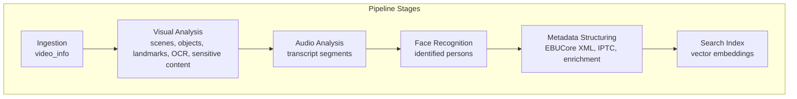
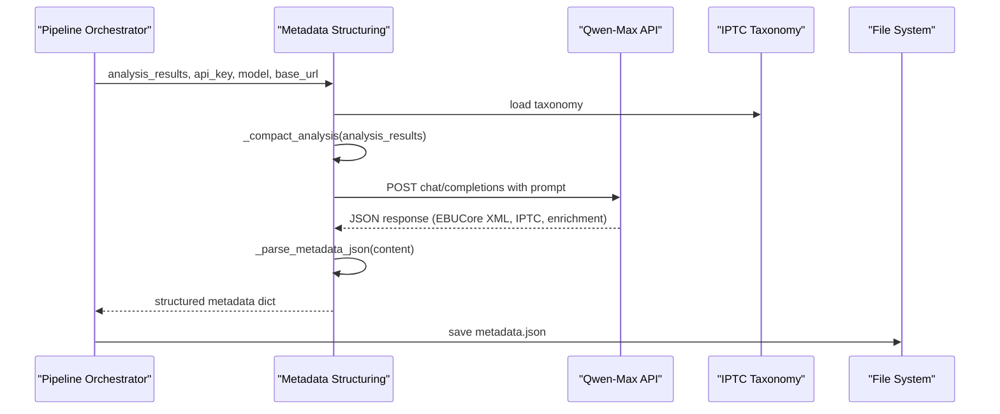
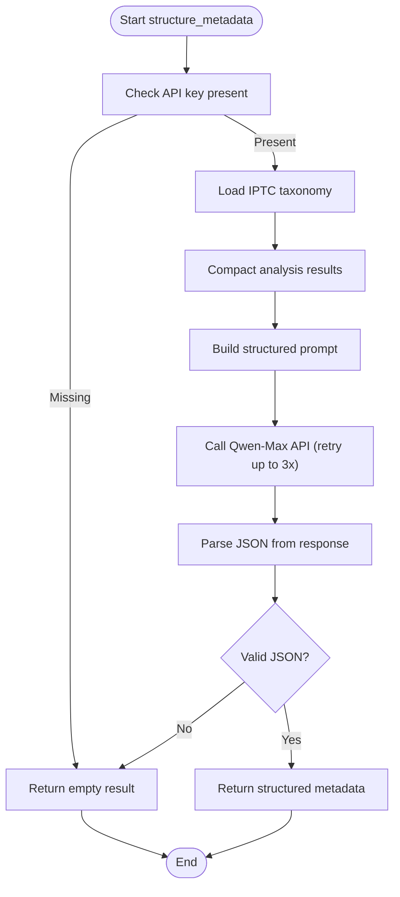
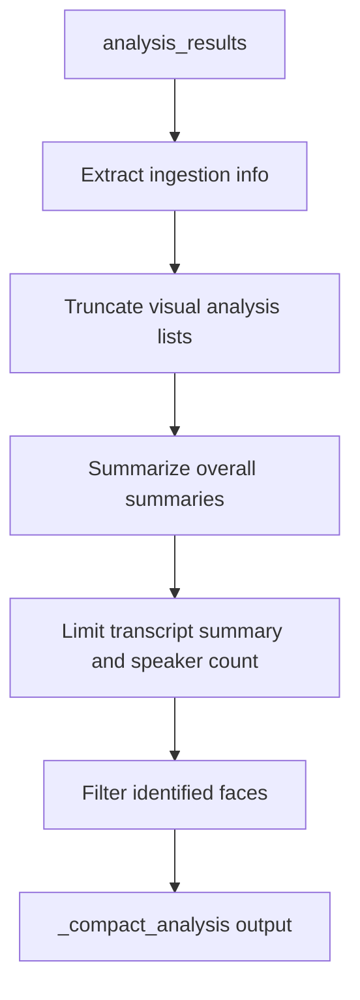
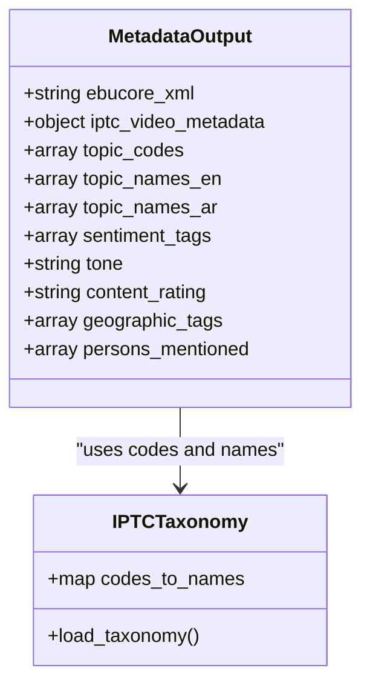
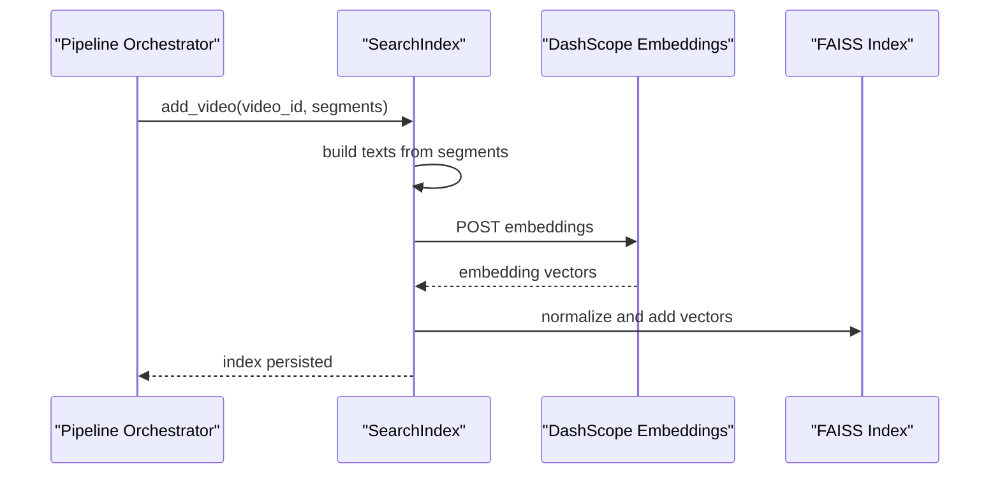
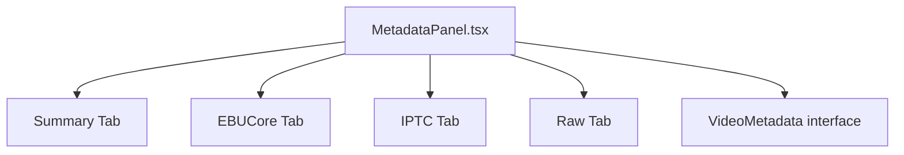
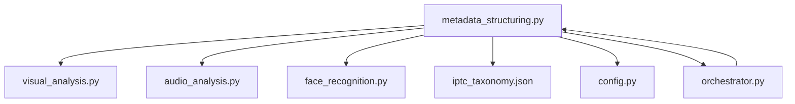

# Metadata Structuring Stage

<cite>
**Referenced Files in This Document**
- [metadata_structuring.py](file://backend/pipeline/metadata_structuring.py)
- [iptc_taxonomy.json](file://backend/data/iptc_taxonomy.json)
- [orchestrator.py](file://backend/pipeline/orchestrator.py)
- [config.py](file://backend/config.py)
- [visual_analysis.py](file://backend/pipeline/visual_analysis.py)
- [audio_analysis.py](file://backend/pipeline/audio_analysis.py)
- [face_recognition.py](file://backend/pipeline/face_recognition.py)
- [search_index.py](file://backend/pipeline/search_index.py)
- [MetadataPanel.tsx](file://frontend/src/components/archive/MetadataPanel.tsx)
- [useVideoProcessing.ts](file://frontend/src/lib/useVideoProcessing.ts)
- [video.py](file://backend/routers/video.py)
</cite>

## Table of Contents
1. [Introduction](#introduction)
2. [Project Structure](#project-structure)
3. [Core Components](#core-components)
4. [Architecture Overview](#architecture-overview)
5. [Detailed Component Analysis](#detailed-component-analysis)
6. [Dependency Analysis](#dependency-analysis)
7. [Performance Considerations](#performance-considerations)
8. [Troubleshooting Guide](#troubleshooting-guide)
9. [Conclusion](#conclusion)
10. [Appendices](#appendices)

## Introduction
This document explains the metadata structuring stage that transforms individual analysis results into unified, standardized metadata for broadcast and archival systems. It covers the AI-powered content summarization, categorization, and enrichment processes, the integration with the IPTC taxonomy, and the role of the Qwen model in metadata generation. It also documents the relationship between structured metadata and search functionality, along with data validation, consistency checks, and error handling strategies.

## Project Structure
The metadata structuring stage is part of a six-stage pipeline orchestrated by the Pipeline Orchestrator. The stage consumes outputs from ingestion, visual analysis, audio analysis, and face recognition, then generates structured metadata aligned with EBUCore XML and IPTC Video Metadata Hub standards.

**Diagram sources**
- [orchestrator.py:44-206](file://backend/pipeline/orchestrator.py#L44-L206)
- [visual_analysis.py:43-130](file://backend/pipeline/visual_analysis.py#L43-L130)
- [audio_analysis.py:22-59](file://backend/pipeline/audio_analysis.py#L22-L59)
- [face_recognition.py:54-107](file://backend/pipeline/face_recognition.py#L54-L107)
- [metadata_structuring.py:81-163](file://backend/pipeline/metadata_structuring.py#L81-L163)
- [search_index.py:88-154](file://backend/pipeline/search_index.py#L88-L154)

**Section sources**
- [orchestrator.py:24-31](file://backend/pipeline/orchestrator.py#L24-L31)
- [config.py:4-20](file://backend/config.py#L4-L20)

## Core Components
- Metadata Structuring Stage: Generates structured broadcast metadata using Qwen-Max, integrating IPTC taxonomy and enriched analysis results.
- IPTC Taxonomy: Reference dataset of topic codes and names for content categorization.
- Pipeline Orchestrator: Coordinates stage execution, progress tracking, and result aggregation.
- Frontend Metadata Panel: Displays structured metadata in multiple formats (summary, EBUCore XML, IPTC JSON, raw JSON).

Key responsibilities:
- Consolidate heterogeneous analysis outputs into a unified metadata schema.
- Enforce bilingual metadata (English and Arabic) for headline, descriptions, keywords, and topic names.
- Generate EBUCore XML compliant with EBU Tech 3293.
- Integrate IPTC topic codes and names for standardized categorization.
- Extract sentiment tags, tone, content rating, geographic tags, and persons mentioned.

**Section sources**
- [metadata_structuring.py:35-78](file://backend/pipeline/metadata_structuring.py#L35-L78)
- [iptc_taxonomy.json:1-27](file://backend/data/iptc_taxonomy.json#L1-L27)
- [orchestrator.py:150-166](file://backend/pipeline/orchestrator.py#L150-L166)

## Architecture Overview
The metadata structuring stage receives a consolidated analysis_results dictionary containing ingestion metadata, visual analysis, transcript, and face recognition outputs. It prepares a compact representation, loads the IPTC taxonomy, constructs a structured prompt, and calls the Qwen-Max model to produce a standardized JSON response. The response is parsed and validated, returning a well-formed metadata object.

**Diagram sources**
- [metadata_structuring.py:81-163](file://backend/pipeline/metadata_structuring.py#L81-L163)
- [iptc_taxonomy.json:1-27](file://backend/data/iptc_taxonomy.json#L1-L27)
- [orchestrator.py:159-165](file://backend/pipeline/orchestrator.py#L159-L165)

## Detailed Component Analysis

### Metadata Structuring Implementation
The stage performs:
- Compact analysis preparation to avoid token overflow.
- IPTC taxonomy loading for topic classification.
- Prompt construction with analysis data and taxonomy.
- Qwen-Max API invocation with retry/backoff logic.
- Robust JSON parsing with multiple extraction strategies.
- Graceful fallback to empty result on failure.

**Diagram sources**
- [metadata_structuring.py:81-251](file://backend/pipeline/metadata_structuring.py#L81-L251)

**Section sources**
- [metadata_structuring.py:81-163](file://backend/pipeline/metadata_structuring.py#L81-L163)
- [metadata_structuring.py:166-208](file://backend/pipeline/metadata_structuring.py#L166-L208)
- [metadata_structuring.py:211-234](file://backend/pipeline/metadata_structuring.py#L211-L234)
- [metadata_structuring.py:237-251](file://backend/pipeline/metadata_structuring.py#L237-L251)

### Data Transformation Process
The transformation pipeline:
- Extracts ingestion metadata (duration, resolution, fps, codec).
- Truncates visual analysis outputs to prevent token limits (scenes, objects, landmarks, OCR, sensitive content).
- Summarizes visual analysis overall summaries (English and Arabic).
- Limits transcript segments and speaker counts.
- Filters identified faces and includes name, role, and timestamp.
- Constructs a compact dictionary passed to the LLM.

**Diagram sources**
- [metadata_structuring.py:166-208](file://backend/pipeline/metadata_structuring.py#L166-L208)

**Section sources**
- [metadata_structuring.py:166-208](file://backend/pipeline/metadata_structuring.py#L166-L208)

### AI-Powered Content Summarization, Categorization, and Enrichment
- Summarization: Uses visual analysis overall summaries for concise English and Arabic descriptions.
- Categorization: Leverages IPTC taxonomy codes and names for standardized topic classification.
- Enrichment: Adds sentiment tags, tone, content rating, geographic tags, and persons mentioned with roles.

**Diagram sources**
- [metadata_structuring.py:44-78](file://backend/pipeline/metadata_structuring.py#L44-L78)
- [iptc_taxonomy.json:1-27](file://backend/data/iptc_taxonomy.json#L1-L27)

**Section sources**
- [metadata_structuring.py:35-78](file://backend/pipeline/metadata_structuring.py#L35-L78)
- [iptc_taxonomy.json:1-27](file://backend/data/iptc_taxonomy.json#L1-L27)

### Integration with IPTC Taxonomy
- The taxonomy provides standardized topic codes and bilingual names.
- The model is instructed to select topic codes from the provided taxonomy list.
- Topic names are returned in both English and Arabic.

**Section sources**
- [metadata_structuring.py:41-42](file://backend/pipeline/metadata_structuring.py#L41-L42)
- [iptc_taxonomy.json:1-27](file://backend/data/iptc_taxonomy.json#L1-L27)

### Role of Qwen Model in Metadata Generation
- Model: Qwen-Max (text model) is used for metadata structuring.
- Endpoint: Compatible mode chat/completions endpoint.
- Temperature: Low (0.2) to encourage deterministic, structured outputs.
- Retry/backoff: Up to three attempts with exponential backoff.

**Section sources**
- [metadata_structuring.py:84-85](file://backend/pipeline/metadata_structuring.py#L84-L85)
- [metadata_structuring.py:114-123](file://backend/pipeline/metadata_structuring.py#L114-L123)
- [metadata_structuring.py:125-161](file://backend/pipeline/metadata_structuring.py#L125-L161)
- [config.py](file://backend/config.py#L9)

### Relationship Between Structured Metadata and Search Functionality
- Search index builds a FAISS vector index using DashScope text embeddings.
- Searchable segments combine scene descriptions, transcript segments, and identified persons.
- The index enables natural language search across all processed videos.

**Diagram sources**
- [orchestrator.py:283-314](file://backend/pipeline/orchestrator.py#L283-L314)
- [search_index.py:88-154](file://backend/pipeline/search_index.py#L88-L154)
- [search_index.py:198-244](file://backend/pipeline/search_index.py#L198-L244)

**Section sources**
- [orchestrator.py:168-182](file://backend/pipeline/orchestrator.py#L168-L182)
- [search_index.py:88-154](file://backend/pipeline/search_index.py#L88-L154)

### Frontend Metadata Display and Usage Patterns
- The frontend displays metadata in multiple tabs: Summary, EBUCore XML, IPTC JSON, and Raw JSON.
- Users can copy or download EBUCore XML.
- The TypeScript interface defines the shape of metadata consumed by the frontend.

**Diagram sources**
- [MetadataPanel.tsx:304-376](file://frontend/src/components/archive/MetadataPanel.tsx#L304-L376)
- [useVideoProcessing.ts:59-75](file://frontend/src/lib/useVideoProcessing.ts#L59-L75)

**Section sources**
- [MetadataPanel.tsx:146-250](file://frontend/src/components/archive/MetadataPanel.tsx#L146-L250)
- [MetadataPanel.tsx:254-267](file://frontend/src/components/archive/MetadataPanel.tsx#L254-L267)
- [MetadataPanel.tsx:272-283](file://frontend/src/components/archive/MetadataPanel.tsx#L272-L283)
- [MetadataPanel.tsx:288-299](file://frontend/src/components/archive/MetadataPanel.tsx#L288-L299)
- [useVideoProcessing.ts:59-75](file://frontend/src/lib/useVideoProcessing.ts#L59-L75)

## Dependency Analysis
The metadata structuring stage depends on:
- Analysis outputs from previous stages (ingestion, visual analysis, audio analysis, face recognition).
- IPTC taxonomy for topic classification.
- Qwen API for structured metadata generation.
- File system for saving and retrieving intermediate results.

**Diagram sources**
- [metadata_structuring.py:103-112](file://backend/pipeline/metadata_structuring.py#L103-L112)
- [visual_analysis.py:43-130](file://backend/pipeline/visual_analysis.py#L43-L130)
- [audio_analysis.py:22-59](file://backend/pipeline/audio_analysis.py#L22-L59)
- [face_recognition.py:54-107](file://backend/pipeline/face_recognition.py#L54-L107)
- [iptc_taxonomy.json:1-27](file://backend/data/iptc_taxonomy.json#L1-L27)
- [config.py:4-20](file://backend/config.py#L4-L20)
- [orchestrator.py:159-165](file://backend/pipeline/orchestrator.py#L159-L165)

**Section sources**
- [metadata_structuring.py:103-112](file://backend/pipeline/metadata_structuring.py#L103-L112)
- [orchestrator.py:150-166](file://backend/pipeline/orchestrator.py#L150-L166)

## Performance Considerations
- Token limits: The compact analysis truncates lists to prevent exceeding model context windows.
- Retry/backoff: API calls retry up to three times with exponential backoff to handle transient failures.
- Timeout tuning: Async HTTP client timeouts are configured for robustness across network conditions.
- Batch embeddings: Search index uses batching for embedding generation to optimize throughput.

[No sources needed since this section provides general guidance]

## Troubleshooting Guide
Common issues and resolutions:
- Missing API key: The stage returns an empty result with an error message and logs a warning.
- API errors: HTTP status errors and request errors are logged with attempt numbers; the stage falls back to an empty result after retries.
- JSON parsing failures: Multiple strategies attempt to extract JSON from the model response; if all fail, an empty result is returned with a parse error message.
- IPTC taxonomy loading: File not found or invalid JSON results in an empty taxonomy and warnings.

**Section sources**
- [metadata_structuring.py:99-101](file://backend/pipeline/metadata_structuring.py#L99-L101)
- [metadata_structuring.py:139-161](file://backend/pipeline/metadata_structuring.py#L139-L161)
- [metadata_structuring.py:213-234](file://backend/pipeline/metadata_structuring.py#L213-L234)
- [metadata_structuring.py:22-32](file://backend/pipeline/metadata_structuring.py#L22-L32)

## Conclusion
The metadata structuring stage consolidates diverse analysis outputs into standardized, AI-generated metadata aligned with broadcast and archival standards. It leverages the Qwen model to produce bilingual EBUCore XML and IPTC-compliant metadata, enriches content with sentiment, tone, ratings, topics, and persons, and ensures robust error handling and validation. The resulting metadata powers downstream search capabilities and provides a comprehensive foundation for media discovery and curation.

## Appendices

### Metadata Schema and Field Definitions
The structured metadata produced by the stage includes:
- ebucore_xml: EBUCore XML snippet conforming to EBU Tech 3293.
- iptc_video_metadata: IPTC Video Metadata Hub structure with:
  - videoContent: headline, description_en, description_ar, dateCreated, creator, keywords_en, keywords_ar, language, genre, duration.
  - videoRights: rightsOwner, copyrightNotice.
- topic_codes: Selected IPTC topic codes.
- topic_names_en/topic_names_ar: Topic names in English and Arabic.
- sentiment_tags: Sentiment categories (positive/negative/neutral, formal/informal, urgent/routine).
- tone: Content tone (informational/celebratory/somber/dramatic/casual).
- content_rating: Content rating (G/PG/PG-13/R).
- geographic_tags: Geographic locations (e.g., Dubai, UAE).
- persons_mentioned: Array of persons with name_en, name_ar, and role.

**Section sources**
- [metadata_structuring.py:44-78](file://backend/pipeline/metadata_structuring.py#L44-L78)

### Data Relationships Across Pipeline Stages
- ingestion.json: Duration, resolution, fps, codec.
- visual_analysis.json: Scenes, objects, landmarks, OCR, sensitive content, overall summaries.
- transcript.json: Segments, full_text, speaker_count.
- faces.json: Identified persons with name_en, name_ar, role, confidence.
- metadata.json: Structured metadata generated by this stage.

**Section sources**
- [video.py:154-159](file://backend/routers/video.py#L154-L159)
- [orchestrator.py:159-165](file://backend/pipeline/orchestrator.py#L159-L165)

### Example Output Formats and Usage Patterns
- EBUCore XML: Downloadable and copyable from the Metadata Panel.
- IPTC JSON: Viewable and copyable from the IPTC tab.
- Raw JSON: Complete structured metadata for programmatic consumption.
- Frontend usage: The VideoMetadata interface defines the shape expected by the frontend components.

**Section sources**
- [MetadataPanel.tsx:254-267](file://frontend/src/components/archive/MetadataPanel.tsx#L254-L267)
- [MetadataPanel.tsx:272-283](file://frontend/src/components/archive/MetadataPanel.tsx#L272-L283)
- [MetadataPanel.tsx:288-299](file://frontend/src/components/archive/MetadataPanel.tsx#L288-L299)
- [useVideoProcessing.ts:59-75](file://frontend/src/lib/useVideoProcessing.ts#L59-L75)