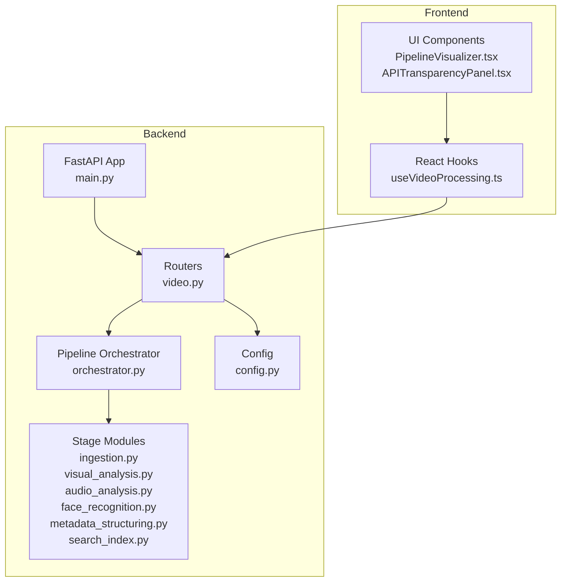
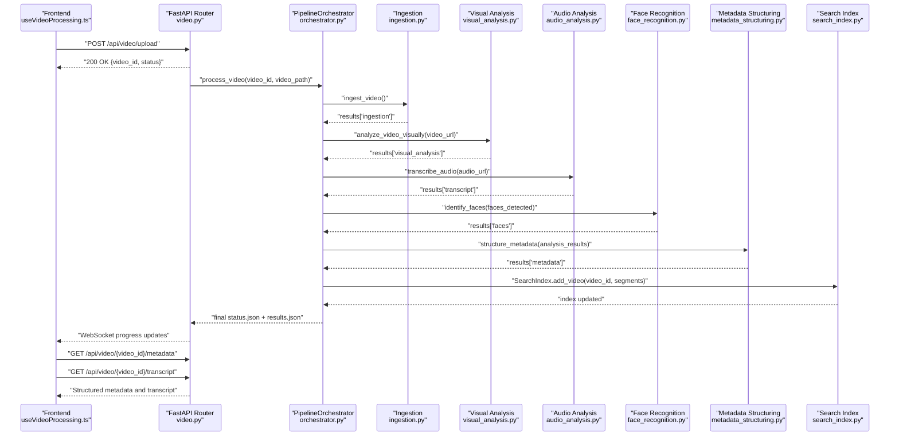
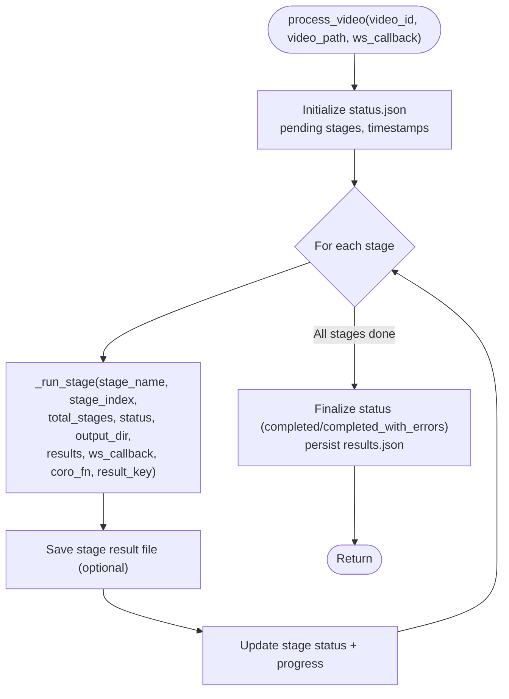
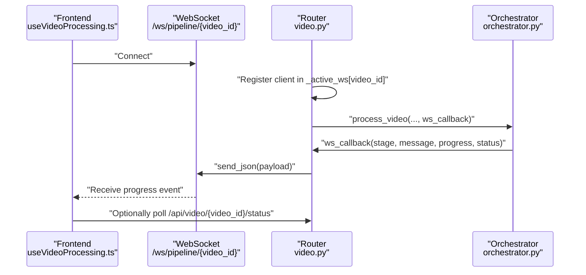
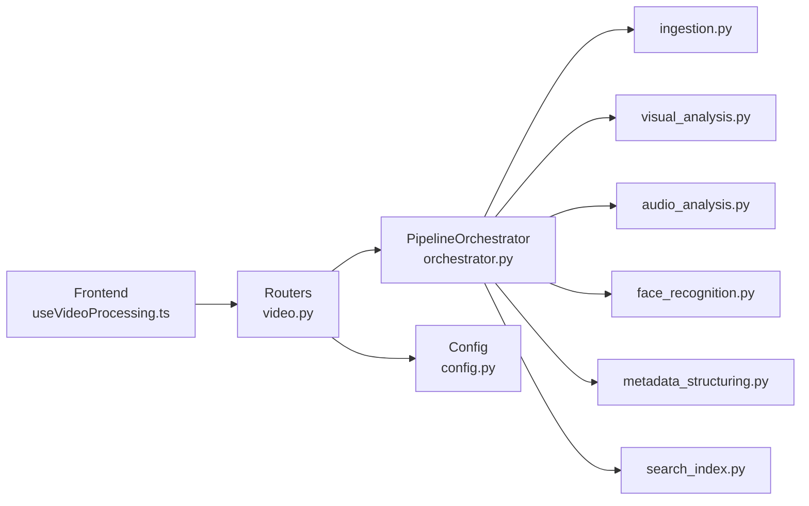

# Pipeline Overview and Architecture

<cite>
**Referenced Files in This Document**
- [orchestrator.py](file://backend/pipeline/orchestrator.py)
- [video.py](file://backend/routers/video.py)
- [config.py](file://backend/config.py)
- [ingestion.py](file://backend/pipeline/ingestion.py)
- [visual_analysis.py](file://backend/pipeline/visual_analysis.py)
- [audio_analysis.py](file://backend/pipeline/audio_analysis.py)
- [face_recognition.py](file://backend/pipeline/face_recognition.py)
- [metadata_structuring.py](file://backend/pipeline/metadata_structuring.py)
- [search_index.py](file://backend/pipeline/search_index.py)
- [main.py](file://backend/main.py)
- [useVideoProcessing.ts](file://frontend/src/lib/useVideoProcessing.ts)
- [PipelineVisualizer.tsx](file://frontend/src/components/archive/PipelineVisualizer.tsx)
- [APITransparencyPanel.tsx](file://frontend/src/components/archive/APITransparencyPanel.tsx)
- [reference_faces.json](file://backend/data/reference_faces.json)
- [iptc_taxonomy.json](file://backend/data/iptc_taxonomy.json)
</cite>

## Table of Contents
1. [Introduction](#introduction)
2. [Project Structure](#project-structure)
3. [Core Components](#core-components)
4. [Architecture Overview](#architecture-overview)
5. [Detailed Component Analysis](#detailed-component-analysis)
6. [Dependency Analysis](#dependency-analysis)
7. [Performance Considerations](#performance-considerations)
8. [Troubleshooting Guide](#troubleshooting-guide)
9. [Conclusion](#conclusion)
10. [Appendices](#appendices)

## Introduction
This document explains the PipelineOrchestrator class and the end-to-end video processing pipeline. It details the six-stage sequential workflow, the orchestrator’s role in stage execution, progress tracking, and error handling. It also documents the WebSocket callback mechanism for real-time progress updates, the status management system, and how the orchestrator coordinates between pipeline components. Practical examples illustrate pipeline initialization, execution flow, and status monitoring. Finally, it covers performance characteristics, memory usage patterns, and scalability implications of the sequential processing approach.

## Project Structure
The pipeline is implemented as a FastAPI service with a dedicated orchestration module and stage-specific modules. The frontend integrates with the backend via REST and WebSocket APIs to visualize progress and results.

**Diagram sources**
- [main.py:1-44](file://backend/main.py#L1-L44)
- [video.py:1-267](file://backend/routers/video.py#L1-L267)
- [orchestrator.py:1-329](file://backend/pipeline/orchestrator.py#L1-L329)
- [config.py:1-21](file://backend/config.py#L1-L21)
- [useVideoProcessing.ts:1-421](file://frontend/src/lib/useVideoProcessing.ts#L1-L421)
- [PipelineVisualizer.tsx:1-181](file://frontend/src/components/archive/PipelineVisualizer.tsx#L1-L181)
- [APITransparencyPanel.tsx:1-170](file://frontend/src/components/archive/APITransparencyPanel.tsx#L1-L170)

**Section sources**
- [main.py:1-44](file://backend/main.py#L1-L44)
- [video.py:1-267](file://backend/routers/video.py#L1-L267)
- [config.py:1-21](file://backend/config.py#L1-L21)

## Core Components
- PipelineOrchestrator: Central coordinator that executes stages sequentially, tracks progress, persists status, and emits WebSocket updates.
- Stage modules: Independent processing units for ingestion, visual analysis, audio transcription, face recognition, metadata structuring, and search index building.
- Routers: REST endpoints for upload, status, metadata, transcript, search, and WebSocket progress streaming.
- Frontend hooks and components: Real-time visualization of pipeline stages and results.

Key orchestration responsibilities:
- Initialize and persist status.json
- Compute stage progress percentages
- Forward progress via WebSocket callback
- Aggregate results across stages
- Persist combined results.json
- Handle exceptions per stage and record errors

**Section sources**
- [orchestrator.py:34-329](file://backend/pipeline/orchestrator.py#L34-L329)
- [video.py:25-120](file://backend/routers/video.py#L25-L120)

## Architecture Overview
The pipeline follows a strict sequential 6-stage workflow. The orchestrator coordinates each stage, passing results forward and ensuring robust error handling. The frontend connects via WebSocket to receive live progress updates and later fetches structured metadata and transcripts.

**Diagram sources**
- [video.py:39-120](file://backend/routers/video.py#L39-L120)
- [orchestrator.py:44-206](file://backend/pipeline/orchestrator.py#L44-L206)
- [ingestion.py:16-51](file://backend/pipeline/ingestion.py#L16-L51)
- [visual_analysis.py:43-130](file://backend/pipeline/visual_analysis.py#L43-L130)
- [audio_analysis.py:22-59](file://backend/pipeline/audio_analysis.py#L22-L59)
- [face_recognition.py:54-107](file://backend/pipeline/face_recognition.py#L54-L107)
- [metadata_structuring.py:81-163](file://backend/pipeline/metadata_structuring.py#L81-L163)
- [search_index.py:88-154](file://backend/pipeline/search_index.py#L88-L154)

## Detailed Component Analysis

### PipelineOrchestrator
The orchestrator defines the canonical stage order and manages execution, progress, and persistence.

- Stage names and order:
  1) ingestion
  2) visual_analysis
  3) audio_analysis
  4) face_recognition
  5) metadata_structuring
  6) search_index

- Execution pattern:
  - Initializes status.json with pending stages and timestamps
  - Computes progress as integer percentage based on stage index
  - Invokes _run_stage for each stage, forwarding a ws_callback
  - Aggregates results into a shared dictionary keyed by result_key
  - Builds searchable segments from earlier stages and adds to FAISS index
  - Finalizes status to completed or completed_with_errors, persists results.json

- Error handling:
  - Catches exceptions per stage, logs stack traces, marks stage as failed
  - Stores error messages under status.errors
  - Persists updated status and optional stage result file
  - Continues to next stage or completes pipeline accordingly

- Persistence:
  - Writes status.json after each stage and at completion
  - Writes individual stage result files and results.json at the end

- WebSocket callback contract:
  - Arguments: stage, message, progress, status
  - Sent to all registered WebSocket clients for the video_id

**Diagram sources**
- [orchestrator.py:44-206](file://backend/pipeline/orchestrator.py#L44-L206)
- [orchestrator.py:208-282](file://backend/pipeline/orchestrator.py#L208-L282)

**Section sources**
- [orchestrator.py:24-31](file://backend/pipeline/orchestrator.py#L24-L31)
- [orchestrator.py:44-206](file://backend/pipeline/orchestrator.py#L44-L206)
- [orchestrator.py:208-282](file://backend/pipeline/orchestrator.py#L208-L282)

### Stage 1: Ingestion
- Extracts audio (16 kHz mono WAV), generates thumbnail, probes video metadata
- Returns duration, resolution, fps, codec, plus file paths for downstream stages

**Section sources**
- [ingestion.py:16-51](file://backend/pipeline/ingestion.py#L16-L51)
- [ingestion.py:54-98](file://backend/pipeline/ingestion.py#L54-L98)
- [ingestion.py:100-146](file://backend/pipeline/ingestion.py#L100-L146)

### Stage 2: Visual Analysis
- Sends video_url to DashScope Qwen-VL for comprehensive scene/object/face/text detection
- Parses JSON from model response with robust fallbacks
- Returns scenes, faces, landmarks, OCR, sensitive content, and summaries

**Section sources**
- [visual_analysis.py:43-130](file://backend/pipeline/visual_analysis.py#L43-L130)
- [visual_analysis.py:133-176](file://backend/pipeline/visual_analysis.py#L133-L176)

### Stage 3: Audio Analysis / Speech-to-Text
- Submits audio to DashScope ASR paraformer-v2
- Polls task status with exponential backoff
- Fetches transcript JSON and normalizes to segments with speaker info and word timings

**Section sources**
- [audio_analysis.py:22-59](file://backend/pipeline/audio_analysis.py#L22-L59)
- [audio_analysis.py:62-142](file://backend/pipeline/audio_analysis.py#L62-L142)
- [audio_analysis.py:145-241](file://backend/pipeline/audio_analysis.py#L145-L241)

### Stage 4: Face Recognition
- Matches detected faces against a reference database using Qwen text model
- Loads reference_faces.json and compares descriptions to identify known figures
- Enriches face entries with name, role, confidence, and reasoning

**Section sources**
- [face_recognition.py:54-107](file://backend/pipeline/face_recognition.py#L54-L107)
- [face_recognition.py:110-196](file://backend/pipeline/face_recognition.py#L110-L196)
- [reference_faces.json:1-101](file://backend/data/reference_faces.json#L1-L101)

### Stage 5: Metadata Structuring
- Generates broadcast metadata (EBUCore XML, IPTC) from aggregated analysis results
- Uses iptc_taxonomy.json for topic classification
- Returns bilingual metadata, sentiment tags, geographic tags, and mentioned persons

**Section sources**
- [metadata_structuring.py:81-163](file://backend/pipeline/metadata_structuring.py#L81-L163)
- [metadata_structuring.py:166-208](file://backend/pipeline/metadata_structuring.py#L166-L208)
- [iptc_taxonomy.json:1-28](file://backend/data/iptc_taxonomy.json#L1-L28)

### Stage 6: Search Index
- Builds FAISS vector index using DashScope embeddings
- Converts scenes + transcript + identified persons into searchable segments
- Supports semantic search across indexed videos

**Section sources**
- [search_index.py:22-41](file://backend/pipeline/search_index.py#L22-L41)
- [search_index.py:88-154](file://backend/pipeline/search_index.py#L88-L154)
- [search_index.py:156-245](file://backend/pipeline/search_index.py#L156-L245)

### WebSocket Progress Streaming
- Router registers WebSocket connections per video_id
- Orchestrator’s ws_callback forwards progress updates to all connected clients
- Frontend hook subscribes to /ws/pipeline/{video_id} and updates stage statuses

**Diagram sources**
- [video.py:220-267](file://backend/routers/video.py#L220-L267)
- [video.py:95-120](file://backend/routers/video.py#L95-L120)
- [orchestrator.py:228-282](file://backend/pipeline/orchestrator.py#L228-L282)

**Section sources**
- [video.py:220-267](file://backend/routers/video.py#L220-L267)
- [video.py:95-120](file://backend/routers/video.py#L95-L120)
- [useVideoProcessing.ts:215-276](file://frontend/src/lib/useVideoProcessing.ts#L215-L276)

### Status Management
- Initial status created on upload with queued state
- Orchestrator maintains status.json with:
  - video_id, status, progress, stages map, timestamps, errors
- Frontend polls status via REST when WebSocket is unavailable

**Section sources**
- [video.py:64-82](file://backend/routers/video.py#L64-L82)
- [orchestrator.py:63-71](file://backend/pipeline/orchestrator.py#L63-L71)
- [video.py:124-138](file://backend/routers/video.py#L124-L138)

## Dependency Analysis
The orchestrator depends on stage modules and the SearchIndex. The router composes the orchestrator and exposes REST/WebSocket endpoints. The frontend consumes these endpoints and renders progress and results.

**Diagram sources**
- [orchestrator.py:14-20](file://backend/pipeline/orchestrator.py#L14-L20)
- [video.py:17-19](file://backend/routers/video.py#L17-L19)
- [config.py:4-20](file://backend/config.py#L4-L20)
- [useVideoProcessing.ts:1-10](file://frontend/src/lib/useVideoProcessing.ts#L1-L10)

**Section sources**
- [orchestrator.py:14-20](file://backend/pipeline/orchestrator.py#L14-L20)
- [video.py:17-19](file://backend/routers/video.py#L17-L19)
- [config.py:4-20](file://backend/config.py#L4-L20)

## Performance Considerations
- Sequential processing characteristics:
  - Predictable resource usage per stage
  - Lower concurrent memory footprint compared to parallel pipelines
  - Longer total processing time due to lack of overlap
- External API dependencies:
  - Visual analysis, ASR, embedding calls are rate-limited and may require retries
  - Embedding dimensionality and batch sizes impact memory and latency
- Disk I/O:
  - Audio extraction, thumbnail generation, and JSON persistence occur per stage
  - Large videos increase I/O overhead
- WebSocket scaling:
  - Each stage update triggers send_json to all registered clients
  - Consider batching or throttling updates for high concurrency
- FAISS index:
  - Index loading/saving occurs on add_video and search
  - Memory usage grows with indexed segments; optimize batch sizes and refresh cadence

[No sources needed since this section provides general guidance]

## Troubleshooting Guide
Common issues and remedies:
- Missing API keys:
  - Many stages return empty results with error markers when API keys are absent
  - Verify environment variables and settings
- FFmpeg failures:
  - Probe, audio extraction, and thumbnail generation log errors and may raise exceptions
  - Ensure FFmpeg is installed and accessible
- ASR task timeouts:
  - Long audio may exceed polling limits; adjust expectations or split input
- WebSocket disconnects:
  - Router removes disconnected clients automatically; frontend falls back to REST polling
- FAISS availability:
  - If FAISS is not installed, search/indexing is disabled; install faiss-cpu for full functionality

**Section sources**
- [visual_analysis.py:61-63](file://backend/pipeline/visual_analysis.py#L61-L63)
- [audio_analysis.py:40-42](file://backend/pipeline/audio_analysis.py#L40-L42)
- [face_recognition.py:76-81](file://backend/pipeline/face_recognition.py#L76-L81)
- [metadata_structuring.py:99-101](file://backend/pipeline/metadata_structuring.py#L99-L101)
- [search_index.py:61-64](file://backend/pipeline/search_index.py#L61-L64)
- [video.py:116-120](file://backend/routers/video.py#L116-L120)

## Conclusion
The PipelineOrchestrator provides a robust, transparent, and resilient framework for sequential video processing. Its explicit stage ordering, comprehensive error handling, and real-time progress streaming enable reliable operation and excellent observability. While sequential processing trades throughput for simplicity and predictability, it remains practical for most media archival scenarios and can be scaled by increasing server capacity or splitting large inputs.

[No sources needed since this section summarizes without analyzing specific files]

## Appendices

### Example: Pipeline Initialization and Execution Flow
- Upload a video via POST /api/video/upload; backend saves file and queues processing
- Background task invokes process_video with ws_callback
- Orchestrator runs ingestion → visual_analysis → audio_analysis → face_recognition → metadata_structuring → search_index
- Frontend receives WebSocket updates and switches to results view upon completion
- Users can fetch metadata and transcript via GET endpoints

**Section sources**
- [video.py:39-92](file://backend/routers/video.py#L39-L92)
- [video.py:95-120](file://backend/routers/video.py#L95-L120)
- [useVideoProcessing.ts:162-211](file://frontend/src/lib/useVideoProcessing.ts#L162-L211)

### Example: Status Monitoring
- Connect to /ws/pipeline/{video_id} to receive live progress
- Alternatively poll /api/video/{video_id}/status for current stage states
- After completion, fetch /api/video/{video_id}/metadata and /api/video/{video_id}/transcript

**Section sources**
- [video.py:220-267](file://backend/routers/video.py#L220-L267)
- [video.py:124-138](file://backend/routers/video.py#L124-L138)
- [video.py:143-174](file://backend/routers/video.py#L143-L174)
- [video.py:179-195](file://backend/routers/video.py#L179-L195)

### Frontend Visualization
- PipelineVisualizer displays stage icons, statuses, elapsed times, and progress bars
- APITransparencyPanel aggregates API call metrics for transparency

**Section sources**
- [PipelineVisualizer.tsx:88-181](file://frontend/src/components/archive/PipelineVisualizer.tsx#L88-L181)
- [APITransparencyPanel.tsx:20-170](file://frontend/src/components/archive/APITransparencyPanel.tsx#L20-L170)
- [useVideoProcessing.ts:106-118](file://frontend/src/lib/useVideoProcessing.ts#L106-L118)