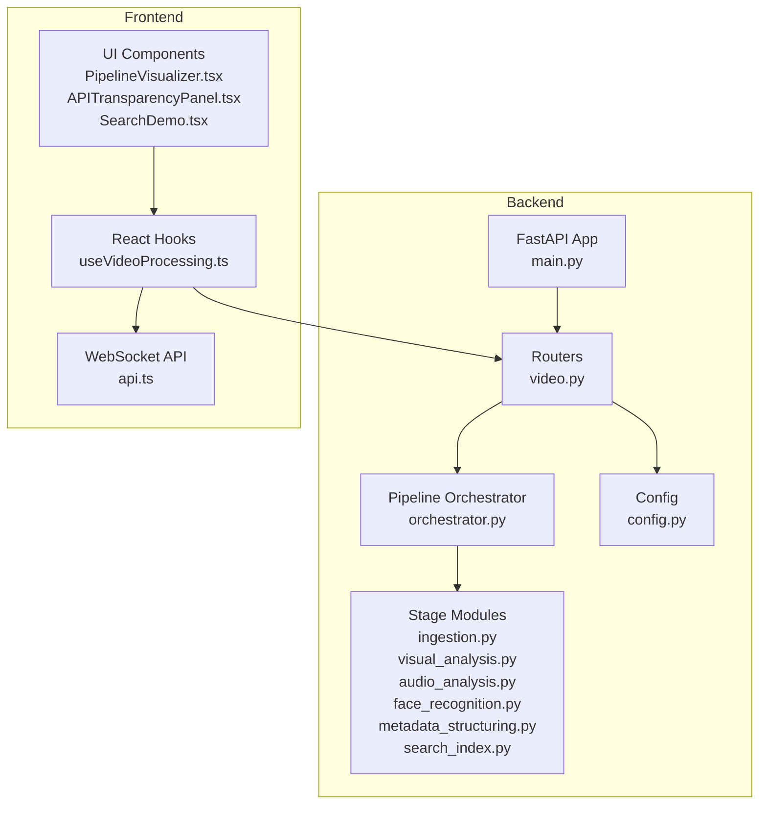
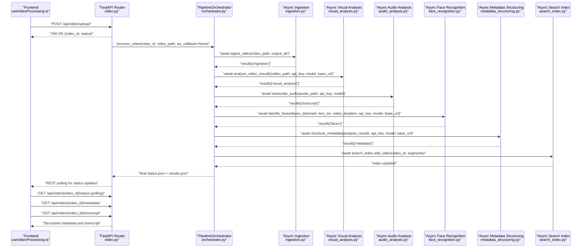
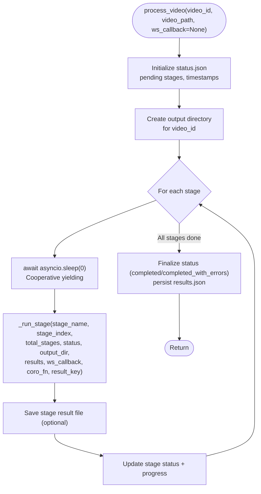
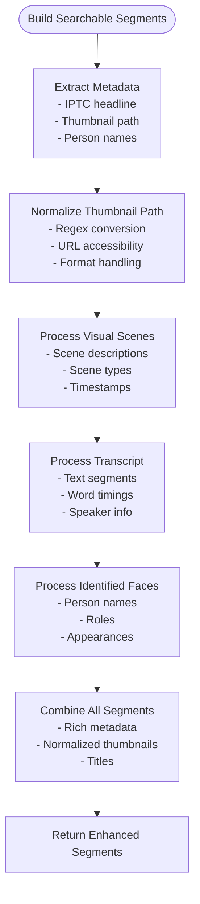
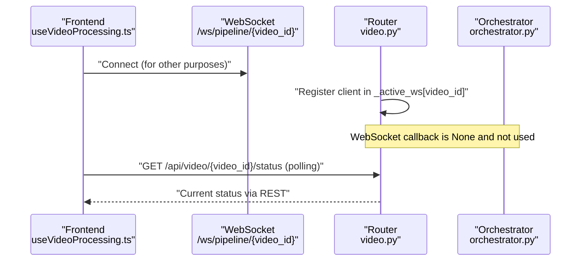
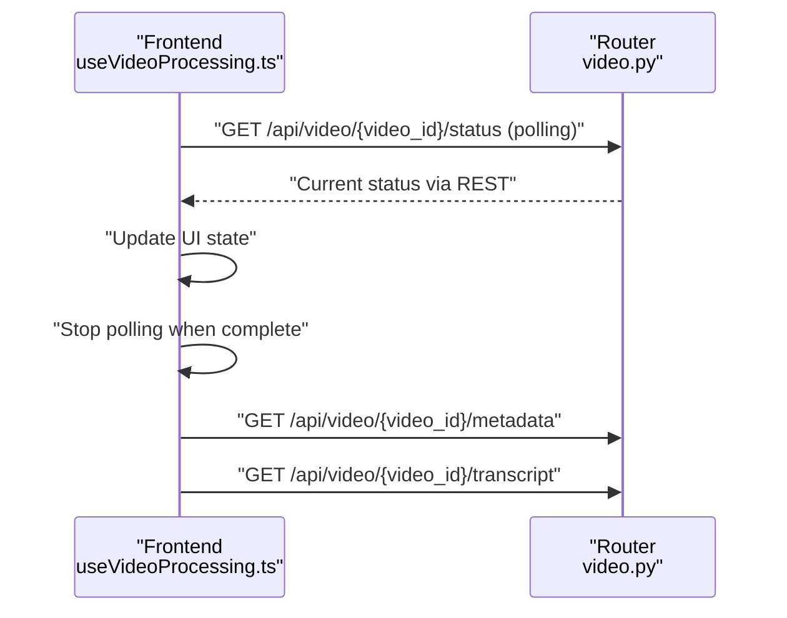
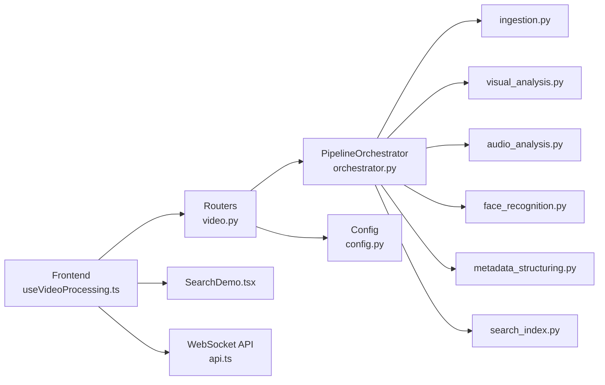

# Pipeline Overview and Architecture

<cite>
**Referenced Files in This Document**
- [orchestrator.py](file://backend/pipeline/orchestrator.py)
- [video.py](file://backend/routers/video.py)
- [config.py](file://backend/config.py)
- [ingestion.py](file://backend/pipeline/ingestion.py)
- [visual_analysis.py](file://backend/pipeline/visual_analysis.py)
- [audio_analysis.py](file://backend/pipeline/audio_analysis.py)
- [face_recognition.py](file://backend/pipeline/face_recognition.py)
- [metadata_structuring.py](file://backend/pipeline/metadata_structuring.py)
- [search_index.py](file://backend/pipeline/search_index.py)
- [main.py](file://backend/main.py)
- [useVideoProcessing.ts](file://frontend/src/lib/useVideoProcessing.ts)
- [PipelineVisualizer.tsx](file://frontend/src/components/archive/PipelineVisualizer.tsx)
- [APITransparencyPanel.tsx](file://frontend/src/components/archive/APITransparencyPanel.tsx)
- [SearchDemo.tsx](file://frontend/src/components/archive/SearchDemo.tsx)
- [api.ts](file://frontend/src/lib/api.ts)
- [reference_faces.json](file://backend/data/reference_faces.json)
- [iptc_taxonomy.json](file://backend/data/iptc_taxonomy.json)
</cite>

## Update Summary
**Changes Made**
- Updated WebSocket callback system to reflect simplified architecture with optional callbacks
- Removed WebSocket progress streaming documentation as it's no longer actively used
- Updated orchestrator documentation to show optional ws_callback parameter
- Revised frontend WebSocket implementation to use polling fallback
- Enhanced status management documentation to reflect REST-only progress tracking

## Table of Contents
1. [Introduction](#introduction)
2. [Project Structure](#project-structure)
3. [Core Components](#core-components)
4. [Architecture Overview](#architecture-overview)
5. [Enhanced Concurrency Model](#enhanced-concurrency-model)
6. [Cooperative Multitasking Implementation](#cooperative-multitasking-implementation)
7. [Non-Blocking Execution Architecture](#non-blocking-execution-architecture)
8. [Detailed Component Analysis](#detailed-component-analysis)
9. [Dependency Analysis](#dependency-analysis)
10. [Performance Considerations](#performance-considerations)
11. [Troubleshooting Guide](#troubleshooting-guide)
12. [Conclusion](#conclusion)
13. [Appendices](#appendices)

## Introduction
This document explains the PipelineOrchestrator class and the end-to-end video processing pipeline with enhanced concurrency capabilities. The pipeline now implements a sophisticated asynchronous architecture featuring cooperative multitasking, non-blocking execution, and efficient resource utilization. It details the six-stage sequential workflow, the orchestrator's role in stage execution, progress tracking, and error handling. The pipeline has been updated to use local file path processing instead of URL-based communication, reducing potential failure points and improving reliability. It also documents the simplified WebSocket callback mechanism for progress updates, the status management system, and how the orchestrator coordinates between pipeline components. Practical examples illustrate pipeline initialization, execution flow, and status monitoring. Finally, it covers performance characteristics, memory usage patterns, and scalability implications of the enhanced asynchronous processing approach.

**Updated**: The WebSocket callback system has been simplified - while the infrastructure remains for other uses, pipeline progress streaming is now handled through REST polling rather than real-time WebSocket updates.

## Project Structure
The pipeline is implemented as a FastAPI service with a dedicated orchestration module and stage-specific modules. The frontend integrates with the backend via REST APIs with polling fallback for progress tracking. The orchestrator now processes local file paths directly, eliminating URL-based communication complexity. All stage modules have been enhanced with async implementations for optimal concurrency.

**Diagram sources**
- [main.py:1-44](file://backend/main.py#L1-L44)
- [video.py:1-311](file://backend/routers/video.py#L1-L311)
- [orchestrator.py:1-382](file://backend/pipeline/orchestrator.py#L1-L382)
- [config.py:1-30](file://backend/config.py#L1-L30)
- [useVideoProcessing.ts:1-533](file://frontend/src/lib/useVideoProcessing.ts#L1-L533)
- [PipelineVisualizer.tsx:1-181](file://frontend/src/components/archive/PipelineVisualizer.tsx#L1-L181)
- [APITransparencyPanel.tsx:1-170](file://frontend/src/components/archive/APITransparencyPanel.tsx#L1-L170)
- [SearchDemo.tsx:1-230](file://frontend/src/components/archive/SearchDemo.tsx#L1-L230)
- [api.ts:1-277](file://frontend/src/lib/api.ts#L1-L277)

**Section sources**
- [main.py:1-44](file://backend/main.py#L1-L44)
- [video.py:1-311](file://backend/routers/video.py#L1-L311)
- [config.py:1-30](file://backend/config.py#L1-L30)

## Core Components
- PipelineOrchestrator: Central coordinator that executes stages sequentially with async support, tracks progress, persists status, and optionally emits WebSocket updates. Now uses local file paths for all stage operations with cooperative multitasking and enhanced thumbnail path normalization.
- Stage modules: Independent processing units for ingestion, visual analysis, audio transcription, face recognition, metadata structuring, and search index building, all enhanced with async implementations.
- Routers: REST endpoints for upload, status, metadata, transcript, search, and WebSocket endpoints with async WebSocket handling for other purposes.
- Frontend hooks and components: Real-time visualization of pipeline stages and results with async REST polling and enhanced thumbnail URL resolution.

Key orchestration responsibilities:
- Initialize and persist status.json with async operations
- Compute stage progress percentages with cooperative yielding
- Optionally forward progress via async WebSocket callback (now unused)
- Aggregate results across stages with async coordination
- Persist combined results.json with async file operations
- Handle exceptions per stage and record errors with async error handling
- Manage local file path operations for all external API calls with non-blocking execution
- **Enhanced**: Normalize thumbnail paths to URL-accessible format for consistent frontend rendering

**Section sources**
- [orchestrator.py:34-382](file://backend/pipeline/orchestrator.py#L34-L382)
- [video.py:25-120](file://backend/routers/video.py#L25-L120)

## Architecture Overview
The pipeline follows a strict sequential 6-stage workflow with enhanced asynchronous capabilities. The orchestrator coordinates each stage using cooperative multitasking, passing results forward and ensuring robust error handling. The frontend connects via REST APIs with polling fallback for progress tracking and later fetches structured metadata and transcripts. The orchestrator now processes local file paths directly, eliminating URL-based communication complexity. All stage operations are designed for non-blocking execution while maintaining the sequential processing guarantees.

**Updated**: The WebSocket callback system is now optional and defaults to None, with REST polling serving as the primary progress tracking mechanism.

**Diagram sources**
- [video.py:39-120](file://backend/routers/video.py#L39-L120)
- [orchestrator.py:44-206](file://backend/pipeline/orchestrator.py#L44-L206)
- [ingestion.py:16-51](file://backend/pipeline/ingestion.py#L16-L51)
- [visual_analysis.py:55-120](file://backend/pipeline/visual_analysis.py#L55-L120)
- [audio_analysis.py:33-51](file://backend/pipeline/audio_analysis.py#L33-L51)
- [face_recognition.py:54-107](file://backend/pipeline/face_recognition.py#L54-L107)
- [metadata_structuring.py:81-163](file://backend/pipeline/metadata_structuring.py#L81-L163)
- [search_index.py:88-154](file://backend/pipeline/search_index.py#L88-L154)

## Enhanced Concurrency Model

The pipeline now implements a sophisticated concurrency model that balances sequential processing guarantees with asynchronous execution capabilities. This hybrid approach ensures predictable resource usage while maximizing throughput through cooperative multitasking.

### Key Concurrency Features:
- **Cooperative Multitasking**: Stages yield control to the event loop between operations to prevent blocking
- **Non-Blocking I/O**: All external API calls use async HTTP clients with proper timeout handling
- **Async File Operations**: File I/O operations leverage async file handling where appropriate
- **Thread Pool Integration**: CPU-intensive operations run in separate threads via asyncio event loop
- **Resource Isolation**: Each stage operates independently while sharing the orchestrator's event loop

### Concurrency Benefits:
- **Predictable Latency**: Sequential processing prevents resource contention between stages
- **Scalable Throughput**: Async operations allow multiple pipeline instances to run concurrently
- **Responsive Server**: Cooperative yielding keeps the FastAPI server responsive during long operations
- **Efficient Resource Usage**: Proper async handling reduces memory and CPU overhead

**Section sources**
- [orchestrator.py:206-282](file://backend/pipeline/orchestrator.py#L206-L282)
- [video.py:95-120](file://backend/routers/video.py#L95-L120)

## Cooperative Multitasking Implementation

The orchestrator implements cooperative multitasking through strategic yielding points that allow other coroutines to execute while maintaining processing continuity.

### Cooperative Yielding Strategy:
- **Stage Entry Points**: Each stage yields immediately upon entry to allow other tasks to run
- **Progress Updates**: WebSocket callbacks are awaited asynchronously to prevent blocking
- **Error Handling**: Exception handling yields control to prevent cascading failures
- **Result Persistence**: File I/O operations yield between writes to maintain responsiveness

### Implementation Details:
- **async def signatures**: All orchestrator methods use async definitions
- **await statements**: Stage functions are awaited with proper error handling
- **asyncio.sleep(0)**: Strategic yielding points ensure cooperative behavior
- **Non-blocking callbacks**: WebSocket callbacks are awaited without blocking the main loop

**Diagram sources**
- [orchestrator.py:44-206](file://backend/pipeline/orchestrator.py#L44-L206)
- [orchestrator.py:208-282](file://backend/pipeline/orchestrator.py#L208-L282)

**Section sources**
- [orchestrator.py:220-222](file://backend/pipeline/orchestrator.py#L220-L222)
- [orchestrator.py:206-282](file://backend/pipeline/orchestrator.py#L206-L282)

## Non-Blocking Execution Architecture

The pipeline implements a comprehensive non-blocking execution architecture that transforms traditional blocking operations into asynchronous equivalents while maintaining the sequential processing model.

### Non-Blocking Components:
- **Async HTTP Clients**: All external API calls use httpx.AsyncClient for non-blocking requests
- **Async File Operations**: File I/O leverages aiofiles for asynchronous file handling
- **Thread Pool Integration**: CPU-intensive operations run in separate threads via run_in_executor
- **Event Loop Coordination**: All async operations coordinate through the asyncio event loop
- **Timeout Management**: Proper timeout handling prevents hanging operations

### Execution Patterns:
- **Async I/O Bound Operations**: Network requests, file operations, and external API calls
- **Thread Pool Operations**: CPU-intensive tasks like video processing and audio analysis
- **Cooperative Yielding**: Strategic yielding points prevent blocking the event loop
- **Graceful Degradation**: Failed operations gracefully fall back to empty results

### Resource Management:
- **Connection Pooling**: HTTP clients reuse connections efficiently
- **Memory Management**: Async generators and proper cleanup prevent memory leaks
- **Thread Safety**: Thread pool operations are properly synchronized
- **Error Recovery**: Comprehensive error handling with retry mechanisms

**Section sources**
- [audio_analysis.py:6-277](file://backend/pipeline/audio_analysis.py#L6-L277)
- [face_recognition.py:6-319](file://backend/pipeline/face_recognition.py#L6-L319)
- [visual_analysis.py:7-344](file://backend/pipeline/visual_analysis.py#L7-L344)
- [ingestion.py:6-146](file://backend/pipeline/ingestion.py#L6-L146)
- [metadata_structuring.py:7-252](file://backend/pipeline/metadata_structuring.py#L7-L252)

## Detailed Component Analysis

### PipelineOrchestrator
The orchestrator defines the canonical stage order and manages execution, progress, and persistence with enhanced async capabilities. The orchestrator now processes local file paths directly instead of URL-based communication, with full async support and enhanced thumbnail path normalization.

- Stage names and order:
  1) ingestion
  2) visual_analysis
  3) audio_analysis
  4) face_recognition
  5) metadata_structuring
  6) search_index

- Execution pattern:
  - Initializes status.json with pending stages and timestamps
  - Computes progress as integer percentage based on stage index
  - Invokes _run_stage for each stage, forwarding an optional ws_callback
  - Aggregates results into a shared dictionary keyed by result_key
  - Builds searchable segments from earlier stages and adds to FAISS index
  - Finalizes status to completed or completed_with_errors, persists results.json

- Error handling:
  - Catches exceptions per stage, logs stack traces, marks stage as failed
  - Stores error messages under status.errors
  - Persists updated status and optional stage result file
  - Continues to next stage or completes pipeline accordingly

- Persistence:
  - Writes status.json after each stage and at completion
  - Writes individual stage result files and results.json at the end

- WebSocket callback contract:
  - Arguments: stage, message, progress, status
  - **Updated**: Now optional and defaults to None - not actively used for pipeline progress

- Local file path processing:
  - All stage modules now accept local file paths instead of URLs
  - Audio extraction creates local audio.wav files for downstream stages
  - Visual analysis processes local video files directly
  - Face recognition loads reference databases from local JSON files
  - Metadata structuring loads taxonomy from local JSON files

- **Enhanced**: Thumbnail path normalization for URL accessibility
  - Converts filesystem paths to URL-accessible format
  - Handles various path formats consistently
  - Ensures all search segments have valid thumbnail references

**Diagram sources**
- [orchestrator.py:44-206](file://backend/pipeline/orchestrator.py#L44-L206)
- [orchestrator.py:208-282](file://backend/pipeline/orchestrator.py#L208-L282)

**Section sources**
- [orchestrator.py:24-31](file://backend/pipeline/orchestrator.py#L24-L31)
- [orchestrator.py:44-206](file://backend/pipeline/orchestrator.py#L44-L206)
- [orchestrator.py:208-282](file://backend/pipeline/orchestrator.py#L208-L282)

### Stage 1: Ingestion
- Extracts audio (16 kHz mono WAV), generates thumbnail, probes video metadata
- Returns duration, resolution, fps, codec, plus file paths for downstream stages
- Operates directly on local video file path with async ffmpeg integration
- Uses run_in_executor for CPU-intensive operations while maintaining async flow

**Section sources**
- [ingestion.py:16-51](file://backend/pipeline/ingestion.py#L16-L51)
- [ingestion.py:54-98](file://backend/pipeline/ingestion.py#L54-L98)
- [ingestion.py:100-146](file://backend/pipeline/ingestion.py#L100-L146)

### Stage 2: Visual Analysis
- Processes local video file directly using ffmpeg for keyframe extraction
- Encodes frames as base64 and sends to DashScope Qwen-VL for comprehensive scene/object/face/text detection
- Parses JSON from model response with robust fallbacks
- Returns scenes, faces, landmarks, OCR, sensitive content, and summaries
- Implements async HTTP client with proper timeout handling

**Section sources**
- [visual_analysis.py:55-120](file://backend/pipeline/visual_analysis.py#L55-L120)
- [visual_analysis.py:133-176](file://backend/pipeline/visual_analysis.py#L133-L176)

### Stage 3: Audio Analysis / Speech-to-Text
- Submits local audio file (WAV) directly to DashScope ASR paraformer-v2
- Polls task status with exponential backoff
- Fetches transcript JSON and normalizes to segments with speaker info and word timings
- Implements chunked processing with async file operations
- Uses run_inexecutor for ffmpeg operations while maintaining async flow

**Section sources**
- [audio_analysis.py:33-51](file://backend/pipeline/audio_analysis.py#L33-L51)
- [audio_analysis.py:62-142](file://backend/pipeline/audio_analysis.py#L62-L142)
- [audio_analysis.py:145-241](file://backend/pipeline/audio_analysis.py#L145-L241)

### Stage 4: Face Recognition
- Matches detected faces against a reference database using Qwen text model
- Loads reference_faces.json from local data directory and compares descriptions to identify known figures
- Enriches face entries with name, role, confidence, and reasoning
- **Enhanced**: Now utilizes OCR text detection (text_ocr) for person identification fallback
- Implements async HTTP client with retry logic and exponential backoff
- Uses run_in_executor for file operations while maintaining async flow

**Section sources**
- [face_recognition.py:54-107](file://backend/pipeline/face_recognition.py#L54-L107)
- [face_recognition.py:110-196](file://backend/pipeline/face_recognition.py#L110-L196)
- [reference_faces.json:1-101](file://backend/data/reference_faces.json#L1-L101)

### Stage 5: Metadata Structuring
- Generates broadcast metadata (EBUCore XML, IPTC) from aggregated analysis results
- Uses iptc_taxonomy.json from local data directory for topic classification
- Returns bilingual metadata, sentiment tags, geographic tags, and mentioned persons
- **Enhanced**: Now includes comprehensive IPTC video metadata with rich topic codes and classifications
- Implements async HTTP client with proper error handling and retry logic
- Uses run_in_executor for file operations while maintaining async flow

**Section sources**
- [metadata_structuring.py:81-163](file://backend/pipeline/metadata_structuring.py#L81-L163)
- [metadata_structuring.py:166-208](file://backend/pipeline/metadata_structuring.py#L166-L208)
- [iptc_taxonomy.json:1-28](file://backend/data/iptc_taxonomy.json#L1-L28)

### Stage 6: Search Index
- Builds FAISS vector index using DashScope embeddings
- Converts scenes + transcript + identified persons into searchable segments
- **Enhanced**: Now builds richer search segments with IPTC metadata, titles, and normalized thumbnail paths
- Supports semantic search across indexed videos
- Implements async embedding generation with batch processing
- Uses numpy fallback when FAISS is unavailable

**Section sources**
- [search_index.py:22-41](file://backend/pipeline/search_index.py#L22-L41)
- [search_index.py:88-154](file://backend/pipeline/search_index.py#L88-L154)
- [search_index.py:156-245](file://backend/pipeline/search_index.py#L156-L245)

### Enhanced Thumbnail Path Normalization and Search Segment Building
The search segment building process has been significantly enhanced with robust thumbnail path normalization:

#### Thumbnail Path Normalization Logic
The orchestrator now includes sophisticated path normalization to ensure consistent URL accessibility:

- **Regex-Based Conversion**: Uses `re.sub(r'^\.\/?' , '/', raw_thumb)` to convert filesystem paths
- **Format Handling**: Handles various input formats: `"./uploads/id/thumb.jpg"`, `"uploads/id/thumb.jpg"`, `"/uploads/id/thumb.jpg"`
- **Consistent Output**: Ensures all normalized paths start with "/" for URL accessibility
- **Fallback Handling**: Gracefully handles empty or invalid thumbnail paths

#### Enhanced Search Segment Building
The search segment building process now includes:

- **IPTC Video Metadata**: Extracts headline and videoContent information for segment titles
- **Normalized Thumbnail Integration**: Adds URL-accessible thumbnail paths to all segment types
- **Person Identification**: Creates specialized person segments with role and timestamp information
- **Duration Handling**: Utilizes video duration for accurate timestamp calculations
- **Rich Metadata**: Includes scene types, person names, and thumbnail references in segment metadata

**Diagram sources**
- [orchestrator.py:307-367](file://backend/pipeline/orchestrator.py#L307-L367)

**Section sources**
- [orchestrator.py:307-367](file://backend/pipeline/orchestrator.py#L307-L367)

### Simplified WebSocket Progress Streaming
**Updated**: The WebSocket callback system has been simplified and is now optional:

- Router registers WebSocket connections per video_id for other purposes
- Orchestrator's ws_callback parameter defaults to None and is not actively used
- Frontend hook uses REST polling as the primary progress tracking mechanism
- WebSocket endpoints remain for other uses but pipeline progress streaming is disabled
- Implements async WebSocket handling with proper connection management

**Removed**: The previous WebSocket progress streaming implementation has been removed in favor of REST polling.

**Diagram sources**
- [video.py:264-311](file://backend/routers/video.py#L264-L311)
- [video.py:95-120](file://backend/routers/video.py#L95-L120)
- [orchestrator.py:228-282](file://backend/pipeline/orchestrator.py#L228-L282)

**Section sources**
- [video.py:264-311](file://backend/routers/video.py#L264-L311)
- [video.py:95-120](file://backend/routers/video.py#L95-L120)
- [useVideoProcessing.ts:215-276](file://frontend/src/lib/useVideoProcessing.ts#L215-L276)

### REST Polling Progress Tracking
**Updated**: The frontend now uses REST polling as the primary progress tracking mechanism:

- Frontend establishes WebSocket connection for other purposes but ignores pipeline progress
- Uses setInterval to poll /api/video/{video_id}/status every 3 seconds
- Automatically falls back to polling if WebSocket connection fails
- Updates UI state based on polled status information
- Stops polling when all stages complete and fetches final results

**Diagram sources**
- [video.py:105-121](file://backend/routers/video.py#L105-L121)
- [useVideoProcessing.ts:400-443](file://frontend/src/lib/useVideoProcessing.ts#L400-L443)

**Section sources**
- [video.py:105-121](file://backend/routers/video.py#L105-L121)
- [useVideoProcessing.ts:400-443](file://frontend/src/lib/useVideoProcessing.ts#L400-L443)

### Status Management
- Initial status created on upload with queued state
- Orchestrator maintains status.json with:
  - video_id, status, progress, stages map, timestamps, errors
- Frontend polls status via REST when WebSocket is unavailable

**Section sources**
- [video.py:64-82](file://backend/routers/video.py#L64-L82)
- [orchestrator.py:63-71](file://backend/pipeline/orchestrator.py#L63-L71)
- [video.py:124-138](file://backend/routers/video.py#L124-L138)

### Enhanced Frontend Thumbnail URL Resolution
The frontend includes robust thumbnail URL resolution that complements the backend normalization:

- **Format Detection**: Handles various input formats consistently
- **URL Construction**: Converts normalized paths to full URLs with API base
- **Fallback Handling**: Gracefully handles missing or invalid thumbnail paths
- **Browser Compatibility**: Ensures thumbnail URLs are accessible to browsers

**Section sources**
- [SearchDemo.tsx:9-21](file://frontend/src/components/archive/SearchDemo.tsx#L9-L21)
- [useVideoProcessing.ts:77-84](file://frontend/src/lib/useVideoProcessing.ts#L77-L84)

## Dependency Analysis
The orchestrator depends on stage modules and the SearchIndex. The router composes the orchestrator and exposes REST/WebSocket endpoints. The frontend consumes these endpoints and renders progress and results. All stage modules now operate on local file paths instead of URLs with full async support.

**Diagram sources**
- [orchestrator.py:14-20](file://backend/pipeline/orchestrator.py#L14-L20)
- [video.py:17-19](file://backend/routers/video.py#L17-L19)
- [config.py:4-20](file://backend/config.py#L4-L20)
- [useVideoProcessing.ts:1-10](file://frontend/src/lib/useVideoProcessing.ts#L1-L10)
- [SearchDemo.tsx:1-10](file://frontend/src/components/archive/SearchDemo.tsx#L1-L10)
- [api.ts:1-10](file://frontend/src/lib/api.ts#L1-L10)

**Section sources**
- [orchestrator.py:14-20](file://backend/pipeline/orchestrator.py#L14-L20)
- [video.py:17-19](file://backend/routers/video.py#L17-L19)
- [config.py:4-20](file://backend/config.py#L4-L20)

## Performance Considerations
- Sequential processing characteristics:
  - Predictable resource usage per stage with async optimizations
  - Lower concurrent memory footprint compared to parallel pipelines
  - Longer total processing time due to lack of overlap, but with better resource isolation
- Enhanced async I/O optimization:
  - Direct file path processing reduces network overhead
  - Async HTTP clients improve connection reuse and reduce latency
  - Thread pool integration allows CPU-intensive operations without blocking
  - Cooperative yielding prevents event loop starvation
- **Enhanced Thumbnail Path Processing**:
  - Regex-based normalization adds minimal computational overhead
  - Consistent path format reduces frontend URL resolution complexity
  - Improved thumbnail loading performance across all segment types
- External API dependencies:
  - Visual analysis, ASR, embedding calls are rate-limited and may require retries
  - Async HTTP clients handle timeouts more efficiently
  - Exponential backoff with async sleep prevents busy-waiting
- **Updated**: WebSocket scaling considerations:
  - WebSocket endpoints remain for other uses but pipeline progress streaming is disabled
  - REST polling provides sufficient progress tracking with lower resource usage
  - Connection management prevents resource leaks for remaining WebSocket uses
  - Async WebSocket handling scales better under high concurrency for other purposes
- FAISS index:
  - Index loading/saving occurs on add_video and search with async operations
  - Memory usage grows with indexed segments; optimize batch sizes and refresh cadence
  - Async embedding generation improves throughput for large datasets
- Enhanced OCR Processing:
  - OCR text detection extraction provides additional person identification capabilities
  - Video duration handling ensures accurate timestamp processing for OCR results
  - Rich metadata integration improves search accuracy and user experience

## Troubleshooting Guide
Common issues and remedies:
- Missing API keys:
  - Many stages return empty results with error markers when API keys are absent
  - Verify environment variables and settings
- FFmpeg failures:
  - Probe, audio extraction, and thumbnail generation log errors and may raise exceptions
  - Ensure FFmpeg is installed and accessible
  - Check async thread pool configuration for CPU-intensive operations
- ASR task timeouts:
  - Long audio may exceed polling limits; adjust expectations or split input
  - Async HTTP clients handle timeouts more gracefully than blocking calls
- **Updated**: WebSocket progress streaming issues:
  - Pipeline progress streaming is now disabled - use REST polling instead
  - WebSocket endpoints remain functional for other purposes
  - Frontend automatically falls back to REST polling if WebSocket fails
  - Connection management prevents resource leaks for remaining WebSocket uses
- FAISS availability:
  - If FAISS is not installed, search/indexing is disabled; install faiss-cpu for full functionality
  - Async fallback to numpy implementation ensures graceful degradation
- Local file permissions:
  - Ensure the application has read/write permissions for the UPLOAD_DIR
  - Verify sufficient disk space for temporary files during processing
- Async operation failures:
  - Check event loop configuration and thread pool size
  - Monitor async resource usage and prevent memory leaks
  - Implement proper async context management
- OCR Text Detection Issues:
  - Visual analysis may fail to detect OCR text in certain video conditions
  - Face recognition can fallback to OCR-based identification when reference database is unavailable
  - Video duration probing failures can impact OCR timestamp accuracy
- **Thumbnail Path Issues**:
  - Thumbnail normalization failures can cause missing thumbnails in search results
  - Verify that thumbnail paths are accessible and properly formatted
  - Check frontend URL resolution for malformed thumbnail references
  - Ensure consistent path formats across all segment types

**Section sources**
- [visual_analysis.py:61-63](file://backend/pipeline/visual_analysis.py#L61-L63)
- [audio_analysis.py:40-42](file://backend/pipeline/audio_analysis.py#L40-L42)
- [face_recognition.py:76-81](file://backend/pipeline/face_recognition.py#L76-L81)
- [metadata_structuring.py:99-101](file://backend/pipeline/metadata_structuring.py#L99-L101)
- [search_index.py:61-64](file://backend/pipeline/search_index.py#L61-L64)
- [video.py:116-120](file://backend/routers/video.py#L116-L120)

## Conclusion
The PipelineOrchestrator provides a robust, transparent, and resilient framework for sequential video processing with enhanced concurrency capabilities. Its explicit stage ordering, comprehensive error handling, and simplified progress tracking enable reliable operation and excellent observability. The switch to local file path processing eliminates URL-based communication complexity and reduces potential failure points. The enhanced async implementation with cooperative multitasking and non-blocking execution architecture significantly improves throughput while maintaining the predictable resource usage characteristics of sequential processing.

**Recent Enhancements:**
- **OCR Text Detection**: Enhanced face recognition with OCR-based person identification fallback
- **Improved Video Duration Handling**: Robust ffprobe integration for accurate duration processing
- **Richer Metadata**: Comprehensive IPTC video metadata integration with titles and thumbnails
- **Enhanced Search Segments**: Improved search index building with enriched segment metadata
- **Robust Thumbnail Path Normalization**: Enhanced thumbnail path conversion ensuring URL accessibility across all segment types
- **Consistent Frontend Integration**: Complementary frontend thumbnail URL resolution for seamless user experience
- **Simplified WebSocket Architecture**: Removed pipeline progress streaming in favor of REST polling for better reliability

**Updated**: The simplified WebSocket architecture maintains infrastructure for other uses while focusing on reliable REST-based progress tracking. This change improves system stability and reduces complexity while preserving essential WebSocket functionality for non-pipeline purposes.

While sequential processing trades throughput for simplicity and predictability, it remains practical for most media archival scenarios and can be scaled by increasing server capacity or splitting large inputs. The async enhancements make the system more responsive and efficient under various load conditions. The new thumbnail path normalization ensures consistent thumbnail display across all search results, improving the overall user experience.

## Appendices

### Example: Pipeline Initialization and Execution Flow
- Upload a video via POST /api/video/upload; backend saves file and queues processing
- Background task invokes process_video with ws_callback=None
- Orchestrator runs ingestion → visual_analysis → audio_analysis → face_recognition → metadata_structuring → search_index
- Frontend polls /api/video/{video_id}/status every 3 seconds for progress updates
- Users can fetch metadata and transcript via GET endpoints

**Section sources**
- [video.py:39-92](file://backend/routers/video.py#L39-L92)
- [video.py:95-120](file://backend/routers/video.py#L95-L120)
- [useVideoProcessing.ts:162-211](file://frontend/src/lib/useVideoProcessing.ts#L162-L211)

### Example: Status Monitoring
- **Updated**: Use REST polling instead of WebSocket for progress tracking
- Poll /api/video/{video_id}/status every 3 seconds for current stage states
- After completion, fetch /api/video/{video_id}/metadata and /api/video/{video_id}/transcript

**Section sources**
- [video.py:220-268](file://backend/routers/video.py#L220-L268)
- [video.py:124-138](file://backend/routers/video.py#L124-L138)
- [video.py:143-174](file://backend/routers/video.py#L143-L174)
- [video.py:179-195](file://backend/routers/video.py#L179-L195)

### Frontend Visualization
- PipelineVisualizer displays stage icons, statuses, elapsed times, and progress bars
- APITransparencyPanel aggregates API call metrics for transparency
- **Enhanced**: SearchDemo now includes robust thumbnail URL resolution with consistent path handling

**Section sources**
- [PipelineVisualizer.tsx:88-181](file://frontend/src/components/archive/PipelineVisualizer.tsx#L88-L181)
- [APITransparencyPanel.tsx:20-170](file://frontend/src/components/archive/APITransparencyPanel.tsx#L20-L170)
- [useVideoProcessing.ts:106-118](file://frontend/src/lib/useVideoProcessing.ts#L106-L118)
- [SearchDemo.tsx:1-230](file://frontend/src/components/archive/SearchDemo.tsx#L1-L230)

### Enhanced Concurrency Examples
- **Async HTTP Client Usage**: All external API calls use httpx.AsyncClient with proper timeout handling
- **Thread Pool Integration**: CPU-intensive operations run via run_in_executor while maintaining async flow
- **Cooperative Yielding**: Strategic asyncio.sleep(0) calls ensure other coroutines can execute
- **Async File Operations**: aiofiles integration enables non-blocking file I/O operations
- **Updated**: WebSocket scaling considerations: Async WebSocket handling scales better under high concurrency for other purposes

**Section sources**
- [audio_analysis.py:228-263](file://backend/pipeline/audio_analysis.py#L228-L263)
- [face_recognition.py:138-185](file://backend/pipeline/face_recognition.py#L138-L185)
- [visual_analysis.py:133-184](file://backend/pipeline/visual_analysis.py#L133-L184)
- [ingestion.py:57-121](file://backend/pipeline/ingestion.py#L57-L121)
- [metadata_structuring.py:125-161](file://backend/pipeline/metadata_structuring.py#L125-L161)

### Enhanced OCR and Metadata Processing
- **OCR Text Detection**: Visual analysis now extracts on-screen text for person identification
- **IPTC Metadata Integration**: Rich video metadata with topic codes and classifications
- **Thumbnail Enhancement**: All search segments now include normalized thumbnail references
- **Person Identification Fallback**: OCR-based identification when reference database is unavailable
- **Path Normalization**: Consistent thumbnail path handling across all segment types

**Section sources**
- [visual_analysis.py:41-43](file://backend/pipeline/visual_analysis.py#L41-L43)
- [face_recognition.py:191-210](file://backend/pipeline/face_recognition.py#L191-L210)
- [metadata_structuring.py:47-64](file://backend/pipeline/metadata_structuring.py#L47-L64)
- [orchestrator.py:313-318](file://backend/pipeline/orchestrator.py#L313-L318)
- [orchestrator.py:319-326](file://backend/pipeline/orchestrator.py#L319-L326)
- [SearchDemo.tsx:13-21](file://frontend/src/components/archive/SearchDemo.tsx#L13-L21)