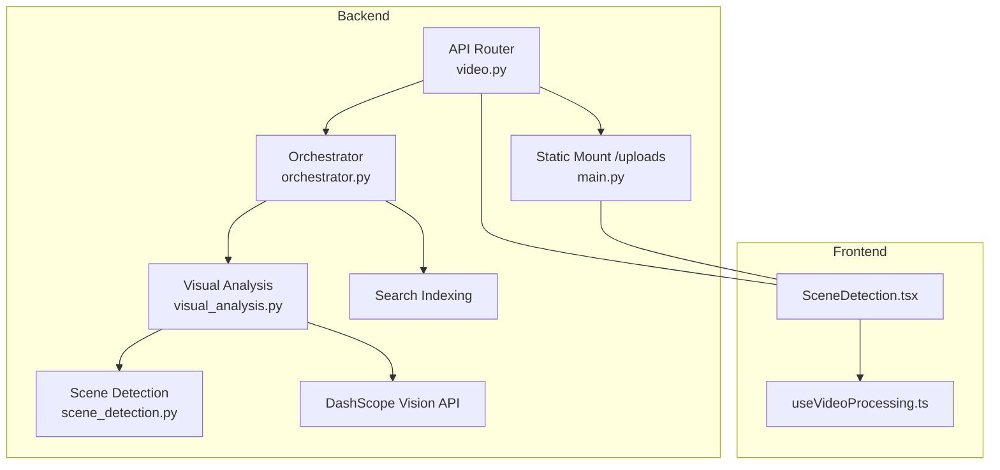
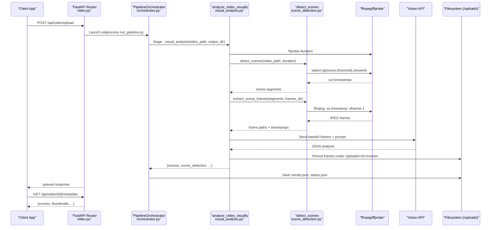
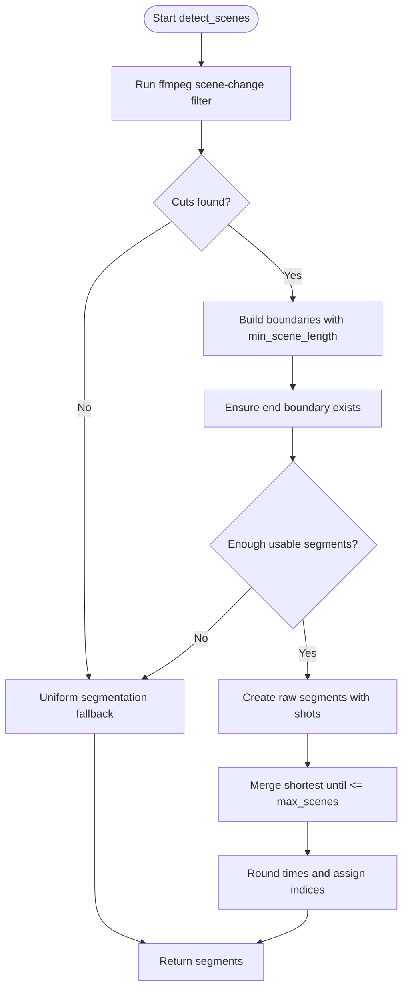
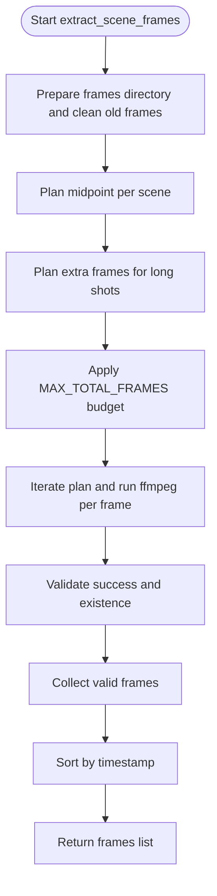
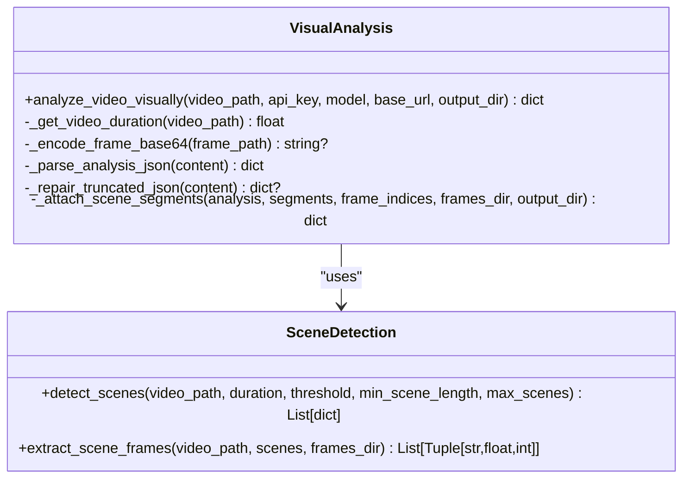
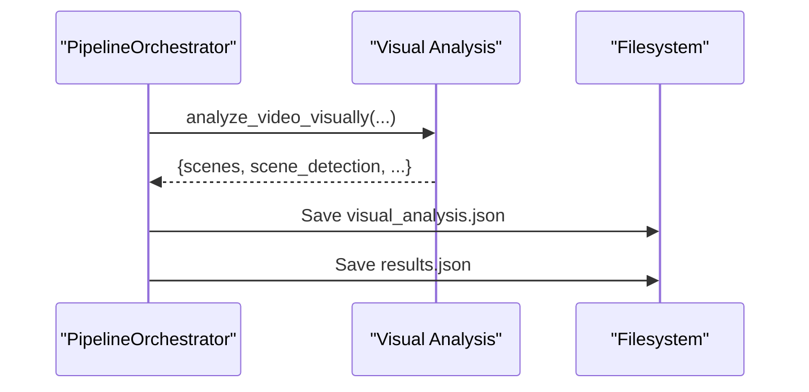
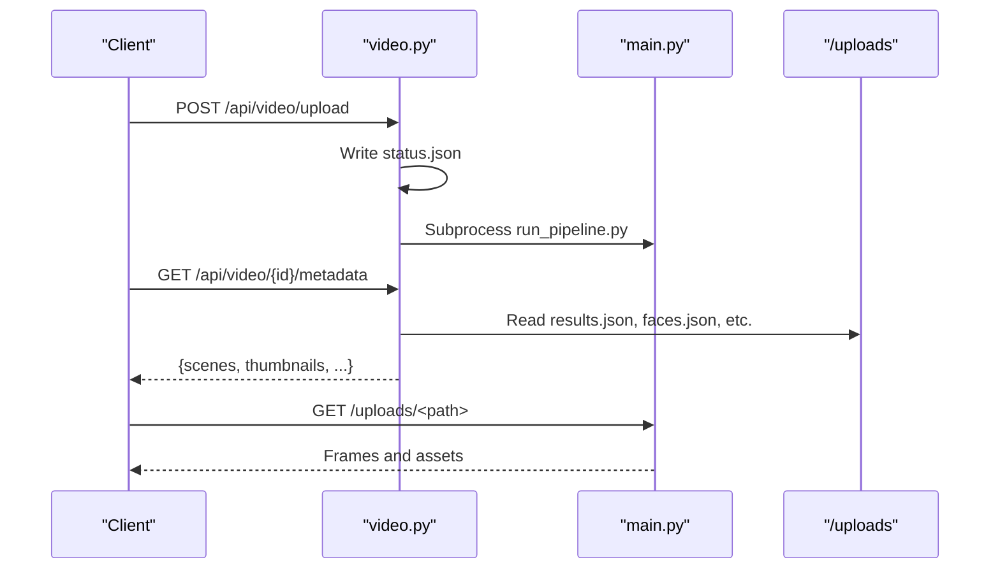
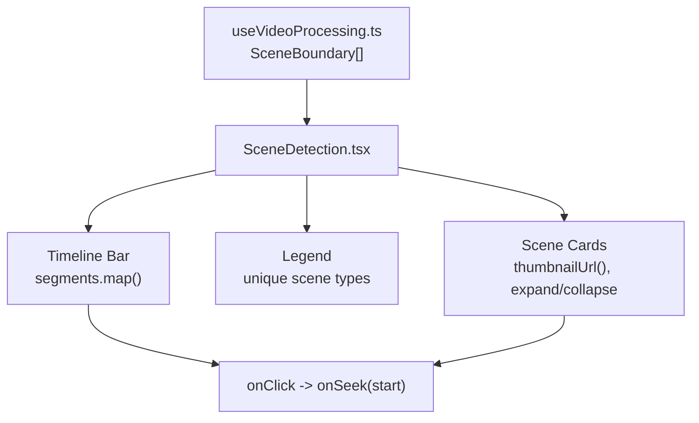
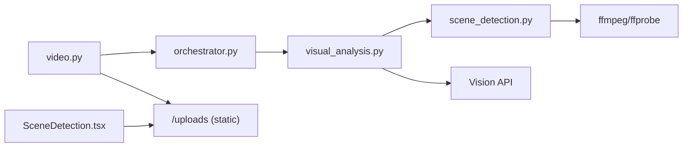

# Scene Detection Module

<cite>
**Referenced Files in This Document**
- [scene_detection.py](file://backend/pipeline/scene_detection.py)
- [visual_analysis.py](file://backend/pipeline/visual_analysis.py)
- [orchestrator.py](file://backend/pipeline/orchestrator.py)
- [video.py](file://backend/routers/video.py)
- [main.py](file://backend/main.py)
- [run_pipeline.py](file://backend/run_pipeline.py)
- [SceneDetection.tsx](file://frontend/src/components/archive/SceneDetection.tsx)
- [useVideoProcessing.ts](file://frontend/src/lib/useVideoProcessing.ts)
</cite>

## Table of Contents
1. [Introduction](#introduction)
2. [Project Structure](#project-structure)
3. [Core Components](#core-components)
4. [Architecture Overview](#architecture-overview)
5. [Detailed Component Analysis](#detailed-component-analysis)
6. [Dependency Analysis](#dependency-analysis)
7. [Performance Considerations](#performance-considerations)
8. [Troubleshooting Guide](#troubleshooting-guide)
9. [Conclusion](#conclusion)

## Introduction
This document explains the Scene Detection module that powers shot boundary detection and representative frame extraction for video analysis. It integrates with a broader media processing pipeline to provide scene segments, thumbnails, and metadata used by downstream visual analysis, face recognition, and search indexing. The frontend provides an interactive timeline and scene list for users to navigate and understand detected scenes.

## Project Structure
The scene detection functionality spans backend modules and a dedicated frontend component:
- Backend:
  - Core logic resides in the scene detection module and is invoked by the visual analysis stage.
  - The orchestrator coordinates stages and persists results.
  - API routes expose upload, status, and metadata endpoints; the server mounts static files for serving extracted frames.
- Frontend:
  - A React component renders a color-coded timeline bar and expandable scene cards with thumbnails and descriptions.
  - A shared hook maps backend data into typed structures consumed by UI components.

**Diagram sources**
- [video.py:51-113](file://backend/routers/video.py#L51-L113)
- [orchestrator.py:44-111](file://backend/pipeline/orchestrator.py#L44-L111)
- [visual_analysis.py:60-118](file://backend/pipeline/visual_analysis.py#L60-L118)
- [scene_detection.py:33-104](file://backend/pipeline/scene_detection.py#L33-L104)
- [main.py:35-38](file://backend/main.py#L35-L38)
- [SceneDetection.tsx:45-82](file://frontend/src/components/archive/SceneDetection.tsx#L45-L82)
- [useVideoProcessing.ts:30-38](file://frontend/src/lib/useVideoProcessing.ts#L30-L38)

**Section sources**
- [video.py:51-113](file://backend/routers/video.py#L51-L113)
- [orchestrator.py:44-111](file://backend/pipeline/orchestrator.py#L44-L111)
- [visual_analysis.py:60-118](file://backend/pipeline/visual_analysis.py#L60-L118)
- [scene_detection.py:33-104](file://backend/pipeline/scene_detection.py#L33-L104)
- [main.py:35-38](file://backend/main.py#L35-L38)
- [SceneDetection.tsx:45-82](file://frontend/src/components/archive/SceneDetection.tsx#L45-L82)
- [useVideoProcessing.ts:30-38](file://frontend/src/lib/useVideoProcessing.ts#L30-L38)

## Core Components
- Scene Detection (ffmpeg-based):
  - Detects shot boundaries using ffmpeg’s scene-change filter.
  - Applies minimum scene length filtering and merges short adjacent scenes to cap total segments.
  - Extracts one canonical frame per scene (midpoint) plus extra frames for long shots to capture lower-thirds and overlays.
- Visual Analysis Integration:
  - Calls scene detection, extracts frames, encodes them as base64, and sends them to a vision model.
  - Attaches start/end timestamps and thumbnail URLs back to scene entries.
- Orchestrator:
  - Runs the visual analysis stage and persists results, including scene detection metadata.
- API Layer:
  - Upload triggers background pipeline execution; metadata endpoint returns scenes and thumbnails.
- Frontend Visualization:
  - Renders a segmented timeline bar and scene cards with thumbnails, time ranges, and descriptions.

**Section sources**
- [scene_detection.py:33-104](file://backend/pipeline/scene_detection.py#L33-L104)
- [scene_detection.py:107-194](file://backend/pipeline/scene_detection.py#L107-L194)
- [visual_analysis.py:60-118](file://backend/pipeline/visual_analysis.py#L60-L118)
- [visual_analysis.py:228-275](file://backend/pipeline/visual_analysis.py#L228-L275)
- [orchestrator.py:94-111](file://backend/pipeline/orchestrator.py#L94-L111)
- [video.py:138-172](file://backend/routers/video.py#L138-L172)
- [SceneDetection.tsx:45-82](file://frontend/src/components/archive/SceneDetection.tsx#L45-L82)

## Architecture Overview
The scene detection flow is embedded within the visual analysis stage. The orchestrator calls visual analysis, which uses ffmpeg to detect cuts, extract frames, and send them to a vision model. Results are persisted and served via the API. The frontend consumes these results to render the scene timeline and details.

**Diagram sources**
- [video.py:51-113](file://backend/routers/video.py#L51-L113)
- [run_pipeline.py:22-35](file://backend/run_pipeline.py#L22-L35)
- [orchestrator.py:94-111](file://backend/pipeline/orchestrator.py#L94-L111)
- [visual_analysis.py:60-118](file://backend/pipeline/visual_analysis.py#L60-L118)
- [visual_analysis.py:228-275](file://backend/pipeline/visual_analysis.py#L228-L275)
- [scene_detection.py:33-104](file://backend/pipeline/scene_detection.py#L33-L104)
- [scene_detection.py:107-194](file://backend/pipeline/scene_detection.py#L107-L194)
- [main.py:35-38](file://backend/main.py#L35-L38)

## Detailed Component Analysis

### Scene Detection Engine
Responsibilities:
- Run ffmpeg’s scene-change filter to find candidate cut timestamps.
- Filter out too-close cuts based on a minimum scene length.
- Ensure coverage from start to end, falling back to uniform segmentation when needed.
- Merge shortest segments to respect a maximum number of scenes.
- Plan and extract representative frames per scene: midpoint plus extras spaced through long shots.

Key behaviors:
- Threshold tuning balances sensitivity to hard cuts vs soft transitions.
- Extra frames improve OCR and identification of lower-third text.
- Frame budget caps ensure efficient use of downstream vision model tokens.

**Diagram sources**
- [scene_detection.py:33-104](file://backend/pipeline/scene_detection.py#L33-L104)
- [scene_detection.py:224-238](file://backend/pipeline/scene_detection.py#L224-L238)
- [scene_detection.py:241-265](file://backend/pipeline/scene_detection.py#L241-L265)

**Section sources**
- [scene_detection.py:33-104](file://backend/pipeline/scene_detection.py#L33-L104)
- [scene_detection.py:197-221](file://backend/pipeline/scene_detection.py#L197-L221)
- [scene_detection.py:224-238](file://backend/pipeline/scene_detection.py#L224-L238)
- [scene_detection.py:241-265](file://backend/pipeline/scene_detection.py#L241-L265)

### Representative Frame Extraction
Responsibilities:
- Clean previous frames to reflect current analysis.
- Plan canonical midpoints per scene and extra candidates for long shots.
- Apply a global frame budget and prefer longer shots for extra frames.
- Execute ffmpeg to extract single frames at planned timestamps.
- Sort and return ordered frame records.

**Diagram sources**
- [scene_detection.py:107-194](file://backend/pipeline/scene_detection.py#L107-L194)

**Section sources**
- [scene_detection.py:107-194](file://backend/pipeline/scene_detection.py#L107-L194)

### Visual Analysis Integration
Responsibilities:
- Obtain video duration via ffprobe.
- Invoke scene detection and frame extraction.
- Encode frames to base64 and construct a multimodal prompt with scene references.
- Call the vision model and parse its JSON response robustly.
- Attach start/end timestamps and thumbnail URLs to each scene entry.
- Persist scene_detection metadata alongside analysis results.

**Diagram sources**
- [visual_analysis.py:60-118](file://backend/pipeline/visual_analysis.py#L60-L118)
- [visual_analysis.py:228-275](file://backend/pipeline/visual_analysis.py#L228-L275)
- [scene_detection.py:33-104](file://backend/pipeline/scene_detection.py#L33-L104)
- [scene_detection.py:107-194](file://backend/pipeline/scene_detection.py#L107-L194)

**Section sources**
- [visual_analysis.py:60-118](file://backend/pipeline/visual_analysis.py#L60-L118)
- [visual_analysis.py:228-275](file://backend/pipeline/visual_analysis.py#L228-L275)
- [visual_analysis.py:278-300](file://backend/pipeline/visual_analysis.py#L278-L300)
- [visual_analysis.py:313-396](file://backend/pipeline/visual_analysis.py#L313-L396)

### Pipeline Orchestration and Persistence
Responsibilities:
- Execute the visual analysis stage and persist results.
- Build searchable segments combining scenes, transcript, and person mentions.
- Maintain status tracking across stages.

**Diagram sources**
- [orchestrator.py:94-111](file://backend/pipeline/orchestrator.py#L94-L111)
- [orchestrator.py:201-203](file://backend/pipeline/orchestrator.py#L201-L203)

**Section sources**
- [orchestrator.py:94-111](file://backend/pipeline/orchestrator.py#L94-L111)
- [orchestrator.py:201-203](file://backend/pipeline/orchestrator.py#L201-L203)

### API Exposure and Static Serving
Responsibilities:
- Accept uploads and launch the pipeline in a separate process.
- Provide status and metadata endpoints.
- Serve uploaded artifacts (including scene frames) via a static mount.

**Diagram sources**
- [video.py:51-113](file://backend/routers/video.py#L51-L113)
- [video.py:138-172](file://backend/routers/video.py#L138-L172)
- [main.py:35-38](file://backend/main.py#L35-L38)

**Section sources**
- [video.py:51-113](file://backend/routers/video.py#L51-L113)
- [video.py:138-172](file://backend/routers/video.py#L138-L172)
- [main.py:35-38](file://backend/main.py#L35-L38)

### Frontend Scene Visualization
Responsibilities:
- Render a segmented timeline bar colored by scene type.
- Show active scene highlighting based on current playback time.
- Display scene cards with thumbnails, time ranges, descriptions, and optional Arabic text.
- Support seeking to scene start times.

**Diagram sources**
- [useVideoProcessing.ts:30-38](file://frontend/src/lib/useVideoProcessing.ts#L30-L38)
- [SceneDetection.tsx:45-82](file://frontend/src/components/archive/SceneDetection.tsx#L45-L82)
- [SceneDetection.tsx:85-129](file://frontend/src/components/archive/SceneDetection.tsx#L85-L129)
- [SceneDetection.tsx:131-212](file://frontend/src/components/archive/SceneDetection.tsx#L131-L212)

**Section sources**
- [SceneDetection.tsx:45-82](file://frontend/src/components/archive/SceneDetection.tsx#L45-L82)
- [SceneDetection.tsx:85-129](file://frontend/src/components/archive/SceneDetection.tsx#L85-L129)
- [SceneDetection.tsx:131-212](file://frontend/src/components/archive/SceneDetection.tsx#L131-L212)
- [useVideoProcessing.ts:30-38](file://frontend/src/lib/useVideoProcessing.ts#L30-L38)

## Dependency Analysis
- Backend dependencies:
  - Visual analysis depends on scene detection for segment planning and frame extraction.
  - Orchestrator depends on visual analysis and persists outputs.
  - API router depends on orchestrator and filesystem for artifact serving.
- External tools:
  - ffmpeg and ffprobe are required for scene detection and duration probing.
  - Vision API is called for comprehensive scene understanding.
- Frontend dependencies:
  - SceneDetection component consumes structured scene data and serves thumbnails via the mounted /uploads path.

**Diagram sources**
- [video.py:51-113](file://backend/routers/video.py#L51-L113)
- [orchestrator.py:94-111](file://backend/pipeline/orchestrator.py#L94-L111)
- [visual_analysis.py:60-118](file://backend/pipeline/visual_analysis.py#L60-L118)
- [scene_detection.py:33-104](file://backend/pipeline/scene_detection.py#L33-L104)
- [main.py:35-38](file://backend/main.py#L35-L38)
- [SceneDetection.tsx:45-82](file://frontend/src/components/archive/SceneDetection.tsx#L45-L82)

**Section sources**
- [video.py:51-113](file://backend/routers/video.py#L51-L113)
- [orchestrator.py:94-111](file://backend/pipeline/orchestrator.py#L94-L111)
- [visual_analysis.py:60-118](file://backend/pipeline/visual_analysis.py#L60-L118)
- [scene_detection.py:33-104](file://backend/pipeline/scene_detection.py#L33-L104)
- [main.py:35-38](file://backend/main.py#L35-L38)
- [SceneDetection.tsx:45-82](file://frontend/src/components/archive/SceneDetection.tsx#L45-L82)

## Performance Considerations
- Frame budgeting:
  - Global frame cap prevents excessive token usage and reduces latency.
  - Preferential sampling of longer shots improves identification accuracy where it matters most.
- Merging strategy:
  - Shortest-first merging reduces fragmentation while preserving overall temporal coverage.
- I/O efficiency:
  - Cleaning old frames ensures deterministic outputs and avoids stale artifacts.
- Concurrency:
  - ffmpeg calls are executed off the event loop to avoid blocking the server.
- Robustness:
  - Graceful fallback to uniform segmentation maintains downstream usability when detection fails.

[No sources needed since this section provides general guidance]

## Troubleshooting Guide
Common issues and resolutions:
- No scenes detected or empty segments:
  - Check ffmpeg availability and permissions.
  - Verify video file integrity and format compatibility.
  - Inspect logs for “scene filter failed” warnings and adjust threshold if necessary.
- Missing thumbnails:
  - Confirm frames were written under /uploads/<id>/scenes.
  - Ensure the static mount path matches the relative path returned by the backend.
- Vision API errors:
  - Review retry logs and HTTP status codes.
  - Validate API key configuration and network connectivity.
- Frontend not showing scenes:
  - Confirm metadata endpoint returns scenes with start/end and thumbnail fields.
  - Check browser console for CORS or asset loading errors.

**Section sources**
- [scene_detection.py:197-221](file://backend/pipeline/scene_detection.py#L197-L221)
- [visual_analysis.py:162-218](file://backend/pipeline/visual_analysis.py#L162-L218)
- [visual_analysis.py:278-300](file://backend/pipeline/visual_analysis.py#L278-L300)
- [video.py:138-172](file://backend/routers/video.py#L138-L172)
- [main.py:35-38](file://backend/main.py#L35-L38)
- [SceneDetection.tsx:8-14](file://frontend/src/components/archive/SceneDetection.tsx#L8-L14)

## Conclusion
The Scene Detection module provides robust shot boundary detection and representative frame extraction, enabling accurate visual analysis and user-friendly navigation. Its integration with the orchestration layer and API surface ensures reliable persistence and retrieval, while the frontend offers an intuitive interface for exploring scenes and associated metadata.

[No sources needed since this section summarizes without analyzing specific files]