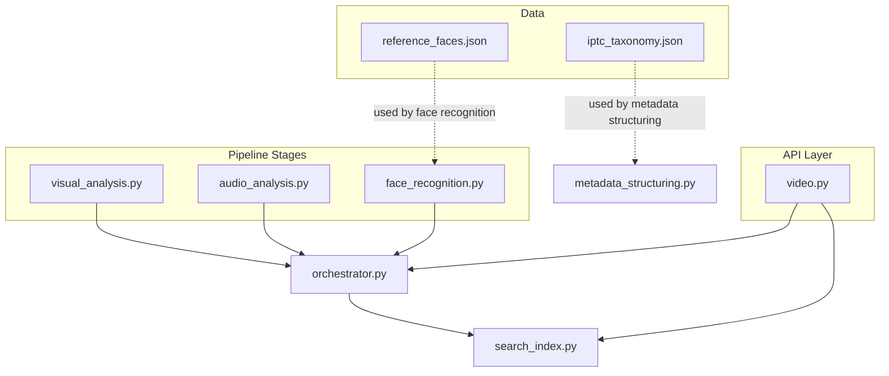
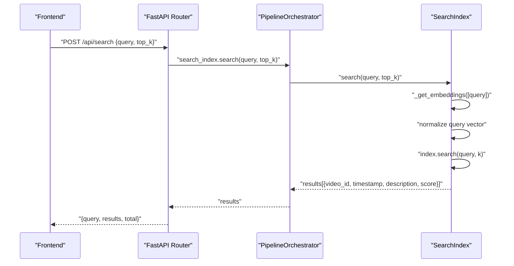
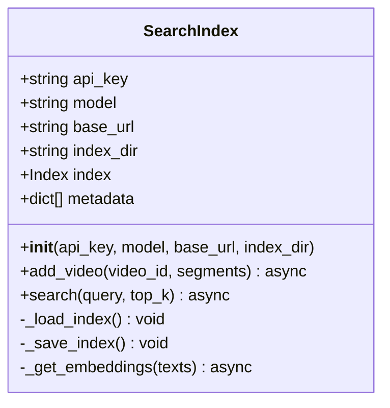
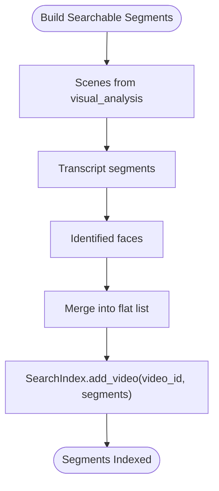
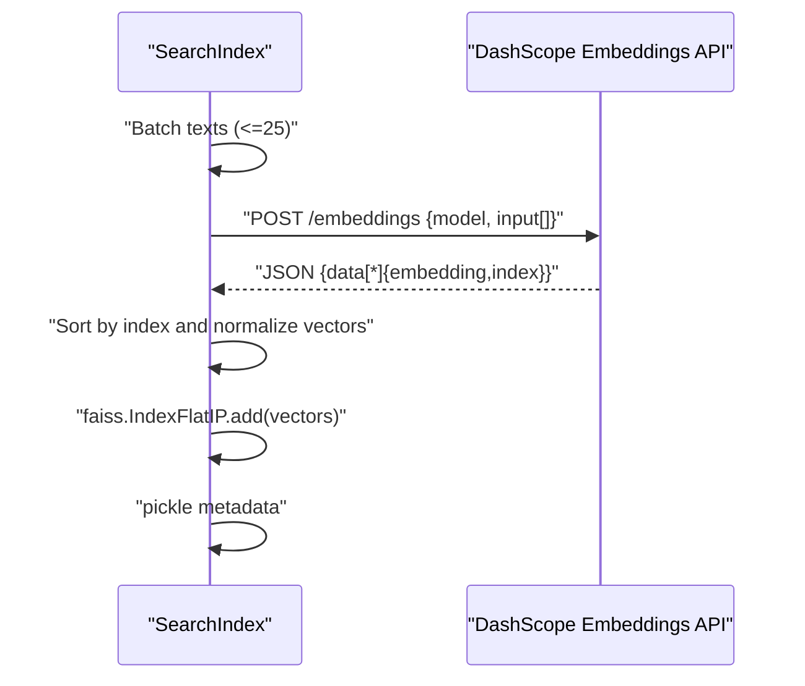
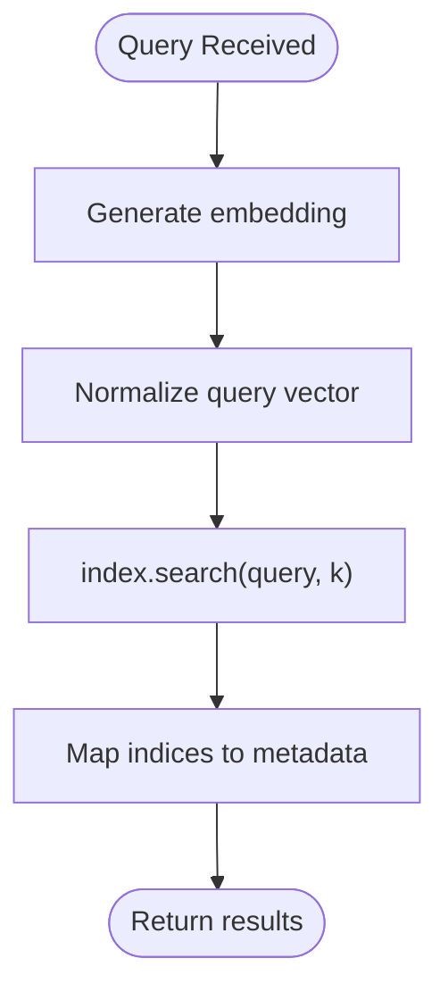
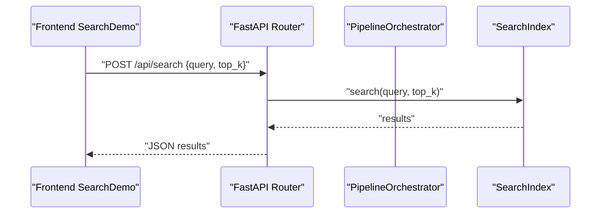
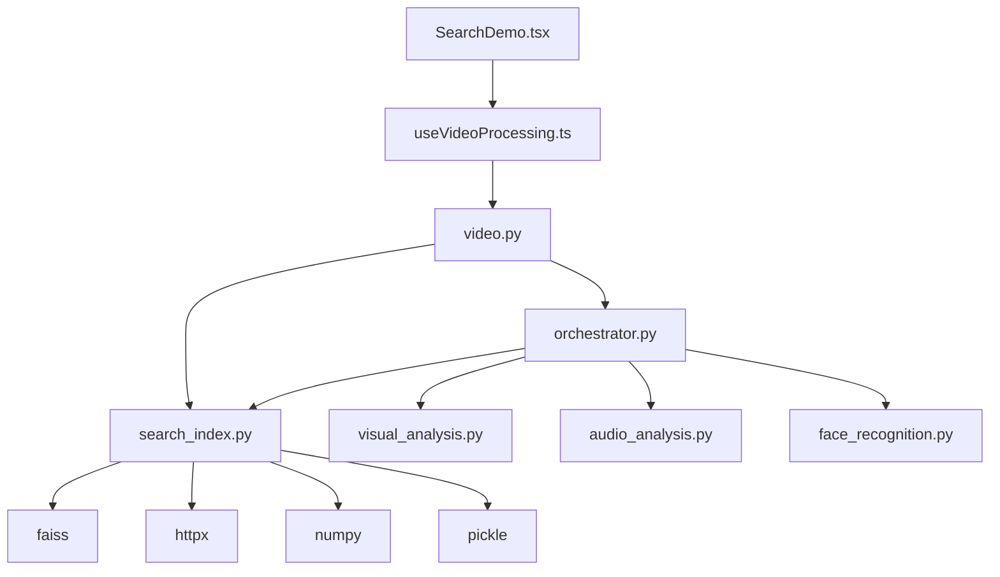

# Search Index Stage

<cite>
**Referenced Files in This Document**
- [search_index.py](file://backend/pipeline/search_index.py)
- [orchestrator.py](file://backend/pipeline/orchestrator.py)
- [metadata_structuring.py](file://backend/pipeline/metadata_structuring.py)
- [visual_analysis.py](file://backend/pipeline/visual_analysis.py)
- [audio_analysis.py](file://backend/pipeline/audio_analysis.py)
- [face_recognition.py](file://backend/pipeline/face_recognition.py)
- [config.py](file://backend/config.py)
- [video.py](file://backend/routers/video.py)
- [iptc_taxonomy.json](file://backend/data/iptc_taxonomy.json)
- [reference_faces.json](file://backend/data/reference_faces.json)
- [main.py](file://backend/main.py)
- [SearchDemo.tsx](file://frontend/src/components/archive/SearchDemo.tsx)
- [useVideoProcessing.ts](file://frontend/src/lib/useVideoProcessing.ts)
</cite>

## Table of Contents
1. [Introduction](#introduction)
2. [Project Structure](#project-structure)
3. [Core Components](#core-components)
4. [Architecture Overview](#architecture-overview)
5. [Detailed Component Analysis](#detailed-component-analysis)
6. [Dependency Analysis](#dependency-analysis)
7. [Performance Considerations](#performance-considerations)
8. [Troubleshooting Guide](#troubleshooting-guide)
9. [Conclusion](#conclusion)
10. [Appendices](#appendices)

## Introduction
This document explains the search index creation and FAISS vector embedding stage of the media archive pipeline. It covers how searchable segments are constructed from scenes, transcripts, and face recognition results, how FAISS vector indexes are built and persisted, how embeddings are generated using DashScope, and how similarity search works. It also documents integration with the IPTC taxonomy for content categorization and semantic enhancement, along with performance characteristics, maintenance, and troubleshooting guidance.

## Project Structure
The search index stage is part of a multi-stage pipeline orchestrated by a central orchestrator. The key components involved are:
- Pipeline stages that produce searchable content (visual analysis, audio transcription, face recognition)
- An orchestrator that aggregates segments into a unified searchable corpus
- A FAISS-backed search index that embeds text and supports similarity search
- API endpoints and frontend integration for search

**Diagram sources**
- [visual_analysis.py:1-176](file://backend/pipeline/visual_analysis.py#L1-L176)
- [audio_analysis.py:1-241](file://backend/pipeline/audio_analysis.py#L1-L241)
- [face_recognition.py:1-215](file://backend/pipeline/face_recognition.py#L1-L215)
- [metadata_structuring.py:1-252](file://backend/pipeline/metadata_structuring.py#L1-L252)
- [orchestrator.py:1-329](file://backend/pipeline/orchestrator.py#L1-L329)
- [search_index.py:1-245](file://backend/pipeline/search_index.py#L1-L245)
- [video.py:1-267](file://backend/routers/video.py#L1-L267)

**Section sources**
- [search_index.py:1-245](file://backend/pipeline/search_index.py#L1-L245)
- [orchestrator.py:1-329](file://backend/pipeline/orchestrator.py#L1-L329)
- [video.py:1-267](file://backend/routers/video.py#L1-L267)

## Core Components
- SearchIndex: FAISS-based vector search index with DashScope text embeddings. Handles loading/saving the index, building searchable segments, generating embeddings, normalizing vectors, adding to the index, and performing similarity search.
- PipelineOrchestrator: Coordinates pipeline stages and builds searchable segments from visual analysis, transcript, and face recognition outputs.
- DashScope integrations: Embedding generation for searchable content and various AI tasks (visual analysis, ASR, face matching, metadata structuring).
- API endpoints: Expose upload, status, metadata, transcript, and search endpoints; the search endpoint delegates to the SearchIndex.
- Frontend: Provides a semantic search UI that triggers search requests and displays results.

Key implementation references:
- SearchIndex initialization, embedding dimension, index directory, and FAISS index creation/loading
- Segment building from scenes, transcript, and faces
- Embedding generation via DashScope embeddings API with retries and exponential backoff
- Vector normalization and inner-product-based cosine similarity search
- Index persistence to disk and error handling

**Section sources**
- [search_index.py:18-87](file://backend/pipeline/search_index.py#L18-L87)
- [search_index.py:88-155](file://backend/pipeline/search_index.py#L88-L155)
- [search_index.py:156-196](file://backend/pipeline/search_index.py#L156-L196)
- [search_index.py:198-244](file://backend/pipeline/search_index.py#L198-L244)
- [orchestrator.py:283-314](file://backend/pipeline/orchestrator.py#L283-L314)
- [video.py:200-216](file://backend/routers/video.py#L200-L216)

## Architecture Overview
The search index stage participates in a six-stage pipeline:
1. Ingestion
2. Visual analysis (Qwen-VL)
3. Audio analysis (ASR)
4. Face recognition (Qwen text model)
5. Metadata structuring (IPTC taxonomy)
6. Search index (FAISS + embeddings)

The orchestrator aggregates segments from stages 2–5 and adds them to the FAISS index. The API exposes a POST /api/search endpoint that performs semantic search across the index.

**Diagram sources**
- [video.py:200-216](file://backend/routers/video.py#L200-L216)
- [orchestrator.py:34-42](file://backend/pipeline/orchestrator.py#L34-L42)
- [search_index.py:156-196](file://backend/pipeline/search_index.py#L156-L196)
- [search_index.py:198-244](file://backend/pipeline/search_index.py#L198-L244)

## Detailed Component Analysis

### SearchIndex: FAISS Vector Embedding and Similarity Search
The SearchIndex class encapsulates:
- Index lifecycle: creation, loading, saving
- Segment ingestion: collecting textual descriptions from scenes, transcripts, and faces
- Embedding generation: batching and calling DashScope embeddings API
- Vector normalization and addition to FAISS index
- Similarity search: normalized query vectors, inner product (cosine similarity), top-k retrieval

**Diagram sources**
- [search_index.py:22-41](file://backend/pipeline/search_index.py#L22-L41)
- [search_index.py:88-155](file://backend/pipeline/search_index.py#L88-L155)
- [search_index.py:156-196](file://backend/pipeline/search_index.py#L156-L196)
- [search_index.py:198-244](file://backend/pipeline/search_index.py#L198-L244)

Key behaviors:
- Embedding dimension: 1024 (DashScope text-embedding-v3)
- Batch embedding: up to 25 texts per API call
- Normalization: L2-normalization applied to vectors and query for cosine similarity
- Persistence: FAISS index and metadata pickled to disk
- Robustness: retries with exponential backoff; zero-vector fallback on embedding failure

Example usage references:
- Adding segments for a video
- Performing a similarity search with configurable top_k

**Section sources**
- [search_index.py:18-19](file://backend/pipeline/search_index.py#L18-L19)
- [search_index.py:105-154](file://backend/pipeline/search_index.py#L105-L154)
- [search_index.py:156-196](file://backend/pipeline/search_index.py#L156-L196)
- [search_index.py:198-244](file://backend/pipeline/search_index.py#L198-L244)

### Searchable Segment Construction from Scenes, Transcripts, and Faces
The orchestrator composes a flat list of searchable segments from:
- Scenes: description_en, timestamp, scene_type, type=scene
- Transcript: text, start_time, type=transcript
- Identified faces: name_en and role, timestamp, type=person

These segments are passed to SearchIndex.add_video, which extracts textual descriptions and metadata for indexing.

**Diagram sources**
- [orchestrator.py:283-314](file://backend/pipeline/orchestrator.py#L283-L314)
- [visual_analysis.py:15-40](file://backend/pipeline/visual_analysis.py#L15-L40)
- [audio_analysis.py:190-229](file://backend/pipeline/audio_analysis.py#L190-L229)
- [face_recognition.py:54-107](file://backend/pipeline/face_recognition.py#L54-L107)

**Section sources**
- [orchestrator.py:283-314](file://backend/pipeline/orchestrator.py#L283-L314)
- [visual_analysis.py:15-40](file://backend/pipeline/visual_analysis.py#L15-L40)
- [audio_analysis.py:190-229](file://backend/pipeline/audio_analysis.py#L190-L229)
- [face_recognition.py:54-107](file://backend/pipeline/face_recognition.py#L54-L107)

### FAISS Vector Index Implementation and Embedding Generation
- Index type: Flat inner-product (IndexFlatIP) with dimension 1024
- Embedding provider: DashScope embeddings API
- Request batching: up to 25 texts per call
- Retry/backoff: up to three attempts with exponential backoff
- Fallback: zero vectors if embedding fails
- Normalization: vectors and query are L2-normalized before similarity computation

**Diagram sources**
- [search_index.py:129-154](file://backend/pipeline/search_index.py#L129-L154)
- [search_index.py:198-244](file://backend/pipeline/search_index.py#L198-L244)

**Section sources**
- [search_index.py:18-19](file://backend/pipeline/search_index.py#L18-L19)
- [search_index.py:129-154](file://backend/pipeline/search_index.py#L129-L154)
- [search_index.py:198-244](file://backend/pipeline/search_index.py#L198-L244)

### Similarity Search Capabilities
- Query processing: generate embedding for the query, normalize
- Search: compute inner product with all indexed vectors, return top_k
- Results: include video_id, timestamp, description, scene_type, and score

**Diagram sources**
- [search_index.py:156-196](file://backend/pipeline/search_index.py#L156-L196)

**Section sources**
- [search_index.py:156-196](file://backend/pipeline/search_index.py#L156-L196)

### Integration with IPTC Taxonomy for Content Categorization
While the IPTC taxonomy is not directly used by the SearchIndex, it is leveraged during metadata structuring to enrich content with topic codes and bilingual descriptions. These topics can indirectly improve semantic richness of the indexed content because:
- Topic codes and names enhance the textual descriptions used for embeddings
- Structured metadata improves downstream search quality

**Diagram sources**
- [iptc_taxonomy.json:1-28](file://backend/data/iptc_taxonomy.json#L1-L28)
- [metadata_structuring.py:22-32](file://backend/pipeline/metadata_structuring.py#L22-L32)
- [metadata_structuring.py:103-112](file://backend/pipeline/metadata_structuring.py#L103-L112)
- [orchestrator.py:283-314](file://backend/pipeline/orchestrator.py#L283-L314)

**Section sources**
- [iptc_taxonomy.json:1-28](file://backend/data/iptc_taxonomy.json#L1-L28)
- [metadata_structuring.py:22-32](file://backend/pipeline/metadata_structuring.py#L22-L32)
- [metadata_structuring.py:103-112](file://backend/pipeline/metadata_structuring.py#L103-L112)
- [orchestrator.py:283-314](file://backend/pipeline/orchestrator.py#L283-L314)

### Index Persistence and Maintenance
- Persistence: FAISS index and metadata are saved to disk under the data/search_index directory
- Loading: on initialization, the index and metadata are restored if present
- Maintenance: periodic rebuilds may be necessary after large-scale updates; consider incremental updates if FAISS supports them in future iterations

References:
- Index and metadata save/load paths
- Directory configuration

**Section sources**
- [search_index.py:42-86](file://backend/pipeline/search_index.py#L42-L86)
- [search_index.py:19-19](file://backend/pipeline/search_index.py#L19-L19)

### API and Frontend Integration
- API endpoint: POST /api/search accepts a query and top_k, returns results with video_id, timestamp, description, scene_type, and score
- Frontend: SearchDemo component allows users to enter queries and displays results with timestamps and scores
- Real-time pipeline progress is available via WebSocket

**Diagram sources**
- [SearchDemo.tsx:30-43](file://frontend/src/components/archive/SearchDemo.tsx#L30-L43)
- [useVideoProcessing.ts:352-368](file://frontend/src/lib/useVideoProcessing.ts#L352-L368)
- [video.py:200-216](file://backend/routers/video.py#L200-L216)
- [search_index.py:156-196](file://backend/pipeline/search_index.py#L156-L196)

**Section sources**
- [video.py:200-216](file://backend/routers/video.py#L200-L216)
- [SearchDemo.tsx:30-43](file://frontend/src/components/archive/SearchDemo.tsx#L30-L43)
- [useVideoProcessing.ts:352-368](file://frontend/src/lib/useVideoProcessing.ts#L352-L368)

## Dependency Analysis
- External dependencies:
  - FAISS: vector index library
  - httpx: asynchronous HTTP client for DashScope APIs
  - numpy: vector math and normalization
  - pickle: serialization of metadata
- Internal dependencies:
  - PipelineOrchestrator depends on SearchIndex and other pipeline stages
  - API router depends on orchestrator and SearchIndex for search
  - Frontend integrates with API endpoints

**Diagram sources**
- [search_index.py:13-14](file://backend/pipeline/search_index.py#L13-L14)
- [search_index.py:48-53](file://backend/pipeline/search_index.py#L48-L53)
- [orchestrator.py:14-20](file://backend/pipeline/orchestrator.py#L14-L20)
- [video.py:17-19](file://backend/routers/video.py#L17-L19)
- [SearchDemo.tsx:1-189](file://frontend/src/components/archive/SearchDemo.tsx#L1-L189)
- [useVideoProcessing.ts:1-421](file://frontend/src/lib/useVideoProcessing.ts#L1-L421)

**Section sources**
- [search_index.py:13-14](file://backend/pipeline/search_index.py#L13-L14)
- [orchestrator.py:14-20](file://backend/pipeline/orchestrator.py#L14-L20)
- [video.py:17-19](file://backend/routers/video.py#L17-L19)

## Performance Considerations
- Embedding cost: Each segment incurs an embedding call; batching reduces overhead
- Index size: Proportional to number of indexed segments; consider pruning old or low-value segments
- Search latency: Depends on index.ntotal and top_k; larger indexes increase search time
- Vector dimensionality: 1024-dimensional embeddings; normalization ensures cosine similarity via inner product
- Network reliability: Embedding API calls use retries; ensure adequate timeouts and rate limits
- Disk I/O: Frequent saves during indexing; schedule saves after bulk inserts to reduce overhead

[No sources needed since this section provides general guidance]

## Troubleshooting Guide
Common issues and resolutions:
- FAISS not installed: The module gracefully logs a warning and disables search functionality
- Missing API key: Embedding calls log warnings; embeddings fall back to zero vectors
- Empty index: Search returns empty results; ensure segments were added
- Embedding API failures: Retries with exponential backoff; check network connectivity and quotas
- Persisted index corruption: On load failure, a new index is created automatically

Operational checks:
- Verify index directory exists and is writable
- Confirm DashScope credentials and model availability
- Monitor logs for embedding API errors and retry attempts

**Section sources**
- [search_index.py:61-64](file://backend/pipeline/search_index.py#L61-L64)
- [search_index.py:200-202](file://backend/pipeline/search_index.py#L200-L202)
- [search_index.py:167-169](file://backend/pipeline/search_index.py#L167-L169)
- [search_index.py:226-240](file://backend/pipeline/search_index.py#L226-L240)
- [search_index.py:65-70](file://backend/pipeline/search_index.py#L65-L70)

## Conclusion
The search index stage creates a robust, FAISS-backed semantic search capability by combining scene descriptions, transcripts, and face identification results into a unified corpus. Using DashScope embeddings, it normalizes vectors and stores them with metadata for efficient similarity search. Integration with IPTC taxonomy during metadata structuring further enriches content semantics. The system balances performance with resilience through batching, normalization, retries, and persistence.

[No sources needed since this section summarizes without analyzing specific files]

## Appendices

### Example: Creating Searchable Content
- From visual analysis: include scene descriptions with timestamps and scene types
- From transcript: include text segments with start times
- From face recognition: include identified person mentions with roles and timestamps

These are merged into a flat list and passed to SearchIndex.add_video.

**Section sources**
- [orchestrator.py:283-314](file://backend/pipeline/orchestrator.py#L283-L314)
- [visual_analysis.py:15-40](file://backend/pipeline/visual_analysis.py#L15-L40)
- [audio_analysis.py:190-229](file://backend/pipeline/audio_analysis.py#L190-L229)
- [face_recognition.py:54-107](file://backend/pipeline/face_recognition.py#L54-L107)

### Example: Vector Dimensionality and Index Size
- Embedding dimension: 1024
- Index type: Flat inner product (IndexFlatIP)
- Index size grows linearly with number of segments; monitor ntotal and adjust top_k accordingly

**Section sources**
- [search_index.py:18-19](file://backend/pipeline/search_index.py#L18-L19)
- [search_index.py:58-59](file://backend/pipeline/search_index.py#L58-L59)

### Example: Search Queries, Ranking, and Relevance
- Query: natural language description
- Ranking: cosine similarity via inner product; higher score indicates greater relevance
- Relevance factors: textual match quality, scene type descriptors, speaker identity mentions

**Section sources**
- [search_index.py:156-196](file://backend/pipeline/search_index.py#L156-L196)

### Example: Index Persistence Paths
- FAISS index file: data/search_index/faiss.index
- Metadata file: data/search_index/metadata.pkl

**Section sources**
- [search_index.py:19-44](file://backend/pipeline/search_index.py#L19-L44)

### Example: Frontend Search Interaction
- UI component: SearchDemo renders results with timestamps and scores
- Hook: useVideoProcessing manages search state and invokes API

**Section sources**
- [SearchDemo.tsx:107-167](file://frontend/src/components/archive/SearchDemo.tsx#L107-L167)
- [useVideoProcessing.ts:352-368](file://frontend/src/lib/useVideoProcessing.ts#L352-L368)