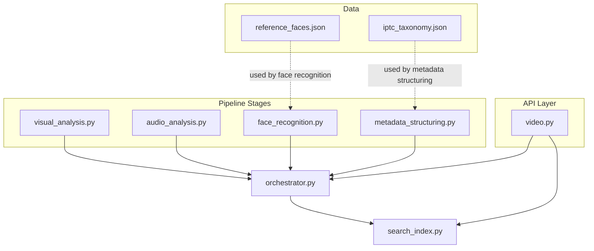
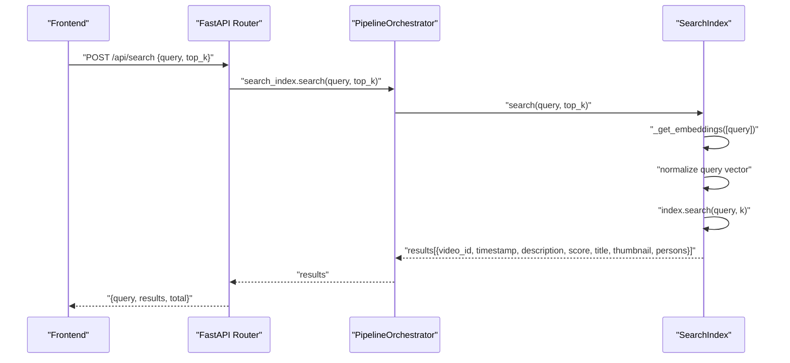
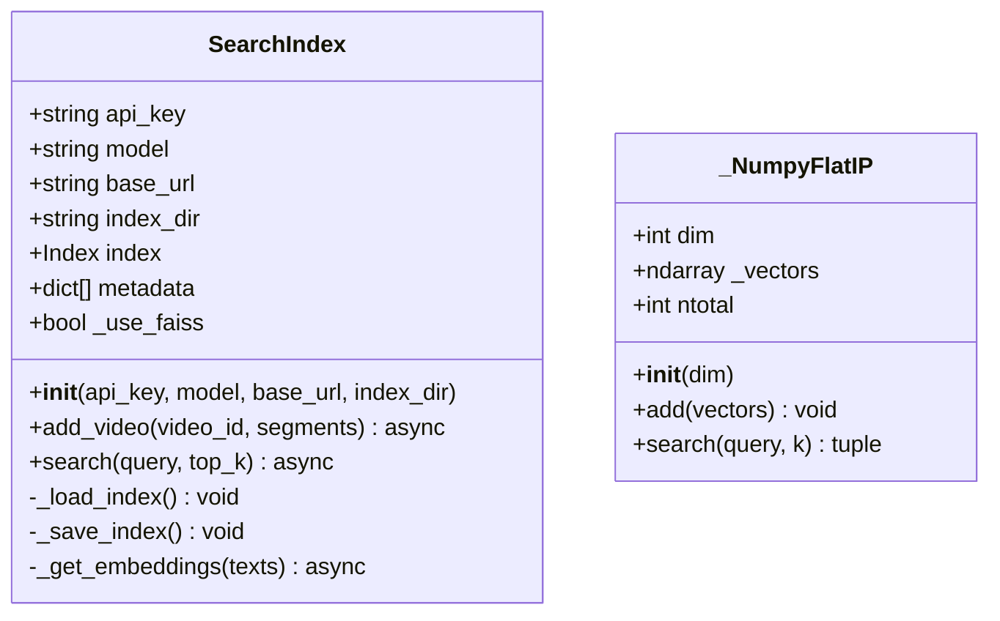
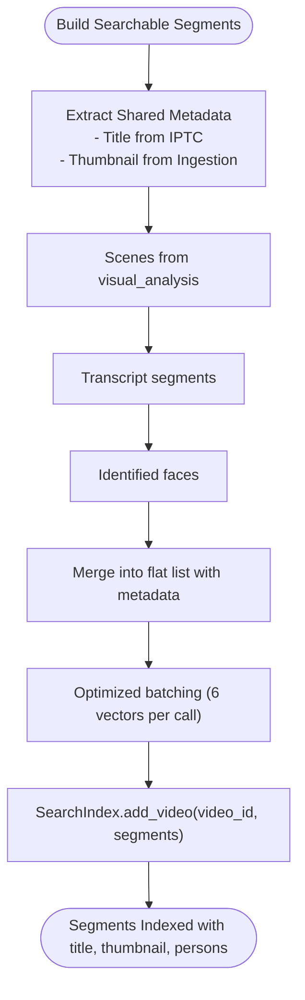
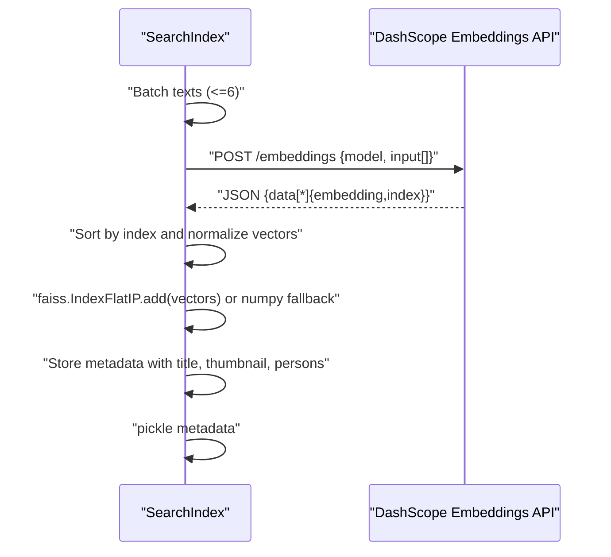
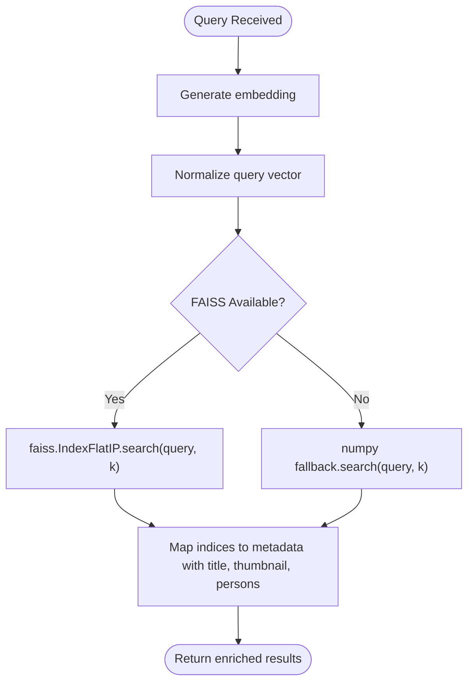
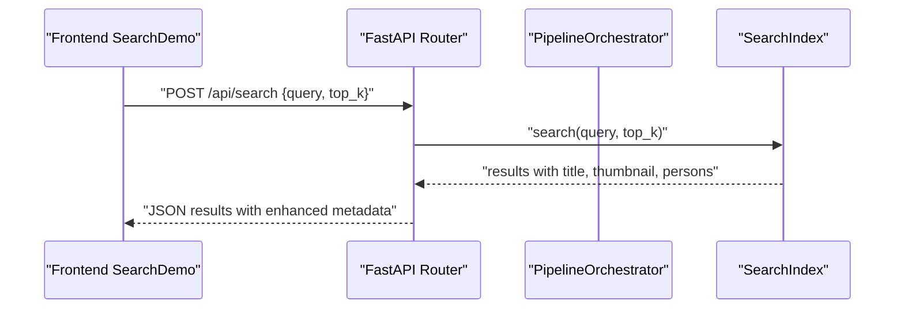
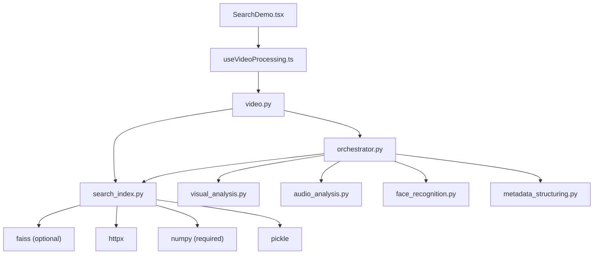

# Search Index Stage

<cite>
**Referenced Files in This Document**
- [search_index.py](file://backend/pipeline/search_index.py)
- [orchestrator.py](file://backend/pipeline/orchestrator.py)
- [metadata_structuring.py](file://backend/pipeline/metadata_structuring.py)
- [visual_analysis.py](file://backend/pipeline/visual_analysis.py)
- [audio_analysis.py](file://backend/pipeline/audio_analysis.py)
- [face_recognition.py](file://backend/pipeline/face_recognition.py)
- [config.py](file://backend/config.py)
- [video.py](file://backend/routers/video.py)
- [iptc_taxonomy.json](file://backend/data/iptc_taxonomy.json)
- [reference_faces.json](file://backend/data/reference_faces.json)
- [main.py](file://backend/main.py)
- [SearchDemo.tsx](file://frontend/src/components/archive/SearchDemo.tsx)
- [useVideoProcessing.ts](file://frontend/src/lib/useVideoProcessing.ts)
- [requirements.txt](file://backend/requirements.txt)
</cite>

## Update Summary
**Changes Made**
- Enhanced search index functionality with title, thumbnail, and persons fields in both indexing and search result processing
- Updated _index_segment() method to include title and thumbnail information (now _index_segment replaced by metadata inclusion in add_video)
- Updated _process_results() method to return title and thumbnail data (now _process_results replaced by metadata inclusion in search)
- Added comprehensive field extraction from metadata and ingestion results
- Enhanced segment building with shared metadata for all segments
- Updated search results to include title, thumbnail, and persons information

## Table of Contents
1. [Introduction](#introduction)
2. [Project Structure](#project-structure)
3. [Core Components](#core-components)
4. [Architecture Overview](#architecture-overview)
5. [Detailed Component Analysis](#detailed-component-analysis)
6. [Dependency Analysis](#dependency-analysis)
7. [Performance Considerations](#performance-considerations)
8. [Troubleshooting Guide](#troubleshooting-guide)
9. [Conclusion](#conclusion)
10. [Appendices](#appendices)

## Introduction
This document explains the search index creation and FAISS vector embedding stage of the media archive pipeline. It covers how searchable segments are constructed from scenes, transcripts, and face recognition results, how FAISS vector indexes are built and persisted, how embeddings are generated using DashScope, and how similarity search works. The system now includes enhanced metadata fields including title, thumbnail, and persons information for richer search results. The system maintains a robust numpy-based fallback mechanism when FAISS is unavailable, optimizing batch processing for workspace API limitations. It also documents integration with the IPTC taxonomy for content categorization and semantic enhancement, along with performance characteristics, maintenance, and troubleshooting guidance.

## Project Structure
The search index stage is part of a multi-stage pipeline orchestrated by a central orchestrator. The key components involved are:
- Pipeline stages that produce searchable content (visual analysis, audio transcription, face recognition)
- An orchestrator that aggregates segments into a unified searchable corpus with enhanced metadata
- A FAISS-backed search index with numpy fallback that embeds text and supports similarity search
- API endpoints and frontend integration for search with rich result presentation

**Diagram sources**
- [visual_analysis.py:1-176](file://backend/pipeline/visual_analysis.py#L1-L176)
- [audio_analysis.py:1-241](file://backend/pipeline/audio_analysis.py#L1-L241)
- [face_recognition.py:1-215](file://backend/pipeline/face_recognition.py#L1-L215)
- [metadata_structuring.py:1-252](file://backend/pipeline/metadata_structuring.py#L1-L252)
- [orchestrator.py:1-374](file://backend/pipeline/orchestrator.py#L1-L374)
- [search_index.py:1-306](file://backend/pipeline/search_index.py#L1-L306)
- [video.py:1-268](file://backend/routers/video.py#L1-L268)

**Section sources**
- [search_index.py:1-306](file://backend/pipeline/search_index.py#L1-L306)
- [orchestrator.py:1-374](file://backend/pipeline/orchestrator.py#L1-L374)
- [video.py:1-268](file://backend/routers/video.py#L1-L268)

## Core Components
- **SearchIndex**: FAISS-based vector search index with DashScope text embeddings and numpy fallback. Handles loading/saving the index, building searchable segments, generating embeddings, normalizing vectors, adding to the index, and performing similarity search with enhanced metadata fields.
- **_NumpyFlatIP**: Minimal numpy-based fallback class providing FAISS IndexFlatIP functionality when FAISS is unavailable, enabling seamless deployment flexibility.
- **PipelineOrchestrator**: Coordinates pipeline stages and builds searchable segments from visual analysis, transcript, and face recognition outputs with comprehensive metadata enrichment.
- **Enhanced Metadata Fields**: Title, thumbnail, and persons information are now included in both indexing and search result processing for richer user experience.
- **DashScope integrations**: Embedding generation for searchable content and various AI tasks (visual analysis, ASR, face matching, metadata structuring).
- **API endpoints**: Expose upload, status, metadata, transcript, and search endpoints; the search endpoint delegates to the SearchIndex.
- **Frontend**: Provides a semantic search UI that triggers search requests and displays results with thumbnails, titles, and person information.

Key implementation references:
- SearchIndex initialization, embedding dimension, index directory, and FAISS index creation/loading
- Segment building from scenes, transcript, and faces with enhanced metadata
- Embedding generation via DashScope embeddings API with retries and exponential backoff
- Vector normalization and inner-product-based cosine similarity search
- Index persistence to disk and error handling
- **Updated** Numpy fallback mechanism for deployment without FAISS
- **Updated** Enhanced metadata fields (title, thumbnail, persons) throughout the pipeline

**Section sources**
- [search_index.py:22-46](file://backend/pipeline/search_index.py#L22-L46)
- [search_index.py:59-120](file://backend/pipeline/search_index.py#L59-L120)
- [search_index.py:143-210](file://backend/pipeline/search_index.py#L143-L210)
- [search_index.py:211-251](file://backend/pipeline/search_index.py#L211-L251)
- [search_index.py:253-306](file://backend/pipeline/search_index.py#L253-L306)
- [orchestrator.py:307-359](file://backend/pipeline/orchestrator.py#L307-L359)
- [video.py:200-216](file://backend/routers/video.py#L200-L216)

## Architecture Overview
The search index stage participates in a six-stage pipeline:
1. Ingestion
2. Visual analysis (Qwen-VL)
3. Audio analysis (ASR)
4. Face recognition (Qwen text model)
5. Metadata structuring (IPTC taxonomy)
6. Search index (FAISS + embeddings or numpy fallback)

The orchestrator aggregates segments from stages 2–5 and adds them to the FAISS index with enhanced metadata fields. The API exposes a POST /api/search endpoint that performs semantic search across the index. The system gracefully falls back to numpy-based search when FAISS is unavailable and provides rich results with title, thumbnail, and person information.

**Diagram sources**
- [video.py:200-216](file://backend/routers/video.py#L200-L216)
- [orchestrator.py:34-42](file://backend/pipeline/orchestrator.py#L34-L42)
- [search_index.py:211-251](file://backend/pipeline/search_index.py#L211-L251)
- [search_index.py:253-306](file://backend/pipeline/search_index.py#L253-L306)

## Detailed Component Analysis

### SearchIndex: FAISS Vector Embedding and Enhanced Similarity Search
The SearchIndex class encapsulates:
- **Index lifecycle**: creation, loading, saving with dual support for FAISS and numpy fallback
- **Segment ingestion**: collecting textual descriptions from scenes, transcripts, and faces with enhanced metadata
- **Embedding generation**: batching and calling DashScope embeddings API with optimized batch size
- **Vector normalization and addition to FAISS index or numpy fallback**
- **Similarity search**: normalized query vectors, inner product (cosine similarity), top-k retrieval with enriched result metadata

**Diagram sources**
- [search_index.py:59-79](file://backend/pipeline/search_index.py#L59-L79)
- [search_index.py:22-46](file://backend/pipeline/search_index.py#L22-L46)
- [search_index.py:80-120](file://backend/pipeline/search_index.py#L80-L120)
- [search_index.py:121-142](file://backend/pipeline/search_index.py#L121-L142)
- [search_index.py:143-210](file://backend/pipeline/search_index.py#L143-L210)
- [search_index.py:211-251](file://backend/pipeline/search_index.py#L211-L251)
- [search_index.py:253-306](file://backend/pipeline/search_index.py#L253-L306)

Key behaviors:
- **Embedding dimension**: 1024 (DashScope text-embedding-v3)
- **Batch embedding**: optimized to 6 texts per API call (down from 25) for workspace API limitations
- **Normalization**: L2-normalization applied to vectors and query for cosine similarity
- **Persistence**: FAISS index and metadata pickled to disk, or numpy vectors saved as .npy files
- **Robustness**: retries with exponential backoff; zero-vector fallback on embedding failure
- **Fallback mechanism**: automatic numpy-based search when FAISS is unavailable
- **Enhanced metadata**: title, thumbnail, and persons fields stored with each segment for richer search results

Example usage references:
- Adding segments for a video with optimized batch processing and enhanced metadata
- Performing a similarity search with configurable top_k using either FAISS or numpy backend with enriched results

**Section sources**
- [search_index.py:18-19](file://backend/pipeline/search_index.py#L18-L19)
- [search_index.py:80-120](file://backend/pipeline/search_index.py#L80-L120)
- [search_index.py:121-142](file://backend/pipeline/search_index.py#L121-L142)
- [search_index.py:143-210](file://backend/pipeline/search_index.py#L143-L210)
- [search_index.py:211-251](file://backend/pipeline/search_index.py#L211-L251)
- [search_index.py:253-306](file://backend/pipeline/search_index.py#L253-L306)

### _NumpyFlatIP: Numpy-Based FAISS Fallback System
The `_NumpyFlatIP` class provides a minimal numpy-based implementation of FAISS IndexFlatIP functionality when FAISS is unavailable. This enables seamless deployment flexibility across different environments.

Key features:
- **Inner-product similarity**: Computes dot products between query and indexed vectors
- **Memory-efficient storage**: Stores vectors as numpy arrays in memory
- **Cosine similarity**: Achieved through L2-normalization of vectors and query
- **API compatibility**: Matches FAISS IndexFlatIP interface for seamless fallback

Implementation details:
- **Vector storage**: Maintains `_vectors` as numpy array with shape (N, dim)
- **Add operation**: Concatenates new vectors using `np.vstack`
- **Search operation**: Uses matrix multiplication (`@`) for efficient similarity computation
- **Index management**: Tracks `ntotal` for vector count and handles empty states

**Section sources**
- [search_index.py:22-46](file://backend/pipeline/search_index.py#L22-L46)

### Enhanced Searchable Segment Construction from Scenes, Transcripts, and Faces
The orchestrator composes a flat list of searchable segments from:
- **Scenes**: description_en, timestamp, scene_type, type=scene with shared title and thumbnail
- **Transcript**: text, start_time, type=transcript with shared title and thumbnail
- **Identified faces**: name_en and role, timestamp, type=person with shared title and thumbnail, plus persons array

These segments are passed to SearchIndex.add_video, which extracts textual descriptions and metadata for indexing with optimized batch processing. The orchestrator enriches all segments with shared metadata from the ingestion and metadata structuring stages.

**Diagram sources**
- [orchestrator.py:307-359](file://backend/pipeline/orchestrator.py#L307-L359)
- [visual_analysis.py:15-40](file://backend/pipeline/visual_analysis.py#L15-L40)
- [audio_analysis.py:190-229](file://backend/pipeline/audio_analysis.py#L190-L229)
- [face_recognition.py:54-107](file://backend/pipeline/face_recognition.py#L54-L107)
- [search_index.py:160-182](file://backend/pipeline/search_index.py#L160-L182)

**Section sources**
- [orchestrator.py:307-359](file://backend/pipeline/orchestrator.py#L307-L359)
- [visual_analysis.py:15-40](file://backend/pipeline/visual_analysis.py#L15-L40)
- [audio_analysis.py:190-229](file://backend/pipeline/audio_analysis.py#L190-L229)
- [face_recognition.py:54-107](file://backend/pipeline/face_recognition.py#L54-L107)
- [search_index.py:160-182](file://backend/pipeline/search_index.py#L160-L182)

### FAISS Vector Index Implementation and Enhanced Embedding Generation
- **Index type**: Flat inner-product (IndexFlatIP) with dimension 1024
- **Embedding provider**: DashScope embeddings API
- **Request batching**: optimized to 6 texts per call (down from 25) for workspace API limitations
- **Retry/backoff**: up to three attempts with exponential backoff
- **Fallback**: zero vectors if embedding fails
- **Normalization**: vectors and query are L2-normalized before similarity computation
- **Deployment flexibility**: automatic fallback to numpy-based search when FAISS unavailable
- **Enhanced metadata**: title, thumbnail, and persons fields are stored with each vector for comprehensive search results

**Diagram sources**
- [search_index.py:184-195](file://backend/pipeline/search_index.py#L184-L195)
- [search_index.py:253-306](file://backend/pipeline/search_index.py#L253-L306)
- [search_index.py:80-120](file://backend/pipeline/search_index.py#L80-L120)

**Section sources**
- [search_index.py:18-19](file://backend/pipeline/search_index.py#L18-L19)
- [search_index.py:184-195](file://backend/pipeline/search_index.py#L184-L195)
- [search_index.py:253-306](file://backend/pipeline/search_index.py#L253-L306)
- [search_index.py:80-120](file://backend/pipeline/search_index.py#L80-L120)

### Enhanced Similarity Search Capabilities
- **Query processing**: generate embedding for the query, normalize
- **Search**: compute inner product with all indexed vectors, return top_k
- **Results**: include video_id, timestamp, description, scene_type, score, title, thumbnail, and persons
- **Fallback support**: seamlessly operates with either FAISS or numpy backend
- **Enhanced metadata**: all results now include title, thumbnail, and persons information for richer user experience

**Diagram sources**
- [search_index.py:211-251](file://backend/pipeline/search_index.py#L211-L251)
- [search_index.py:37-45](file://backend/pipeline/search_index.py#L37-L45)

**Section sources**
- [search_index.py:211-251](file://backend/pipeline/search_index.py#L211-L251)

### Integration with IPTC Taxonomy for Content Categorization
While the IPTC taxonomy is not directly used by the SearchIndex, it is leveraged during metadata structuring to enrich content with topic codes and bilingual descriptions. These topics can indirectly improve semantic richness of the indexed content because:
- Topic codes and names enhance the textual descriptions used for embeddings
- Structured metadata improves downstream search quality
- **Updated** Title information is extracted from IPTC metadata for richer search results

**Diagram sources**
- [iptc_taxonomy.json:1-28](file://backend/data/iptc_taxonomy.json#L1-L28)
- [metadata_structuring.py:22-32](file://backend/pipeline/metadata_structuring.py#L22-L32)
- [metadata_structuring.py:103-112](file://backend/pipeline/metadata_structuring.py#L103-L112)
- [orchestrator.py:307-359](file://backend/pipeline/orchestrator.py#L307-L359)

**Section sources**
- [iptc_taxonomy.json:1-28](file://backend/data/iptc_taxonomy.json#L1-L28)
- [metadata_structuring.py:22-32](file://backend/pipeline/metadata_structuring.py#L22-L32)
- [metadata_structuring.py:103-112](file://backend/pipeline/metadata_structuring.py#L103-L112)
- [orchestrator.py:307-359](file://backend/pipeline/orchestrator.py#L307-L359)

### Index Persistence and Enhanced Metadata Management
- **Persistence**: FAISS index and metadata are saved to disk under the data/search_index directory, or numpy vectors saved as .npy files
- **Loading**: on initialization, the index and metadata are restored if present, with automatic fallback detection
- **Maintenance**: periodic rebuilds may be necessary after large-scale updates; consider incremental updates if FAISS supports them in future iterations
- **Fallback persistence**: numpy-based indexes store vectors as .npy files for easy deployment without FAISS
- **Enhanced metadata**: title, thumbnail, and persons fields are stored alongside vectors for comprehensive search results
- **Metadata structure**: Each segment stores video_id, timestamp, description, scene_type, type, title, thumbnail, and persons array

References:
- Index and metadata save/load paths
- Directory configuration
- **Updated** numpy fallback persistence mechanism
- **Updated** Enhanced metadata storage with title, thumbnail, and persons fields

**Section sources**
- [search_index.py:80-120](file://backend/pipeline/search_index.py#L80-L120)
- [search_index.py:121-142](file://backend/pipeline/search_index.py#L121-L142)
- [search_index.py:18-19](file://backend/pipeline/search_index.py#L18-L19)
- [search_index.py:160-182](file://backend/pipeline/search_index.py#L160-L182)

### API and Frontend Integration with Enhanced Result Presentation
- **API endpoint**: POST /api/search accepts a query and top_k, returns results with video_id, timestamp, description, scene_type, score, title, thumbnail, and persons
- **Frontend**: SearchDemo component allows users to enter queries and displays results with thumbnails, titles, timestamps, scores, and person information
- **Real-time pipeline progress**: available via WebSocket
- **Fallback transparency**: search continues to work regardless of FAISS availability
- **Enhanced UI**: Results now display thumbnails, titles, person mentions, and improved layout

**Diagram sources**
- [SearchDemo.tsx:137-180](file://frontend/src/components/archive/SearchDemo.tsx#L137-L180)
- [useVideoProcessing.ts:424-440](file://frontend/src/lib/useVideoProcessing.ts#L424-L440)
- [video.py:200-216](file://backend/routers/video.py#L200-L216)
- [search_index.py:211-251](file://backend/pipeline/search_index.py#L211-L251)

**Section sources**
- [video.py:200-216](file://backend/routers/video.py#L200-L216)
- [SearchDemo.tsx:137-180](file://frontend/src/components/archive/SearchDemo.tsx#L137-L180)
- [useVideoProcessing.ts:424-440](file://frontend/src/lib/useVideoProcessing.ts#L424-L440)

## Dependency Analysis
- **External dependencies**:
  - FAISS: vector index library (optional, with numpy fallback)
  - httpx: asynchronous HTTP client for DashScope APIs
  - numpy: vector math and normalization (required)
  - pickle: serialization of metadata
- **Internal dependencies**:
  - PipelineOrchestrator depends on SearchIndex and other pipeline stages
  - API router depends on orchestrator and SearchIndex for search
  - Frontend integrates with API endpoints
  - **Updated** Frontend now expects enhanced metadata fields in search results

**Diagram sources**
- [search_index.py:13-14](file://backend/pipeline/search_index.py#L13-L14)
- [search_index.py:48-56](file://backend/pipeline/search_index.py#L48-L56)
- [search_index.py:49-56](file://backend/pipeline/search_index.py#L49-L56)
- [search_index.py:13-14](file://backend/pipeline/search_index.py#L13-L14)
- [search_index.py:14](file://backend/pipeline/search_index.py#L14)
- [requirements.txt:11](file://backend/requirements.txt#L11)
- [requirements.txt:10](file://backend/requirements.txt#L10)
- [orchestrator.py:14-20](file://backend/pipeline/orchestrator.py#L14-L20)
- [video.py:17-19](file://backend/routers/video.py#L17-L19)
- [SearchDemo.tsx:1-214](file://frontend/src/components/archive/SearchDemo.tsx#L1-L214)
- [useVideoProcessing.ts:1-497](file://frontend/src/lib/useVideoProcessing.ts#L1-L497)

**Section sources**
- [search_index.py:13-14](file://backend/pipeline/search_index.py#L13-L14)
- [search_index.py:48-56](file://backend/pipeline/search_index.py#L48-L56)
- [requirements.txt:11](file://backend/requirements.txt#L11)
- [requirements.txt:10](file://backend/requirements.txt#L10)
- [orchestrator.py:14-20](file://backend/pipeline/orchestrator.py#L14-L20)
- [video.py:17-19](file://backend/routers/video.py#L17-L19)

## Performance Considerations
- **Embedding cost**: Each segment incurs an embedding call; optimized batching reduces overhead (6 vectors per call vs 25)
- **Index size**: Proportional to number of indexed segments; consider pruning old or low-value segments
- **Search latency**: Depends on index.ntotal and top_k; larger indexes increase search time
- **Vector dimensionality**: 1024-dimensional embeddings; normalization ensures cosine similarity via inner product
- **Network reliability**: Embedding API calls use retries; ensure adequate timeouts and rate limits
- **Disk I/O**: Frequent saves during indexing; schedule saves after bulk inserts to reduce overhead
- **Fallback performance**: Numpy-based search provides acceptable performance for smaller datasets
- **Enhanced metadata overhead**: Additional memory usage for title, thumbnail, and persons fields
- **Deployment flexibility**: Reduced batch size accommodates workspace API limitations

## Troubleshooting Guide
Common issues and resolutions:
- **FAISS not installed**: The system gracefully logs a warning and uses numpy fallback for search functionality
- **Missing API key**: Embedding calls log warnings; embeddings fall back to zero vectors
- **Empty index**: Search returns empty results; ensure segments were added
- **Embedding API failures**: Retries with exponential backoff; check network connectivity and quotas
- **Persisted index corruption**: On load failure, a new index is created automatically
- **Numpy fallback issues**: Verify numpy installation and sufficient memory for vector storage
- **Enhanced metadata issues**: Missing title/thumbnail/persons fields indicate metadata extraction problems
- **Frontend display issues**: Check that SearchDemo component properly handles new metadata fields

Operational checks:
- Verify index directory exists and is writable
- Confirm DashScope credentials and model availability
- Monitor logs for embedding API errors and retry attempts
- **Updated** Check FAISS availability for optimal performance
- **Updated** Monitor numpy fallback usage when FAISS is unavailable
- **Updated** Verify metadata extraction from IPTC and ingestion stages

**Section sources**
- [search_index.py:54-56](file://backend/pipeline/search_index.py#L54-L56)
- [search_index.py:255-257](file://backend/pipeline/search_index.py#L255-L257)
- [search_index.py:222-224](file://backend/pipeline/search_index.py#L222-L224)
- [search_index.py:281-295](file://backend/pipeline/search_index.py#L281-L295)
- [search_index.py:113-119](file://backend/pipeline/search_index.py#L113-L119)
- [search_index.py:54-56](file://backend/pipeline/search_index.py#L54-L56)

## Conclusion
The search index stage creates a robust, FAISS-backed semantic search capability by combining scene descriptions, transcripts, and face identification results into a unified corpus with enhanced metadata. Using DashScope embeddings with optimized batch processing (6 vectors per call), it normalizes vectors and stores them with comprehensive metadata including title, thumbnail, and persons information for efficient similarity search. The system now includes a comprehensive numpy-based fallback mechanism that ensures deployment flexibility across different environments. Integration with IPTC taxonomy during metadata structuring further enriches content semantics by extracting title information. The system balances performance with resilience through batching, normalization, retries, persistence, and graceful fallback mechanisms, while providing enhanced user experience through rich metadata presentation.

## Appendices

### Example: Creating Enhanced Searchable Content
- From visual analysis: include scene descriptions with timestamps, scene types, and shared title/thumbnail
- From transcript: include text segments with start times and shared title/thumbnail
- From face recognition: include identified person mentions with roles, timestamps, shared title/thumbnail, and persons array

These are merged into a flat list with comprehensive metadata and passed to SearchIndex.add_video with optimized batch processing.

**Section sources**
- [orchestrator.py:307-359](file://backend/pipeline/orchestrator.py#L307-L359)
- [visual_analysis.py:15-40](file://backend/pipeline/visual_analysis.py#L15-L40)
- [audio_analysis.py:190-229](file://backend/pipeline/audio_analysis.py#L190-L229)
- [face_recognition.py:54-107](file://backend/pipeline/face_recognition.py#L54-L107)
- [search_index.py:160-182](file://backend/pipeline/search_index.py#L160-L182)

### Example: Vector Dimensionality and Enhanced Index Size
- **Embedding dimension**: 1024
- **Index type**: Flat inner product (IndexFlatIP) or numpy fallback equivalent
- **Index size grows linearly with number of segments; monitor ntotal and adjust top_k accordingly**
- **Enhanced metadata**: Each vector now stores additional metadata fields (title, thumbnail, persons) increasing memory usage
- **Updated** Numpy fallback stores vectors and metadata in memory for efficient access

**Section sources**
- [search_index.py:18-19](file://backend/pipeline/search_index.py#L18-L19)
- [search_index.py:25-28](file://backend/pipeline/search_index.py#L25-L28)

### Example: Enhanced Search Queries, Ranking, and Relevance
- **Query**: natural language description
- **Ranking**: cosine similarity via inner product; higher score indicates greater relevance
- **Relevance factors**: textual match quality, scene type descriptors, speaker identity mentions
- **Enhanced results**: include title, thumbnail, and persons information for richer user experience
- **Updated** Works seamlessly with both FAISS and numpy backends

**Section sources**
- [search_index.py:211-251](file://backend/pipeline/search_index.py#L211-L251)

### Example: Enhanced Index Persistence Paths
- **FAISS mode**: FAISS index file: data/search_index/faiss.index, Metadata file: data/search_index/metadata.pkl
- **Numpy fallback mode**: Vectors file: data/search_index/vectors.npy, Metadata file: data/search_index/metadata.pkl
- **Enhanced metadata**: Metadata now includes title, thumbnail, and persons fields for each segment
- **Updated** Separate persistence mechanism for numpy fallback

**Section sources**
- [search_index.py:82-84](file://backend/pipeline/search_index.py#L82-L84)
- [search_index.py:127-139](file://backend/pipeline/search_index.py#L127-L139)

### Example: Enhanced Frontend Search Interaction
- **UI component**: SearchDemo renders results with thumbnails, titles, timestamps, scores, and person information
- **Hook**: useVideoProcessing manages search state and invokes API
- **Enhanced display**: Results show thumbnail placeholders, video titles, person mentions, and improved layout
- **Updated** Search continues to work regardless of backend implementation

**Section sources**
- [SearchDemo.tsx:137-180](file://frontend/src/components/archive/SearchDemo.tsx#L137-L180)
- [useVideoProcessing.ts:424-440](file://frontend/src/lib/useVideoProcessing.ts#L424-L440)

### Example: Enhanced Deployment Flexibility
- **FAISS environment**: Full-featured FAISS-based search with optimal performance and enhanced metadata
- **Numpy fallback environment**: Reduced performance but full functionality without FAISS installation
- **Workspace constraints**: Optimized batch size (6 vectors per call) accommodates API limitations
- **Enhanced metadata**: Both environments support title, thumbnail, and persons fields
- **Updated** Seamless fallback between implementations

**Section sources**
- [search_index.py:48-56](file://backend/pipeline/search_index.py#L48-L56)
- [search_index.py:184-186](file://backend/pipeline/search_index.py#L184-L186)
- [requirements.txt:11](file://backend/requirements.txt#L11)