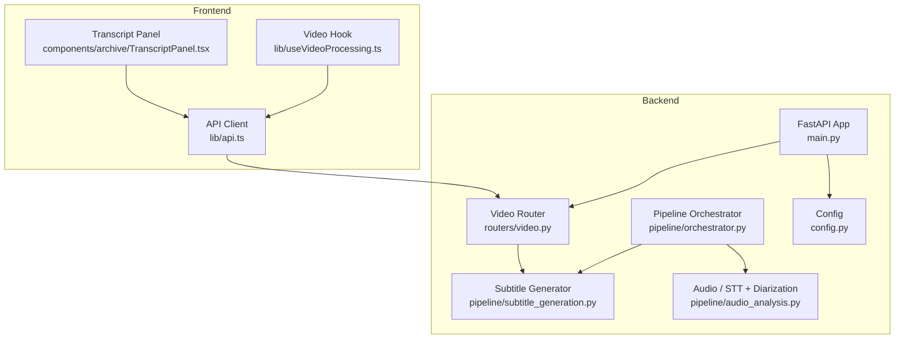
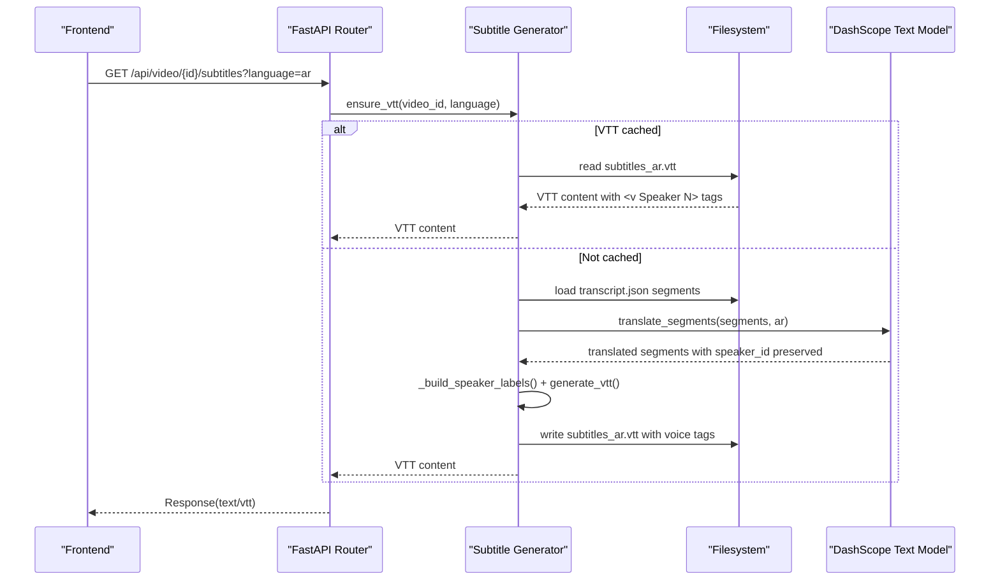
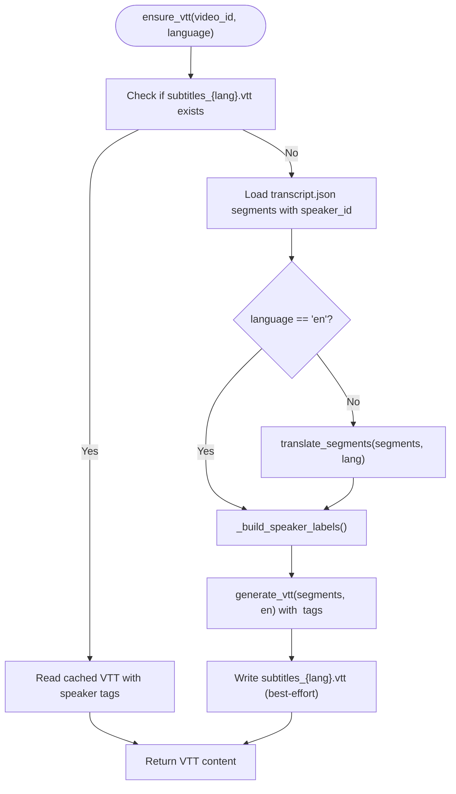
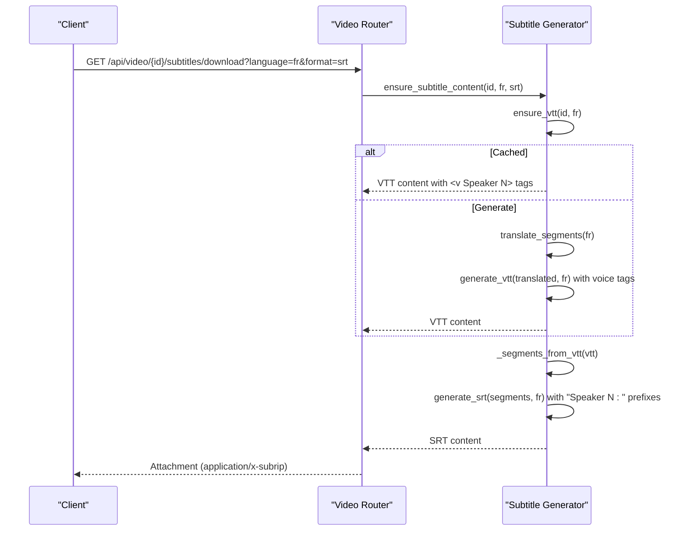
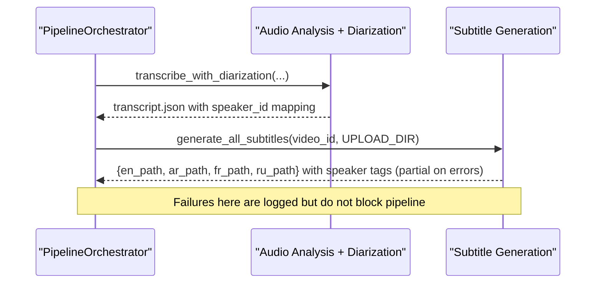
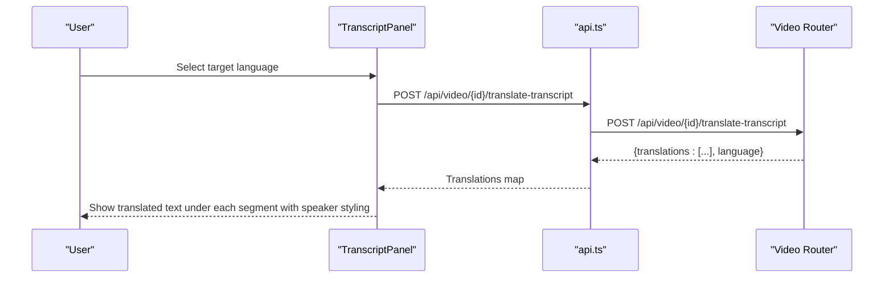
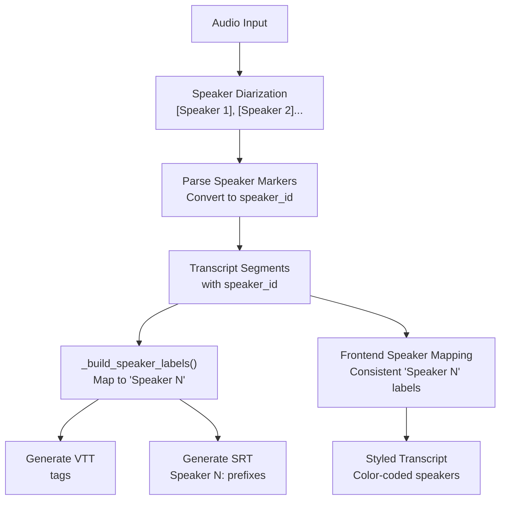
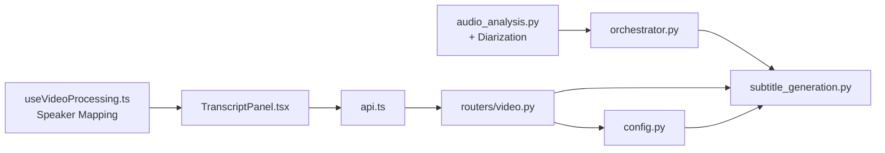

# Subtitle Generation Module

<cite>
**Referenced Files in This Document**
- [subtitle_generation.py](file://backend/pipeline/subtitle_generation.py)
- [audio_analysis.py](file://backend/pipeline/audio_analysis.py)
- [video.py](file://backend/routers/video.py)
- [orchestrator.py](file://backend/pipeline/orchestrator.py)
- [config.py](file://backend/config.py)
- [main.py](file://backend/main.py)
- [run_pipeline.py](file://backend/run_pipeline.py)
- [TranscriptPanel.tsx](file://frontend/src/components/archive/TranscriptPanel.tsx)
- [api.ts](file://frontend/src/lib/api.ts)
- [useVideoProcessing.ts](file://frontend/src/lib/useVideoProcessing.ts)
</cite>

## Update Summary
**Changes Made**
- Added comprehensive speaker-aware formatting with WebVTT voice tags and SRT speaker prefixes
- Implemented consistent backend-frontend speaker ID mapping system
- Enhanced subtitle generation with `_build_speaker_labels()` and `_speaker_label()` helper functions
- Updated architecture diagrams to reflect new speaker processing pipeline
- Added detailed documentation for speaker diarization integration

## Table of Contents
1. [Introduction](#introduction)
2. [Project Structure](#project-structure)
3. [Core Components](#core-components)
4. [Architecture Overview](#architecture-overview)
5. [Detailed Component Analysis](#detailed-component-analysis)
6. [Speaker-Aware Formatting System](#speaker-aware-formatting-system)
7. [Dependency Analysis](#dependency-analysis)
8. [Performance Considerations](#performance-considerations)
9. [Troubleshooting Guide](#troubleshooting-guide)
10. [Conclusion](#conclusion)

## Introduction
This document explains the Subtitle Generation Module that converts video transcripts into WebVTT and SRT subtitle files with enhanced speaker-aware formatting, and produces translated subtitle tracks (Arabic, French, Russian) using a text model via DashScope. The module now includes sophisticated speaker diarization support with consistent speaker labeling across backend and frontend systems. It covers how subtitles are generated during the processing pipeline, how they are served through REST endpoints, and how the frontend integrates with these capabilities.

## Project Structure
The module is implemented in the backend pipeline and exposed via API routes. The frontend provides UI for transcript viewing and translation, while subtitle downloads are handled by the backend. The enhanced speaker-aware system ensures consistent speaker identification throughout the entire pipeline.

**Diagram sources**
- [main.py:1-44](file://backend/main.py#L1-L44)
- [video.py:340-421](file://backend/routers/video.py#L340-L421)
- [subtitle_generation.py:1-443](file://backend/pipeline/subtitle_generation.py#L1-L443)
- [orchestrator.py:131-140](file://backend/pipeline/orchestrator.py#L131-L140)
- [audio_analysis.py:130-248](file://backend/pipeline/audio_analysis.py#L130-L248)
- [config.py:1-32](file://backend/config.py#L1-L32)
- [TranscriptPanel.tsx:82-121](file://frontend/src/components/archive/TranscriptPanel.tsx#L82-L121)
- [api.ts:222-233](file://frontend/src/lib/api.ts#L222-L233)
- [useVideoProcessing.ts:409-438](file://frontend/src/lib/useVideoProcessing.ts#L409-L438)

**Section sources**
- [main.py:1-44](file://backend/main.py#L1-L44)
- [video.py:340-421](file://backend/routers/video.py#L340-L421)
- [subtitle_generation.py:1-443](file://backend/pipeline/subtitle_generation.py#L1-L443)
- [orchestrator.py:131-140](file://backend/pipeline/orchestrator.py#L131-L40)
- [audio_analysis.py:130-248](file://backend/pipeline/audio_analysis.py#L130-L248)
- [config.py:1-32](file://backend/config.py#L1-L32)
- [TranscriptPanel.tsx:82-121](file://frontend/src/components/archive/TranscriptPanel.tsx#L82-L121)
- [api.ts:222-233](file://frontend/src/lib/api.ts#L222-L233)
- [useVideoProcessing.ts:409-438](file://frontend/src/lib/useVideoProcessing.ts#L409-L438)

## Core Components
- **Enhanced subtitle generation utilities**: timestamp parsing/formatting, VTT/SRT formatting with speaker-aware formatting, translation orchestration, file caching, and on-demand content generation.
- **Speaker diarization system**: automatic speaker detection and consistent speaker ID mapping between backend and frontend.
- **API endpoints**: serve VTT content and download SRT/VTT attachments with speaker information; validate languages and formats.
- **Pipeline integration**: non-blocking subtitle generation after audio analysis with speaker diarization; resilient to failures.
- **Frontend integration**: transcript panel supports per-segment translation with speaker-aware styling; uses the same translation flow as the backend.

Key responsibilities:
- Convert transcript segments to WebVTT and SRT with speaker voice tags and prefixes.
- Translate segments into supported languages using a text model while preserving speaker information.
- Cache generated VTTs per language to avoid repeated work.
- Expose endpoints for live VTT retrieval and downloadable SRT/VTT with speaker metadata.
- Maintain consistent speaker ID mapping across backend and frontend systems.

**Section sources**
- [subtitle_generation.py:68-153](file://backend/pipeline/subtitle_generation.py#L68-L153)
- [subtitle_generation.py:177-262](file://backend/pipeline/subtitle_generation.py#L177-L262)
- [subtitle_generation.py:331-393](file://backend/pipeline/subtitle_generation.py#L331-L393)
- [audio_analysis.py:130-248](file://backend/pipeline/audio_analysis.py#L130-L248)
- [video.py:349-421](file://backend/routers/video.py#L349-L421)
- [orchestrator.py:131-140](file://backend/pipeline/orchestrator.py#L131-L140)

## Architecture Overview
The subtitle generation module sits between the transcript produced by the audio stage and the user-facing APIs. It now includes sophisticated speaker diarization capabilities and maintains consistent speaker labeling throughout the pipeline. The system can be invoked:
- Automatically during the pipeline after transcription completes with speaker detection.
- On demand via REST endpoints when clients request subtitles.

**Diagram sources**
- [video.py:349-378](file://backend/routers/video.py#L349-L378)
- [subtitle_generation.py:331-367](file://backend/pipeline/subtitle_generation.py#L331-L367)
- [subtitle_generation.py:97-122](file://backend/pipeline/subtitle_generation.py#L97-L122)
- [subtitle_generation.py:177-262](file://backend/pipeline/subtitle_generation.py#L177-L262)

## Detailed Component Analysis

### Enhanced Subtitle Generation Utilities
Responsibilities:
- Timestamp conversion and formatting for both WebVTT and SRT.
- Segment-to-VTT and segment-to-SRT serialization with speaker-aware formatting.
- Translation via a text model with robust retry and fallback behavior.
- File-based generation and caching of VTT assets.
- Conversion from cached VTT back to SRT without re-translating.

**Updated** Enhanced with speaker-aware formatting including WebVTT voice tags and SRT speaker prefixes.

Highlights:
- Robust timestamp parsing handles numeric seconds and string formats like MM:SS or HH:MM:SS.
- VTT and SRT generators enforce valid timing ranges and skip empty segments.
- **New**: Speaker-aware formatting with `<v Speaker N>` voice tags in WebVTT and "Speaker N:" prefixes in SRT.
- **New**: Consistent speaker ID mapping between backend and frontend systems.
- Translation uses a system prompt instructing the model to preserve segment markers and order.
- Resilient retries with exponential backoff for network/model errors.
- ensure_vtt caches generated VTTs per language; ensure_subtitle_content reuses cached VTT to produce SRT.

**Diagram sources**
- [subtitle_generation.py:331-367](file://backend/pipeline/subtitle_generation.py#L331-L367)
- [subtitle_generation.py:68-86](file://backend/pipeline/subtitle_generation.py#L68-L86)
- [subtitle_generation.py:97-122](file://backend/pipeline/subtitle_generation.py#L97-L122)

**Section sources**
- [subtitle_generation.py:68-153](file://backend/pipeline/subtitle_generation.py#L68-L153)
- [subtitle_generation.py:177-262](file://backend/pipeline/subtitle_generation.py#L177-L262)
- [subtitle_generation.py:331-393](file://backend/pipeline/subtitle_generation.py#L331-L393)
- [subtitle_generation.py:396-443](file://backend/pipeline/subtitle_generation.py#L396-L443)

### API Endpoints for Subtitles
Endpoints:
- GET /api/video/{video_id}/subtitles?language=en|ar|fr|ru
  - Returns WebVTT content with speaker voice tags; generates on-the-fly if missing and caches it.
- GET /api/video/{video_id}/subtitles/download?language=en|ar|fr|ru&format=srt|vtt
  - Returns an attachment in requested format with speaker information; ensures VTT source then converts to SRT if needed.

Behavior:
- Validates language and format parameters.
- Uses ensure_vtt and ensure_subtitle_content to centralize logic and caching.
- Maps errors to appropriate HTTP status codes (404 for missing transcript, 400 for invalid inputs, 502 for generation failures).

**Diagram sources**
- [video.py:381-421](file://backend/routers/video.py#L381-L421)
- [subtitle_generation.py:370-393](file://backend/pipeline/subtitle_generation.py#L370-L393)
- [subtitle_generation.py:331-367](file://backend/pipeline/subtitle_generation.py#L331-L367)
- [subtitle_generation.py:125-153](file://backend/pipeline/subtitle_generation.py#L125-L153)

**Section sources**
- [video.py:349-421](file://backend/routers/video.py#L349-L421)

### Pipeline Integration
After the audio analysis stage completes with speaker diarization, the orchestrator triggers subtitle generation. This step is intentionally non-blocking and resilient so that subtitle failures do not prevent subsequent stages.

**Updated** Now includes speaker diarization integration with consistent speaker ID mapping.

**Diagram sources**
- [orchestrator.py:131-140](file://backend/pipeline/orchestrator.py#L131-L140)
- [subtitle_generation.py:286-328](file://backend/pipeline/subtitle_generation.py#L286-L328)
- [audio_analysis.py:130-248](file://backend/pipeline/audio_analysis.py#L130-L248)

**Section sources**
- [orchestrator.py:131-140](file://backend/pipeline/orchestrator.py#L131-L140)
- [subtitle_generation.py:286-328](file://backend/pipeline/subtitle_generation.py#L286-L328)
- [audio_analysis.py:130-248](file://backend/pipeline/audio_analysis.py#L130-L248)

### Frontend Integration
The frontend TranscriptPanel allows users to view transcript segments and optionally translate them into Arabic, French, or Russian. It calls the same translation endpoint used internally by the backend. The frontend now includes consistent speaker mapping that matches the backend's speaker numbering system.

**Updated** Enhanced with consistent speaker ID mapping and speaker-aware styling.

Key behaviors:
- Translates all segments in one call using the backend's translation endpoint.
- Displays translated text beneath original segments with proper directionality for Arabic.
- Resets translations when the underlying transcript changes.
- **New**: Consistent speaker ID mapping between backend and frontend systems.
- **New**: Speaker-aware styling with color-coded speaker badges.

**Diagram sources**
- [TranscriptPanel.tsx:82-121](file://frontend/src/components/archive/TranscriptPanel.tsx#L82-L121)
- [api.ts:222-233](file://frontend/src/lib/api.ts#L222-L233)
- [video.py:234-318](file://backend/routers/video.py#L234-L318)

**Section sources**
- [TranscriptPanel.tsx:82-121](file://frontend/src/components/archive/TranscriptPanel.tsx#L82-L121)
- [api.ts:222-233](file://frontend/src/lib/api.ts#L222-L233)
- [video.py:234-318](file://backend/routers/video.py#L234-L318)
- [useVideoProcessing.ts:409-438](file://frontend/src/lib/useVideoProcessing.ts#L409-L438)

## Speaker-Aware Formatting System

### Backend Speaker Processing
The backend implements a comprehensive speaker diarization system that automatically detects speakers and assigns consistent IDs throughout the pipeline.

**Speaker Detection and Mapping:**
- Audio diarization uses inline `[Speaker N]` markers detected by regex patterns
- Speaker IDs are converted from 1-based markers to 0-based integers for consistency
- Unknown speakers are assigned "unknown" speaker_id values
- Frontend maps these IDs to friendly "Speaker N" labels consistently

**WebVTT Voice Tags:**
- Segments with known speaker_id values are wrapped in `<v Speaker N>` voice tags
- Unknown speakers remain without voice tags
- Voice tags are preserved when converting between formats

**SRT Speaker Prefixes:**
- Segments with known speaker_id values get "Speaker N: " prefixes
- Unknown speakers remain without prefixes
- Speaker information is recovered from WebVTT voice tags during SRT conversion

### Frontend Speaker Mapping
The frontend maintains consistent speaker labeling that matches the backend's system:

**Consistent ID Mapping:**
- Backend speaker_id "0", "1", "2" → Frontend "Speaker 1", "Speaker 2", "Speaker 3"
- Unknown speakers mapped to sequential "Speaker N" labels
- Color-coded speaker badges for visual distinction
- Speaker information preserved through translation and format conversion

**Visual Styling:**
- Each speaker gets unique color coding (blue, green, purple, amber, pink)
- Active speaker highlighting during video playback
- Responsive speaker badge display in transcript interface

**Diagram sources**
- [audio_analysis.py:130-248](file://backend/pipeline/audio_analysis.py#L130-L248)
- [subtitle_generation.py:68-86](file://backend/pipeline/subtitle_generation.py#L68-L86)
- [subtitle_generation.py:97-122](file://backend/pipeline/subtitle_generation.py#L97-L122)
- [subtitle_generation.py:125-153](file://backend/pipeline/subtitle_generation.py#L125-L153)
- [useVideoProcessing.ts:409-438](file://frontend/src/lib/useVideoProcessing.ts#L409-L438)

**Section sources**
- [audio_analysis.py:130-248](file://backend/pipeline/audio_analysis.py#L130-L248)
- [subtitle_generation.py:68-153](file://backend/pipeline/subtitle_generation.py#L68-L153)
- [useVideoProcessing.ts:409-438](file://frontend/src/lib/useVideoProcessing.ts#L409-L438)
- [TranscriptPanel.tsx:20-36](file://frontend/src/components/archive/TranscriptPanel.tsx#L20-36)

## Dependency Analysis
- Subtitle generator depends on configuration for API keys, base URLs, and upload directory.
- Router depends on the generator for VTT/SRT generation and caching with speaker information.
- Orchestrator invokes the generator after audio analysis with speaker diarization.
- Frontend components depend on the API client which calls router endpoints.
- **New**: Speaker diarization creates dependency chain from audio analysis to subtitle generation.

**Diagram sources**
- [config.py:1-32](file://backend/config.py#L1-L32)
- [subtitle_generation.py:1-443](file://backend/pipeline/subtitle_generation.py#L1-L443)
- [audio_analysis.py:130-248](file://backend/pipeline/audio_analysis.py#L130-L248)
- [orchestrator.py:131-140](file://backend/pipeline/orchestrator.py#L131-L140)
- [video.py:349-421](file://backend/routers/video.py#L349-L421)
- [api.ts:222-233](file://frontend/src/lib/api.ts#L222-L233)
- [TranscriptPanel.tsx:82-121](file://frontend/src/components/archive/TranscriptPanel.tsx#L82-L121)
- [useVideoProcessing.ts:409-438](file://frontend/src/lib/useVideoProcessing.ts#L409-L438)

**Section sources**
- [config.py:1-32](file://backend/config.py#L1-L32)
- [subtitle_generation.py:1-443](file://backend/pipeline/subtitle_generation.py#L1-L443)
- [audio_analysis.py:130-248](file://backend/pipeline/audio_analysis.py#L130-L248)
- [orchestrator.py:131-140](file://backend/pipeline/orchestrator.py#L131-L140)
- [video.py:349-421](file://backend/routers/video.py#L349-L421)
- [api.ts:222-233](file://frontend/src/lib/api.ts#L222-L233)
- [TranscriptPanel.tsx:82-121](file://frontend/src/components/archive/TranscriptPanel.tsx#L82-L121)
- [useVideoProcessing.ts:409-438](file://frontend/src/lib/useVideoProcessing.ts#L409-L438)

## Performance Considerations
- Caching: ensure_vtt writes VTT files to disk to avoid repeated translation and formatting.
- Batch translation: segments are joined with markers and translated in a single API call to reduce latency and token overhead.
- Retry strategy: exponential backoff mitigates transient network or model errors.
- Non-blocking pipeline: subtitle generation runs independently of later stages to keep overall pipeline responsive.
- Format conversion: SRT is derived from cached VTT segments to avoid redundant translation.
- **New**: Speaker label building is optimized with single-pass mapping to minimize computational overhead.
- **New**: Consistent speaker ID mapping reduces frontend processing complexity.

## Troubleshooting Guide
Common issues and resolutions:
- Missing transcript: If transcript.json does not exist, endpoints return 404. Ensure the audio analysis stage completed successfully.
- Unsupported language or format: Validate language (en/ar/fr/ru) and format (srt/vtt) before calling endpoints.
- API key not configured: If the text model API key is missing, translation attempts will fail with server-side errors. Verify environment variables.
- Network or model errors: Retries are attempted up to three times; check logs for detailed error messages and consider rate limits or quota constraints.
- File permissions: Writing VTT files requires write access to the upload directory.
- **New**: Speaker diarization failures: If no speaker markers are detected, the system falls back to plain transcription with "unknown" speaker IDs.
- **New**: Inconsistent speaker labeling: Ensure backend and frontend use the same speaker ID mapping algorithm.

Operational checks:
- Confirm uploads directory exists and is writable.
- Verify DashScope API key and base URL settings.
- Inspect pipeline logs for subtitle generation warnings or errors.
- **New**: Check audio diarization logs for speaker detection success/failure.
- **New**: Verify speaker ID consistency between backend and frontend systems.

**Section sources**
- [video.py:349-421](file://backend/routers/video.py#L349-L421)
- [subtitle_generation.py:177-262](file://backend/pipeline/subtitle_generation.py#L177-L262)
- [config.py:1-32](file://backend/config.py#L1-L32)
- [audio_analysis.py:237-248](file://backend/pipeline/audio_analysis.py#L237-L248)

## Conclusion
The Subtitle Generation Module provides robust, cache-aware conversion of transcripts into WebVTT and SRT formats with advanced speaker-aware formatting and optional multi-language translation. The enhanced speaker diarization system ensures consistent speaker identification throughout the pipeline, with WebVTT voice tags and SRT speaker prefixes providing rich metadata for downstream applications. The module integrates seamlessly into the processing pipeline and exposes convenient REST endpoints for both live playback and downloadable attachments. The frontend leverages the same translation flow and consistent speaker mapping to enhance the user experience with bilingual support and visually distinct speaker identification.