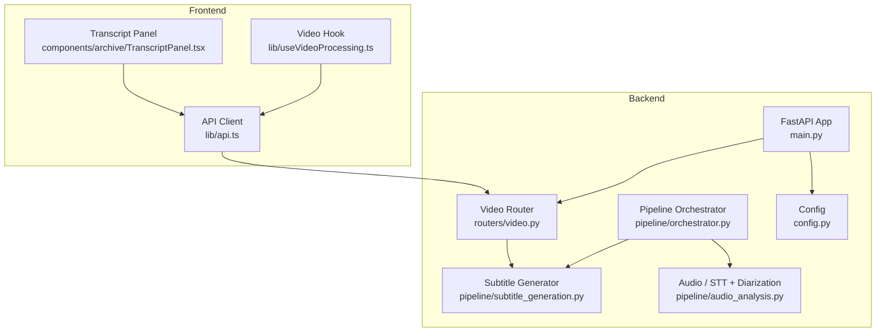
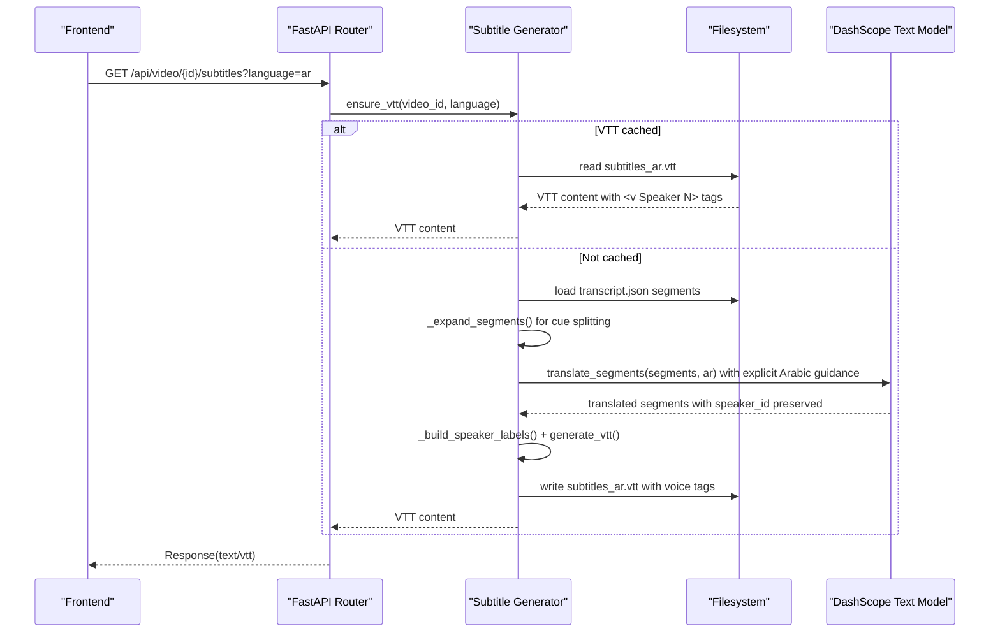
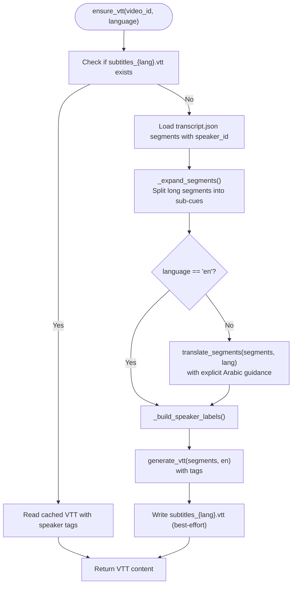
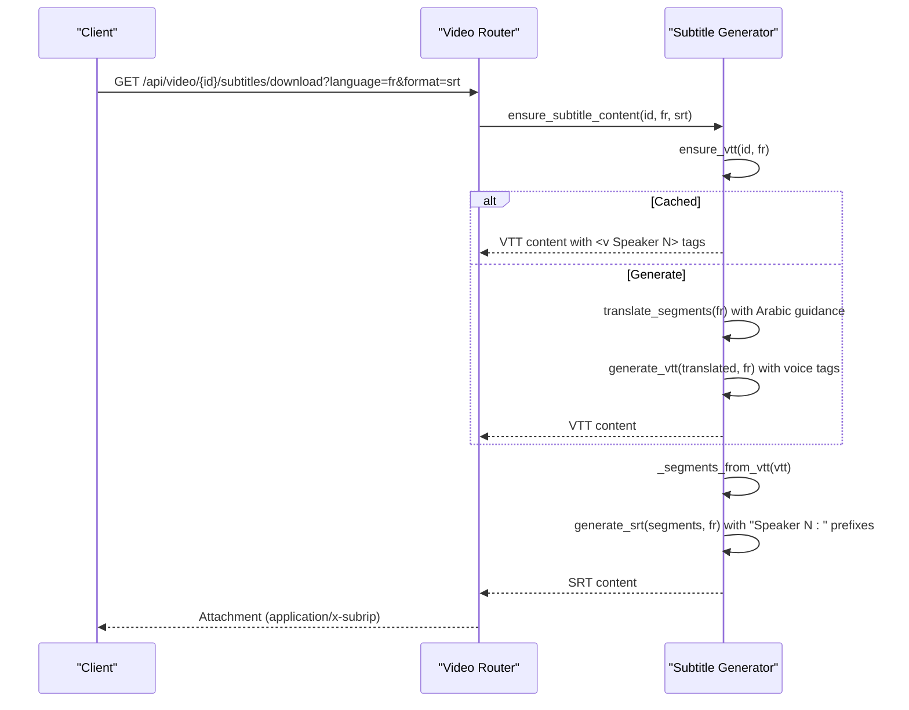
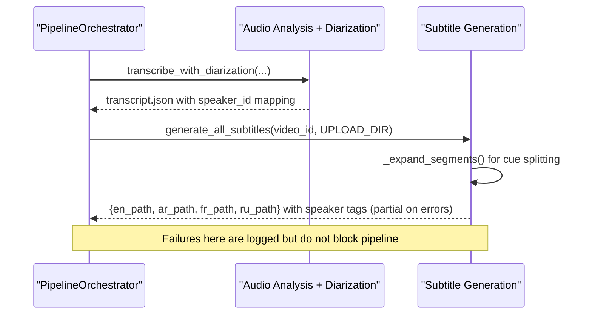
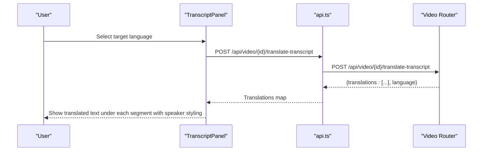
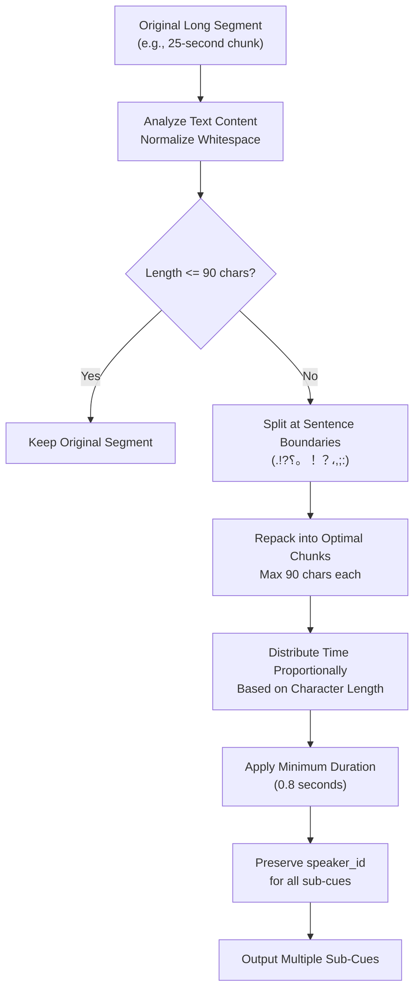
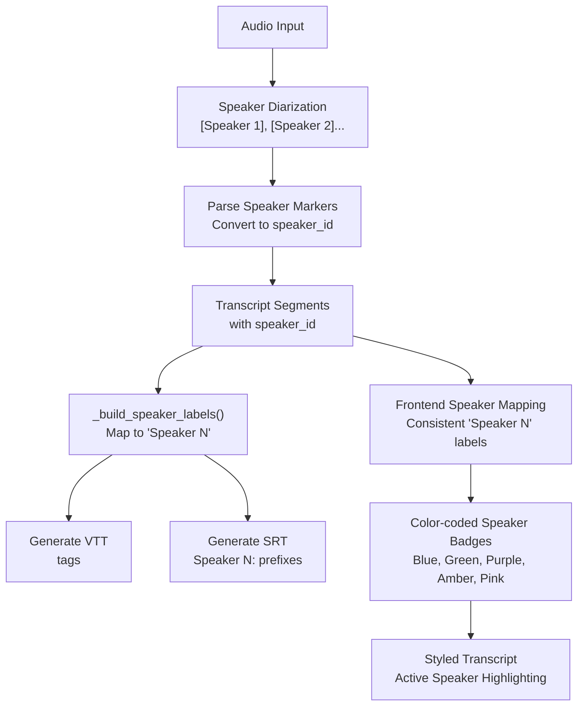
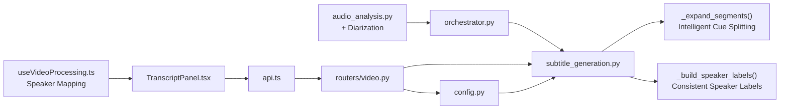

# Subtitle Generation Module

<cite>
**Referenced Files in This Document**
- [subtitle_generation.py](file://backend/pipeline/subtitle_generation.py)
- [audio_analysis.py](file://backend/pipeline/audio_analysis.py)
- [video.py](file://backend/routers/video.py)
- [orchestrator.py](file://backend/pipeline/orchestrator.py)
- [config.py](file://backend/config.py)
- [main.py](file://backend/main.py)
- [run_pipeline.py](file://backend/run_pipeline.py)
- [TranscriptPanel.tsx](file://frontend/src/components/archive/TranscriptPanel.tsx)
- [api.ts](file://frontend/src/lib/api.ts)
- [useVideoProcessing.ts](file://frontend/src/lib/useVideoProcessing.ts)
</cite>

## Update Summary
**Changes Made**
- Added intelligent cue splitting system that breaks long segments into readable sub-cues with 90-character limits
- Enhanced Arabic translation handling with explicit language guidance to prevent Chinese output
- Improved speaker labeling support throughout the pipeline with consistent backend-frontend mapping
- Updated subtitle generation with advanced formatting including WebVTT voice tags and SRT speaker prefixes
- Enhanced translation system with robust retry mechanisms and error handling

## Table of Contents
1. [Introduction](#introduction)
2. [Project Structure](#project-structure)
3. [Core Components](#core-components)
4. [Architecture Overview](#architecture-overview)
5. [Detailed Component Analysis](#detailed-component-analysis)
6. [Intelligent Cue Splitting System](#intelligent-cue-splitting-system)
7. [Enhanced Speaker Labeling Pipeline](#enhanced-speaker-labeling-pipeline)
8. [Improved Translation Handling](#improved-translation-handling)
9. [Dependency Analysis](#dependency-analysis)
10. [Performance Considerations](#performance-considerations)
11. [Troubleshooting Guide](#troubleshooting-guide)
12. [Conclusion](#conclusion)

## Introduction
This document explains the Subtitle Generation Module that converts video transcripts into WebVTT and SRT subtitle files with intelligent cue splitting, enhanced speaker-aware formatting, and improved multi-language translation capabilities. The module now includes sophisticated speaker diarization support with consistent speaker labeling across backend and frontend systems, along with an intelligent cue splitting system that ensures readable subtitle presentation with character limits. It covers how subtitles are generated during the processing pipeline, how they are served through REST endpoints, and how the frontend integrates with these capabilities.

## Project Structure
The module is implemented in the backend pipeline and exposed via API routes. The frontend provides UI for transcript viewing and translation, while subtitle downloads are handled by the backend. The enhanced speaker-aware system and intelligent cue splitting ensure consistent speaker identification and readable subtitle presentation throughout the entire pipeline.



**Diagram sources**
- [main.py:1-44](file://backend/main.py#L1-L44)
- [video.py:359-430](file://backend/routers/video.py#L359-L430)
- [subtitle_generation.py:1-577](file://backend/pipeline/subtitle_generation.py#L1-L577)
- [orchestrator.py:138-146](file://backend/pipeline/orchestrator.py#L138-L146)
- [audio_analysis.py:130-248](file://backend/pipeline/audio_analysis.py#L130-L248)
- [config.py:1-32](file://backend/config.py#L1-L32)
- [TranscriptPanel.tsx:1-305](file://frontend/src/components/archive/TranscriptPanel.tsx#L1-L305)
- [api.ts:222-233](file://frontend/src/lib/api.ts#L222-L233)
- [useVideoProcessing.ts:409-438](file://frontend/src/lib/useVideoProcessing.ts#L409-L438)

**Section sources**
- [main.py:1-44](file://backend/main.py#L1-L44)
- [video.py:359-430](file://backend/routers/video.py#L359-L430)
- [subtitle_generation.py:1-577](file://backend/pipeline/subtitle_generation.py#L1-L577)
- [orchestrator.py:138-146](file://backend/pipeline/orchestrator.py#L138-L146)
- [audio_analysis.py:130-248](file://backend/pipeline/audio_analysis.py#L130-L248)
- [config.py:1-32](file://backend/config.py#L1-L32)
- [TranscriptPanel.tsx:1-305](file://frontend/src/components/archive/TranscriptPanel.tsx#L1-L305)
- [api.ts:222-233](file://frontend/src/lib/api.ts#L222-L233)
- [useVideoProcessing.ts:409-438](file://frontend/src/lib/useVideoProcessing.ts#L409-L438)

## Core Components
- **Enhanced subtitle generation utilities**: timestamp parsing/formatting, VTT/SRT formatting with intelligent cue splitting and speaker-aware formatting, translation orchestration, file caching, and on-demand content generation.
- **Intelligent cue splitting system**: automatic breaking of long segments into readable sub-cues with 90-character limits and proper sentence boundary detection.
- **Speaker diarization system**: automatic speaker detection and consistent speaker ID mapping between backend and frontend.
- **API endpoints**: serve VTT content and download SRT/VTT attachments with speaker information; validate languages and formats.
- **Pipeline integration**: non-blocking subtitle generation after audio analysis with speaker diarization; resilient to failures.
- **Frontend integration**: transcript panel supports per-segment translation with speaker-aware styling; uses the same translation flow as the backend.

Key responsibilities:
- Convert transcript segments to WebVTT and SRT with intelligent cue splitting, speaker voice tags, and prefixes.
- Translate segments into supported languages using a text model while preserving speaker information and ensuring correct language output.
- Cache generated VTTs per language to avoid repeated work.
- Expose endpoints for live VTT retrieval and downloadable SRT/VTT with speaker metadata.
- Maintain consistent speaker ID mapping across backend and frontend systems.

**Section sources**
- [subtitle_generation.py:72-183](file://backend/pipeline/subtitle_generation.py#L72-L183)
- [subtitle_generation.py:187-278](file://backend/pipeline/subtitle_generation.py#L187-L278)
- [subtitle_generation.py:301-396](file://backend/pipeline/subtitle_generation.py#L301-L396)
- [audio_analysis.py:130-248](file://backend/pipeline/audio_analysis.py#L130-L248)
- [video.py:359-430](file://backend/routers/video.py#L359-L430)
- [orchestrator.py:138-146](file://backend/pipeline/orchestrator.py#L138-L146)

## Architecture Overview
The subtitle generation module sits between the transcript produced by the audio stage and the user-facing APIs. It now includes sophisticated speaker diarization capabilities, intelligent cue splitting, and maintains consistent speaker labeling throughout the pipeline. The system can be invoked:
- Automatically during the pipeline after transcription completes with speaker detection.
- On demand via REST endpoints when clients request subtitles.



**Diagram sources**
- [video.py:359-388](file://backend/routers/video.py#L359-L388)
- [subtitle_generation.py:465-501](file://backend/pipeline/subtitle_generation.py#L465-L501)
- [subtitle_generation.py:132-183](file://backend/pipeline/subtitle_generation.py#L132-L183)
- [subtitle_generation.py:301-396](file://backend/pipeline/subtitle_generation.py#L301-L396)

## Detailed Component Analysis

### Enhanced Subtitle Generation Utilities
Responsibilities:
- Timestamp conversion and formatting for both WebVTT and SRT.
- Segment-to-VTT and segment-to-SRT serialization with intelligent cue splitting and speaker-aware formatting.
- Translation via a text model with robust retry and fallback behavior.
- File-based generation and caching of VTT assets.
- Conversion from cached VTT back to SRT without re-translating.

**Updated** Enhanced with intelligent cue splitting system, improved Arabic translation handling, and comprehensive speaker-aware formatting including WebVTT voice tags and SRT speaker prefixes.

Highlights:
- Robust timestamp parsing handles numeric seconds and string formats like MM:SS or HH:MM:SS.
- VTT and SRT generators enforce valid timing ranges and skip empty segments.
- **New**: Intelligent cue splitting breaks long segments into readable sub-cues with 90-character limits and proper sentence boundary detection.
- **New**: Enhanced Arabic translation with explicit language guidance to prevent Chinese output.
- **New**: Consistent speaker ID mapping between backend and frontend systems.
- Translation uses a system prompt instructing the model to preserve segment markers and order.
- Resilient retries with exponential backoff for network/model errors.
- ensure_vtt caches generated VTTs per language; ensure_subtitle_content reuses cached VTT to produce SRT.



**Diagram sources**
- [subtitle_generation.py:465-501](file://backend/pipeline/subtitle_generation.py#L465-L501)
- [subtitle_generation.py:132-183](file://backend/pipeline/subtitle_generation.py#L132-L183)
- [subtitle_generation.py:216-244](file://backend/pipeline/subtitle_generation.py#L216-L244)

**Section sources**
- [subtitle_generation.py:72-183](file://backend/pipeline/subtitle_generation.py#L72-L183)
- [subtitle_generation.py:187-278](file://backend/pipeline/subtitle_generation.py#L187-L278)
- [subtitle_generation.py:301-396](file://backend/pipeline/subtitle_generation.py#L301-L396)
- [subtitle_generation.py:465-577](file://backend/pipeline/subtitle_generation.py#L465-L577)

### API Endpoints for Subtitles
Endpoints:
- GET /api/video/{video_id}/subtitles?language=en|ar|fr|ru
  - Returns WebVTT content with speaker voice tags; generates on-the-fly if missing and caches it.
- GET /api/video/{video_id}/subtitles/download?language=en|ar|fr|ru&format=srt|vtt
  - Returns an attachment in requested format with speaker information; ensures VTT source then converts to SRT if needed.

Behavior:
- Validates language and format parameters.
- Uses ensure_vtt and ensure_subtitle_content to centralize logic and caching.
- Maps errors to appropriate HTTP status codes (404 for missing transcript, 400 for invalid inputs, 502 for generation failures).



**Diagram sources**
- [video.py:391-430](file://backend/routers/video.py#L391-L430)
- [subtitle_generation.py:504-527](file://backend/pipeline/subtitle_generation.py#L504-L527)
- [subtitle_generation.py:465-501](file://backend/pipeline/subtitle_generation.py#L465-L501)
- [subtitle_generation.py:247-277](file://backend/pipeline/subtitle_generation.py#L247-L277)

**Section sources**
- [video.py:359-430](file://backend/routers/video.py#L359-L430)

### Pipeline Integration
After the audio analysis stage completes with speaker diarization, the orchestrator triggers subtitle generation. This step is intentionally non-blocking and resilient so that subtitle failures do not prevent subsequent stages.

**Updated** Now includes intelligent cue splitting and enhanced speaker diarization integration with consistent speaker ID mapping.



**Diagram sources**
- [orchestrator.py:138-146](file://backend/pipeline/orchestrator.py#L138-L146)
- [subtitle_generation.py:420-462](file://backend/pipeline/subtitle_generation.py#L420-L462)
- [audio_analysis.py:130-248](file://backend/pipeline/audio_analysis.py#L130-L248)

**Section sources**
- [orchestrator.py:138-146](file://backend/pipeline/orchestrator.py#L138-L146)
- [subtitle_generation.py:420-462](file://backend/pipeline/subtitle_generation.py#L420-L462)
- [audio_analysis.py:130-248](file://backend/pipeline/audio_analysis.py#L130-L248)

### Frontend Integration
The frontend TranscriptPanel allows users to view transcript segments and optionally translate them into Arabic, French, or Russian. It calls the same translation endpoint used internally by the backend. The frontend now includes consistent speaker mapping that matches the backend's speaker numbering system with enhanced visual styling.

**Updated** Enhanced with consistent speaker ID mapping, intelligent cue splitting display, and improved speaker-aware styling with color-coded badges.

Key behaviors:
- Translates all segments in one call using the backend's translation endpoint.
- Displays translated text beneath original segments with proper directionality for Arabic.
- Resets translations when the underlying transcript changes.
- **New**: Consistent speaker ID mapping between backend and frontend systems.
- **New**: Enhanced speaker-aware styling with color-coded speaker badges and responsive display.
- **New**: Support for displaying split cues from intelligent cue splitting system.



**Diagram sources**
- [TranscriptPanel.tsx:82-121](file://frontend/src/components/archive/TranscriptPanel.tsx#L82-L121)
- [api.ts:222-233](file://frontend/src/lib/api.ts#L222-L233)
- [video.py:235-328](file://backend/routers/video.py#L235-L328)

**Section sources**
- [TranscriptPanel.tsx:1-305](file://frontend/src/components/archive/TranscriptPanel.tsx#L1-L305)
- [api.ts:222-233](file://frontend/src/lib/api.ts#L222-L233)
- [video.py:235-328](file://backend/routers/video.py#L235-L328)
- [useVideoProcessing.ts:409-438](file://frontend/src/lib/useVideoProcessing.ts#L409-L438)

## Intelligent Cue Splitting System

### Automatic Segment Expansion
The intelligent cue splitting system automatically breaks long transcript segments into readable sub-cues that maintain readability standards for subtitle display.

**Cue Splitting Algorithm:**
- Maximum 90 characters per sub-cue for optimal readability
- Sentence boundary detection using punctuation marks (.!?؟。！？،,;:)
- Proportional time distribution based on character length
- Minimum 0.8-second duration per sub-cue for proper display timing
- Preserves speaker_id information across all generated sub-cues

**Smart Boundary Detection:**
- Supports multiple languages with appropriate punctuation marks
- Falls back to word boundary splitting when sentence boundaries aren't available
- Handles single words longer than the limit with hard wrapping
- Maintains semantic coherence by keeping related clauses together



**Diagram sources**
- [subtitle_generation.py:93-129](file://backend/pipeline/subtitle_generation.py#L93-L129)
- [subtitle_generation.py:132-183](file://backend/pipeline/subtitle_generation.py#L132-L183)

**Section sources**
- [subtitle_generation.py:72-183](file://backend/pipeline/subtitle_generation.py#L72-L183)

## Enhanced Speaker Labeling Pipeline

### Backend Speaker Processing
The backend implements a comprehensive speaker diarization system that automatically detects speakers and assigns consistent IDs throughout the pipeline.

**Speaker Detection and Mapping:**
- Audio diarization uses inline `[Speaker N]` markers detected by regex patterns
- Speaker IDs are converted from 1-based markers to 0-based integers for consistency
- Unknown speakers are assigned "unknown" speaker_id values
- Frontend maps these IDs to friendly "Speaker N" labels consistently

**WebVTT Voice Tags:**
- Segments with known speaker_id values are wrapped in `<v Speaker N>` voice tags
- Unknown speakers remain without voice tags
- Voice tags are preserved when converting between formats

**SRT Speaker Prefixes:**
- Segments with known speaker_id values get "Speaker N: " prefixes
- Unknown speakers remain without prefixes
- Speaker information is recovered from WebVTT voice tags during SRT conversion

### Frontend Speaker Mapping
The frontend maintains consistent speaker labeling that matches the backend's system with enhanced visual presentation.

**Consistent ID Mapping:**
- Backend speaker_id "0", "1", "2" → Frontend "Speaker 1", "Speaker 2", "Speaker 3"
- Unknown speakers mapped to sequential "Speaker N" labels
- Color-coded speaker badges for visual distinction
- Speaker information preserved through translation and format conversion

**Visual Styling:**
- Each speaker gets unique color coding (blue, green, purple, amber, pink)
- Active speaker highlighting during video playback
- Responsive speaker badge display in transcript interface
- Enhanced styling with background colors, text colors, and borders



**Diagram sources**
- [audio_analysis.py:130-248](file://backend/pipeline/audio_analysis.py#L130-L248)
- [subtitle_generation.py:187-214](file://backend/pipeline/subtitle_generation.py#L187-L214)
- [subtitle_generation.py:216-277](file://backend/pipeline/subtitle_generation.py#L216-L277)
- [useVideoProcessing.ts:409-438](file://frontend/src/lib/useVideoProcessing.ts#L409-L438)
- [TranscriptPanel.tsx:20-36](file://frontend/src/components/archive/TranscriptPanel.tsx#L20-36)

**Section sources**
- [audio_analysis.py:130-248](file://backend/pipeline/audio_analysis.py#L130-L248)
- [subtitle_generation.py:187-277](file://backend/pipeline/subtitle_generation.py#L187-L277)
- [useVideoProcessing.ts:409-438](file://frontend/src/lib/useVideoProcessing.ts#L409-L438)
- [TranscriptPanel.tsx:20-36](file://frontend/src/components/archive/TranscriptPanel.tsx#L20-36)

## Improved Translation Handling

### Enhanced Arabic Language Support
The translation system now includes explicit language guidance to prevent common issues with Arabic translation output.

**Arabic Translation Improvements:**
- Explicit instruction to use Modern Standard Arabic in Arabic script (العربية)
- Clear directive to prevent Chinese output which models sometimes default to
- Reinforced requirement that every translated segment must be written in Arabic
- Enhanced system prompts with specific language constraints

**Translation Process Enhancements:**
- Robust retry mechanism with exponential backoff (up to 3 attempts)
- Network error handling with detailed logging
- Fallback to original text when translation fails
- Preserved segment markers and ordering throughout translation process
- Optimized token usage with batched segment processing

**System Prompt Enhancement:**
```python
extra = ""
if language == "ar":
    extra = (
        " The target language is Modern Standard Arabic written in Arabic script (العربية). "
        "Do NOT translate to Chinese or any other language — every translated segment "
        "MUST be written in Arabic."
    )
```

**Section sources**
- [subtitle_generation.py:301-396](file://backend/pipeline/subtitle_generation.py#L301-L396)
- [video.py:235-328](file://backend/routers/video.py#L235-L328)

## Dependency Analysis
- Subtitle generator depends on configuration for API keys, base URLs, and upload directory.
- Router depends on the generator for VTT/SRT generation and caching with speaker information.
- Orchestrator invokes the generator after audio analysis with speaker diarization.
- Frontend components depend on the API client which calls router endpoints.
- **New**: Speaker diarization creates dependency chain from audio analysis to subtitle generation.
- **New**: Intelligent cue splitting adds preprocessing dependency before subtitle formatting.



**Diagram sources**
- [config.py:1-32](file://backend/config.py#L1-L32)
- [subtitle_generation.py:1-577](file://backend/pipeline/subtitle_generation.py#L1-L577)
- [audio_analysis.py:130-248](file://backend/pipeline/audio_analysis.py#L130-L248)
- [orchestrator.py:138-146](file://backend/pipeline/orchestrator.py#L138-L146)
- [video.py:359-430](file://backend/routers/video.py#L359-L430)
- [api.ts:222-233](file://frontend/src/lib/api.ts#L222-L233)
- [TranscriptPanel.tsx:1-305](file://frontend/src/components/archive/TranscriptPanel.tsx#L1-L305)
- [useVideoProcessing.ts:409-438](file://frontend/src/lib/useVideoProcessing.ts#L409-L438)

**Section sources**
- [config.py:1-32](file://backend/config.py#L1-L32)
- [subtitle_generation.py:1-577](file://backend/pipeline/subtitle_generation.py#L1-L577)
- [audio_analysis.py:130-248](file://backend/pipeline/audio_analysis.py#L130-L248)
- [orchestrator.py:138-146](file://backend/pipeline/orchestrator.py#L138-L146)
- [video.py:359-430](file://backend/routers/video.py#L359-L430)
- [api.ts:222-233](file://frontend/src/lib/api.ts#L222-L233)
- [TranscriptPanel.tsx:1-305](file://frontend/src/components/archive/TranscriptPanel.tsx#L1-L305)
- [useVideoProcessing.ts:409-438](file://frontend/src/lib/useVideoProcessing.ts#L409-L438)

## Performance Considerations
- Caching: ensure_vtt writes VTT files to disk to avoid repeated translation and formatting.
- Batch translation: segments are joined with markers and translated in a single API call to reduce latency and token overhead.
- Retry strategy: exponential backoff mitigates transient network or model errors.
- Non-blocking pipeline: subtitle generation runs independently of later stages to keep overall pipeline responsive.
- Format conversion: SRT is derived from cached VTT segments to avoid redundant translation.
- **New**: Intelligent cue splitting optimizes subtitle readability while maintaining performance through efficient text processing.
- **New**: Consistent speaker ID mapping reduces frontend processing complexity and improves rendering performance.
- **New**: Proportional time distribution ensures smooth subtitle transitions without additional computational overhead.

## Troubleshooting Guide
Common issues and resolutions:
- Missing transcript: If transcript.json does not exist, endpoints return 404. Ensure the audio analysis stage completed successfully.
- Unsupported language or format: Validate language (en/ar/fr/ru) and format (srt/vtt) before calling endpoints.
- API key not configured: If the text model API key is missing, translation attempts will fail with server-side errors. Verify environment variables.
- Network or model errors: Retries are attempted up to three times; check logs for detailed error messages and consider rate limits or quota constraints.
- File permissions: Writing VTT files requires write access to the upload directory.
- **New**: Speaker diarization failures: If no speaker markers are detected, the system falls back to plain transcription with "unknown" speaker IDs.
- **New**: Inconsistent speaker labeling: Ensure backend and frontend use the same speaker ID mapping algorithm.
- **New**: Cue splitting issues: Long segments are automatically split; verify 90-character limit and minimum duration settings if display issues occur.
- **New**: Arabic translation problems: Check that explicit Arabic language guidance is being applied and verify model output contains Arabic script.

Operational checks:
- Confirm uploads directory exists and is writable.
- Verify DashScope API key and base URL settings.
- Inspect pipeline logs for subtitle generation warnings or errors.
- **New**: Check audio diarization logs for speaker detection success/failure.
- **New**: Verify speaker ID consistency between backend and frontend systems.
- **New**: Monitor cue splitting performance for very long segments.
- **New**: Validate Arabic translation output contains proper Arabic script characters.

**Section sources**
- [video.py:359-430](file://backend/routers/video.py#L359-L430)
- [subtitle_generation.py:301-396](file://backend/pipeline/subtitle_generation.py#L301-L396)
- [config.py:1-32](file://backend/config.py#L1-L32)
- [audio_analysis.py:237-248](file://backend/pipeline/audio_analysis.py#L237-L248)

## Conclusion
The Subtitle Generation Module provides robust, cache-aware conversion of transcripts into WebVTT and SRT formats with advanced intelligent cue splitting, enhanced speaker-aware formatting, and improved multi-language translation capabilities. The intelligent cue splitting system ensures readable subtitle presentation with proper character limits and sentence boundary detection, while the enhanced speaker diarization system maintains consistent speaker identification throughout the pipeline with WebVTT voice tags and SRT speaker prefixes. The improved Arabic translation handling prevents common output issues with explicit language guidance. The module integrates seamlessly into the processing pipeline and exposes convenient REST endpoints for both live playback and downloadable attachments. The frontend leverages the same translation flow and consistent speaker mapping to enhance the user experience with bilingual support and visually distinct speaker identification with color-coded badges.