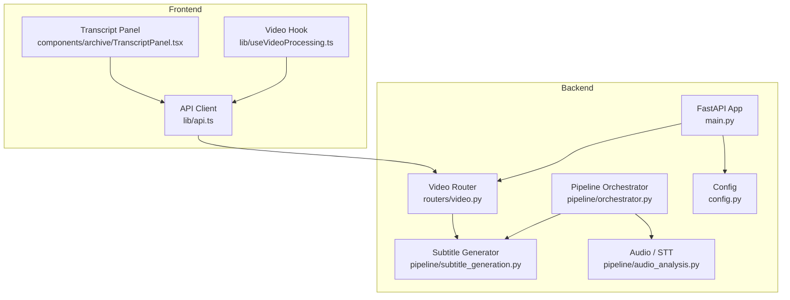
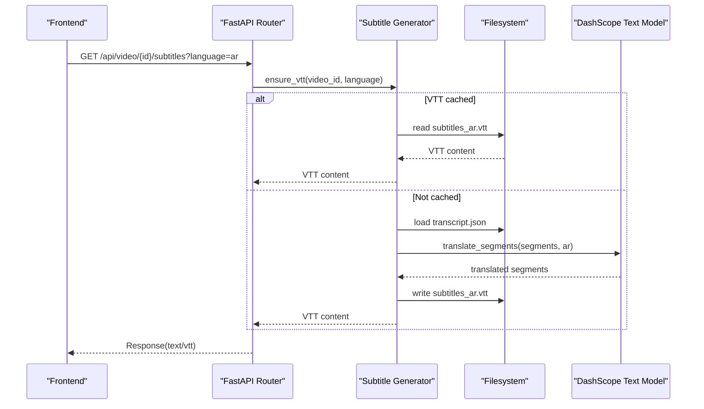
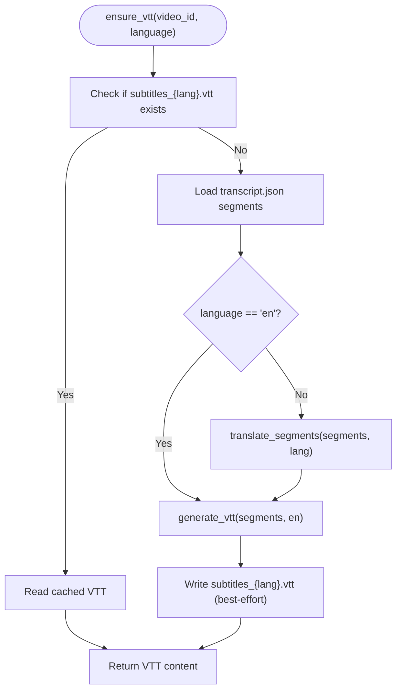
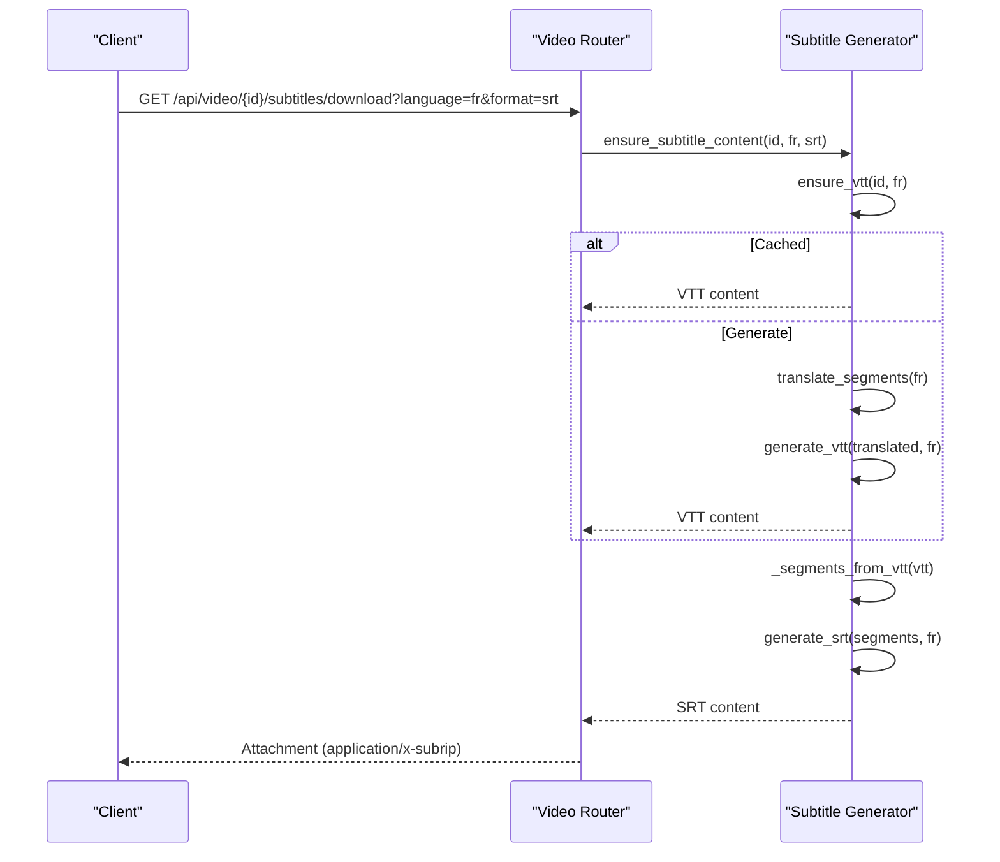
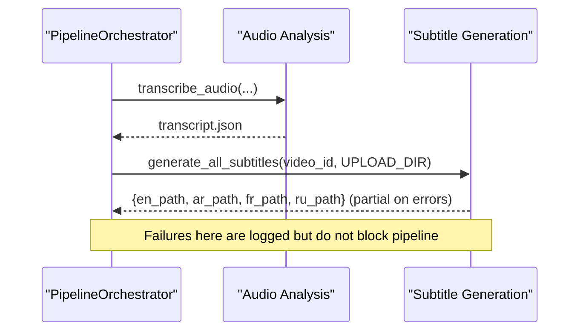
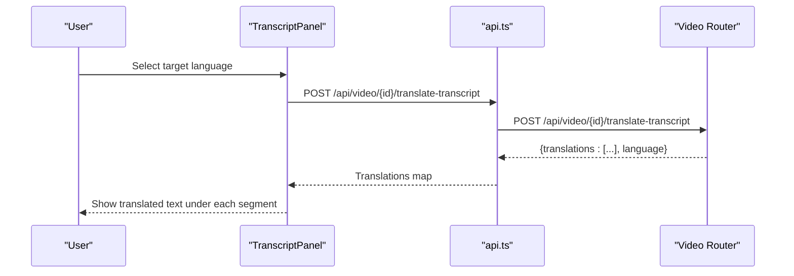
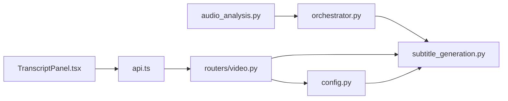

# Subtitle Generation Module

<cite>
**Referenced Files in This Document**
- [subtitle_generation.py](file://backend/pipeline/subtitle_generation.py)
- [video.py](file://backend/routers/video.py)
- [orchestrator.py](file://backend/pipeline/orchestrator.py)
- [audio_analysis.py](file://backend/pipeline/audio_analysis.py)
- [config.py](file://backend/config.py)
- [main.py](file://backend/main.py)
- [run_pipeline.py](file://backend/run_pipeline.py)
- [TranscriptPanel.tsx](file://frontend/src/components/archive/TranscriptPanel.tsx)
- [api.ts](file://frontend/src/lib/api.ts)
- [useVideoProcessing.ts](file://frontend/src/lib/useVideoProcessing.ts)
</cite>

## Table of Contents
1. [Introduction](#introduction)
2. [Project Structure](#project-structure)
3. [Core Components](#core-components)
4. [Architecture Overview](#architecture-overview)
5. [Detailed Component Analysis](#detailed-component-analysis)
6. [Dependency Analysis](#dependency-analysis)
7. [Performance Considerations](#performance-considerations)
8. [Troubleshooting Guide](#troubleshooting-guide)
9. [Conclusion](#conclusion)

## Introduction
This document explains the Subtitle Generation Module that converts video transcripts into WebVTT and SRT subtitle files, and produces translated subtitle tracks (Arabic, French, Russian) using a text model via DashScope. It covers how subtitles are generated during the processing pipeline, how they are served through REST endpoints, and how the frontend integrates with these capabilities.

## Project Structure
The module is implemented in the backend pipeline and exposed via API routes. The frontend provides UI for transcript viewing and translation, while subtitle downloads are handled by the backend.

**Diagram sources**
- [main.py:1-44](file://backend/main.py#L1-L44)
- [video.py:340-421](file://backend/routers/video.py#L340-L421)
- [subtitle_generation.py:1-383](file://backend/pipeline/subtitle_generation.py#L1-L383)
- [orchestrator.py:131-140](file://backend/pipeline/orchestrator.py#L131-L140)
- [audio_analysis.py:33-113](file://backend/pipeline/audio_analysis.py#L33-L113)
- [config.py:1-32](file://backend/config.py#L1-L32)
- [TranscriptPanel.tsx:82-121](file://frontend/src/components/archive/TranscriptPanel.tsx#L82-L121)
- [api.ts:222-233](file://frontend/src/lib/api.ts#L222-L233)
- [useVideoProcessing.ts:304-456](file://frontend/src/lib/useVideoProcessing.ts#L304-L456)

**Section sources**
- [main.py:1-44](file://backend/main.py#L1-L44)
- [video.py:340-421](file://backend/routers/video.py#L340-L421)
- [subtitle_generation.py:1-383](file://backend/pipeline/subtitle_generation.py#L1-L383)
- [orchestrator.py:131-140](file://backend/pipeline/orchestrator.py#L131-L140)
- [audio_analysis.py:33-113](file://backend/pipeline/audio_analysis.py#L33-L113)
- [config.py:1-32](file://backend/config.py#L1-L32)
- [TranscriptPanel.tsx:82-121](file://frontend/src/components/archive/TranscriptPanel.tsx#L82-L121)
- [api.ts:222-233](file://frontend/src/lib/api.ts#L222-L233)
- [useVideoProcessing.ts:304-456](file://frontend/src/lib/useVideoProcessing.ts#L304-L456)

## Core Components
- Subtitle generation utilities: timestamp parsing/formatting, VTT/SRT formatting, translation orchestration, file caching, and on-demand content generation.
- API endpoints: serve VTT content and download SRT/VTT attachments; validate languages and formats.
- Pipeline integration: non-blocking subtitle generation after audio analysis; resilient to failures.
- Frontend integration: transcript panel supports per-segment translation; uses the same translation flow as the backend.

Key responsibilities:
- Convert transcript segments to WebVTT and SRT.
- Translate segments into supported languages using a text model.
- Cache generated VTTs per language to avoid repeated work.
- Expose endpoints for live VTT retrieval and downloadable SRT/VTT.

**Section sources**
- [subtitle_generation.py:29-106](file://backend/pipeline/subtitle_generation.py#L29-L106)
- [subtitle_generation.py:130-214](file://backend/pipeline/subtitle_generation.py#L130-L214)
- [subtitle_generation.py:238-319](file://backend/pipeline/subtitle_generation.py#L238-L319)
- [video.py:349-421](file://backend/routers/video.py#L349-L421)
- [orchestrator.py:131-140](file://backend/pipeline/orchestrator.py#L131-L140)

## Architecture Overview
The subtitle generation module sits between the transcript produced by the audio stage and the user-facing APIs. It can be invoked:
- Automatically during the pipeline after transcription completes.
- On demand via REST endpoints when clients request subtitles.

**Diagram sources**
- [video.py:349-378](file://backend/routers/video.py#L349-L378)
- [subtitle_generation.py:283-319](file://backend/pipeline/subtitle_generation.py#L283-L319)
- [subtitle_generation.py:130-214](file://backend/pipeline/subtitle_generation.py#L130-L214)

## Detailed Component Analysis

### Subtitle Generation Utilities
Responsibilities:
- Timestamp conversion and formatting for both WebVTT and SRT.
- Segment-to-VTT and segment-to-SRT serialization.
- Translation via a text model with robust retry and fallback behavior.
- File-based generation and caching of VTT assets.
- Conversion from cached VTT back to SRT without re-translating.

Highlights:
- Robust timestamp parsing handles numeric seconds and string formats like MM:SS or HH:MM:SS.
- VTT and SRT generators enforce valid timing ranges and skip empty segments.
- Translation uses a system prompt instructing the model to preserve segment markers and order.
- Resilient retries with exponential backoff for network/model errors.
- ensure_vtt caches generated VTTs per language; ensure_subtitle_content reuses cached VTT to produce SRT.

**Diagram sources**
- [subtitle_generation.py:283-319](file://backend/pipeline/subtitle_generation.py#L283-L319)
- [subtitle_generation.py:68-106](file://backend/pipeline/subtitle_generation.py#L68-L106)
- [subtitle_generation.py:130-214](file://backend/pipeline/subtitle_generation.py#L130-L214)

**Section sources**
- [subtitle_generation.py:29-106](file://backend/pipeline/subtitle_generation.py#L29-L106)
- [subtitle_generation.py:130-214](file://backend/pipeline/subtitle_generation.py#L130-L214)
- [subtitle_generation.py:238-319](file://backend/pipeline/subtitle_generation.py#L238-L319)
- [subtitle_generation.py:322-383](file://backend/pipeline/subtitle_generation.py#L322-L383)

### API Endpoints for Subtitles
Endpoints:
- GET /api/video/{video_id}/subtitles?language=en|ar|fr|ru
  - Returns WebVTT content; generates on-the-fly if missing and caches it.
- GET /api/video/{video_id}/subtitles/download?language=en|ar|fr|ru&format=srt|vtt
  - Returns an attachment in requested format; ensures VTT source then converts to SRT if needed.

Behavior:
- Validates language and format parameters.
- Uses ensure_vtt and ensure_subtitle_content to centralize logic and caching.
- Maps errors to appropriate HTTP status codes (404 for missing transcript, 400 for invalid inputs, 502 for generation failures).

**Diagram sources**
- [video.py:381-421](file://backend/routers/video.py#L381-L421)
- [subtitle_generation.py:322-346](file://backend/pipeline/subtitle_generation.py#L322-L346)
- [subtitle_generation.py:283-319](file://backend/pipeline/subtitle_generation.py#L283-L319)
- [subtitle_generation.py:348-383](file://backend/pipeline/subtitle_generation.py#L348-L383)

**Section sources**
- [video.py:349-421](file://backend/routers/video.py#L349-L421)

### Pipeline Integration
After the audio analysis stage completes, the orchestrator triggers subtitle generation. This step is intentionally non-blocking and resilient so that subtitle failures do not prevent subsequent stages.

**Diagram sources**
- [orchestrator.py:131-140](file://backend/pipeline/orchestrator.py#L131-L140)
- [subtitle_generation.py:238-281](file://backend/pipeline/subtitle_generation.py#L238-L281)

**Section sources**
- [orchestrator.py:131-140](file://backend/pipeline/orchestrator.py#L131-L140)
- [subtitle_generation.py:238-281](file://backend/pipeline/subtitle_generation.py#L238-L281)

### Frontend Integration
The frontend TranscriptPanel allows users to view transcript segments and optionally translate them into Arabic, French, or Russian. It calls the same translation endpoint used internally by the backend.

Key behaviors:
- Translates all segments in one call using the backend’s translation endpoint.
- Displays translated text beneath original segments with proper directionality for Arabic.
- Resets translations when the underlying transcript changes.

**Diagram sources**
- [TranscriptPanel.tsx:82-121](file://frontend/src/components/archive/TranscriptPanel.tsx#L82-L121)
- [api.ts:222-233](file://frontend/src/lib/api.ts#L222-L233)
- [video.py:234-318](file://backend/routers/video.py#L234-L318)

**Section sources**
- [TranscriptPanel.tsx:82-121](file://frontend/src/components/archive/TranscriptPanel.tsx#L82-L121)
- [api.ts:222-233](file://frontend/src/lib/api.ts#L222-L233)
- [video.py:234-318](file://backend/routers/video.py#L234-L318)

## Dependency Analysis
- Subtitle generator depends on configuration for API keys, base URLs, and upload directory.
- Router depends on the generator for VTT/SRT generation and caching.
- Orchestrator invokes the generator after audio analysis.
- Frontend components depend on the API client which calls router endpoints.

**Diagram sources**
- [config.py:1-32](file://backend/config.py#L1-L32)
- [subtitle_generation.py:1-383](file://backend/pipeline/subtitle_generation.py#L1-L383)
- [audio_analysis.py:33-113](file://backend/pipeline/audio_analysis.py#L33-L113)
- [orchestrator.py:131-140](file://backend/pipeline/orchestrator.py#L131-L140)
- [video.py:349-421](file://backend/routers/video.py#L349-L421)
- [api.ts:222-233](file://frontend/src/lib/api.ts#L222-L233)
- [TranscriptPanel.tsx:82-121](file://frontend/src/components/archive/TranscriptPanel.tsx#L82-L121)

**Section sources**
- [config.py:1-32](file://backend/config.py#L1-L32)
- [subtitle_generation.py:1-383](file://backend/pipeline/subtitle_generation.py#L1-L383)
- [audio_analysis.py:33-113](file://backend/pipeline/audio_analysis.py#L33-L113)
- [orchestrator.py:131-140](file://backend/pipeline/orchestrator.py#L131-L140)
- [video.py:349-421](file://backend/routers/video.py#L349-L421)
- [api.ts:222-233](file://frontend/src/lib/api.ts#L222-L233)
- [TranscriptPanel.tsx:82-121](file://frontend/src/components/archive/TranscriptPanel.tsx#L82-L121)

## Performance Considerations
- Caching: ensure_vtt writes VTT files to disk to avoid repeated translation and formatting.
- Batch translation: segments are joined with markers and translated in a single API call to reduce latency and token overhead.
- Retry strategy: exponential backoff mitigates transient network or model errors.
- Non-blocking pipeline: subtitle generation runs independently of later stages to keep overall pipeline responsive.
- Format conversion: SRT is derived from cached VTT segments to avoid redundant translation.

[No sources needed since this section provides general guidance]

## Troubleshooting Guide
Common issues and resolutions:
- Missing transcript: If transcript.json does not exist, endpoints return 404. Ensure the audio analysis stage completed successfully.
- Unsupported language or format: Validate language (en/ar/fr/ru) and format (srt/vtt) before calling endpoints.
- API key not configured: If the text model API key is missing, translation attempts will fail with server-side errors. Verify environment variables.
- Network or model errors: Retries are attempted up to three times; check logs for detailed error messages and consider rate limits or quota constraints.
- File permissions: Writing VTT files requires write access to the upload directory.

Operational checks:
- Confirm uploads directory exists and is writable.
- Verify DashScope API key and base URL settings.
- Inspect pipeline logs for subtitle generation warnings or errors.

**Section sources**
- [video.py:349-421](file://backend/routers/video.py#L349-L421)
- [subtitle_generation.py:130-214](file://backend/pipeline/subtitle_generation.py#L130-L214)
- [config.py:1-32](file://backend/config.py#L1-L32)

## Conclusion
The Subtitle Generation Module provides robust, cache-aware conversion of transcripts into WebVTT and SRT formats, with optional multi-language translation. It integrates seamlessly into the processing pipeline and exposes convenient REST endpoints for both live playback and downloadable attachments. The frontend leverages the same translation flow to enhance the user experience with bilingual support.

[No sources needed since this section summarizes without analyzing specific files]