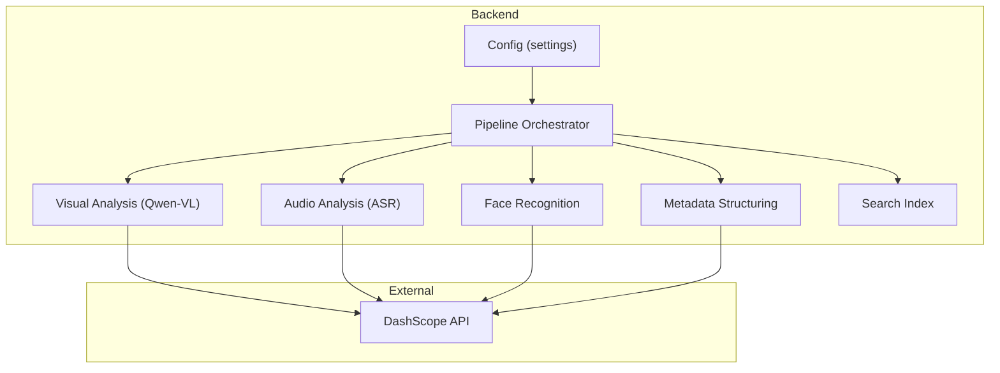
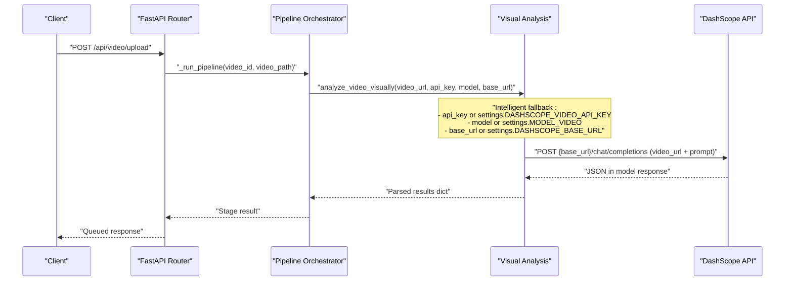
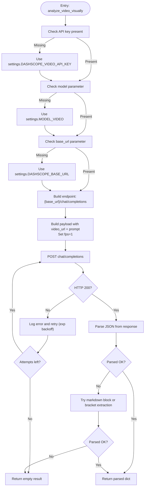
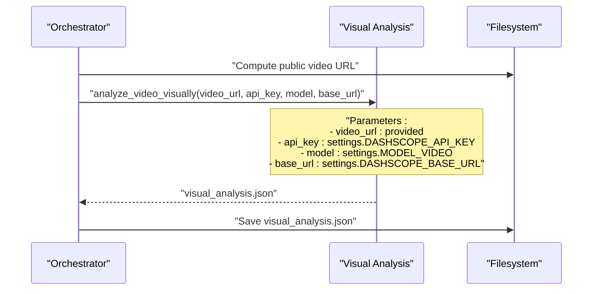
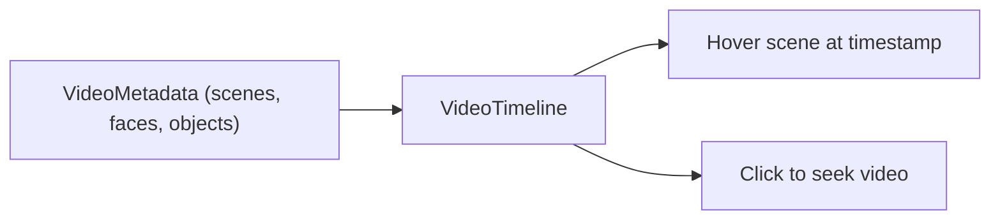
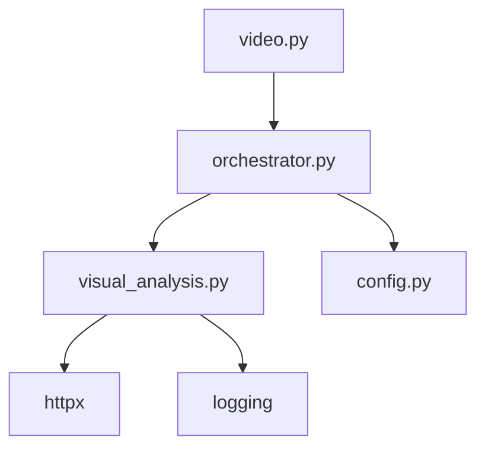

# Visual Analysis Stage

<cite>
**Referenced Files in This Document**
- [visual_analysis.py](file://backend/pipeline/visual_analysis.py)
- [config.py](file://backend/config.py)
- [orchestrator.py](file://backend/pipeline/orchestrator.py)
- [video.py](file://backend/routers/video.py)
- [README.md](file://README.md)
- [requirements.txt](file://backend/requirements.txt)
- [useVideoProcessing.ts](file://frontend/src/lib/useVideoProcessing.ts)
- [VideoTimeline.tsx](file://frontend/src/components/archive/VideoTimeline.tsx)
</cite>

## Update Summary
**Changes Made**
- Enhanced analyze_video_visually() function with intelligent fallback mechanisms for API parameters
- Improved API endpoint construction to use configured base URL instead of hardcoded values
- Updated configuration management with dual API key support and automatic fallback
- Revised troubleshooting guidance for parameter fallback scenarios

## Table of Contents
1. [Introduction](#introduction)
2. [Project Structure](#project-structure)
3. [Core Components](#core-components)
4. [Architecture Overview](#architecture-overview)
5. [Detailed Component Analysis](#detailed-component-analysis)
6. [Dependency Analysis](#dependency-analysis)
7. [Performance Considerations](#performance-considerations)
8. [Troubleshooting Guide](#troubleshooting-guide)
9. [Conclusion](#conclusion)
10. [Appendices](#appendices)

## Introduction
This document explains the visual analysis stage powered by Alibaba Cloud DashScope's Qwen-VL model. It covers video scene detection, object recognition, visual content analysis, AI model integration, API parameters, response handling, and how results integrate with downstream pipeline stages. It also provides examples of scene segmentation, visual description generation, and timestamp mapping, along with performance characteristics, resource requirements, and troubleshooting strategies for model-related failures.

## Project Structure
The visual analysis stage is part of a six-stage pipeline orchestrated by the backend. The stage integrates with DashScope's Qwen-VL model to analyze video content and produce structured metadata including scenes, objects, landmarks, faces, OCR text, sensitive content flags, era estimation, and summaries.

**Diagram sources**
- [config.py:4-21](file://backend/config.py#L4-L21)
- [orchestrator.py:44-206](file://backend/pipeline/orchestrator.py#L44-L206)
- [visual_analysis.py:43-131](file://backend/pipeline/visual_analysis.py#L43-L131)

**Section sources**
- [README.md:17-40](file://README.md#L17-L40)
- [README.md:193-233](file://README.md#L193-L233)

## Core Components
- Visual Analysis Module: Sends a video URL and a structured prompt to DashScope's Qwen-VL model and parses the resulting JSON.
- Configuration: Provides API keys, base URLs, and model identifiers with intelligent fallback mechanisms.
- Orchestrator: Coordinates pipeline stages and passes the public video URL to the visual analysis stage.
- Frontend Integration: Visualizes scenes and timestamps on a timeline.

Key responsibilities:
- Video accessibility: The video must be reachable via a public URL served by the backend's static mount.
- Prompt engineering: The prompt instructs the model to return a strict JSON schema covering scenes, objects, landmarks, faces, OCR, sensitive content, era estimate, and summaries.
- Robust parsing: Handles direct JSON, fenced code blocks, and bracket-delimited JSON fragments.
- Intelligent fallback: Automatically uses configuration defaults when parameters are not explicitly provided.
- Retry and backoff: Implements exponential backoff for transient network errors.

**Section sources**
- [visual_analysis.py:15-41](file://backend/pipeline/visual_analysis.py#L15-L41)
- [visual_analysis.py:43-131](file://backend/pipeline/visual_analysis.py#L43-L131)
- [config.py:4-21](file://backend/config.py#L4-L21)
- [orchestrator.py:96-112](file://backend/pipeline/orchestrator.py#L96-L112)

## Architecture Overview
The visual analysis stage is invoked by the orchestrator after ingestion. It constructs a DashScope chat-completion request containing:
- A video_url content item with fps sampling set to 1 frame per second.
- A text prompt requesting a specific JSON structure.

The stage uses intelligent fallback mechanisms to automatically apply configuration defaults when parameters are not explicitly provided. The model responds with a JSON payload embedded in the model's text response. The stage extracts and parses the JSON, returning a normalized dictionary to the orchestrator.

**Diagram sources**
- [video.py:95-120](file://backend/routers/video.py#L95-L120)
- [orchestrator.py:96-112](file://backend/pipeline/orchestrator.py#L96-L112)
- [visual_analysis.py:65-88](file://backend/pipeline/visual_analysis.py#L65-L88)

## Detailed Component Analysis

### Visual Analysis Module
Responsibilities:
- Validate API key presence with intelligent fallback to configuration defaults.
- Construct the DashScope request payload with a video_url content item and a structured text prompt.
- Use configured base URL for API endpoint construction instead of hardcoded values.
- Send the request with a generous timeout and retry with exponential backoff.
- Parse the model's response, handling various JSON encodings.
- Return a standardized dictionary with empty placeholders on failure.

Response schema highlights:
- Scenes: timestamp, multilingual descriptions, scene_type.
- Objects: timestamp, name, category, confidence.
- Landmarks: timestamp, name, location.
- Faces: timestamp, description, bbox, age_estimate, gender.
- OCR: timestamp, text, language.
- Sensitive content: timestamp, type, severity.
- Era estimate: decade, confidence, visual cues.
- Summaries: overall_summary_en, overall_summary_ar.

Timestamp mapping:
- All entries include a timestamp field aligned with the video timeline.
- Scenes and OCR entries use MM:SS strings; other entries use seconds.

**Diagram sources**
- [visual_analysis.py:43-131](file://backend/pipeline/visual_analysis.py#L43-L131)
- [visual_analysis.py:133-159](file://backend/pipeline/visual_analysis.py#L133-L159)

**Section sources**
- [visual_analysis.py:15-41](file://backend/pipeline/visual_analysis.py#L15-L41)
- [visual_analysis.py:43-131](file://backend/pipeline/visual_analysis.py#L43-L131)
- [visual_analysis.py:133-159](file://backend/pipeline/visual_analysis.py#L133-L159)

### Configuration and Settings
- DASHSCOPE_API_KEY: Primary API key for all DashScope calls.
- DASHSCOPE_VIDEO_API_KEY: Dedicated API key for video analysis (auto-fallback from DASHSCOPE_API_KEY).
- DASHSCOPE_BASE_URL: Base URL for DashScope API endpoints (defaults to compatible-mode v1).
- DASHSCOPE_API_URL: Alternative API URL for different service endpoints.
- MODEL_VIDEO: Default model identifier (qwen-vl-max).
- MODEL_ASR: Default speech-to-text model.
- MODEL_TEXT: Default text processing model.
- MODEL_EMBEDDING: Default embedding model.
- UPLOAD_DIR: Directory for storing uploaded files.
- BASE_URL: Used to construct public URLs for uploaded files.

These settings are consumed by the orchestrator and passed to the visual analysis stage with intelligent fallback mechanisms.

**Section sources**
- [config.py:4-21](file://backend/config.py#L4-L21)
- [orchestrator.py:105-110](file://backend/pipeline/orchestrator.py#L105-L110)

### Orchestrator Integration
- The orchestrator computes a public video URL from the uploaded file and invokes the visual analysis stage.
- Results are persisted and made available to downstream stages (e.g., face recognition and metadata structuring).

**Diagram sources**
- [orchestrator.py:76-112](file://backend/pipeline/orchestrator.py#L76-L112)
- [visual_analysis.py:43-131](file://backend/pipeline/visual_analysis.py#L43-L131)

**Section sources**
- [orchestrator.py:76-112](file://backend/pipeline/orchestrator.py#L76-L112)

### Frontend Visualization
- The frontend receives metadata including scenes, faces, and objects.
- A timeline component maps scene boundaries to timestamps and displays hover overlays.

**Diagram sources**
- [useVideoProcessing.ts:59-75](file://frontend/src/lib/useVideoProcessing.ts#L59-L75)
- [VideoTimeline.tsx:77-82](file://frontend/src/components/archive/VideoTimeline.tsx#L77-L82)

**Section sources**
- [useVideoProcessing.ts:59-75](file://frontend/src/lib/useVideoProcessing.ts#L59-L75)
- [VideoTimeline.tsx:77-82](file://frontend/src/components/archive/VideoTimeline.tsx#L77-L82)

## Dependency Analysis
- External dependencies:
  - DashScope SDK and HTTP client for API calls.
  - FFmpeg for ingestion (indirect dependency for video availability).
- Internal dependencies:
  - Config module supplies settings to the orchestrator.
  - Orchestrator coordinates stage execution and passes results.

**Diagram sources**
- [visual_analysis.py:11-13](file://backend/pipeline/visual_analysis.py#L11-L13)
- [requirements.txt:5,15](file://backend/requirements.txt#L5,L15)
- [orchestrator.py:14-20](file://backend/pipeline/orchestrator.py#L14-L20)
- [video.py:17-19](file://backend/routers/video.py#L17-L19)

**Section sources**
- [requirements.txt:1-16](file://backend/requirements.txt#L1-L16)
- [visual_analysis.py:11-13](file://backend/pipeline/visual_analysis.py#L11-L13)
- [orchestrator.py:14-20](file://backend/pipeline/orchestrator.py#L14-L20)
- [video.py:17-19](file://backend/routers/video.py#L17-L19)

## Performance Considerations
- Video accessibility: The video must be publicly reachable via a URL. The backend serves uploaded files via a static mount; production deployments should use a CDN or object storage URL.
- FPS sampling: The stage requests 1 fps to reduce cost and latency while still capturing scene transitions.
- Timeout and retries: The stage uses a long timeout and exponential backoff to handle transient network issues.
- Parameter fallback: Intelligent fallback reduces configuration overhead while maintaining flexibility.
- Large videos: Very long videos may exceed token/time limits for visual analysis; consider pre-segmenting or trimming.
- Cost and rate limits: DashScope may throttle or limit usage; monitor quotas and adjust batch sizes accordingly.

**Section sources**
- [README.md:182-189](file://README.md#L182-L189)
- [visual_analysis.py:79,92-94](file://backend/pipeline/visual_analysis.py#L79,L92-L94)

## Troubleshooting Guide
Common issues and resolutions:
- Missing API key:
  - Symptom: Empty visual analysis result with an error marker.
  - Resolution: Set DASHSCOPE_API_KEY in environment. The system will automatically use DASHSCOPE_VIDEO_API_KEY if DASHSCOPE_VIDEO_API_KEY is not set.
- Network errors:
  - Symptom: HTTP status errors or request timeouts.
  - Resolution: Verify connectivity, retry later, and check base URL correctness. The system automatically falls back to configured base URL if not provided.
- Malformed JSON from model:
  - Symptom: Parser warnings and fallback parsing attempts.
  - Resolution: Ensure the prompt remains unchanged; confirm model compliance.
- Video not accessible:
  - Symptom: 404 or 403 when DashScope tries to fetch the video.
  - Resolution: Ensure the backend serves the file and the URL is reachable from the internet.
- Excessive processing time:
  - Symptom: Long wait times for visual analysis.
  - Resolution: Reduce video length, trim to key segments, or increase server resources.
- Parameter fallback issues:
  - Symptom: Unexpected model or endpoint usage.
  - Resolution: Verify configuration settings. The system automatically applies fallbacks when parameters are not explicitly provided.

Operational tips:
- Monitor logs for "Visual analysis API error" and "Visual analysis request error" entries.
- Confirm the public URL construction in the orchestrator.
- Validate that the prompt structure matches the expected JSON schema.
- Check configuration precedence: explicit parameters override settings, which override defaults.

**Section sources**
- [visual_analysis.py:61-63,104-124](file://backend/pipeline/visual_analysis.py#L61-L63,L104-L124)
- [orchestrator.py:76-78](file://backend/pipeline/orchestrator.py#L76-L78)
- [README.md:182-189](file://README.md#L182-L189)

## Conclusion
The visual analysis stage leverages Qwen-VL to extract rich, structured visual metadata from videos. It integrates tightly with the orchestrator and DashScope APIs, returning a standardized schema that enables downstream stages such as face recognition, metadata structuring, and semantic search. The enhanced intelligent fallback mechanisms and improved configuration management provide robust operation with minimal configuration overhead while maintaining flexibility for specialized deployments.

## Appendices

### API Parameters and Payload
- Endpoint: {base_url}/chat/completions (constructed from configuration)
- Headers:
  - Authorization: Bearer <DASHSCOPE_API_KEY>
  - Content-Type: application/json
- Payload:
  - model: MODEL_VIDEO (default qwen-vl-max)
  - messages:
    - role: user
    - content:
      - type: video_url
      - video_url.url: PUBLIC_VIDEO_URL
      - fps: 1
      - type: text
      - text: ANALYSIS_PROMPT

**Section sources**
- [visual_analysis.py:65-88](file://backend/pipeline/visual_analysis.py#L65-L88)
- [config.py:5-7](file://backend/config.py#L5-L7)

### Example Outputs and Timestamp Mapping
- Scene segmentation:
  - Field: scenes[].timestamp (MM:SS)
  - Fields: description_en, description_ar, scene_type
- Visual description generation:
  - Field: overall_summary_en, overall_summary_ar
- Object recognition:
  - Field: objects[].timestamp (seconds), name, category, confidence
- Landmark identification:
  - Field: landmarks[].timestamp (seconds), name, location
- Face detection:
  - Field: faces[].timestamp (seconds), description, bbox, age_estimate, gender
- OCR:
  - Field: text_ocr[].timestamp (seconds), text, language
- Sensitive content:
  - Field: sensitive_content[].timestamp (seconds), type, severity
- Era estimate:
  - Field: era_estimate.decade, confidence, visual_cues

**Section sources**
- [visual_analysis.py:15-41](file://backend/pipeline/visual_analysis.py#L15-L41)

### Relationship to Subsequent Pipeline Stages
- Face recognition consumes detected faces to enrich identities.
- Metadata structuring aggregates visual, audio, and face results into broadcast-ready metadata.
- Search index builds searchable segments combining scenes and transcripts.

**Section sources**
- [orchestrator.py:131-166](file://backend/pipeline/orchestrator.py#L131-L166)
- [README.md:171-179](file://README.md#L171-L179)