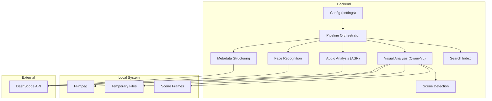
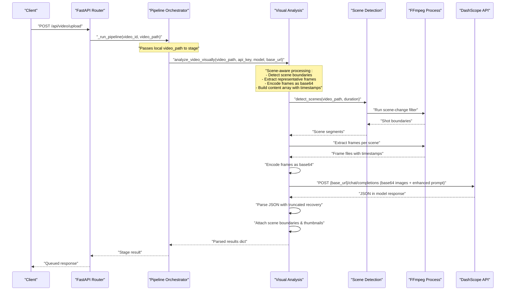
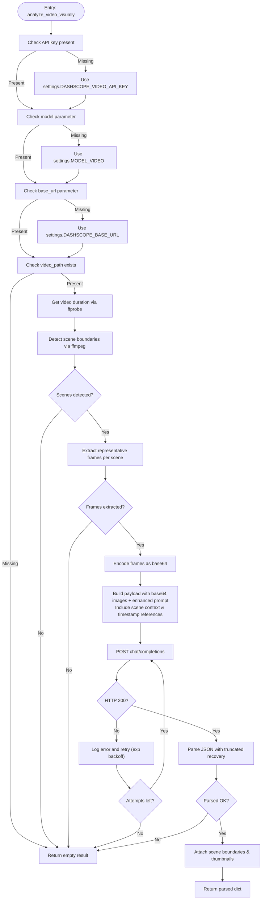
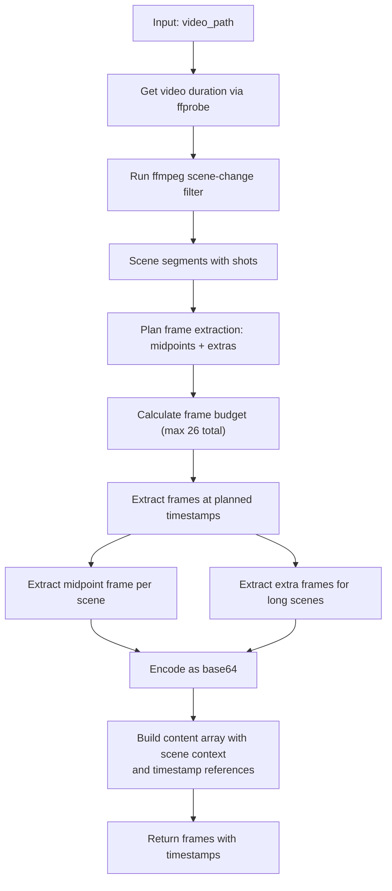
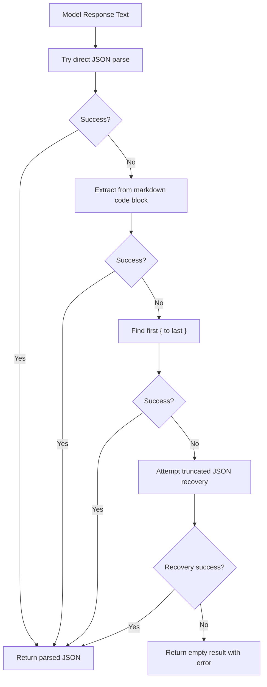
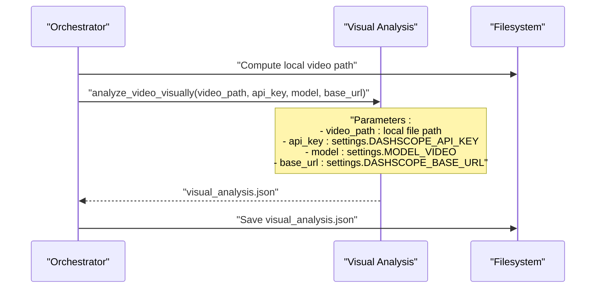
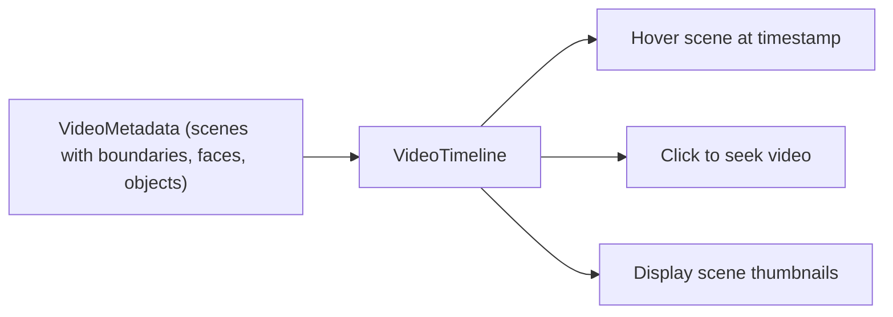
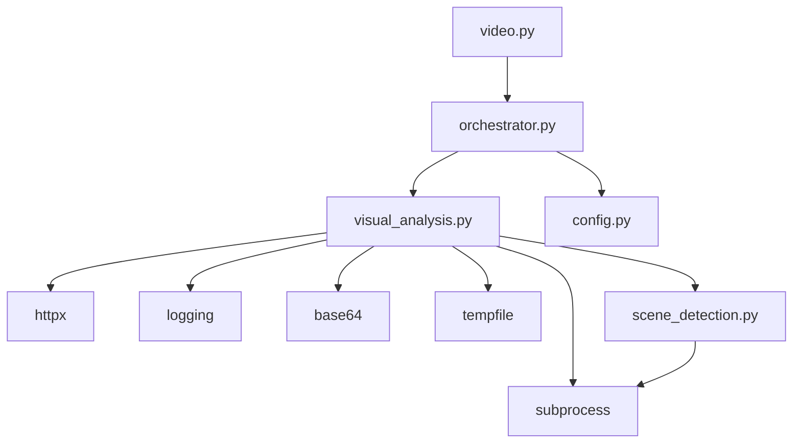

# Visual Analysis Stage

<cite>
**Referenced Files in This Document**
- [visual_analysis.py](file://backend/pipeline/visual_analysis.py)
- [scene_detection.py](file://backend/pipeline/scene_detection.py)
- [config.py](file://backend/config.py)
- [orchestrator.py](file://backend/pipeline/orchestrator.py)
- [video.py](file://backend/routers/video.py)
- [README.md](file://README.md)
- [requirements.txt](file://backend/requirements.txt)
- [useVideoProcessing.ts](file://frontend/src/lib/useVideoProcessing.ts)
- [VideoTimeline.tsx](file://frontend/src/components/archive/VideoTimeline.tsx)
</cite>

## Update Summary
**Changes Made**
- Complete rewrite of visual analysis module to use direct file path processing instead of URL-based approach
- Added ffmpeg-based keyframe extraction with configurable frame count and timing
- Implemented base64 image encoding for Qwen-VL model consumption
- Enhanced reliability by eliminating network dependency issues for video access
- Updated from URL-based to file path-based processing approach with improved error handling
- **NEW**: Scene-aware frame extraction using ffmpeg's scene-change filter for accurate shot boundary detection
- **NEW**: Scene boundary attachment with start/end timestamps and thumbnail URLs
- **NEW**: Truncated JSON recovery system for handling model response limitations
- **NEW**: Improved prompt engineering with scene-specific context and timestamp references

## Table of Contents
1. [Introduction](#introduction)
2. [Project Structure](#project-structure)
3. [Core Components](#core-components)
4. [Architecture Overview](#architecture-overview)
5. [Detailed Component Analysis](#detailed-component-analysis)
6. [Dependency Analysis](#dependency-analysis)
7. [Performance Considerations](#performance-considerations)
8. [Troubleshooting Guide](#troubleshooting-guide)
9. [Conclusion](#conclusion)
10. [Appendices](#appendices)

## Introduction
This document explains the visual analysis stage powered by Alibaba Cloud DashScope's Qwen-VL model. The stage has been completely redesigned to use direct file path processing with ffmpeg-based keyframe extraction and base64 image encoding, replacing the previous URL-based approach. It now features intelligent scene-aware frame extraction that detects actual shot boundaries, attaches precise scene boundaries with thumbnails, includes robust truncated JSON recovery for model responses, and uses enhanced prompt engineering for scene-specific analysis. The stage covers video scene detection, object recognition, visual content analysis, AI model integration, API parameters, response handling, and how results integrate with downstream pipeline stages. It also provides examples of scene segmentation, visual description generation, and timestamp mapping, along with performance characteristics, resource requirements, and troubleshooting strategies for model-related failures.

## Project Structure
The visual analysis stage is part of a six-stage pipeline orchestrated by the backend. The stage integrates with DashScope's Qwen-VL model to analyze video content and produce structured metadata including scenes, objects, landmarks, faces, OCR text, sensitive content flags, era estimation, and summaries. The new implementation processes local video files directly using ffmpeg for keyframe extraction and scene detection.

**Diagram sources**
- [config.py:4-21](file://backend/config.py#L4-L21)
- [orchestrator.py:44-206](file://backend/pipeline/orchestrator.py#L44-L206)
- [visual_analysis.py:43-131](file://backend/pipeline/visual_analysis.py#L43-L131)
- [scene_detection.py:33-104](file://backend/pipeline/scene_detection.py#L33-L104)

**Section sources**
- [README.md:17-40](file://README.md#L17-L40)
- [README.md:193-233](file://README.md#L193-L233)

## Core Components
- **Visual Analysis Module**: Processes local video files directly using ffmpeg for scene-aware keyframe extraction, encodes frames as base64, and sends them to DashScope's Qwen-VL model for comprehensive analysis.
- **Scene Detection Module**: Uses ffmpeg's scene-change filter to detect actual shot boundaries and extracts representative frames per scene.
- **Configuration**: Provides API keys, base URLs, and model identifiers with intelligent fallback mechanisms.
- **Orchestrator**: Coordinates pipeline stages and passes local video file paths to the visual analysis stage.
- **Frontend Integration**: Visualizes scenes and timestamps on a timeline with enhanced boundary information.

Key responsibilities:
- **Direct file processing**: The stage accepts local video file paths instead of public URLs, eliminating network dependency issues.
- **Scene-aware frame extraction**: Uses ffmpeg's scene-change filter to detect actual shot boundaries and extract one representative frame per scene.
- **Intelligent frame sampling**: Long scenes contribute two frames (near-start + middle) to capture lower-third overlays and dynamic content.
- **Base64 encoding**: Converts extracted frames to base64 format for model consumption.
- **Enhanced prompt engineering**: The prompt includes scene context, timestamp references, and specific instructions for scene-specific analysis.
- **Robust parsing**: Handles direct JSON, fenced code blocks, bracket-delimited JSON fragments, and truncated responses.
- **Truncated JSON recovery**: Automatically repairs incomplete JSON responses from the model when token limits are exceeded.
- **Scene boundary attachment**: Attaches detected start/end timestamps and thumbnail URLs to each scene entry.
- **Intelligent fallback**: Automatically uses configuration defaults when parameters are not explicitly provided.
- **Retry and backoff**: Implements exponential backoff for transient network errors.

**Section sources**
- [visual_analysis.py:15-41](file://backend/pipeline/visual_analysis.py#L15-L41)
- [visual_analysis.py:43-131](file://backend/pipeline/visual_analysis.py#L43-L131)
- [scene_detection.py:33-104](file://backend/pipeline/scene_detection.py#L33-L104)
- [config.py:4-21](file://backend/config.py#L4-L21)
- [orchestrator.py:96-112](file://backend/pipeline/orchestrator.py#L96-L112)

## Architecture Overview
The visual analysis stage is invoked by the orchestrator after ingestion. It now processes local video files directly using ffmpeg for scene-aware keyframe extraction, converting frames to base64 format for DashScope's Qwen-VL model. The stage constructs a DashScope chat-completion request containing:
- Local video file path processed through ffmpeg for scene-aware keyframe extraction
- Base64-encoded image data with detailed timestamp references and scene context
- An enhanced text prompt requesting a specific JSON structure with scene-specific analysis

The stage uses intelligent fallback mechanisms to automatically apply configuration defaults when parameters are not explicitly provided. The model responds with a JSON payload embedded in the model's text response. The stage extracts and parses the JSON with robust error handling including truncated JSON recovery, then attaches scene boundaries and returns a normalized dictionary to the orchestrator.

**Diagram sources**
- [video.py:95-120](file://backend/routers/video.py#L95-L120)
- [orchestrator.py:96-112](file://backend/pipeline/orchestrator.py#L96-L112)
- [visual_analysis.py:65-88](file://backend/pipeline/visual_analysis.py#L65-L88)
- [scene_detection.py:33-104](file://backend/pipeline/scene_detection.py#L33-L104)

## Detailed Component Analysis

### Visual Analysis Module
**Updated** Complete rewrite to use direct file path processing with scene-aware frame extraction, truncated JSON recovery, and enhanced prompt engineering.

Responsibilities:
- **Validate video file existence** with direct path checking instead of URL validation.
- **Detect scene boundaries** using ffmpeg's scene-change filter for accurate shot detection.
- **Extract representative frames** per scene with intelligent sampling for long scenes.
- **Encode frames as base64** for model consumption instead of URL-based processing.
- **Construct enhanced DashScope request payload** with base64 image data, timestamp references, and scene context.
- **Use configured base URL** for API endpoint construction instead of hardcoded values.
- **Send the request** with a generous timeout and retry with exponential backoff.
- **Parse the model's response** with robust error handling including truncated JSON recovery.
- **Attach scene boundaries** with start/end timestamps and thumbnail URLs.
- **Return a standardized dictionary** with empty placeholders on failure.

Key improvements:
- **Eliminates network dependency** by processing local files directly
- **Uses ffmpeg for reliable scene-aware frame extraction** with configurable thresholds
- **Encodes frames as base64** for model consumption without external URL access
- **Maintains backward compatibility** with existing API parameters
- **Handles truncated model responses** with intelligent JSON repair
- **Provides precise scene boundaries** with thumbnail support

Response schema highlights:
- Scenes: timestamp (MM:SS), start/end times, multilingual descriptions, scene_type, thumbnail
- Objects: timestamp (seconds), name, category, confidence
- Landmarks: timestamp (seconds), name, location
- Faces: timestamp (seconds), description, bbox, age_estimate, gender
- OCR: timestamp (seconds), text, language
- Sensitive content: timestamp (seconds), type, severity
- Era estimate: decade, confidence, visual cues
- Summaries: overall_summary_en, overall_summary_ar

Timestamp mapping:
- All entries include a timestamp field aligned with the video timeline.
- Scenes include both MM:SS strings and precise start/end seconds.
- Other entries use seconds for precise temporal alignment.

**Diagram sources**
- [visual_analysis.py:43-131](file://backend/pipeline/visual_analysis.py#L43-L131)
- [visual_analysis.py:133-159](file://backend/pipeline/visual_analysis.py#L133-L159)
- [visual_analysis.py:313-396](file://backend/pipeline/visual_analysis.py#L313-396)

**Section sources**
- [visual_analysis.py:15-41](file://backend/pipeline/visual_analysis.py#L15-L41)
- [visual_analysis.py:43-131](file://backend/pipeline/visual_analysis.py#L43-L131)
- [visual_analysis.py:133-159](file://backend/pipeline/visual_analysis.py#L133-L159)
- [visual_analysis.py:313-396](file://backend/pipeline/visual_analysis.py#L313-396)

### Scene-Aware Frame Extraction and Processing
**New** Comprehensive ffmpeg-based scene detection and intelligent frame extraction system.

The stage now uses ffmpeg's scene-change filter to detect actual shot boundaries and extracts representative frames per scene:

- **Scene boundary detection**: Uses ffmpeg's select filter with configurable threshold to detect actual shot changes
- **Intelligent frame sampling**: Always extracts midpoint frame per scene plus extra frames for long scenes
- **Lower-third overlay capture**: Extra frames spaced at intervals to capture name/title overlays
- **Scene merging**: Merges short adjacent scenes to maintain reasonable frame counts
- **Base64 encoding**: Converts each extracted frame to base64 for model consumption
- **Timestamp preservation**: Maintains accurate timestamps for each frame with scene context
- **Error handling**: Graceful degradation if ffmpeg fails or frames cannot be extracted

**Diagram sources**
- [scene_detection.py:33-104](file://backend/pipeline/scene_detection.py#L33-L104)
- [scene_detection.py:107-194](file://backend/pipeline/scene_detection.py#L107-L194)
- [visual_analysis.py:189-262](file://backend/pipeline/visual_analysis.py#L189-L262)

**Section sources**
- [scene_detection.py:33-104](file://backend/pipeline/scene_detection.py#L33-L104)
- [scene_detection.py:107-194](file://backend/pipeline/scene_detection.py#L107-L194)
- [visual_analysis.py:189-262](file://backend/pipeline/visual_analysis.py#L189-L262)

### Truncated JSON Recovery System
**New** Robust error handling for model responses that exceed token limits.

The system includes sophisticated JSON recovery capabilities for handling truncated model responses:

- **Multi-layered parsing**: Tries direct JSON parsing, markdown code block extraction, and bracket matching
- **Truncated JSON repair**: Scans backwards from end to find last complete value position
- **Bracket balancing**: Tracks nested structures while respecting string literals
- **Automatic closure**: Appends missing closing brackets to complete valid JSON
- **Graceful degradation**: Returns partial results when full parsing fails

**Diagram sources**
- [visual_analysis.py:313-396](file://backend/pipeline/visual_analysis.py#L313-396)

**Section sources**
- [visual_analysis.py:313-396](file://backend/pipeline/visual_analysis.py#L313-396)

### Enhanced Prompt Engineering
**New** Scene-specific analysis prompts with timestamp references and contextual guidance.

The prompt has been significantly enhanced to provide better scene context and analysis guidance:

- **Scene context**: Each image is identified as a representative frame of a detected scene
- **Timestamp references**: Precise time ranges and positions within scenes are provided
- **Scene numbering**: Frames are labeled with their corresponding scene indices
- **Positional context**: Frames indicate whether they're from near-start or middle of scenes
- **Specific instructions**: Detailed guidance for identifying lower-third overlays and person names
- **Compact output**: Instructions to keep responses concise to fit token budgets

**Section sources**
- [visual_analysis.py:24-57](file://backend/pipeline/visual_analysis.py#L24-57)

### Configuration and Settings
- **DASHSCOPE_API_KEY**: Primary API key for all DashScope calls.
- **DASHSCOPE_VIDEO_API_KEY**: Dedicated API key for video analysis (auto-fallback from DASHSCOPE_API_KEY).
- **DASHSCOPE_BASE_URL**: Base URL for DashScope API endpoints (defaults to compatible-mode v1).
- **DASHSCOPE_API_URL**: Alternative API URL for different service endpoints.
- **MODEL_VIDEO**: Default model identifier (qwen-vl-max).
- **MODEL_ASR**: Default speech-to-text model.
- **MODEL_TEXT**: Default text processing model.
- **MODEL_EMBEDDING**: Default embedding model.
- **UPLOAD_DIR**: Directory for storing uploaded files.
- **BASE_URL**: Used to construct public URLs for uploaded files.

These settings are consumed by the orchestrator and passed to the visual analysis stage with intelligent fallback mechanisms.

**Section sources**
- [config.py:4-21](file://backend/config.py#L4-L21)
- [orchestrator.py:105-110](file://backend/pipeline/orchestrator.py#L105-L110)

### Orchestrator Integration
- The orchestrator passes local video file paths directly to the visual analysis stage.
- Results are persisted and made available to downstream stages (e.g., face recognition and metadata structuring).
- Scene detection information is passed to face recognition for appearance tracking.

**Diagram sources**
- [orchestrator.py:76-112](file://backend/pipeline/orchestrator.py#L76-L112)
- [visual_analysis.py:43-131](file://backend/pipeline/visual_analysis.py#L43-L131)

**Section sources**
- [orchestrator.py:76-112](file://backend/pipeline/orchestrator.py#L76-L112)

### Frontend Visualization
- The frontend receives metadata including scenes with precise boundaries, faces, and objects.
- A timeline component maps scene boundaries to timestamps and displays hover overlays.
- Enhanced scene visualization shows start/end times and thumbnail previews.

**Diagram sources**
- [useVideoProcessing.ts:59-75](file://frontend/src/lib/useVideoProcessing.ts#L59-L75)
- [VideoTimeline.tsx:77-82](file://frontend/src/components/archive/VideoTimeline.tsx#L77-L82)

**Section sources**
- [useVideoProcessing.ts:59-75](file://frontend/src/lib/useVideoProcessing.ts#L59-L75)
- [VideoTimeline.tsx:77-82](file://frontend/src/components/archive/VideoTimeline.tsx#L77-L82)

## Dependency Analysis
- **External dependencies**:
  - DashScope SDK and HTTP client for API calls.
  - FFmpeg for video processing (via subprocess calls).
  - Base64 encoding for image data transmission.
- **Internal dependencies**:
  - Config module supplies settings to the orchestrator.
  - Scene detection module provides shot boundary analysis.
  - Orchestrator coordinates stage execution and passes results.

**Diagram sources**
- [visual_analysis.py:11-13](file://backend/pipeline/visual_analysis.py#L11-L13)
- [requirements.txt:5,15](file://backend/requirements.txt#L5,L15)
- [orchestrator.py:14-20](file://backend/pipeline/orchestrator.py#L14-L20)
- [video.py:17-19](file://backend/routers/video.py#L17-L19)
- [scene_detection.py:8-13](file://backend/pipeline/scene_detection.py#L8-L13)

**Section sources**
- [requirements.txt:1-16](file://backend/requirements.txt#L1-L16)
- [visual_analysis.py:11-13](file://backend/pipeline/visual_analysis.py#L11-L13)
- [orchestrator.py:14-20](file://backend/pipeline/orchestrator.py#L14-L20)
- [video.py:17-19](file://backend/routers/video.py#L17-L19)
- [scene_detection.py:8-13](file://backend/pipeline/scene_detection.py#L8-L13)

## Performance Considerations
- **Direct file processing**: Eliminates network dependency issues and reduces latency compared to URL-based approaches.
- **Scene-aware optimization**: Scene detection reduces unnecessary frames while maintaining coverage of important moments.
- **Intelligent frame sampling**: Long scenes get multiple frames but total is capped at 26 frames maximum.
- **Base64 encoding overhead**: Converting frames to base64 increases payload size by approximately 33% compared to raw JPEG data.
- **Timeout and retries**: The stage uses a 300-second timeout and exponential backoff to handle transient network issues.
- **Parameter fallback**: Intelligent fallback reduces configuration overhead while maintaining flexibility.
- **Large videos**: Very long videos may still exceed token/time limits for visual analysis; scene detection helps mitigate this.
- **Cost and rate limits**: DashScope may throttle or limit usage; monitor quotas and adjust batch sizes accordingly.
- **Scene detection overhead**: Additional ffmpeg processing for scene detection adds ~10-30 seconds depending on video length.
- **Memory usage**: Scene frame storage requires temporary disk space proportional to number of scenes and frame quality.

**Section sources**
- [README.md:182-189](file://README.md#L182-L189)
- [visual_analysis.py:79,92-94](file://backend/pipeline/visual_analysis.py#L79,L92-L94)
- [scene_detection.py:22-28](file://backend/pipeline/scene_detection.py#L22-L28)

## Troubleshooting Guide
**Updated** Enhanced troubleshooting for the new file-based processing approach with scene detection and JSON recovery.

Common issues and resolutions:
- **Missing API key**:
  - Symptom: Empty visual analysis result with an error marker.
  - Resolution: Set DASHSCOPE_API_KEY in environment. The system will automatically use DASHSCOPE_VIDEO_API_KEY if DASHSCOPE_VIDEO_API_KEY is not set.
- **FFmpeg not installed**:
  - Symptom: Keyframe extraction fails with ffmpeg command not found errors.
  - Resolution: Install FFmpeg and ensure it's available in PATH. The system requires both ffmpeg and ffprobe executables.
- **Video file not found**:
  - Symptom: "Video file not found" error in logs.
  - Resolution: Verify the video_path parameter points to an existing file. Check file permissions and path correctness.
- **Network errors**:
  - Symptom: HTTP status errors or request timeouts during API calls.
  - Resolution: Verify connectivity, retry later, and check base URL correctness. The system automatically falls back to configured base URL if not provided.
- **Malformed JSON from model**:
  - Symptom: Parser warnings and fallback parsing attempts.
  - Resolution: Ensure the prompt remains unchanged; confirm model compliance. The system now includes truncated JSON recovery.
- **Base64 encoding failures**:
  - Symptom: Failed to encode frame errors in logs.
  - Resolution: Check available disk space in temporary directory and verify frame files are readable.
- **Excessive processing time**:
  - Symptom: Long wait times for visual analysis.
  - Resolution: Reduce video length, trim to key segments, or increase server resources. Scene detection adds processing time but improves accuracy.
- **Parameter fallback issues**:
  - Symptom: Unexpected model or endpoint usage.
  - Resolution: Verify configuration settings. The system automatically applies fallbacks when parameters are not explicitly provided.
- **Scene detection failures**:
  - Symptom: Scene detection fails or returns no cuts.
  - Resolution: The system falls back to uniform segmentation automatically. Check ffmpeg installation and video format compatibility.
- **Truncated model responses**:
  - Symptom: Partial JSON responses or parsing errors.
  - Resolution: The system automatically attempts JSON recovery. If persistent, consider reducing scene complexity or using shorter videos.

Operational tips:
- Monitor logs for "Visual analysis API error", "Visual analysis request error", and "Scene filter failed" entries.
- Confirm the public URL construction in the orchestrator.
- Validate that the prompt structure matches the expected JSON schema.
- Check configuration precedence: explicit parameters override settings, which override defaults.
- Verify FFmpeg installation and PATH configuration for keyframe extraction and scene detection.
- Monitor temporary disk space usage for scene frame storage.
- Review scene detection thresholds if too many or too few scenes are detected.

**Section sources**
- [visual_analysis.py:61-63,104-124](file://backend/pipeline/visual_analysis.py#L61-L63,L104-L124)
- [scene_detection.py:56-77](file://backend/pipeline/scene_detection.py#L56-L77)
- [orchestrator.py:76-78](file://backend/pipeline/orchestrator.py#L76-L78)
- [README.md:182-189](file://README.md#L182-L189)

## Conclusion
The visual analysis stage has been completely redesigned to leverage direct file path processing with scene-aware frame extraction, truncated JSON recovery, and enhanced prompt engineering. This eliminates network dependency issues while maintaining robust operation with minimal configuration overhead. The stage now intelligently detects scene boundaries, extracts representative frames per scene, handles model response limitations gracefully, and provides precise temporal information for downstream processing. The enhanced intelligent fallback mechanisms and improved configuration management provide reliable operation for specialized deployments while significantly improving the accuracy and usefulness of visual analysis results.

## Appendices

### API Parameters and Payload
**Updated** Modified to reflect base64 image data format and enhanced prompt structure.

- **Endpoint**: {base_url}/chat/completions (constructed from configuration)
- **Headers**:
  - Authorization: Bearer <DASHSCOPE_API_KEY>
  - Content-Type: application/json
- **Payload**:
  - model: MODEL_VIDEO (default qwen-vl-max)
  - messages:
    - role: user
    - content:
      - type: image_url
      - image_url.url: data:image/jpeg;base64,<base64_encoded_frame>
      - type: text
      - text: ENHANCED_ANALYSIS_PROMPT with scene context and timestamp references

**Section sources**
- [visual_analysis.py:65-88](file://backend/pipeline/visual_analysis.py#L65-L88)
- [config.py:5-7](file://backend/config.py#L5-L7)

### Example Outputs and Timestamp Mapping
- **Scene segmentation**:
  - Field: scenes[].timestamp (MM:SS)
  - Fields: scenes[].start, scenes[].end, description_en, description_ar, scene_type, thumbnail
- **Visual description generation**:
  - Field: overall_summary_en, overall_summary_ar
- **Object recognition**:
  - Field: objects[].timestamp (seconds), name, category, confidence
- **Landmark identification**:
  - Field: landmarks[].timestamp (seconds), name, location
- **Face detection**:
  - Field: faces[].timestamp (seconds), description, bbox, age_estimate, gender
- **OCR**:
  - Field: text_ocr[].timestamp (seconds), text, language
- **Sensitive content**:
  - Field: sensitive_content[].timestamp (seconds), type, severity
- **Era estimate**:
  - Field: era_estimate.decade, confidence, visual_cues
- **Scene detection metadata**:
  - Field: scene_detection.method, scene_detection.segments, scene_detection.frame_count

**Section sources**
- [visual_analysis.py:15-41](file://backend/pipeline/visual_analysis.py#L15-L41)
- [visual_analysis.py:228-275](file://backend/pipeline/visual_analysis.py#L228-L275)

### Relationship to Subsequent Pipeline Stages
- **Face recognition** consumes detected faces with scene context to enrich identities and track appearances across scenes.
- **Metadata structuring** aggregates visual, audio, and face results into broadcast-ready metadata with precise temporal alignment.
- **Search index** builds searchable segments combining scenes with exact boundaries and transcript segments.
- **Enhanced scene boundaries** enable more precise video navigation and search functionality.

**Section sources**
- [orchestrator.py:131-166](file://backend/pipeline/orchestrator.py#L131-L166)
- [README.md:171-179](file://README.md#L171-L179)