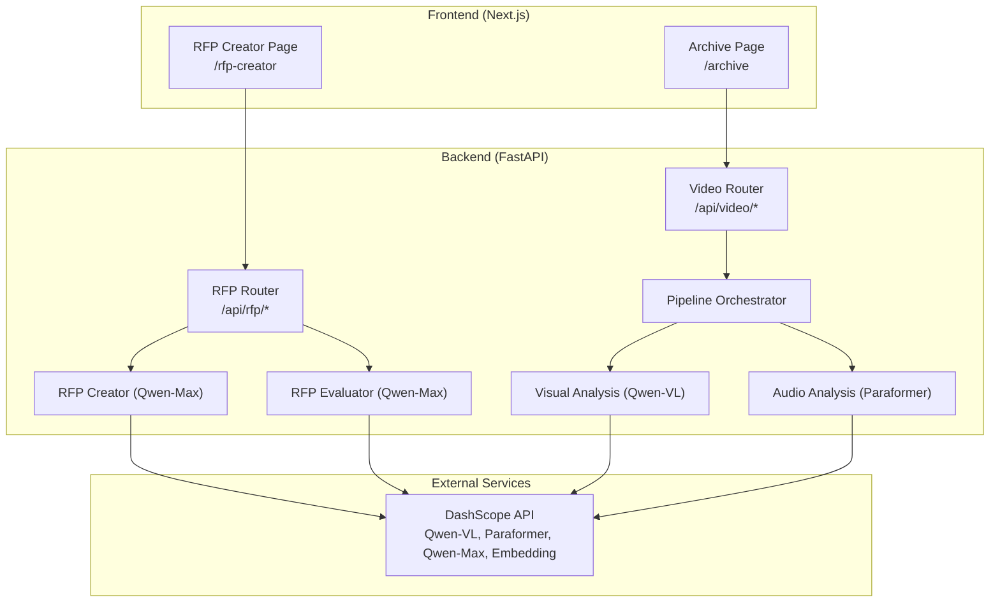
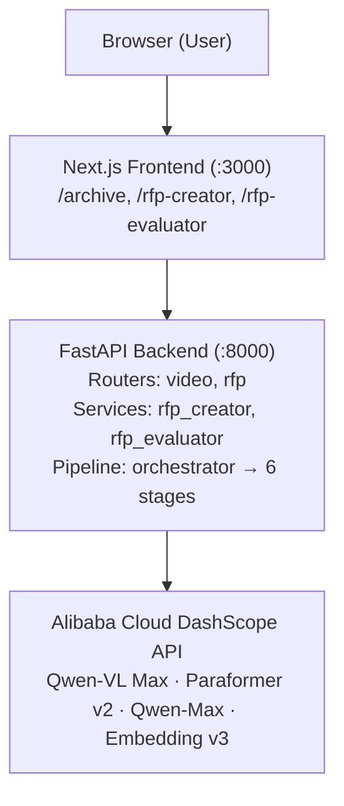
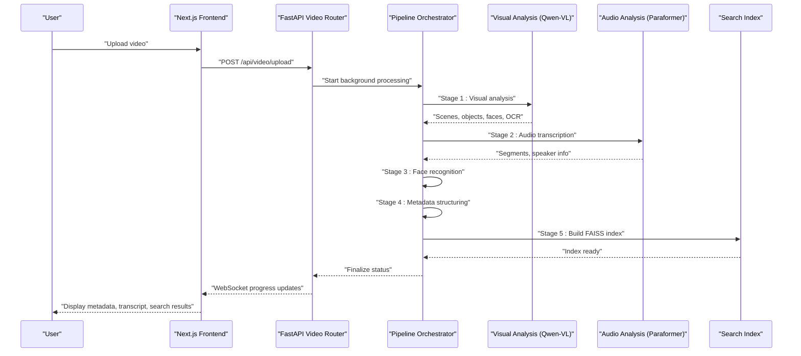
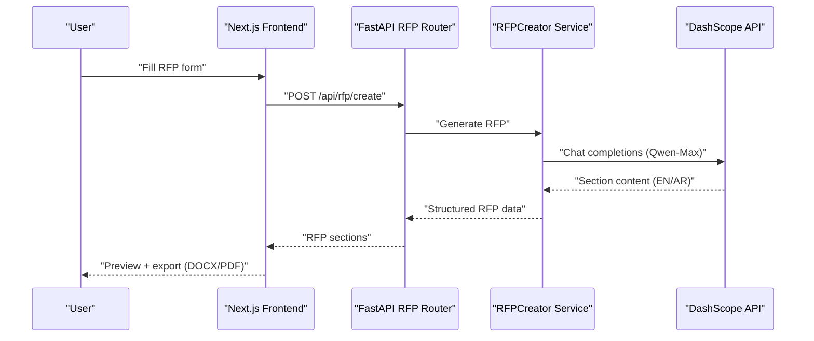
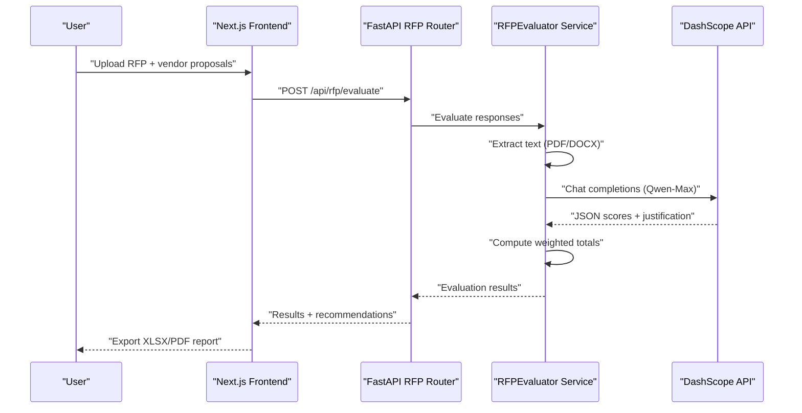
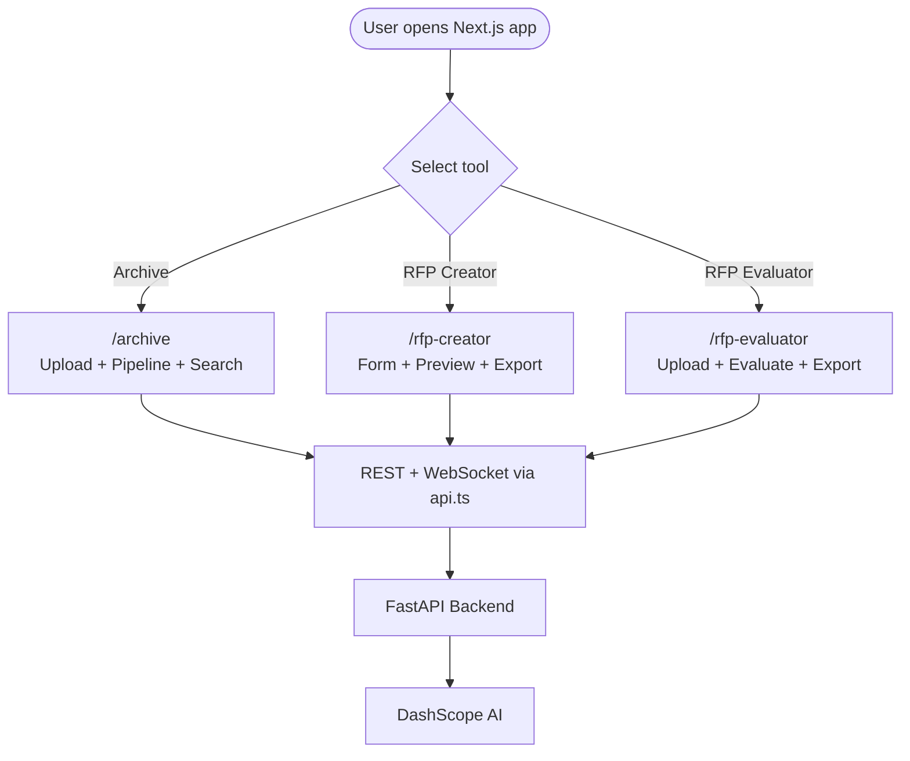
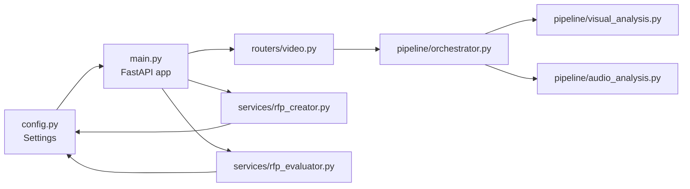

# Project Overview

<cite>
**Referenced Files in This Document**
- [README.md](file://README.md)
- [backend/main.py](file://backend/main.py)
- [backend/config.py](file://backend/config.py)
- [backend/pipeline/orchestrator.py](file://backend/pipeline/orchestrator.py)
- [backend/pipeline/visual_analysis.py](file://backend/pipeline/visual_analysis.py)
- [backend/pipeline/audio_analysis.py](file://backend/pipeline/audio_analysis.py)
- [backend/services/rfp_creator.py](file://backend/services/rfp_creator.py)
- [backend/services/rfp_evaluator.py](file://backend/services/rfp_evaluator.py)
- [backend/routers/video.py](file://backend/routers/video.py)
- [frontend/src/lib/api.ts](file://frontend/src/lib/api.ts)
- [frontend/src/app/archive/page.tsx](file://frontend/src/app/archive/page.tsx)
- [frontend/src/components/archive/VideoUpload.tsx](file://frontend/src/components/archive/VideoUpload.tsx)
- [frontend/src/app/rfp-creator/page.tsx](file://frontend/src/app/rfp-creator/page.tsx)
</cite>

## Table of Contents
1. [Introduction](#introduction)
2. [Project Structure](#project-structure)
3. [Core Components](#core-components)
4. [Architecture Overview](#architecture-overview)
5. [Detailed Component Analysis](#detailed-component-analysis)
6. [Dependency Analysis](#dependency-analysis)
7. [Performance Considerations](#performance-considerations)
8. [Troubleshooting Guide](#troubleshooting-guide)
9. [Conclusion](#conclusion)

## Introduction
Dubai Media × Alibaba Cloud AI is an AI-powered proof-of-concept platform designed to modernize media operations for Dubai Media Incorporated. It delivers three integrated tools:
- Intelligent video archive: automated metadata extraction, multilingual transcripts, face recognition, and semantic search across a searchable media library.
- RFP Creator: AI-generated, bilingual (English/Arabic) Request for Proposals with structured sections, customizable evaluation criteria, and export to DOCX/PDF.
- RFP Evaluator: AI-powered vendor proposal scoring and comparative analysis, producing weighted totals, narrative recommendations, and exportable XLSX/PDF reports.

The platform leverages Alibaba Cloud DashScope’s Qwen model family for multimodal AI processing, enabling semantic search, automatic speech recognition, and advanced text generation. The system is architected with a Next.js frontend and a FastAPI backend, communicating with DashScope APIs for AI-driven insights.

## Project Structure
The repository is organized into two primary layers:
- backend: Python-based FastAPI server implementing AI pipelines, orchestration, and RFP services.
- frontend: Next.js application providing intuitive UIs for video archive processing and RFP authoring/evaluation.

**Diagram sources**
- [backend/main.py:20-44](file://backend/main.py#L20-L44)
- [backend/routers/video.py:23-267](file://backend/routers/video.py#L23-L267)
- [backend/services/rfp_creator.py:67-123](file://backend/services/rfp_creator.py#L67-L123)
- [backend/services/rfp_evaluator.py:39-105](file://backend/services/rfp_evaluator.py#L39-L105)
- [backend/pipeline/orchestrator.py:34-207](file://backend/pipeline/orchestrator.py#L34-L207)
- [backend/pipeline/visual_analysis.py:43-131](file://backend/pipeline/visual_analysis.py#L43-L131)
- [backend/pipeline/audio_analysis.py:22-59](file://backend/pipeline/audio_analysis.py#L22-L59)

**Section sources**
- [README.md:17-40](file://README.md#L17-L40)
- [backend/main.py:15-44](file://backend/main.py#L15-L44)
- [frontend/src/lib/api.ts:164-244](file://frontend/src/lib/api.ts#L164-L244)

## Core Components
- Video Archive Metadata Extraction Pipeline
  - Orchestration: sequential stages for ingestion, visual analysis, audio transcription, face recognition, metadata structuring, and semantic search index building.
  - Multimodal AI processing: Qwen-VL for scene understanding, Paraformer for bilingual ASR, Qwen-Max for metadata structuring, and embedding models for semantic search.
  - Semantic search: FAISS-based indexing enables natural-language queries across scenes and transcripts.
- RFP Creator
  - AI-powered generation of professional, bilingual RFPs with 10 structured sections, customizable evaluation criteria, and timeline.
  - Export to DOCX and PDF using document generation libraries.
- RFP Evaluator
  - Automated vendor evaluation against defined criteria, producing weighted scores, narrative recommendations, and exportable XLSX/PDF reports.
  - Text extraction from PDF/DOCX and robust JSON parsing for evaluation consistency.

Practical example workflows:
- Video upload to archive: user uploads a video → backend starts the pipeline → real-time progress streamed via WebSocket → metadata and transcripts become searchable → semantic search returns relevant segments.
- RFP creation: user fills project details → AI generates bilingual RFP → optional regeneration of specific sections → export to DOCX/PDF.
- RFP evaluation: user uploads RFP + vendor proposals → AI evaluates each vendor → weighted totals and recommendations exported as XLSX/PDF.

**Section sources**
- [README.md:9-13](file://README.md#L9-L13)
- [backend/pipeline/orchestrator.py:44-207](file://backend/pipeline/orchestrator.py#L44-L207)
- [backend/services/rfp_creator.py:124-151](file://backend/services/rfp_creator.py#L124-L151)
- [backend/services/rfp_evaluator.py:230-295](file://backend/services/rfp_evaluator.py#L230-L295)

## Architecture Overview
High-level architecture integrates a Next.js frontend, FastAPI backend, and Alibaba Cloud DashScope AI services. The backend exposes REST endpoints and WebSocket streams for real-time progress, while DashScope powers multimodal AI tasks.

**Diagram sources**
- [README.md:19-40](file://README.md#L19-L40)
- [backend/main.py:20-44](file://backend/main.py#L20-L44)
- [backend/config.py:4-12](file://backend/config.py#L4-L12)

**Section sources**
- [README.md:17-40](file://README.md#L17-L40)
- [backend/main.py:20-44](file://backend/main.py#L20-L44)
- [backend/config.py:4-12](file://backend/config.py#L4-L12)

## Detailed Component Analysis

### Video Archive Pipeline
The pipeline orchestrates six stages, emitting progress via WebSocket and saving intermediate results to disk. It builds a searchable corpus combining scenes, transcripts, and face identifications.

**Diagram sources**
- [backend/routers/video.py:39-92](file://backend/routers/video.py#L39-L92)
- [backend/pipeline/orchestrator.py:44-207](file://backend/pipeline/orchestrator.py#L44-L207)
- [backend/pipeline/visual_analysis.py:43-131](file://backend/pipeline/visual_analysis.py#L43-L131)
- [backend/pipeline/audio_analysis.py:22-59](file://backend/pipeline/audio_analysis.py#L22-L59)

Key implementation highlights:
- Real-time progress streaming via WebSocket endpoints.
- Structured metadata including scenes, objects, landmarks, faces, OCR, and sensitive content.
- Bilingual transcripts with speaker diarization and word-level timestamps.
- Semantic search index construction from scenes and transcripts.

**Section sources**
- [backend/routers/video.py:220-267](file://backend/routers/video.py#L220-L267)
- [backend/pipeline/orchestrator.py:283-314](file://backend/pipeline/orchestrator.py#L283-L314)
- [backend/pipeline/visual_analysis.py:15-40](file://backend/pipeline/visual_analysis.py#L15-L40)
- [backend/pipeline/audio_analysis.py:145-229](file://backend/pipeline/audio_analysis.py#L145-L229)

### RFP Creator
The RFP Creator service generates comprehensive, bilingual RFPs using Qwen-Max. It supports dynamic section generation, tone control, and export to DOCX/PDF.

**Diagram sources**
- [backend/services/rfp_creator.py:124-151](file://backend/services/rfp_creator.py#L124-L151)
- [backend/services/rfp_creator.py:297-381](file://backend/services/rfp_creator.py#L297-L381)
- [backend/services/rfp_creator.py:449-555](file://backend/services/rfp_creator.py#L449-L555)

Implementation notes:
- 10 structured sections with contextual prompts and bilingual output.
- Exporters for DOCX and PDF with professional formatting.
- Regeneration of individual sections with optional instructions.

**Section sources**
- [backend/services/rfp_creator.py:67-123](file://backend/services/rfp_creator.py#L67-L123)
- [backend/services/rfp_creator.py:257-295](file://backend/services/rfp_creator.py#L257-L295)

### RFP Evaluator
The RFP Evaluator ingests RFP and vendor proposals, extracts text, and performs AI-driven scoring with weighted totals and narrative recommendations.

**Diagram sources**
- [backend/services/rfp_evaluator.py:230-295](file://backend/services/rfp_evaluator.py#L230-L295)
- [backend/services/rfp_evaluator.py:351-472](file://backend/services/rfp_evaluator.py#L351-L472)
- [backend/services/rfp_evaluator.py:474-621](file://backend/services/rfp_evaluator.py#L474-L621)

Implementation notes:
- Robust JSON parsing with fallback evaluation when AI output is malformed.
- Exporters for XLSX comparison matrix and PDF narrative report.
- Follow-up questions generation for targeted clarifications.

**Section sources**
- [backend/services/rfp_evaluator.py:133-211](file://backend/services/rfp_evaluator.py#L133-L211)
- [backend/services/rfp_evaluator.py:297-350](file://backend/services/rfp_evaluator.py#L297-L350)

### Frontend Integration and User Experience
The frontend provides dedicated pages for each tool and seamless API integration:
- Archive page: upload, progress streaming, timeline, transcript, metadata, and semantic search.
- RFP Creator page: form submission, live preview, section regeneration, and exports.

**Diagram sources**
- [frontend/src/app/archive/page.tsx:12-128](file://frontend/src/app/archive/page.tsx#L12-L128)
- [frontend/src/app/rfp-creator/page.tsx:8-158](file://frontend/src/app/rfp-creator/page.tsx#L8-L158)
- [frontend/src/lib/api.ts:164-244](file://frontend/src/lib/api.ts#L164-L244)

**Section sources**
- [frontend/src/components/archive/VideoUpload.tsx:26-221](file://frontend/src/components/archive/VideoUpload.tsx#L26-L221)
- [frontend/src/app/archive/page.tsx:12-128](file://frontend/src/app/archive/page.tsx#L12-L128)
- [frontend/src/app/rfp-creator/page.tsx:8-158](file://frontend/src/app/rfp-creator/page.tsx#L8-L158)
- [frontend/src/lib/api.ts:164-244](file://frontend/src/lib/api.ts#L164-L244)

## Dependency Analysis
- Backend dependencies
  - FastAPI application entry and CORS middleware.
  - Configuration via pydantic-settings with environment variables for DashScope keys and model identifiers.
  - Routers for video and RFP endpoints, mounting static uploads and health checks.
- Pipeline and services
  - Orchestrator coordinates stages and manages FAISS search index.
  - Visual analysis and audio analysis integrate with DashScope APIs.
  - RFP services depend on DashScope chat completions and document/spreadsheet exporters.
- Frontend dependencies
  - API client encapsulates typed fetch helpers, WebSocket connections, and convenience methods for each tool.

**Diagram sources**
- [backend/config.py:4-21](file://backend/config.py#L4-L21)
- [backend/main.py:8-38](file://backend/main.py#L8-L38)
- [backend/routers/video.py:17-26](file://backend/routers/video.py#L17-L26)
- [backend/services/rfp_creator.py:30-74](file://backend/services/rfp_creator.py#L30-L74)
- [backend/services/rfp_evaluator.py:29-46](file://backend/services/rfp_evaluator.py#L29-L46)
- [backend/pipeline/orchestrator.py:14-42](file://backend/pipeline/orchestrator.py#L14-L42)
- [backend/pipeline/visual_analysis.py:43-102](file://backend/pipeline/visual_analysis.py#L43-L102)
- [backend/pipeline/audio_analysis.py:22-59](file://backend/pipeline/audio_analysis.py#L22-L59)

**Section sources**
- [backend/config.py:4-21](file://backend/config.py#L4-L21)
- [backend/main.py:8-38](file://backend/main.py#L8-L38)
- [backend/routers/video.py:17-26](file://backend/routers/video.py#L17-L26)
- [backend/services/rfp_creator.py:30-74](file://backend/services/rfp_creator.py#L30-L74)
- [backend/services/rfp_evaluator.py:29-46](file://backend/services/rfp_evaluator.py#L29-L46)
- [backend/pipeline/orchestrator.py:14-42](file://backend/pipeline/orchestrator.py#L14-L42)
- [backend/pipeline/visual_analysis.py:43-102](file://backend/pipeline/visual_analysis.py#L43-L102)
- [backend/pipeline/audio_analysis.py:22-59](file://backend/pipeline/audio_analysis.py#L22-L59)

## Performance Considerations
- Video processing throughput: pipeline stages are asynchronous and stage-specific timeouts are configured; long videos increase processing time and may approach token/time limits for visual analysis.
- ASR latency: transcription is asynchronous with polling; expect delays for long audio tracks.
- Search performance: FAISS indexing scales with segment count; keep top-k reasonable for interactive queries.
- Frontend responsiveness: WebSocket updates and background uploads prevent UI blocking; ensure adequate client resources for large media files.
- Production readiness: consider adding authentication, CDN/object storage URLs for DashScope vision models, and persistent storage for results.

[No sources needed since this section provides general guidance]

## Troubleshooting Guide
Common issues and resolutions:
- Missing DashScope API key: configure DASHSCOPE_API_KEY and verify base URL; services explicitly check for API key presence.
- Large video files: DashScope token/time limits may apply; reduce video length or optimize frame rate/fps.
- ASR async failures: task polling may fail or timeout; verify network connectivity and model availability.
- No persistent database: status/results are stored as JSON files; restarts clear ephemeral state; plan for production persistence.
- Authentication: the MVP lacks user auth; add API key middleware for production deployments.

**Section sources**
- [backend/config.py:5-12](file://backend/config.py#L5-L12)
- [backend/services/rfp_creator.py:76-122](file://backend/services/rfp_creator.py#L76-L122)
- [backend/services/rfp_evaluator.py:48-104](file://backend/services/rfp_evaluator.py#L48-L104)
- [README.md:182-189](file://README.md#L182-L189)

## Conclusion
Dubai Media × Alibaba Cloud AI demonstrates a cohesive AI-powered platform integrating intelligent video archive metadata extraction with automated procurement document generation and evaluation. The modular architecture, robust multimodal AI processing, and bilingual document generation deliver tangible value for media organizations and procurement teams. With minor enhancements—authentication, persistent storage, and CDN/object storage—the platform is well-positioned for production deployment.